# Algorithmic Trading System Constitution

**Version**: 1.1.0  
**Ratified**: 01 November 2025  
**Last Amended**: 01 November 2025

## System Architecture Overview

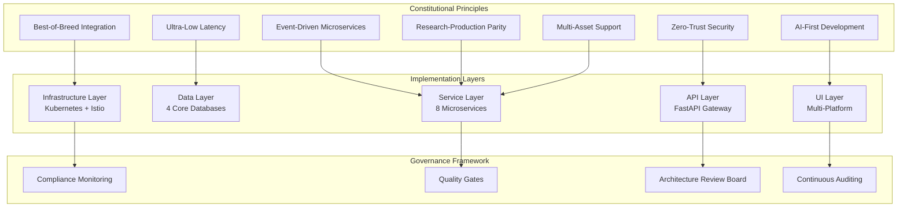

## Core Principles

### I. Best-of-Breed Integration Strategy (NON-NEGOTIABLE)

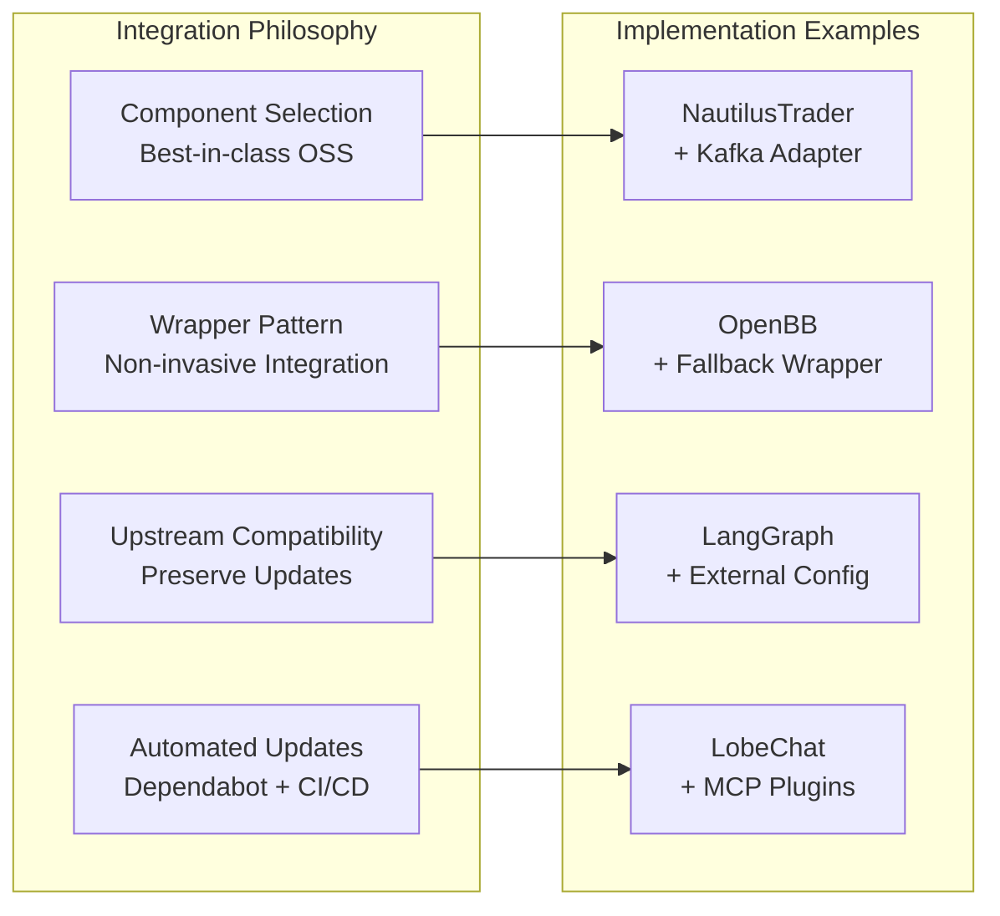

Every component MUST be selected as the best-in-class open-source solution for its specific purpose. Components MUST be integrated non-invasively through wrappers, adapters, and configurations rather than forking. Each integration MUST maintain upstream compatibility, leverage existing package managers (pip, Docker, Helm), and include automated monitoring for upstream updates. Customizations MUST be justified, documented, and implemented through external interfaces only.

**Enforcement Mechanisms:**
- Architecture Review Board approval required for all component selections
- Automated dependency scanning and update notifications
- Quarterly upstream compatibility audits
- Performance impact assessments for all integrations

### II. Event-Driven Microservices Architecture (NON-NEGOTIABLE)

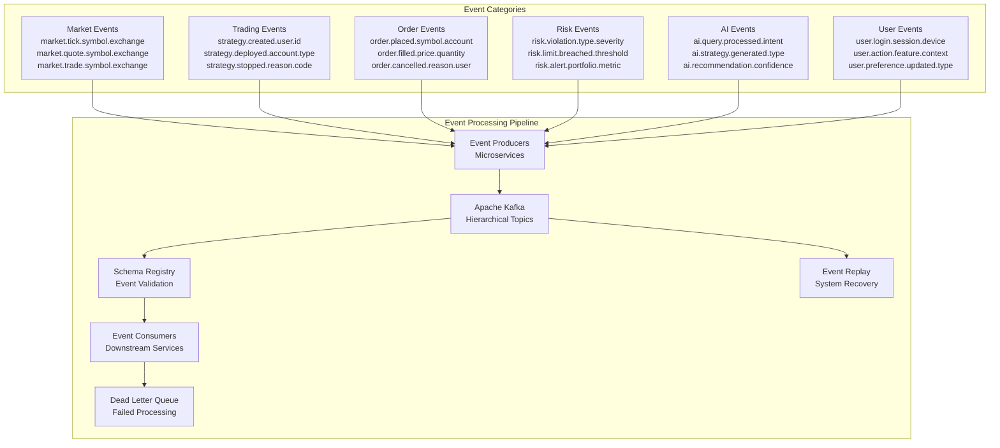

All business capabilities MUST be implemented as independent microservices communicating exclusively through Apache Kafka events. Services MUST be deployable independently, fault-isolated, and support horizontal scaling. Event sourcing MUST be implemented for all state changes with CQRS patterns for read/write separation. Kafka topics MUST follow hierarchical naming conventions (domain.action.entity.source.symbol) with Schema Registry for all schemas.

**Topic Naming Convention:**
- `{domain}.{action}.{entity}.{source}.{symbol}.{exchange}`
- Example: `trading.order.placed.ibkr.aapl.nasdaq`
- Wildcard subscriptions: `trading.order.*` or `*.*.*.ibkr.*`

### III. Ultra-Low Latency Execution (NON-NEGOTIABLE)

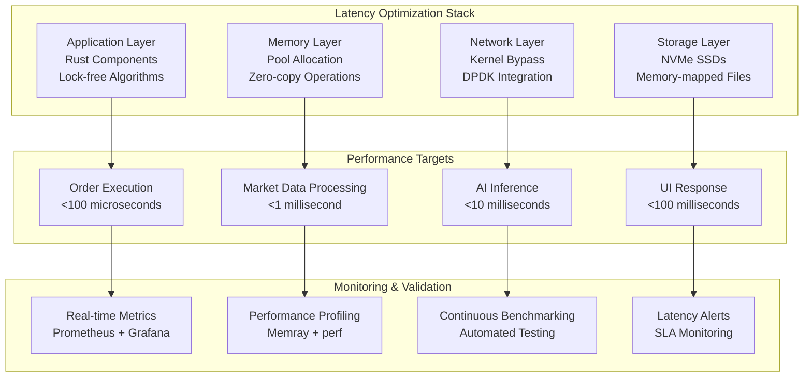

All trading operations MUST achieve sub-100 microsecond execution times for order processing. Performance-critical paths MUST be implemented in Rust where appropriate, with GPU acceleration for applicable workloads. Lock-free algorithms MUST be implemented for high-frequency trading components. Memory profiling via Memray MUST be conducted for all performance-critical services.

**Performance Requirements:**
- Order execution: <100μs (99th percentile)
- Market data processing: <1ms (95th percentile)
- AI inference: <10ms (90th percentile)
- User interface response: <100ms (95th percentile)

### IV. Zero-Trust Security Architecture (NON-NEGOTIABLE)

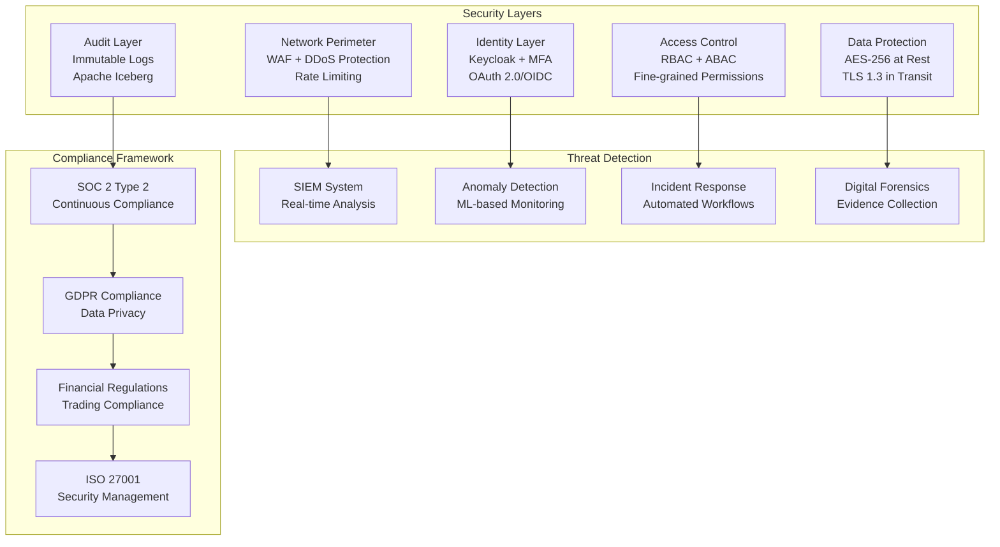

Security MUST be implemented with zero-trust principles, assuming no implicit trust within the network. All communications MUST be encrypted with TLS 1.3, authenticated via OAuth 2.0/OIDC through Keycloak, and authorized via RBAC. Security scanning (Bandit SAST) MUST be integrated into CI/CD pipelines. STRIDE threat modeling MUST be required for all components. All user actions MUST be immutably logged to Apache Iceberg for compliance.

### V. Research-to-Production Parity (NON-NEGOTIABLE)

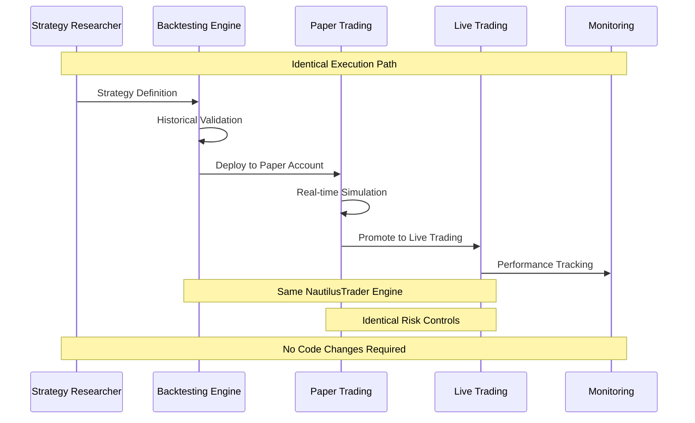

Strategies developed in research environments MUST execute identically in production without code changes. The same NautilusTrader engine MUST be used for both backtesting and live trading, with identical data structures and execution paths. VectorBT MAY be used for broad research, but final validation MUST occur in NautilusTrader. All custom indicators MUST be implemented once and usable across all environments.

### VI. AI-First Development Approach

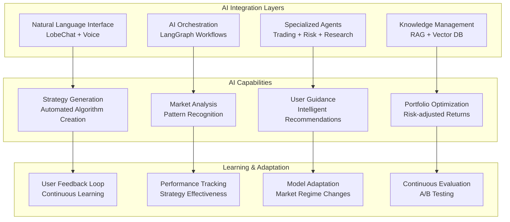

All system components MUST be designed with AI integration as a primary consideration. The Agentic AI Assistant MUST serve as the central orchestration layer for user interactions. Natural language interfaces MUST be provided for all major system functions. AI-powered intelligent user guidance MUST be implemented to assist both novice and professional users.

### VII. Multi-Asset Class Support

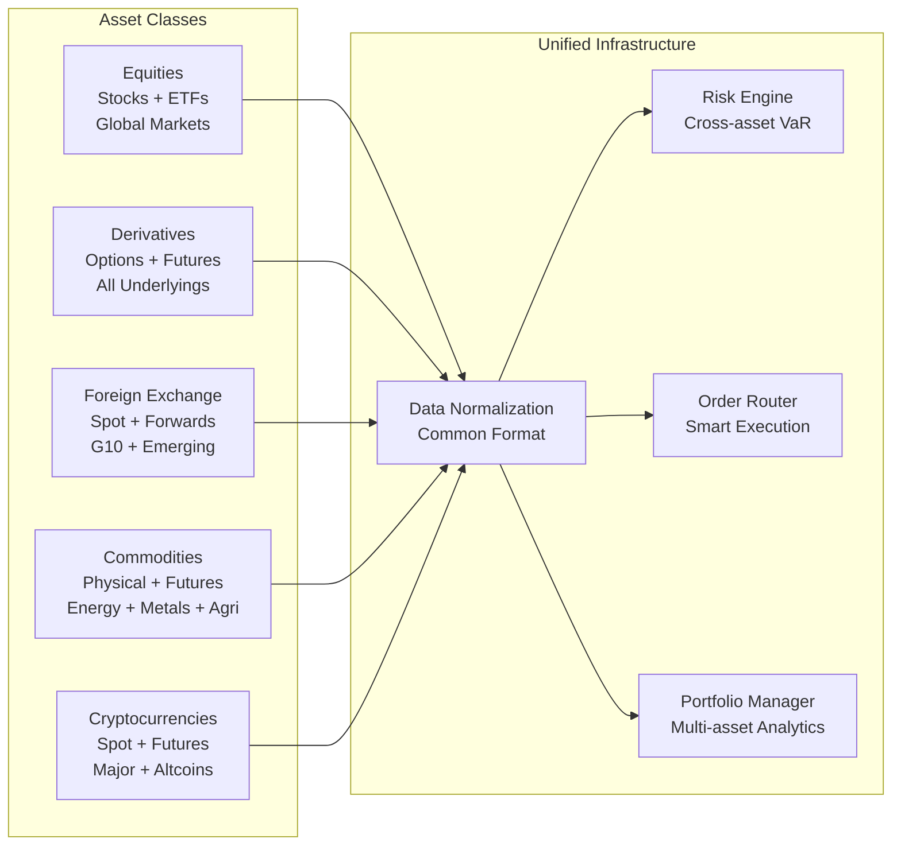

The system MUST natively support all major asset classes: Stocks & ETFs, Futures (Stock/Index/Commodity/Forex), Options (Stock/Index/Commodity/Forex), Spot Forex, and Cryptocurrencies. Asset-specific requirements (options data depth, implied volatility surfaces, margin calculations) MUST be implemented for each class with appropriate risk management controls.

## System Architecture Requirements

### Modular Component Design

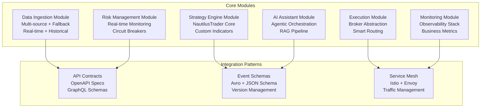

The system MUST be structured into core modules: Data Ingestion (multi-source market data with fallback mechanisms), Strategy Engine (NautilusTrader with custom volume-weighted indicators), Execution Module (broker abstraction layer with Interactive Brokers API integration), Risk Management (real-time risk monitoring with VaR calculations), AI Assistant (agentic orchestration with RAG capabilities), and Monitoring (comprehensive observability with Prometheus/Grafana). Each module MUST be independently deployable with clear API contracts.

### Event-Driven Communication

```mermaid
graph TB
    subgraph "Kafka Infrastructure"
        BROKERS[Kafka Brokers<br/>High Availability Cluster]
        ZOOKEEPER[ZooKeeper Ensemble<br/>Coordination Service]
        SCHEMA_REG[Schema Registry<br/>Confluent Platform]
        CONNECT[Kafka Connect<br/>External Integrations]
    end
    
    subgraph "Topic Architecture"
        MARKET_TOPICS[Market Data Topics<br/>market.{asset}.{exchange}]
        TRADING_TOPICS[Trading Topics<br/>trading.{action}.{account}]
        RISK_TOPICS[Risk Topics<br/>risk.{type}.{severity}]
        AI_TOPICS[AI Topics<br/>ai.{agent}.{action}]
    end
    
    subgraph "Processing Patterns"
        STREAM_PROC[Stream Processing<br/>Kafka Streams]
        EVENT_SOURCING[Event Sourcing<br/>Immutable Log]
        CQRS[CQRS Pattern<br/>Read/Write Separation]
        SAGA[Saga Pattern<br/>Distributed Transactions]
    end
    
    BROKERS --> MARKET_TOPICS
    SCHEMA_REG --> TRADING_TOPICS
    CONNECT --> RISK_TOPICS
    ZOOKEEPER --> AI_TOPICS
    
    MARKET_TOPICS --> STREAM_PROC
    TRADING_TOPICS --> EVENT_SOURCING
    RISK_TOPICS --> CQRS
    AI_TOPICS --> SAGA
```

Apache Kafka MUST serve as the central nervous system with hierarchical topics (trading.order.placed.ibkr.aapl.us) supporting wildcard subscriptions. Event sourcing MUST capture all state changes for audit trails and system replayability. Schema Registry MUST enforce schema evolution with backward/forward compatibility. Event processing MUST support >1M messages/sec with sub-millisecond latency.

### Data Architecture

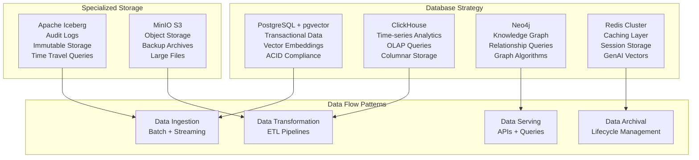

The system MUST use a consolidated database strategy: PostgreSQL+pgvector (structured data and vector embeddings), ClickHouse (time-series analytics), Neo4j (knowledge graph relationships), and Redis (caching and GenAI vectors). Apache Iceberg MUST be used for immutable audit logs. Additional specialized databases MAY be added only when clear performance or capability limitations are demonstrated.

### Intelligent User Guidance

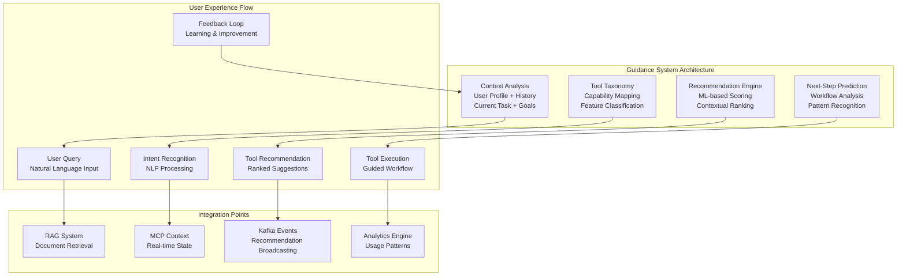

The system MUST implement an Intelligent User Guidance System that proactively recommends appropriate tools and features based on user context, goals, and experience level. The system MUST maintain a structured Tool Taxonomy of platform capabilities and predict next steps after tool invocation. All guidance interactions MUST be published as Kafka events for analytics and improvement.

## Non-Invasive Repository Integration Strategy

### Integration Principles

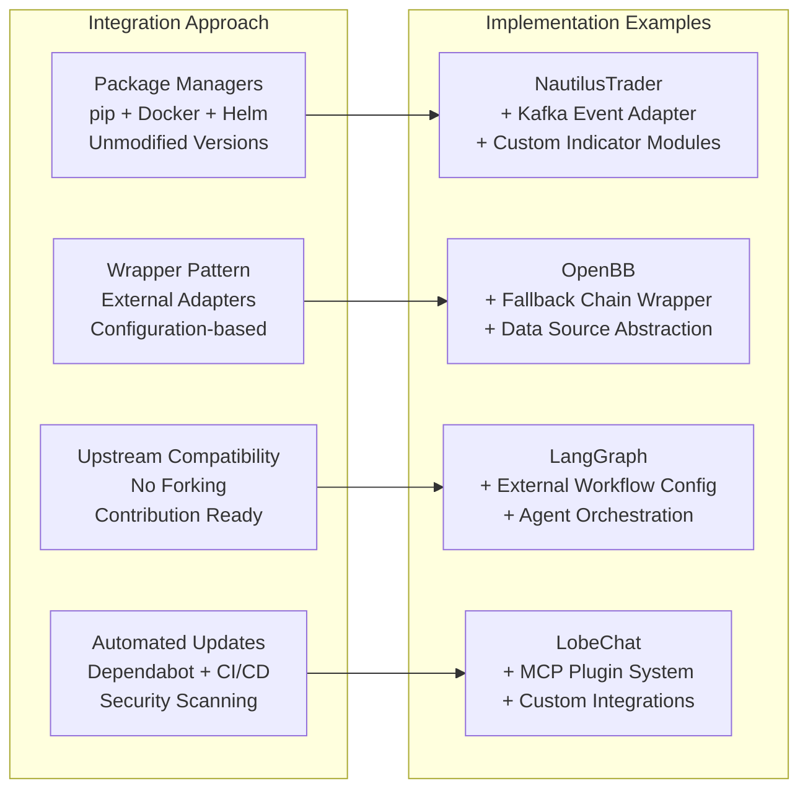

All open-source repositories MUST be integrated without direct code modifications where feasible. This involves installing unmodified versions via package managers (pip, Docker, Helm) and using external wrappers, adapters, plugins, or configurations for customizations. Direct forking is PROHIBITED unless no alternative integration method exists and MUST be approved by the Architecture Review Board.

### Implementation Standards
- For NautilusTrader: Use adapters for Kafka event streaming and custom indicators via external Python modules
- For OpenBB: Implement fallback data chains through wrapper services querying multiple sources  
- For LangGraph: Define ATS workflows via external graph configurations
- For LobeChat: Integrate via MCP plugins and external configuration files

### Benefits and Compliance
This approach MUST facilitate automated dependency updates (Dependabot), vulnerability scanning (Bandit), and CI/CD testing. It MUST ensure compliance with SOC 2 requirements and low-latency trading requirements (<100μs for trades). All integrations MUST reduce maintenance overhead while preserving the ability to contribute improvements upstream.

## Development Standards

### Code Quality Requirements

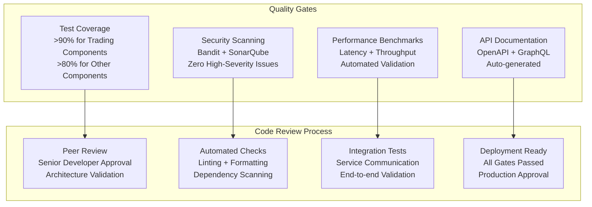

- Test coverage MUST be >90% for all trading-critical components
- All code MUST pass security scanning (Bandit) with zero high-severity issues
- Performance benchmarks MUST be maintained within specified limits
- All APIs MUST be documented with OpenAPI/GraphQL schemas

### Deployment Standards
- All services MUST be containerized using Docker
- Kubernetes manifests MUST be provided for all services
- Infrastructure as Code (Terraform) MUST be used for all cloud resources
- GitOps principles MUST be followed with ArgoCD for deployments

### Security Standards
- Multi-factor authentication MUST be required for all production access
- All secrets MUST be managed via Kubernetes secrets or HashiCorp Vault
- Network policies MUST implement zero-trust principles
- Regular security audits MUST be conducted quarterly

## Compliance and Governance

### Regulatory Compliance

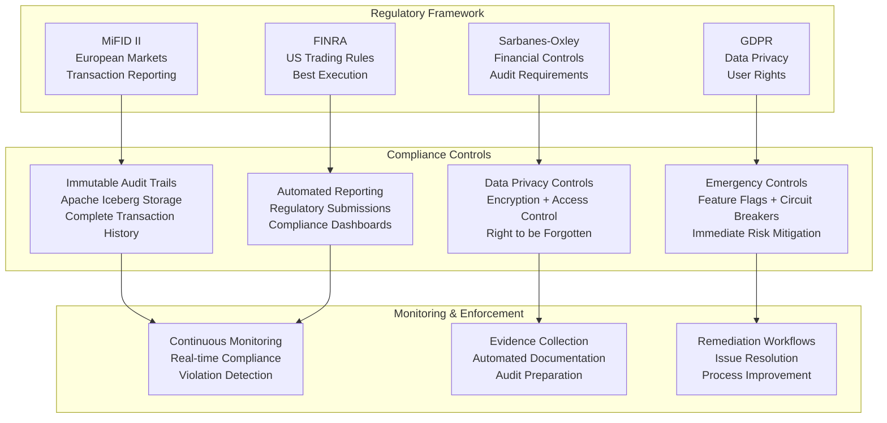

The system MUST comply with relevant financial regulations including MiFID II, SOX, and GDPR. All trading activities MUST be immutably logged with complete audit trails. Data privacy MUST be enforced with GDPR-compliant data handling. Feature flags (Unleash) MUST provide kill-switches for strategies and system components.

### SOC 2 Readiness
Architecture MUST be compliant with SOC 2 Type 2 requirements for Security, Availability, Processing Integrity, Confidentiality, and Privacy. Controls CC6-CC9 MUST be implemented with automated evidence collection. SCIM v2.0 MUST be supported for automated user provisioning from enterprise IdPs.

### Change Management

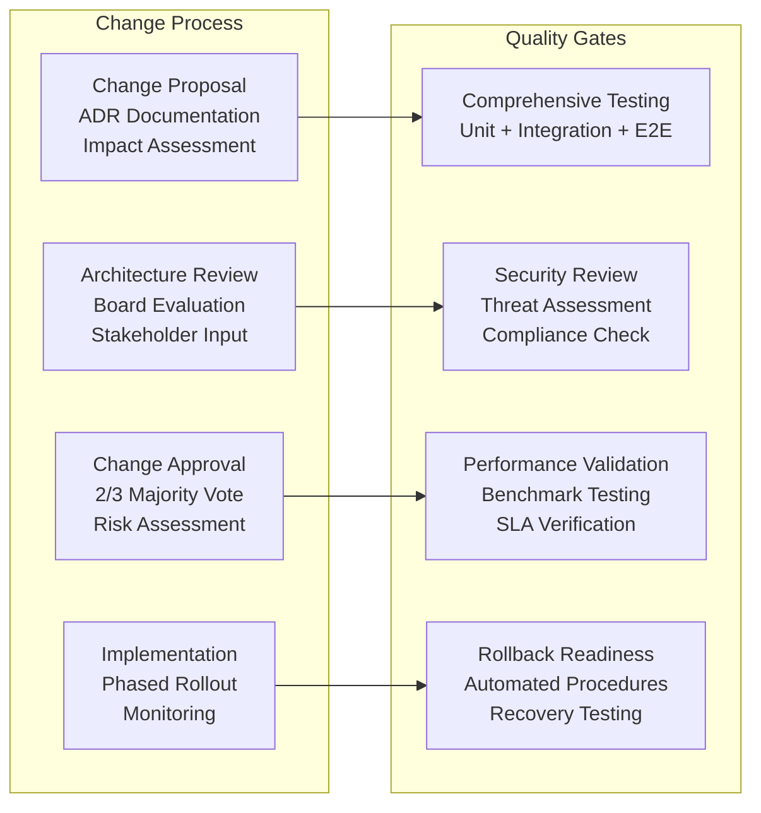

All architectural decisions MUST be documented as ADRs (Architectural Decision Records). Changes to this constitution MUST be approved by a 2/3 majority of the Architecture Review Board. All amendments MUST follow semantic versioning: MAJOR for backward-incompatible changes, MINOR for new principles, PATCH for clarifications.

### Quality Gates
- All code changes MUST require peer review with at least one senior developer approval
- Critical components (trading engine, risk management) MUST require two senior developer approvals
- All deployments MUST include automated rollback capabilities
- Production deployments MUST require Change Control Board approval

## Performance and Scalability Requirements

### Latency Requirements

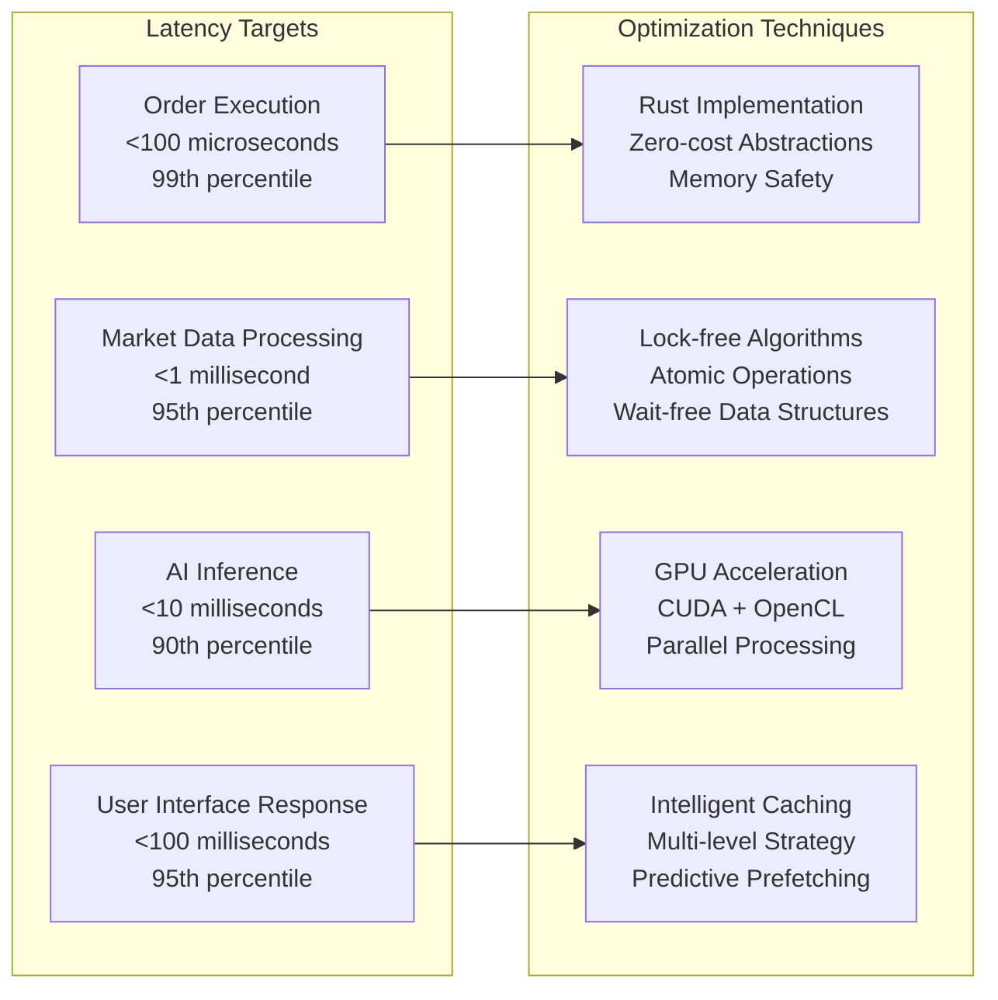

- Order execution: <100 microseconds
- Market data processing: <1 millisecond
- AI inference: <10 milliseconds
- User interface response: <100 milliseconds

### Throughput Requirements
- Market data events: >1M events/second
- Concurrent users: >10,000 during peak hours
- Order processing: >100,000 orders/second
- Event streaming: >1M Kafka messages/second

### Availability Requirements
- System uptime: 99.9% during market hours
- Recovery Time Objective (RTO): <15 minutes
- Recovery Point Objective (RPO): <5 minutes
- Disaster recovery testing: Quarterly

## Technology Stack Standards

### Primary Languages

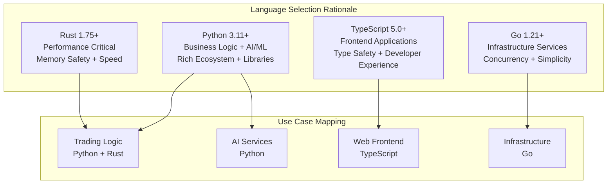

- Python 3.11+ (business logic, AI/ML)
- Rust 1.75+ (performance-critical components)
- TypeScript 5.0+ (frontend applications)
- Go 1.21+ (infrastructure services)

### Core Technologies
- Trading Engine: NautilusTrader
- Event Bus: Apache Kafka with Schema Registry
- Databases: PostgreSQL+pgvector, ClickHouse, Neo4j, Redis
- Container Orchestration: Kubernetes
- Service Mesh: Istio
- Monitoring: Prometheus, Grafana, Jaeger
- AI/ML: LangChain, LangGraph, OpenBB, TA-Lib

### Development Tools
- Version Control: Git with GitFlow branching strategy
- CI/CD: GitHub Actions with automated testing
- Code Quality: SonarQube, Bandit, pytest
- Documentation: Markdown with automated generation
- IDE Integration: Kilo Code for VS Code

---

**Authority**: This constitution supersedes all other development practices and guidelines. All architectural decisions MUST comply with these principles. No exceptions may be granted without explicit Architecture Review Board approval and documented justification.

**Enforcement**: Violations of NON-NEGOTIABLE principles will result in immediate code rejection and mandatory remediation. All team members are responsible for upholding these standards.