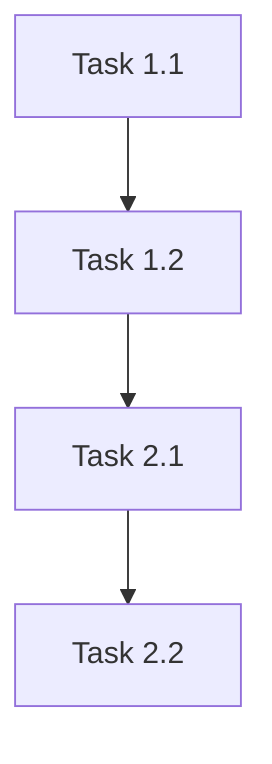

# Implementation Tasks: [FEATURE NAME]

**Feature**: [Link to spec.md]
**Plan**: [Link to plan.md]
**Created**: 01 November 2025
**Status**: Ready for Implementation

## Task Categories

### Phase 1: [Phase Name]
**Duration**: [Estimated weeks]
**Dependencies**: [Prerequisites]

#### Task 1.1: [Task Name]
- **Description**: [Detailed task description]
- **Acceptance Criteria**: 
  - [ ] [Specific deliverable]
  - [ ] [Another deliverable]
- **Estimated Effort**: [Hours/Days]
- **Assigned To**: [Team/Person]
- **Dependencies**: [Other tasks or external dependencies]
- **Priority**: [High/Medium/Low]

#### Task 1.2: [Task Name]
- **Description**: [Detailed task description]
- **Acceptance Criteria**: 
  - [ ] [Specific deliverable]
  - [ ] [Another deliverable]
- **Estimated Effort**: [Hours/Days]
- **Assigned To**: [Team/Person]
- **Dependencies**: [Other tasks or external dependencies]
- **Priority**: [High/Medium/Low]

### Phase 2: [Phase Name]
**Duration**: [Estimated weeks]
**Dependencies**: [Prerequisites]

#### Task 2.1: [Task Name]
- **Description**: [Detailed task description]
- **Acceptance Criteria**: 
  - [ ] [Specific deliverable]
  - [ ] [Another deliverable]
- **Estimated Effort**: [Hours/Days]
- **Assigned To**: [Team/Person]
- **Dependencies**: [Other tasks or external dependencies]
- **Priority**: [High/Medium/Low]

## Cross-Cutting Tasks

### Documentation
- [ ] [Documentation task]
- [ ] [Another documentation task]

### Testing
- [ ] [Testing task]
- [ ] [Another testing task]

### DevOps
- [ ] [DevOps task]
- [ ] [Another DevOps task]

## Risk Mitigation Tasks

### High-Risk Areas
- [ ] [Risk mitigation task]
- [ ] [Another risk mitigation task]

## Definition of Done

### Code Quality
- [ ] Code review completed and approved
- [ ] Unit tests written and passing (>90% coverage)
- [ ] Integration tests written and passing
- [ ] Security scan passed (no high-severity issues)
- [ ] Performance benchmarks met

### Documentation
- [ ] API documentation updated
- [ ] User documentation updated
- [ ] Technical documentation updated
- [ ] Deployment documentation updated

### Deployment
- [ ] Deployed to development environment
- [ ] Deployed to staging environment
- [ ] Production deployment checklist completed
- [ ] Monitoring and alerting configured

## Task Dependencies

## Effort Summary

| Phase | Tasks | Estimated Effort | Team Size | Duration |
|-------|-------|------------------|-----------|----------|
| Phase 1 | [Number] | [Hours] | [People] | [Weeks] |
| Phase 2 | [Number] | [Hours] | [People] | [Weeks] |
| **Total** | **[Number]** | **[Hours]** | **[People]** | **[Weeks]** |