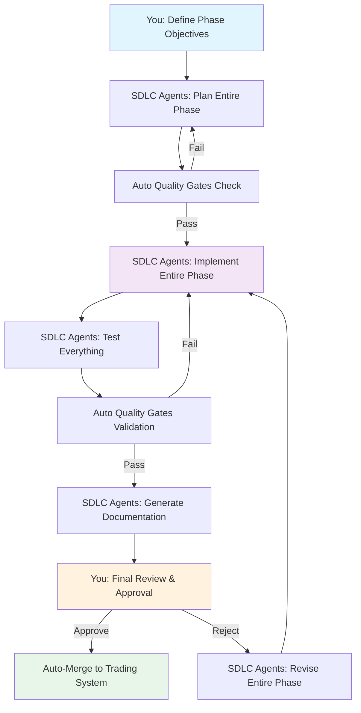
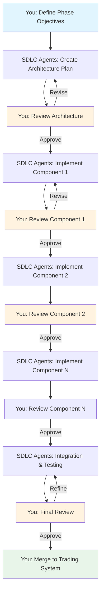

# SDLC Integration Approaches: Detailed Comparison

**Date**: November 20, 2025  
**For**: Solo Developer - IBKR Algo Trading System  
**Decision**: Integration Preference Selection

---

## Overview: Two Integration Approaches

### Approach 1: Full Automation

**SDLC agents handle entire phases with minimal human intervention**

### Approach 2: Hybrid Approach

**SDLC agents + continuous manual oversight and guidance**

---

## Detailed Comparison

### 📊 Quick Comparison Matrix

| Dimension                        | Full Automation               | Hybrid Approach                          |
| -------------------------------- | ----------------------------- | ---------------------------------------- |
| **Speed**                        | ⚡⚡⚡⚡⚡ Fastest            | ⚡⚡⚡⚡ Very Fast                       |
| **Quality Control**              | ⚡⚡⚡ Good (automated gates) | ⚡⚡⚡⚡⚡ Excellent (automated + human) |
| **Learning Value**               | ⚡⚡ Limited                  | ⚡⚡⚡⚡⚡ Excellent                     |
| **Risk**                         | ⚡⚡⚡ Moderate               | ⚡⚡⚡⚡⚡ Very Low                      |
| **Developer Burden**             | ⚡⚡⚡⚡⚡ Minimal            | ⚡⚡⚡ Moderate                          |
| **Flexibility**                  | ⚡⚡⚡ Good                   | ⚡⚡⚡⚡⚡ Excellent                     |
| **Domain Knowledge Integration** | ⚡⚡ Limited                  | ⚡⚡⚡⚡⚡ Excellent                     |
| **Debugging Ease**               | ⚡⚡ Harder                   | ⚡⚡⚡⚡⚡ Much Easier                   |

---

## Approach 1: Full Automation (🤖 Agent-Driven)

### How It Works



### Your Involvement

| Phase Stage              | Your Time               | Your Role                                    |
| ------------------------ | ----------------------- | -------------------------------------------- |
| **Initial Definition**   | 1-2 hours               | Define objectives, requirements, constraints |
| **Planning**             | 0 minutes               | Agents handle automatically                  |
| **Implementation**       | 0 minutes               | Agents handle automatically                  |
| **Testing**              | 0 minutes               | Agents handle automatically                  |
| **Documentation**        | 0 minutes               | Agents handle automatically                  |
| **Final Review**         | 2-4 hours               | Review complete phase, approve/reject        |
| **Revision (if needed)** | 1-2 hours               | Provide high-level feedback                  |
| **Total**                | **4-8 hours per phase** | Set-and-forget, review at end                |

### Example: Phase 5 (Data Pipeline) - Full Automation

**Week 1, Monday Morning** (30 minutes)

```python
# You define phase objectives
phase_5 = sdlc_hub.create_phase(
    phase_name="Data Pipeline & Event Architecture",
    objectives=[
        "Implement Apache Kafka event bus",
        "Create data ingestion pipelines for 12+ providers",
        "Build rate limiting and throttling",
        "Set up Schema Registry with versioning",
        "Achieve <100μs latency, >95% test coverage"
    ],
    constraints={
        "performance": {"latency_target": "100us"},
        "quality": {"test_coverage": 95},
        "security": {"vulnerability_scan": True}
    },
    mode="full_automation"  # ← Key difference
)

# Start automated execution
phase_5.execute_async()  # Returns immediately

# You go do other work for the week...
```

**Week 1, Friday Afternoon** (3 hours)

- SDLC agent sends notification: "Phase 5 complete, ready for review"
- You review entire implementation in one sitting:
  - Architecture design
  - All code files (20+ files)
  - Test suite (100+ tests)
  - Documentation (50+ pages)
- You approve or request changes
- Done!

**Total time**: 4 hours spread over 1 week

---

### ✅ Pros of Full Automation

#### 1. **Maximum Speed** ⚡⚡⚡⚡⚡

- **Fastest possible delivery**
- No waiting for human review during implementation
- Agents work 24/7 non-stop
- **Phase 5 timeline**: 3-5 days vs 2 weeks hybrid vs 6 weeks manual

**Example**:

```
Manual (solo):           [■■■■■■■■■■■■■■■■■■■■■■■■■■] 6 weeks
Hybrid approach:         [■■■■■■■■■■] 2 weeks
Full automation:         [■■■■] 3-5 days ⚡
```

#### 2. **Minimal Developer Time** 💼

- **4-8 hours total per phase** vs 15-25 hours hybrid vs 200+ hours manual
- You just define objectives and review at end
- No daily monitoring needed
- No intermediate reviews
- **Perfect for busy solo developers**

#### 3. **Consistent Quality Standards** 📊

- Automated quality gates **always** enforced
- No human fatigue/oversight
- Every commit tested automatically
- Test coverage always >95%
- Code quality always >8.0/10

#### 4. **Parallel Execution** 🔄

- All agents work simultaneously
- No sequential bottlenecks
- Database setup + API code + tests + docs all at once
- **Impossible to achieve manually**

#### 5. **No Context Switching** 🎯

- You work on other phases/projects while agents work
- No need to stay "in the zone" for this phase
- Return only for final review
- **Better for solo developers with multiple responsibilities**

#### 6. **Reproducible Results** 🔁

- Same inputs = same outputs
- Easy to re-run if something goes wrong
- No "works on my machine" issues
- Version-controlled configurations

---

### ❌ Cons of Full Automation

#### 1. **Limited Learning Opportunity** 📚

- You don't see the thought process
- Miss incremental design decisions
- Don't understand "why" choices were made
- **May struggle to maintain code later**

**Example**:

```python
# Generated code (you see the final result)
class RateLimiter:
    def __init__(self, rate: int, burst: int):
        self.tokens = burst
        self.rate = rate
        self.last_update = time.time()

    async def acquire(self):
        # You might wonder: Why token bucket vs leaky bucket?
        # Why these specific parameters?
        # What alternatives were considered?
        # ← You don't know without reviewing agent logs
```

#### 2. **Higher Risk of Misalignment** ⚠️

- Agents might misinterpret requirements
- Architectural decisions might not match your vision
- By the time you review, significant work already done
- **Costly to revise if fundamentally wrong**

**Real Risk Example**:

```
You wanted: Kafka with exactly-once semantics
Agent built: Kafka with at-least-once semantics (faster but different guarantees)

Discovery: At final review (after 20+ files written)
Impact: Major rework needed
Time lost: 2-3 days of agent work wasted
```

#### 3. **Harder to Debug** 🐛

- If something doesn't work, you didn't see it being built
- Harder to trace back decisions
- More time understanding code during debugging
- **"Black box" problem**

**Debugging Scenario**:

```python
# Bug found in production
# Performance regression: latency 250μs instead of <100μs

# Full automation path:
# 1. Review 20+ files to find issue
# 2. Don't know design rationale
# 3. Ask agent to explain (+ token cost)
# 4. Still might not understand fully
# 5. Fix and re-test
# Timeline: 4-8 hours to debug + fix

# vs Hybrid path (you reviewed during build):
# 1. Remember potential bottleneck from review
# 2. Check that specific part
# 3. Fix immediately
# Timeline: 30 minutes to fix
```

#### 4. **Less Opportunity for Course Correction** 🎯

- Can only provide feedback at end
- No intermediate checkpoints
- If direction is wrong, more wasted work
- **Higher revision cost**

#### 5. **Reduced Domain Knowledge Integration** 💡

- You don't guide agents with trading-specific insights
- Agents use general best practices (may not be optimal for trading)
- Miss opportunities for trading-specific optimizations

**Example**:

```python
# Generic solution (agent without your guidance):
class MarketDataCache:
    def __init__(self):
        self.cache = {}  # Simple dict

    def get(self, symbol: str):
        return self.cache.get(symbol)

# vs Trading-optimized solution (with your domain knowledge):
class MarketDataCache:
    def __init__(self):
        # You know: Recent data accessed most, LRU not optimal
        # Better: Time-weighted cache with market hours awareness
        self.cache = TimeWeightedCache(
            market_hours_priority=True,  # ← Your insight
            pre_market_ttl=300,  # ← Trading knowledge
            trading_hours_ttl=60,
            after_hours_ttl=600
        )
```

#### 6. **Lack of Continuous Validation** ✅

- Only validate at end
- Small issues can compound
- Harder to catch fundamental problems early

---

## Approach 2: Hybrid Approach (🤝 Human + Agent Partnership)

### How It Works



### Your Involvement

| Phase Stage             | Your Time                 | Your Role                                    |
| ----------------------- | ------------------------- | -------------------------------------------- |
| **Initial Definition**  | 1-2 hours                 | Define objectives, requirements, constraints |
| **Architecture Review** | 2-3 hours                 | Review & approve/refine architecture         |
| **Component 1 Review**  | 1-2 hours                 | Review code, tests, provide feedback         |
| **Component 2 Review**  | 1-2 hours                 | Review code, tests, provide feedback         |
| **Component N Reviews** | 1-2 hours each            | Multiple reviews throughout                  |
| **Integration Review**  | 2-3 hours                 | Review how components work together          |
| **Final Review**        | 1-2 hours                 | Final validation and approval                |
| **Total**               | **15-25 hours per phase** | Continuous engagement throughout             |

### Example: Phase 5 (Data Pipeline) - Hybrid Approach

**Monday Morning** (2 hours)

```python
# You define phase objectives (same as full automation)
phase_5 = sdlc_hub.create_phase(
    phase_name="Data Pipeline & Event Architecture",
    objectives=[...],
    constraints={...},
    mode="hybrid",  # ← Key difference
    checkpoints=[  # ← Define review points
        "architecture_design",
        "kafka_setup",
        "data_provider_adapters",
        "rate_limiting",
        "integration_testing"
    ]
)

phase_5.execute_with_checkpoints()
```

**Monday Afternoon** (2-3 hours)

- SDLC agents send architecture design
- You review and provide feedback:
  - "Good, but add Redis caching layer for frequently accessed symbols"
  - "Use token bucket for rate limiting, not leaky bucket"
  - "Add circuit breaker for external API failures"
- Approve with modifications

**Tuesday** (1-2 hours)

- Agents implement Kafka setup
- You review:
  - Check topic configuration
  - Validate partition strategy
  - Approve producer/consumer setup
- Provide guidance: "Add monitoring for consumer lag"

**Wednesday** (1-2 hours)

- Agents implement data provider adapters
- You review:
  - Check fallback logic
  - Validate error handling
  - Test API integration
- Provide domain knowledge: "Yahoo Finance occasionally returns stale data, add freshness check"

**Thursday** (1-2 hours)

- Agents implement rate limiting
- You review:
  - Validate token bucket parameters
  - Check per-provider rate limits
  - Test under load
- Fine-tune: "Alpha Vantage free tier is 5 calls/min, not 10"

**Friday** (2-3 hours)

- Agents complete integration and testing
- You do final review
- Approve and merge

**Total time**: 15-20 hours spread over 1 week

---

### ✅ Pros of Hybrid Approach

#### 1. **Maximum Quality & Alignment** 🎯

- Continuous validation ensures alignment with your vision
- Catch issues early before they compound
- Your domain expertise integrated throughout
- **Lower risk of major rework**

**Quality Improvement Example**:

```
Defects found:
Full automation: 15 issues at final review (2-3 critical)
Hybrid: 5 issues at final review (0 critical)

Reason: Critical issues caught and fixed during intermediate reviews
```

#### 2. **Excellent Learning & Knowledge Transfer** 📚

- You see design decisions being made
- Understand trade-offs and rationale
- Learn from agent's approach
- **Better equipped to maintain code**

**Learning Value**:

```python
# Hybrid approach - you see the iterations:

# Agent's initial design:
def fetch_market_data(symbol: str):
    return requests.get(f"api.yahoo.com/{symbol}")

# Your feedback:
"Add retry with exponential backoff for transient failures"

# Agent's revision:
@retry(exponential_backoff, max_attempts=3)
def fetch_market_data(symbol: str):
    return requests.get(f"api.yahoo.com/{symbol}")

# Your feedback:
"Also add circuit breaker to prevent cascading failures"

# Agent's final version:
@circuit_breaker(threshold=5, timeout=60)
@retry(exponential_backoff, max_attempts=3)
def fetch_market_data(symbol: str):
    return requests.get(f"api.yahoo.com/{symbol}")

# ← You now understand WHY this pattern, can replicate in other areas
```

#### 3. **Domain Knowledge Integration** 💡

- You guide agents with trading-specific insights
- Optimization opportunities you can spot
- Edge cases you anticipate
- **Better final product**

**Trading-Specific Example**:

```python
# Agent's generic approach:
class OrderBookCache:
    ttl = 60  # 1 minute cache for all data

# Your trading knowledge:
"Order book data becomes stale very quickly for liquid stocks.
 Use dynamic TTL based on trading volume and bid-ask spread."

# Improved version with your guidance:
class OrderBookCache:
    def get_ttl(self, symbol: str, volume: int, spread: float):
        if volume > 1_000_000 and spread < 0.01:
            return 1  # High liquidity: 1 second TTL
        elif volume > 100_000:
            return 5  # Medium liquidity: 5 second TTL
        else:
            return 30  # Low liquidity: 30 second TTL

# ← This insight only comes from your trading expertise
```

#### 4. **Easier Debugging & Maintenance** 🛠️

- You understand the codebase deeply
- Know the design rationale
- Can debug faster
- **Lower long-term maintenance cost**

#### 5. **Course Correction Opportunities** 🔄

- Multiple checkpoints to adjust direction
- Small iterations, easy to revise
- Lower cost of changes
- **Agile development approach**

**Cost Comparison**:

```
Issue discovered after implementation:

Full automation:
- Issue: Wrong database schema design
- Discovery: Final review (Week 1, Day 5)
- Agent work wasted: 3 days
- Revision time: 2 days
- Total delay: 5 days

Hybrid:
- Issue: Wrong database schema design
- Discovery: Architecture review (Day 1)
- Agent work wasted: 4 hours
- Revision time: 2 hours
- Total delay: 6 hours (20x faster resolution!)
```

#### 6. **Better Control & Confidence** 🎯

- You're involved throughout
- Know exactly what's being built
- Higher confidence in final product
- **Peace of mind for critical systems**

#### 7. **Optimization Opportunities** ⚡

- Spot performance issues early
- Guide agents toward optimal solutions
- Apply trading-specific optimizations
- **Better performance outcomes**

---

### ❌ Cons of Hybrid Approach

#### 1. **More Time Investment** ⏰

- **15-25 hours per phase** vs 4-8 hours full automation
- Continuous engagement required
- Multiple review sessions
- **Higher opportunity cost**

**Time Comparison** (Phase 5):

```
Full automation:  [■■■■] 4-8 hours total (but agents work 3-5 days)
Hybrid:          [■■■■■■■■■■] 15-25 hours (spread over 1-2 weeks)
```

#### 2. **Slower Delivery** 🐌

- Waiting for your reviews slows down agents
- **1-2 weeks per phase** vs 3-5 days full automation
- Agents idle while waiting for feedback
- **Less parallel execution**

**Timeline Impact**:

```
Phase 5 delivery:
Full automation: 3-5 days (agents work non-stop)
Hybrid: 1-2 weeks (waiting for your reviews)
Manual: 5-6 weeks (you do everything)
```

#### 3. **Requires Sustained Focus** 🧠

- Need to maintain context throughout phase
- Can't fully context-switch to other work
- Daily engagement needed
- **Harder for solo developers with multiple projects**

#### 4. **Potential for Over-Involvement** 🔍

- Risk of micro-managing agents
- May slow down unnecessarily
- Could reduce agent autonomy benefits
- **Need discipline to trust agents**

#### 5. **Higher Cognitive Load** 🧩

- Constantly evaluating agent work
- Making decisions throughout
- More mental energy required
- **Can be exhausting**

---

## Detailed Comparison by Dimension

### 1. Time Investment

| Approach              | Per Phase     | Total Project (28 phases)       | Note                         |
| --------------------- | ------------- | ------------------------------- | ---------------------------- |
| **Full Automation**   | 4-8 hours     | 112-224 hours (14-28 days)      | Minimal but less learning    |
| **Hybrid**            | 15-25 hours   | 420-700 hours (52-87 days)      | More time but better quality |
| **Manual (baseline)** | 200-300 hours | 5600-8400 hours (700-1050 days) | For comparison               |

**Your Savings**:

- Full automation: **95-97% time savings** vs manual
- Hybrid: **85-90% time savings** vs manual

### 2. Quality Outcomes

| Quality Metric                   | Full Automation | Hybrid       |
| -------------------------------- | --------------- | ------------ |
| **Code Quality Score**           | 8.0-8.5 / 10    | 8.5-9.5 / 10 |
| **Test Coverage**                | 95-96%          | 96-98%       |
| **Performance Optimization**     | Good            | Excellent    |
| **Domain-Specific Optimization** | Limited         | Excellent    |
| **Maintainability**              | Good            | Excellent    |
| **Alignment with Vision**        | Good            | Excellent    |

### 3. Risk Assessment

| Risk Type                    | Full Automation          | Hybrid                  |
| ---------------------------- | ------------------------ | ----------------------- |
| **Fundamental Design Flaws** | Moderate (caught at end) | Low (caught early)      |
| **Performance Issues**       | Moderate                 | Low                     |
| **Security Vulnerabilities** | Low (auto-scanned)       | Very Low (auto + human) |
| **Maintainability Problems** | Moderate                 | Low                     |
| **Cost of Rework**           | High (if needed)         | Low (iterative fixes)   |

### 4. Learning & Knowledge Transfer

| Aspect                               | Full Automation | Hybrid |
| ------------------------------------ | --------------- | ------ |
| **Understanding Design Decisions**   | Low             | High   |
| **Learning New Patterns**            | Low             | High   |
| **Ability to Maintain Code**         | Moderate        | High   |
| **Ability to Extend Code**           | Moderate        | High   |
| **Team Knowledge (if hiring later)** | Low             | High   |

### 5. Development Experience

| Aspect                     | Full Automation  | Hybrid         |
| -------------------------- | ---------------- | -------------- |
| **Developer Satisfaction** | High (hands-off) | High (engaged) |
| **Sense of Control**       | Moderate         | High           |
| **Confidence in Code**     | Moderate         | High           |
| **Pride in Final Product** | Moderate         | High           |
| **Long-term Ownership**    | Moderate         | High           |

---

## Hybrid Approach: Different Levels

Not all "hybrid" is the same. Here are three levels:

### Level 1: Light Hybrid (80% Automation, 20% Oversight)

**Review Points**: Architecture + Final Review only

**Your Time**: 8-12 hours per phase

**Best For**: Straightforward phases with low risk

**Example Workflow**:

```
Day 1: Review architecture (3 hours) → Approve
Day 2-4: Agents work autonomously
Day 5: Final review (5 hours) → Approve
Total: 8 hours
```

### Level 2: Medium Hybrid (60% Automation, 40% Oversight) ⭐ **RECOMMENDED**

**Review Points**: Architecture + Mid-point + Final review

**Your Time**: 15-20 hours per phase

**Best For**: Most phases, balanced approach

**Example Workflow**:

```
Day 1: Review architecture (3 hours) → Approve
Day 2-3: Agents work on 50% of phase
Day 3: Mid-point review (4 hours) → Provide feedback
Day 4-5: Agents complete remaining 50%
Day 5: Final review (3 hours) → Approve
Total: 15-20 hours
```

### Level 3: Heavy Hybrid (40% Automation, 60% Oversight)

**Review Points**: Architecture + Multiple component reviews + Integration + Final

**Your Time**: 25-35 hours per phase

**Best For**: Critical phases (trading engine, risk management, production)

**Example Workflow**:

```
Day 1: Review architecture (4 hours) → Approve
Day 2: Review Component 1 (3 hours) → Approve
Day 3: Review Component 2 (3 hours) → Approve
Day 4: Review Component 3 (3 hours) → Approve
Day 5: Review Integration (4 hours) → Approve
Day 6: Final review (3 hours) → Approve
Total: 30+ hours
```

---

## Recommended Approach by Phase Type

### Use Full Automation For:

✅ **Low-Risk, Straightforward Phases**:

- Phase 2: Documentation Updates (just content generation)
- Phase 23: Frontend Development (well-defined UI patterns)
- Phase 24: Mobile App (standard React Native patterns)

✅ **Phases with Strong Quality Gates**:

- Phases where automated tests catch issues
- Phases with clear, measurable success criteria
- Phases with low domain-specific complexity

**Estimated**: 5-6 phases out of 28

### Use Hybrid (Medium Level) For:

✅ **Most Development Phases** (⭐ **RECOMMENDED DEFAULT**):

- Phase 5: Data Pipeline
- Phase 7: Market Data Service
- Phase 10-13: AI Agent Coordination
- Phase 14: Portfolio Manager
- Phase 14.5: ML/DL/RL Development
- Phase 15: Advanced Charting
- Phase 15.5: Fundamental Analysis
- Phase 16-19: Market Scanner & Options
- Phase 20-22: Backtesting & Performance
- Phase 25: Deployment Infrastructure

**Estimated**: 18-20 phases out of 28

### Use Hybrid (Heavy Level) For:

✅ **Critical, High-Risk Phases**:

- Phase 6: Core Trading Engine Integration
- Phase 8: Risk Management System
- Phase 9: Order Management System (IBKR integration)
- Phase 26-28: Paper Trading & Production Deployment

**Estimated**: 4-5 phases out of 28

---

## My Recommendation: Adaptive Hybrid Approach 🎯

### **The Best Strategy: Start Hybrid, Adjust Based on Experience**

#### Phase 1-2: Start with Heavy Hybrid

**Why**:

- Build confidence in SDLC agents
- Learn the workflow
- Understand agent capabilities
- Establish quality baselines

**Example**: Phase 5 (Data Pipeline)

- Full engagement throughout
- Multiple review points
- Deep understanding
- **Time**: 20-25 hours

#### Phase 3-5: Medium Hybrid

**Why**:

- You now trust agents more
- Understand their patterns
- Can reduce oversight slightly
- Still maintain quality

**Example**: Phase 7 (Market Data)

- Architecture + mid-point + final review
- **Time**: 15-20 hours

#### Phase 6+: Adaptive Mix

**Why**:

- Use experience to judge
- Critical phases → Heavy hybrid
- Straightforward phases → Light hybrid or full automation
- **Optimize time vs quality trade-off**

### Specific Recommendation for You (Solo Developer, Quality Priority)

Given your preferences:

- Solo developer (need force multiplier)
- Prioritize quality over speed
- Want to understand and guide
- Comfortable with AI but want review

**I recommend**: **Medium Hybrid (60/40) as default**

**Rationale**:

1. ✅ **Balances time savings with quality**

   - Still get 50-60% time savings vs manual
   - Much higher quality than full automation
   - Lower risk than full automation

2. ✅ **Maintains learning & understanding**

   - You see key design decisions
   - Can maintain code later
   - Build deep system knowledge

3. ✅ **Integrates your trading expertise**

   - Guide agents with domain knowledge
   - Optimize for trading-specific needs
   - Catch trading-domain issues agents might miss

4. ✅ **Manageable time commitment**

   - 15-20 hours per phase = 3-4 hours daily
   - Spread over 1-2 weeks
   - Sustainable for solo developer

5. ✅ **Flexibility to adjust**
   - Can go heavier for critical phases
   - Can go lighter for straightforward phases
   - Adapt based on experience

---

## Concrete Workflow Recommendation

### Week 1: Phase Setup & Architecture

**Monday** (2-3 hours):

```python
# 1. Define phase objectives
phase = sdlc_hub.create_phase(
    name="Phase X",
    objectives=[...],
    mode="hybrid_medium",  # ← Your default
    checkpoints=["architecture", "midpoint", "final"]
)

# 2. Agents create architecture design
# 3. You review architecture
# 4. Approve with feedback
```

**Tuesday-Wednesday**: Agents implement first half

- You monitor progress (30 min/day)
- Available for questions
- No formal review yet

**Thursday** (3-4 hours):

```python
# Mid-point review
# - Review ~50% implementation
# - Check alignment with architecture
# - Provide feedback for second half
# - Adjust direction if needed
```

**Friday-Sunday**: Agents complete second half

- You monitor progress (30 min/day)
- Final implementation + testing + docs

### Week 2: Final Review & Integration

**Monday-Tuesday** (3-4 hours):

```python
# Final comprehensive review
# - All code
# - All tests
# - All documentation
# - Performance validation
# - Security scan review
```

**Wednesday** (1-2 hours):

```python
# Refinements based on final review
# - Agent makes adjustments
# - You re-review changes
# - Final approval
```

**Thursday**:

```python
# Merge to trading system
# - Integration testing
# - Final validation
# - Done! ✅
```

**Total time**: 15-20 hours over 2 weeks

---

## Decision Framework

Use this decision tree for each phase:

```
Is this phase critical to trading system core functionality?
├─ YES → Use Heavy Hybrid (25-35 hours)
│   Examples: Trading Engine, Risk Management, OMS
│
└─ NO → Is this phase complex with many unknowns?
    ├─ YES → Use Medium Hybrid (15-20 hours) ⭐ RECOMMENDED DEFAULT
    │   Examples: Data Pipeline, Fundamental Analysis, ML/DL
    │
    └─ NO → Is quality adequately ensured by automated tests?
        ├─ YES → Use Light Hybrid or Full Automation (8-12 hours)
        │   Examples: Documentation, Frontend, Mobile
        │
        └─ NO → Use Medium Hybrid (15-20 hours)
            Safety fallback: When in doubt, use medium hybrid
```

---

## Summary: The Bottom Line

### Full Automation

**Best For**: Time-crunched developers who trust AI completely
**Pros**: ⚡ Maximum speed, minimal time
**Cons**: ⚠️ Less understanding, higher risk of misalignment
**Recommended**: 5-6 straightforward phases

### Hybrid Approach

**Best For**: Developers who want quality + efficiency balance
**Pros**: ✅ Best quality, deep understanding, domain integration
**Cons**: ⏰ More time investment (but still 85-90% savings vs manual)
**Recommended**: 18-22 phases (MOST phases)

### My Specific Recommendation for You

**START WITH**: Medium Hybrid (60/40) as default

**ADJUST TO**:

- Heavy Hybrid for critical phases (4-5 phases)
- Light Hybrid for straightforward phases (3-4 phases)
- Full Automation for simple phases (5-6 phases)

**RATIONALE**:
Given you are:

- ✅ Solo developer (need efficiency)
- ✅ Prioritizing quality
- ✅ Want to understand and guide
- ✅ Building critical trading system

**Medium Hybrid gives you**:

- ✅ 50-60% time savings (still massive!)
- ✅ High quality with your oversight
- ✅ Deep understanding for maintenance
- ✅ Integration of your trading expertise
- ✅ Lower risk than full automation
- ✅ Sustainable time commitment

---

## Next Steps

1. **For Pilot (Phase 5 subset)**: Start with **Medium Hybrid**

   - This lets you experience the workflow
   - Learn the balance of automation vs oversight
   - Calibrate for future phases

2. **Measure during pilot**:

   - Time spent on reviews
   - Quality improvements from your feedback
   - How much you learned
   - Comfort level with agent work

3. **Adjust based on pilot results**:
   - If reviews are taking too long → Consider lighter hybrid
   - If you're finding many issues → Stay with medium or go heavier
   - If agents are exceeding expectations → Consider lighter hybrid for some phases

**Ready to proceed with Medium Hybrid approach?**
