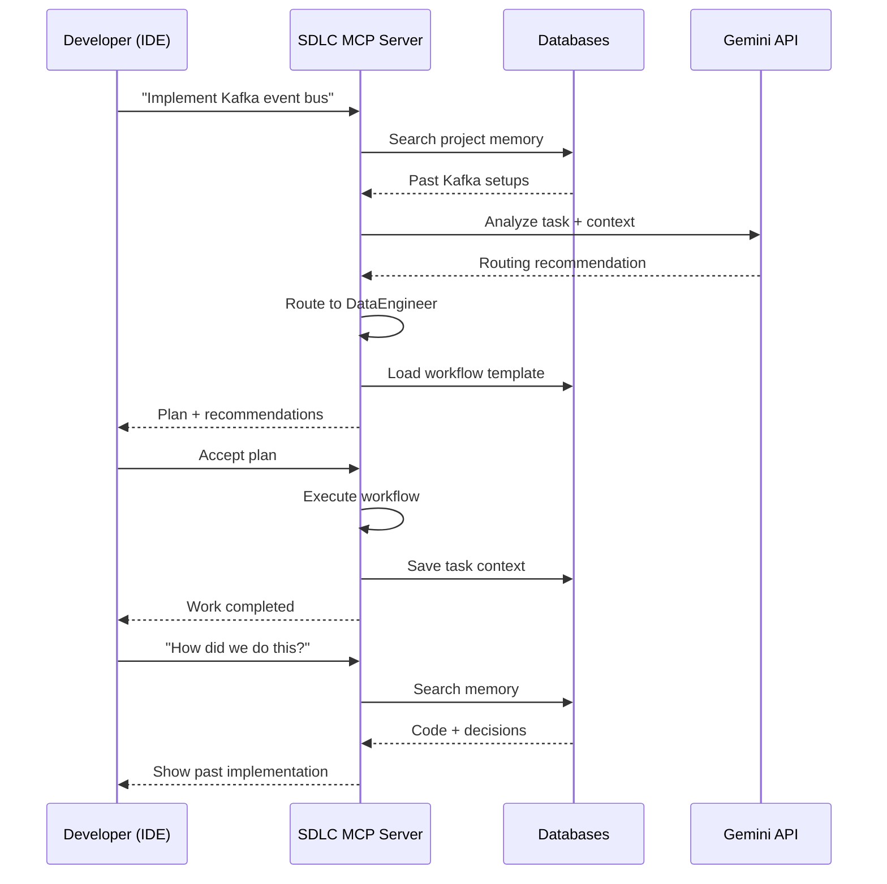

# SDLC MCP - Product Definition & Usage Guide

**Version**: 1.0  
**Date**: 2025-11-22  
**Status**: Planning Phase

---

## 🎯 What is the SDLC MCP?

### Product Definition

**SDLC MCP** is a **Model Context Protocol (MCP) Server** that provides **intelligent SDLC orchestration as a service** to development tools and IDEs.

```
┌─────────────────────────────────────────────────────────────┐
│                      SDLC MCP Server                        │
│  Intelligent Software Development Lifecycle Orchestration   │
│                                                             │
│  • Smart agent routing & coordination                       │
│  • Project-aware memory & knowledge graphs                  │
│  • Workflow orchestration & templates                       │
│  • Real-time analytics & observability                      │
│  • Multi-project learning & optimization                    │
└─────────────────────────────────────────────────────────────┘
           ▲                    ▲                    ▲
           │                    │                    │
    ┌──────┴──────┐      ┌─────┴──────┐     ┌──────┴───────┐
    │   VS Code   │      │ Claude CLI │     │ Antigravity  │
    │ (Kilo Code) │      │            │     │              │
    └─────────────┘      └────────────┘     └──────────────┘
```

### NOT an Application, but a **Service**

**It is NOT**:

- ❌ A standalone desktop/web application
- ❌ A GUI tool you interact with directly
- ❌ A replacement for your IDE

**It IS**:

- ✅ An **MCP server** (background service)
- ✅ Provides **tools/capabilities** to IDEs and CLIs
- ✅ Acts as an **intelligent orchestration layer**
- ✅ Runs **locally or remotely** as a service
- ✅ **Project-agnostic** - works with any codebase

---

## 🏗️ Final Product Architecture

### Component Stack

```
┌────────────── User Layer ──────────────────┐
│  IDE/CLI (VS Code, Claude, Antigravity)    │
└────────────────┬───────────────────────────┘
                 │ MCP Protocol
┌────────────────▼───────────────────────────┐
│         SDLC MCP Server (Port 8000)        │
│  ┌──────────────────────────────────────┐  │
│  │  MCP Tools Endpoint                  │  │
│  │  - route_task()                      │  │
│  │  - get_recommendations()             │  │
│  │  - search_memory()                   │  │
│  │  - get_analytics()                   │  │
│  │  - execute_workflow()                │  │
│  └──────────────────────────────────────┘  │
│                                            │
│  ┌──────────────────────────────────────┐  │
│  │  Orchestration Layer                 │  │
│  │  - IntelligentAgentCoordinator       │  │
│  │  - AdvancedWorkflowEngine            │  │
│  │  - SDLCOrchestrationHub              │  │
│  └──────────────────────────────────────┘  │
│                                            │
│  ┌──────────────────────────────────────┐  │
│  │  Intelligence Layer                  │  │
│  │  - Gemini API (3-tier LLM fallback) │  │
│  │  - Cognee Memory Systems             │  │
│  │  - Analytics Engine                  │  │
│  └──────────────────────────────────────┘  │
│                                            │
│  ┌──────────────────────────────────────┐  │
│  │  Data Layer                          │  │
│  │  - PostgreSQL (analytics, routing)   │  │
│  │  - Qdrant (vector memory)            │  │
│  │  - Neo4j (knowledge graph)           │  │
│  │  - Redis (caching)                   │  │
│  └──────────────────────────────────────┘  │
└────────────────────────────────────────────┘
```

### Deployment Modes

The SDLC MCP can be deployed in **4 modes**:

#### 1. **Local Mode** (Default)

```bash
# Run on localhost, used by single developer
sdlc-mcp start --port 8000
# IDE connects to: http://localhost:8000
```

**Use Case**: Individual developer working on local projects

#### 2. **Shared Team Server**

```bash
# Run on team server, shared by team
sdlc-mcp start --host 0.0.0.0 --port 8000
# Team IDEs connect to: http://team-server:8000
```

**Use Case**: Team shares same SDLC intelligence, learns from each other

#### 3. **Enterprise Cloud**

```bash
# Deploy to cloud (Docker/Kubernetes)
kubectl apply -f sdlc-mcp-deployment.yaml
# All developers connect to: https://sdlc-mcp.company.com
```

**Use Case**: Enterprise-wide SDLC intelligence, centralized analytics

#### 4. **Hybrid Mode**

- Local MCP for developer-specific context
- Cloud MCP for shared organizational knowledge
- Bidirectional sync between local and cloud

---

## 🚀 How to Use SDLC MCP in Projects

### Installation & Setup (One-Time)

#### Step 1: Install SDLC MCP Server

```bash
# Clone repository
cd "C:\Users\Vincent_Pereira\Projects\AI Agents\Multi-Agent System\agents\agent - sdlc"

# Install as package (recommended)
pip install -e .

# OR install globally
pip install sdlc-mcp-server
```

#### Step 2: Start the MCP Server

```bash
# Start with default configuration
sdlc-mcp start

# OR with custom config
sdlc-mcp start --config ~/.sdlc-mcp/config.yaml
```

**Server starts on**: `http://localhost:8000`

#### Step 3: Configure Your IDE

**For VS Code (Kilo Code)**:

```json
// .vscode/settings.json
{
  "mcp.servers": {
    "sdlc": {
      "type": "sse",
      "url": "http://localhost:8000/sse"
    }
  }
}
```

**For Claude CLI**:

```bash
claude mcp add sdlc -t sse http://localhost:8000/sse
```

**For Google Antigravity**:

```json
// ~/.antigravity/mcp.json
{
  "mcpServers": {
    "sdlc": {
      "url": "http://localhost:8000/sse",
      "transport": "sse"
    }
  }
}
```

---

## 📖 Usage Patterns

### Pattern 1: IDE Integration (Primary)

**How it works**:

1. Developer opens project in IDE (e.g., VS Code)
2. Developer writes natural language request in chat/command
3. IDE sends request to SDLC MCP
4. MCP routes to appropriate agents, coordinates work
5. Results returned to IDE for developer review

**Example in VS Code**:

```
Developer in VS Code:
> "Use SDLC agents to implement user authentication with JWT"

SDLC MCP Response:
✅ Routed to: Security Specialist (primary), Backend Developer (secondary)

Recommendations:
1. Implement JWT token generation (BackendDeveloper)
2. Add authentication middleware (SecuritySpecialist)
3. Create user login/logout endpoints (BackendDeveloper)
4. Add security tests (TestEngineer)

Workflow: api_development (4 steps)
Estimated Time: 6-8 hours
```

### Pattern 2: CLI Usage (Advanced)

```bash
# Route a task
sdlc route "Fix memory leak in data processing pipeline"

# Get recommendations
sdlc recommend "optimize database queries"

# Execute workflow
sdlc workflow new_feature --name "payment-processing"

# Search memory
sdlc memory search "how did we implement caching?"

# View analytics
sdlc analytics --days 7
```

### Pattern 3: API Integration (Programmatic)

```python
from sdlc_mcp_client import SDLCClient

client = SDLCClient("http://localhost:8000")

# Route task
result = client.route_task(
    task="Implement Kafka event bus",
    project_path="/path/to/project",
    context="data_pipeline"
)

print(f"Primary Agent: {result['primary_agent']}")
print(f"Workflow: {result['workflow_template']}")
```

---

## 🎯 Real-World Example: IBKR Trading System

### Scenario: Implementing Phases 5-28 of IBKR Trading System

**Project**: Agentic AI Algorithmic Trading System  
**Location**: `C:\Users\Vincent_Pereira\Projects\Trading\IBKR - Algo Trader`  
**Phases**: 5-28 (24 phases, ~40 weeks of work)

### Setup (One-Time Configuration)

#### 1. Configure SDLC MCP for IBKR Project

```bash
# Navigate to IBKR project
cd "C:\Users\Vincent_Pereira\Projects\Trading\IBKR - Algo Trader"

# Initialize SDLC MCP for this project
sdlc-mcp init

# Auto-analyze project and set priorities
sdlc-mcp analyze-project .

# Output:
# ✅ Detected: Trading System (Python, Kafka, PostgreSQL, ClickHouse)
# 📊 Recommended Agent Priorities:
#    🔴 Data Engineer: HIGH
#    🔴 Backend Developer: HIGH
#    🔴 Security Specialist: HIGH
#    🟡 Performance Optimiser: MEDIUM
#    🟡 DevOps Engineer: MEDIUM
#    🟢 Frontend Developer: LOW

# Confirm priorities
sdlc-mcp configure --confirm
```

This creates: `IBKR - Algo Trader/.sdlc/config.yaml`

#### 2. Configure IDE to Use SDLC MCP

```json
// IBKR - Algo Trader/.vscode/settings.json
{
  "mcp.servers": {
    "sdlc": {
      "type": "sse",
      "url": "http://localhost:8000/sse",
      "projectContext": {
        "name": "IBKR Trading System",
        "type": "trading_system",
        "phase": "current"
      }
    }
  }
}
```

---

### Daily Usage During Development

#### Example 1: Phase 5 - Kafka Event Bus Implementation

**Developer opens VS Code in IBKR project**:

```
// In VS Code Chat with SDLC MCP

Developer:
> "Use SDLC agents to implement Phase 5: Kafka event bus with
> 3 topics (market_data, trading_signals, execution_events)"

SDLC MCP:
✅ Task routed to: Data Engineer (primary, confidence: 92%)
🔄 Workflow: data_pipeline_development

Step-by-Step Plan:
1. [DataEngineer] Design Kafka topic schemas
2. [DataEngineer] Implement Kafka producers
3. [DataEngineer] Implement Kafka consumers
4. [TestEngineer] Create integration tests
5. [DevOpsEngineer] Set up Kafka monitoring

Memory Retrieved:
• Previous Kafka setup in Multi-Agent System (2024-11)
• Event-driven patterns from past projects
• Qdrant vector search found similar implementations

Recommendations:
• Use Avro schemas for market data (high volume)
• Implement idempotent consumers for execution events
• Add dead letter queue for failed messages

💾 Saving task context to project memory...
```

**Developer accepts plan, work proceeds**

---

#### Example 2: Phase 8 - Risk Management Module

```
Developer in VS Code:
> "Use SDLC agents to implement real-time risk monitoring
> with position limits and exposure tracking"

SDLC MCP:
✅ Multi-agent routing:
   🔴 Security Specialist (35% weight - compliance checks)
   🔴 Backend Developer (30% weight - core logic)
   🟡 Data Engineer (20% weight - real-time data)
   🟡 Performance Optimiser (15% weight - latency critical)

🔄 Workflow: security_critical_feature

Approval Gate Required:
⚠️  This feature requires security review before deployment

Orchestration Plan:
1. [Parallel]
   - SecuritySpecialist: Define risk limits & compliance rules
   - BackendDeveloper: Design risk calculation engine

2. [Sequential]
   - BackendDeveloper: Implement position tracking
   - DataEngineer: Set up real-time data pipeline
   - PerformanceOptimiser: Optimize calculation latency

3. [Approval Gate] Security review checkpoint

4. [Parallel]
   - TestEngineer: Security & integration tests
   - TechnicalWriter: Document risk limits & usage

Memory Context:
• IBKR API position data structure (cached from Phase 3)
• Risk calculation patterns from industry standards
• Similar implementations in financial systems (knowledge graph)

Estimated Duration: 12-15 hours
Confidence: 88%
```

---

#### Example 3: Mid-Development Query

````
Developer:
> "How did we implement the Kafka consumers in Phase 5?"

SDLC MCP:
🔍 Searching IBKR project memory...

Found in Phase 5 (2 weeks ago):
━━━━━━━━━━━━━━━━━━━━━━━━━━━━━━━━━━━━━━━━━━━
File: src/infrastructure/events/kafka_consumer.py
Lines: 45-78

```python
class MarketDataConsumer:
    def __init__(self, bootstrap_servers):
        self.consumer = KafkaConsumer(
            'market_data',
            bootstrap_servers=bootstrap_servers,
            value_deserializer=lambda m: json.loads(m.decode('utf-8')),
            enable_auto_commit=False,  # Manual commit for exactly-once
            group_id='trading-engine'
        )
````

Design Decisions (from memory):
• Manual commit for exactly-once processing
• JSON deserializer (later changed to Avro in Phase 7)
• Consumer group: 'trading-engine'

Related Tasks:
• Phase 5.1: Market data consumer
• Phase 5.2: Signal consumer  
• Phase 7.3: Migration to Avro schemas

Agent: Data Engineer
Date: 2025-11-10
Confidence: High (validated by tests)
━━━━━━━━━━━━━━━━━━━━━━━━━━━━━━━━━━━━━━━━━━━

```

---

### Cross-Project Learning

**Benefit**: SDLC MCP learns from IBKR project and applies to future projects

```

# Later, in a NEW project:

Developer (in different project):

> "Use SDLC agents to implement event-driven architecture"

SDLC MCP:
✅ Found relevant experience from IBKR Trading System:
• Kafka setup patterns (confidence: 94%)
• Event schema design (Avro vs JSON trade-offs)
• Consumer group strategies
• Monitoring setup (Prometheus + Grafana)

📊 Recommended approach based on IBKR learnings:

1.  Use Avro schemas for high-volume events
2.  Implement idempotent consumers
3.  Set up dead letter queues
4.  Monitor consumer lag (learned from IBKR Phase 12 incident)

🧠 Knowledge transferred from: IBKR Trading System (24 implementations)

````

---

## 🔧 Advanced Features

### 1. Project-Specific Memory

```bash
# Each project gets its own memory namespace
IBKR/.sdlc/memory/
├── code_knowledge/       # Code analysis, dependencies
├── decisions/            # Design decisions, trade-offs
├── patterns/            # Reusable patterns discovered
└── incidents/           # Issues, resolutions, learnings
````

### 2. Workflow Templates

```bash
# IBKR project uses template: "trading_system_feature"
sdlc workflow list --project ibkr

Available workflows:
- trading_system_feature  (optimized for IBKR)
- data_pipeline          (from Phase 5 learnings)
- risk_critical_feature  (includes approval gates)
- performance_optimization
```

### 3. Analytics Dashboard

```bash
# View IBKR project analytics
sdlc dashboard --project ibkr

IBKR Trading System - SDLC Analytics
═══════════════════════════════════════════
Phases Completed: 7/28 (25%)
Agent Usage (Last 30 days):
  🔴 Data Engineer: 45 invocations (38%)
  🔴 Backend Developer: 32 invocations (27%)
  🟡 Test Engineer: 18 invocations (15%)

Average Task Time: 6.2 hours
Routing Accuracy: 94%
Workflow Success Rate: 91%

Top Issues:
- Kafka consumer lag (resolved in Phase 5.3)
- PostgreSQL connection pool exhaustion (optimized Phase 6)
```

---

## 📦 Deliverables (What You Get)

### After 15 Phases of Implementation

#### 1. **SDLC MCP Server Package**

```
sdlc-mcp-server/
├── sdlc_mcp/
│   ├── server.py              # MCP server entry point
│   ├── routing/               # Intelligent routing engine
│   ├── orchestration/         # Workflow orchestration
│   ├── memory/                # Cognee integration
│   ├── analytics/             # Analytics engine
│   └── integrations/          # LLM, databases
├── config/
│   ├── default.yaml           # Default configuration
│   └── examples/              # Example configs
├── scripts/
│   ├── start_server.sh        # Server startup
│   └── init_databases.sh      # Database initialization
└── docker/
    ├── Dockerfile
    └── docker-compose.yml
```

#### 2. **CLI Tool**

```bash
sdlc-mcp --help

Commands:
  start         Start MCP server
  init          Initialize project
  route         Route a development task
  workflow      Execute workflow
  memory        Search project memory
  analytics     View analytics dashboard
  configure     Configure project settings
```

#### 3. **IDE Integrations**

- VS Code extension configuration
- Claude CLI integration
- Antigravity MCP config
- GitHub Copilot Agent integration

#### 4. **Documentation**

- Installation guide
- Configuration reference
- API documentation
- Workflow templates guide
- Troubleshooting guide
- Best practices

#### 5. **Docker Images**

```bash
# Pre-built images
docker pull sdlc-mcp/server:latest
docker pull sdlc-mcp/databases:latest

# One-command deployment
docker-compose up -d
```

---

## 🎓 Learning Curve

### For Developers

**Day 1: Setup**

- Install SDLC MCP server (5 minutes)
- Configure IDE (10 minutes)
- Initialize first project (15 minutes)

**Week 1: Basic Usage**

- Natural language task routing
- View recommendations
- Execute simple workflows

**Month 1: Advanced**

- Custom workflow templates
- Project-specific configuration
- Memory search & analytics

**Month 3: Expert**

- Multi-project patterns
- Custom agent priorities
- Advanced orchestration

---

## 🔑 Key Benefits

### For Individual Developers

✅ Intelligent task routing (stop guessing which approach to use)  
✅ Learn from past projects (don't repeat mistakes)  
✅ Automated workflow orchestration  
✅ Real-time recommendations

### For Teams

✅ Shared knowledge base  
✅ Consistent SDLC practices  
✅ Team-wide learning  
✅ Centralized analytics

### For Organizations

✅ Enterprise-wide SDLC intelligence  
✅ Cross-project learning  
✅ Compliance & security gates  
✅ ROI tracking & optimization

---

## 🚦 Usage Flow Summary



---

## 📝 Documentation Updates Required

This product definition should be added to:

1. ✅ **SDLC_MCP_MASTER_PLAN.md** - Section 1 (Overview)
2. ✅ **SDLC_MCP_ARCHITECTURE.md** - Add "Product Architecture" section
3. ✅ **FEATURE_DETAILS.md** - Add "MCP Server Tools" examples
4. ⏩ **NEW**: `INSTALLATION_GUIDE.md` (create in Phase 10)
5. ⏩ **NEW**: `USER_GUIDE.md` (create in Phase 10)

---

## Conclusion

**SDLC MCP is a MCP Server** that transforms how developers work by providing:

- **Intelligent routing** to appropriate development approaches/agents
- **Project memory** that learns from past work
- **Workflow orchestration** for complex SDLC tasks
- **Analytics** for continuous improvement

**Used through**: IDE integration (primary), CLI (advanced), API (programmatic)

**Value**: Speeds up development, improves quality, enables knowledge sharing across projects
