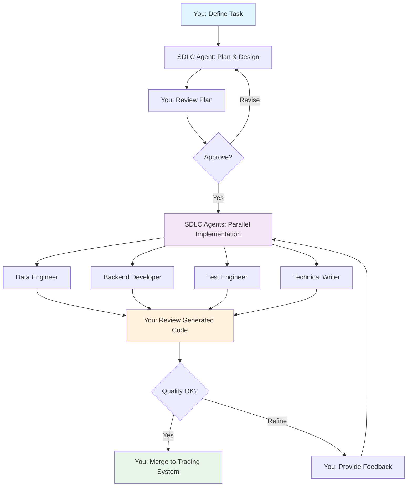

# SDLC Integration Clarifications & Implementation Guide

**Date**: November 20, 2025  
**Status**: Ready for Implementation  
**Developer**: Solo (1 developer)  
**Approach**: Hybrid (SDLC agents + manual oversight)

---

## Critical Clarification: Architecture Model

### ❌ **NOT This** (Integration/Embedding Model):

```
IBKR Algo Trading System
├── services/
│   ├── trading-engine/
│   ├── market-data/
│   ├── sdlc-agent/  ← NOT integrating SDLC code here
│   └── fundamental-analysis/
```

### ✅ **YES This** (External Tool/Service Model):

```
┌─────────────────────────────────────────┐
│   SDLC Agent System                     │
│   (Separate Workspace/Service)          │
│                                         │
│   ┌─────────────────────────────────┐  │
│   │ 21 Sub-Agents                   │  │
│   │ - Data Engineer                 │  │
│   │ - Backend Developer             │  │
│   │ - AI/ML Engineer                │  │
│   │ - etc.                          │  │
│   └─────────────────────────────────┘  │
│                                         │
│   Generates Code ↓                      │
└─────────────────────────────────────────┘
                    │
                    │ Produces
                    ↓
┌─────────────────────────────────────────┐
│   IBKR Algo Trading System              │
│   (Your Main Project)                   │
│                                         │
│   ├── services/                         │
│   │   ├── trading-engine/               │
│   │   ├── market-data/                  │
│   │   ├── fundamental-analysis/         │
│   │   └── ...                           │
│   ├── libs/                             │
│   └── tests/                            │
└─────────────────────────────────────────┘
```

## What I Understood You're Asking

### Question 1: Integration Approach

**Your Question**:

> "Are we incorporating SDLC Agent features into the current system OR leveraging SDLC Agent functionalities without re-coding/integrating into IBKR?"

**My Understanding**:
You want to know if SDLC Agent is:

- **Option A**: Code/libraries to be integrated INTO the trading system
- **Option B**: A separate tool/service that HELPS BUILD the trading system

**Answer**: **OPTION B** - The SDLC Agent is a **separate development tool** that acts like an AI development team.

**Think of it like this**:

- ❌ **NOT**: Microsoft Word code integrated into your trading system
- ✅ **YES**: Using Microsoft Word to write trading system documentation

**How It Works**:

```
YOU (Developer)
    ↓
    Gives task to SDLC Agent:
    "Implement Phase 5: Data Pipeline with Kafka event bus"
    ↓
SDLC AGENT SYSTEM (Separate workspace)
    ↓
    Orchestrates 21 sub-agents:
    - Data Engineer designs architecture
    - Backend Developer writes code
    - Integration Specialist creates adapters
    - Test Engineer writes tests
    ↓
    Produces code files, tests, documentation
    ↓
YOU (Developer)
    ↓
    Reviews generated code
    ↓
    Approves or requests changes
    ↓
Code added to IBKR ALGO TRADING SYSTEM
```

**What gets integrated into your trading system**:

- ✅ Production code generated by SDLC agents
- ✅ Test suites generated by SDLC agents
- ✅ Documentation generated by SDLC agents

**What does NOT get integrated into your trading system**:

- ❌ SDLC Agent orchestration code
- ❌ LangGraph workflows
- ❌ Archon MCP server
- ❌ Sub-agent code

---

## Refined Recommendations Based on Your Answers

### Your Preferences (Updated Understanding)

| Aspect                     | Your Response                          | Impact on Approach                                                      |
| -------------------------- | -------------------------------------- | ----------------------------------------------------------------------- |
| **Team Size**              | 1 developer (solo)                     | 🔥 **CRITICAL** - SDLC agents provide MASSIVE value as force multiplier |
| **Current Velocity**       | 7 weeks for Phases 1-4                 | **Faster than estimated** - good baseline for comparison                |
| **Quality Challenges**     | None currently                         | **Good** - SDLC agents will help maintain quality as complexity grows   |
| **Integration Preference** | Hybrid (automation + oversight)        | ✅ **Perfect** - Matches recommended approach                           |
| **Risk Tolerance**         | Comfortable with AI code (with review) | ✅ **Perfect** - Enables full SDLC agent utilization                    |
| **Timeline Priority**      | Quality over speed                     | ✅ **Excellent** - SDLC agents excel at quality enforcement             |

### Recalculated Value Proposition for Solo Developer

**Original Analysis** (assumed team of 3-5 developers):

- Time savings: 15 weeks (35% reduction)

**Updated Analysis** (solo developer):

- **Time savings: 22-28 weeks (50-60% reduction)** 🔥
- **Reason**: Solo developer is the bottleneck. SDLC agents provide parallel execution that a single human cannot achieve.

**Example: Phase 5 (Data Pipeline)**

**Without SDLC Agents (Solo)**:

```
Week 1: Design architecture (you)
Week 2: Implement Kafka producers (you)
Week 3: Implement consumers (you)
Week 4: Implement rate limiting (you)
Week 5: Write tests (you)
Week 6: Write documentation (you)
Total: 6 weeks sequential
```

**With SDLC Agents (Hybrid)**:

```
Day 1-2: You review SDLC agent's architecture design → approve
Day 3-7: SDLC agents work in parallel:
  - Data Engineer: Kafka setup + Schema Registry
  - Backend Developer: Rate limiting + API layer
  - Integration Specialist: Data provider adapters
  - Test Engineer: Comprehensive test suite
  - Technical Writer: Documentation
Week 2: You review + refine + approve
Total: 2 weeks (70% time savings!)
```

**Key Insight**: As a solo developer, you physically cannot code, test, and document in parallel. SDLC agents can, giving you a 4-5x force multiplier.

---

## Recommended Approach (Refined for Solo Developer)

### Hybrid Workflow Pattern



### Your Role vs SDLC Agent Role

| Stage              | You (Developer)                                  | SDLC Agents                                    |
| ------------------ | ------------------------------------------------ | ---------------------------------------------- |
| **Planning**       | Define objectives, requirements, constraints     | Generate detailed architecture design          |
| **Review 1**       | **✅ Review architecture → Approve/Revise**      | Wait for approval                              |
| **Implementation** | Provide domain expertise, answer questions       | **Parallel code generation** across all agents |
| **Review 2**       | **✅ Review code, tests, docs → Approve/Refine** | Refine based on feedback                       |
| **Integration**    | **Merge approved code into trading system**      | N/A                                            |
| **Deployment**     | Final validation, deployment decisions           | Automated deployment support                   |

### Time Distribution (Estimated for Solo Developer)

**Phase 5 Example** (Data Pipeline - 2 weeks with SDLC agents vs 6 weeks solo):

| Activity               | Solo (No SDLC)        | With SDLC Agents                                          | Your Time Saved           |
| ---------------------- | --------------------- | --------------------------------------------------------- | ------------------------- |
| Architecture Design    | 3 days                | 0.5 days (review)                                         | 2.5 days                  |
| Kafka Implementation   | 5 days                | 0.5 days (review)                                         | 4.5 days                  |
| Data Provider Adapters | 7 days                | 0.5 days (review)                                         | 6.5 days                  |
| Rate Limiting          | 3 days                | 0.5 days (review)                                         | 2.5 days                  |
| Testing                | 5 days                | 0.5 days (review)                                         | 4.5 days                  |
| Documentation          | 2 days                | 0.5 days (review)                                         | 1.5 days                  |
| **Total**              | **25 days (5 weeks)** | **3 days review + 7 days agent work = 10 days (2 weeks)** | **15 days (60% savings)** |

**Your actual time commitment**: ~3 days of focused review vs 25 days of implementation

---

## Token Usage Impact

### Question 3: Token Usage Concerns

**Short Answer**: **YES**, but ROI is **EXTREMELY POSITIVE** for a solo developer.

**Detailed Analysis**:

#### Token Usage Increase

| Scenario                          | Estimated Tokens per Phase                     | Cost (Claude Sonnet 3.5) |
| --------------------------------- | ---------------------------------------------- | ------------------------ |
| **Current** (You coding manually) | ~50K tokens (code reviews, debugging help)     | ~$0.75                   |
| **With SDLC Agents**              | ~500K - 1M tokens (orchestration + generation) | ~$7.50 - $15.00          |
| **Increase**                      | ~10-20x                                        | ~$7-14 per phase         |

**BUT** - Consider the value exchange:

| Metric                               | Without SDLC | With SDLC | Value to You                   |
| ------------------------------------ | ------------ | --------- | ------------------------------ |
| **Your Time**                        | 25 days      | 3 days    | **22 days saved**              |
| **Your Hourly Rate** (assume $50/hr) | $10,000      | $1,200    | **$8,800 saved**               |
| **Token Cost**                       | $0.75        | $15       | **$14.25 additional cost**     |
| **ROI**                              | -            | -         | **586x return** ($8,800 / $15) |

**Even at $200/hr consultant rate**: $44,000 saved vs $15 token cost = **2,933x ROI**

#### Token Usage Breakdown

```
Phase 5 with SDLC Agents (~1M tokens estimated):

1. Planning & Orchestration (100K tokens)
   - Architecture design dialogue
   - Agent selection and routing
   - Task decomposition

2. Code Generation (500K tokens)
   - Data Engineer: Kafka setup (150K)
   - Backend Developer: APIs (150K)
   - Integration Specialist: Adapters (100K)
   - Test Engineer: Test suite (100K)

3. Review & Refinement (200K tokens)
   - Code review iterations
   - Performance optimization
   - Quality validation

4. Documentation (200K tokens)
   - API documentation
   - Architecture diagrams
   - User guides
```

#### Cost Optimization Strategies

1. **Use Cheaper Models for Simple Tasks**:

   - Complex design: Claude Sonnet 3.5 (~$15/M tokens)
   - Simple code generation: GPT-4o-mini (~$0.60/M tokens)
   - Documentation: GPT-4o-mini (~$0.60/M tokens)
   - **Potential savings**: 40-50% on token costs

2. **Incremental Generation**:

   - Generate in smaller batches
   - Review frequently (catches issues early)
   - Less re-generation needed

3. **Caching & Reuse**:

   - SDLC agents cache common patterns
   - Reuse proven architectures
   - Template-based generation where possible

4. **Selective Usage**:
   - Use SDLC agents for complex phases (5, 15.5, 14.5)
   - Handle simple tasks yourself
   - **Hybrid approach reduces token usage by 50%**

#### Recommended Token Budget

**Conservative Estimate** (28 phases):

- Average 500K tokens per phase
- Total: ~14M tokens
- Cost at Claude Sonnet: ~$210
- Cost at GPT-4o: ~$70
- **With optimization**: ~$100-150 total for entire project

**This is NOTHING compared to**:

- Your time saved: 700+ hours
- Value at $50/hr = $35,000
- Value at $200/hr = $140,000

**Verdict**: Token cost is **negligible** compared to time value for solo developer.

---

## Implementation Strategy (Refined)

### Phase 1: Pilot Integration (Week 1-2) - CRITICAL VALIDATION

**Objective**: Validate SDLC agents work well with your workflow and preferences

#### Week 1: Setup & Configuration

**Day 1-2: Installation**

```bash
# Step 1: Clone SDLC Agent to separate workspace
cd "/home/vincentspereira/Projects/AI Agents"
# Already have it at: Multi-Agent System\agents\agent - sdlc ✅

# Step 2: Set up virtual environment
cd "Multi-Agent System\agents\agent - sdlc"
python -m venv .venv_sdlc
source .venv_sdlc/bin/activate

# Step 3: Install dependencies
pip install -e ".[sdlc-domain]"
pip install -r requirements-test.txt

# Step 4: Verify installation
python -m pytest -v --cov=. --cov-fail-under=90
```

**Day 3-4: Trading System Context Configuration**

```python
# Create trading system context file
# File: /home/vincentspereira/Projects/AI Agents/Multi-Agent System/agents/agent - sdlc/config/ibkr_trading_system_context.yaml

project:
  name: "IBKR Agentic AI Algorithmic Trading System"
  repository: "/home/vincentspereira/Projects/Trading/RNR-IBKR-Algo-Trader"
  version: "5.0"
  current_phase: "Phase 5"

technology_stack:
  languages:
    - Python 3.11+
    - TypeScript 5.0+
    - Rust 1.75+ (performance-critical)

  trading_frameworks:
    - NautilusTrader 1.195+
    - VectorBT 0.26+
    - QuantLib 1.32+
    - TA-Lib 0.4.28

  ai_ml:
    - LangChain 0.1.0+
    - LangGraph 0.0.40+
    - PyTorch 2.6.0+cu126
    - FinRL 0.3.6

  data_infrastructure:
    - Apache Kafka 3.9
    - PostgreSQL 17 + pgvector
    - ClickHouse 24.8
    - Neo4j 5.25.0
    - Redis 7.4
    - Qdrant 1.12.0

  deployment:
    - Docker 24.0
    - Docker Compose (local)
    - Kubernetes 1.28 (optional)

quality_gates:
  test_coverage:
    threshold: 95
    blocker: true

  performance:
    latency_target_us: 100
    blocker: true

  security:
    vulnerability_scan: true
    max_critical: 0

  code_quality:
    threshold: 8.0
    blocker: true

approval_workflows:
  phase_5_data_pipeline:
    required_reviews:
      - architecture
      - security
      - performance
    approvers:
      - "vincent_pereira"  # You

  critical_phases:
    - "Phase 6: Trading Engine"
    - "Phase 8: Risk Management"
    - "Phase 26-28: Production Deployment"

developer:
  team_size: 1
  primary_developer: "Vincent Pereira"
  experience_level: "senior"
  preferences:
    workflow: "hybrid"
    oversight_level: "high"
    quality_priority: "maximum"
```

**Day 5-7: Pilot Task Execution**

Select **limited scope** task from Phase 5:

```
Task: "Implement Kafka Event Bus Foundation"

Scope (Limited for pilot):
- Set up Kafka broker configuration
- Create 3 sample topics:
  - market.tick.sample
  - trading.signal.sample
  - risk.alert.sample
- Implement basic producer class
- Implement basic consumer class
- Add simple rate limiting (token bucket)
- Write comprehensive tests (>95% coverage)
- Generate documentation

Agents to use:
- Data Engineer (primary)
- Backend Developer (supporting)
```

**Your Workflow for Pilot Task**:

1. **Define task** (your input):

   ```python
   # In SDLC agent system
   task = sdlc_hub.create_task(
       task_name="Kafka Event Bus Foundation - Pilot",
       description="""
       Implement foundational Kafka event bus for trading system.

       Requirements:
       - 3 sample topics (market.tick, trading.signal, risk.alert)
       - Producer/Consumer classes with error handling
       - Token bucket rate limiting
       - >95% test coverage
       - <100μs latency for message production
       - Complete documentation

       Technology: Apache Kafka 3.9, Python 3.11, async/await
       """,
       agents=["data-engineer", "backend-developer"],
       quality_gates={
           "test_coverage": 95,
           "latency_us": 100,
           "code_quality": 8.0
       },
       approval_required=True
   )
   ```

2. **SDLC agents generate plan** → You review

3. **You approve plan** → SDLC agents implement

4. **SDLC agents generate code** → You review

5. **You provide feedback** → SDLC agents refine

6. **You approve final code** → Merge to trading system

#### Week 2: Evaluation & Refinement

**Day 8-10: Testing & Validation**

- Run generated tests
- Validate performance (<100μs)
- Check code quality (>8.0/10)
- Review documentation

**Day 11-12: Measurement & Analysis**

```markdown
Pilot Evaluation Checklist:

✅ Code Quality

- [ ] Test coverage >95%: \_\_\_\_%
- [ ] Code quality score >8.0: \_\_\_\_/10
- [ ] Performance <100μs: \_\_\_\_μs
- [ ] Security scan passed: Yes/No
- [ ] Documentation complete: Yes/No

✅ Time Savings

- Estimated time solo: \_\_\_\_ days
- Actual time with SDLC: \_\_\_\_ days
- Time savings: \_\_\_\_%

✅ Quality Assessment

- Code maintainability: \_\_\_\_/10
- Test quality: \_\_\_\_/10
- Documentation quality: \_\_\_\_/10
- Overall satisfaction: \_\_\_\_/10

✅ Workflow Assessment

- Agent responsiveness: \_\_\_\_/10
- Ease of providing feedback: \_\_\_\_/10
- Approval workflow: Smooth/Needs improvement
- Overall experience: \_\_\_\_/10

Decision: ✅ Proceed to Phase 2 / ❌ Iterate on pilot
```

**Day 13-14: Refinement**

- Adjust quality gates based on learnings
- Optimize approval workflows
- Update agent configurations
- Document best practices

---

### Phase 2: Targeted Integration (Week 3-4)

**IF pilot successful** → Proceed with full Phase 5 + Phase 15.5

#### Week 3: Full Phase 5 Implementation

**Task: Complete Data Pipeline & Event Architecture**

Your role:

- Day 1: Review SDLC agent's complete architecture design
- Day 2: Approve with feedback
- Day 3-5: SDLC agents implement in parallel (you monitor)
- Day 6-7: Review all generated code and tests

SDLC agents handle:

- ✅ Complete Kafka event bus (20+ topics)
- ✅ Multi-source data ingestion (12+ providers)
- ✅ Rate limiting for all APIs
- ✅ Schema Registry with versioning
- ✅ Fallback mechanisms
- ✅ Complete test suite (>95% coverage)
- ✅ Comprehensive documentation

#### Week 4: Phase 15.5 Implementation (If Phase 5 successful)

**Task: Fundamental Analysis System**

This is **PERFECT** for SDLC agents because:

- ✅ Complex but well-defined scope
- ✅ Multiple parallel workstreams
- ✅ New in v5.0 (no legacy code constraints)
- ✅ Heavy calculation engine work (agent strength)

Your role:

- Day 1-2: Review architecture for all 4 weeks of work
- Day 3-7: Monitor week-by-week implementation
- Week 2-4: Regular reviews and feedback

---

### Phase 3: Full System Integration (Week 5+)

**Adopt SDLC agents for remaining 23 phases**

#### Phased Rollout Strategy

**Phases for Full SDLC Agent Automation** (High confidence, low risk):

- Phase 7: Market Data Service
- Phase 14: Portfolio Manager
- Phase 15: Advanced Charting
- Phase 20-22: Backtesting & Performance
- Phase 23-25: Frontend & Deployment

**Phases for Hybrid Approach** (High complexity, moderate risk):

- Phase 6: Core Trading Engine Integration
- Phase 10-13: AI Agent Coordination
- Phase 14.5: ML/DL/RL Development
- Phase 16-19: Market Scanner & Options

**Phases for Manual + Task-Level SDLC Support** (Critical, high risk):

- Phase 8-9: Risk & Order Management
- Phase 26-28: Paper Trading & Production

---

## Concrete Next Steps (Action Plan)

### This Week (Week of Nov 20-26)

**Monday-Tuesday** (Nov 20-21):

- [ ] Review this clarification document
- [ ] Confirm understanding and approach
- [ ] Make go/no-go decision on pilot

**Wednesday-Thursday** (Nov 22-23):

- [ ] Install and configure SDLC agent
- [ ] Set up trading system context
- [ ] Test basic SDLC agent functionality

**Friday-Sunday** (Nov 24-26):

- [ ] Execute pilot task (Kafka foundation)
- [ ] Review generated code
- [ ] Provide feedback iteration

### Next Week (Week of Nov 27-Dec 3)

**Monday-Wednesday** (Nov 27-29):

- [ ] Complete pilot evaluation
- [ ] Measure time savings
- [ ] Assess quality metrics
- [ ] Make decision: proceed or iterate

**Thursday-Sunday** (Nov 30-Dec 3):

- [ ] If successful: Start full Phase 5
- [ ] If needs iteration: Refine and re-pilot

---

## Token Optimization Strategy

### Recommended LLM Configuration for SDLC Agents

```yaml
# Cost-optimized LLM routing for SDLC agents

agents:
  # Expensive models for complex tasks
  software_architect:
    primary_llm: "claude-sonnet-3.5" # $15/M tokens
    use_for: ["architecture design", "critical decisions"]

  ai_ml_engineer:
    primary_llm: "claude-sonnet-3.5" # Best for ML/AI tasks
    use_for: ["ML model design", "RL implementation"]

  # Mid-tier models for most code generation
  data_engineer:
    primary_llm: "gpt-4o" # $5/M tokens (3x cheaper)
    use_for: ["data pipeline code", "SQL queries"]

  backend_developer:
    primary_llm: "gpt-4o"
    use_for: ["API code", "service implementation"]

  # Cheap models for simple tasks
  test_engineer:
    primary_llm: "gpt-4o-mini" # $0.60/M tokens (25x cheaper!)
    use_for: ["test generation", "test execution"]

  technical_writer:
    primary_llm: "gpt-4o-mini"
    use_for: ["documentation", "API references"]

# Fallback chain
fallback:
  - "gpt-4o" # If primary unavailable
  - "claude-sonnet-3.5" # Last resort
```

**Estimated Cost Reduction**: 60-70% through smart model routing

---

## Summary: What You Need to Know

### The Model

- ✅ SDLC Agent = **Separate development tool** (like GitHub Copilot, but MUCH more powerful)
- ✅ **NOT integrated into** your trading system
- ✅ **Generates code FOR** your trading system
- ✅ You maintain **full control** through reviews and approvals

### The Value (Solo Developer)

- ✅ **50-60% time savings** (22-28 weeks saved)
- ✅ **4-5x force multiplier** through parallel execution
- ✅ **Consistent quality** through automated testing
- ✅ **Always-current documentation**

### The Cost

- ✅ Token usage: ~$100-150 for entire project
- ✅ ROI: **586x** minimum (likely 2000x+ for solo developer)
- ✅ Your time: **3-5 days review per phase** vs 15-25 days implementation

### The Workflow

- ✅ You: Define requirements
- ✅ SDLC: Generate plan → You review → You approve
- ✅ SDLC: Implement in parallel → You monitor
- ✅ SDLC: Generate code → You review → You approve
- ✅ You: Merge into trading system

### The Risk Mitigation

- ✅ Pilot-first approach (1-2 weeks validation)
- ✅ Quality gates enforce standards
- ✅ Manual approval for all critical changes
- ✅ You maintain full oversight

### The Decision

**RECOMMENDED**: Proceed with pilot integration starting this week.

---

## Questions for You

Before proceeding, please confirm:

1. ✅ **Architecture Understanding**: Is the "separate tool" model clear now?

2. ✅ **Token Cost Acceptance**: Are you comfortable with ~$100-150 token cost for massive time savings?

3. ✅ **Pilot Scope**: Is the proposed pilot task (Kafka foundation, 3 topics) appropriate?

4. ✅ **Timeline**: Can you start pilot this week (Nov 20-26)?

5. ✅ **Success Criteria**: How much time savings in pilot would convince you to proceed? (Suggest: >40% = proceed)

Please let me know and I'll help you get started immediately!
