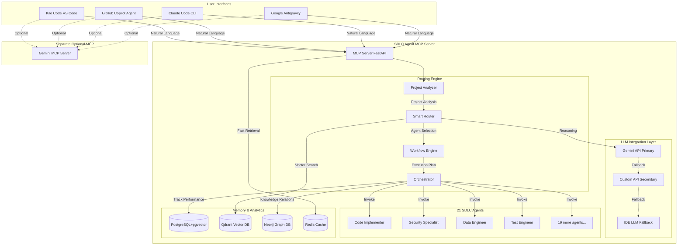
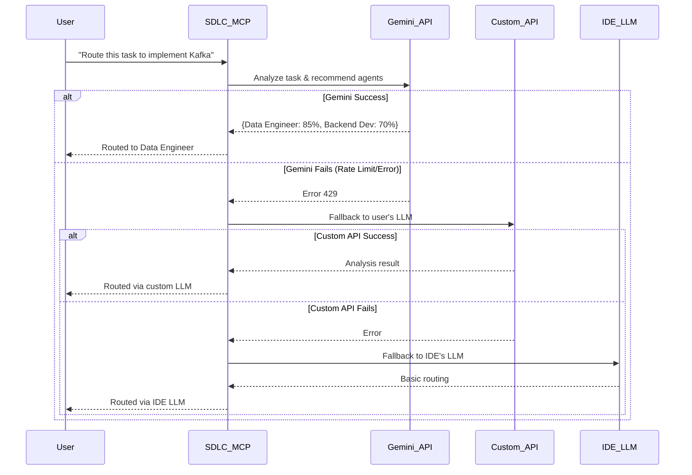
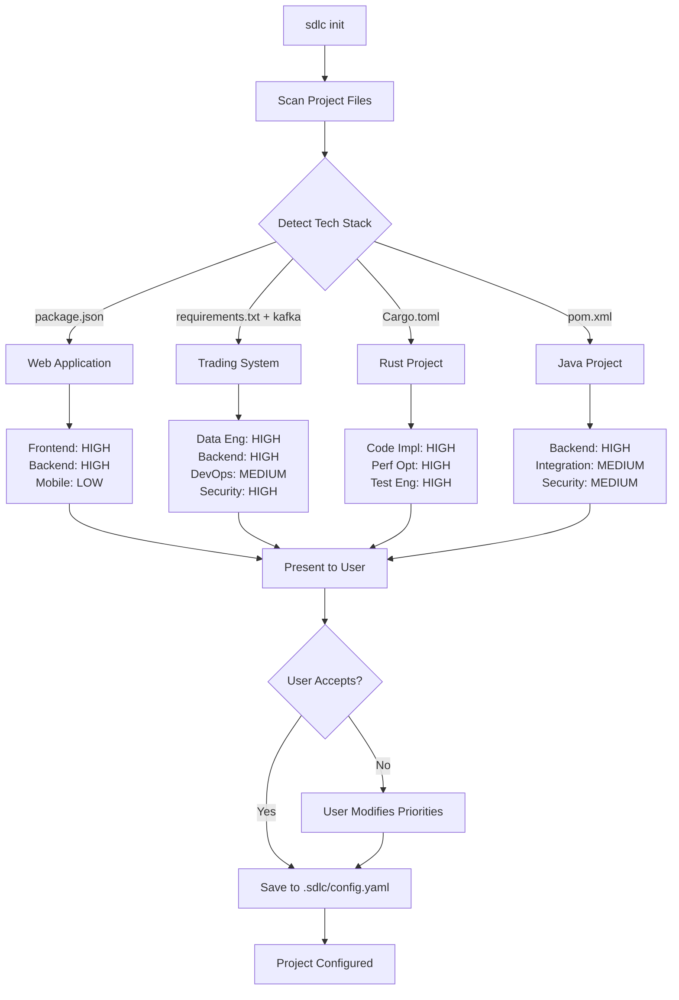

# SDLC Agent MCP - Enterprise Architecture

## Executive Summary

Building a **production-grade, IDE-agnostic SDLC Agent MCP server** that combines:

- **Claude Code's routing engine** (weighted scoring, workflow templates, analytics)
- **Cognee's memory systems** (PostgreSQL+pgvector, knowledge graphs, ATS/OMA/SMC categorization)
- **3-tier LLM fallback** (Gemini API → Custom API → IDE LLM)
- **Intelligent project analysis** for automatic agent prioritization
- **21 specialized SDLC agents** with cross-project learning

**Testing**: Kilo Code (VS Code), GitHub Copilot Agent, Claude Code CLI, Google Antigravity

---

## Feature Extraction Matrix

### From Claude Code (`C:\Users\vince\Projects\Trading\IBKR - Algo Trader\claude`)

| Feature                    | File                                                   | Usage in SDLC MCP                                                                                                  |
| -------------------------- | ------------------------------------------------------ | ------------------------------------------------------------------------------------------------------------------ |
| **Agent Registry**         | `docs/agent_routing_implementation.py`                 | 21-agent definition with triggers, file_patterns, contexts, priority                                               |
| **Routing Engine**         | `docs/agent_routing_implementation.py` (Lines 460-548) | Weighted scoring: triggers(10pts), files(8pts), context(5pts), priority(0-2pts), history(0-3pts)                   |
| **Analytics Database**     | `docs/agent_routing_implementation.py` (Lines 265-450) | Track invocations, success rates, confidence scores, agent synergies                                               |
| **Workflow Templates**     | `global-routing/USER_GUIDE.md`                         | 7 pre-defined workflows: new_feature, bug_fix, code_review, api_dev, deployment, security_audit, perf_optimization |
| **Monitoring & Alerts**    | `global-routing/core/monitoring_and_alerts.py`         | 5 alert types: unused agents, underused, low confidence, high overlap, perf degradation                            |
| **Orchestration Patterns** | `global-routing/core/global_sdlc_router.py`            | Sequential, parallel, conditional, hierarchical agent execution                                                    |
| **MCP Server**             | `global-routing/mcp_server.py`                         | 5 tools: route, recommendations, analytics, record_execution, list_agents                                          |
| **REST API**               | `global-routing/api/global_api.py`                     | FastAPI endpoints for HTTP-based routing                                                                           |

### From RNR Enhanced Cognee (`C:\Users\vince\Projects\AI Agents\RNR Enhanced Cognee`)

| Feature                     | File                                            | Usage in SDLC MCP                                  |
| --------------------------- | ----------------------------------------------- | -------------------------------------------------- |
| **Memory Categorization**   | `src/agent_memory_integration.py` (Lines 29-34) | ATS/OMA/SMC prefixes for organized memory          |
| **PostgreSQL+pgvector**     | `src/enhanced_cognee_mcp.py` (Lines 124-139)    | Relational metadata + vector embeddings            |
| **Qdrant Integration**      | `src/enhanced_cognee_mcp.py` (Lines 141-155)    | Vector similarity search with 1024-dim embeddings  |
| **Neo4j Knowledge Graph**   | `src/enhanced_cognee_mcp.py` (Lines 157-173)    | Entity relationships, agent collaboration patterns |
| **Redis Caching**           | `src/enhanced_cognee_mcp.py` (Lines 175-191)    | Fast memory retrieval with TTL                     |
| **Memory Types**            | `src/agent_memory_integration.py` (Lines 35-41) | Factual, procedural, episodic, semantic, working   |
| **Cognify Pipeline**        | `cognee/modules/cognify`                        | Knowledge graph generation from documents          |
| **MCP Server Architecture** | `cognee-mcp/`                                   | FastAPI-based MCP with SSE/HTTP/stdio transports   |

### From Gemini MCP Article

| Concept                 | Implementation in SDLC MCP                                       |
| ----------------------- | ---------------------------------------------------------------- |
| **MCP Bridge Pattern**  | Separate Gemini MCP server + SDLC MCP with embedded Gemini calls |
| **3-Tier LLM Fallback** | Gemini API → Custom API (user-provided) → IDE/CLI LLM            |
| **API Key Management**  | Environment variables with secure .env handling                  |
| **MCP Configuration**   | JSON config in IDE-specific locations                            |

---

## System Architecture



---

## Database Schema (PostgreSQL 17 + pgvector)

### Core Tables

```sql
-- Agent routing analytics
CREATE SCHEMA sdlc_analytics;

CREATE TABLE sdlc_analytics.agent_invocations (
    id UUID PRIMARY KEY DEFAULT gen_random_uuid(),
    agent_id VARCHAR(100) NOT NULL,
    user_request TEXT NOT NULL,
    project_path TEXT,
    project_type VARCHAR(50),
    context JSONB,
    files_involved TEXT[],
    complexity INT CHECK (complexity BETWEEN 1 AND 10),
    routing_score DECIMAL(5,3),
    confidence_score DECIMAL(5,3),
    execution_success BOOLEAN,
    execution_time_ms INT,
    error_message TEXT,
    feedback_score INT CHECK (feedback_score BETWEEN 1 AND 5),
    created_at TIMESTAMP DEFAULT CURRENT_TIMESTAMP,
    updated_at TIMESTAMP DEFAULT CURRENT_TIMESTAMP
);

CREATE INDEX idx_agent_invocations_agent ON sdlc_analytics.agent_invocations(agent_id);
CREATE INDEX idx_agent_invocations_project ON sdlc_analytics.agent_invocations(project_path);
CREATE INDEX idx_agent_invocations_created ON sdlc_analytics.agent_invocations(created_at);

-- Agent performance summary
CREATE TABLE sdlc_analytics.agent_performance (
    agent_id VARCHAR(100) PRIMARY KEY,
    total_invocations INT DEFAULT 0,
    successful_invocations INT DEFAULT 0,
    failed_invocations INT DEFAULT 0,
    avg_confidence DECIMAL(5,3),
    avg_execution_time_ms INT,
    last_invocation TIMESTAMP,
    success_rate_7d DECIMAL(5,3),
    success_rate_30d DECIMAL(5,3),
    updated_at TIMESTAMP DEFAULT CURRENT_TIMESTAMP
);

-- Project configurations (auto-prioritization results)
CREATE TABLE sdlc_analytics.project_configs (
    project_path TEXT PRIMARY KEY,
    project_name VARCHAR(200),
    project_type VARCHAR(50),
    tech_stack JSONB,
    agent_priorities JSONB, -- {agent_id: priority_level}
    auto_detected BOOLEAN DEFAULT true,
    user_confirmed BOOLEAN DEFAULT false,
    config_version INT DEFAULT 1,
    created_at TIMESTAMP DEFAULT CURRENT_TIMESTAMP,
    updated_at TIMESTAMP DEFAULT CURRENT_TIMESTAMP
);

-- Agent synergies (which agents work well together)
CREATE TABLE sdlc_analytics.agent_synergies (
    id UUID PRIMARY KEY DEFAULT gen_random_uuid(),
    agent_1 VARCHAR(100),
    agent_2 VARCHAR(100),
    co_invocation_count INT DEFAULT 0,
    combined_success_rate DECIMAL(5,3),
    avg_combined_time_ms INT,
    last_paired TIMESTAMP,
    UNIQUE(agent_1, agent_2)
);

-- Memory schema (from Cognee)
CREATE SCHEMA shared_memory;

CREATE TABLE shared_memory.documents (
    id UUID PRIMARY KEY,
    title TEXT,
    content TEXT NOT NULL,
    agent_id VARCHAR(100) NOT NULL,
    memory_category VARCHAR(10) CHECK (memory_category IN ('ats', 'oma', 'smc')),
    tags TEXT[],
    metadata JSONB,
    created_at TIMESTAMP DEFAULT CURRENT_TIMESTAMP,
    updated_at TIMESTAMP DEFAULT CURRENT_TIMESTAMP,
    expires_at TIMESTAMP
);

CREATE TABLE shared_memory.embeddings (
    id UUID PRIMARY KEY,
    document_id UUID REFERENCES shared_memory.documents(id) ON DELETE CASCADE,
    content TEXT,
    embedding vector(1024), -- pgvector extension
    agent_id VARCHAR(100),
    memory_category VARCHAR(10),
    created_at TIMESTAMP DEFAULT CURRENT_TIMESTAMP,
    updated_at TIMESTAMP DEFAULT CURRENT_TIMESTAMP
);

CREATE INDEX idx_embeddings_vector ON shared_memory.embeddings
    USING ivfflat (embedding vector_cosine_ops) WITH (lists = 100);
```

---

## 3-Tier LLM Integration



### Configuration

```yaml
# .sdlc/config.yaml
llm_integration:
  primary:
    provider: "gemini"
    api_key_env: "GEMINI_API_KEY"
    model: "gemini-2.5-pro"
    timeout_seconds: 10

  secondary:
    enabled: true
    provider: "custom" # or "openai", "anthropic", "cohere"
    api_key_env: "CUSTOM_LLM_API_KEY"
    model: "gpt-4"
    endpoint: "https://api.openai.com/v1/chat/completions"
    timeout_seconds: 10

  fallback:
    use_ide_llm: true
    use_rule_based: true # If all LLMs fail, use keyword routing
```

---

## Project Auto-Prioritization



### Detection Logic

| Indicator                    | Project Type   | High Priority Agents                            |
| ---------------------------- | -------------- | ----------------------------------------------- |
| `package.json` + `public/`   | Web App        | Frontend Dev, Backend Dev, Test Engineer        |
| `requirements.txt` + `kafka` | Trading System | Data Engineer, Backend Dev, Security Specialist |
| `Cargo.toml`                 | Rust Project   | Code Implementer, Performance Optimizer         |
| `docker-compose.yml`         | Microservices  | DevOps Engineer, Integration Specialist         |
| `*.ipynb` + `data/`          | Data Science   | Data Engineer, AI/ML Engineer                   |

---

## Implementation Roadmap (21 Weeks / 5 Months)

### Phase 1: Core Infrastructure (Week 1-2)

**Focus**: Database setup with Infrastructure as Code

* [ ] **Docker Compose Setup** ⭐ IaC Enhancement
  
  * PostgreSQL 17 + pgvector
  * Qdrant vector database
  * Neo4j community edition
  * Redis for caching
  * Health checks & restart policies
  * Volume management for persistence
  * Resource limits (CPU, memory)
  * Network isolation (`sdlc_network`)

* [ ] **Database Schema Creation**
  
  * PostgreSQL: 7 tables (see SDLC_MCP_ARCHITECTURE.md)
  * Enable pgvector extension
  * User-specific partitioning

* [ ] **Connection Pooling**
  
  * PostgreSQL: asyncpg with 5-20 connections
  * Qdrant: HTTP client with retry logic
  * Neo4j: Official driver with connection pool
  * Redis: aioredis with auto-reconnect

* [ ] **Health Monitoring**
  
  * Health check endpoints for all 4 databases
  * Automated alerts on failures

**Deliverables**:

* All 4 databases operational
* `docker-compose.yml` with IaC best practices
* Schema created with pgvector extension
* Connection pooling tested
* Health dashboard functional

* * *

### Phase 1.5: MCP Discovery & Intelligent Project Analysis (Week 2) ⭐ NEW

**Focus**: Proactive project understanding and MCP ecosystem integration

#### 1. Project Analysis

* [ ] **Tech Stack Detection**
  
  * Scan 15+ file patterns (package.json, requirements.txt, Cargo.toml, go.mod, etc.)
  * Parse dependencies and identify frameworks
  * Database and service detection

* [ ] **Domain Inference**
  
  * Pattern matching (trading, ecommerce, saas, analytics, iot, healthcare, fintech)
  * Keyword analysis from README, documentation
  * Confidence scoring (0-100%)

* [ ] **Capability Recommendations**
  
  * Analyze project needs vs. available capabilities
  * Generate 10+ personalized recommendations
  * Impact estimation (time savings, quality improvements)

#### 2. MCP Discovery

* [ ] **Multi-Source Discovery**
  
  * VS Code settings (`.vscode/settings.json`)
  * Claude Desktop config (`~/.claude.json`)
  * Global MCP registry (`~/.mcp/servers.json`)
  * Project-specific config (`.mcp/config.json`)
  * Environment variables (`MCP_SERVERS`)

* [ ] **Capability Probing**
  
  * Call `list_tools()`, `list_resources()`, `list_prompts()`
  * Health check verification
  * Build comprehensive capability map

#### 3. Gap Analysis & Recommendations

* [ ] **19 Curated MCPs Registry**
  
  * 🧠 Context & Memory: Context7, Cognee, Redis, Qdrant, Neo4j, PostgreSQL
  * 🤖 AI Enhancement: Sequential Thinking
  * 🔍 Search: Open Web Search, Brave Search
  * 🌐 Browser & Testing: Playwright, Chrome DevTools
  * 🎨 Design & Collaboration: Figma, Slack
  * 💻 Development Tools: GitHub, Filesystem, Time
  * 🚀 Infrastructure: Docker, Vercel, Apidog

* [ ] **Gap Identification**
  
  * Compare project needs vs. available MCPs
  * Priority classification (high/medium/low)
  * Generate installation commands

* [ ] **Impact Communication**
  
  * Show time savings estimates (e.g., "saves 30-45 min/day")
  * Explain "why you need this"
  * Provide usage examples

#### 4. Auto-Installation & Registration

* [ ] **Installation Wizard**
  
  * Interactive selection UI
  * Batch installation support (`sdlc-mcp install-recommended --priority high`)
  * Progress tracking with verification

* [ ] **MCP Registration**
  
  * Update `.sdlc/mcp-integration.yaml`
  * Verify installation success
  * Add to routing capability map

**Deliverables**:

* `project_analyzer.py` - Tech stack & domain detection (15+ patterns)
* `mcp_discovery_service.py` - Multi-source MCP discovery
* `mcp_recommender.py` - Gap analysis with 19 curated MCPs
* `mcp_installer.py` - Automated installation & verification
* `.sdlc/mcp-integration.yaml` - MCP routing configuration

* * *

### Phase 2: Agent Registry & Routing (Week 3) (Enhanced)

**Focus**: Import IntelligentAgentCoordinator + Add MCP orchestration

* [ ] **Import from SDLC Agent**
  
  * Copy `IntelligentAgentCoordinator.py` (44KB)
  * Copy `SubAgentFramework` base classes
  * Copy agent lifecycle management

* [ ] **MCP Orchestration Layer** ⭐ AI-Powered Refactoring Enhancement
  
  * Hybrid routing (internal agents OR external MCPs OR both)
  * 13 capability patterns for routing decisions
  * AI-powered code refactoring suggestions
  * AST analysis for code structure understanding

* [ ] **21 SDLC Agents Definition**
  
  * Import agent metadata from existing registry
  * Triggers, file patterns, contexts, priorities
  * Pairs_with and excludes_with relationships

* [ ] **Weighted Scoring Algorithm**
  
  * Trigger matching: 10 points each
  * File pattern matching: 8 points each
  * Context matching: 5 points
  * Priority boost: 0-2 points
  * Historical performance: 0-3 points

* [ ] **Confidence Threshold Logic**
  
  * Reject routing below 30% confidence
  * Show alternatives for 30-50% confidence

**Deliverables**:

* `intelligent_agent_coordinator.py` (imported & enhanced)
* `mcp_orchestrator.py` (hybrid routing)
* `agent_registry.yaml` with 21 agents
* `ai_refactoring_analyzer.py` - Code structure analysis
* Unit tests with >85% routing accuracy

* * *

### Phase 3: LLM Integration (Week 3-4)

**Focus**: 3-tier LLM fallback system

* [ ] **Primary Tier**: Gemini API
  
  * API key management (environment variables)
  * Request rate limiting (14 req/min)
  * Response caching (1 hour in Redis)
  * Circuit breaker (3 failures → 5 min timeout)

* [ ] **Secondary Tier**: Custom API
  
  * OpenAI, Anthropic, Cohere compatibility
  * User-configurable endpoint and model

* [ ] **Tertiary Tier**: IDE LLM
  
  * Detect IDE type (VS Code, Claude, Copilot, Antigravity)
  * Use IDE's native LLM interface

* [ ] **Fallback**: Rule-based routing
  
  * Keyword matching for known patterns
  * 90%+ accuracy target

**Deliverables**:

* `llm_manager.py` with 3-tier fallback
* Configuration templates
* Cost monitoring dashboard
* Unit tests for all fallback scenarios

* * *

### Phase 4: Memory Systems (Week 4-5)

**Focus**: Multi-database memory with user isolation

* [ ] **PostgreSQL Memory Storage**
  
  * Documents table with metadata
  * Embeddings table with pgvector
  * Project-specific memory categorization
  * User ID partitioning

* [ ] **Qdrant Vector Search**
  
  * User-specific collections (`user_{uuid}_project`)
  * 1024-dimensional embeddings
  * Cosine similarity search

* [ ] **Neo4j Knowledge Graph**
  
  * User namespace nodes
  * Entity extraction from documents
  * Relationship creation (agent collaborations)
  * Graph traversal queries

* [ ] **Redis Caching**
  
  * Memory result caching (TTL: 1 hour)
  * Fast retrieval for repeated queries

* [ ] **Privacy Architecture**
  
  * Encryption at rest
  * Access control per user
  * Audit logging

**Deliverables**:

* `memory_manager.py` with privacy architecture
* User-isolated databases
* Cross-database search functionality
* Performance benchmarks (<100ms p95 search time)

* * *

### Phase 5: Project Analysis (Week 5-6)

**Focus**: Intelligent auto-prioritization (post-MCP installation)

* [ ] Deep project profiling
* [ ] Agent priority calculation based on project type
* [ ] User confirmation workflow
* [ ] Integration with MCP recommendations

**Deliverables**:

* Enhanced `project_analyzer.py` with deep analysis
* Priority templates for 10+ project types
* Interactive CLI for confirmation

* * *

### Phase 6: Workflow Templates (Week 6-7) (Enhanced)

**Focus**: Import LangGraph orchestrator + Add code review automation

* [ ] **Import from SDLC Agent**
  
  * Copy `LangGraph` orchestrator (39KB)
  * Copy 12+ SDLC workflow templates (58KB)
  * Copy approval gates system

* [ ] **Automated Code Review** ⭐ Enhancement
  
  * AI-powered code review agent
  * Security vulnerability detection
  * Performance anti-pattern identification
  * Best practice recommendations

* [ ] **MCP-Enhanced Workflows**
  
  * Workflows can include external MCP steps
  * Example: Deploy → Vercel MCP, Test → Playwright MCP
  * Hybrid orchestration

**Deliverables**:

* `langgraph_orchestrator.py` (imported)
* `sdlc_templates.py` with 12+ templates
* `automated_code_reviewer.py` - AI-powered reviews
* `approval_gates.py` (imported)
* Custom workflow creation guide

* * *

### Phase 7: Analytics & Monitoring (Week 7-8) (Enhanced)

**Focus**: Import AdvancedObservabilitySystem + Add cost optimization

* [ ] **Import from SDLC Agent**
  
  * Copy `AdvancedObservabilitySystem.py` (51KB)
  * Copy `WorkflowMonitoring.py` (37KB)
  * OpenTelemetry distributed tracing
  * Prometheus metrics

* [ ] **Cost Optimization Dashboard** ⭐ Enhancement
  
  * LLM API cost tracking (Gemini, Custom APIs)
  * MCP usage cost analysis
  * Cost per project/user breakdown
  * Budget alerts and recommendations
  * Cost optimization suggestions (use cheaper models, cache more, etc.)

* [ ] **5 Alert Types**
  
  * Unused agents (14+ days)
  * Underused agents (<5% usage)
  * Low confidence routing (<40%)
  * High agent overlap (>75%)
  * Performance degradation (>20% slower)

* [ ] **Analytics Dashboard**
  
  * AI-powered analytics with LangChain
  * Real-time metrics
  * Historical trends

**Deliverables**:

* `advanced_observability_system.py` (imported)
* `cost_optimization_dashboard.py` - Cost tracking & recommendations
* `workflow_monitoring.py` (imported)
* Weekly report generator
* Grafana dashboard JSON

* * *

### Phase 8: MCP Server (Week 8-9) (Enhanced)

**Focus**: IDE integration with smart port management

* [ ] **FastAPI MCP Server**
  
  * SSE transport (Server-Sent Events)
  * HTTP transport (REST API)
  * stdio transport (for CLI)

* [ ] **Smart Port Configuration** ⭐ Enhancement
  
  * Auto-detect conflicts (8000-8100 range)
  * Fall back to random available port
  * User override: `sdlc-mcp start --port 8500`
  * Save to `.sdlc/server_info.json` for IDE auto-discovery

* [ ] **MCP Tools** (7 base + 4 new for MCP orchestration)
  
  * `route_task` - Route to agent/MCP/hybrid
  * `discover_mcps` - Discover installed MCPs (NEW)
  * `recommend_mcps` - Get MCP recommendations (NEW)
  * `install_mcp` - Auto-install MCP (NEW)
  * `get_recommendations` - Get ranked agent list
  * `get_analytics` - Retrieve performance metrics
  * `record_execution` - Log agent execution
  * `list_agents` - List available agents
  * `add_memory` - Store memory entry
  * `search_memory` - Search agent memory
  * `orchestrate_hybrid` - Hybrid workflow (NEW)

* [ ] **IDE Configuration Templates**
  
  * VS Code (Kilo Code) settings
  * GitHub Copilot Agent config
  * Claude Code config
  * Google Antigravity config

**Deliverables**:

* `mcp_server.py` with smart port management
* 11 MCP tools (7 base + 4 orchestration)
* Configuration templates for 4 IDEs
* API documentation (OpenAPI/Swagger)

* * *

### Phase 9: Testing & Validation (Week 9) (Enhanced)

**Focus**: Import ComprehensiveTestFramework

* [ ] **Import from SDLC Agent**
  
  * Copy `ComprehensiveTestFramework.py` (64KB)
  * 6 test types (unit, integration, system, acceptance, performance, security)
  * AI-powered test generation
  * Coverage analysis

* [ ] **IDE Testing**
  
  * Test on 4 platforms (VS Code, Copilot, Claude, Antigravity)
  * MCP discovery testing
  * Hybrid orchestration testing

* [ ] **CI/CD Integration**
  
  * GitHub Actions workflows
  * Jenkins pipeline support

**Deliverables**:

* `comprehensive_test_framework.py` (imported)
* Complete test suite (>80% coverage)
* Performance benchmarks
* IDE compatibility report

* * *

### Phase 10: Documentation & Deployment (Week 10) (Enhanced)

**Focus**: Release preparation with 4 distribution methods

* [ ] **Documentation**
  
  * Installation guide (PyPI, Docker, standalone, source)
  * User manual (with MCP ecosystem guide)
  * API reference
  * Troubleshooting guide

* [ ] **Knowledge Export** ⭐ Enhancement
  
  * Export user-specific knowledge graphs
  * Export project memories (for backup/migration)
  * Import knowledge from previous systems
  * GDPR compliance (right to data portability)

* [ ] **Packaging (4 Methods)**
  
  * PyPI: `pip install sdlc-mcp-server`
  * Docker: `docker pull sdlc-mcp/server`
  * Standalone: Windows .exe (PyInstaller)
  * Source: `git clone + pip install -e .`

* [ ] **Deployment Guides**
  
  * Local mode (single user)
  * Team mode (shared server)
  * Enterprise mode (cloud + SSO)
  * Hybrid mode (local + cloud sync)

**Deliverables**:

* Complete documentation set
* `knowledge_export_tool.py` - Export/import utilities
* 4 distribution packages
* Deployment guides for all modes

* * *

## 🚀 Advanced Features (Phases 11-21) - Weeks 11-21

### Phase 11: Event-Driven Architecture (Week 11)

**Focus**: Kafka integration for real-time orchestration

* [ ] Import Kafka integration from SDLC agent (26KB)
* [ ] Event-driven MCP communication
* [ ] Async agent responses
* [ ] Cross-project memory sharing via events

**Deliverables**: `kafka_integration.py`, event schemas

* * *

### Phase 12: Advanced Agent Lifecycle (Week 12)

**Focus**: Agent state management

* [ ] Import AgentLifecycleManager (30KB)
* [ ] State persistence
* [ ] Resource allocation
* [ ] Agent health monitoring

**Deliverables**: `agent_lifecycle_manager.py`, state machine

* * *

### Phase 13: Performance Optimization (Week 13)

**Focus**: System optimization

* [ ] Bottleneck detection
* [ ] Query optimization
* [ ] Caching strategies
* [ ] Load testing

**Deliverables**: Performance optimization report, tuned system

* * *

### Phase 14: Security Hardening (Week 14)

**Focus**: Enterprise security

* [ ] Compliance checking (GDPR, SOC 2)
* [ ] Vulnerability scanning
* [ ] Audit logging enhancements
* [ ] Penetration testing

**Deliverables**: Security audit report, hardened system

* * *

### Phase 15: Administration Tools (Week 15)

**Focus**: Admin capabilities

* [ ] Admin dashboard
* [ ] CLI management tools
* [ ] User management
* [ ] Configuration UI

**Deliverables**: Admin portal, CLI tools

* * *

### Phase 16: Real-Time Collaboration (Week 16)

**Focus**: Multi-user support

* [ ] Live updates to shared memory
* [ ] Conflict resolution
* [ ] Team-wide analytics
* [ ] Collaborative workflows

**Deliverables**: Collaboration features, conflict resolution system

* * *

### Phase 17: Plugin System & MCP Marketplace (Week 17)

**Focus**: Extensibility

* [ ] Custom agent plugins
* [ ] Third-party integrations (Jira, Linear, Notion)
* [ ] Custom workflow templates
* [ ] MCP marketplace integration

**Deliverables**: Plugin SDK, marketplace connector

* * *

### Phase 18: Multi-Language Support + Mobile Apps (Week 18) (Enhanced)

**Focus**: Language support + Mobile development

* [ ] Support for 10+ programming languages
* [ ] Language-specific agents
* [ ] Cross-language pattern detection
* [ ] **Mobile App Support** ⭐ Enhancement
  * React Native project detection & agents
  * Flutter project support
  * iOS/Swift specific agents
  * Android/Kotlin specific agents
  * Mobile-specific workflows (build, test, deploy)
  * App store integration (TestFlight, Google Play)

**Deliverables**: Multi-language support, language-specific agents, mobile app agents

* * *

### Phase 19: Version Control Integration (Week 19)

**Focus**: Git automation

* [ ] Git hooks for automatic routing
* [ ] Commit message analysis
* [ ] PR description generation
* [ ] Branch strategy recommendations

**Deliverables**: Git integration, PR automation

* * *

### Phase 20: Learning Mode (Week 20)

**Focus**: Continuous improvement

* [ ] Track what works/doesn't work
* [ ] A/B test routing strategies
* [ ] Continuous model improvement
* [ ] Performance analytics

**Deliverables**: Learning system, A/B testing framework

* * *

### Phase 21: Compliance Automation (Week 21)

**Focus**: Regulatory compliance

* [ ] GDPR compliance checking
* [ ] HIPAA for healthcare
* [ ] SOC 2 for enterprise
* [ ] Automated compliance reports

**Deliverables**: Compliance automation, audit reports

---

## Product Architecture (v2.0)

### What is SDLC MCP?

**SDLC MCP is a Model Context Protocol (MCP) Server** - a background service providing intelligent SDLC orchestration.

#### Product Type

- **NOT**: A standalone app or GUI tool
- **IS**: MCP server providing tools to IDEs
- **Functions as**: Meta-orchestrator (21 agents + 19 external MCPs)

#### Deployment Modes

1. **Local Mode** (Single Developer)
   
   - Localhost MCP server
   - Local databases (Docker)
   - User-specific data only

2. **Team Mode** (Shared Server)
   
   - Centralized MCP server
   - Shared databases with user isolation
   - Team-wide analytics
   - Collaborative memory

3. **Enterprise Mode** (Cloud + SSO)
   
   - Cloud deployment (AWS/Azure/GCP)
   - SSO authentication (Okta/Auth0)
   - Multi-tenant isolation
   - Compliance logging

4. **Hybrid Mode** (Local + Cloud Sync)
   
   - Local MCP for low latency
   - Cloud backup & sync
   - Offline capability

#### Distribution Methods

- **PyPI**: `pip install sdlc-mcp-server`
- **Docker**: `docker pull sdlc-mcp/server`
- **Standalone**: Windows .exe (PyInstaller)
- **Source**: GitHub + manual install

---

## Privacy Architecture (v2.0) ⭐ CRITICAL

### User Data Isolation

**Guarantee**: Your projects help YOUR future projects only. No cross-user data sharing.

#### Database-Level Isolation

**PostgreSQL**:

```sql
-- Every table has user_id partition
CREATE TABLE memories (
    id UUID PRIMARY KEY,
    user_id UUID NOT NULL,  -- CRITICAL: Always present
    content TEXT,
    created_at TIMESTAMP
) PARTITION BY LIST (user_id);

-- Every query MUST filter by user_id
SELECT * FROM memories WHERE user_id = $1 AND content LIKE '%kafka%';
```

**Qdrant**:

```python
# Separate collection per user
collection_name = f"user_{user_id}_memory"

# No cross-user searches possible
qdrant_client.search(
    collection_name=collection_name,  # User-specific
    query_vector=embedding,
    limit=10
)
```

**Neo4j**:

```cypher
// User namespace nodes
CREATE (u:UserNamespace {user_id: $user_id})

// All data under user namespace
MATCH (un:UserNamespace {user_id: $user_id})-[:OWNS]->(data)
RETURN data
```

**Redis**:

```python
# Key prefixing
key = f"user:{user_id}:memory:{memory_id}"
redis_client.get(key)
```

#### Access Control

```python
class SecureMemoryManager:
    def __init__(self, user_id: str):
        self.user_id = user_id  # Set once, never changes

    async def search(self, query: str):
        # Application-level check
        if not self.user_id:
            raise AuthenticationError("User not authenticated")

        # Database-level filter
        results = await db.fetch(
            "SELECT * FROM memories WHERE user_id = $1",
            self.user_id  # ALWAYS filter by user_id
        )
        return results
```

#### Encryption

- **At Rest**: AES-256 encryption for all databases
- **In Transit**: TLS 1.3 for all connections
- **Keys**: User-specific encryption keys derived from user_id

#### Audit Logging

```python
# Log every data access
await audit_log.record(
    user_id=user_id,
    action="search_memory",
    query_hash=hash(query),
    timestamp=datetime.utcnow(),
    ip_address=request.client.host
)
```

### GDPR Compliance

- **Right to Access**: Export all user data
- **Right to Erasure**: Complete data deletion
- **Right to Portability**: JSON/CSV export
- **Data Minimization**: Only store necessary data

---

## Smart Port Configuration (v2.0) ⭐ Enhancement

### Port Allocation Strategy

**Default**: 8000  
**Range**: 8000-8100  
**Fallback**: Random (49152-65535)

#### Algorithm

```python
class PortManager:
    DEFAULT_PORT = 8000
    PORT_RANGE = range(8000, 8101)

    def find_available_port(self, preferred_port=None):
        # 1. User override (highest priority)
        if preferred_port:
            if self.is_available(preferred_port):
                return preferred_port
            else:
                raise PortUnavailableError()

        # 2. Try default
        if self.is_available(self.DEFAULT_PORT):
            return self.DEFAULT_PORT

        # 3. Sequential search 8000-8100
        for port in self.PORT_RANGE:
            if self.is_available(port):
                logger.info(f"Port 8000 in use, using {port}")
                return port

        # 4. Random high port
        port = random.randint(49152, 65535)
        logger.warning(f"All preferred ports busy, using {port}")
        return port
```

#### IDE Auto-Discovery

```json
// .sdlc/server_info.json
{
  "port": 8023,
  "host": "localhost",
  "protocol": "http",
  "url": "http://localhost:8023",
  "pid": 12345,
  "started_at": "2025-11-23T03:00:00Z"
}
```

IDEs read this file to automatically discover the server - no manual configuration needed.

#### User Override Options

1. **CLI Flag**: `sdlc-mcp start --port 9000`
2. **Config File**: `.sdlc/config.yaml` → `server.port: 9000`
3. **Environment**: `SDLC_MCP_PORT=9000 sdlc-mcp start`

---

See `FEATURE_DETAILS.md` for complete feature specifications and `RISK_ANALYSIS.md` for mitigation strategies.
