# API Documentation & Integration Guide

**Document Version**: 1.0.0  
**Last Updated**: 27 January 2025  
**Classification**: API Documentation  
**Owner**: API Development Team

## Executive Summary

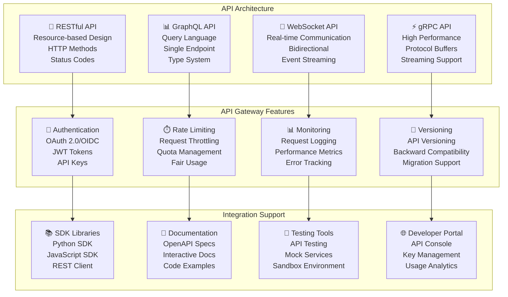

This comprehensive API documentation provides detailed information about all available APIs, integration patterns, authentication methods, and developer resources for the Algorithmic Trading System (ATS).

## API Overview & Architecture

### API Ecosystem

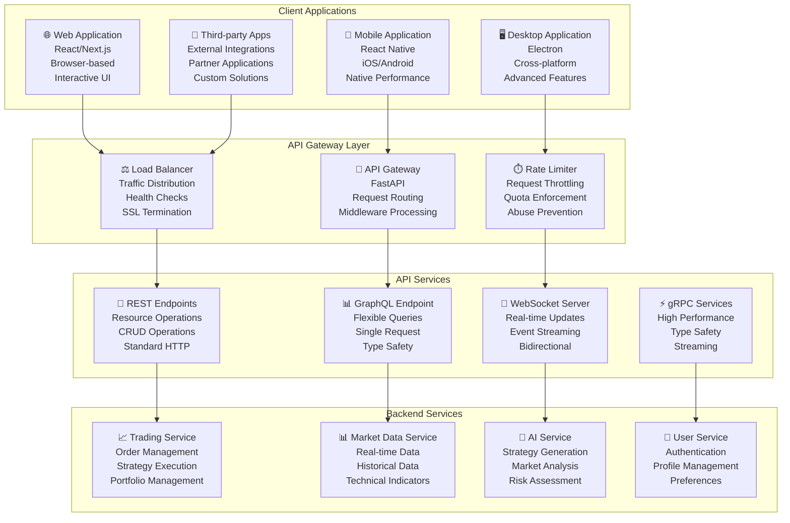

### API Design Principles

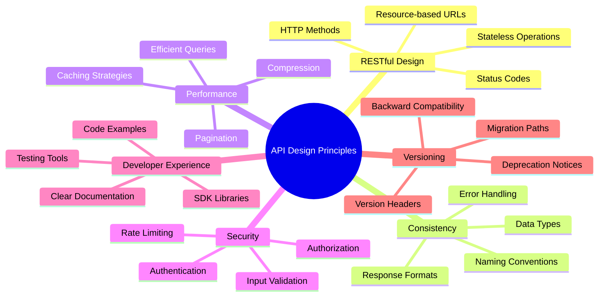

## Authentication & Authorization

### OAuth 2.0 Flow

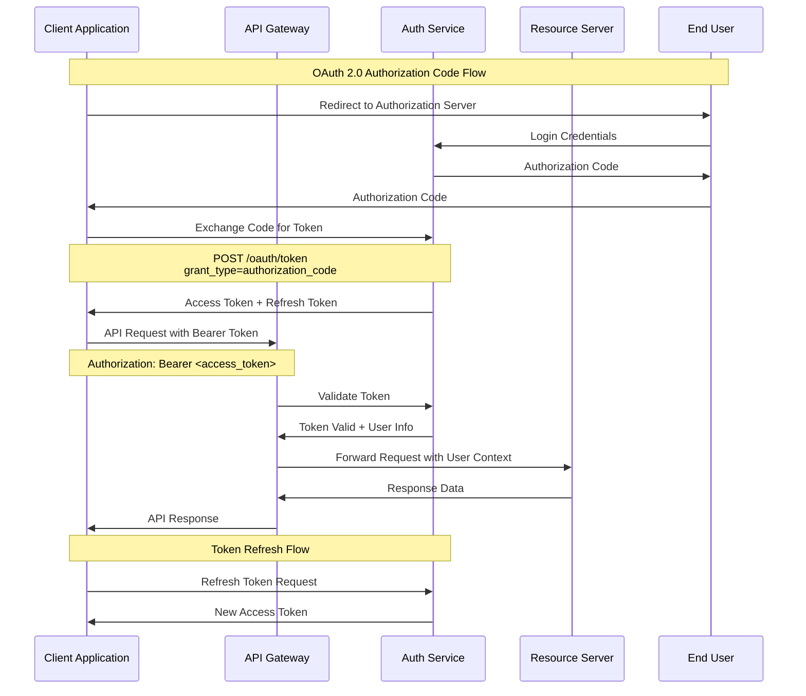

### API Key Authentication

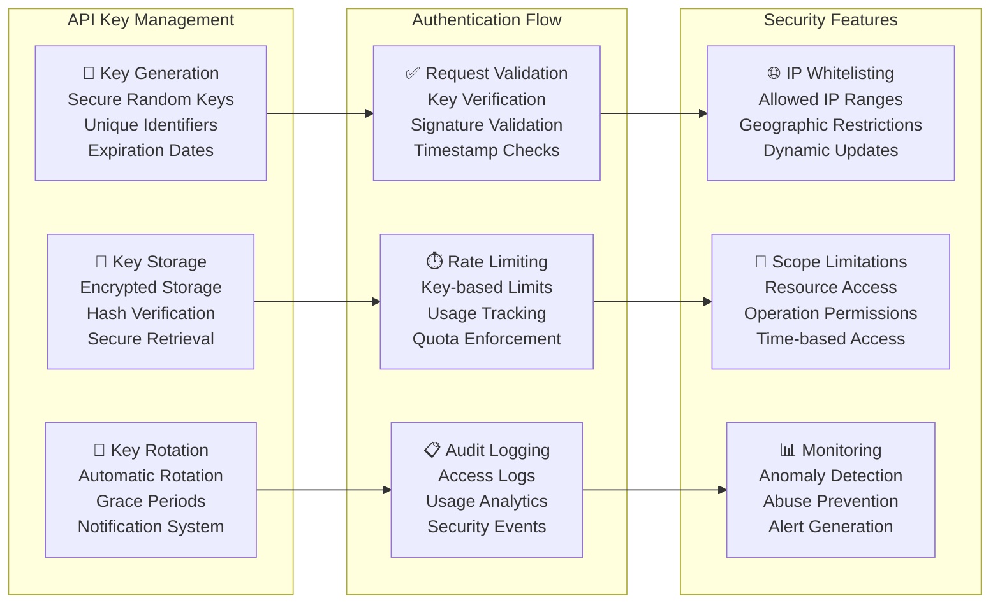

## REST API Specification

### Core Trading Endpoints

```mermaid
graph TB
    subgraph "Account Management"
        GET_ACCOUNTS[GET /api/v1/accounts<br/>📊 List User Accounts<br/>Response: Account[]<br/>Filters: type, status]
        GET_ACCOUNT[GET /api/v1/accounts/{id}<br/>📋 Get Account Details<br/>Response: Account<br/>Includes: balance, positions]
        UPDATE_ACCOUNT[PUT /api/v1/accounts/{id}<br/>✏️ Update Account Settings<br/>Body: AccountUpdate<br/>Response: Account]
    end
    
    subgraph "Portfolio Management"
        GET_PORTFOLIOS[GET /api/v1/portfolios<br/>📊 List Portfolios<br/>Response: Portfolio[]<br/>Filters: account, strategy]
        GET_PORTFOLIO[GET /api/v1/portfolios/{id}<br/>📋 Get Portfolio Details<br/>Response: Portfolio<br/>Includes: positions, performance]
        CREATE_PORTFOLIO[POST /api/v1/portfolios<br/>➕ Create Portfolio<br/>Body: PortfolioCreate<br/>Response: Portfolio]
        UPDATE_PORTFOLIO[PUT /api/v1/portfolios/{id}<br/>✏️ Update Portfolio<br/>Body: PortfolioUpdate<br/>Response: Portfolio]
    end
    
    subgraph "Order Management"
        GET_ORDERS[GET /api/v1/orders<br/>📊 List Orders<br/>Response: Order[]<br/>Filters: status, symbol, date]
        GET_ORDER[GET /api/v1/orders/{id}<br/>📋 Get Order Details<br/>Response: Order<br/>Includes: fills, status]
        CREATE_ORDER[POST /api/v1/orders<br/>➕ Create Order<br/>Body: OrderCreate<br/>Response: Order]
        CANCEL_ORDER[DELETE /api/v1/orders/{id}<br/>❌ Cancel Order<br/>Response: OrderCancel<br/>Status: cancelled]
    end
    
    subgraph "Strategy Management"
        GET_STRATEGIES[GET /api/v1/strategies<br/>📊 List Strategies<br/>Response: Strategy[]<br/>Filters: status, type]
        GET_STRATEGY[GET /api/v1/strategies/{id}<br/>📋 Get Strategy Details<br/>Response: Strategy<br/>Includes: parameters, performance]
        CREATE_STRATEGY[POST /api/v1/strategies<br/>➕ Create Strategy<br/>Body: StrategyCreate<br/>Response: Strategy]
        UPDATE_STRATEGY[PUT /api/v1/strategies/{id}<br/>✏️ Update Strategy<br/>Body: StrategyUpdate<br/>Response: Strategy]
        DEPLOY_STRATEGY[POST /api/v1/strategies/{id}/deploy<br/>🚀 Deploy Strategy<br/>Body: DeploymentConfig<br/>Response: Deployment]
    end
    
    GET_ACCOUNTS --> GET_PORTFOLIOS
    GET_ACCOUNT --> GET_PORTFOLIO
    UPDATE_ACCOUNT --> CREATE_PORTFOLIO
    
    GET_PORTFOLIOS --> GET_ORDERS
    GET_PORTFOLIO --> GET_ORDER
    CREATE_PORTFOLIO --> CREATE_ORDER
    UPDATE_PORTFOLIO --> CANCEL_ORDER
    
    GET_ORDERS --> GET_STRATEGIES
    GET_ORDER --> GET_STRATEGY
    CREATE_ORDER --> CREATE_STRATEGY
    CANCEL_ORDER --> UPDATE_STRATEGY
    
    GET_STRATEGIES --> DEPLOY_STRATEGY
```

### Market Data Endpoints

```mermaid
graph LR
    subgraph "Real-time Data"
        GET_QUOTES[GET /api/v1/quotes/{symbol}<br/>📊 Get Real-time Quote<br/>Response: Quote<br/>Fields: bid, ask, last, volume]
        GET_TRADES[GET /api/v1/trades/{symbol}<br/>📈 Get Recent Trades<br/>Response: Trade[]<br/>Filters: limit, since]
        GET_ORDERBOOK[GET /api/v1/orderbook/{symbol}<br/>📋 Get Order Book<br/>Response: OrderBook<br/>Levels: configurable depth]
    end
    
    subgraph "Historical Data"
        GET_BARS[GET /api/v1/bars/{symbol}<br/>📊 Get Historical Bars<br/>Response: Bar[]<br/>Params: timeframe, start, end]
        GET_TICKS[GET /api/v1/ticks/{symbol}<br/>⚡ Get Tick Data<br/>Response: Tick[]<br/>Params: start, end, limit]
        GET_FUNDAMENTALS[GET /api/v1/fundamentals/{symbol}<br/>📋 Get Fundamental Data<br/>Response: Fundamentals<br/>Fields: financials, ratios]
    end
    
    subgraph "Technical Analysis"
        GET_INDICATORS[GET /api/v1/indicators/{symbol}<br/>📈 Get Technical Indicators<br/>Response: Indicators<br/>Types: SMA, RSI, MACD]
        GET_PATTERNS[GET /api/v1/patterns/{symbol}<br/>🔍 Get Chart Patterns<br/>Response: Pattern[]<br/>Types: support, resistance]
        GET_SIGNALS[GET /api/v1/signals/{symbol}<br/>🎯 Get Trading Signals<br/>Response: Signal[]<br/>Confidence: score, strength]
    end
    
    GET_QUOTES --> GET_BARS
    GET_TRADES --> GET_TICKS
    GET_ORDERBOOK --> GET_FUNDAMENTALS
    
    GET_BARS --> GET_INDICATORS
    GET_TICKS --> GET_PATTERNS
    GET_FUNDAMENTALS --> GET_SIGNALS
```

### AI Assistant Endpoints

```mermaid
graph TB
    subgraph "Natural Language Processing"
        POST_QUERY[POST /api/v1/ai/query<br/>🗣️ Natural Language Query<br/>Body: QueryRequest<br/>Response: QueryResponse]
        POST_STRATEGY_GENERATE[POST /api/v1/ai/strategy/generate<br/>🧠 Generate Strategy<br/>Body: StrategyPrompt<br/>Response: GeneratedStrategy]
        POST_ANALYZE[POST /api/v1/ai/analyze<br/>📊 Analyze Market/Portfolio<br/>Body: AnalysisRequest<br/>Response: AnalysisResult]
    end
    
    subgraph "Agent Interactions"
        GET_AGENTS[GET /api/v1/ai/agents<br/>🤖 List Available Agents<br/>Response: Agent[]<br/>Types: analyst, generator, optimizer]
        POST_AGENT_TASK[POST /api/v1/ai/agents/{type}/task<br/>📋 Assign Task to Agent<br/>Body: TaskRequest<br/>Response: TaskResult]
        GET_AGENT_STATUS[GET /api/v1/ai/agents/{type}/status<br/>📊 Get Agent Status<br/>Response: AgentStatus<br/>Fields: busy, queue, performance]
    end
    
    subgraph "Knowledge Management"
        GET_KNOWLEDGE[GET /api/v1/ai/knowledge<br/>📚 Search Knowledge Base<br/>Query: search terms<br/>Response: KnowledgeResult[]]
        POST_KNOWLEDGE[POST /api/v1/ai/knowledge<br/>➕ Add Knowledge<br/>Body: KnowledgeItem<br/>Response: KnowledgeId]
        GET_CONTEXT[GET /api/v1/ai/context/{session}<br/>🗂️ Get Conversation Context<br/>Response: Context<br/>Fields: history, state]
    end
    
    POST_QUERY --> GET_AGENTS
    POST_STRATEGY_GENERATE --> POST_AGENT_TASK
    POST_ANALYZE --> GET_AGENT_STATUS
    
    GET_AGENTS --> GET_KNOWLEDGE
    POST_AGENT_TASK --> POST_KNOWLEDGE
    GET_AGENT_STATUS --> GET_CONTEXT
```

## GraphQL API Schema

### Core Schema Definition

```graphql
# Core Types
type User {
  id: ID!
  email: String!
  profile: UserProfile!
  accounts: [Account!]!
  preferences: UserPreferences!
  createdAt: DateTime!
  updatedAt: DateTime!
}

type Account {
  id: ID!
  name: String!
  type: AccountType!
  status: AccountStatus!
  balance: Balance!
  positions: [Position!]!
  orders: [Order!]!
  portfolios: [Portfolio!]!
}

type Portfolio {
  id: ID!
  name: String!
  account: Account!
  strategies: [Strategy!]!
  positions: [Position!]!
  performance: PerformanceMetrics!
  riskMetrics: RiskMetrics!
}

type Strategy {
  id: ID!
  name: String!
  description: String
  type: StrategyType!
  status: StrategyStatus!
  parameters: JSON!
  performance: StrategyPerformance!
  backtest: BacktestResult
  deployment: Deployment
}

type Order {
  id: ID!
  symbol: String!
  side: OrderSide!
  type: OrderType!
  quantity: Decimal!
  price: Decimal
  status: OrderStatus!
  fills: [Fill!]!
  createdAt: DateTime!
  updatedAt: DateTime!
}

# Market Data Types
type Quote {
  symbol: String!
  bid: Decimal!
  ask: Decimal!
  last: Decimal!
  volume: Int!
  timestamp: DateTime!
}

type Bar {
  symbol: String!
  timeframe: Timeframe!
  open: Decimal!
  high: Decimal!
  low: Decimal!
  close: Decimal!
  volume: Int!
  timestamp: DateTime!
}

# AI Types
type AIQuery {
  id: ID!
  query: String!
  response: String!
  confidence: Float!
  agent: String!
  context: JSON
  timestamp: DateTime!
}

type GeneratedStrategy {
  id: ID!
  code: String!
  parameters: JSON!
  explanation: String!
  riskAssessment: RiskAssessment!
  backtestSuggestion: BacktestConfig!
}
```

### Query Operations

```mermaid
graph TB
    subgraph "User Queries"
        Q_USER[query user(id: ID!): User<br/>📤 Get user by ID<br/>Includes: profile, accounts<br/>Auth: required]
        Q_USERS[query users(filter: UserFilter): [User!]!<br/>📤 List users with filtering<br/>Pagination: supported<br/>Auth: admin only]
    end
    
    subgraph "Trading Queries"
        Q_ACCOUNT[query account(id: ID!): Account<br/>📤 Get account details<br/>Includes: balance, positions<br/>Auth: owner or admin]
        Q_PORTFOLIO[query portfolio(id: ID!): Portfolio<br/>📤 Get portfolio details<br/>Includes: performance, risk<br/>Auth: owner or admin]
        Q_ORDERS[query orders(filter: OrderFilter): [Order!]!<br/>📤 List orders with filtering<br/>Sorting: timestamp desc<br/>Auth: owner or admin]
        Q_STRATEGIES[query strategies(filter: StrategyFilter): [Strategy!]!<br/>📤 List strategies<br/>Includes: performance<br/>Auth: owner or admin]
    end
    
    subgraph "Market Data Queries"
        Q_QUOTE[query quote(symbol: String!): Quote<br/>📤 Get real-time quote<br/>Cache: 100ms TTL<br/>Auth: optional]
        Q_BARS[query bars(symbol: String!, timeframe: Timeframe!, range: DateRange!): [Bar!]!<br/>📤 Get historical bars<br/>Limit: 10000 bars<br/>Auth: optional]
        Q_INDICATORS[query indicators(symbol: String!, type: IndicatorType!, params: JSON): [Indicator!]!<br/>📤 Get technical indicators<br/>Cache: 1min TTL<br/>Auth: optional]
    end
    
    subgraph "AI Queries"
        Q_AI_QUERY[query aiQuery(input: String!, agent: AgentType): AIQueryResult<br/>📤 Process AI query<br/>Timeout: 30s<br/>Auth: required]
        Q_KNOWLEDGE[query knowledge(search: String!, limit: Int): [KnowledgeItem!]!<br/>📤 Search knowledge base<br/>Fuzzy: supported<br/>Auth: optional]
    end
    
    Q_USER --> Q_ACCOUNT
    Q_USERS --> Q_PORTFOLIO
    Q_ACCOUNT --> Q_ORDERS
    Q_PORTFOLIO --> Q_STRATEGIES
    
    Q_ORDERS --> Q_QUOTE
    Q_STRATEGIES --> Q_BARS
    Q_QUOTE --> Q_INDICATORS
    
    Q_BARS --> Q_AI_QUERY
    Q_INDICATORS --> Q_KNOWLEDGE
```

### Mutation Operations

```mermaid
graph LR
    subgraph "Account Mutations"
        M_CREATE_ACCOUNT[mutation createAccount(input: CreateAccountInput!): Account<br/>➕ Create new account<br/>Validation: required fields<br/>Auth: user or admin]
        M_UPDATE_ACCOUNT[mutation updateAccount(id: ID!, input: UpdateAccountInput!): Account<br/>✏️ Update account settings<br/>Validation: owner only<br/>Auth: owner or admin]
    end
    
    subgraph "Trading Mutations"
        M_CREATE_ORDER[mutation createOrder(input: CreateOrderInput!): Order<br/>➕ Create new order<br/>Validation: risk checks<br/>Auth: account owner]
        M_CANCEL_ORDER[mutation cancelOrder(id: ID!): Order<br/>❌ Cancel existing order<br/>Validation: cancellable status<br/>Auth: order owner]
        M_DEPLOY_STRATEGY[mutation deployStrategy(id: ID!, config: DeploymentConfig!): Deployment<br/>🚀 Deploy strategy<br/>Validation: strategy ready<br/>Auth: strategy owner]
    end
    
    subgraph "AI Mutations"
        M_GENERATE_STRATEGY[mutation generateStrategy(input: StrategyPrompt!): GeneratedStrategy<br/>🧠 Generate AI strategy<br/>Timeout: 60s<br/>Auth: required]
        M_ANALYZE_PORTFOLIO[mutation analyzePortfolio(id: ID!, type: AnalysisType!): AnalysisResult<br/>📊 Analyze portfolio<br/>Async: supported<br/>Auth: portfolio owner]
    end
    
    M_CREATE_ACCOUNT --> M_CREATE_ORDER
    M_UPDATE_ACCOUNT --> M_CANCEL_ORDER
    M_CREATE_ORDER --> M_DEPLOY_STRATEGY
    
    M_CANCEL_ORDER --> M_GENERATE_STRATEGY
    M_DEPLOY_STRATEGY --> M_ANALYZE_PORTFOLIO
```

## WebSocket API

### Real-time Event Streaming

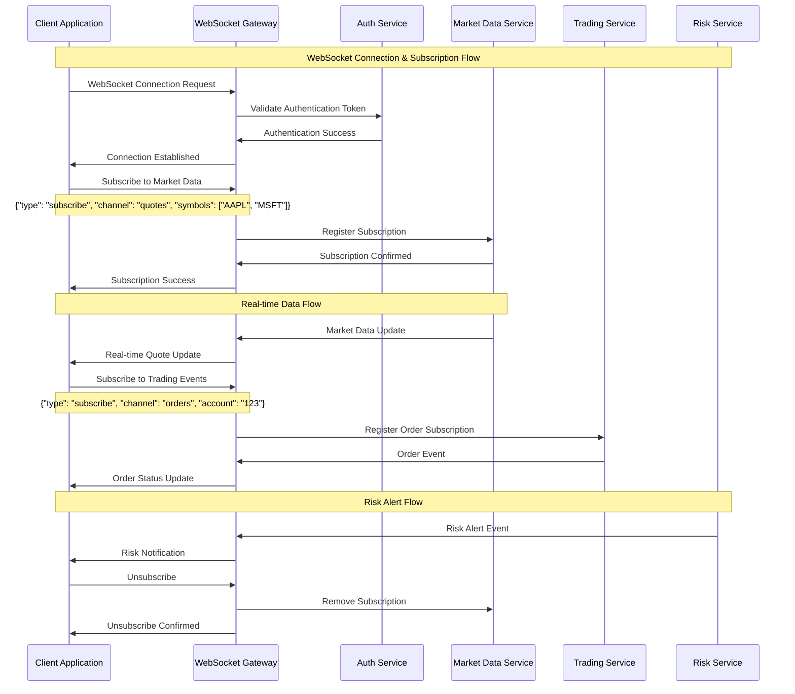

### Event Types & Channels

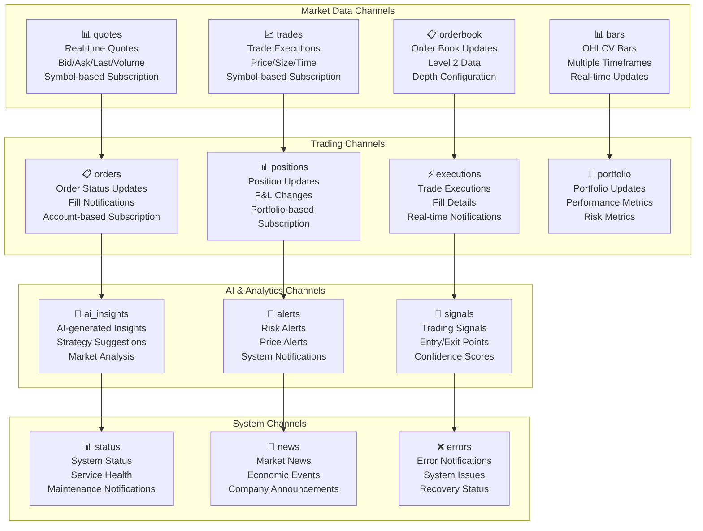

## SDK Libraries & Integration

### Python SDK

```python
# ATS Python SDK Example
from ats_sdk import ATSClient, Order, Strategy
import asyncio

# Initialize client
client = ATSClient(
    api_key="your_api_key",
    secret="your_secret",
    environment="production"  # or "sandbox"
)

# Authentication
await client.authenticate()

# Get account information
accounts = await client.accounts.list()
account = accounts[0]

# Create and submit order
order = Order(
    symbol="AAPL",
    side="buy",
    quantity=100,
    order_type="market",
    account_id=account.id
)

submitted_order = await client.orders.create(order)
print(f"Order submitted: {submitted_order.id}")

# Real-time market data subscription
async def on_quote_update(quote):
    print(f"Quote update: {quote.symbol} - {quote.last}")

await client.market_data.subscribe_quotes(
    symbols=["AAPL", "MSFT"],
    callback=on_quote_update
)

# AI-powered strategy generation
strategy_prompt = "Create a mean reversion strategy for AAPL using RSI"
generated_strategy = await client.ai.generate_strategy(strategy_prompt)

# Deploy strategy to paper trading
deployment = await client.strategies.deploy(
    strategy_id=generated_strategy.id,
    account_id=account.id,
    mode="paper"
)

# Monitor portfolio performance
portfolio = await client.portfolios.get(account.default_portfolio_id)
performance = portfolio.performance

print(f"Total Return: {performance.total_return:.2%}")
print(f"Sharpe Ratio: {performance.sharpe_ratio:.2f}")
```

### JavaScript SDK

```javascript
// ATS JavaScript SDK Example
import { ATSClient, OrderSide, OrderType } from '@ats/sdk';

// Initialize client
const client = new ATSClient({
  apiKey: 'your_api_key',
  secret: 'your_secret',
  environment: 'production'
});

// Authentication
await client.authenticate();

// WebSocket connection for real-time data
const ws = client.websocket();

ws.on('connected', () => {
  console.log('WebSocket connected');
  
  // Subscribe to real-time quotes
  ws.subscribe('quotes', ['AAPL', 'MSFT']);
  
  // Subscribe to order updates
  ws.subscribe('orders', { account_id: 'account_123' });
});

ws.on('quote', (quote) => {
  console.log(`${quote.symbol}: $${quote.last}`);
});

ws.on('order', (order) => {
  console.log(`Order ${order.id} status: ${order.status}`);
});

// Create order using async/await
const createOrder = async () => {
  try {
    const order = await client.orders.create({
      symbol: 'AAPL',
      side: OrderSide.BUY,
      quantity: 100,
      type: OrderType.MARKET,
      account_id: 'account_123'
    });
    
    console.log('Order created:', order.id);
    return order;
  } catch (error) {
    console.error('Order creation failed:', error.message);
  }
};

// AI strategy generation
const generateStrategy = async () => {
  const prompt = 'Create a momentum strategy using MACD crossover';
  
  const strategy = await client.ai.generateStrategy({
    prompt,
    risk_level: 'moderate',
    timeframe: '1h'
  });
  
  console.log('Generated strategy:', strategy.code);
  return strategy;
};

// Portfolio analytics
const analyzePortfolio = async (portfolioId) => {
  const analysis = await client.portfolios.analyze(portfolioId, {
    metrics: ['returns', 'risk', 'attribution'],
    period: '1M'
  });
  
  console.log('Portfolio Analysis:', analysis);
  return analysis;
};
```

### REST Client Examples

```bash
# Authentication
curl -X POST "https://api.ats.example.com/v1/auth/token" \
  -H "Content-Type: application/json" \
  -d '{
    "grant_type": "client_credentials",
    "client_id": "your_client_id",
    "client_secret": "your_client_secret"
  }'

# Get account information
curl -X GET "https://api.ats.example.com/v1/accounts" \
  -H "Authorization: Bearer YOUR_ACCESS_TOKEN" \
  -H "Content-Type: application/json"

# Create order
curl -X POST "https://api.ats.example.com/v1/orders" \
  -H "Authorization: Bearer YOUR_ACCESS_TOKEN" \
  -H "Content-Type: application/json" \
  -d '{
    "symbol": "AAPL",
    "side": "buy",
    "quantity": 100,
    "type": "market",
    "account_id": "account_123"
  }'

# Get real-time quote
curl -X GET "https://api.ats.example.com/v1/quotes/AAPL" \
  -H "Authorization: Bearer YOUR_ACCESS_TOKEN"

# Generate AI strategy
curl -X POST "https://api.ats.example.com/v1/ai/strategy/generate" \
  -H "Authorization: Bearer YOUR_ACCESS_TOKEN" \
  -H "Content-Type: application/json" \
  -d '{
    "prompt": "Create a mean reversion strategy using Bollinger Bands",
    "risk_level": "moderate",
    "timeframe": "15m"
  }'

# Get portfolio performance
curl -X GET "https://api.ats.example.com/v1/portfolios/portfolio_123/performance" \
  -H "Authorization: Bearer YOUR_ACCESS_TOKEN" \
  -G -d "period=1M" -d "benchmark=SPY"
```

## Error Handling & Status Codes

### HTTP Status Codes

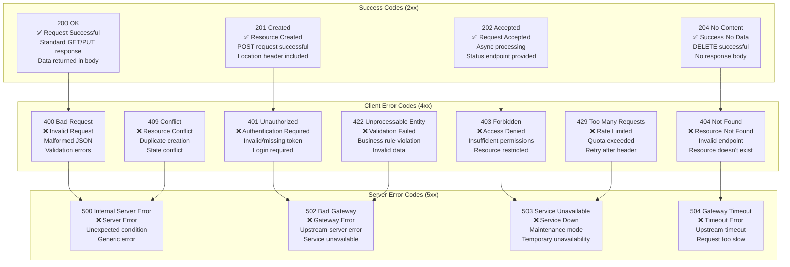

### Error Response Format

```json
{
  "error": {
    "code": "VALIDATION_ERROR",
    "message": "Request validation failed",
    "details": {
      "field": "quantity",
      "reason": "must_be_positive",
      "value": -100
    },
    "request_id": "req_123456789",
    "timestamp": "2025-01-27T12:00:00Z",
    "documentation_url": "https://docs.ats.example.com/errors/validation"
  }
}
```

## Rate Limiting & Quotas

### Rate Limiting Strategy

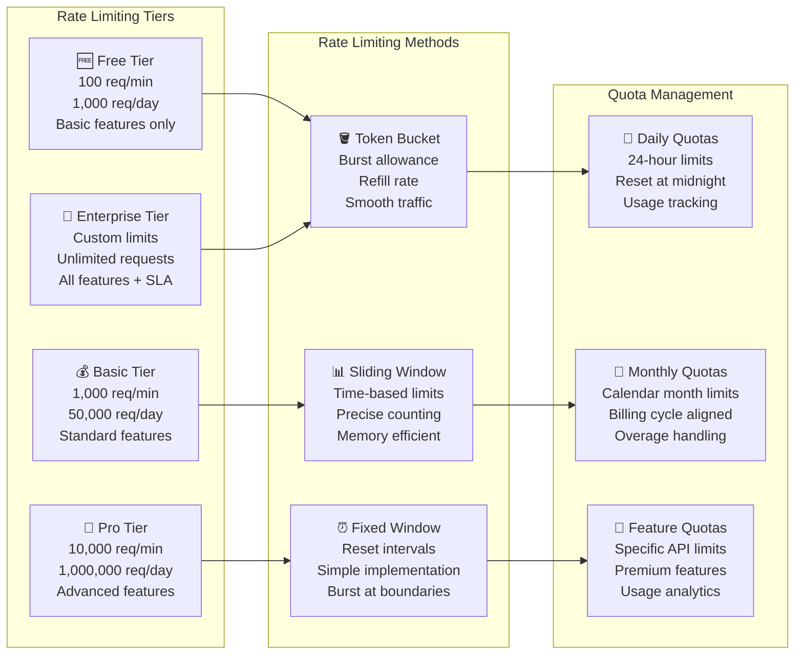

### Rate Limit Headers

```http
HTTP/1.1 200 OK
X-RateLimit-Limit: 1000
X-RateLimit-Remaining: 999
X-RateLimit-Reset: 1643723400
X-RateLimit-Window: 60
Retry-After: 60
```

## Testing & Development Tools

### API Testing Framework

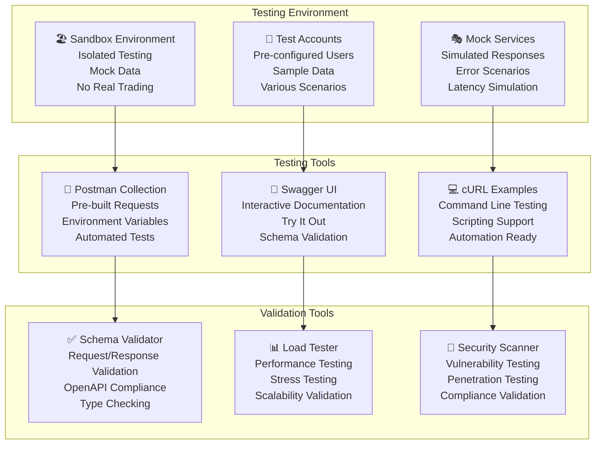

### Developer Portal Features

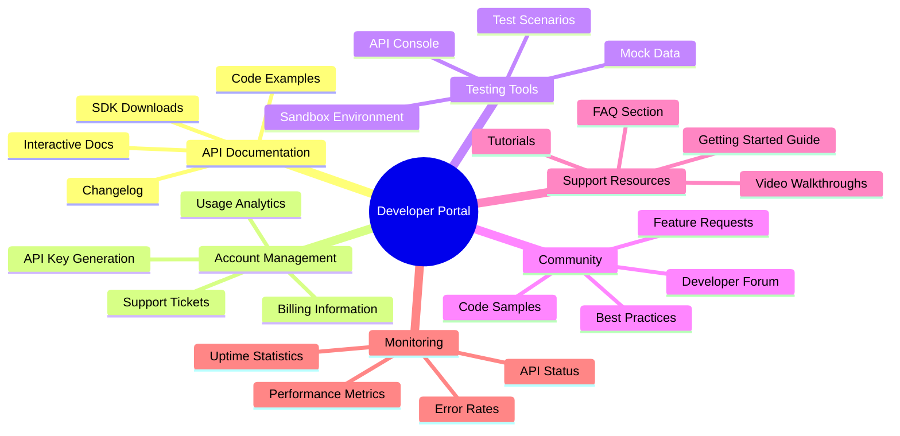

## Performance & Monitoring

### API Performance Metrics

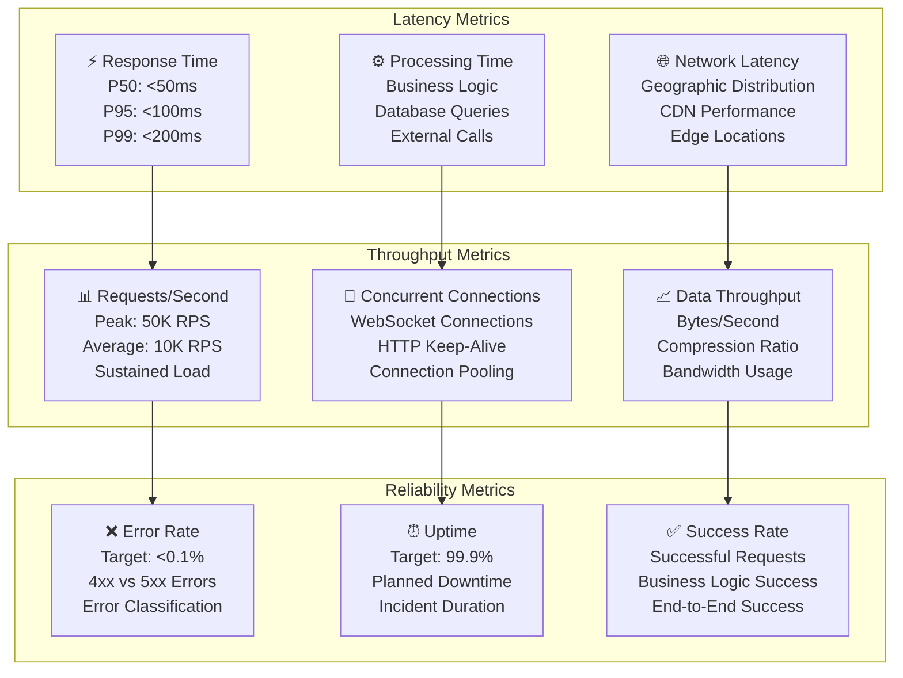

### Monitoring Dashboard

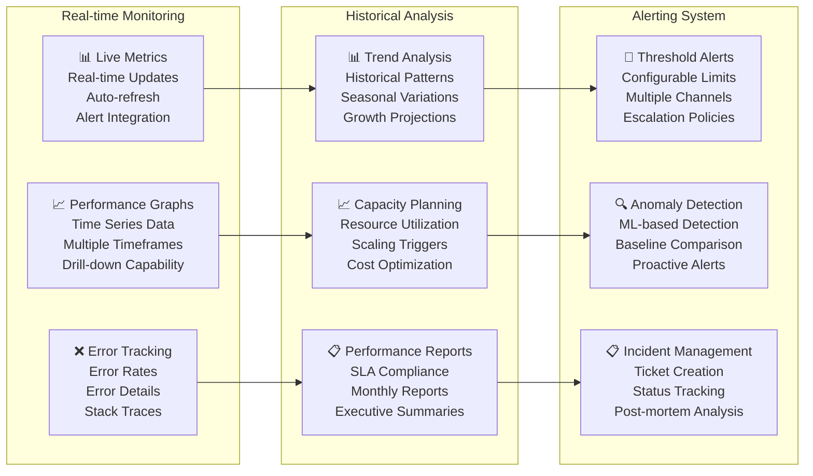

---

**Document Classification**: API Documentation  
**Next Review Date**: 27 April 2025  
**Document Owner**: API Development Team  
**Approval**: Chief Technology Officer, API Committee