# System Architecture Documentation

**Document Version**: 1.0.0  
**Last Updated**: 01 November 2025  
**Classification**: Technical Documentation  
**Owner**: Architecture Team

## Executive Summary

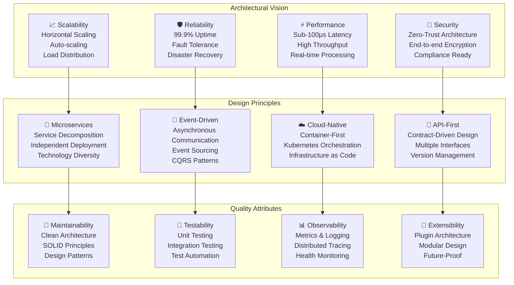
```mermaid
graph TB
    subgraph "Architectural Vision"
        SCALABILITY[📈 Scalability<br/>Horizontal Scaling<br/>Auto-scaling<br/>Load Distribution]
        RELIABILITY[🛡️ Reliability<br/>99.9% Uptime<br/>Fault Tolerance<br/>Disaster Recovery]
        PERFORMANCE[⚡ Performance<br/>Sub-100μs Latency<br/>High Throughput<br/>Real-time Processing]
        SECURITY[🔐 Security<br/>Zero-Trust Architecture<br/>End-to-end Encryption<br/>Compliance Ready]
    end
    
    subgraph "Design Principles"
        MICROSERVICES[🔧 Microservices<br/>Service Decomposition<br/>Independent Deployment<br/>Technology Diversity]
        EVENT_DRIVEN[📡 Event-Driven<br/>Asynchronous Communication<br/>Event Sourcing<br/>CQRS Patterns]
        CLOUD_NATIVE[☁️ Cloud-Native<br/>Container-First<br/>Kubernetes Orchestration<br/>Infrastructure as Code]
        API_FIRST[🔗 API-First<br/>Contract-Driven Design<br/>Multiple Interfaces<br/>Version Management]
    end
    
    subgraph "Quality Attributes"
        MAINTAINABILITY[🔧 Maintainability<br/>Clean Architecture<br/>SOLID Principles<br/>Design Patterns]
        TESTABILITY[🧪 Testability<br/>Unit Testing<br/>Integration Testing<br/>Test Automation]
        OBSERVABILITY[📊 Observability<br/>Metrics & Logging<br/>Distributed Tracing<br/>Health Monitoring]
        EXTENSIBILITY[🔄 Extensibility<br/>Plugin Architecture<br/>Modular Design<br/>Future-Proof]
    end
    
    SCALABILITY --> MICROSERVICES
    RELIABILITY --> EVENT_DRIVEN
    PERFORMANCE --> CLOUD_NATIVE
    SECURITY --> API_FIRST
    
    MICROSERVICES --> MAINTAINABILITY
    EVENT_DRIVEN --> TESTABILITY
    CLOUD_NATIVE --> OBSERVABILITY
    API_FIRST --> EXTENSIBILITY
```

This document provides comprehensive architectural guidance for the Algorithmic Trading System (ATS), covering system design, architectural patterns, technology choices, and implementation strategies. The architecture is designed to support high-frequency trading operations while maintaining enterprise-grade reliability, security, and scalability.

## System Architecture Overview

### High-Level Architecture

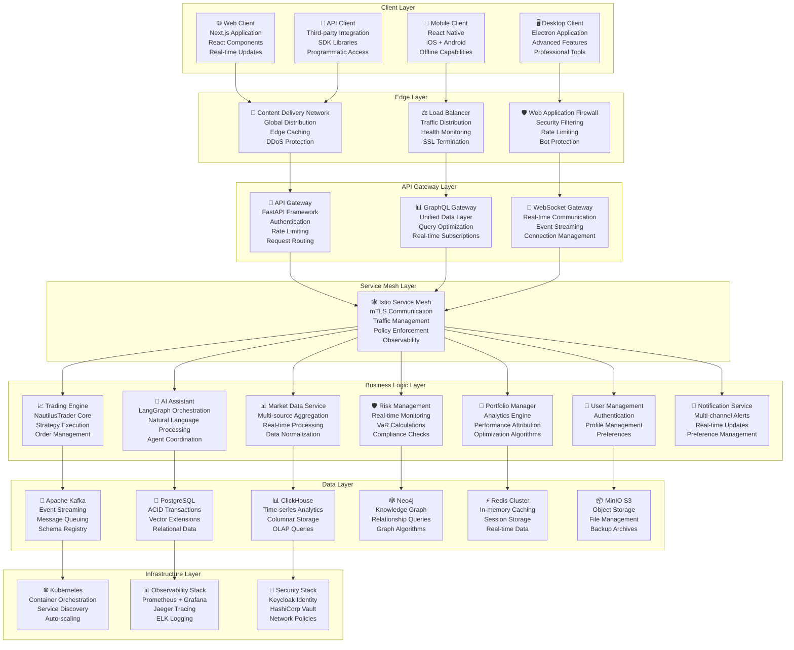
```mermaid
graph TB
    subgraph "Client Layer"
        WEB_CLIENT[🌐 Web Client<br/>Next.js Application<br/>React Components<br/>Real-time Updates]
        MOBILE_CLIENT[📱 Mobile Client<br/>React Native<br/>iOS + Android<br/>Offline Capabilities]
        DESKTOP_CLIENT[🖥️ Desktop Client<br/>Electron Application<br/>Advanced Features<br/>Professional Tools]
        API_CLIENT[🔗 API Client<br/>Third-party Integration<br/>SDK Libraries<br/>Programmatic Access]
    end
    
    subgraph "Edge Layer"
        CDN[🔄 Content Delivery Network<br/>Global Distribution<br/>Edge Caching<br/>DDoS Protection]
        LOAD_BALANCER[⚖️ Load Balancer<br/>Traffic Distribution<br/>Health Monitoring<br/>SSL Termination]
        WAF[🛡️ Web Application Firewall<br/>Security Filtering<br/>Rate Limiting<br/>Bot Protection]
    end
    
    subgraph "API Gateway Layer"
        API_GATEWAY[🚪 API Gateway<br/>FastAPI Framework<br/>Authentication<br/>Rate Limiting<br/>Request Routing]
        GRAPHQL_GATEWAY[📊 GraphQL Gateway<br/>Unified Data Layer<br/>Query Optimization<br/>Real-time Subscriptions]
        WEBSOCKET_GATEWAY[🔌 WebSocket Gateway<br/>Real-time Communication<br/>Event Streaming<br/>Connection Management]
    end
    
    subgraph "Service Mesh Layer"
        SERVICE_MESH[🕸️ Istio Service Mesh<br/>mTLS Communication<br/>Traffic Management<br/>Policy Enforcement<br/>Observability]
    end
    
    subgraph "Business Logic Layer"
        TRADING_SERVICE[📈 Trading Engine<br/>NautilusTrader Core<br/>Strategy Execution<br/>Order Management]
        AI_SERVICE[🤖 AI Assistant<br/>LangGraph Orchestration<br/>Natural Language Processing<br/>Agent Coordination]
        MARKET_DATA_SERVICE[📊 Market Data Service<br/>Multi-source Aggregation<br/>Real-time Processing<br/>Data Normalization]
        RISK_SERVICE[🛡️ Risk Management<br/>Real-time Monitoring<br/>VaR Calculations<br/>Compliance Checks]
        PORTFOLIO_SERVICE[💼 Portfolio Manager<br/>Analytics Engine<br/>Performance Attribution<br/>Optimization Algorithms]
        USER_SERVICE[👤 User Management<br/>Authentication<br/>Profile Management<br/>Preferences]
        NOTIFICATION_SERVICE[📢 Notification Service<br/>Multi-channel Alerts<br/>Real-time Updates<br/>Preference Management]
    end
    
    subgraph "Data Layer"
        EVENT_STORE[📨 Apache Kafka<br/>Event Streaming<br/>Message Queuing<br/>Schema Registry]
        TRANSACTIONAL_DB[🐘 PostgreSQL<br/>ACID Transactions<br/>Vector Extensions<br/>Relational Data]
        ANALYTICAL_DB[📊 ClickHouse<br/>Time-series Analytics<br/>Columnar Storage<br/>OLAP Queries]
        GRAPH_DB[🕸️ Neo4j<br/>Knowledge Graph<br/>Relationship Queries<br/>Graph Algorithms]
        CACHE_LAYER[⚡ Redis Cluster<br/>In-memory Caching<br/>Session Storage<br/>Real-time Data]
        OBJECT_STORAGE[📦 MinIO S3<br/>Object Storage<br/>File Management<br/>Backup Archives]
    end
    
    subgraph "Infrastructure Layer"
        KUBERNETES[☸️ Kubernetes<br/>Container Orchestration<br/>Service Discovery<br/>Auto-scaling]
        MONITORING[📊 Observability Stack<br/>Prometheus + Grafana<br/>Jaeger Tracing<br/>ELK Logging]
        SECURITY[🔐 Security Stack<br/>Keycloak Identity<br/>HashiCorp Vault<br/>Network Policies]
    end
    
    WEB_CLIENT --> CDN
    MOBILE_CLIENT --> LOAD_BALANCER
    DESKTOP_CLIENT --> WAF
    API_CLIENT --> CDN
    
    CDN --> API_GATEWAY
    LOAD_BALANCER --> GRAPHQL_GATEWAY
    WAF --> WEBSOCKET_GATEWAY
    
    API_GATEWAY --> SERVICE_MESH
    GRAPHQL_GATEWAY --> SERVICE_MESH
    WEBSOCKET_GATEWAY --> SERVICE_MESH
    
    SERVICE_MESH --> TRADING_SERVICE
    SERVICE_MESH --> AI_SERVICE
    SERVICE_MESH --> MARKET_DATA_SERVICE
    SERVICE_MESH --> RISK_SERVICE
    SERVICE_MESH --> PORTFOLIO_SERVICE
    SERVICE_MESH --> USER_SERVICE
    SERVICE_MESH --> NOTIFICATION_SERVICE
    
    TRADING_SERVICE --> EVENT_STORE
    AI_SERVICE --> TRANSACTIONAL_DB
    MARKET_DATA_SERVICE --> ANALYTICAL_DB
    RISK_SERVICE --> GRAPH_DB
    PORTFOLIO_SERVICE --> CACHE_LAYER
    USER_SERVICE --> OBJECT_STORAGE
    
    EVENT_STORE --> KUBERNETES
    TRANSACTIONAL_DB --> MONITORING
    ANALYTICAL_DB --> SECURITY
```

## Microservices Architecture

### Service Decomposition Strategy

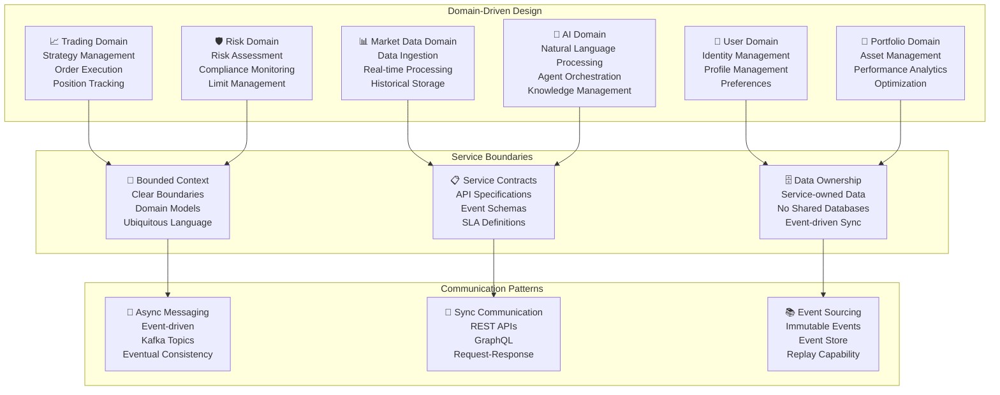
```mermaid
graph TB
    subgraph "Domain-Driven Design"
        TRADING_DOMAIN[📈 Trading Domain<br/>Strategy Management<br/>Order Execution<br/>Position Tracking]
        MARKET_DOMAIN[📊 Market Data Domain<br/>Data Ingestion<br/>Real-time Processing<br/>Historical Storage]
        USER_DOMAIN[👤 User Domain<br/>Identity Management<br/>Profile Management<br/>Preferences]
        RISK_DOMAIN[🛡️ Risk Domain<br/>Risk Assessment<br/>Compliance Monitoring<br/>Limit Management]
        AI_DOMAIN[🤖 AI Domain<br/>Natural Language Processing<br/>Agent Orchestration<br/>Knowledge Management]
        PORTFOLIO_DOMAIN[💼 Portfolio Domain<br/>Asset Management<br/>Performance Analytics<br/>Optimization]
    end
    
    subgraph "Service Boundaries"
        BOUNDED_CONTEXT[🔲 Bounded Context<br/>Clear Boundaries<br/>Domain Models<br/>Ubiquitous Language]
        SERVICE_CONTRACTS[📋 Service Contracts<br/>API Specifications<br/>Event Schemas<br/>SLA Definitions]
        DATA_OWNERSHIP[🗄️ Data Ownership<br/>Service-owned Data<br/>No Shared Databases<br/>Event-driven Sync]
    end
    
    subgraph "Communication Patterns"
        ASYNC_MESSAGING[📨 Async Messaging<br/>Event-driven<br/>Kafka Topics<br/>Eventual Consistency]
        SYNC_COMMUNICATION[🔄 Sync Communication<br/>REST APIs<br/>GraphQL<br/>Request-Response]
        EVENT_SOURCING[📚 Event Sourcing<br/>Immutable Events<br/>Event Store<br/>Replay Capability]
    end
    
    TRADING_DOMAIN --> BOUNDED_CONTEXT
    MARKET_DOMAIN --> SERVICE_CONTRACTS
    USER_DOMAIN --> DATA_OWNERSHIP
    RISK_DOMAIN --> BOUNDED_CONTEXT
    AI_DOMAIN --> SERVICE_CONTRACTS
    PORTFOLIO_DOMAIN --> DATA_OWNERSHIP
    
    BOUNDED_CONTEXT --> ASYNC_MESSAGING
    SERVICE_CONTRACTS --> SYNC_COMMUNICATION
    DATA_OWNERSHIP --> EVENT_SOURCING
```

### Service Interaction Patterns

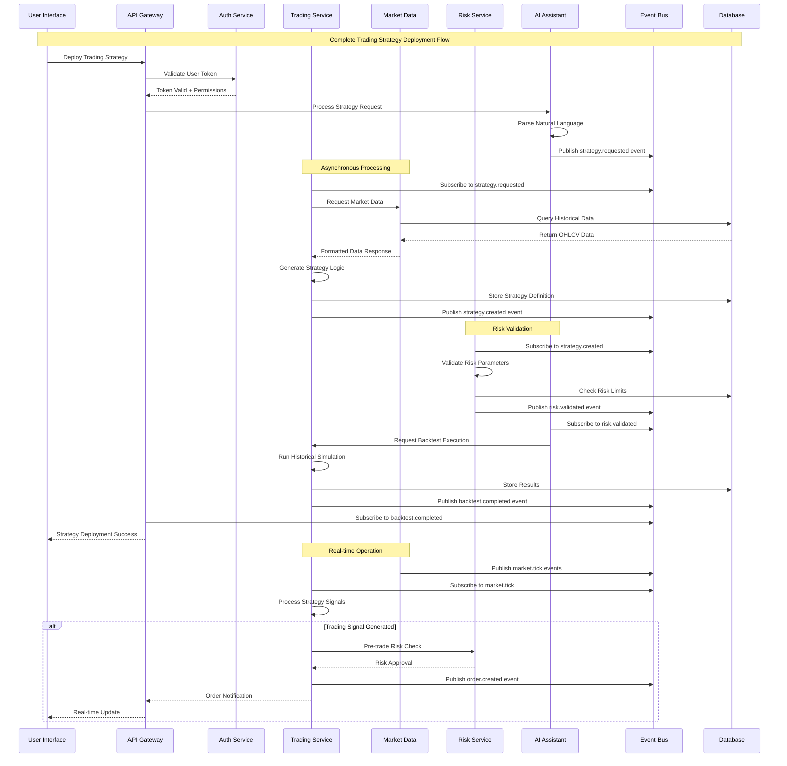
```mermaid
sequenceDiagram
    participant User as User Interface
    participant Gateway as API Gateway
    participant Auth as Auth Service
    participant Trading as Trading Service
    participant Market as Market Data
    participant Risk as Risk Service
    participant AI as AI Assistant
    participant Kafka as Event Bus
    participant DB as Database
    
    Note over User, DB: Complete Trading Strategy Deployment Flow
    
    User->>Gateway: Deploy Trading Strategy
    Gateway->>Auth: Validate User Token
    Auth-->>Gateway: Token Valid + Permissions
    
    Gateway->>AI: Process Strategy Request
    AI->>AI: Parse Natural Language
    AI->>Kafka: Publish strategy.requested event
    
    Note over Trading, Market: Asynchronous Processing
    Trading->>Kafka: Subscribe to strategy.requested
    Trading->>Market: Request Market Data
    Market->>DB: Query Historical Data
    DB-->>Market: Return OHLCV Data
    Market-->>Trading: Formatted Data Response
    
    Trading->>Trading: Generate Strategy Logic
    Trading->>DB: Store Strategy Definition
    Trading->>Kafka: Publish strategy.created event
    
    Note over Risk, AI: Risk Validation
    Risk->>Kafka: Subscribe to strategy.created
    Risk->>Risk: Validate Risk Parameters
    Risk->>DB: Check Risk Limits
    Risk->>Kafka: Publish risk.validated event
    
    AI->>Kafka: Subscribe to risk.validated
    AI->>Trading: Request Backtest Execution
    Trading->>Trading: Run Historical Simulation
    Trading->>DB: Store Results
    Trading->>Kafka: Publish backtest.completed event
    
    Gateway->>Kafka: Subscribe to backtest.completed
    Gateway-->>User: Strategy Deployment Success
    
    Note over Market, Trading: Real-time Operation
    Market->>Kafka: Publish market.tick events
    Trading->>Kafka: Subscribe to market.tick
    Trading->>Trading: Process Strategy Signals
    
    alt Trading Signal Generated
        Trading->>Risk: Pre-trade Risk Check
        Risk-->>Trading: Risk Approval
        Trading->>Kafka: Publish order.created event
        Trading-->>Gateway: Order Notification
        Gateway-->>User: Real-time Update
    end
```

## Event-Driven Architecture

### Event Streaming Infrastructure

```mermaid
graph TB
    subgraph "Kafka Cluster Architecture"
        KAFKA_BROKERS[🚌 Kafka Brokers<br/>3-node Cluster<br/>Replication Factor 3<br/>High Availability]
        ZOOKEEPER[🐘 ZooKeeper Ensemble<br/>3-node Cluster<br/>Configuration Management<br/>Leader Election]
        SCHEMA_REGISTRY[📋 Schema Registry<br/>Avro Schemas<br/>Schema Evolution<br/>Compatibility Checks]
        KAFKA_CONNECT[🔌 Kafka Connect<br/>Source/Sink Connectors<br/>Data Integration<br/>Change Data Capture]
    end
    
    subgraph "Topic Architecture"
        MARKET_TOPICS[📊 Market Data Topics<br/>market.tick.{symbol}.{exchange}<br/>market.quote.{symbol}.{exchange}<br/>market.trade.{symbol}.{exchange}]
        TRADING_TOPICS[📈 Trading Topics<br/>strategy.{action}.{user}.{id}<br/>order.{action}.{symbol}.{account}<br/>position.{action}.{portfolio}.{symbol}]
        RISK_TOPICS[🛡️ Risk Topics<br/>risk.{type}.{severity}.{portfolio}<br/>limit.{action}.{type}.{user}<br/>compliance.{event}.{regulation}]
        AI_TOPICS[🤖 AI Topics<br/>ai.{agent}.{action}.{context}<br/>query.{type}.{user}.{session}<br/>recommendation.{type}.{confidence}]
        USER_TOPICS[👤 User Topics<br/>user.{action}.{id}.{context}<br/>session.{action}.{user}.{device}<br/>preference.{action}.{user}.{type}]
    end
    
    subgraph "Event Processing Patterns"
        STREAM_PROCESSING[🌊 Stream Processing<br/>Kafka Streams<br/>Real-time Analytics<br/>Windowed Operations]
        EVENT_SOURCING[📚 Event Sourcing<br/>Immutable Event Log<br/>State Reconstruction<br/>Temporal Queries]
        CQRS[📊 CQRS Pattern<br/>Command Query Separation<br/>Read/Write Models<br/>Eventual Consistency]
        SAGA_PATTERN[🔄 Saga Pattern<br/>Distributed Transactions<br/>Compensating Actions<br/>Long-running Processes]
    end
    
    KAFKA_BROKERS --> MARKET_TOPICS
    ZOOKEEPER --> TRADING_TOPICS
    SCHEMA_REGISTRY --> RISK_TOPICS
    KAFKA_CONNECT --> AI_TOPICS
    
    MARKET_TOPICS --> STREAM_PROCESSING
    TRADING_TOPICS --> EVENT_SOURCING
    RISK_TOPICS --> CQRS
    AI_TOPICS --> SAGA_PATTERN
    USER_TOPICS --> STREAM_PROCESSING
```

### Event Schema Management

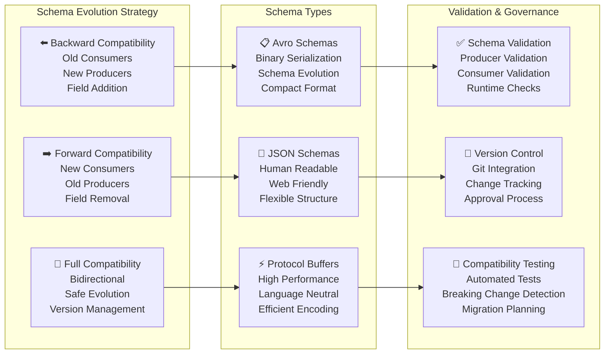
```mermaid
graph LR
    subgraph "Schema Evolution Strategy"
        BACKWARD_COMPAT[⬅️ Backward Compatibility<br/>Old Consumers<br/>New Producers<br/>Field Addition]
        FORWARD_COMPAT[➡️ Forward Compatibility<br/>New Consumers<br/>Old Producers<br/>Field Removal]
        FULL_COMPAT[🔄 Full Compatibility<br/>Bidirectional<br/>Safe Evolution<br/>Version Management]
    end
    
    subgraph "Schema Types"
        AVRO_SCHEMAS[📋 Avro Schemas<br/>Binary Serialization<br/>Schema Evolution<br/>Compact Format]
        JSON_SCHEMAS[📄 JSON Schemas<br/>Human Readable<br/>Web Friendly<br/>Flexible Structure]
        PROTOBUF_SCHEMAS[⚡ Protocol Buffers<br/>High Performance<br/>Language Neutral<br/>Efficient Encoding]
    end
    
    subgraph "Validation & Governance"
        SCHEMA_VALIDATION[✅ Schema Validation<br/>Producer Validation<br/>Consumer Validation<br/>Runtime Checks]
        VERSION_CONTROL[📝 Version Control<br/>Git Integration<br/>Change Tracking<br/>Approval Process]
        COMPATIBILITY_TESTING[🧪 Compatibility Testing<br/>Automated Tests<br/>Breaking Change Detection<br/>Migration Planning]
    end
    
    BACKWARD_COMPAT --> AVRO_SCHEMAS
    FORWARD_COMPAT --> JSON_SCHEMAS
    FULL_COMPAT --> PROTOBUF_SCHEMAS
    
    AVRO_SCHEMAS --> SCHEMA_VALIDATION
    JSON_SCHEMAS --> VERSION_CONTROL
    PROTOBUF_SCHEMAS --> COMPATIBILITY_TESTING
```

## Data Architecture

### Polyglot Persistence Strategy

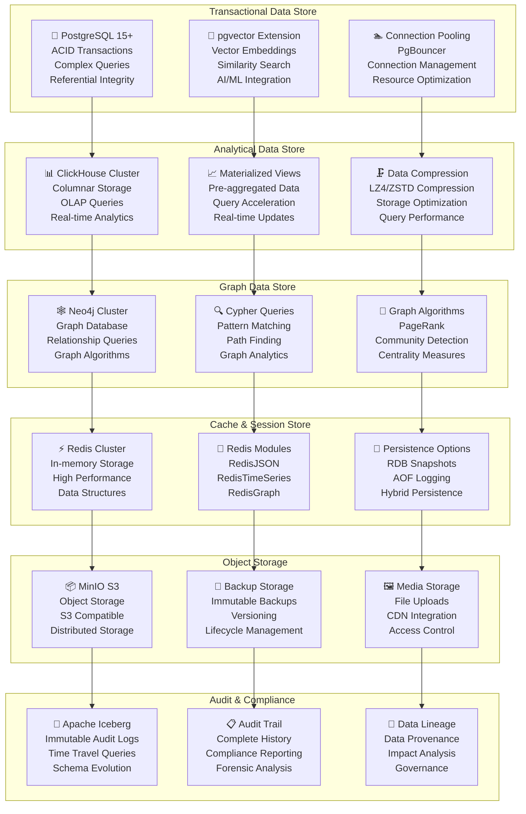
```mermaid
graph TB
    subgraph "Transactional Data Store"
        POSTGRESQL[🐘 PostgreSQL 15+<br/>ACID Transactions<br/>Complex Queries<br/>Referential Integrity]
        PGVECTOR[🧠 pgvector Extension<br/>Vector Embeddings<br/>Similarity Search<br/>AI/ML Integration]
        CONNECTION_POOL[🏊 Connection Pooling<br/>PgBouncer<br/>Connection Management<br/>Resource Optimization]
    end
    
    subgraph "Analytical Data Store"
        CLICKHOUSE[📊 ClickHouse Cluster<br/>Columnar Storage<br/>OLAP Queries<br/>Real-time Analytics]
        MATERIALIZED_VIEWS[📈 Materialized Views<br/>Pre-aggregated Data<br/>Query Acceleration<br/>Real-time Updates]
        COMPRESSION[🗜️ Data Compression<br/>LZ4/ZSTD Compression<br/>Storage Optimization<br/>Query Performance]
    end
    
    subgraph "Graph Data Store"
        NEO4J[🕸️ Neo4j Cluster<br/>Graph Database<br/>Relationship Queries<br/>Graph Algorithms]
        CYPHER_QUERIES[🔍 Cypher Queries<br/>Pattern Matching<br/>Path Finding<br/>Graph Analytics]
        GRAPH_ALGORITHMS[🧮 Graph Algorithms<br/>PageRank<br/>Community Detection<br/>Centrality Measures]
    end
    
    subgraph "Cache & Session Store"
        REDIS_CLUSTER[⚡ Redis Cluster<br/>In-memory Storage<br/>High Performance<br/>Data Structures]
        REDIS_MODULES[🔧 Redis Modules<br/>RedisJSON<br/>RedisTimeSeries<br/>RedisGraph]
        PERSISTENCE[💾 Persistence Options<br/>RDB Snapshots<br/>AOF Logging<br/>Hybrid Persistence]
    end
    
    subgraph "Object Storage"
        MINIO[📦 MinIO S3<br/>Object Storage<br/>S3 Compatible<br/>Distributed Storage]
        BACKUP_STORAGE[💾 Backup Storage<br/>Immutable Backups<br/>Versioning<br/>Lifecycle Management]
        MEDIA_STORAGE[🖼️ Media Storage<br/>File Uploads<br/>CDN Integration<br/>Access Control]
    end
    
    subgraph "Audit & Compliance"
        APACHE_ICEBERG[🧊 Apache Iceberg<br/>Immutable Audit Logs<br/>Time Travel Queries<br/>Schema Evolution]
        AUDIT_TRAIL[📋 Audit Trail<br/>Complete History<br/>Compliance Reporting<br/>Forensic Analysis]
        DATA_LINEAGE[🔗 Data Lineage<br/>Data Provenance<br/>Impact Analysis<br/>Governance]
    end
    
    POSTGRESQL --> CLICKHOUSE
    PGVECTOR --> MATERIALIZED_VIEWS
    CONNECTION_POOL --> COMPRESSION
    
    CLICKHOUSE --> NEO4J
    MATERIALIZED_VIEWS --> CYPHER_QUERIES
    COMPRESSION --> GRAPH_ALGORITHMS
    
    NEO4J --> REDIS_CLUSTER
    CYPHER_QUERIES --> REDIS_MODULES
    GRAPH_ALGORITHMS --> PERSISTENCE
    
    REDIS_CLUSTER --> MINIO
    REDIS_MODULES --> BACKUP_STORAGE
    PERSISTENCE --> MEDIA_STORAGE
    
    MINIO --> APACHE_ICEBERG
    BACKUP_STORAGE --> AUDIT_TRAIL
    MEDIA_STORAGE --> DATA_LINEAGE
```

### Data Flow Architecture

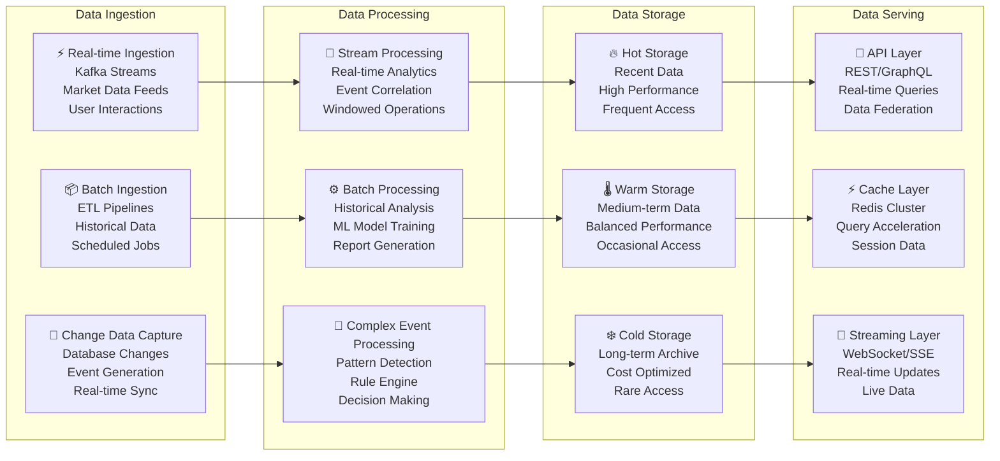
```mermaid
graph LR
    subgraph "Data Ingestion"
        REAL_TIME[⚡ Real-time Ingestion<br/>Kafka Streams<br/>Market Data Feeds<br/>User Interactions]
        BATCH_INGESTION[📦 Batch Ingestion<br/>ETL Pipelines<br/>Historical Data<br/>Scheduled Jobs]
        CHANGE_CAPTURE[🔄 Change Data Capture<br/>Database Changes<br/>Event Generation<br/>Real-time Sync]
    end
    
    subgraph "Data Processing"
        STREAM_PROCESSING[🌊 Stream Processing<br/>Real-time Analytics<br/>Event Correlation<br/>Windowed Operations]
        BATCH_PROCESSING[⚙️ Batch Processing<br/>Historical Analysis<br/>ML Model Training<br/>Report Generation]
        COMPLEX_PROCESSING[🧠 Complex Event Processing<br/>Pattern Detection<br/>Rule Engine<br/>Decision Making]
    end
    
    subgraph "Data Storage"
        HOT_STORAGE[🔥 Hot Storage<br/>Recent Data<br/>High Performance<br/>Frequent Access]
        WARM_STORAGE[🌡️ Warm Storage<br/>Medium-term Data<br/>Balanced Performance<br/>Occasional Access]
        COLD_STORAGE[❄️ Cold Storage<br/>Long-term Archive<br/>Cost Optimized<br/>Rare Access]
    end
    
    subgraph "Data Serving"
        API_LAYER[🔗 API Layer<br/>REST/GraphQL<br/>Real-time Queries<br/>Data Federation]
        CACHE_LAYER[⚡ Cache Layer<br/>Redis Cluster<br/>Query Acceleration<br/>Session Data]
        STREAMING_LAYER[📡 Streaming Layer<br/>WebSocket/SSE<br/>Real-time Updates<br/>Live Data]
    end
    
    REAL_TIME --> STREAM_PROCESSING
    BATCH_INGESTION --> BATCH_PROCESSING
    CHANGE_CAPTURE --> COMPLEX_PROCESSING
    
    STREAM_PROCESSING --> HOT_STORAGE
    BATCH_PROCESSING --> WARM_STORAGE
    COMPLEX_PROCESSING --> COLD_STORAGE
    
    HOT_STORAGE --> API_LAYER
    WARM_STORAGE --> CACHE_LAYER
    COLD_STORAGE --> STREAMING_LAYER
```

## AI/ML Architecture

### AI Agent Ecosystem

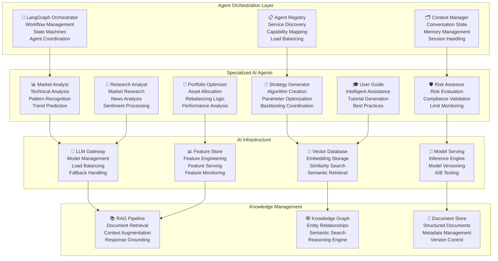
```mermaid
graph TB
    subgraph "Agent Orchestration Layer"
        LANGGRAPH[🧠 LangGraph Orchestrator<br/>Workflow Management<br/>State Machines<br/>Agent Coordination]
        AGENT_REGISTRY[📋 Agent Registry<br/>Service Discovery<br/>Capability Mapping<br/>Load Balancing]
        CONTEXT_MANAGER[🗂️ Context Manager<br/>Conversation State<br/>Memory Management<br/>Session Handling]
    end
    
    subgraph "Specialized AI Agents"
        MARKET_ANALYST[📊 Market Analyst<br/>Technical Analysis<br/>Pattern Recognition<br/>Trend Prediction]
        STRATEGY_GENERATOR[🎯 Strategy Generator<br/>Algorithm Creation<br/>Parameter Optimization<br/>Backtesting Coordination]
        RISK_ASSESSOR[🛡️ Risk Assessor<br/>Risk Evaluation<br/>Compliance Validation<br/>Limit Monitoring]
        PORTFOLIO_OPTIMIZER[💼 Portfolio Optimizer<br/>Asset Allocation<br/>Rebalancing Logic<br/>Performance Analysis]
        RESEARCH_ANALYST[🔬 Research Analyst<br/>Market Research<br/>News Analysis<br/>Sentiment Processing]
        USER_GUIDE[🎓 User Guide<br/>Intelligent Assistance<br/>Tutorial Generation<br/>Best Practices]
    end
    
    subgraph "AI Infrastructure"
        LLM_GATEWAY[🚪 LLM Gateway<br/>Model Management<br/>Load Balancing<br/>Fallback Handling]
        VECTOR_DATABASE[🧠 Vector Database<br/>Embedding Storage<br/>Similarity Search<br/>Semantic Retrieval]
        MODEL_SERVING[🤖 Model Serving<br/>Inference Engine<br/>Model Versioning<br/>A/B Testing]
        FEATURE_STORE[📊 Feature Store<br/>Feature Engineering<br/>Feature Serving<br/>Feature Monitoring]
    end
    
    subgraph "Knowledge Management"
        RAG_PIPELINE[📚 RAG Pipeline<br/>Document Retrieval<br/>Context Augmentation<br/>Response Grounding]
        KNOWLEDGE_GRAPH[🕸️ Knowledge Graph<br/>Entity Relationships<br/>Semantic Search<br/>Reasoning Engine]
        DOCUMENT_STORE[📄 Document Store<br/>Structured Documents<br/>Metadata Management<br/>Version Control]
    end
    
    LANGGRAPH --> MARKET_ANALYST
    AGENT_REGISTRY --> STRATEGY_GENERATOR
    CONTEXT_MANAGER --> RISK_ASSESSOR
    
    MARKET_ANALYST --> LLM_GATEWAY
    STRATEGY_GENERATOR --> VECTOR_DATABASE
    RISK_ASSESSOR --> MODEL_SERVING
    PORTFOLIO_OPTIMIZER --> FEATURE_STORE
    RESEARCH_ANALYST --> LLM_GATEWAY
    USER_GUIDE --> VECTOR_DATABASE
    
    LLM_GATEWAY --> RAG_PIPELINE
    VECTOR_DATABASE --> KNOWLEDGE_GRAPH
    MODEL_SERVING --> DOCUMENT_STORE
    FEATURE_STORE --> RAG_PIPELINE
```

### Machine Learning Pipeline

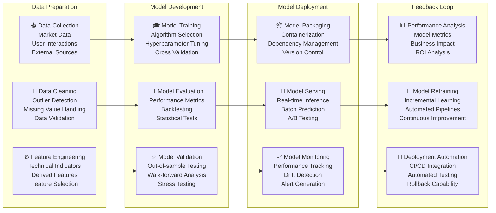
```mermaid
graph LR
    subgraph "Data Preparation"
        DATA_COLLECTION[📥 Data Collection<br/>Market Data<br/>User Interactions<br/>External Sources]
        DATA_CLEANING[🧹 Data Cleaning<br/>Outlier Detection<br/>Missing Value Handling<br/>Data Validation]
        FEATURE_ENGINEERING[⚙️ Feature Engineering<br/>Technical Indicators<br/>Derived Features<br/>Feature Selection]
    end
    
    subgraph "Model Development"
        MODEL_TRAINING[🎓 Model Training<br/>Algorithm Selection<br/>Hyperparameter Tuning<br/>Cross Validation]
        MODEL_EVALUATION[📊 Model Evaluation<br/>Performance Metrics<br/>Backtesting<br/>Statistical Tests]
        MODEL_VALIDATION[✅ Model Validation<br/>Out-of-sample Testing<br/>Walk-forward Analysis<br/>Stress Testing]
    end
    
    subgraph "Model Deployment"
        MODEL_PACKAGING[📦 Model Packaging<br/>Containerization<br/>Dependency Management<br/>Version Control]
        MODEL_SERVING[🚀 Model Serving<br/>Real-time Inference<br/>Batch Prediction<br/>A/B Testing]
        MODEL_MONITORING[📈 Model Monitoring<br/>Performance Tracking<br/>Drift Detection<br/>Alert Generation]
    end
    
    subgraph "Feedback Loop"
        PERFORMANCE_ANALYSIS[📊 Performance Analysis<br/>Model Metrics<br/>Business Impact<br/>ROI Analysis]
        MODEL_RETRAINING[🔄 Model Retraining<br/>Incremental Learning<br/>Automated Pipelines<br/>Continuous Improvement]
        DEPLOYMENT_AUTOMATION[🤖 Deployment Automation<br/>CI/CD Integration<br/>Automated Testing<br/>Rollback Capability]
    end
    
    DATA_COLLECTION --> MODEL_TRAINING
    DATA_CLEANING --> MODEL_EVALUATION
    FEATURE_ENGINEERING --> MODEL_VALIDATION
    
    MODEL_TRAINING --> MODEL_PACKAGING
    MODEL_EVALUATION --> MODEL_SERVING
    MODEL_VALIDATION --> MODEL_MONITORING
    
    MODEL_PACKAGING --> PERFORMANCE_ANALYSIS
    MODEL_SERVING --> MODEL_RETRAINING
    MODEL_MONITORING --> DEPLOYMENT_AUTOMATION
```

## Performance Architecture

### Latency Optimization Strategy

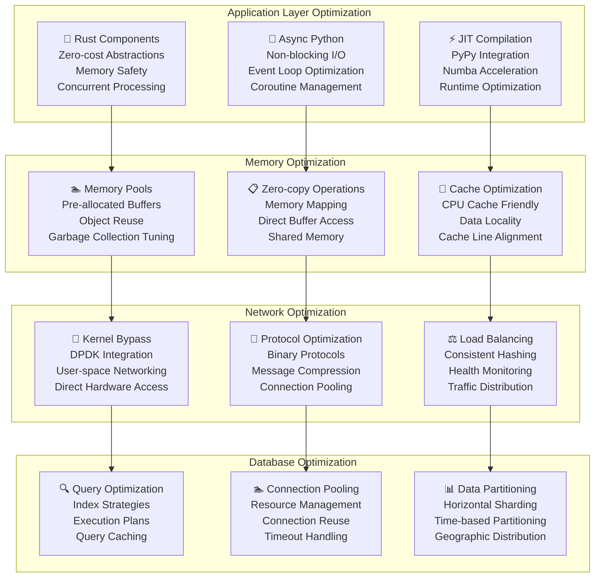
```mermaid
graph TB
    subgraph "Application Layer Optimization"
        RUST_COMPONENTS[🦀 Rust Components<br/>Zero-cost Abstractions<br/>Memory Safety<br/>Concurrent Processing]
        ASYNC_PYTHON[🐍 Async Python<br/>Non-blocking I/O<br/>Event Loop Optimization<br/>Coroutine Management]
        JIT_COMPILATION[⚡ JIT Compilation<br/>PyPy Integration<br/>Numba Acceleration<br/>Runtime Optimization]
    end
    
    subgraph "Memory Optimization"
        MEMORY_POOLS[🏊 Memory Pools<br/>Pre-allocated Buffers<br/>Object Reuse<br/>Garbage Collection Tuning]
        ZERO_COPY[📋 Zero-copy Operations<br/>Memory Mapping<br/>Direct Buffer Access<br/>Shared Memory]
        CACHE_OPTIMIZATION[💾 Cache Optimization<br/>CPU Cache Friendly<br/>Data Locality<br/>Cache Line Alignment]
    end
    
    subgraph "Network Optimization"
        KERNEL_BYPASS[🚀 Kernel Bypass<br/>DPDK Integration<br/>User-space Networking<br/>Direct Hardware Access]
        PROTOCOL_OPTIMIZATION[📡 Protocol Optimization<br/>Binary Protocols<br/>Message Compression<br/>Connection Pooling]
        LOAD_BALANCING[⚖️ Load Balancing<br/>Consistent Hashing<br/>Health Monitoring<br/>Traffic Distribution]
    end
    
    subgraph "Database Optimization"
        QUERY_OPTIMIZATION[🔍 Query Optimization<br/>Index Strategies<br/>Execution Plans<br/>Query Caching]
        CONNECTION_POOLING[🏊 Connection Pooling<br/>Resource Management<br/>Connection Reuse<br/>Timeout Handling]
        DATA_PARTITIONING[📊 Data Partitioning<br/>Horizontal Sharding<br/>Time-based Partitioning<br/>Geographic Distribution]
    end
    
    RUST_COMPONENTS --> MEMORY_POOLS
    ASYNC_PYTHON --> ZERO_COPY
    JIT_COMPILATION --> CACHE_OPTIMIZATION
    
    MEMORY_POOLS --> KERNEL_BYPASS
    ZERO_COPY --> PROTOCOL_OPTIMIZATION
    CACHE_OPTIMIZATION --> LOAD_BALANCING
    
    KERNEL_BYPASS --> QUERY_OPTIMIZATION
    PROTOCOL_OPTIMIZATION --> CONNECTION_POOLING
    LOAD_BALANCING --> DATA_PARTITIONING
```

### Scalability Architecture

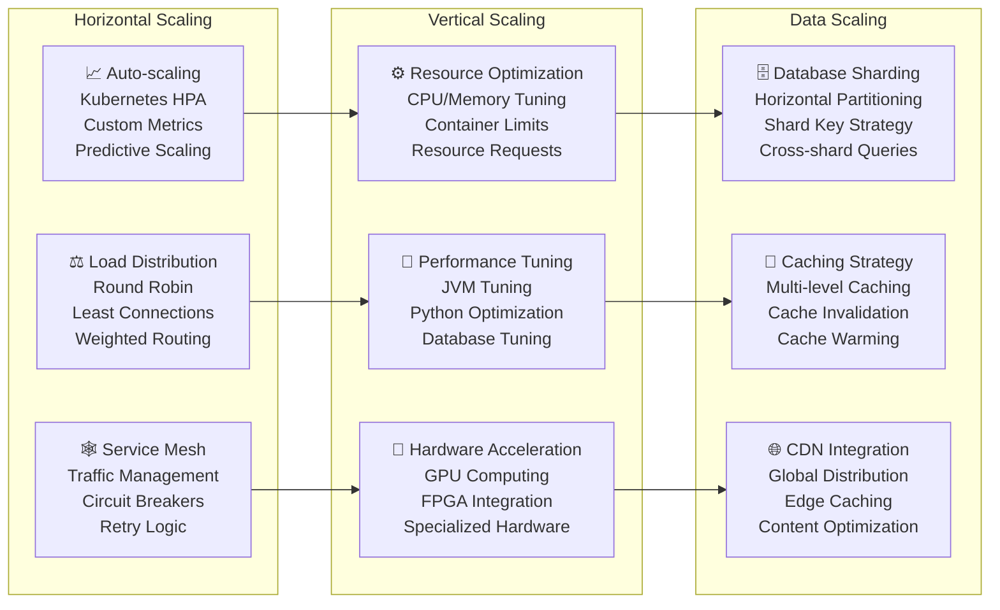
```mermaid
graph LR
    subgraph "Horizontal Scaling"
        AUTO_SCALING[📈 Auto-scaling<br/>Kubernetes HPA<br/>Custom Metrics<br/>Predictive Scaling]
        LOAD_DISTRIBUTION[⚖️ Load Distribution<br/>Round Robin<br/>Least Connections<br/>Weighted Routing]
        SERVICE_MESH[🕸️ Service Mesh<br/>Traffic Management<br/>Circuit Breakers<br/>Retry Logic]
    end
    
    subgraph "Vertical Scaling"
        RESOURCE_OPTIMIZATION[⚙️ Resource Optimization<br/>CPU/Memory Tuning<br/>Container Limits<br/>Resource Requests]
        PERFORMANCE_TUNING[🔧 Performance Tuning<br/>JVM Tuning<br/>Python Optimization<br/>Database Tuning]
        HARDWARE_ACCELERATION[🚀 Hardware Acceleration<br/>GPU Computing<br/>FPGA Integration<br/>Specialized Hardware]
    end
    
    subgraph "Data Scaling"
        DATABASE_SHARDING[🗄️ Database Sharding<br/>Horizontal Partitioning<br/>Shard Key Strategy<br/>Cross-shard Queries]
        CACHING_STRATEGY[💾 Caching Strategy<br/>Multi-level Caching<br/>Cache Invalidation<br/>Cache Warming]
        CDN_INTEGRATION[🌐 CDN Integration<br/>Global Distribution<br/>Edge Caching<br/>Content Optimization]
    end
    
    AUTO_SCALING --> RESOURCE_OPTIMIZATION
    LOAD_DISTRIBUTION --> PERFORMANCE_TUNING
    SERVICE_MESH --> HARDWARE_ACCELERATION
    
    RESOURCE_OPTIMIZATION --> DATABASE_SHARDING
    PERFORMANCE_TUNING --> CACHING_STRATEGY
    HARDWARE_ACCELERATION --> CDN_INTEGRATION
```

## Security Architecture Integration

### Defense in Depth Strategy

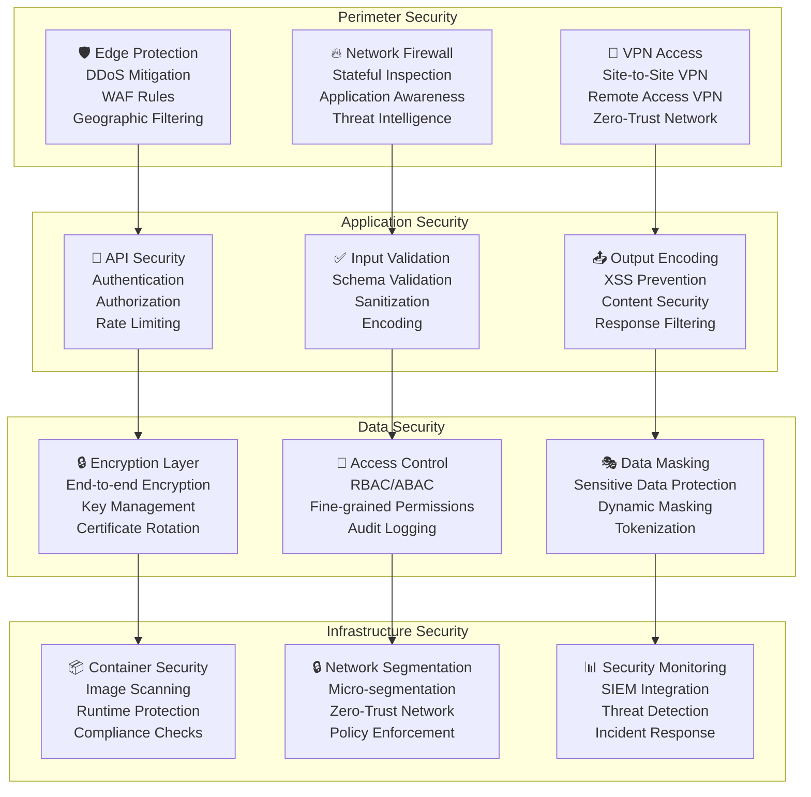
```mermaid
graph TB
    subgraph "Perimeter Security"
        EDGE_PROTECTION[🛡️ Edge Protection<br/>DDoS Mitigation<br/>WAF Rules<br/>Geographic Filtering]
        NETWORK_FIREWALL[🔥 Network Firewall<br/>Stateful Inspection<br/>Application Awareness<br/>Threat Intelligence]
        VPN_ACCESS[🔐 VPN Access<br/>Site-to-Site VPN<br/>Remote Access VPN<br/>Zero-Trust Network]
    end
    
    subgraph "Application Security"
        API_SECURITY[🔗 API Security<br/>Authentication<br/>Authorization<br/>Rate Limiting]
        INPUT_VALIDATION[✅ Input Validation<br/>Schema Validation<br/>Sanitization<br/>Encoding]
        OUTPUT_ENCODING[📤 Output Encoding<br/>XSS Prevention<br/>Content Security<br/>Response Filtering]
    end
    
    subgraph "Data Security"
        ENCRYPTION_LAYER[🔒 Encryption Layer<br/>End-to-end Encryption<br/>Key Management<br/>Certificate Rotation]
        ACCESS_CONTROL[🎯 Access Control<br/>RBAC/ABAC<br/>Fine-grained Permissions<br/>Audit Logging]
        DATA_MASKING[🎭 Data Masking<br/>Sensitive Data Protection<br/>Dynamic Masking<br/>Tokenization]
    end
    
    subgraph "Infrastructure Security"
        CONTAINER_SECURITY[📦 Container Security<br/>Image Scanning<br/>Runtime Protection<br/>Compliance Checks]
        NETWORK_SEGMENTATION[🔒 Network Segmentation<br/>Micro-segmentation<br/>Zero-Trust Network<br/>Policy Enforcement]
        MONITORING_SECURITY[📊 Security Monitoring<br/>SIEM Integration<br/>Threat Detection<br/>Incident Response]
    end
    
    EDGE_PROTECTION --> API_SECURITY
    NETWORK_FIREWALL --> INPUT_VALIDATION
    VPN_ACCESS --> OUTPUT_ENCODING
    
    API_SECURITY --> ENCRYPTION_LAYER
    INPUT_VALIDATION --> ACCESS_CONTROL
    OUTPUT_ENCODING --> DATA_MASKING
    
    ENCRYPTION_LAYER --> CONTAINER_SECURITY
    ACCESS_CONTROL --> NETWORK_SEGMENTATION
    DATA_MASKING --> MONITORING_SECURITY
```

## Deployment Architecture

### Multi-Environment Strategy

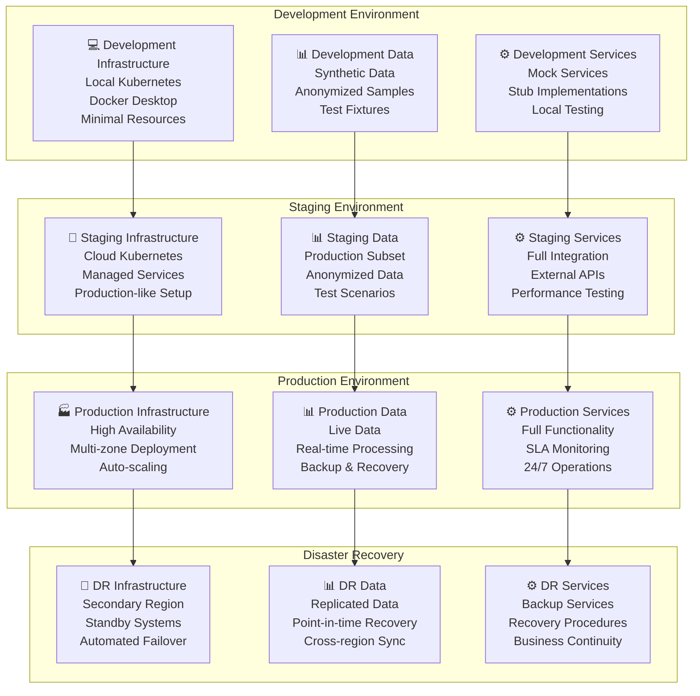
```mermaid
graph TB
    subgraph "Development Environment"
        DEV_INFRA[💻 Development Infrastructure<br/>Local Kubernetes<br/>Docker Desktop<br/>Minimal Resources]
        DEV_DATA[📊 Development Data<br/>Synthetic Data<br/>Anonymized Samples<br/>Test Fixtures]
        DEV_SERVICES[⚙️ Development Services<br/>Mock Services<br/>Stub Implementations<br/>Local Testing]
    end
    
    subgraph "Staging Environment"
        STAGING_INFRA[🧪 Staging Infrastructure<br/>Cloud Kubernetes<br/>Managed Services<br/>Production-like Setup]
        STAGING_DATA[📊 Staging Data<br/>Production Subset<br/>Anonymized Data<br/>Test Scenarios]
        STAGING_SERVICES[⚙️ Staging Services<br/>Full Integration<br/>External APIs<br/>Performance Testing]
    end
    
    subgraph "Production Environment"
        PROD_INFRA[🏭 Production Infrastructure<br/>High Availability<br/>Multi-zone Deployment<br/>Auto-scaling]
        PROD_DATA[📊 Production Data<br/>Live Data<br/>Real-time Processing<br/>Backup & Recovery]
        PROD_SERVICES[⚙️ Production Services<br/>Full Functionality<br/>SLA Monitoring<br/>24/7 Operations]
    end
    
    subgraph "Disaster Recovery"
        DR_INFRA[🔄 DR Infrastructure<br/>Secondary Region<br/>Standby Systems<br/>Automated Failover]
        DR_DATA[📊 DR Data<br/>Replicated Data<br/>Point-in-time Recovery<br/>Cross-region Sync]
        DR_SERVICES[⚙️ DR Services<br/>Backup Services<br/>Recovery Procedures<br/>Business Continuity]
    end
    
    DEV_INFRA --> STAGING_INFRA
    DEV_DATA --> STAGING_DATA
    DEV_SERVICES --> STAGING_SERVICES
    
    STAGING_INFRA --> PROD_INFRA
    STAGING_DATA --> PROD_DATA
    STAGING_SERVICES --> PROD_SERVICES
    
    PROD_INFRA --> DR_INFRA
    PROD_DATA --> DR_DATA
    PROD_SERVICES --> DR_SERVICES
```

### CI/CD Pipeline Architecture

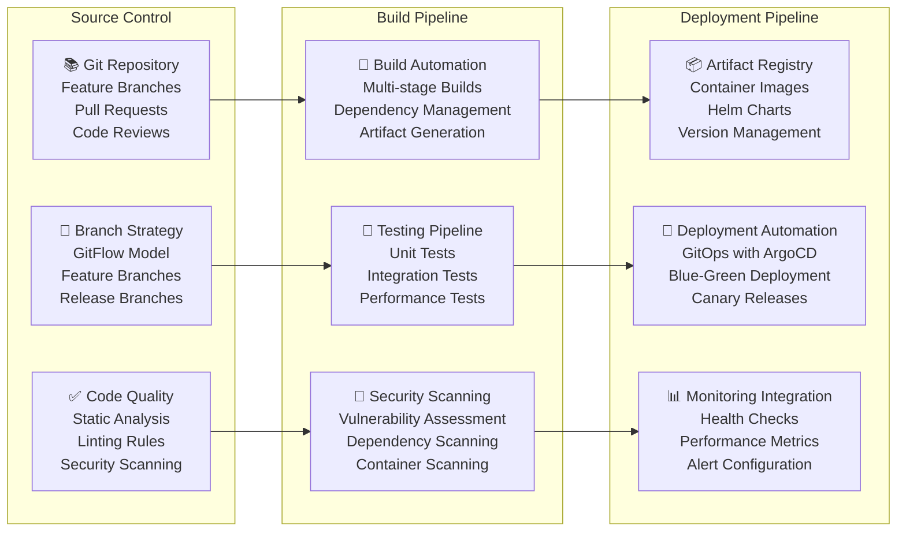
```mermaid
graph LR
    subgraph "Source Control"
        GIT_REPO[📚 Git Repository<br/>Feature Branches<br/>Pull Requests<br/>Code Reviews]
        BRANCH_STRATEGY[🌿 Branch Strategy<br/>GitFlow Model<br/>Feature Branches<br/>Release Branches]
        CODE_QUALITY[✅ Code Quality<br/>Static Analysis<br/>Linting Rules<br/>Security Scanning]
    end
    
    subgraph "Build Pipeline"
        BUILD_AUTOMATION[🔨 Build Automation<br/>Multi-stage Builds<br/>Dependency Management<br/>Artifact Generation]
        TESTING_PIPELINE[🧪 Testing Pipeline<br/>Unit Tests<br/>Integration Tests<br/>Performance Tests]
        SECURITY_SCANNING[🔐 Security Scanning<br/>Vulnerability Assessment<br/>Dependency Scanning<br/>Container Scanning]
    end
    
    subgraph "Deployment Pipeline"
        ARTIFACT_REGISTRY[📦 Artifact Registry<br/>Container Images<br/>Helm Charts<br/>Version Management]
        DEPLOYMENT_AUTOMATION[🚀 Deployment Automation<br/>GitOps with ArgoCD<br/>Blue-Green Deployment<br/>Canary Releases]
        MONITORING_INTEGRATION[📊 Monitoring Integration<br/>Health Checks<br/>Performance Metrics<br/>Alert Configuration]
    end
    
    GIT_REPO --> BUILD_AUTOMATION
    BRANCH_STRATEGY --> TESTING_PIPELINE
    CODE_QUALITY --> SECURITY_SCANNING
    
    BUILD_AUTOMATION --> ARTIFACT_REGISTRY
    TESTING_PIPELINE --> DEPLOYMENT_AUTOMATION
    SECURITY_SCANNING --> MONITORING_INTEGRATION
```

## Observability Architecture

### Comprehensive Monitoring Strategy

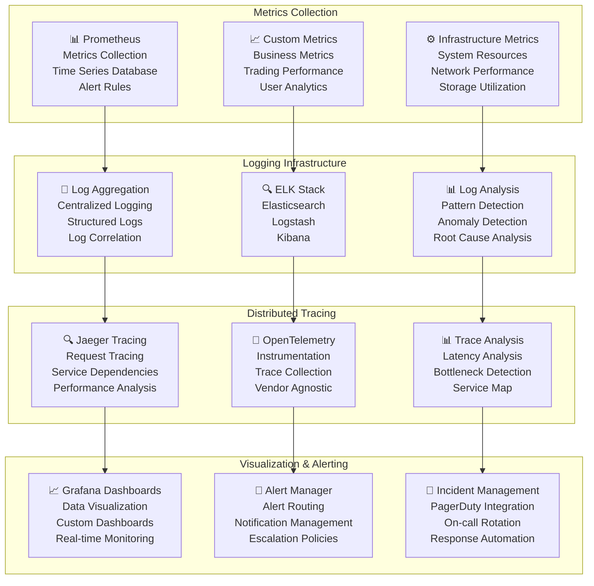
```mermaid
graph TB
    subgraph "Metrics Collection"
        PROMETHEUS[📊 Prometheus<br/>Metrics Collection<br/>Time Series Database<br/>Alert Rules]
        CUSTOM_METRICS[📈 Custom Metrics<br/>Business Metrics<br/>Trading Performance<br/>User Analytics]
        INFRASTRUCTURE_METRICS[⚙️ Infrastructure Metrics<br/>System Resources<br/>Network Performance<br/>Storage Utilization]
    end
    
    subgraph "Logging Infrastructure"
        LOG_AGGREGATION[📝 Log Aggregation<br/>Centralized Logging<br/>Structured Logs<br/>Log Correlation]
        ELK_STACK[🔍 ELK Stack<br/>Elasticsearch<br/>Logstash<br/>Kibana]
        LOG_ANALYSIS[📊 Log Analysis<br/>Pattern Detection<br/>Anomaly Detection<br/>Root Cause Analysis]
    end
    
    subgraph "Distributed Tracing"
        JAEGER[🔍 Jaeger Tracing<br/>Request Tracing<br/>Service Dependencies<br/>Performance Analysis]
        OPENTELEMETRY[📡 OpenTelemetry<br/>Instrumentation<br/>Trace Collection<br/>Vendor Agnostic]
        TRACE_ANALYSIS[📊 Trace Analysis<br/>Latency Analysis<br/>Bottleneck Detection<br/>Service Map]
    end
    
    subgraph "Visualization & Alerting"
        GRAFANA[📈 Grafana Dashboards<br/>Data Visualization<br/>Custom Dashboards<br/>Real-time Monitoring]
        ALERT_MANAGER[🚨 Alert Manager<br/>Alert Routing<br/>Notification Management<br/>Escalation Policies]
        INCIDENT_MANAGEMENT[🎯 Incident Management<br/>PagerDuty Integration<br/>On-call Rotation<br/>Response Automation]
    end
    
    PROMETHEUS --> LOG_AGGREGATION
    CUSTOM_METRICS --> ELK_STACK
    INFRASTRUCTURE_METRICS --> LOG_ANALYSIS
    
    LOG_AGGREGATION --> JAEGER
    ELK_STACK --> OPENTELEMETRY
    LOG_ANALYSIS --> TRACE_ANALYSIS
    
    JAEGER --> GRAFANA
    OPENTELEMETRY --> ALERT_MANAGER
    TRACE_ANALYSIS --> INCIDENT_MANAGEMENT
```

## Technology Stack Decisions

### Technology Selection Matrix

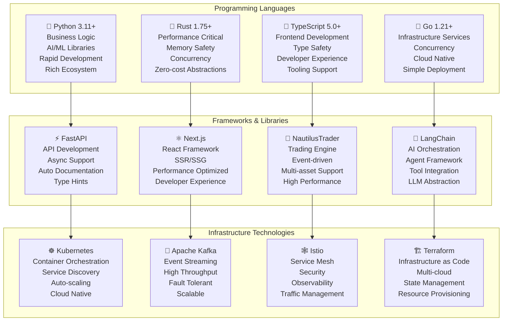
```mermaid
graph TB
    subgraph "Programming Languages"
        PYTHON[🐍 Python 3.11+<br/>Business Logic<br/>AI/ML Libraries<br/>Rapid Development<br/>Rich Ecosystem]
        RUST[🦀 Rust 1.75+<br/>Performance Critical<br/>Memory Safety<br/>Concurrency<br/>Zero-cost Abstractions]
        TYPESCRIPT[📘 TypeScript 5.0+<br/>Frontend Development<br/>Type Safety<br/>Developer Experience<br/>Tooling Support]
        GO[🐹 Go 1.21+<br/>Infrastructure Services<br/>Concurrency<br/>Cloud Native<br/>Simple Deployment]
    end
    
    subgraph "Frameworks & Libraries"
        FASTAPI[⚡ FastAPI<br/>API Development<br/>Async Support<br/>Auto Documentation<br/>Type Hints]
        NEXTJS[⚛️ Next.js<br/>React Framework<br/>SSR/SSG<br/>Performance Optimized<br/>Developer Experience]
        NAUTILUS[🚢 NautilusTrader<br/>Trading Engine<br/>Event-driven<br/>Multi-asset Support<br/>High Performance]
        LANGCHAIN[🔗 LangChain<br/>AI Orchestration<br/>Agent Framework<br/>Tool Integration<br/>LLM Abstraction]
    end
    
    subgraph "Infrastructure Technologies"
        KUBERNETES[☸️ Kubernetes<br/>Container Orchestration<br/>Service Discovery<br/>Auto-scaling<br/>Cloud Native]
        KAFKA[🚌 Apache Kafka<br/>Event Streaming<br/>High Throughput<br/>Fault Tolerant<br/>Scalable]
        ISTIO[🕸️ Istio<br/>Service Mesh<br/>Security<br/>Observability<br/>Traffic Management]
        TERRAFORM[🏗️ Terraform<br/>Infrastructure as Code<br/>Multi-cloud<br/>State Management<br/>Resource Provisioning]
    end
    
    PYTHON --> FASTAPI
    RUST --> NEXTJS
    TYPESCRIPT --> NAUTILUS
    GO --> LANGCHAIN
    
    FASTAPI --> KUBERNETES
    NEXTJS --> KAFKA
    NAUTILUS --> ISTIO
    LANGCHAIN --> TERRAFORM
```

### Architecture Decision Records (ADRs)

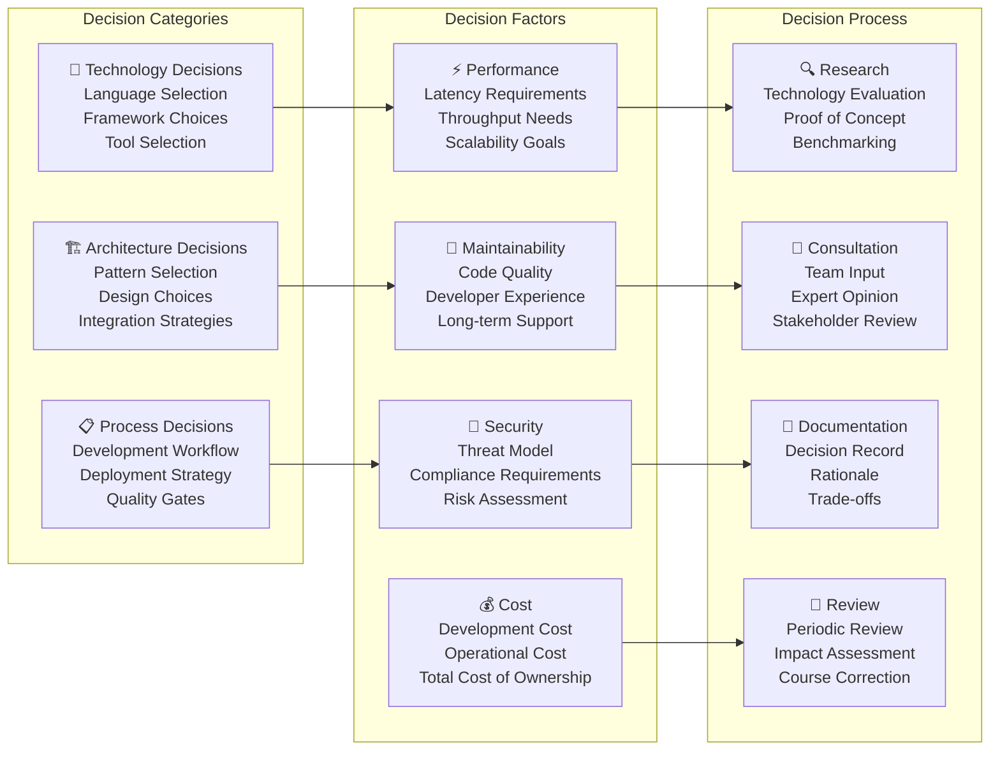
```mermaid
graph LR
    subgraph "Decision Categories"
        TECHNOLOGY[🔧 Technology Decisions<br/>Language Selection<br/>Framework Choices<br/>Tool Selection]
        ARCHITECTURE[🏗️ Architecture Decisions<br/>Pattern Selection<br/>Design Choices<br/>Integration Strategies]
        PROCESS[📋 Process Decisions<br/>Development Workflow<br/>Deployment Strategy<br/>Quality Gates]
    end
    
    subgraph "Decision Factors"
        PERFORMANCE[⚡ Performance<br/>Latency Requirements<br/>Throughput Needs<br/>Scalability Goals]
        MAINTAINABILITY[🔧 Maintainability<br/>Code Quality<br/>Developer Experience<br/>Long-term Support]
        SECURITY[🔐 Security<br/>Threat Model<br/>Compliance Requirements<br/>Risk Assessment]
        COST[💰 Cost<br/>Development Cost<br/>Operational Cost<br/>Total Cost of Ownership]
    end
    
    subgraph "Decision Process"
        RESEARCH[🔍 Research<br/>Technology Evaluation<br/>Proof of Concept<br/>Benchmarking]
        CONSULTATION[👥 Consultation<br/>Team Input<br/>Expert Opinion<br/>Stakeholder Review]
        DOCUMENTATION[📝 Documentation<br/>Decision Record<br/>Rationale<br/>Trade-offs]
        REVIEW[🔄 Review<br/>Periodic Review<br/>Impact Assessment<br/>Course Correction]
    end
    
    TECHNOLOGY --> PERFORMANCE
    ARCHITECTURE --> MAINTAINABILITY
    PROCESS --> SECURITY
    
    PERFORMANCE --> RESEARCH
    MAINTAINABILITY --> CONSULTATION
    SECURITY --> DOCUMENTATION
    COST --> REVIEW
```

---

**Document Classification**: Technical Documentation  
**Next Review Date**: 01 February 2026  
**Document Owner**: Architecture Team  
**Approval**: Chief Architect, Technical Committee