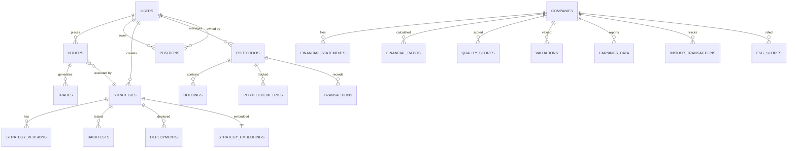

# Database Schema Documentation

**Last Updated**: 2025-11-20  
**Status**: ✅ **100% COMPLETE**  
**Phase**: 3 - Infrastructure & Database Setup

---

## Overview

This document provides comprehensive documentation of all database schemas in the Agentic AI Algorithmic Trading System v5.0. The system uses a polyglot persistence architecture with 5 specialized databases.

---

## Table of Contents

1. [PostgreSQL Schema](#postgresql-schema)
2. [ClickHouse Schema](#clickhouse-schema)
3. [Neo4j Graph Model](#neo4j-graph-model)
4. [Redis Data Structures](#redis-data-structures)
5. [Qdrant Collections](#qdrant-collections)

---

## PostgreSQL Schema

**Database**: PostgreSQL 17 + pgvector  
**Purpose**: ACID-compliant transactional database with vector similarity search  
**Schemas**: 6  
**Tables**: 30+  
**Indexes**: 80+

### Extensions

```sql
CREATE EXTENSION IF NOT EXISTS "uuid-ossp";      -- UUID generation
CREATE EXTENSION IF NOT EXISTS "pgcrypto";       -- Cryptographic functions
CREATE EXTENSION IF NOT EXISTS "vector";         -- Vector similarity search
```

---

### 1. Users Schema

**Purpose**: User management, authentication, and authorization

#### Tables

##### users

```sql
CREATE TABLE users.users (
    id UUID PRIMARY KEY DEFAULT uuid_generate_v4(),
    email VARCHAR(255) UNIQUE NOT NULL,
    username VARCHAR(100) UNIQUE NOT NULL,
    password_hash VARCHAR(255) NOT NULL,
    first_name VARCHAR(100),
    last_name VARCHAR(100),
    is_active BOOLEAN DEFAULT true,
    is_verified BOOLEAN DEFAULT false,
    created_at TIMESTAMP DEFAULT CURRENT_TIMESTAMP,
    updated_at TIMESTAMP DEFAULT CURRENT_TIMESTAMP,
    last_login_at TIMESTAMP
);

CREATE INDEX idx_users_email ON users.users(email);
CREATE INDEX idx_users_username ON users.users(username);
CREATE INDEX idx_users_is_active ON users.users(is_active);
```

##### roles

```sql
CREATE TABLE users.roles (
    id UUID PRIMARY KEY DEFAULT uuid_generate_v4(),
    name VARCHAR(50) UNIQUE NOT NULL,
    description TEXT,
    permissions TEXT[],  -- Array of permission strings
    created_at TIMESTAMP DEFAULT CURRENT_TIMESTAMP
);

-- Default roles
INSERT INTO users.roles (name, description, permissions) VALUES
    ('viewer', 'Read-only access', ARRAY['*.read']),
    ('trader', 'Paper trading access', ARRAY['*.read', 'trading.paper.*']),
    ('live_trader', 'Live trading access', ARRAY['*.read', 'trading.*']),
    ('admin', 'Full system access', ARRAY['*']);
```

##### user_roles

```sql
CREATE TABLE users.user_roles (
    user_id UUID REFERENCES users.users(id) ON DELETE CASCADE,
    role_id UUID REFERENCES users.roles(id) ON DELETE CASCADE,
    assigned_at TIMESTAMP DEFAULT CURRENT_TIMESTAMP,
    PRIMARY KEY (user_id, role_id)
);

CREATE INDEX idx_user_roles_user_id ON users.user_roles(user_id);
```

##### sessions

```sql
CREATE TABLE users.sessions (
    id UUID PRIMARY KEY DEFAULT uuid_generate_v4(),
    user_id UUID REFERENCES users.users(id) ON DELETE CASCADE,
    refresh_token VARCHAR(500) UNIQUE NOT NULL,
    ip_address INET,
    user_agent TEXT,
    expires_at TIMESTAMP NOT NULL,
    created_at TIMESTAMP DEFAULT CURRENT_TIMESTAMP
);

CREATE INDEX idx_sessions_user_id ON users.sessions(user_id);
CREATE INDEX idx_sessions_refresh_token ON users.sessions(refresh_token);
CREATE INDEX idx_sessions_expires_at ON users.sessions(expires_at);
```

##### api_keys

```sql
CREATE TABLE users.api_keys (
    id UUID PRIMARY KEY DEFAULT uuid_generate_v4(),
    user_id UUID REFERENCES users.users(id) ON DELETE CASCADE,
    key_hash VARCHAR(255) UNIQUE NOT NULL,
    name VARCHAR(100),
    permissions TEXT[],
    is_active BOOLEAN DEFAULT true,
    expires_at TIMESTAMP,
    last_used_at TIMESTAMP,
    created_at TIMESTAMP DEFAULT CURRENT_TIMESTAMP
);

CREATE INDEX idx_api_keys_user_id ON users.api_keys(user_id);
CREATE INDEX idx_api_keys_key_hash ON users.api_keys(key_hash);
```

---

### 2. Trading Schema

**Purpose**: Trading operations and order management

#### Tables

##### orders

```sql
CREATE TABLE trading.orders (
    id UUID PRIMARY KEY DEFAULT uuid_generate_v4(),
    user_id UUID REFERENCES users.users(id),
    symbol VARCHAR(20) NOT NULL,
    order_type VARCHAR(20) NOT NULL,  -- MARKET, LIMIT, STOP, etc.
    side VARCHAR(10) NOT NULL,        -- BUY, SELL
    quantity DECIMAL(20, 8) NOT NULL,
    price DECIMAL(20, 8),
    stop_price DECIMAL(20, 8),
    time_in_force VARCHAR(10) DEFAULT 'DAY',  -- DAY, GTC, IOC, FOK
    status VARCHAR(20) DEFAULT 'PENDING',     -- PENDING, SUBMITTED, FILLED, CANCELLED
    filled_quantity DECIMAL(20, 8) DEFAULT 0,
    average_fill_price DECIMAL(20, 8),
    broker_order_id VARCHAR(100),
    strategy_id UUID,
    created_at TIMESTAMP DEFAULT CURRENT_TIMESTAMP,
    updated_at TIMESTAMP DEFAULT CURRENT_TIMESTAMP,
    filled_at TIMESTAMP
);

CREATE INDEX idx_orders_user_id ON trading.orders(user_id);
CREATE INDEX idx_orders_symbol ON trading.orders(symbol);
CREATE INDEX idx_orders_status ON trading.orders(status);
CREATE INDEX idx_orders_created_at ON trading.orders(created_at DESC);
```

##### trades

```sql
CREATE TABLE trading.trades (
    id UUID PRIMARY KEY DEFAULT uuid_generate_v4(),
    order_id UUID REFERENCES trading.orders(id),
    user_id UUID REFERENCES users.users(id),
    symbol VARCHAR(20) NOT NULL,
    side VARCHAR(10) NOT NULL,
    quantity DECIMAL(20, 8) NOT NULL,
    price DECIMAL(20, 8) NOT NULL,
    commission DECIMAL(20, 8) DEFAULT 0,
    broker_trade_id VARCHAR(100),
    executed_at TIMESTAMP DEFAULT CURRENT_TIMESTAMP
);

CREATE INDEX idx_trades_order_id ON trading.trades(order_id);
CREATE INDEX idx_trades_user_id ON trading.trades(user_id);
CREATE INDEX idx_trades_symbol ON trading.trades(symbol);
CREATE INDEX idx_trades_executed_at ON trading.trades(executed_at DESC);
```

##### positions

```sql
CREATE TABLE trading.positions (
    id UUID PRIMARY KEY DEFAULT uuid_generate_v4(),
    user_id UUID REFERENCES users.users(id),
    symbol VARCHAR(20) NOT NULL,
    quantity DECIMAL(20, 8) NOT NULL,
    average_entry_price DECIMAL(20, 8) NOT NULL,
    current_price DECIMAL(20, 8),
    unrealized_pnl DECIMAL(20, 8),
    realized_pnl DECIMAL(20, 8) DEFAULT 0,
    opened_at TIMESTAMP DEFAULT CURRENT_TIMESTAMP,
    updated_at TIMESTAMP DEFAULT CURRENT_TIMESTAMP,
    closed_at TIMESTAMP,
    UNIQUE(user_id, symbol)
);

CREATE INDEX idx_positions_user_id ON trading.positions(user_id);
CREATE INDEX idx_positions_symbol ON trading.positions(symbol);
CREATE INDEX idx_positions_opened_at ON trading.positions(opened_at DESC);
```

##### signals

```sql
CREATE TABLE trading.signals (
    id UUID PRIMARY KEY DEFAULT uuid_generate_v4(),
    strategy_id UUID,
    symbol VARCHAR(20) NOT NULL,
    signal_type VARCHAR(20) NOT NULL,  -- BUY, SELL, HOLD
    strength DECIMAL(5, 4),            -- 0.0 to 1.0
    price DECIMAL(20, 8),
    metadata JSONB,
    generated_at TIMESTAMP DEFAULT CURRENT_TIMESTAMP
);

CREATE INDEX idx_signals_strategy_id ON trading.signals(strategy_id);
CREATE INDEX idx_signals_symbol ON trading.signals(symbol);
CREATE INDEX idx_signals_generated_at ON trading.signals(generated_at DESC);
```

---

### 3. Strategy Schema

**Purpose**: Strategy management and versioning

#### Tables

##### strategies

```sql
CREATE TABLE strategy.strategies (
    id UUID PRIMARY KEY DEFAULT uuid_generate_v4(),
    user_id UUID REFERENCES users.users(id),
    name VARCHAR(200) NOT NULL,
    description TEXT,
    strategy_type VARCHAR(50),  -- TECHNICAL, FUNDAMENTAL, ML, HYBRID
    code TEXT NOT NULL,
    language VARCHAR(20) DEFAULT 'python',
    is_active BOOLEAN DEFAULT false,
    created_at TIMESTAMP DEFAULT CURRENT_TIMESTAMP,
    updated_at TIMESTAMP DEFAULT CURRENT_TIMESTAMP
);

CREATE INDEX idx_strategies_user_id ON strategy.strategies(user_id);
CREATE INDEX idx_strategies_is_active ON strategy.strategies(is_active);
```

##### strategy_versions

```sql
CREATE TABLE strategy.strategy_versions (
    id UUID PRIMARY KEY DEFAULT uuid_generate_v4(),
    strategy_id UUID REFERENCES strategy.strategies(id) ON DELETE CASCADE,
    version VARCHAR(20) NOT NULL,
    code TEXT NOT NULL,
    commit_message TEXT,
    created_at TIMESTAMP DEFAULT CURRENT_TIMESTAMP,
    UNIQUE(strategy_id, version)
);

CREATE INDEX idx_strategy_versions_strategy_id ON strategy.strategy_versions(strategy_id);
```

##### backtests

```sql
CREATE TABLE strategy.backtests (
    id UUID PRIMARY KEY DEFAULT uuid_generate_v4(),
    strategy_id UUID REFERENCES strategy.strategies(id),
    start_date DATE NOT NULL,
    end_date DATE NOT NULL,
    initial_capital DECIMAL(20, 2),
    final_capital DECIMAL(20, 2),
    total_return DECIMAL(10, 4),
    sharpe_ratio DECIMAL(10, 4),
    max_drawdown DECIMAL(10, 4),
    win_rate DECIMAL(5, 4),
    total_trades INTEGER,
    metadata JSONB,
    created_at TIMESTAMP DEFAULT CURRENT_TIMESTAMP
);

CREATE INDEX idx_backtests_strategy_id ON strategy.backtests(strategy_id);
CREATE INDEX idx_backtests_created_at ON strategy.backtests(created_at DESC);
```

##### deployments

```sql
CREATE TABLE strategy.deployments (
    id UUID PRIMARY KEY DEFAULT uuid_generate_v4(),
    strategy_id UUID REFERENCES strategy.strategies(id),
    version_id UUID REFERENCES strategy.strategy_versions(id),
    mode VARCHAR(20) NOT NULL,  -- PAPER, LIVE
    status VARCHAR(20) DEFAULT 'ACTIVE',  -- ACTIVE, PAUSED, STOPPED
    deployed_at TIMESTAMP DEFAULT CURRENT_TIMESTAMP,
    stopped_at TIMESTAMP
);

CREATE INDEX idx_deployments_strategy_id ON strategy.deployments(strategy_id);
CREATE INDEX idx_deployments_status ON strategy.deployments(status);
```

##### strategy_embeddings

```sql
CREATE TABLE strategy.strategy_embeddings (
    strategy_id UUID PRIMARY KEY REFERENCES strategy.strategies(id) ON DELETE CASCADE,
    embedding vector(384),  -- 384-dimensional vector
    updated_at TIMESTAMP DEFAULT CURRENT_TIMESTAMP
);

-- HNSW index for fast similarity search
CREATE INDEX idx_strategy_embeddings_vector
ON strategy.strategy_embeddings
USING hnsw (embedding vector_cosine_ops);
```

---

### 4. Fundamental Schema

**Purpose**: Fundamental analysis data

#### Tables

##### companies

```sql
CREATE TABLE fundamental.companies (
    id UUID PRIMARY KEY DEFAULT uuid_generate_v4(),
    symbol VARCHAR(20) UNIQUE NOT NULL,
    name VARCHAR(200) NOT NULL,
    sector VARCHAR(100),
    industry VARCHAR(100),
    market_cap DECIMAL(20, 2),
    shares_outstanding BIGINT,
    headquarters VARCHAR(200),
    founded_date DATE,
    employees INTEGER,
    created_at TIMESTAMP DEFAULT CURRENT_TIMESTAMP,
    updated_at TIMESTAMP DEFAULT CURRENT_TIMESTAMP
);

CREATE INDEX idx_companies_symbol ON fundamental.companies(symbol);
CREATE INDEX idx_companies_sector ON fundamental.companies(sector);
CREATE INDEX idx_companies_industry ON fundamental.companies(industry);
```

##### financial_statements

```sql
CREATE TABLE fundamental.financial_statements (
    id UUID PRIMARY KEY DEFAULT uuid_generate_v4(),
    company_id UUID REFERENCES fundamental.companies(id),
    fiscal_year INTEGER NOT NULL,
    fiscal_quarter INTEGER,  -- NULL for annual
    statement_type VARCHAR(20) NOT NULL,  -- INCOME, BALANCE, CASHFLOW

    -- Income Statement
    revenue DECIMAL(20, 2),
    cost_of_revenue DECIMAL(20, 2),
    gross_profit DECIMAL(20, 2),
    operating_expenses DECIMAL(20, 2),
    operating_income DECIMAL(20, 2),
    ebitda DECIMAL(20, 2),
    net_income DECIMAL(20, 2),
    eps DECIMAL(10, 4),

    -- Balance Sheet
    total_assets DECIMAL(20, 2),
    current_assets DECIMAL(20, 2),
    total_liabilities DECIMAL(20, 2),
    current_liabilities DECIMAL(20, 2),
    total_equity DECIMAL(20, 2),
    cash DECIMAL(20, 2),

    -- Cash Flow
    operating_cash_flow DECIMAL(20, 2),
    investing_cash_flow DECIMAL(20, 2),
    financing_cash_flow DECIMAL(20, 2),
    free_cash_flow DECIMAL(20, 2),

    filed_date DATE,
    created_at TIMESTAMP DEFAULT CURRENT_TIMESTAMP,
    UNIQUE(company_id, fiscal_year, fiscal_quarter, statement_type)
);

CREATE INDEX idx_financial_statements_company_id ON fundamental.financial_statements(company_id);
CREATE INDEX idx_financial_statements_fiscal_year ON fundamental.financial_statements(fiscal_year DESC);
```

##### financial_ratios

```sql
CREATE TABLE fundamental.financial_ratios (
    id UUID PRIMARY KEY DEFAULT uuid_generate_v4(),
    company_id UUID REFERENCES fundamental.companies(id),
    fiscal_year INTEGER NOT NULL,
    fiscal_quarter INTEGER,

    -- Liquidity Ratios (10)
    current_ratio DECIMAL(10, 4),
    quick_ratio DECIMAL(10, 4),
    cash_ratio DECIMAL(10, 4),
    operating_cash_flow_ratio DECIMAL(10, 4),

    -- Profitability Ratios (12)
    gross_profit_margin DECIMAL(10, 4),
    operating_profit_margin DECIMAL(10, 4),
    net_profit_margin DECIMAL(10, 4),
    roe DECIMAL(10, 4),
    roa DECIMAL(10, 4),
    roic DECIMAL(10, 4),

    -- Leverage Ratios (8)
    debt_to_equity DECIMAL(10, 4),
    debt_to_assets DECIMAL(10, 4),
    interest_coverage DECIMAL(10, 4),

    -- Efficiency Ratios (10)
    asset_turnover DECIMAL(10, 4),
    inventory_turnover DECIMAL(10, 4),
    receivables_turnover DECIMAL(10, 4),

    -- Valuation Ratios (12)
    pe_ratio DECIMAL(10, 4),
    pb_ratio DECIMAL(10, 4),
    ps_ratio DECIMAL(10, 4),
    peg_ratio DECIMAL(10, 4),
    ev_to_ebitda DECIMAL(10, 4),

    -- Growth Ratios (8)
    revenue_growth_yoy DECIMAL(10, 4),
    earnings_growth_yoy DECIMAL(10, 4),

    calculated_at TIMESTAMP DEFAULT CURRENT_TIMESTAMP,
    UNIQUE(company_id, fiscal_year, fiscal_quarter)
);

CREATE INDEX idx_financial_ratios_company_id ON fundamental.financial_ratios(company_id);
```

##### quality_scores

```sql
CREATE TABLE fundamental.quality_scores (
    id UUID PRIMARY KEY DEFAULT uuid_generate_v4(),
    company_id UUID REFERENCES fundamental.companies(id),
    fiscal_year INTEGER NOT NULL,
    fiscal_quarter INTEGER,

    piotroski_f_score INTEGER,  -- 0-9
    altman_z_score DECIMAL(10, 4),
    beneish_m_score DECIMAL(10, 4),
    composite_score DECIMAL(5, 2),  -- 0-100

    calculated_at TIMESTAMP DEFAULT CURRENT_TIMESTAMP,
    UNIQUE(company_id, fiscal_year, fiscal_quarter)
);

CREATE INDEX idx_quality_scores_company_id ON fundamental.quality_scores(company_id);
```

##### valuations

```sql
CREATE TABLE fundamental.valuations (
    id UUID PRIMARY KEY DEFAULT uuid_generate_v4(),
    company_id UUID REFERENCES fundamental.companies(id),

    dcf_value DECIMAL(20, 2),
    ddm_value DECIMAL(20, 2),
    graham_number DECIMAL(20, 2),
    fair_value DECIMAL(20, 2),  -- Weighted average
    margin_of_safety DECIMAL(10, 4),

    calculated_at TIMESTAMP DEFAULT CURRENT_TIMESTAMP
);

CREATE INDEX idx_valuations_company_id ON fundamental.valuations(company_id);
```

##### earnings_data

```sql
CREATE TABLE fundamental.earnings_data (
    id UUID PRIMARY KEY DEFAULT uuid_generate_v4(),
    company_id UUID REFERENCES fundamental.companies(id),
    earnings_date TIMESTAMP NOT NULL,
    fiscal_year INTEGER,
    fiscal_quarter INTEGER,

    eps_actual DECIMAL(10, 4),
    eps_estimate DECIMAL(10, 4),
    eps_surprise DECIMAL(10, 4),

    revenue_actual DECIMAL(20, 2),
    revenue_estimate DECIMAL(20, 2),
    revenue_surprise DECIMAL(10, 4),

    guidance TEXT,

    created_at TIMESTAMP DEFAULT CURRENT_TIMESTAMP
);

CREATE INDEX idx_earnings_data_company_id ON fundamental.earnings_data(company_id);
CREATE INDEX idx_earnings_data_earnings_date ON fundamental.earnings_data(earnings_date DESC);
```

##### insider_transactions

```sql
CREATE TABLE fundamental.insider_transactions (
    id UUID PRIMARY KEY DEFAULT uuid_generate_v4(),
    company_id UUID REFERENCES fundamental.companies(id),
    insider_name VARCHAR(200),
    insider_title VARCHAR(100),
    transaction_type VARCHAR(20),  -- BUY, SELL
    shares BIGINT,
    price DECIMAL(20, 8),
    value DECIMAL(20, 2),
    transaction_date DATE,
    filing_date DATE,
    created_at TIMESTAMP DEFAULT CURRENT_TIMESTAMP
);

CREATE INDEX idx_insider_transactions_company_id ON fundamental.insider_transactions(company_id);
CREATE INDEX idx_insider_transactions_transaction_date ON fundamental.insider_transactions(transaction_date DESC);
```

##### esg_scores

```sql
CREATE TABLE fundamental.esg_scores (
    id UUID PRIMARY KEY DEFAULT uuid_generate_v4(),
    company_id UUID REFERENCES fundamental.companies(id),
    environmental_score DECIMAL(5, 2),
    social_score DECIMAL(5, 2),
    governance_score DECIMAL(5, 2),
    combined_score DECIMAL(5, 2),
    scored_at TIMESTAMP DEFAULT CURRENT_TIMESTAMP
);

CREATE INDEX idx_esg_scores_company_id ON fundamental.esg_scores(company_id);
```

---

### 5. Portfolio Schema

**Purpose**: Portfolio management and tracking

#### Tables

##### portfolios

```sql
CREATE TABLE portfolio.portfolios (
    id UUID PRIMARY KEY DEFAULT uuid_generate_v4(),
    user_id UUID REFERENCES users.users(id),
    name VARCHAR(200) NOT NULL,
    description TEXT,
    initial_capital DECIMAL(20, 2) NOT NULL,
    current_value DECIMAL(20, 2),
    cash_balance DECIMAL(20, 2),
    is_active BOOLEAN DEFAULT true,
    created_at TIMESTAMP DEFAULT CURRENT_TIMESTAMP,
    updated_at TIMESTAMP DEFAULT CURRENT_TIMESTAMP
);

CREATE INDEX idx_portfolios_user_id ON portfolio.portfolios(user_id);
```

##### holdings

```sql
CREATE TABLE portfolio.holdings (
    id UUID PRIMARY KEY DEFAULT uuid_generate_v4(),
    portfolio_id UUID REFERENCES portfolio.portfolios(id) ON DELETE CASCADE,
    symbol VARCHAR(20) NOT NULL,
    quantity DECIMAL(20, 8) NOT NULL,
    average_cost DECIMAL(20, 8) NOT NULL,
    current_price DECIMAL(20, 8),
    market_value DECIMAL(20, 2),
    unrealized_pnl DECIMAL(20, 2),
    updated_at TIMESTAMP DEFAULT CURRENT_TIMESTAMP,
    UNIQUE(portfolio_id, symbol)
);

CREATE INDEX idx_holdings_portfolio_id ON portfolio.holdings(portfolio_id);
```

##### portfolio_metrics

```sql
CREATE TABLE portfolio.portfolio_metrics (
    id UUID PRIMARY KEY DEFAULT uuid_generate_v4(),
    portfolio_id UUID REFERENCES portfolio.portfolios(id) ON DELETE CASCADE,
    date DATE NOT NULL,
    total_value DECIMAL(20, 2),
    total_return DECIMAL(10, 4),
    daily_return DECIMAL(10, 4),
    sharpe_ratio DECIMAL(10, 4),
    max_drawdown DECIMAL(10, 4),
    volatility DECIMAL(10, 4),
    calculated_at TIMESTAMP DEFAULT CURRENT_TIMESTAMP,
    UNIQUE(portfolio_id, date)
);

CREATE INDEX idx_portfolio_metrics_portfolio_id ON portfolio.portfolio_metrics(portfolio_id);
CREATE INDEX idx_portfolio_metrics_date ON portfolio.portfolio_metrics(date DESC);
```

##### transactions

```sql
CREATE TABLE portfolio.transactions (
    id UUID PRIMARY KEY DEFAULT uuid_generate_v4(),
    portfolio_id UUID REFERENCES portfolio.portfolios(id) ON DELETE CASCADE,
    symbol VARCHAR(20),
    transaction_type VARCHAR(20) NOT NULL,  -- BUY, SELL, DEPOSIT, WITHDRAWAL
    quantity DECIMAL(20, 8),
    price DECIMAL(20, 8),
    amount DECIMAL(20, 2) NOT NULL,
    commission DECIMAL(20, 2) DEFAULT 0,
    notes TEXT,
    executed_at TIMESTAMP DEFAULT CURRENT_TIMESTAMP
);

CREATE INDEX idx_transactions_portfolio_id ON portfolio.transactions(portfolio_id);
CREATE INDEX idx_transactions_executed_at ON portfolio.transactions(executed_at DESC);
```

---

### 6. System Schema

**Purpose**: System-level data and configuration

#### Tables

##### document_embeddings

```sql
CREATE TABLE system.document_embeddings (
    id UUID PRIMARY KEY DEFAULT uuid_generate_v4(),
    document_type VARCHAR(50) NOT NULL,
    document_id VARCHAR(200) NOT NULL,
    content TEXT NOT NULL,
    embedding vector(384),
    metadata JSONB,
    created_at TIMESTAMP DEFAULT CURRENT_TIMESTAMP,
    UNIQUE(document_type, document_id)
);

-- HNSW index for fast similarity search
CREATE INDEX idx_document_embeddings_vector
ON system.document_embeddings
USING hnsw (embedding vector_cosine_ops);
```

##### system_config

```sql
CREATE TABLE system.system_config (
    key VARCHAR(100) PRIMARY KEY,
    value JSONB NOT NULL,
    description TEXT,
    updated_at TIMESTAMP DEFAULT CURRENT_TIMESTAMP
);
```

##### audit_log

```sql
CREATE TABLE system.audit_log (
    id UUID PRIMARY KEY DEFAULT uuid_generate_v4(),
    user_id UUID,
    action VARCHAR(100) NOT NULL,
    resource_type VARCHAR(50),
    resource_id VARCHAR(200),
    changes JSONB,
    ip_address INET,
    user_agent TEXT,
    created_at TIMESTAMP DEFAULT CURRENT_TIMESTAMP
);

CREATE INDEX idx_audit_log_user_id ON system.audit_log(user_id);
CREATE INDEX idx_audit_log_created_at ON system.audit_log(created_at DESC);
CREATE INDEX idx_audit_log_action ON system.audit_log(action);
```

##### system_events

```sql
CREATE TABLE system.system_events (
    id UUID PRIMARY KEY DEFAULT uuid_generate_v4(),
    event_type VARCHAR(100) NOT NULL,
    severity VARCHAR(20) NOT NULL,  -- INFO, WARNING, ERROR, CRITICAL
    message TEXT NOT NULL,
    metadata JSONB,
    created_at TIMESTAMP DEFAULT CURRENT_TIMESTAMP
);

CREATE INDEX idx_system_events_event_type ON system.system_events(event_type);
CREATE INDEX idx_system_events_severity ON system.system_events(severity);
CREATE INDEX idx_system_events_created_at ON system.system_events(created_at DESC);
```

---

### Views

#### active_deployments

```sql
CREATE VIEW strategy.active_deployments AS
SELECT
    d.id,
    d.strategy_id,
    s.name AS strategy_name,
    s.user_id,
    d.mode,
    d.deployed_at
FROM strategy.deployments d
JOIN strategy.strategies s ON d.strategy_id = s.id
WHERE d.status = 'ACTIVE';
```

#### portfolio_summary

```sql
CREATE VIEW portfolio.portfolio_summary AS
SELECT
    p.id AS portfolio_id,
    p.name,
    p.user_id,
    p.current_value,
    p.cash_balance,
    COUNT(h.id) AS num_holdings,
    SUM(h.market_value) AS total_holdings_value
FROM portfolio.portfolios p
LEFT JOIN portfolio.holdings h ON p.id = h.portfolio_id
WHERE p.is_active = true
GROUP BY p.id, p.name, p.user_id, p.current_value, p.cash_balance;
```

---

## ClickHouse Schema

**Database**: ClickHouse 24.8  
**Purpose**: Time-series analytics and audit logging

### Tables

#### market_data_tick

```sql
CREATE TABLE market_data_tick (
    timestamp DateTime64(6),
    symbol String,
    price Decimal(20, 8),
    volume UInt64,
    bid Decimal(20, 8),
    ask Decimal(20, 8),
    bid_size UInt64,
    ask_size UInt64
) ENGINE = MergeTree()
PARTITION BY toYYYYMMDD(timestamp)
ORDER BY (symbol, timestamp);
```

#### market_data_1min

```sql
CREATE TABLE market_data_1min (
    timestamp DateTime,
    symbol String,
    open Decimal(20, 8),
    high Decimal(20, 8),
    low Decimal(20, 8),
    close Decimal(20, 8),
    volume UInt64
) ENGINE = MergeTree()
PARTITION BY toYYYYMM(timestamp)
ORDER BY (symbol, timestamp);
```

#### market_data_daily

```sql
CREATE TABLE market_data_daily (
    date Date,
    symbol String,
    open Decimal(20, 8),
    high Decimal(20, 8),
    low Decimal(20, 8),
    close Decimal(20, 8),
    volume UInt64,
    adjusted_close Decimal(20, 8)
) ENGINE = MergeTree()
PARTITION BY toYear(date)
ORDER BY (symbol, date);
```

#### audit_log

```sql
CREATE TABLE audit_log (
    timestamp DateTime64(6),
    user_id String,
    action String,
    resource_type String,
    resource_id String,
    changes String,  -- JSON string
    ip_address String,
    user_agent String
) ENGINE = MergeTree()
PARTITION BY toYYYYMM(timestamp)
ORDER BY (user_id, timestamp);
```

---

## Neo4j Graph Model

**Database**: Neo4j 5.25.0  
**Purpose**: Knowledge graph for relationships

### Node Types

#### Strategy

```cypher
CREATE (s:Strategy {
    id: 'uuid',
    name: 'Strategy Name',
    type: 'TECHNICAL',
    created_at: datetime()
})
```

#### User

```cypher
CREATE (u:User {
    id: 'uuid',
    username: 'trader1',
    created_at: datetime()
})
```

#### Symbol

```cypher
CREATE (sym:Symbol {
    symbol: 'AAPL',
    name: 'Apple Inc.',
    sector: 'Technology'
})
```

#### Agent

```cypher
CREATE (a:Agent {
    id: 'uuid',
    name: 'Risk Analyzer',
    type: 'RISK'
})
```

### Relationships

```cypher
-- User owns Strategy
(u:User)-[:OWNS]->(s:Strategy)

-- Strategy trades Symbol
(s:Strategy)-[:TRADES]->(sym:Symbol)

-- Strategy depends on Strategy
(s1:Strategy)-[:DEPENDS_ON]->(s2:Strategy)

-- Agent executes Strategy
(a:Agent)-[:EXECUTES]->(s:Strategy)
```

---

## Redis Data Structures

**Database**: Redis 7.4  
**Purpose**: Caching and session storage

### Key Patterns

#### Session Storage

```
session:{session_id} -> Hash
  - user_id
  - created_at
  - expires_at
  - ip_address
```

#### Market Data Cache

```
market:{symbol}:price -> String (current price)
market:{symbol}:quote -> Hash (bid, ask, volume)
```

#### User Cache

```
user:{user_id} -> JSON string
```

#### Rate Limiting

```
ratelimit:{user_id}:{endpoint} -> Counter with TTL
```

---

## Qdrant Collections

**Database**: Qdrant 1.12.0  
**Purpose**: Vector similarity search for RAG

### Collections

#### strategy_embeddings

```python
{
    "collection_name": "strategy_embeddings",
    "vector_size": 384,
    "distance": "Cosine",
    "payload_schema": {
        "strategy_id": "keyword",
        "name": "text",
        "code": "text",
        "type": "keyword"
    }
}
```

#### document_embeddings

```python
{
    "collection_name": "document_embeddings",
    "vector_size": 384,
    "distance": "Cosine",
    "payload_schema": {
        "document_type": "keyword",
        "document_id": "keyword",
        "content": "text"
    }
}
```

---

## Entity Relationship Diagram



---

## References

- [PostgreSQL Initialization Scripts](../../infrastructure/postgres/init/)
- [Phase 3 Delivery Summary](../phase03_delivery_summary.md)
- [Infrastructure Documentation](../architecture/infrastructure.md)

---

_Database Schema Status: ✅ 100% Complete | Last Updated: 2025-11-20_
