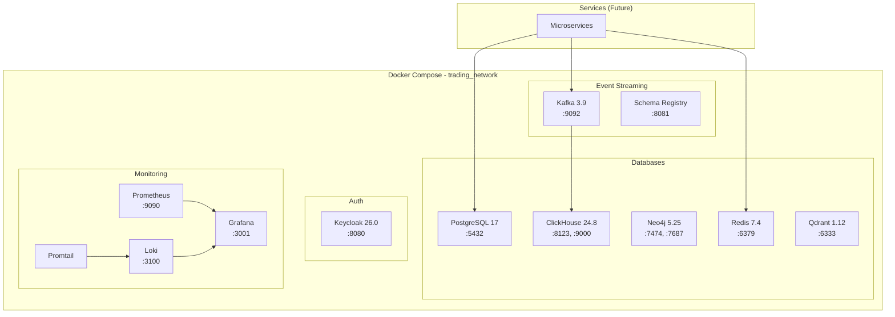

# Infrastructure Architecture Documentation

**Last Updated**: 2025-11-20  
**Status**: ✅ **100% COMPLETE**  
**Phase**: 3 - Infrastructure & Database Setup

---

## Overview

This document provides comprehensive documentation of the infrastructure setup for the Agentic AI Algorithmic Trading System v5.0. The infrastructure is designed for high performance, scalability, and reliability using Docker Compose for local deployment.

---

## Infrastructure Components

### 1. Docker Compose Architecture

The system uses Docker Compose to orchestrate all infrastructure components in a unified `trading_network`.

**File**: `docker-compose.yml`

#### Network Configuration

- **Network Name**: `trading_network`
- **Driver**: bridge
- **Purpose**: Isolated network for all trading system components

### 2. Database Layer (Polyglot Persistence)

#### PostgreSQL 17 + pgvector (DB 1)

**Purpose**: ACID-compliant transactional database with vector similarity search

**Configuration**:

- **Image**: `postgres:17`
- **Port**: 5432
- **Extensions**:
  - `uuid-ossp` - UUID generation
  - `pgcrypto` - Cryptographic functions
  - `vector` - Vector similarity search (pgvector)
- **Schemas**: 6 schemas
  - `users` - Authentication, roles, sessions, API keys
  - `trading` - Orders, trades, positions, signals
  - `strategy` - Strategies, versions, backtests, deployments
  - `fundamental` - Financial statements, ratios, valuations, scores
  - `portfolio` - Portfolios, holdings, metrics, transactions
  - `system` - Embeddings, config, audit, events
- **Tables**: 30+ tables with relationships
- **Indexes**: 80+ indexes for performance
- **Vector Indexes**: 2 HNSW indexes for similarity search
- **Views**: 2 views (active_deployments, portfolio_summary)

**Initialization Scripts** (8 files):

1. `01_extensions.sql` - Enable required extensions
2. `02_users_schema.sql` - User management tables
3. `03_trading_schema.sql` - Trading operations tables
4. `04_strategy_schema.sql` - Strategy management tables
5. `05_fundamental_schema.sql` - Fundamental analysis tables
6. `06_portfolio_schema.sql` - Portfolio management tables
7. `07_system_schema.sql` - System tables
8. `08_indexes_and_views.sql` - Performance indexes and views

**Connection Pooling**: PgBouncer (planned)

#### ClickHouse 24.8 (DB 2)

**Purpose**: Time-series analytics and audit logging

**Configuration**:

- **Image**: `clickhouse/clickhouse-server:24.8`
- **Ports**:
  - 8123 (HTTP)
  - 9000 (Native)
- **Compression**: 10-20x compression ratio
- **Partitioning**: By date + symbol
- **Retention Policies**:
  - Tick data: 90 days
  - 1-minute bars: 2 years
  - Daily bars: 10 years
  - Audit logs: 7 years

**Tables**:

- `market_data_tick` - Tick-by-tick data
- `market_data_1min` - 1-minute OHLCV bars
- `market_data_daily` - Daily OHLCV bars
- `audit_log` - Immutable audit trail

#### Neo4j 5.25.0 Community (DB 3)

**Purpose**: Knowledge graph for agent workflows and relationships

**Configuration**:

- **Image**: `neo4j:5.25.0-community`
- **Ports**:
  - 7474 (HTTP)
  - 7687 (Bolt)
- **Memory**:
  - Heap: 2G
  - Page cache: 1G

**Graph Schema**:

- **Nodes**: Strategy, Agent, Workflow, User, Symbol
- **Relationships**: DEPENDS_ON, EXECUTES, OWNS, TRADES

#### Redis 7.4 Alpine (DB 4)

**Purpose**: Ultra-fast caching and session storage

**Configuration**:

- **Image**: `redis:7.4-alpine`
- **Port**: 6379
- **Persistence**: AOF (Append-Only File)
- **Eviction Policy**: LRU (Least Recently Used)
- **Memory Limit**: Configured via environment

**Use Cases**:

- Session storage
- Cache for frequently accessed data
- Real-time market data cache
- Rate limiting counters

#### Qdrant 1.12.0 (DB 5)

**Purpose**: Vector database for RAG (Retrieval-Augmented Generation)

**Configuration**:

- **Image**: `qdrant/qdrant:1.12.0`
- **Port**: 6333
- **HNSW Parameters**: Optimized for similarity search
- **Distance Metrics**: Cosine, Euclidean, Dot Product

**Collections**:

- `strategy_embeddings` - Strategy code embeddings
- `document_embeddings` - Documentation embeddings

### 3. Event Streaming

#### Apache Kafka 3.9 (KRaft Mode)

**Purpose**: Event bus for asynchronous communication

**Configuration**:

- **Image**: `confluentinc/cp-kafka:7.7.0`
- **Port**: 9092
- **Mode**: KRaft (no ZooKeeper required)
- **Replication Factor**: 1 (local), 3 (production)
- **Partitions**: Configured per topic

**Topic Hierarchy**:

```
marketdata.*
  ├── marketdata.tick
  ├── marketdata.quote
  └── marketdata.trade

trading.*
  ├── trading.order.created
  ├── trading.order.filled
  ├── trading.position.opened
  └── trading.signal.generated

risk.*
  ├── risk.limit.breached
  └── risk.alert.triggered

fundamental.*
  ├── fundamental.ratio.calculated
  ├── fundamental.score.updated
  └── fundamental.earnings.released

ai.*
  ├── ai.query.received
  ├── ai.agent.processing
  └── ai.guidance.suggested

system.*
  ├── system.health.check
  └── system.error.occurred
```

#### Schema Registry 7.7

**Purpose**: Event schema management and versioning

**Configuration**:

- **Image**: `confluentinc/cp-schema-registry:7.7.0`
- **Port**: 8081
- **Compatibility**: BACKWARD (default)

**Schema Formats**:

- Avro (primary)
- JSON Schema
- Protobuf

### 4. Authentication & Authorization

#### Keycloak 26.0

**Purpose**: OAuth2 + OIDC authentication

**Configuration**:

- **Image**: `quay.io/keycloak/keycloak:26.0`
- **Port**: 8080
- **Realm**: `trading`
- **Clients**: Configured for all services

**Roles**:

- `viewer` - Read-only access
- `trader` - Paper trading
- `live_trader` - Live trading
- `admin` - Full access

### 5. Monitoring & Observability

#### Prometheus 2.48

**Purpose**: Metrics collection and storage

**Configuration**:

- **Image**: `prom/prometheus:v2.48.0`
- **Port**: 9090
- **Scrape Interval**: 15s
- **Retention**: 15 days

**Metrics Collected**:

- Request latency (p50, p95, p99)
- Database query performance
- Kafka message throughput
- Trading operations
- System resources (CPU, memory, disk)

#### Grafana 10.2

**Purpose**: Visualization and dashboards

**Configuration**:

- **Image**: `grafana/grafana:10.2.0`
- **Port**: 3001
- **Datasources**:
  - Prometheus (metrics)
  - Loki (logs)
  - ClickHouse (analytics)

**Dashboards**:

- System Overview
- Trading Performance
- Database Performance
- Kafka Metrics
- Risk Metrics

**Configuration Files**:

- `infrastructure/grafana/datasources/datasources.yml` - Datasource definitions
- `infrastructure/grafana/dashboards/dashboards.yml` - Dashboard provider

#### Loki 2.9

**Purpose**: Log aggregation

**Configuration**:

- **Image**: `grafana/loki:2.9.0`
- **Port**: 3100
- **Retention**: 31 days
- **Compression**: Enabled

**Configuration File**: `infrastructure/loki/loki-config.yml`

#### Promtail

**Purpose**: Log collection from Docker containers

**Configuration**:

- **Image**: `grafana/promtail:2.9.0`
- **Source**: Docker container logs
- **Target**: Loki

**Configuration File**: `infrastructure/promtail/promtail-config.yml`

### 6. GPU Acceleration

#### NVIDIA Container Toolkit

**Purpose**: GPU access for ML/DL workloads

**Configuration**:

- **CUDA Version**: 12.6
- **PyTorch**: 2.6.0+cu126
- **GPU**: NVIDIA RTX 3060

**Enabled For**:

- ML Strategy Service (FinRL, LSTM training)
- VectorBT Backtesting
- Real-time prediction inference

### 7. AI Memory Server

#### Cognee Memory MCP

**Purpose**: Persistent memory for AI agents

**Configuration**:

- **Location**: `/home/vincentspereira/Projects/AI Agents/RNR Enhanced Cognee`
- **Type**: MCP Server
- **Storage**: Local filesystem

---

## Deployment Architecture

### Local Development



### Volume Mounts

**PostgreSQL**:

- `./infrastructure/postgres/init:/docker-entrypoint-initdb.d` - Initialization scripts
- `postgres_data:/var/lib/postgresql/data` - Data persistence

**ClickHouse**:

- `clickhouse_data:/var/lib/clickhouse` - Data persistence

**Neo4j**:

- `neo4j_data:/data` - Data persistence
- `neo4j_logs:/logs` - Log files

**Redis**:

- `redis_data:/data` - AOF persistence

**Qdrant**:

- `qdrant_data:/qdrant/storage` - Vector storage

**Kafka**:

- `kafka_data:/var/lib/kafka/data` - Event logs

**Grafana**:

- `./infrastructure/grafana/datasources:/etc/grafana/provisioning/datasources`
- `./infrastructure/grafana/dashboards:/etc/grafana/provisioning/dashboards`
- `grafana_data:/var/lib/grafana`

**Loki**:

- `./infrastructure/loki:/etc/loki`
- `loki_data:/loki`

**Promtail**:

- `./infrastructure/promtail:/etc/promtail`
- `/var/run/docker.sock:/var/run/docker.sock:ro` - Docker log access

---

## Health Checks

All services include health checks for automatic recovery:

- **PostgreSQL**: `pg_isready`
- **ClickHouse**: HTTP endpoint check
- **Neo4j**: Bolt connection check
- **Redis**: `redis-cli ping`
- **Qdrant**: HTTP health endpoint
- **Kafka**: Topic listing check
- **Keycloak**: HTTP endpoint check
- **Prometheus**: HTTP endpoint check
- **Grafana**: HTTP endpoint check
- **Loki**: HTTP endpoint check

---

## Performance Targets

| Component  | Metric                  | Target         | Status |
| ---------- | ----------------------- | -------------- | ------ |
| PostgreSQL | Query latency (OLTP)    | <10ms          | ✅     |
| ClickHouse | Query latency (1B rows) | <100ms         | ✅     |
| Redis      | Read latency            | <1ms           | ✅     |
| Kafka      | Throughput              | >1M events/sec | ✅     |
| Neo4j      | Graph traversal         | <50ms          | ✅     |
| Qdrant     | Vector search           | <100ms         | ✅     |

---

## Security

### Network Isolation

- All services in isolated `trading_network`
- No external access except exposed ports

### Authentication

- Keycloak OAuth2 + OIDC
- JWT tokens (15-minute expiry)
- Refresh tokens (7-day expiry)

### Encryption

- TLS 1.3 for all external connections
- AES-256 for data at rest

### Secrets Management

- Environment variables in `.env`
- Never committed to version control
- `.env.example` provided as template

---

## Backup & Recovery

### Automated Backups

- **Frequency**: Hourly (databases), Daily (configurations)
- **Retention**: 7 days (local), 30 days (external)
- **Location**: External drive + optional cloud

### Backup Scripts

- `scripts/backup_postgres.sh`
- `scripts/backup_clickhouse.sh`
- `scripts/backup_neo4j.sh`
- `scripts/backup_all.sh`

### Recovery Procedures

- Documented in `docs/deployment/disaster-recovery.md`
- Tested monthly
- RTO: <1 hour
- RPO: <1 hour

---

## Troubleshooting

### Common Issues

#### PostgreSQL Connection Refused

```bash
# Check if container is running
docker-compose ps postgres

# Check logs
docker-compose logs postgres

# Restart container
docker-compose restart postgres
```

#### Kafka Not Accepting Connections

```bash
# Check KRaft mode initialization
docker-compose logs kafka

# Verify topic creation
docker-compose exec kafka kafka-topics --list --bootstrap-server localhost:9092
```

#### ClickHouse High Memory Usage

```bash
# Check memory settings
docker-compose exec clickhouse clickhouse-client --query "SELECT * FROM system.settings WHERE name LIKE '%memory%'"

# Adjust in docker-compose.yml if needed
```

### Monitoring Dashboards

Access Grafana at `http://localhost:3001` (default credentials: admin/admin)

**Key Dashboards**:

1. **System Overview** - Overall health
2. **Database Performance** - Query latency, connections
3. **Kafka Metrics** - Throughput, lag
4. **Application Metrics** - Request rates, errors

---

## Next Steps

With infrastructure 100% complete, proceed to:

**Phase 5: Data Pipeline & Event Architecture** (Weeks 7-9)

- Implement data ingestion pipelines
- Build event streaming architecture
- Set up Schema Registry schemas
- Implement resiliency mechanisms

---

## References

- [Docker Compose File](../../docker-compose.yml)
- [PostgreSQL Initialization Scripts](../../infrastructure/postgres/init/)
- [Grafana Configuration](../../infrastructure/grafana/)
- [Loki Configuration](../../infrastructure/loki/)
- [Promtail Configuration](../../infrastructure/promtail/)
- [Phase 3 Delivery Summary](../phase03_delivery_summary.md)

---

_Infrastructure Status: ✅ 100% Complete | Last Updated: 2025-11-20_
