# Deployment & Operations Guide

**Document Version**: 1.0.0  
**Last Updated**: 27 January 2025  
**Classification**: Operations Documentation  
**Owner**: DevOps Team

## Executive Summary

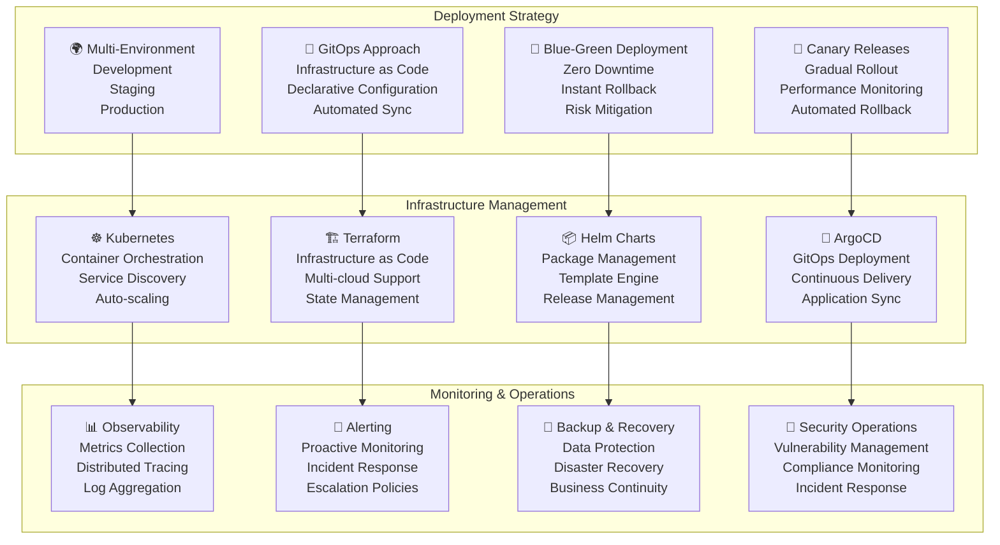
```mermaid
graph TB
    subgraph "Deployment Strategy"
        MULTI_ENVIRONMENT[🌍 Multi-Environment<br/>Development<br/>Staging<br/>Production]
        GITOPS_APPROACH[🔄 GitOps Approach<br/>Infrastructure as Code<br/>Declarative Configuration<br/>Automated Sync]
        BLUE_GREEN[🔄 Blue-Green Deployment<br/>Zero Downtime<br/>Instant Rollback<br/>Risk Mitigation]
        CANARY_RELEASES[🐤 Canary Releases<br/>Gradual Rollout<br/>Performance Monitoring<br/>Automated Rollback]
    end
    
    subgraph "Infrastructure Management"
        KUBERNETES[☸️ Kubernetes<br/>Container Orchestration<br/>Service Discovery<br/>Auto-scaling]
        TERRAFORM[🏗️ Terraform<br/>Infrastructure as Code<br/>Multi-cloud Support<br/>State Management]
        HELM[📦 Helm Charts<br/>Package Management<br/>Template Engine<br/>Release Management]
        ARGOCD[🚀 ArgoCD<br/>GitOps Deployment<br/>Continuous Delivery<br/>Application Sync]
    end
    
    subgraph "Monitoring & Operations"
        OBSERVABILITY[📊 Observability<br/>Metrics Collection<br/>Distributed Tracing<br/>Log Aggregation]
        ALERTING[🚨 Alerting<br/>Proactive Monitoring<br/>Incident Response<br/>Escalation Policies]
        BACKUP_RECOVERY[💾 Backup & Recovery<br/>Data Protection<br/>Disaster Recovery<br/>Business Continuity]
        SECURITY_OPERATIONS[🔐 Security Operations<br/>Vulnerability Management<br/>Compliance Monitoring<br/>Incident Response]
    end
    
    MULTI_ENVIRONMENT --> KUBERNETES
    GITOPS_APPROACH --> TERRAFORM
    BLUE_GREEN --> HELM
    CANARY_RELEASES --> ARGOCD
    
    KUBERNETES --> OBSERVABILITY
    TERRAFORM --> ALERTING
    HELM --> BACKUP_RECOVERY
    ARGOCD --> SECURITY_OPERATIONS
```

This comprehensive deployment guide provides detailed procedures for deploying, managing, and operating the Algorithmic Trading System (ATS) across multiple environments with enterprise-grade reliability and security.

## Infrastructure Architecture

### Multi-Cloud Deployment Strategy

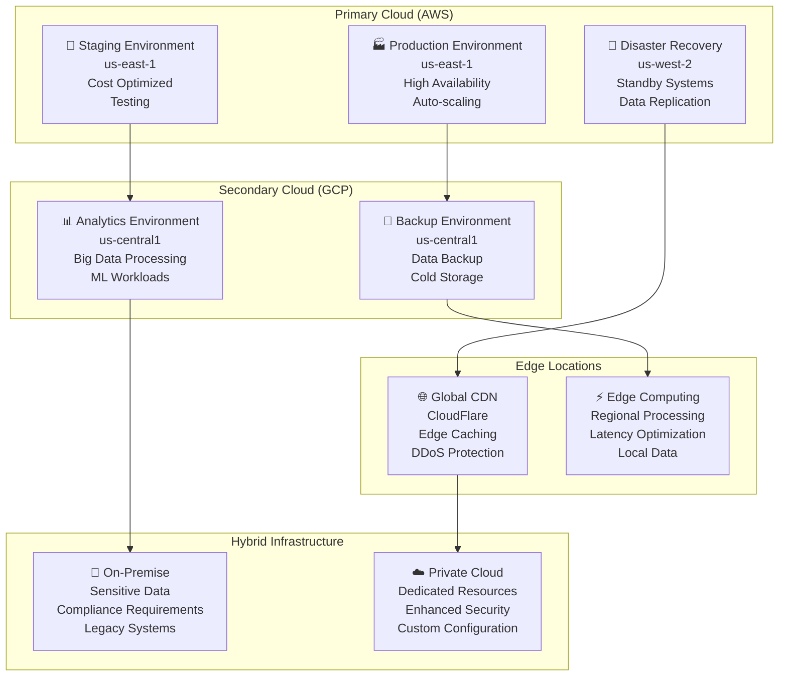
```mermaid
graph TB
    subgraph "Primary Cloud (AWS)"
        AWS_PROD[🏭 Production Environment<br/>us-east-1<br/>High Availability<br/>Auto-scaling]
        AWS_STAGING[🧪 Staging Environment<br/>us-east-1<br/>Cost Optimized<br/>Testing]
        AWS_DR[🔄 Disaster Recovery<br/>us-west-2<br/>Standby Systems<br/>Data Replication]
    end
    
    subgraph "Secondary Cloud (GCP)"
        GCP_BACKUP[💾 Backup Environment<br/>us-central1<br/>Data Backup<br/>Cold Storage]
        GCP_ANALYTICS[📊 Analytics Environment<br/>us-central1<br/>Big Data Processing<br/>ML Workloads]
    end
    
    subgraph "Edge Locations"
        CDN_GLOBAL[🌐 Global CDN<br/>CloudFlare<br/>Edge Caching<br/>DDoS Protection]
        EDGE_COMPUTE[⚡ Edge Computing<br/>Regional Processing<br/>Latency Optimization<br/>Local Data]
    end
    
    subgraph "Hybrid Infrastructure"
        ON_PREMISE[🏢 On-Premise<br/>Sensitive Data<br/>Compliance Requirements<br/>Legacy Systems]
        PRIVATE_CLOUD[☁️ Private Cloud<br/>Dedicated Resources<br/>Enhanced Security<br/>Custom Configuration]
    end
    
    AWS_PROD --> GCP_BACKUP
    AWS_STAGING --> GCP_ANALYTICS
    AWS_DR --> CDN_GLOBAL
    
    GCP_BACKUP --> EDGE_COMPUTE
    GCP_ANALYTICS --> ON_PREMISE
    CDN_GLOBAL --> PRIVATE_CLOUD
```

### Kubernetes Cluster Architecture

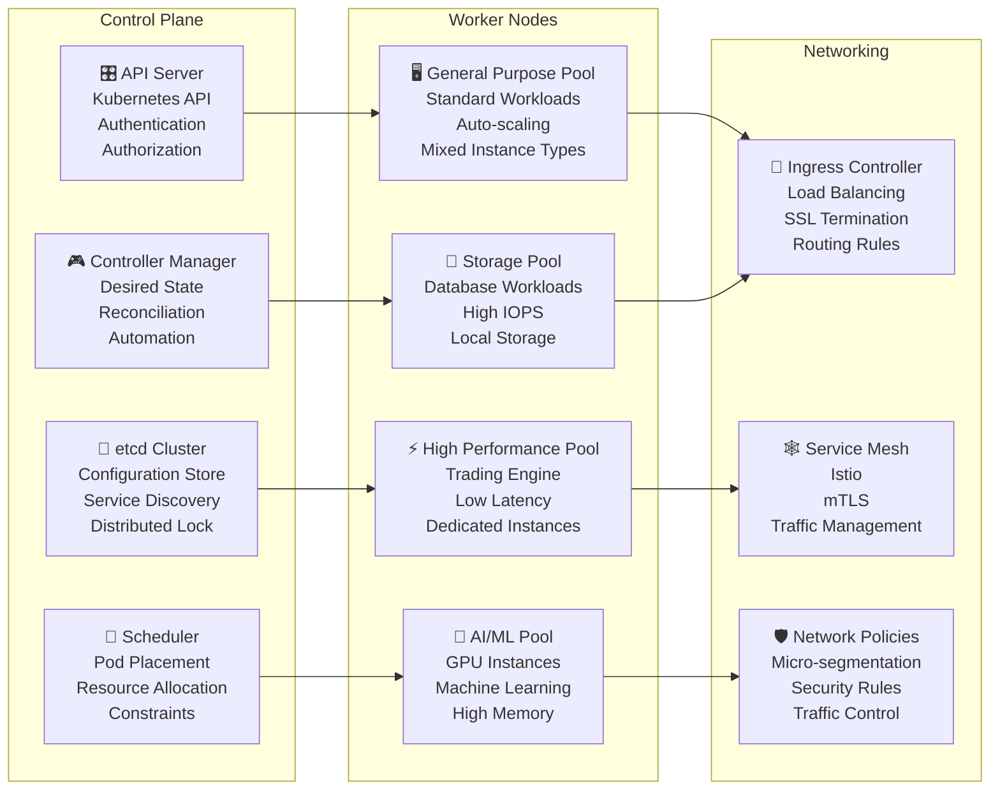
```mermaid
graph LR
    subgraph "Control Plane"
        API_SERVER[🎛️ API Server<br/>Kubernetes API<br/>Authentication<br/>Authorization]
        ETCD[💾 etcd Cluster<br/>Configuration Store<br/>Service Discovery<br/>Distributed Lock]
        SCHEDULER[📅 Scheduler<br/>Pod Placement<br/>Resource Allocation<br/>Constraints]
        CONTROLLER[🎮 Controller Manager<br/>Desired State<br/>Reconciliation<br/>Automation]
    end
    
    subgraph "Worker Nodes"
        NODE_POOL_1[🖥️ General Purpose Pool<br/>Standard Workloads<br/>Auto-scaling<br/>Mixed Instance Types]
        NODE_POOL_2[⚡ High Performance Pool<br/>Trading Engine<br/>Low Latency<br/>Dedicated Instances]
        NODE_POOL_3[🧠 AI/ML Pool<br/>GPU Instances<br/>Machine Learning<br/>High Memory]
        NODE_POOL_4[💾 Storage Pool<br/>Database Workloads<br/>High IOPS<br/>Local Storage]
    end
    
    subgraph "Networking"
        INGRESS[🚪 Ingress Controller<br/>Load Balancing<br/>SSL Termination<br/>Routing Rules]
        SERVICE_MESH[🕸️ Service Mesh<br/>Istio<br/>mTLS<br/>Traffic Management]
        NETWORK_POLICIES[🛡️ Network Policies<br/>Micro-segmentation<br/>Security Rules<br/>Traffic Control]
    end
    
    API_SERVER --> NODE_POOL_1
    ETCD --> NODE_POOL_2
    SCHEDULER --> NODE_POOL_3
    CONTROLLER --> NODE_POOL_4
    
    NODE_POOL_1 --> INGRESS
    NODE_POOL_2 --> SERVICE_MESH
    NODE_POOL_3 --> NETWORK_POLICIES
    NODE_POOL_4 --> INGRESS
```

## Environment Configuration

### Environment Hierarchy

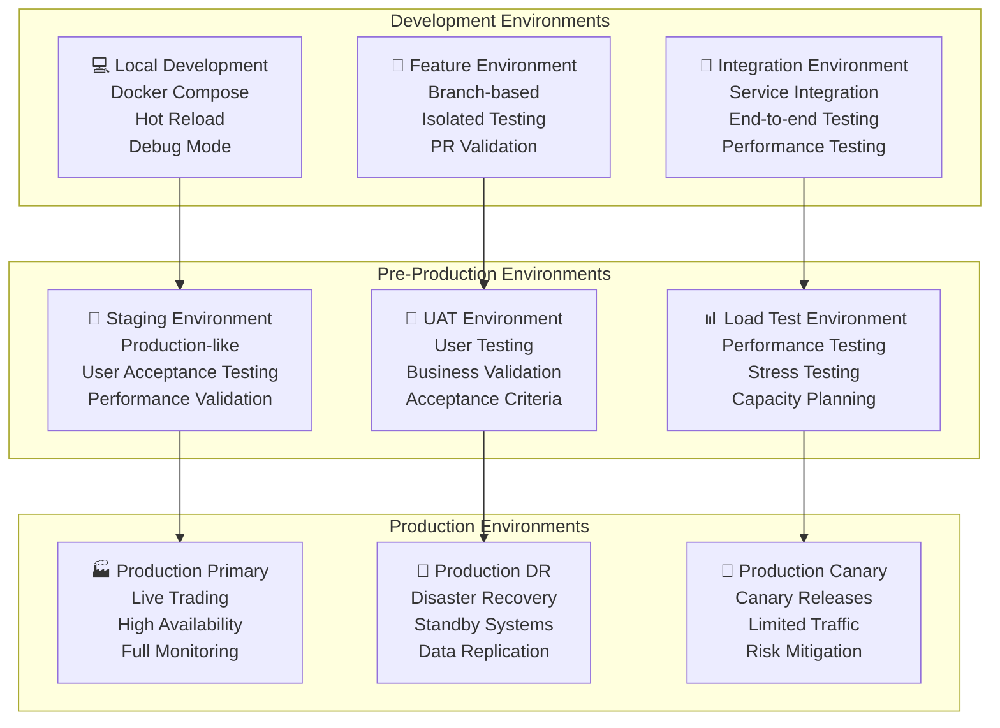
```mermaid
graph TB
    subgraph "Development Environments"
        LOCAL_DEV[💻 Local Development<br/>Docker Compose<br/>Hot Reload<br/>Debug Mode]
        FEATURE_ENV[🌿 Feature Environment<br/>Branch-based<br/>Isolated Testing<br/>PR Validation]
        INTEGRATION_ENV[🔗 Integration Environment<br/>Service Integration<br/>End-to-end Testing<br/>Performance Testing]
    end
    
    subgraph "Pre-Production Environments"
        STAGING_ENV[🧪 Staging Environment<br/>Production-like<br/>User Acceptance Testing<br/>Performance Validation]
        UAT_ENV[👤 UAT Environment<br/>User Testing<br/>Business Validation<br/>Acceptance Criteria]
        LOAD_TEST_ENV[📊 Load Test Environment<br/>Performance Testing<br/>Stress Testing<br/>Capacity Planning]
    end
    
    subgraph "Production Environments"
        PROD_PRIMARY[🏭 Production Primary<br/>Live Trading<br/>High Availability<br/>Full Monitoring]
        PROD_DR[🔄 Production DR<br/>Disaster Recovery<br/>Standby Systems<br/>Data Replication]
        PROD_CANARY[🐤 Production Canary<br/>Canary Releases<br/>Limited Traffic<br/>Risk Mitigation]
    end
    
    LOCAL_DEV --> STAGING_ENV
    FEATURE_ENV --> UAT_ENV
    INTEGRATION_ENV --> LOAD_TEST_ENV
    
    STAGING_ENV --> PROD_PRIMARY
    UAT_ENV --> PROD_DR
    LOAD_TEST_ENV --> PROD_CANARY
```

### Configuration Management

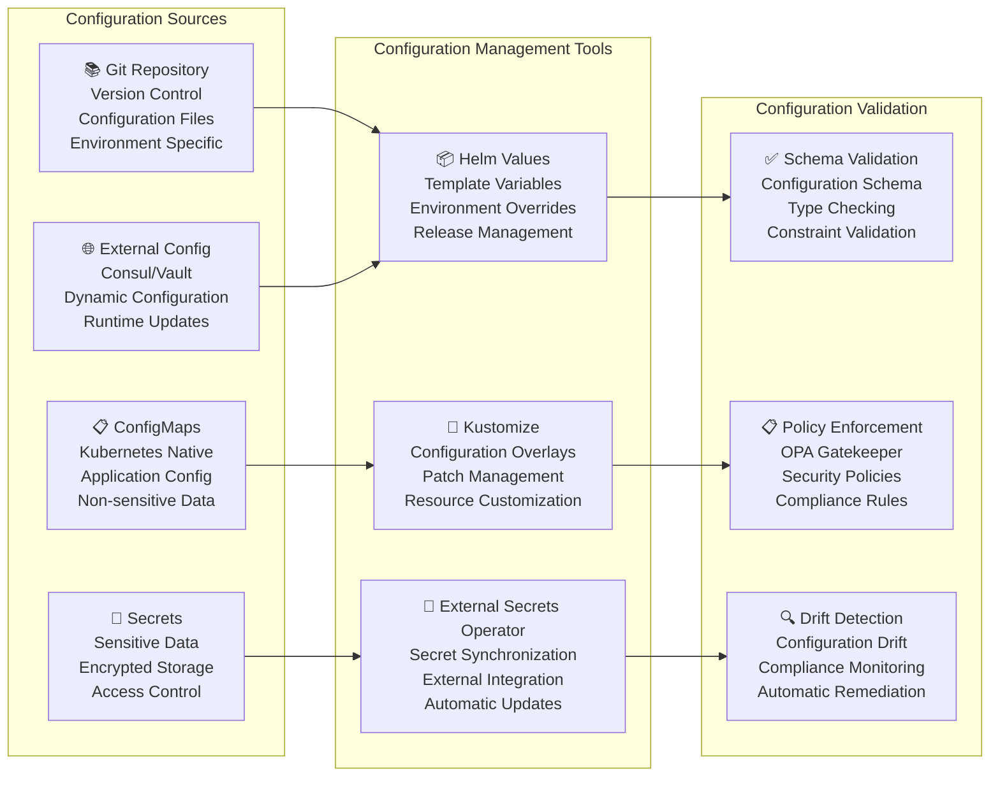
```mermaid
graph LR
    subgraph "Configuration Sources"
        GIT_REPO[📚 Git Repository<br/>Version Control<br/>Configuration Files<br/>Environment Specific]
        CONFIG_MAPS[📋 ConfigMaps<br/>Kubernetes Native<br/>Application Config<br/>Non-sensitive Data]
        SECRETS[🔐 Secrets<br/>Sensitive Data<br/>Encrypted Storage<br/>Access Control]
        EXTERNAL_CONFIG[🌐 External Config<br/>Consul/Vault<br/>Dynamic Configuration<br/>Runtime Updates]
    end
    
    subgraph "Configuration Management Tools"
        HELM_VALUES[📦 Helm Values<br/>Template Variables<br/>Environment Overrides<br/>Release Management]
        KUSTOMIZE[🔧 Kustomize<br/>Configuration Overlays<br/>Patch Management<br/>Resource Customization]
        EXTERNAL_SECRETS[🔑 External Secrets Operator<br/>Secret Synchronization<br/>External Integration<br/>Automatic Updates]
    end
    
    subgraph "Configuration Validation"
        SCHEMA_VALIDATION[✅ Schema Validation<br/>Configuration Schema<br/>Type Checking<br/>Constraint Validation]
        POLICY_ENFORCEMENT[📋 Policy Enforcement<br/>OPA Gatekeeper<br/>Security Policies<br/>Compliance Rules]
        DRIFT_DETECTION[🔍 Drift Detection<br/>Configuration Drift<br/>Compliance Monitoring<br/>Automatic Remediation]
    end
    
    GIT_REPO --> HELM_VALUES
    CONFIG_MAPS --> KUSTOMIZE
    SECRETS --> EXTERNAL_SECRETS
    EXTERNAL_CONFIG --> HELM_VALUES
    
    HELM_VALUES --> SCHEMA_VALIDATION
    KUSTOMIZE --> POLICY_ENFORCEMENT
    EXTERNAL_SECRETS --> DRIFT_DETECTION
```

## CI/CD Pipeline Architecture

### Pipeline Stages

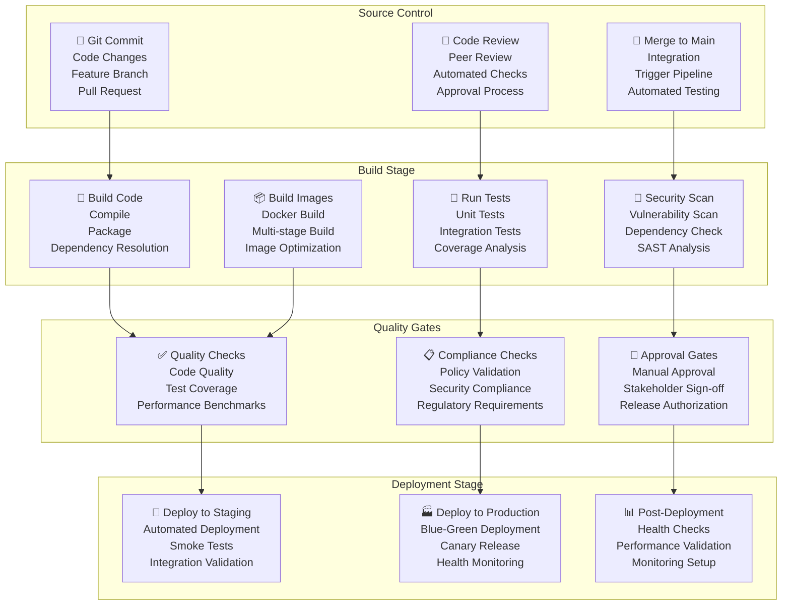
```mermaid
graph TB
    subgraph "Source Control"
        GIT_COMMIT[📝 Git Commit<br/>Code Changes<br/>Feature Branch<br/>Pull Request]
        CODE_REVIEW[👀 Code Review<br/>Peer Review<br/>Automated Checks<br/>Approval Process]
        MERGE_MAIN[🔀 Merge to Main<br/>Integration<br/>Trigger Pipeline<br/>Automated Testing]
    end
    
    subgraph "Build Stage"
        BUILD_CODE[🔨 Build Code<br/>Compile<br/>Package<br/>Dependency Resolution]
        RUN_TESTS[🧪 Run Tests<br/>Unit Tests<br/>Integration Tests<br/>Coverage Analysis]
        SECURITY_SCAN[🔐 Security Scan<br/>Vulnerability Scan<br/>Dependency Check<br/>SAST Analysis]
        BUILD_IMAGES[📦 Build Images<br/>Docker Build<br/>Multi-stage Build<br/>Image Optimization]
    end
    
    subgraph "Quality Gates"
        QUALITY_CHECKS[✅ Quality Checks<br/>Code Quality<br/>Test Coverage<br/>Performance Benchmarks]
        COMPLIANCE_CHECKS[📋 Compliance Checks<br/>Policy Validation<br/>Security Compliance<br/>Regulatory Requirements]
        APPROVAL_GATES[👥 Approval Gates<br/>Manual Approval<br/>Stakeholder Sign-off<br/>Release Authorization]
    end
    
    subgraph "Deployment Stage"
        DEPLOY_STAGING[🧪 Deploy to Staging<br/>Automated Deployment<br/>Smoke Tests<br/>Integration Validation]
        DEPLOY_PRODUCTION[🏭 Deploy to Production<br/>Blue-Green Deployment<br/>Canary Release<br/>Health Monitoring]
        POST_DEPLOY[📊 Post-Deployment<br/>Health Checks<br/>Performance Validation<br/>Monitoring Setup]
    end
    
    GIT_COMMIT --> BUILD_CODE
    CODE_REVIEW --> RUN_TESTS
    MERGE_MAIN --> SECURITY_SCAN
    
    BUILD_CODE --> QUALITY_CHECKS
    RUN_TESTS --> COMPLIANCE_CHECKS
    SECURITY_SCAN --> APPROVAL_GATES
    BUILD_IMAGES --> QUALITY_CHECKS
    
    QUALITY_CHECKS --> DEPLOY_STAGING
    COMPLIANCE_CHECKS --> DEPLOY_PRODUCTION
    APPROVAL_GATES --> POST_DEPLOY
```

### GitOps Workflow

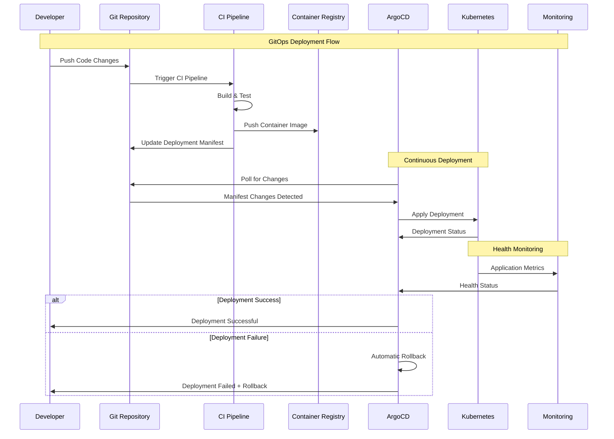
```mermaid
sequenceDiagram
    participant Dev as Developer
    participant Git as Git Repository
    participant CI as CI Pipeline
    participant Registry as Container Registry
    participant ArgoCD as ArgoCD
    participant K8s as Kubernetes
    participant Monitor as Monitoring
    
    Note over Dev, Monitor: GitOps Deployment Flow
    
    Dev->>Git: Push Code Changes
    Git->>CI: Trigger CI Pipeline
    CI->>CI: Build & Test
    CI->>Registry: Push Container Image
    CI->>Git: Update Deployment Manifest
    
    Note over ArgoCD, K8s: Continuous Deployment
    ArgoCD->>Git: Poll for Changes
    Git->>ArgoCD: Manifest Changes Detected
    ArgoCD->>K8s: Apply Deployment
    K8s->>ArgoCD: Deployment Status
    
    Note over K8s, Monitor: Health Monitoring
    K8s->>Monitor: Application Metrics
    Monitor->>ArgoCD: Health Status
    
    alt Deployment Success
        ArgoCD->>Dev: Deployment Successful
    else Deployment Failure
        ArgoCD->>ArgoCD: Automatic Rollback
        ArgoCD->>Dev: Deployment Failed + Rollback
    end
```

## Deployment Procedures

### Blue-Green Deployment

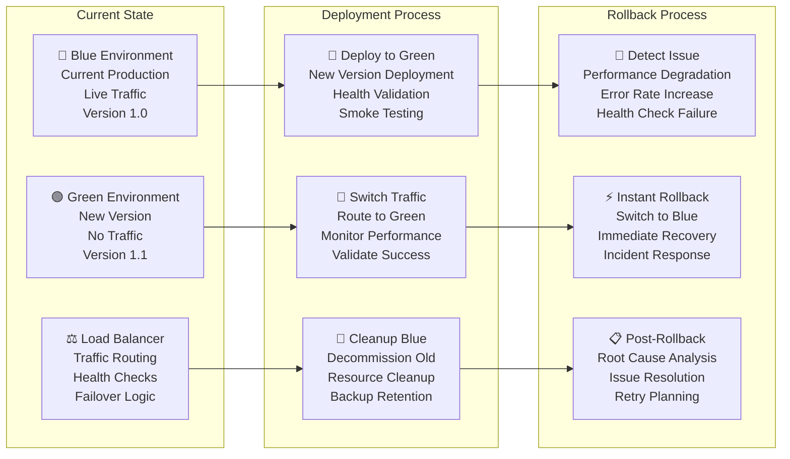
```mermaid
graph LR
    subgraph "Current State"
        BLUE_ENV[🔵 Blue Environment<br/>Current Production<br/>Live Traffic<br/>Version 1.0]
        GREEN_ENV[🟢 Green Environment<br/>New Version<br/>No Traffic<br/>Version 1.1]
        LOAD_BALANCER[⚖️ Load Balancer<br/>Traffic Routing<br/>Health Checks<br/>Failover Logic]
    end
    
    subgraph "Deployment Process"
        DEPLOY_GREEN[🚀 Deploy to Green<br/>New Version Deployment<br/>Health Validation<br/>Smoke Testing]
        SWITCH_TRAFFIC[🔄 Switch Traffic<br/>Route to Green<br/>Monitor Performance<br/>Validate Success]
        CLEANUP_BLUE[🧹 Cleanup Blue<br/>Decommission Old<br/>Resource Cleanup<br/>Backup Retention]
    end
    
    subgraph "Rollback Process"
        DETECT_ISSUE[🚨 Detect Issue<br/>Performance Degradation<br/>Error Rate Increase<br/>Health Check Failure]
        INSTANT_ROLLBACK[⚡ Instant Rollback<br/>Switch to Blue<br/>Immediate Recovery<br/>Incident Response]
        POST_ROLLBACK[📋 Post-Rollback<br/>Root Cause Analysis<br/>Issue Resolution<br/>Retry Planning]
    end
    
    BLUE_ENV --> DEPLOY_GREEN
    GREEN_ENV --> SWITCH_TRAFFIC
    LOAD_BALANCER --> CLEANUP_BLUE
    
    DEPLOY_GREEN --> DETECT_ISSUE
    SWITCH_TRAFFIC --> INSTANT_ROLLBACK
    CLEANUP_BLUE --> POST_ROLLBACK
```

### Canary Deployment Strategy

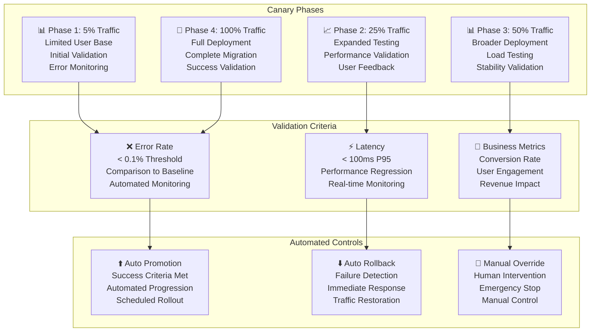
```mermaid
graph TB
    subgraph "Canary Phases"
        PHASE_1[📊 Phase 1: 5% Traffic<br/>Limited User Base<br/>Initial Validation<br/>Error Monitoring]
        PHASE_2[📈 Phase 2: 25% Traffic<br/>Expanded Testing<br/>Performance Validation<br/>User Feedback]
        PHASE_3[📊 Phase 3: 50% Traffic<br/>Broader Deployment<br/>Load Testing<br/>Stability Validation]
        PHASE_4[🎯 Phase 4: 100% Traffic<br/>Full Deployment<br/>Complete Migration<br/>Success Validation]
    end
    
    subgraph "Validation Criteria"
        ERROR_RATE[❌ Error Rate<br/>< 0.1% Threshold<br/>Comparison to Baseline<br/>Automated Monitoring]
        LATENCY[⚡ Latency<br/>< 100ms P95<br/>Performance Regression<br/>Real-time Monitoring]
        BUSINESS_METRICS[💼 Business Metrics<br/>Conversion Rate<br/>User Engagement<br/>Revenue Impact]
    end
    
    subgraph "Automated Controls"
        AUTO_PROMOTION[⬆️ Auto Promotion<br/>Success Criteria Met<br/>Automated Progression<br/>Scheduled Rollout]
        AUTO_ROLLBACK[⬇️ Auto Rollback<br/>Failure Detection<br/>Immediate Response<br/>Traffic Restoration]
        MANUAL_OVERRIDE[👤 Manual Override<br/>Human Intervention<br/>Emergency Stop<br/>Manual Control]
    end
    
    PHASE_1 --> ERROR_RATE
    PHASE_2 --> LATENCY
    PHASE_3 --> BUSINESS_METRICS
    PHASE_4 --> ERROR_RATE
    
    ERROR_RATE --> AUTO_PROMOTION
    LATENCY --> AUTO_ROLLBACK
    BUSINESS_METRICS --> MANUAL_OVERRIDE
```

## Infrastructure as Code

### Terraform Configuration

```hcl
# Main Terraform Configuration
terraform {
  required_version = ">= 1.0"
  required_providers {
    aws = {
      source  = "hashicorp/aws"
      version = "~> 5.0"
    }
    kubernetes = {
      source  = "hashicorp/kubernetes"
      version = "~> 2.0"
    }
    helm = {
      source  = "hashicorp/helm"
      version = "~> 2.0"
    }
  }
  
  backend "s3" {
    bucket         = "ats-terraform-state"
    key            = "infrastructure/terraform.tfstate"
    region         = "us-east-1"
    encrypt        = true
    dynamodb_table = "terraform-locks"
  }
}

# EKS Cluster Configuration
module "eks_cluster" {
  source = "./modules/eks"
  
  cluster_name    = var.cluster_name
  cluster_version = var.kubernetes_version
  
  vpc_id     = module.vpc.vpc_id
  subnet_ids = module.vpc.private_subnets
  
  node_groups = {
    general = {
      instance_types = ["m5.large", "m5.xlarge"]
      min_size       = 2
      max_size       = 10
      desired_size   = 3
    }
    
    trading = {
      instance_types = ["c5n.large", "c5n.xlarge"]
      min_size       = 1
      max_size       = 5
      desired_size   = 2
      
      taints = [{
        key    = "workload"
        value  = "trading"
        effect = "NO_SCHEDULE"
      }]
    }
    
    ai_ml = {
      instance_types = ["p3.2xlarge", "p3.8xlarge"]
      min_size       = 0
      max_size       = 3
      desired_size   = 1
      
      taints = [{
        key    = "workload"
        value  = "ai-ml"
        effect = "NO_SCHEDULE"
      }]
    }
  }
  
  tags = local.common_tags
}

# RDS Database Configuration
module "rds_cluster" {
  source = "./modules/rds"
  
  cluster_identifier = "${var.environment}-ats-postgres"
  engine            = "aurora-postgresql"
  engine_version    = "13.7"
  
  master_username = var.db_username
  master_password = var.db_password
  
  vpc_id               = module.vpc.vpc_id
  subnet_ids          = module.vpc.database_subnets
  vpc_security_group_ids = [module.security_groups.database_sg_id]
  
  backup_retention_period = 30
  preferred_backup_window = "03:00-04:00"
  
  performance_insights_enabled = true
  monitoring_interval         = 60
  
  tags = local.common_tags
}
```

### Kubernetes Manifests

```yaml
# Namespace Configuration
apiVersion: v1
kind: Namespace
metadata:
  name: ats-trading
  labels:
    name: ats-trading
    environment: production
    team: trading
---
# Trading Engine Deployment
apiVersion: apps/v1
kind: Deployment
metadata:
  name: trading-engine
  namespace: ats-trading
  labels:
    app: trading-engine
    version: v1.0.0
spec:
  replicas: 3
  strategy:
    type: RollingUpdate
    rollingUpdate:
      maxSurge: 1
      maxUnavailable: 0
  selector:
    matchLabels:
      app: trading-engine
  template:
    metadata:
      labels:
        app: trading-engine
        version: v1.0.0
      annotations:
        prometheus.io/scrape: "true"
        prometheus.io/port: "8080"
        prometheus.io/path: "/metrics"
    spec:
      nodeSelector:
        workload: trading
      tolerations:
      - key: workload
        operator: Equal
        value: trading
        effect: NoSchedule
      containers:
      - name: trading-engine
        image: ats/trading-engine:v1.0.0
        ports:
        - containerPort: 8080
          name: http
        - containerPort: 9090
          name: grpc
        env:
        - name: ENVIRONMENT
          value: "production"
        - name: LOG_LEVEL
          value: "INFO"
        - name: DATABASE_URL
          valueFrom:
            secretKeyRef:
              name: database-credentials
              key: url
        resources:
          requests:
            memory: "1Gi"
            cpu: "500m"
          limits:
            memory: "2Gi"
            cpu: "1000m"
        livenessProbe:
          httpGet:
            path: /health
            port: 8080
          initialDelaySeconds: 30
          periodSeconds: 10
        readinessProbe:
          httpGet:
            path: /ready
            port: 8080
          initialDelaySeconds: 5
          periodSeconds: 5
---
# Service Configuration
apiVersion: v1
kind: Service
metadata:
  name: trading-engine-service
  namespace: ats-trading
  labels:
    app: trading-engine
spec:
  selector:
    app: trading-engine
  ports:
  - name: http
    port: 80
    targetPort: 8080
  - name: grpc
    port: 9090
    targetPort: 9090
  type: ClusterIP
```

### Helm Chart Structure

```yaml
# Chart.yaml
apiVersion: v2
name: ats-trading-system
description: Algorithmic Trading System Helm Chart
version: 1.0.0
appVersion: "1.0.0"
dependencies:
- name: postgresql
  version: "11.9.13"
  repository: "https://charts.bitnami.com/bitnami"
  condition: postgresql.enabled
- name: redis
  version: "17.3.7"
  repository: "https://charts.bitnami.com/bitnami"
  condition: redis.enabled
- name: kafka
  version: "20.0.6"
  repository: "https://charts.bitnami.com/bitnami"
  condition: kafka.enabled

---
# values.yaml
global:
  environment: production
  imageRegistry: "registry.ats.example.com"
  imagePullSecrets:
    - name: registry-credentials

tradingEngine:
  enabled: true
  replicaCount: 3
  image:
    repository: ats/trading-engine
    tag: "v1.0.0"
    pullPolicy: IfNotPresent
  
  service:
    type: ClusterIP
    port: 80
    targetPort: 8080
  
  ingress:
    enabled: true
    className: "nginx"
    annotations:
      cert-manager.io/cluster-issuer: "letsencrypt-prod"
      nginx.ingress.kubernetes.io/rate-limit: "100"
    hosts:
      - host: api.ats.example.com
        paths:
          - path: /trading
            pathType: Prefix
    tls:
      - secretName: api-tls
        hosts:
          - api.ats.example.com

  resources:
    requests:
      memory: "1Gi"
      cpu: "500m"
    limits:
      memory: "2Gi"
      cpu: "1000m"

  autoscaling:
    enabled: true
    minReplicas: 3
    maxReplicas: 10
    targetCPUUtilizationPercentage: 70
    targetMemoryUtilizationPercentage: 80

aiAssistant:
  enabled: true
  replicaCount: 2
  image:
    repository: ats/ai-assistant
    tag: "v1.0.0"
  
  resources:
    requests:
      memory: "2Gi"
      cpu: "1000m"
      nvidia.com/gpu: 1
    limits:
      memory: "4Gi"
      cpu: "2000m"
      nvidia.com/gpu: 1

postgresql:
  enabled: true
  auth:
    postgresPassword: "secure-password"
    database: "ats_production"
  primary:
    persistence:
      enabled: true
      size: 100Gi
      storageClass: "gp3"
  readReplicas:
    replicaCount: 2
```

## Monitoring & Observability

### Monitoring Stack Architecture

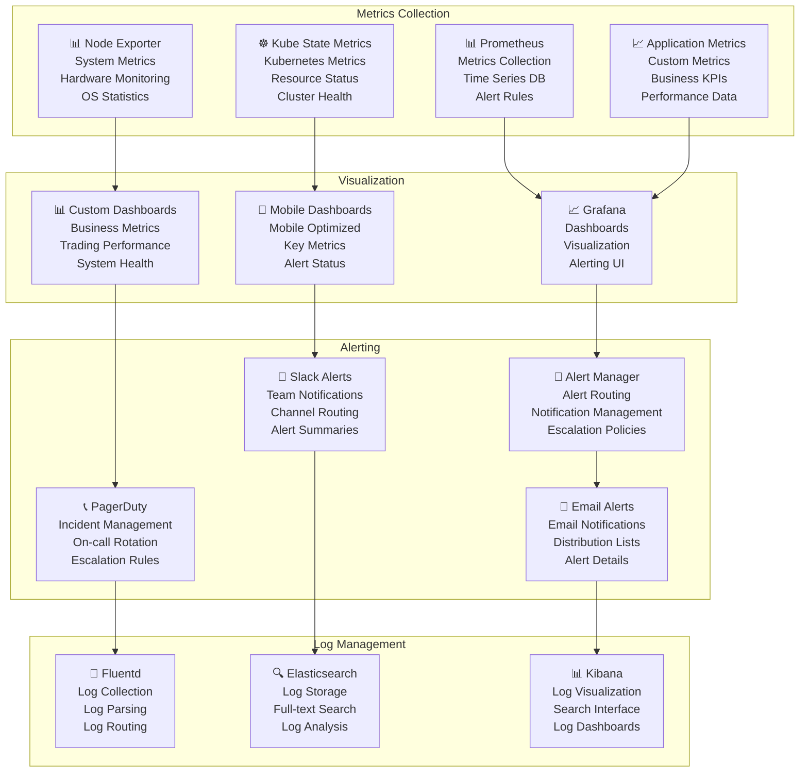
```mermaid
graph TB
    subgraph "Metrics Collection"
        PROMETHEUS[📊 Prometheus<br/>Metrics Collection<br/>Time Series DB<br/>Alert Rules]
        NODE_EXPORTER[📊 Node Exporter<br/>System Metrics<br/>Hardware Monitoring<br/>OS Statistics]
        KUBE_STATE[☸️ Kube State Metrics<br/>Kubernetes Metrics<br/>Resource Status<br/>Cluster Health]
        APP_METRICS[📈 Application Metrics<br/>Custom Metrics<br/>Business KPIs<br/>Performance Data]
    end
    
    subgraph "Visualization"
        GRAFANA[📈 Grafana<br/>Dashboards<br/>Visualization<br/>Alerting UI]
        CUSTOM_DASHBOARDS[📊 Custom Dashboards<br/>Business Metrics<br/>Trading Performance<br/>System Health]
        MOBILE_DASHBOARDS[📱 Mobile Dashboards<br/>Mobile Optimized<br/>Key Metrics<br/>Alert Status]
    end
    
    subgraph "Alerting"
        ALERT_MANAGER[🚨 Alert Manager<br/>Alert Routing<br/>Notification Management<br/>Escalation Policies]
        PAGERDUTY[📞 PagerDuty<br/>Incident Management<br/>On-call Rotation<br/>Escalation Rules]
        SLACK_ALERTS[💬 Slack Alerts<br/>Team Notifications<br/>Channel Routing<br/>Alert Summaries]
        EMAIL_ALERTS[📧 Email Alerts<br/>Email Notifications<br/>Distribution Lists<br/>Alert Details]
    end
    
    subgraph "Log Management"
        FLUENTD[📝 Fluentd<br/>Log Collection<br/>Log Parsing<br/>Log Routing]
        ELASTICSEARCH[🔍 Elasticsearch<br/>Log Storage<br/>Full-text Search<br/>Log Analysis]
        KIBANA[📊 Kibana<br/>Log Visualization<br/>Search Interface<br/>Log Dashboards]
    end
    
    PROMETHEUS --> GRAFANA
    NODE_EXPORTER --> CUSTOM_DASHBOARDS
    KUBE_STATE --> MOBILE_DASHBOARDS
    APP_METRICS --> GRAFANA
    
    GRAFANA --> ALERT_MANAGER
    CUSTOM_DASHBOARDS --> PAGERDUTY
    MOBILE_DASHBOARDS --> SLACK_ALERTS
    
    ALERT_MANAGER --> EMAIL_ALERTS
    PAGERDUTY --> FLUENTD
    SLACK_ALERTS --> ELASTICSEARCH
    EMAIL_ALERTS --> KIBANA
```

### Distributed Tracing

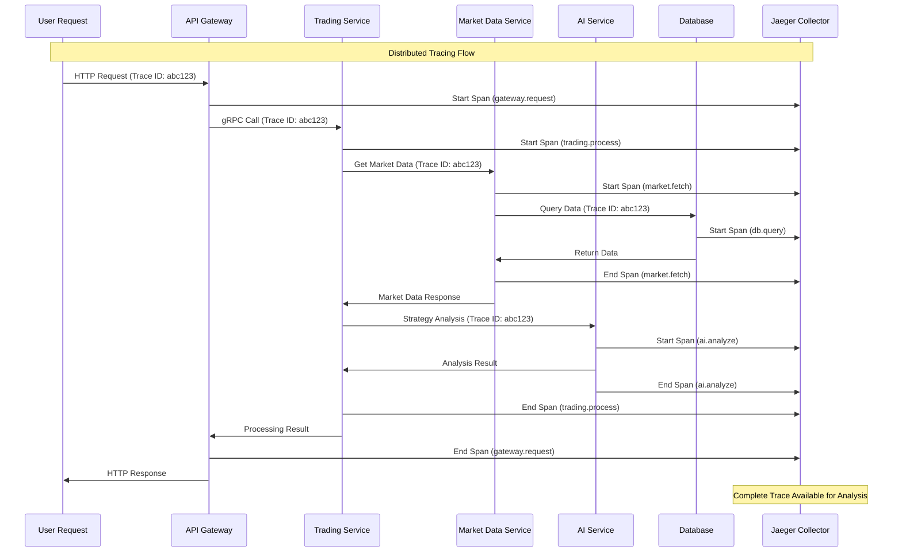
```mermaid
sequenceDiagram
    participant User as User Request
    participant Gateway as API Gateway
    participant Trading as Trading Service
    participant Market as Market Data Service
    participant AI as AI Service
    participant Database as Database
    participant Jaeger as Jaeger Collector
    
    Note over User, Jaeger: Distributed Tracing Flow
    
    User->>Gateway: HTTP Request (Trace ID: abc123)
    Gateway->>Jaeger: Start Span (gateway.request)
    
    Gateway->>Trading: gRPC Call (Trace ID: abc123)
    Trading->>Jaeger: Start Span (trading.process)
    
    Trading->>Market: Get Market Data (Trace ID: abc123)
    Market->>Jaeger: Start Span (market.fetch)
    Market->>Database: Query Data (Trace ID: abc123)
    Database->>Jaeger: Start Span (db.query)
    Database->>Market: Return Data
    Market->>Jaeger: End Span (market.fetch)
    Market->>Trading: Market Data Response
    
    Trading->>AI: Strategy Analysis (Trace ID: abc123)
    AI->>Jaeger: Start Span (ai.analyze)
    AI->>Trading: Analysis Result
    AI->>Jaeger: End Span (ai.analyze)
    
    Trading->>Jaeger: End Span (trading.process)
    Trading->>Gateway: Processing Result
    Gateway->>Jaeger: End Span (gateway.request)
    Gateway->>User: HTTP Response
    
    Note over Jaeger: Complete Trace Available for Analysis
```

## Backup & Disaster Recovery

### Backup Strategy

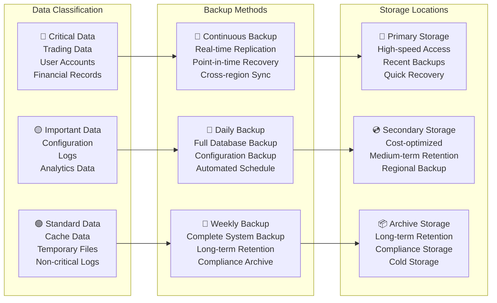
```mermaid
graph LR
    subgraph "Data Classification"
        CRITICAL_DATA[🔴 Critical Data<br/>Trading Data<br/>User Accounts<br/>Financial Records]
        IMPORTANT_DATA[🟡 Important Data<br/>Configuration<br/>Logs<br/>Analytics Data]
        STANDARD_DATA[🟢 Standard Data<br/>Cache Data<br/>Temporary Files<br/>Non-critical Logs]
    end
    
    subgraph "Backup Methods"
        CONTINUOUS_BACKUP[🔄 Continuous Backup<br/>Real-time Replication<br/>Point-in-time Recovery<br/>Cross-region Sync]
        DAILY_BACKUP[📅 Daily Backup<br/>Full Database Backup<br/>Configuration Backup<br/>Automated Schedule]
        WEEKLY_BACKUP[📆 Weekly Backup<br/>Complete System Backup<br/>Long-term Retention<br/>Compliance Archive]
    end
    
    subgraph "Storage Locations"
        PRIMARY_STORAGE[💾 Primary Storage<br/>High-speed Access<br/>Recent Backups<br/>Quick Recovery]
        SECONDARY_STORAGE[💿 Secondary Storage<br/>Cost-optimized<br/>Medium-term Retention<br/>Regional Backup]
        ARCHIVE_STORAGE[📦 Archive Storage<br/>Long-term Retention<br/>Compliance Storage<br/>Cold Storage]
    end
    
    CRITICAL_DATA --> CONTINUOUS_BACKUP
    IMPORTANT_DATA --> DAILY_BACKUP
    STANDARD_DATA --> WEEKLY_BACKUP
    
    CONTINUOUS_BACKUP --> PRIMARY_STORAGE
    DAILY_BACKUP --> SECONDARY_STORAGE
    WEEKLY_BACKUP --> ARCHIVE_STORAGE
```

### Disaster Recovery Plan

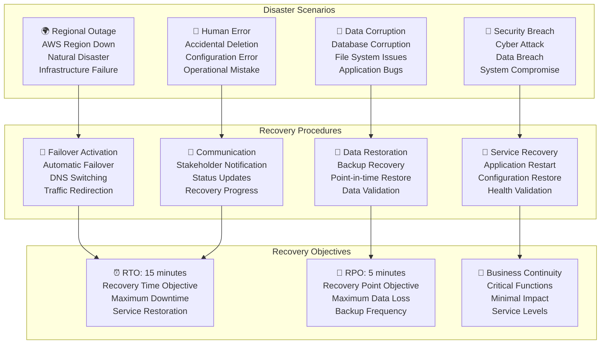
```mermaid
graph TB
    subgraph "Disaster Scenarios"
        REGIONAL_OUTAGE[🌍 Regional Outage<br/>AWS Region Down<br/>Natural Disaster<br/>Infrastructure Failure]
        DATA_CORRUPTION[💾 Data Corruption<br/>Database Corruption<br/>File System Issues<br/>Application Bugs]
        SECURITY_BREACH[🔐 Security Breach<br/>Cyber Attack<br/>Data Breach<br/>System Compromise]
        HUMAN_ERROR[👤 Human Error<br/>Accidental Deletion<br/>Configuration Error<br/>Operational Mistake]
    end
    
    subgraph "Recovery Procedures"
        FAILOVER_ACTIVATION[🔄 Failover Activation<br/>Automatic Failover<br/>DNS Switching<br/>Traffic Redirection]
        DATA_RESTORATION[💾 Data Restoration<br/>Backup Recovery<br/>Point-in-time Restore<br/>Data Validation]
        SERVICE_RECOVERY[🚀 Service Recovery<br/>Application Restart<br/>Configuration Restore<br/>Health Validation]
        COMMUNICATION[📢 Communication<br/>Stakeholder Notification<br/>Status Updates<br/>Recovery Progress]
    end
    
    subgraph "Recovery Objectives"
        RTO_TARGET[⏰ RTO: 15 minutes<br/>Recovery Time Objective<br/>Maximum Downtime<br/>Service Restoration]
        RPO_TARGET[💾 RPO: 5 minutes<br/>Recovery Point Objective<br/>Maximum Data Loss<br/>Backup Frequency]
        BUSINESS_CONTINUITY[💼 Business Continuity<br/>Critical Functions<br/>Minimal Impact<br/>Service Levels]
    end
    
    REGIONAL_OUTAGE --> FAILOVER_ACTIVATION
    DATA_CORRUPTION --> DATA_RESTORATION
    SECURITY_BREACH --> SERVICE_RECOVERY
    HUMAN_ERROR --> COMMUNICATION
    
    FAILOVER_ACTIVATION --> RTO_TARGET
    DATA_RESTORATION --> RPO_TARGET
    SERVICE_RECOVERY --> BUSINESS_CONTINUITY
    COMMUNICATION --> RTO_TARGET
```

## Security Operations

### Security Monitoring

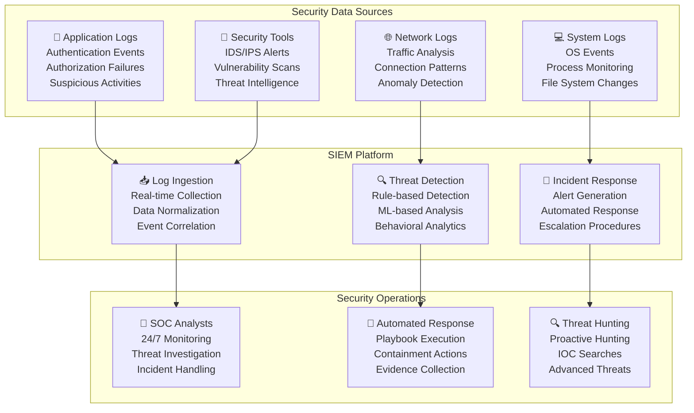
```mermaid
graph TB
    subgraph "Security Data Sources"
        APPLICATION_LOGS[📝 Application Logs<br/>Authentication Events<br/>Authorization Failures<br/>Suspicious Activities]
        NETWORK_LOGS[🌐 Network Logs<br/>Traffic Analysis<br/>Connection Patterns<br/>Anomaly Detection]
        SYSTEM_LOGS[💻 System Logs<br/>OS Events<br/>Process Monitoring<br/>File System Changes]
        SECURITY_TOOLS[🔐 Security Tools<br/>IDS/IPS Alerts<br/>Vulnerability Scans<br/>Threat Intelligence]
    end
    
    subgraph "SIEM Platform"
        LOG_INGESTION[📥 Log Ingestion<br/>Real-time Collection<br/>Data Normalization<br/>Event Correlation]
        THREAT_DETECTION[🔍 Threat Detection<br/>Rule-based Detection<br/>ML-based Analysis<br/>Behavioral Analytics]
        INCIDENT_RESPONSE[🚨 Incident Response<br/>Alert Generation<br/>Automated Response<br/>Escalation Procedures]
    end
    
    subgraph "Security Operations"
        SOC_ANALYSTS[👥 SOC Analysts<br/>24/7 Monitoring<br/>Threat Investigation<br/>Incident Handling]
        AUTOMATED_RESPONSE[🤖 Automated Response<br/>Playbook Execution<br/>Containment Actions<br/>Evidence Collection]
        THREAT_HUNTING[🔍 Threat Hunting<br/>Proactive Hunting<br/>IOC Searches<br/>Advanced Threats]
    end
    
    APPLICATION_LOGS --> LOG_INGESTION
    NETWORK_LOGS --> THREAT_DETECTION
    SYSTEM_LOGS --> INCIDENT_RESPONSE
    SECURITY_TOOLS --> LOG_INGESTION
    
    LOG_INGESTION --> SOC_ANALYSTS
    THREAT_DETECTION --> AUTOMATED_RESPONSE
    INCIDENT_RESPONSE --> THREAT_HUNTING
```

### Compliance Monitoring

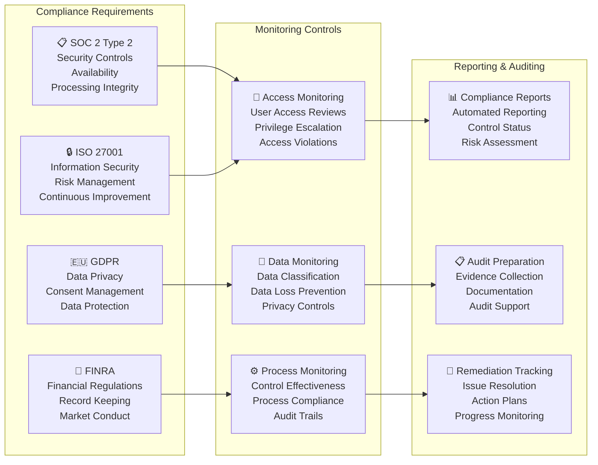
```mermaid
graph LR
    subgraph "Compliance Requirements"
        SOC2_COMPLIANCE[📋 SOC 2 Type 2<br/>Security Controls<br/>Availability<br/>Processing Integrity]
        GDPR_COMPLIANCE[🇪🇺 GDPR<br/>Data Privacy<br/>Consent Management<br/>Data Protection]
        FINRA_COMPLIANCE[🏦 FINRA<br/>Financial Regulations<br/>Record Keeping<br/>Market Conduct]
        ISO27001_COMPLIANCE[🔒 ISO 27001<br/>Information Security<br/>Risk Management<br/>Continuous Improvement]
    end
    
    subgraph "Monitoring Controls"
        ACCESS_MONITORING[🔑 Access Monitoring<br/>User Access Reviews<br/>Privilege Escalation<br/>Access Violations]
        DATA_MONITORING[💾 Data Monitoring<br/>Data Classification<br/>Data Loss Prevention<br/>Privacy Controls]
        PROCESS_MONITORING[⚙️ Process Monitoring<br/>Control Effectiveness<br/>Process Compliance<br/>Audit Trails]
    end
    
    subgraph "Reporting & Auditing"
        COMPLIANCE_REPORTS[📊 Compliance Reports<br/>Automated Reporting<br/>Control Status<br/>Risk Assessment]
        AUDIT_PREPARATION[📋 Audit Preparation<br/>Evidence Collection<br/>Documentation<br/>Audit Support]
        REMEDIATION_TRACKING[🔧 Remediation Tracking<br/>Issue Resolution<br/>Action Plans<br/>Progress Monitoring]
    end
    
    SOC2_COMPLIANCE --> ACCESS_MONITORING
    GDPR_COMPLIANCE --> DATA_MONITORING
    FINRA_COMPLIANCE --> PROCESS_MONITORING
    ISO27001_COMPLIANCE --> ACCESS_MONITORING
    
    ACCESS_MONITORING --> COMPLIANCE_REPORTS
    DATA_MONITORING --> AUDIT_PREPARATION
    PROCESS_MONITORING --> REMEDIATION_TRACKING
```

## Operational Procedures

### Deployment Checklist

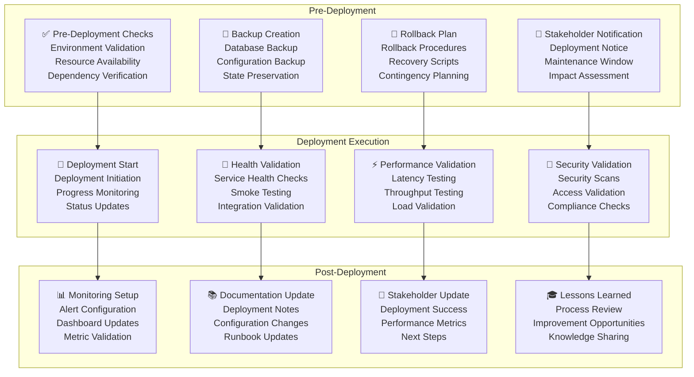
```mermaid
graph TB
    subgraph "Pre-Deployment"
        PRE_CHECKS[✅ Pre-Deployment Checks<br/>Environment Validation<br/>Resource Availability<br/>Dependency Verification]
        BACKUP_CREATION[💾 Backup Creation<br/>Database Backup<br/>Configuration Backup<br/>State Preservation]
        ROLLBACK_PLAN[🔄 Rollback Plan<br/>Rollback Procedures<br/>Recovery Scripts<br/>Contingency Planning]
        STAKEHOLDER_NOTIFICATION[📢 Stakeholder Notification<br/>Deployment Notice<br/>Maintenance Window<br/>Impact Assessment]
    end
    
    subgraph "Deployment Execution"
        DEPLOYMENT_START[🚀 Deployment Start<br/>Deployment Initiation<br/>Progress Monitoring<br/>Status Updates]
        HEALTH_VALIDATION[🏥 Health Validation<br/>Service Health Checks<br/>Smoke Testing<br/>Integration Validation]
        PERFORMANCE_VALIDATION[⚡ Performance Validation<br/>Latency Testing<br/>Throughput Testing<br/>Load Validation]
        SECURITY_VALIDATION[🔐 Security Validation<br/>Security Scans<br/>Access Validation<br/>Compliance Checks]
    end
    
    subgraph "Post-Deployment"
        MONITORING_SETUP[📊 Monitoring Setup<br/>Alert Configuration<br/>Dashboard Updates<br/>Metric Validation]
        DOCUMENTATION_UPDATE[📚 Documentation Update<br/>Deployment Notes<br/>Configuration Changes<br/>Runbook Updates]
        STAKEHOLDER_UPDATE[📢 Stakeholder Update<br/>Deployment Success<br/>Performance Metrics<br/>Next Steps]
        LESSONS_LEARNED[🎓 Lessons Learned<br/>Process Review<br/>Improvement Opportunities<br/>Knowledge Sharing]
    end
    
    PRE_CHECKS --> DEPLOYMENT_START
    BACKUP_CREATION --> HEALTH_VALIDATION
    ROLLBACK_PLAN --> PERFORMANCE_VALIDATION
    STAKEHOLDER_NOTIFICATION --> SECURITY_VALIDATION
    
    DEPLOYMENT_START --> MONITORING_SETUP
    HEALTH_VALIDATION --> DOCUMENTATION_UPDATE
    PERFORMANCE_VALIDATION --> STAKEHOLDER_UPDATE
    SECURITY_VALIDATION --> LESSONS_LEARNED
```

### Incident Response Procedures

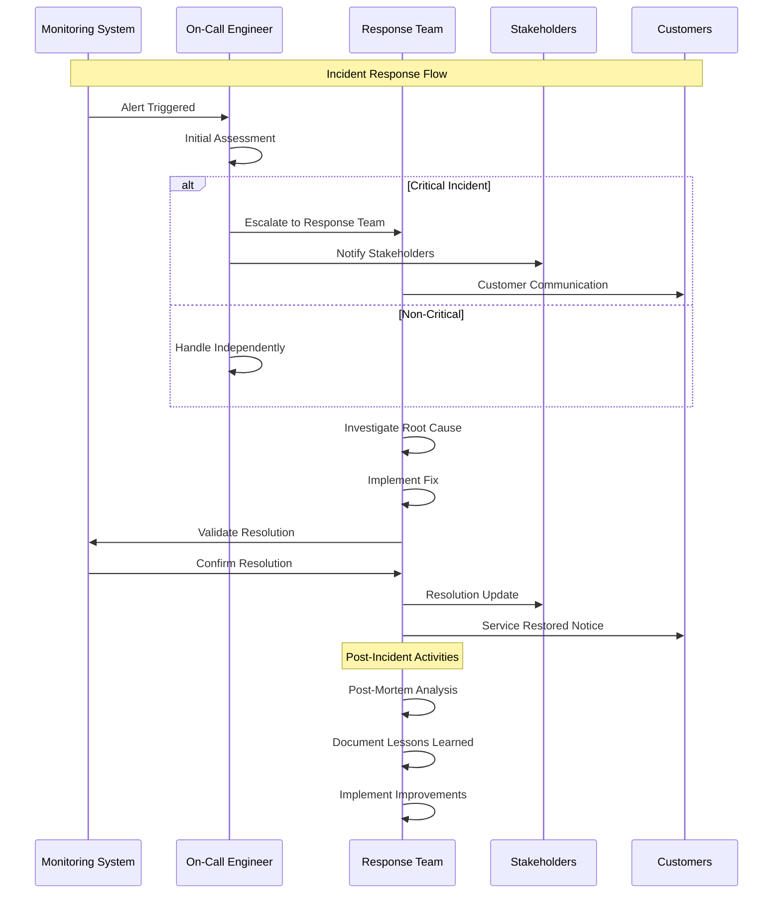
```mermaid
sequenceDiagram
    participant Monitor as Monitoring System
    participant OnCall as On-Call Engineer
    participant Team as Response Team
    participant Stakeholders as Stakeholders
    participant Customer as Customers
    
    Note over Monitor, Customer: Incident Response Flow
    
    Monitor->>OnCall: Alert Triggered
    OnCall->>OnCall: Initial Assessment
    
    alt Critical Incident
        OnCall->>Team: Escalate to Response Team
        OnCall->>Stakeholders: Notify Stakeholders
        Team->>Customer: Customer Communication
    else Non-Critical
        OnCall->>OnCall: Handle Independently
    end
    
    Team->>Team: Investigate Root Cause
    Team->>Team: Implement Fix
    Team->>Monitor: Validate Resolution
    
    Monitor->>Team: Confirm Resolution
    Team->>Stakeholders: Resolution Update
    Team->>Customer: Service Restored Notice
    
    Note over Team: Post-Incident Activities
    Team->>Team: Post-Mortem Analysis
    Team->>Team: Document Lessons Learned
    Team->>Team: Implement Improvements
```

---

**Document Classification**: Operations Documentation  
**Next Review Date**: 27 April 2025  
**Document Owner**: DevOps Team  
**Approval**: Chief Technology Officer, Operations Committee