# Implementation Guide

**Document Version**: 1.0.0  
**Last Updated**: 01 November 2025  
**Classification**: Implementation Documentation  
**Owner**: Implementation Team

## Executive Summary

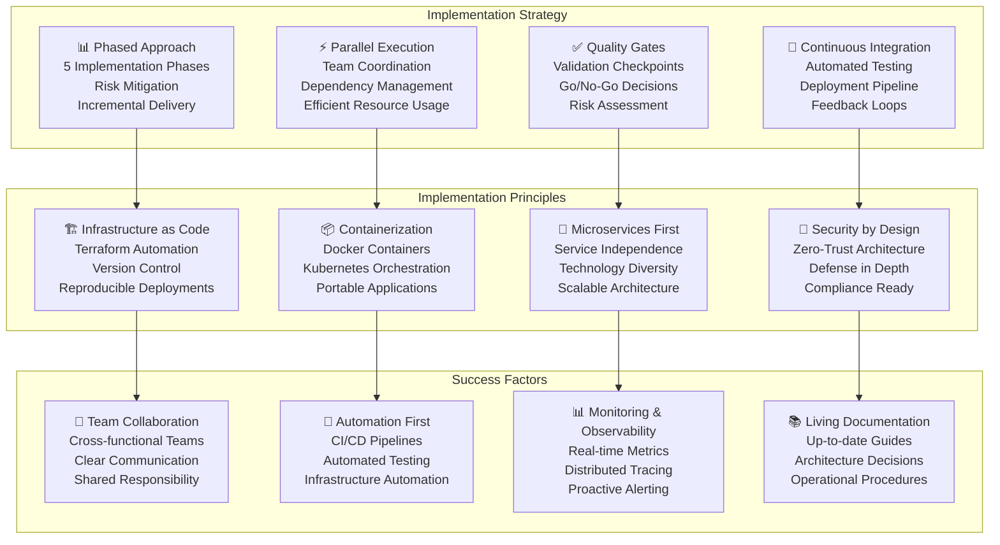
```mermaid
graph TB
    subgraph "Implementation Strategy"
        PHASED_APPROACH[📊 Phased Approach<br/>5 Implementation Phases<br/>Risk Mitigation<br/>Incremental Delivery]
        PARALLEL_EXECUTION[⚡ Parallel Execution<br/>Team Coordination<br/>Dependency Management<br/>Efficient Resource Usage]
        QUALITY_GATES[✅ Quality Gates<br/>Validation Checkpoints<br/>Go/No-Go Decisions<br/>Risk Assessment]
        CONTINUOUS_INTEGRATION[🔄 Continuous Integration<br/>Automated Testing<br/>Deployment Pipeline<br/>Feedback Loops]
    end
    
    subgraph "Implementation Principles"
        INFRASTRUCTURE_AS_CODE[🏗️ Infrastructure as Code<br/>Terraform Automation<br/>Version Control<br/>Reproducible Deployments]
        CONTAINERIZATION[📦 Containerization<br/>Docker Containers<br/>Kubernetes Orchestration<br/>Portable Applications]
        MICROSERVICES_FIRST[🔧 Microservices First<br/>Service Independence<br/>Technology Diversity<br/>Scalable Architecture]
        SECURITY_BY_DESIGN[🔐 Security by Design<br/>Zero-Trust Architecture<br/>Defense in Depth<br/>Compliance Ready]
    end
    
    subgraph "Success Factors"
        TEAM_COLLABORATION[👥 Team Collaboration<br/>Cross-functional Teams<br/>Clear Communication<br/>Shared Responsibility]
        AUTOMATION_FIRST[🤖 Automation First<br/>CI/CD Pipelines<br/>Automated Testing<br/>Infrastructure Automation]
        MONITORING_OBSERVABILITY[📊 Monitoring & Observability<br/>Real-time Metrics<br/>Distributed Tracing<br/>Proactive Alerting]
        DOCUMENTATION[📚 Living Documentation<br/>Up-to-date Guides<br/>Architecture Decisions<br/>Operational Procedures]
    end
    
    PHASED_APPROACH --> INFRASTRUCTURE_AS_CODE
    PARALLEL_EXECUTION --> CONTAINERIZATION
    QUALITY_GATES --> MICROSERVICES_FIRST
    CONTINUOUS_INTEGRATION --> SECURITY_BY_DESIGN
    
    INFRASTRUCTURE_AS_CODE --> TEAM_COLLABORATION
    CONTAINERIZATION --> AUTOMATION_FIRST
    MICROSERVICES_FIRST --> MONITORING_OBSERVABILITY
    SECURITY_BY_DESIGN --> DOCUMENTATION
```

This comprehensive implementation guide provides detailed instructions for deploying, configuring, and operating the Algorithmic Trading System (ATS). The guide covers all aspects from initial setup to production deployment and ongoing maintenance.

## Prerequisites & Environment Setup

### Development Environment Requirements

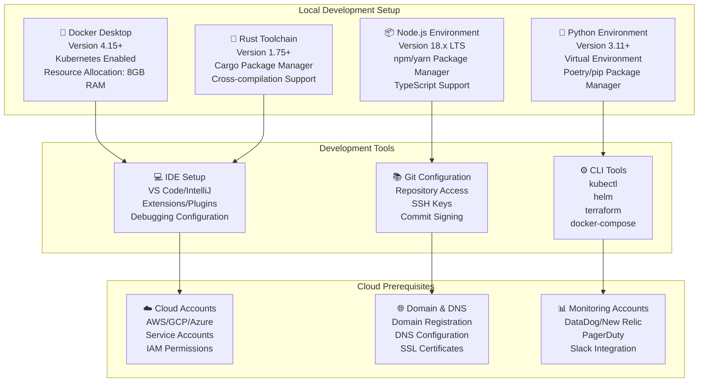
```mermaid
graph TB
    subgraph "Local Development Setup"
        DOCKER_DESKTOP[🐳 Docker Desktop<br/>Version 4.15+<br/>Kubernetes Enabled<br/>Resource Allocation: 8GB RAM]
        NODE_ENVIRONMENT[📦 Node.js Environment<br/>Version 18.x LTS<br/>npm/yarn Package Manager<br/>TypeScript Support]
        PYTHON_ENVIRONMENT[🐍 Python Environment<br/>Version 3.11+<br/>Virtual Environment<br/>Poetry/pip Package Manager]
        RUST_TOOLCHAIN[🦀 Rust Toolchain<br/>Version 1.75+<br/>Cargo Package Manager<br/>Cross-compilation Support]
    end
    
    subgraph "Development Tools"
        IDE_SETUP[💻 IDE Setup<br/>VS Code/IntelliJ<br/>Extensions/Plugins<br/>Debugging Configuration]
        GIT_CONFIGURATION[📚 Git Configuration<br/>Repository Access<br/>SSH Keys<br/>Commit Signing]
        CLI_TOOLS[⚙️ CLI Tools<br/>kubectl<br/>helm<br/>terraform<br/>docker-compose]
    end
    
    subgraph "Cloud Prerequisites"
        CLOUD_ACCOUNTS[☁️ Cloud Accounts<br/>AWS/GCP/Azure<br/>Service Accounts<br/>IAM Permissions]
        DOMAIN_DNS[🌐 Domain & DNS<br/>Domain Registration<br/>DNS Configuration<br/>SSL Certificates]
        MONITORING_ACCOUNTS[📊 Monitoring Accounts<br/>DataDog/New Relic<br/>PagerDuty<br/>Slack Integration]
    end
    
    DOCKER_DESKTOP --> IDE_SETUP
    NODE_ENVIRONMENT --> GIT_CONFIGURATION
    PYTHON_ENVIRONMENT --> CLI_TOOLS
    RUST_TOOLCHAIN --> IDE_SETUP
    
    IDE_SETUP --> CLOUD_ACCOUNTS
    GIT_CONFIGURATION --> DOMAIN_DNS
    CLI_TOOLS --> MONITORING_ACCOUNTS
```

### Infrastructure Prerequisites

```mermaid
graph LR
    subgraph "Kubernetes Cluster"
        CLUSTER_SETUP[☸️ Cluster Setup<br/>Multi-node Cluster<br/>High Availability<br/>Auto-scaling Enabled]
        NETWORKING[🌐 Networking<br/>CNI Plugin (Calico)<br/>Network Policies<br/>Ingress Controller]
        STORAGE[💾 Storage<br/>Persistent Volumes<br/>Storage Classes<br/>Backup Solutions]
    end
    
    subgraph "Security Infrastructure"
        IDENTITY_PROVIDER[🔑 Identity Provider<br/>Keycloak Setup<br/>LDAP Integration<br/>OAuth Configuration]
        SECRETS_MANAGEMENT[🔐 Secrets Management<br/>HashiCorp Vault<br/>Key Rotation<br/>Certificate Management]
        NETWORK_SECURITY[🛡️ Network Security<br/>Firewall Rules<br/>VPN Setup<br/>Security Groups]
    end
    
    subgraph "Monitoring Infrastructure"
        METRICS_COLLECTION[📊 Metrics Collection<br/>Prometheus<br/>Grafana<br/>Alert Manager]
        LOG_AGGREGATION[📝 Log Aggregation<br/>ELK Stack<br/>Fluentd<br/>Log Retention]
        TRACING_SYSTEM[🔍 Tracing System<br/>Jaeger<br/>OpenTelemetry<br/>Service Mesh]
    end
    
    CLUSTER_SETUP --> IDENTITY_PROVIDER
    NETWORKING --> SECRETS_MANAGEMENT
    STORAGE --> NETWORK_SECURITY
    
    IDENTITY_PROVIDER --> METRICS_COLLECTION
    SECRETS_MANAGEMENT --> LOG_AGGREGATION
    NETWORK_SECURITY --> TRACING_SYSTEM
```

## Phase 1: Foundation Infrastructure

### Infrastructure as Code Setup

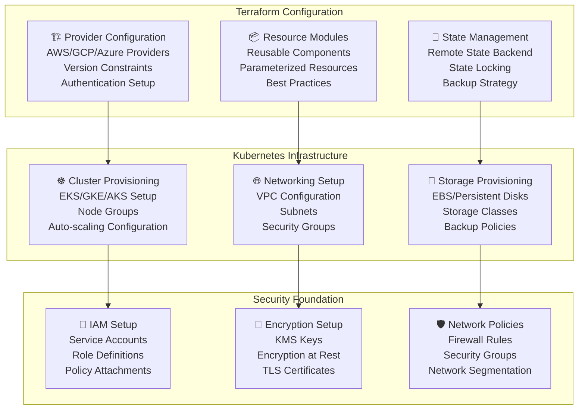
```mermaid
graph TB
    subgraph "Terraform Configuration"
        PROVIDER_CONFIG[🏗️ Provider Configuration<br/>AWS/GCP/Azure Providers<br/>Version Constraints<br/>Authentication Setup]
        RESOURCE_MODULES[📦 Resource Modules<br/>Reusable Components<br/>Parameterized Resources<br/>Best Practices]
        STATE_MANAGEMENT[💾 State Management<br/>Remote State Backend<br/>State Locking<br/>Backup Strategy]
    end
    
    subgraph "Kubernetes Infrastructure"
        CLUSTER_PROVISIONING[☸️ Cluster Provisioning<br/>EKS/GKE/AKS Setup<br/>Node Groups<br/>Auto-scaling Configuration]
        NETWORKING_SETUP[🌐 Networking Setup<br/>VPC Configuration<br/>Subnets<br/>Security Groups]
        STORAGE_PROVISIONING[💾 Storage Provisioning<br/>EBS/Persistent Disks<br/>Storage Classes<br/>Backup Policies]
    end
    
    subgraph "Security Foundation"
        IAM_SETUP[🔑 IAM Setup<br/>Service Accounts<br/>Role Definitions<br/>Policy Attachments]
        ENCRYPTION_SETUP[🔐 Encryption Setup<br/>KMS Keys<br/>Encryption at Rest<br/>TLS Certificates]
        NETWORK_POLICIES[🛡️ Network Policies<br/>Firewall Rules<br/>Security Groups<br/>Network Segmentation]
    end
    
    PROVIDER_CONFIG --> CLUSTER_PROVISIONING
    RESOURCE_MODULES --> NETWORKING_SETUP
    STATE_MANAGEMENT --> STORAGE_PROVISIONING
    
    CLUSTER_PROVISIONING --> IAM_SETUP
    NETWORKING_SETUP --> ENCRYPTION_SETUP
    STORAGE_PROVISIONING --> NETWORK_POLICIES
```

### Kubernetes Cluster Setup

```bash
# Terraform Infrastructure Deployment
terraform init
terraform plan -var-file="environments/production.tfvars"
terraform apply -var-file="environments/production.tfvars"

# Kubernetes Configuration
kubectl config use-context ats-production
kubectl create namespace ats-system
kubectl create namespace ats-trading
kubectl create namespace ats-monitoring

# Install Essential Components
helm repo add istio https://istio-release.storage.googleapis.com/charts
helm repo add prometheus-community https://prometheus-community.github.io/helm-charts
helm repo add grafana https://grafana.github.io/helm-charts

# Install Istio Service Mesh
helm install istio-base istio/base -n istio-system --create-namespace
helm install istiod istio/istiod -n istio-system
helm install istio-gateway istio/gateway -n istio-system

# Install Monitoring Stack
helm install prometheus prometheus-community/kube-prometheus-stack -n ats-monitoring
helm install grafana grafana/grafana -n ats-monitoring
```

### Database Infrastructure Setup

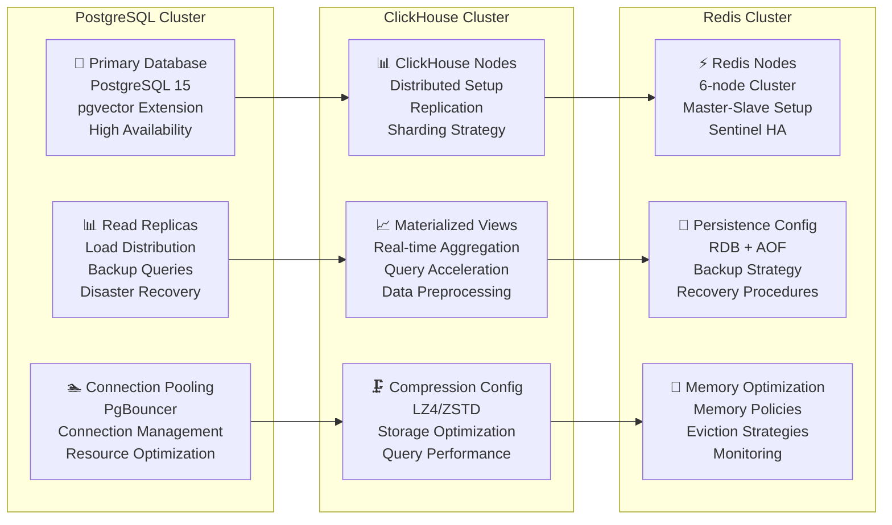
```mermaid
graph LR
    subgraph "PostgreSQL Cluster"
        PRIMARY_DB[🐘 Primary Database<br/>PostgreSQL 15<br/>pgvector Extension<br/>High Availability]
        REPLICA_DB[📊 Read Replicas<br/>Load Distribution<br/>Backup Queries<br/>Disaster Recovery]
        CONNECTION_POOL[🏊 Connection Pooling<br/>PgBouncer<br/>Connection Management<br/>Resource Optimization]
    end
    
    subgraph "ClickHouse Cluster"
        CLICKHOUSE_NODES[📊 ClickHouse Nodes<br/>Distributed Setup<br/>Replication<br/>Sharding Strategy]
        MATERIALIZED_VIEWS[📈 Materialized Views<br/>Real-time Aggregation<br/>Query Acceleration<br/>Data Preprocessing]
        COMPRESSION_CONFIG[🗜️ Compression Config<br/>LZ4/ZSTD<br/>Storage Optimization<br/>Query Performance]
    end
    
    subgraph "Redis Cluster"
        REDIS_NODES[⚡ Redis Nodes<br/>6-node Cluster<br/>Master-Slave Setup<br/>Sentinel HA]
        PERSISTENCE_CONFIG[💾 Persistence Config<br/>RDB + AOF<br/>Backup Strategy<br/>Recovery Procedures]
        MEMORY_OPTIMIZATION[🧠 Memory Optimization<br/>Memory Policies<br/>Eviction Strategies<br/>Monitoring]
    end
    
    PRIMARY_DB --> CLICKHOUSE_NODES
    REPLICA_DB --> MATERIALIZED_VIEWS
    CONNECTION_POOL --> COMPRESSION_CONFIG
    
    CLICKHOUSE_NODES --> REDIS_NODES
    MATERIALIZED_VIEWS --> PERSISTENCE_CONFIG
    COMPRESSION_CONFIG --> MEMORY_OPTIMIZATION
```

## Phase 2: Core Services Implementation

### Trading Engine Service

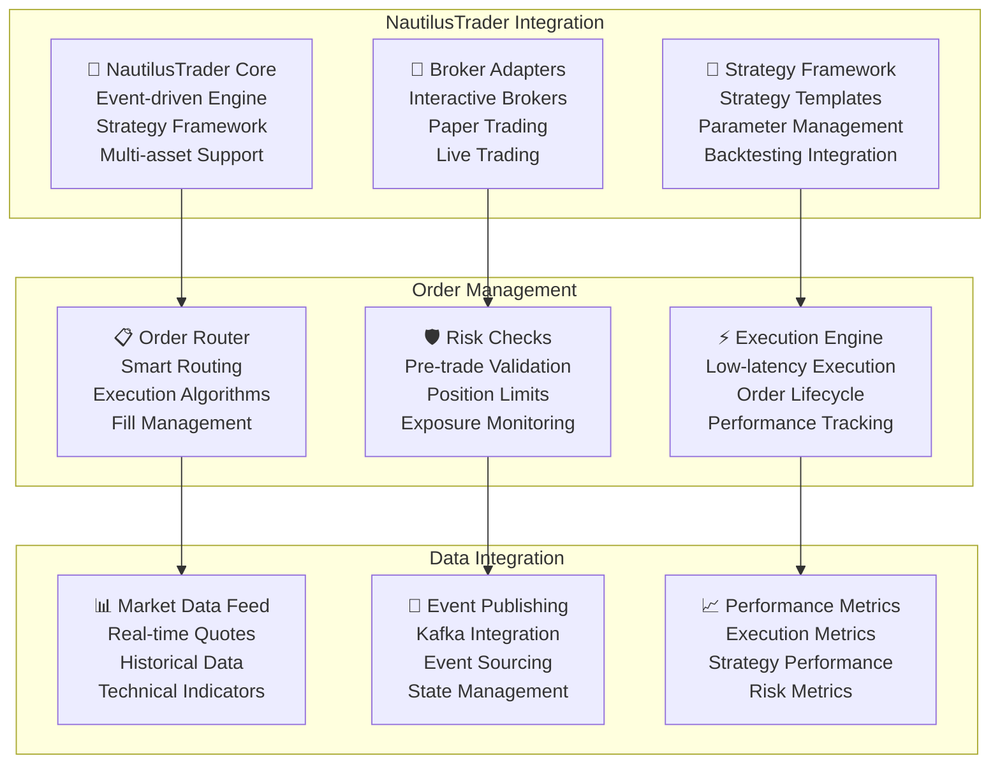
```mermaid
graph TB
    subgraph "NautilusTrader Integration"
        CORE_ENGINE[🚢 NautilusTrader Core<br/>Event-driven Engine<br/>Strategy Framework<br/>Multi-asset Support]
        ADAPTERS[🔌 Broker Adapters<br/>Interactive Brokers<br/>Paper Trading<br/>Live Trading]
        STRATEGY_FRAMEWORK[🎯 Strategy Framework<br/>Strategy Templates<br/>Parameter Management<br/>Backtesting Integration]
    end
    
    subgraph "Order Management"
        ORDER_ROUTER[📋 Order Router<br/>Smart Routing<br/>Execution Algorithms<br/>Fill Management]
        RISK_CHECKS[🛡️ Risk Checks<br/>Pre-trade Validation<br/>Position Limits<br/>Exposure Monitoring]
        EXECUTION_ENGINE[⚡ Execution Engine<br/>Low-latency Execution<br/>Order Lifecycle<br/>Performance Tracking]
    end
    
    subgraph "Data Integration"
        MARKET_DATA_FEED[📊 Market Data Feed<br/>Real-time Quotes<br/>Historical Data<br/>Technical Indicators]
        EVENT_PUBLISHING[📡 Event Publishing<br/>Kafka Integration<br/>Event Sourcing<br/>State Management]
        PERFORMANCE_METRICS[📈 Performance Metrics<br/>Execution Metrics<br/>Strategy Performance<br/>Risk Metrics]
    end
    
    CORE_ENGINE --> ORDER_ROUTER
    ADAPTERS --> RISK_CHECKS
    STRATEGY_FRAMEWORK --> EXECUTION_ENGINE
    
    ORDER_ROUTER --> MARKET_DATA_FEED
    RISK_CHECKS --> EVENT_PUBLISHING
    EXECUTION_ENGINE --> PERFORMANCE_METRICS
```

### AI Assistant Service

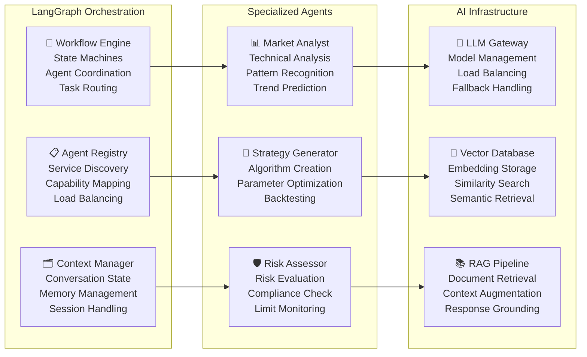
```mermaid
graph LR
    subgraph "LangGraph Orchestration"
        WORKFLOW_ENGINE[🧠 Workflow Engine<br/>State Machines<br/>Agent Coordination<br/>Task Routing]
        AGENT_REGISTRY[📋 Agent Registry<br/>Service Discovery<br/>Capability Mapping<br/>Load Balancing]
        CONTEXT_MANAGER[🗂️ Context Manager<br/>Conversation State<br/>Memory Management<br/>Session Handling]
    end
    
    subgraph "Specialized Agents"
        MARKET_ANALYST[📊 Market Analyst<br/>Technical Analysis<br/>Pattern Recognition<br/>Trend Prediction]
        STRATEGY_GENERATOR[🎯 Strategy Generator<br/>Algorithm Creation<br/>Parameter Optimization<br/>Backtesting]
        RISK_ASSESSOR[🛡️ Risk Assessor<br/>Risk Evaluation<br/>Compliance Check<br/>Limit Monitoring]
    end
    
    subgraph "AI Infrastructure"
        LLM_GATEWAY[🚪 LLM Gateway<br/>Model Management<br/>Load Balancing<br/>Fallback Handling]
        VECTOR_DATABASE[🧠 Vector Database<br/>Embedding Storage<br/>Similarity Search<br/>Semantic Retrieval]
        RAG_PIPELINE[📚 RAG Pipeline<br/>Document Retrieval<br/>Context Augmentation<br/>Response Grounding]
    end
    
    WORKFLOW_ENGINE --> MARKET_ANALYST
    AGENT_REGISTRY --> STRATEGY_GENERATOR
    CONTEXT_MANAGER --> RISK_ASSESSOR
    
    MARKET_ANALYST --> LLM_GATEWAY
    STRATEGY_GENERATOR --> VECTOR_DATABASE
    RISK_ASSESSOR --> RAG_PIPELINE
```

### Market Data Service

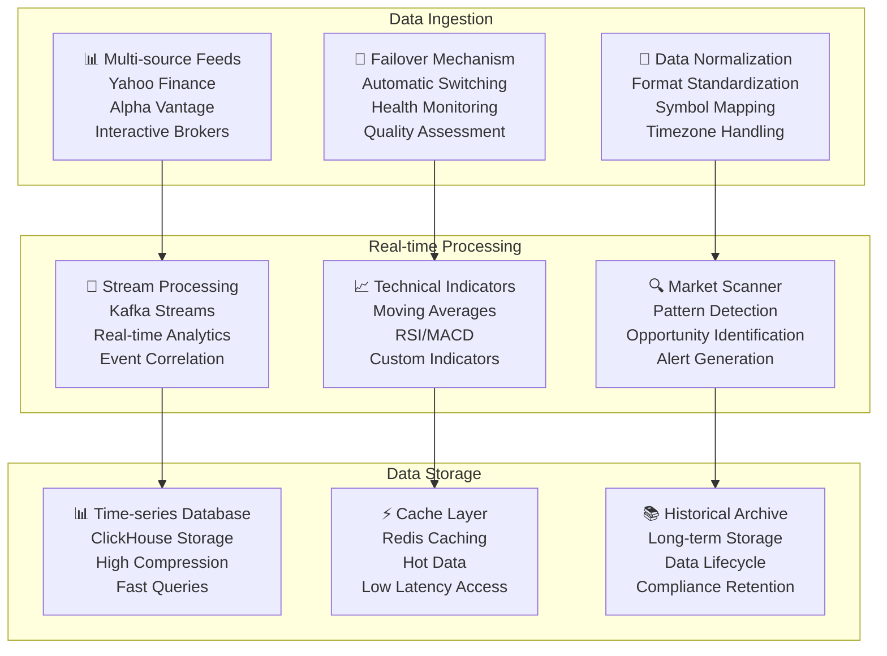
```mermaid
graph TB
    subgraph "Data Ingestion"
        MULTI_SOURCE_FEEDS[📊 Multi-source Feeds<br/>Yahoo Finance<br/>Alpha Vantage<br/>Interactive Brokers]
        FAILOVER_MECHANISM[🔄 Failover Mechanism<br/>Automatic Switching<br/>Health Monitoring<br/>Quality Assessment]
        DATA_NORMALIZATION[🔧 Data Normalization<br/>Format Standardization<br/>Symbol Mapping<br/>Timezone Handling]
    end
    
    subgraph "Real-time Processing"
        STREAM_PROCESSING[🌊 Stream Processing<br/>Kafka Streams<br/>Real-time Analytics<br/>Event Correlation]
        TECHNICAL_INDICATORS[📈 Technical Indicators<br/>Moving Averages<br/>RSI/MACD<br/>Custom Indicators]
        MARKET_SCANNER[🔍 Market Scanner<br/>Pattern Detection<br/>Opportunity Identification<br/>Alert Generation]
    end
    
    subgraph "Data Storage"
        TIME_SERIES_DB[📊 Time-series Database<br/>ClickHouse Storage<br/>High Compression<br/>Fast Queries]
        CACHE_LAYER[⚡ Cache Layer<br/>Redis Caching<br/>Hot Data<br/>Low Latency Access]
        HISTORICAL_ARCHIVE[📚 Historical Archive<br/>Long-term Storage<br/>Data Lifecycle<br/>Compliance Retention]
    end
    
    MULTI_SOURCE_FEEDS --> STREAM_PROCESSING
    FAILOVER_MECHANISM --> TECHNICAL_INDICATORS
    DATA_NORMALIZATION --> MARKET_SCANNER
    
    STREAM_PROCESSING --> TIME_SERIES_DB
    TECHNICAL_INDICATORS --> CACHE_LAYER
    MARKET_SCANNER --> HISTORICAL_ARCHIVE
```

## Phase 3: Advanced Features Implementation

### Risk Management Service

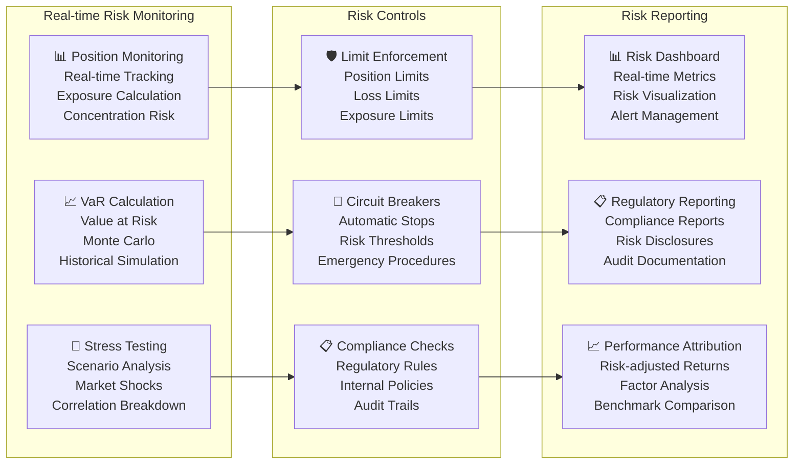
```mermaid
graph LR
    subgraph "Real-time Risk Monitoring"
        POSITION_MONITORING[📊 Position Monitoring<br/>Real-time Tracking<br/>Exposure Calculation<br/>Concentration Risk]
        VAR_CALCULATION[📈 VaR Calculation<br/>Value at Risk<br/>Monte Carlo<br/>Historical Simulation]
        STRESS_TESTING[💪 Stress Testing<br/>Scenario Analysis<br/>Market Shocks<br/>Correlation Breakdown]
    end
    
    subgraph "Risk Controls"
        LIMIT_ENFORCEMENT[🛡️ Limit Enforcement<br/>Position Limits<br/>Loss Limits<br/>Exposure Limits]
        CIRCUIT_BREAKERS[🚨 Circuit Breakers<br/>Automatic Stops<br/>Risk Thresholds<br/>Emergency Procedures]
        COMPLIANCE_CHECKS[📋 Compliance Checks<br/>Regulatory Rules<br/>Internal Policies<br/>Audit Trails]
    end
    
    subgraph "Risk Reporting"
        RISK_DASHBOARD[📊 Risk Dashboard<br/>Real-time Metrics<br/>Risk Visualization<br/>Alert Management]
        REGULATORY_REPORTING[📋 Regulatory Reporting<br/>Compliance Reports<br/>Risk Disclosures<br/>Audit Documentation]
        PERFORMANCE_ATTRIBUTION[📈 Performance Attribution<br/>Risk-adjusted Returns<br/>Factor Analysis<br/>Benchmark Comparison]
    end
    
    POSITION_MONITORING --> LIMIT_ENFORCEMENT
    VAR_CALCULATION --> CIRCUIT_BREAKERS
    STRESS_TESTING --> COMPLIANCE_CHECKS
    
    LIMIT_ENFORCEMENT --> RISK_DASHBOARD
    CIRCUIT_BREAKERS --> REGULATORY_REPORTING
    COMPLIANCE_CHECKS --> PERFORMANCE_ATTRIBUTION
```

### Portfolio Management Service

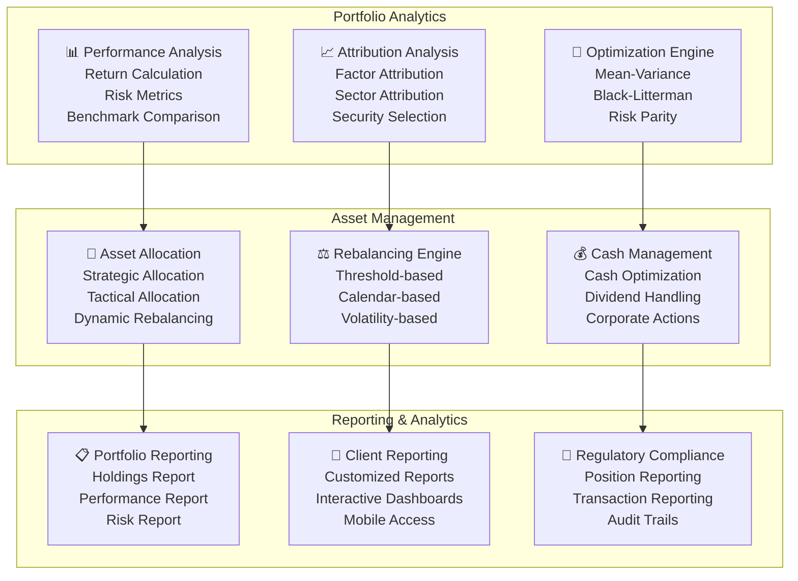
```mermaid
graph TB
    subgraph "Portfolio Analytics"
        PERFORMANCE_ANALYSIS[📊 Performance Analysis<br/>Return Calculation<br/>Risk Metrics<br/>Benchmark Comparison]
        ATTRIBUTION_ANALYSIS[📈 Attribution Analysis<br/>Factor Attribution<br/>Sector Attribution<br/>Security Selection]
        OPTIMIZATION_ENGINE[🎯 Optimization Engine<br/>Mean-Variance<br/>Black-Litterman<br/>Risk Parity]
    end
    
    subgraph "Asset Management"
        ASSET_ALLOCATION[💼 Asset Allocation<br/>Strategic Allocation<br/>Tactical Allocation<br/>Dynamic Rebalancing]
        REBALANCING_ENGINE[⚖️ Rebalancing Engine<br/>Threshold-based<br/>Calendar-based<br/>Volatility-based]
        CASH_MANAGEMENT[💰 Cash Management<br/>Cash Optimization<br/>Dividend Handling<br/>Corporate Actions]
    end
    
    subgraph "Reporting & Analytics"
        PORTFOLIO_REPORTING[📋 Portfolio Reporting<br/>Holdings Report<br/>Performance Report<br/>Risk Report]
        CLIENT_REPORTING[👤 Client Reporting<br/>Customized Reports<br/>Interactive Dashboards<br/>Mobile Access]
        REGULATORY_COMPLIANCE[📜 Regulatory Compliance<br/>Position Reporting<br/>Transaction Reporting<br/>Audit Trails]
    end
    
    PERFORMANCE_ANALYSIS --> ASSET_ALLOCATION
    ATTRIBUTION_ANALYSIS --> REBALANCING_ENGINE
    OPTIMIZATION_ENGINE --> CASH_MANAGEMENT
    
    ASSET_ALLOCATION --> PORTFOLIO_REPORTING
    REBALANCING_ENGINE --> CLIENT_REPORTING
    CASH_MANAGEMENT --> REGULATORY_COMPLIANCE
```

## Phase 4: Frontend Implementation

### Web Application Architecture

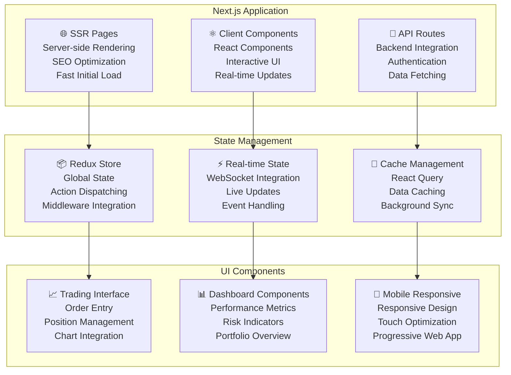
```mermaid
graph TB
    subgraph "Next.js Application"
        SSR_PAGES[🌐 SSR Pages<br/>Server-side Rendering<br/>SEO Optimization<br/>Fast Initial Load]
        CLIENT_COMPONENTS[⚛️ Client Components<br/>React Components<br/>Interactive UI<br/>Real-time Updates]
        API_ROUTES[🔗 API Routes<br/>Backend Integration<br/>Authentication<br/>Data Fetching]
    end
    
    subgraph "State Management"
        REDUX_STORE[📦 Redux Store<br/>Global State<br/>Action Dispatching<br/>Middleware Integration]
        REAL_TIME_STATE[⚡ Real-time State<br/>WebSocket Integration<br/>Live Updates<br/>Event Handling]
        CACHE_MANAGEMENT[💾 Cache Management<br/>React Query<br/>Data Caching<br/>Background Sync]
    end
    
    subgraph "UI Components"
        TRADING_INTERFACE[📈 Trading Interface<br/>Order Entry<br/>Position Management<br/>Chart Integration]
        DASHBOARD_COMPONENTS[📊 Dashboard Components<br/>Performance Metrics<br/>Risk Indicators<br/>Portfolio Overview]
        MOBILE_RESPONSIVE[📱 Mobile Responsive<br/>Responsive Design<br/>Touch Optimization<br/>Progressive Web App]
    end
    
    SSR_PAGES --> REDUX_STORE
    CLIENT_COMPONENTS --> REAL_TIME_STATE
    API_ROUTES --> CACHE_MANAGEMENT
    
    REDUX_STORE --> TRADING_INTERFACE
    REAL_TIME_STATE --> DASHBOARD_COMPONENTS
    CACHE_MANAGEMENT --> MOBILE_RESPONSIVE
```

### Real-time Data Integration

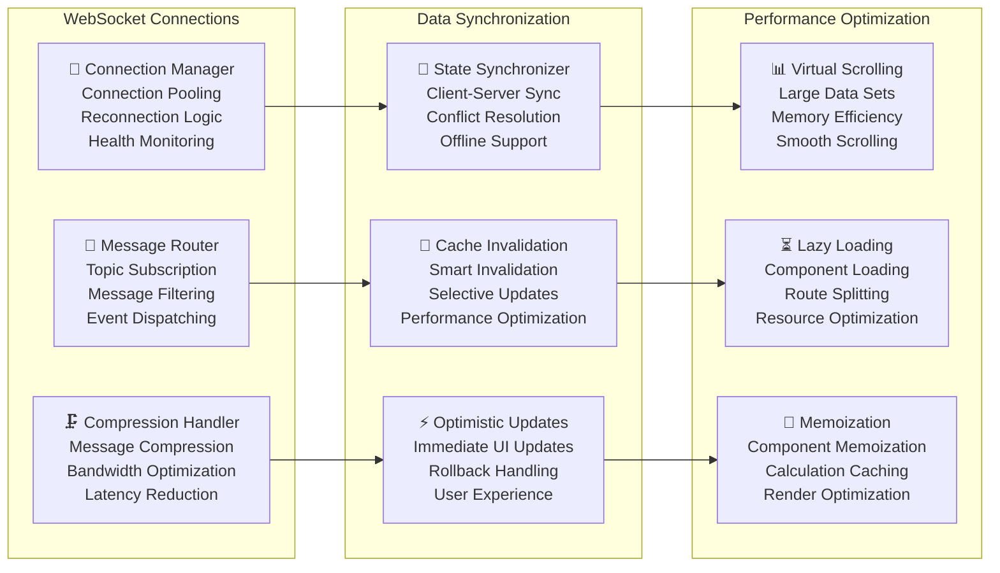
```mermaid
graph LR
    subgraph "WebSocket Connections"
        CONNECTION_MANAGER[🔌 Connection Manager<br/>Connection Pooling<br/>Reconnection Logic<br/>Health Monitoring]
        MESSAGE_ROUTER[📡 Message Router<br/>Topic Subscription<br/>Message Filtering<br/>Event Dispatching]
        COMPRESSION_HANDLER[🗜️ Compression Handler<br/>Message Compression<br/>Bandwidth Optimization<br/>Latency Reduction]
    end
    
    subgraph "Data Synchronization"
        STATE_SYNCHRONIZER[🔄 State Synchronizer<br/>Client-Server Sync<br/>Conflict Resolution<br/>Offline Support]
        CACHE_INVALIDATION[🔄 Cache Invalidation<br/>Smart Invalidation<br/>Selective Updates<br/>Performance Optimization]
        OPTIMISTIC_UPDATES[⚡ Optimistic Updates<br/>Immediate UI Updates<br/>Rollback Handling<br/>User Experience]
    end
    
    subgraph "Performance Optimization"
        VIRTUAL_SCROLLING[📊 Virtual Scrolling<br/>Large Data Sets<br/>Memory Efficiency<br/>Smooth Scrolling]
        LAZY_LOADING[⏳ Lazy Loading<br/>Component Loading<br/>Route Splitting<br/>Resource Optimization]
        MEMOIZATION[💾 Memoization<br/>Component Memoization<br/>Calculation Caching<br/>Render Optimization]
    end
    
    CONNECTION_MANAGER --> STATE_SYNCHRONIZER
    MESSAGE_ROUTER --> CACHE_INVALIDATION
    COMPRESSION_HANDLER --> OPTIMISTIC_UPDATES
    
    STATE_SYNCHRONIZER --> VIRTUAL_SCROLLING
    CACHE_INVALIDATION --> LAZY_LOADING
    OPTIMISTIC_UPDATES --> MEMOIZATION
```

## Phase 5: Production Deployment

### CI/CD Pipeline Implementation

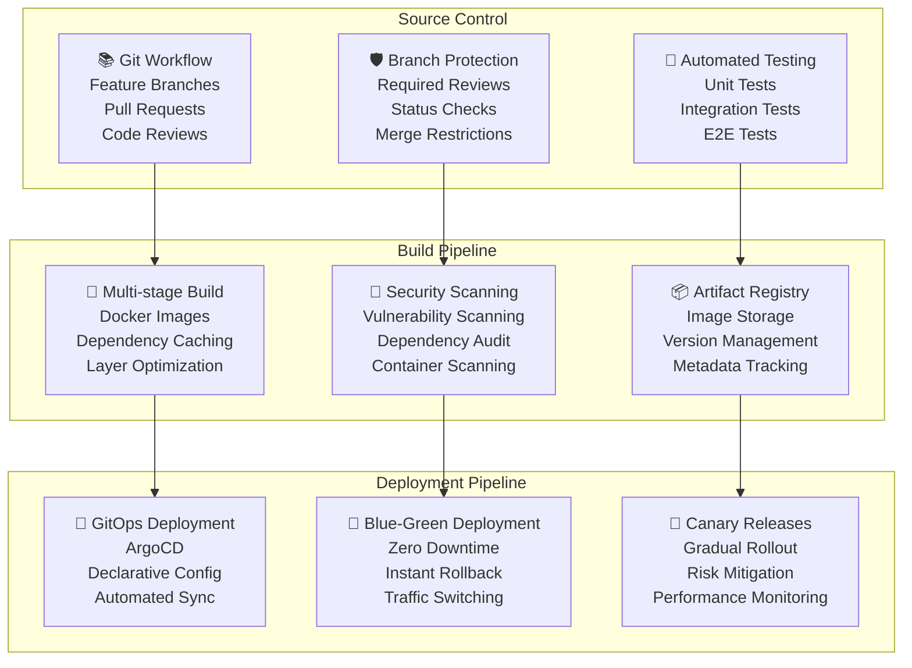
```mermaid
graph TB
    subgraph "Source Control"
        GIT_WORKFLOW[📚 Git Workflow<br/>Feature Branches<br/>Pull Requests<br/>Code Reviews]
        BRANCH_PROTECTION[🛡️ Branch Protection<br/>Required Reviews<br/>Status Checks<br/>Merge Restrictions]
        AUTOMATED_TESTING[🧪 Automated Testing<br/>Unit Tests<br/>Integration Tests<br/>E2E Tests]
    end
    
    subgraph "Build Pipeline"
        MULTI_STAGE_BUILD[🔨 Multi-stage Build<br/>Docker Images<br/>Dependency Caching<br/>Layer Optimization]
        SECURITY_SCANNING[🔐 Security Scanning<br/>Vulnerability Scanning<br/>Dependency Audit<br/>Container Scanning]
        ARTIFACT_REGISTRY[📦 Artifact Registry<br/>Image Storage<br/>Version Management<br/>Metadata Tracking]
    end
    
    subgraph "Deployment Pipeline"
        GITOPS_DEPLOYMENT[🚀 GitOps Deployment<br/>ArgoCD<br/>Declarative Config<br/>Automated Sync]
        BLUE_GREEN_DEPLOYMENT[🔄 Blue-Green Deployment<br/>Zero Downtime<br/>Instant Rollback<br/>Traffic Switching]
        CANARY_RELEASES[🐤 Canary Releases<br/>Gradual Rollout<br/>Risk Mitigation<br/>Performance Monitoring]
    end
    
    GIT_WORKFLOW --> MULTI_STAGE_BUILD
    BRANCH_PROTECTION --> SECURITY_SCANNING
    AUTOMATED_TESTING --> ARTIFACT_REGISTRY
    
    MULTI_STAGE_BUILD --> GITOPS_DEPLOYMENT
    SECURITY_SCANNING --> BLUE_GREEN_DEPLOYMENT
    ARTIFACT_REGISTRY --> CANARY_RELEASES
```

### Production Environment Configuration

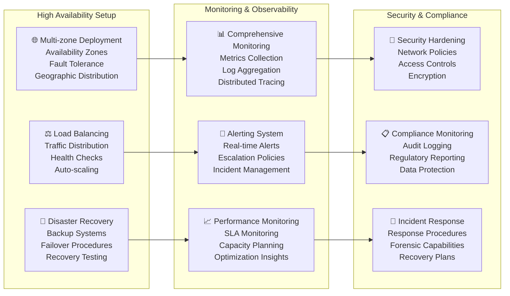
```mermaid
graph LR
    subgraph "High Availability Setup"
        MULTI_ZONE[🌐 Multi-zone Deployment<br/>Availability Zones<br/>Fault Tolerance<br/>Geographic Distribution]
        LOAD_BALANCING[⚖️ Load Balancing<br/>Traffic Distribution<br/>Health Checks<br/>Auto-scaling]
        DISASTER_RECOVERY[🔄 Disaster Recovery<br/>Backup Systems<br/>Failover Procedures<br/>Recovery Testing]
    end
    
    subgraph "Monitoring & Observability"
        COMPREHENSIVE_MONITORING[📊 Comprehensive Monitoring<br/>Metrics Collection<br/>Log Aggregation<br/>Distributed Tracing]
        ALERTING_SYSTEM[🚨 Alerting System<br/>Real-time Alerts<br/>Escalation Policies<br/>Incident Management]
        PERFORMANCE_MONITORING[📈 Performance Monitoring<br/>SLA Monitoring<br/>Capacity Planning<br/>Optimization Insights]
    end
    
    subgraph "Security & Compliance"
        SECURITY_HARDENING[🔐 Security Hardening<br/>Network Policies<br/>Access Controls<br/>Encryption]
        COMPLIANCE_MONITORING[📋 Compliance Monitoring<br/>Audit Logging<br/>Regulatory Reporting<br/>Data Protection]
        INCIDENT_RESPONSE[🚨 Incident Response<br/>Response Procedures<br/>Forensic Capabilities<br/>Recovery Plans]
    end
    
    MULTI_ZONE --> COMPREHENSIVE_MONITORING
    LOAD_BALANCING --> ALERTING_SYSTEM
    DISASTER_RECOVERY --> PERFORMANCE_MONITORING
    
    COMPREHENSIVE_MONITORING --> SECURITY_HARDENING
    ALERTING_SYSTEM --> COMPLIANCE_MONITORING
    PERFORMANCE_MONITORING --> INCIDENT_RESPONSE
```

## Configuration Management

### Environment Configuration

```yaml
# Production Environment Configuration
apiVersion: v1
kind: ConfigMap
metadata:
  name: ats-config
  namespace: ats-trading
data:
  # Database Configuration
  POSTGRES_HOST: "postgres-cluster.ats-system.svc.cluster.local"
  POSTGRES_PORT: "5432"
  POSTGRES_DATABASE: "ats_production"
  CLICKHOUSE_HOST: "clickhouse-cluster.ats-system.svc.cluster.local"
  CLICKHOUSE_PORT: "9000"
  REDIS_CLUSTER: "redis-cluster.ats-system.svc.cluster.local:6379"
  
  # Kafka Configuration
  KAFKA_BROKERS: "kafka-cluster.ats-system.svc.cluster.local:9092"
  SCHEMA_REGISTRY_URL: "http://schema-registry.ats-system.svc.cluster.local:8081"
  
  # Trading Configuration
  TRADING_MODE: "LIVE"
  RISK_LIMITS_ENABLED: "true"
  MAX_POSITION_SIZE: "1000000"
  MAX_DAILY_LOSS: "50000"
  
  # AI Configuration
  LLM_PROVIDER: "openai"
  VECTOR_DB_URL: "http://qdrant.ats-system.svc.cluster.local:6333"
  RAG_ENABLED: "true"
  
  # Performance Configuration
  LATENCY_TARGET_US: "100"
  THROUGHPUT_TARGET: "1000000"
  CACHE_TTL_SECONDS: "300"
```

### Secrets Management

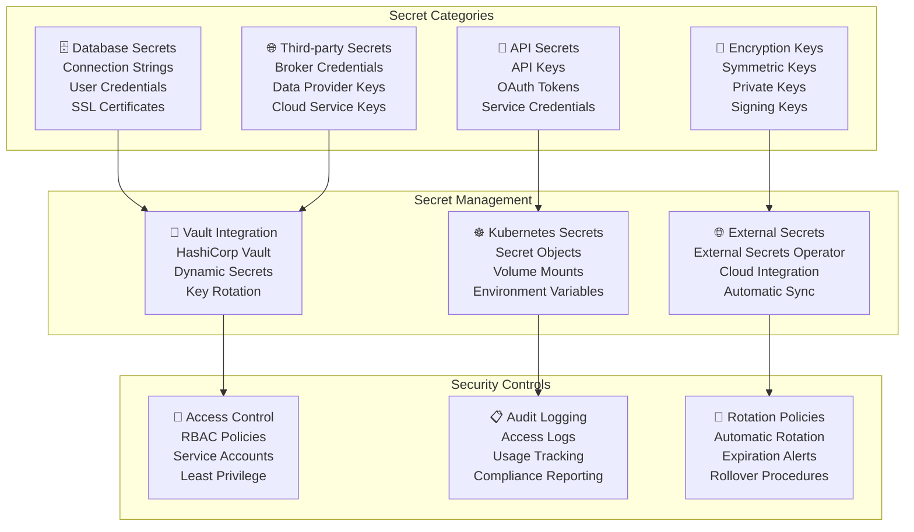
```mermaid
graph TB
    subgraph "Secret Categories"
        DATABASE_SECRETS[🗄️ Database Secrets<br/>Connection Strings<br/>User Credentials<br/>SSL Certificates]
        API_SECRETS[🔗 API Secrets<br/>API Keys<br/>OAuth Tokens<br/>Service Credentials]
        ENCRYPTION_KEYS[🔐 Encryption Keys<br/>Symmetric Keys<br/>Private Keys<br/>Signing Keys]
        THIRD_PARTY_SECRETS[🌐 Third-party Secrets<br/>Broker Credentials<br/>Data Provider Keys<br/>Cloud Service Keys]
    end
    
    subgraph "Secret Management"
        VAULT_INTEGRATION[🔐 Vault Integration<br/>HashiCorp Vault<br/>Dynamic Secrets<br/>Key Rotation]
        KUBERNETES_SECRETS[☸️ Kubernetes Secrets<br/>Secret Objects<br/>Volume Mounts<br/>Environment Variables]
        EXTERNAL_SECRETS[🌐 External Secrets<br/>External Secrets Operator<br/>Cloud Integration<br/>Automatic Sync]
    end
    
    subgraph "Security Controls"
        ACCESS_CONTROL[🎯 Access Control<br/>RBAC Policies<br/>Service Accounts<br/>Least Privilege]
        AUDIT_LOGGING[📋 Audit Logging<br/>Access Logs<br/>Usage Tracking<br/>Compliance Reporting]
        ROTATION_POLICIES[🔄 Rotation Policies<br/>Automatic Rotation<br/>Expiration Alerts<br/>Rollover Procedures]
    end
    
    DATABASE_SECRETS --> VAULT_INTEGRATION
    API_SECRETS --> KUBERNETES_SECRETS
    ENCRYPTION_KEYS --> EXTERNAL_SECRETS
    THIRD_PARTY_SECRETS --> VAULT_INTEGRATION
    
    VAULT_INTEGRATION --> ACCESS_CONTROL
    KUBERNETES_SECRETS --> AUDIT_LOGGING
    EXTERNAL_SECRETS --> ROTATION_POLICIES
```

## Operational Procedures

### Deployment Procedures

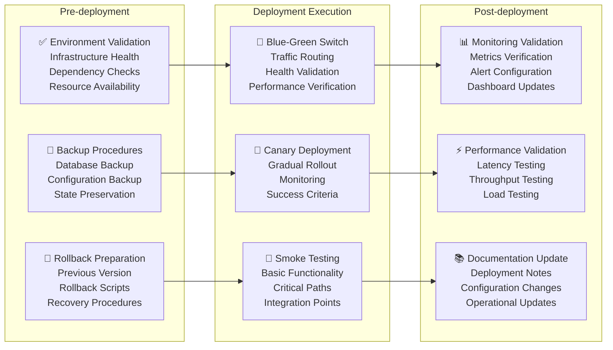
```mermaid
graph LR
    subgraph "Pre-deployment"
        ENVIRONMENT_VALIDATION[✅ Environment Validation<br/>Infrastructure Health<br/>Dependency Checks<br/>Resource Availability]
        BACKUP_PROCEDURES[💾 Backup Procedures<br/>Database Backup<br/>Configuration Backup<br/>State Preservation]
        ROLLBACK_PREPARATION[🔄 Rollback Preparation<br/>Previous Version<br/>Rollback Scripts<br/>Recovery Procedures]
    end
    
    subgraph "Deployment Execution"
        BLUE_GREEN_SWITCH[🔄 Blue-Green Switch<br/>Traffic Routing<br/>Health Validation<br/>Performance Verification]
        CANARY_DEPLOYMENT[🐤 Canary Deployment<br/>Gradual Rollout<br/>Monitoring<br/>Success Criteria]
        SMOKE_TESTING[💨 Smoke Testing<br/>Basic Functionality<br/>Critical Paths<br/>Integration Points]
    end
    
    subgraph "Post-deployment"
        MONITORING_VALIDATION[📊 Monitoring Validation<br/>Metrics Verification<br/>Alert Configuration<br/>Dashboard Updates]
        PERFORMANCE_VALIDATION[⚡ Performance Validation<br/>Latency Testing<br/>Throughput Testing<br/>Load Testing]
        DOCUMENTATION_UPDATE[📚 Documentation Update<br/>Deployment Notes<br/>Configuration Changes<br/>Operational Updates]
    end
    
    ENVIRONMENT_VALIDATION --> BLUE_GREEN_SWITCH
    BACKUP_PROCEDURES --> CANARY_DEPLOYMENT
    ROLLBACK_PREPARATION --> SMOKE_TESTING
    
    BLUE_GREEN_SWITCH --> MONITORING_VALIDATION
    CANARY_DEPLOYMENT --> PERFORMANCE_VALIDATION
    SMOKE_TESTING --> DOCUMENTATION_UPDATE
```

### Monitoring & Alerting Setup

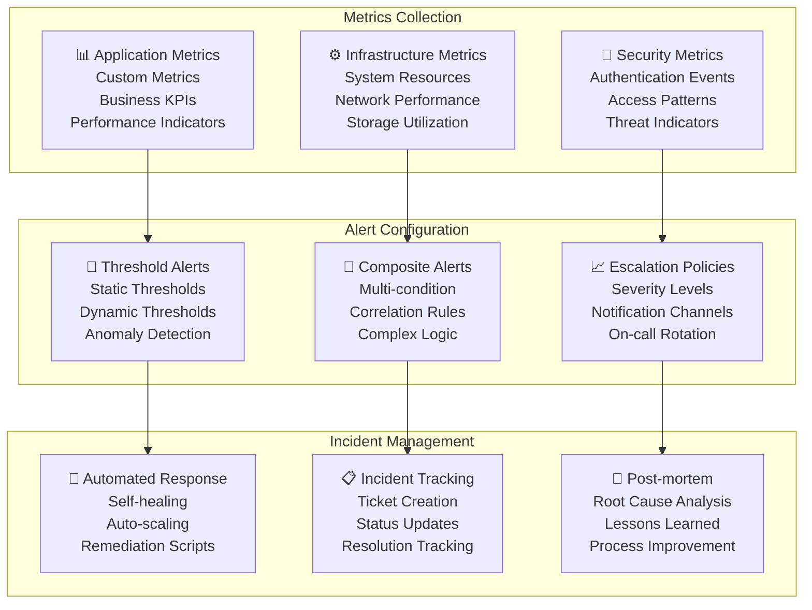
```mermaid
graph TB
    subgraph "Metrics Collection"
        APPLICATION_METRICS[📊 Application Metrics<br/>Custom Metrics<br/>Business KPIs<br/>Performance Indicators]
        INFRASTRUCTURE_METRICS[⚙️ Infrastructure Metrics<br/>System Resources<br/>Network Performance<br/>Storage Utilization]
        SECURITY_METRICS[🔐 Security Metrics<br/>Authentication Events<br/>Access Patterns<br/>Threat Indicators]
    end
    
    subgraph "Alert Configuration"
        THRESHOLD_ALERTS[🚨 Threshold Alerts<br/>Static Thresholds<br/>Dynamic Thresholds<br/>Anomaly Detection]
        COMPOSITE_ALERTS[🔗 Composite Alerts<br/>Multi-condition<br/>Correlation Rules<br/>Complex Logic]
        ESCALATION_POLICIES[📈 Escalation Policies<br/>Severity Levels<br/>Notification Channels<br/>On-call Rotation]
    end
    
    subgraph "Incident Management"
        AUTOMATED_RESPONSE[🤖 Automated Response<br/>Self-healing<br/>Auto-scaling<br/>Remediation Scripts]
        INCIDENT_TRACKING[📋 Incident Tracking<br/>Ticket Creation<br/>Status Updates<br/>Resolution Tracking]
        POST_MORTEM[📝 Post-mortem<br/>Root Cause Analysis<br/>Lessons Learned<br/>Process Improvement]
    end
    
    APPLICATION_METRICS --> THRESHOLD_ALERTS
    INFRASTRUCTURE_METRICS --> COMPOSITE_ALERTS
    SECURITY_METRICS --> ESCALATION_POLICIES
    
    THRESHOLD_ALERTS --> AUTOMATED_RESPONSE
    COMPOSITE_ALERTS --> INCIDENT_TRACKING
    ESCALATION_POLICIES --> POST_MORTEM
```

## Troubleshooting Guide

### Common Issues & Solutions

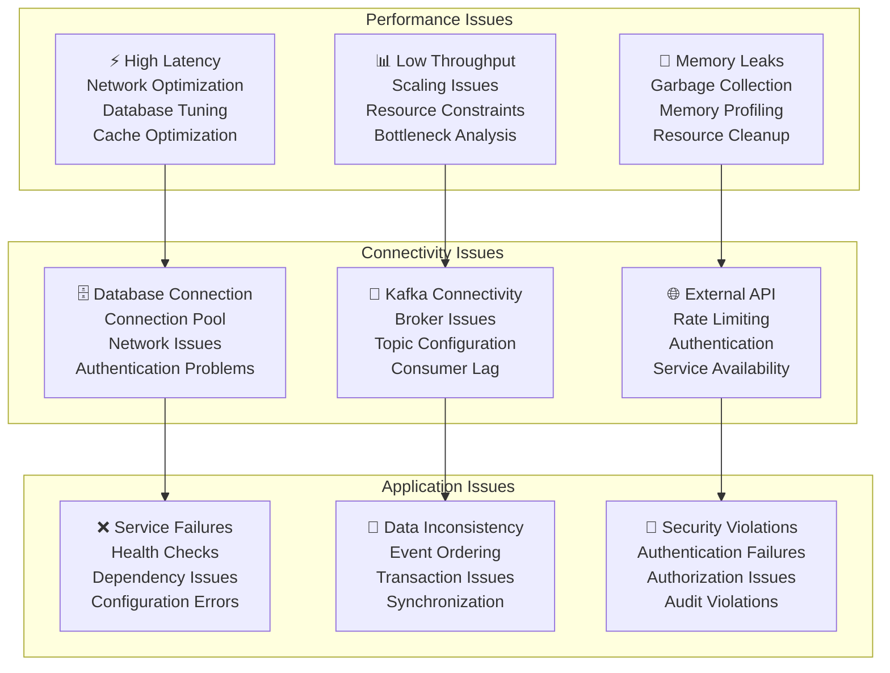
```mermaid
graph TB
    subgraph "Performance Issues"
        HIGH_LATENCY[⚡ High Latency<br/>Network Optimization<br/>Database Tuning<br/>Cache Optimization]
        LOW_THROUGHPUT[📊 Low Throughput<br/>Scaling Issues<br/>Resource Constraints<br/>Bottleneck Analysis]
        MEMORY_LEAKS[💾 Memory Leaks<br/>Garbage Collection<br/>Memory Profiling<br/>Resource Cleanup]
    end
    
    subgraph "Connectivity Issues"
        DATABASE_CONNECTION[🗄️ Database Connection<br/>Connection Pool<br/>Network Issues<br/>Authentication Problems]
        KAFKA_CONNECTIVITY[📡 Kafka Connectivity<br/>Broker Issues<br/>Topic Configuration<br/>Consumer Lag]
        EXTERNAL_API[🌐 External API<br/>Rate Limiting<br/>Authentication<br/>Service Availability]
    end
    
    subgraph "Application Issues"
        SERVICE_FAILURES[❌ Service Failures<br/>Health Checks<br/>Dependency Issues<br/>Configuration Errors]
        DATA_INCONSISTENCY[🔄 Data Inconsistency<br/>Event Ordering<br/>Transaction Issues<br/>Synchronization]
        SECURITY_VIOLATIONS[🔐 Security Violations<br/>Authentication Failures<br/>Authorization Issues<br/>Audit Violations]
    end
    
    HIGH_LATENCY --> DATABASE_CONNECTION
    LOW_THROUGHPUT --> KAFKA_CONNECTIVITY
    MEMORY_LEAKS --> EXTERNAL_API
    
    DATABASE_CONNECTION --> SERVICE_FAILURES
    KAFKA_CONNECTIVITY --> DATA_INCONSISTENCY
    EXTERNAL_API --> SECURITY_VIOLATIONS
```

### Diagnostic Tools & Commands

```bash
# Performance Diagnostics
kubectl top nodes
kubectl top pods -n ats-trading
kubectl describe pod <pod-name> -n ats-trading

# Log Analysis
kubectl logs -f deployment/trading-engine -n ats-trading
kubectl logs --previous deployment/ai-assistant -n ats-trading

# Network Diagnostics
kubectl exec -it <pod-name> -n ats-trading -- netstat -tulpn
kubectl exec -it <pod-name> -n ats-trading -- nslookup postgres-cluster.ats-system.svc.cluster.local

# Database Diagnostics
kubectl exec -it postgres-0 -n ats-system -- psql -U postgres -c "SELECT * FROM pg_stat_activity;"
kubectl exec -it clickhouse-0 -n ats-system -- clickhouse-client --query "SHOW PROCESSLIST"

# Kafka Diagnostics
kubectl exec -it kafka-0 -n ats-system -- kafka-topics.sh --bootstrap-server localhost:9092 --list
kubectl exec -it kafka-0 -n ats-system -- kafka-consumer-groups.sh --bootstrap-server localhost:9092 --list

# Security Diagnostics
kubectl auth can-i create pods --as=system:serviceaccount:ats-trading:trading-service
kubectl get networkpolicies -n ats-trading
```

## Implementation Checklist

### Phase Completion Criteria

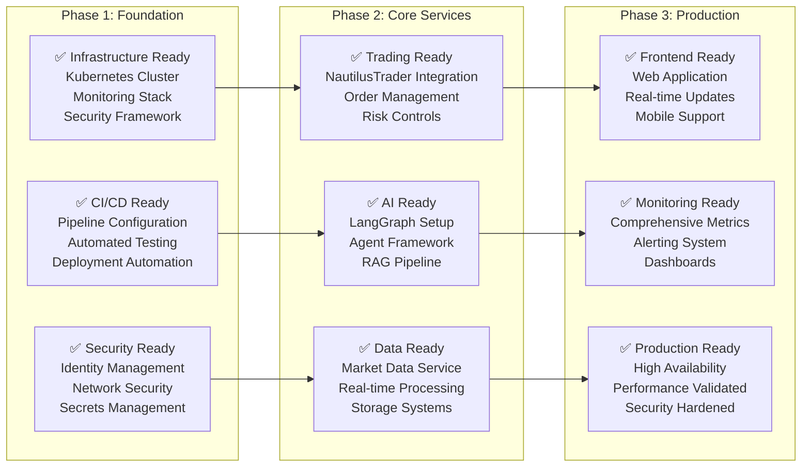
```mermaid
graph LR
    subgraph "Phase 1: Foundation"
        INFRA_READY[✅ Infrastructure Ready<br/>Kubernetes Cluster<br/>Monitoring Stack<br/>Security Framework]
        CICD_READY[✅ CI/CD Ready<br/>Pipeline Configuration<br/>Automated Testing<br/>Deployment Automation]
        SECURITY_READY[✅ Security Ready<br/>Identity Management<br/>Network Security<br/>Secrets Management]
    end
    
    subgraph "Phase 2: Core Services"
        TRADING_READY[✅ Trading Ready<br/>NautilusTrader Integration<br/>Order Management<br/>Risk Controls]
        AI_READY[✅ AI Ready<br/>LangGraph Setup<br/>Agent Framework<br/>RAG Pipeline]
        DATA_READY[✅ Data Ready<br/>Market Data Service<br/>Real-time Processing<br/>Storage Systems]
    end
    
    subgraph "Phase 3: Production"
        FRONTEND_READY[✅ Frontend Ready<br/>Web Application<br/>Real-time Updates<br/>Mobile Support]
        MONITORING_READY[✅ Monitoring Ready<br/>Comprehensive Metrics<br/>Alerting System<br/>Dashboards]
        PRODUCTION_READY[✅ Production Ready<br/>High Availability<br/>Performance Validated<br/>Security Hardened]
    end
    
    INFRA_READY --> TRADING_READY
    CICD_READY --> AI_READY
    SECURITY_READY --> DATA_READY
    
    TRADING_READY --> FRONTEND_READY
    AI_READY --> MONITORING_READY
    DATA_READY --> PRODUCTION_READY
```

### Quality Gates

- **✅ Code Quality**: >90% test coverage, zero critical vulnerabilities
- **✅ Performance**: Meet latency and throughput targets
- **✅ Security**: Pass security scans, compliance validation
- **✅ Reliability**: 99.9% uptime, disaster recovery tested
- **✅ Documentation**: Complete operational procedures, runbooks
- **✅ Monitoring**: Full observability, alerting configured
- **✅ Compliance**: Regulatory requirements met, audit trails

---

**Document Classification**: Implementation Documentation  
**Next Review Date**: 01 February 2026  
**Document Owner**: Implementation Team  
**Approval**: Chief Technology Officer, Implementation Committee