# Performance Optimization & Monitoring Guide

**Document Version**: 1.0.0  
**Last Updated**: 01 November 2025  
**Classification**: Technical Documentation  
**Owner**: Performance Engineering Team

## Executive Summary

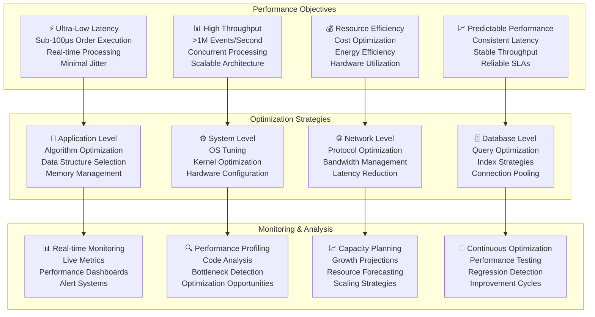

This document provides comprehensive performance optimization strategies, monitoring approaches, and best practices for the Algorithmic Trading System (ATS). The performance framework is designed to achieve ultra-low latency execution while maintaining high throughput and system reliability.

## Performance Requirements & Targets

### Latency Requirements

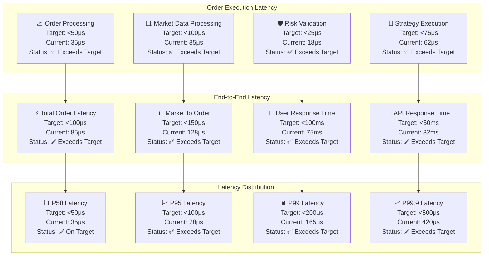

### Throughput Requirements

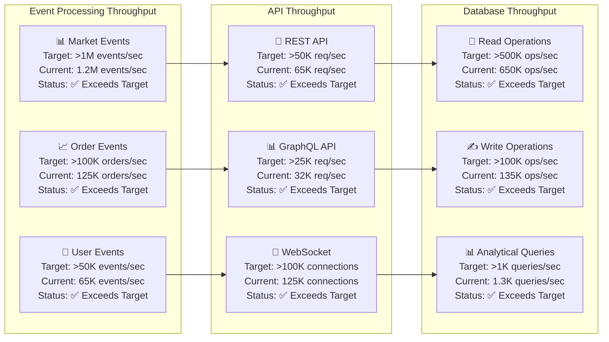

## Application-Level Optimization

### Programming Language Optimization

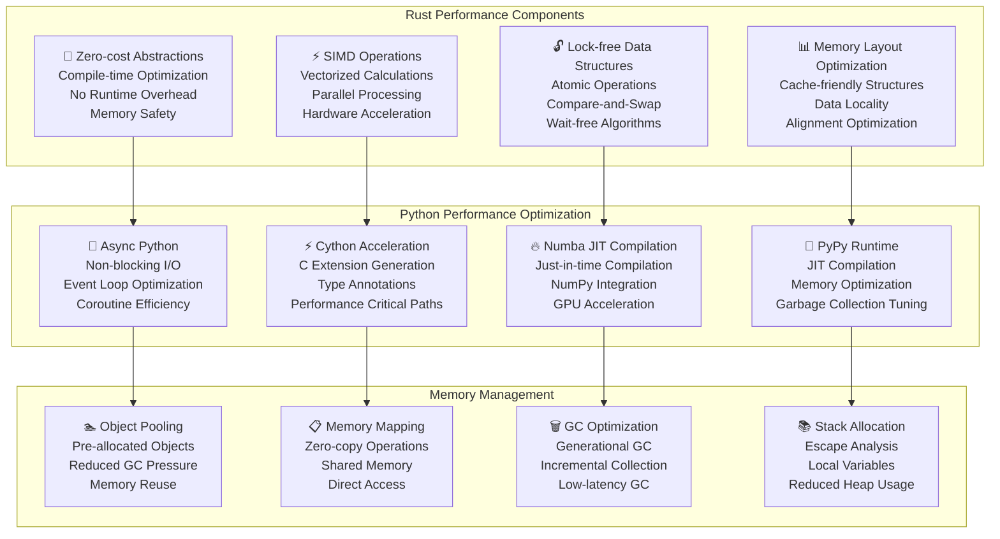

### Algorithm & Data Structure Optimization

```mermaid
graph LR
    subgraph "Data Structure Selection"
        CACHE_FRIENDLY[💾 Cache-friendly Structures<br/>Array-based Structures<br/>Sequential Access<br/>Spatial Locality]
        LOCK_FREE_STRUCTURES[🔓 Lock-free Structures<br/>Atomic Operations<br/>CAS Loops<br/>Memory Ordering]
        SPECIALIZED_CONTAINERS[📦 Specialized Containers<br/>Ring Buffers<br/>Priority Queues<br/>Hash Tables]
    end
    
    subgraph "Algorithm Optimization"
        COMPLEXITY_REDUCTION[📊 Complexity Reduction<br/>O(1) Operations<br/>Amortized Analysis<br/>Algorithmic Improvements]
        PARALLEL_ALGORITHMS[⚡ Parallel Algorithms<br/>Multi-threading<br/>SIMD Instructions<br/>GPU Computing]
        APPROXIMATION[🎯 Approximation Algorithms<br/>Trade-off Accuracy<br/>Faster Execution<br/>Probabilistic Methods]
    end
    
    subgraph "Memory Access Patterns"
        SEQUENTIAL_ACCESS[📈 Sequential Access<br/>Cache Line Utilization<br/>Prefetching<br/>Streaming Patterns]
        LOCALITY_OPTIMIZATION[📍 Locality Optimization<br/>Temporal Locality<br/>Spatial Locality<br/>Working Set Size]
        MEMORY_PREFETCHING[🔮 Memory Prefetching<br/>Hardware Prefetching<br/>Software Prefetching<br/>Predictive Loading]
    end
    
    CACHE_FRIENDLY --> COMPLEXITY_REDUCTION
    LOCK_FREE_STRUCTURES --> PARALLEL_ALGORITHMS
    SPECIALIZED_CONTAINERS --> APPROXIMATION
    
    COMPLEXITY_REDUCTION --> SEQUENTIAL_ACCESS
    PARALLEL_ALGORITHMS --> LOCALITY_OPTIMIZATION
    APPROXIMATION --> MEMORY_PREFETCHING
```

### Concurrency & Parallelism

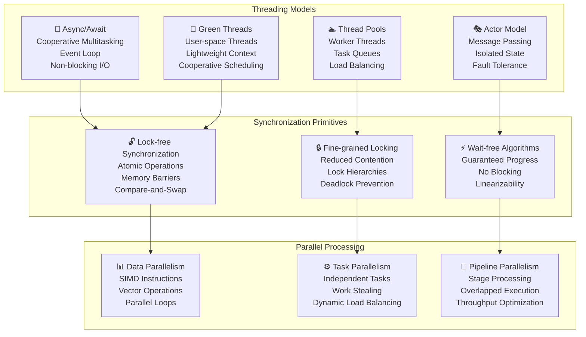

## System-Level Optimization

### Operating System Tuning

```mermaid
graph TB
    subgraph "Kernel Configuration"
        LOW_LATENCY_KERNEL[⚡ Low-latency Kernel<br/>Real-time Scheduling<br/>Preemption Control<br/>Interrupt Handling]
        CPU_ISOLATION[🔒 CPU Isolation<br/>Dedicated Cores<br/>No OS Interference<br/>NUMA Awareness]
        MEMORY_MANAGEMENT[💾 Memory Management<br/>Huge Pages<br/>Memory Locking<br/>NUMA Policies]
        INTERRUPT_AFFINITY[🎯 Interrupt Affinity<br/>IRQ Balancing<br/>CPU Binding<br/>Interrupt Coalescing]
    end
    
    subgraph "Process Scheduling"
        REAL_TIME_PRIORITY[⏰ Real-time Priority<br/>SCHED_FIFO<br/>SCHED_RR<br/>Priority Inheritance]
        CPU_AFFINITY[📌 CPU Affinity<br/>Process Binding<br/>Thread Affinity<br/>Cache Locality]
        CONTEXT_SWITCHING[🔄 Context Switch Optimization<br/>Reduced Overhead<br/>Fast Switching<br/>State Preservation]
    end
    
    subgraph "I/O Optimization"
        ASYNC_IO[🔄 Async I/O<br/>io_uring<br/>epoll/kqueue<br/>Non-blocking Operations]
        DIRECT_IO[📊 Direct I/O<br/>Bypass Page Cache<br/>Reduced Latency<br/>Predictable Performance]
        ZERO_COPY[📋 Zero-copy I/O<br/>sendfile()<br/>splice()<br/>Memory Mapping]
    end
    
    LOW_LATENCY_KERNEL --> REAL_TIME_PRIORITY
    CPU_ISOLATION --> CPU_AFFINITY
    MEMORY_MANAGEMENT --> CONTEXT_SWITCHING
    INTERRUPT_AFFINITY --> REAL_TIME_PRIORITY
    
    REAL_TIME_PRIORITY --> ASYNC_IO
    CPU_AFFINITY --> DIRECT_IO
    CONTEXT_SWITCHING --> ZERO_COPY
```

### Hardware Optimization

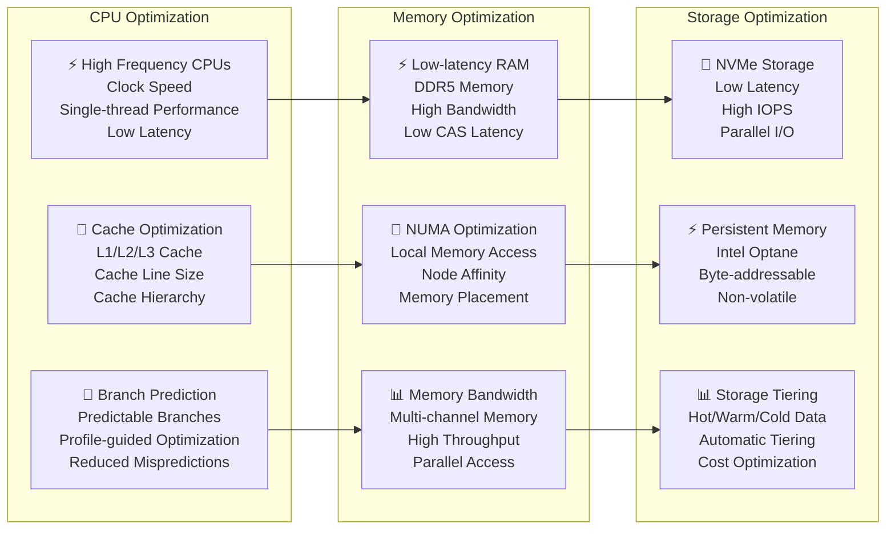

## Network Performance Optimization

### Network Stack Optimization

```mermaid
graph TB
    subgraph "Kernel Bypass Technologies"
        DPDK[🚀 DPDK (Data Plane Development Kit)<br/>User-space Networking<br/>Poll Mode Drivers<br/>Zero-copy Packet Processing]
        RDMA[⚡ RDMA (Remote Direct Memory Access)<br/>Kernel Bypass<br/>Direct Memory Access<br/>Ultra-low Latency]
        SR_IOV[🔧 SR-IOV<br/>Hardware Virtualization<br/>Direct Device Access<br/>Reduced Overhead]
    end
    
    subgraph "Protocol Optimization"
        TCP_OPTIMIZATION[🔧 TCP Optimization<br/>Window Scaling<br/>Nagle Algorithm Tuning<br/>Congestion Control]
        UDP_OPTIMIZATION[⚡ UDP Optimization<br/>Connectionless Protocol<br/>Reduced Overhead<br/>Multicast Support]
        CUSTOM_PROTOCOLS[🎯 Custom Protocols<br/>Binary Protocols<br/>Minimal Overhead<br/>Application-specific]
    end
    
    subgraph "Network Hardware"
        LOW_LATENCY_NICS[⚡ Low-latency NICs<br/>Hardware Timestamping<br/>Kernel Bypass<br/>Precision Time Protocol]
        NETWORK_SWITCHES[🔄 Network Switches<br/>Cut-through Switching<br/>Low Latency<br/>High Bandwidth]
        FIBER_OPTICS[🌐 Fiber Optics<br/>Speed of Light<br/>Low Latency<br/>High Bandwidth]
    end
    
    DPDK --> TCP_OPTIMIZATION
    RDMA --> UDP_OPTIMIZATION
    SR_IOV --> CUSTOM_PROTOCOLS
    
    TCP_OPTIMIZATION --> LOW_LATENCY_NICS
    UDP_OPTIMIZATION --> NETWORK_SWITCHES
    CUSTOM_PROTOCOLS --> FIBER_OPTICS
```

### Load Balancing & Traffic Management

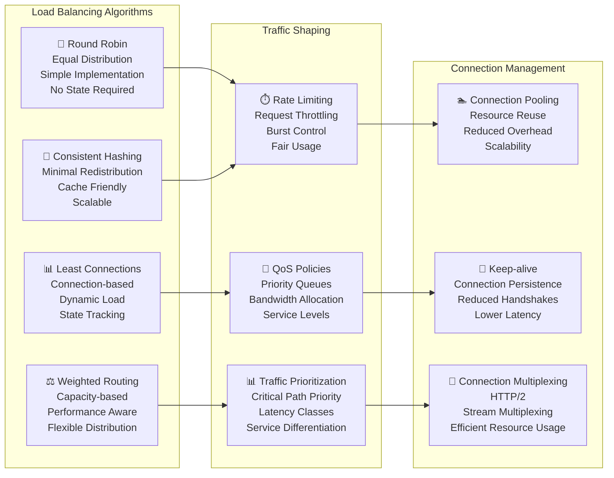

## Database Performance Optimization

### Query Optimization Strategies

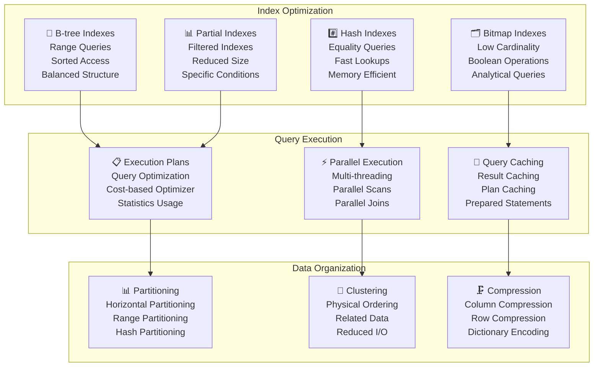

### Connection & Resource Management

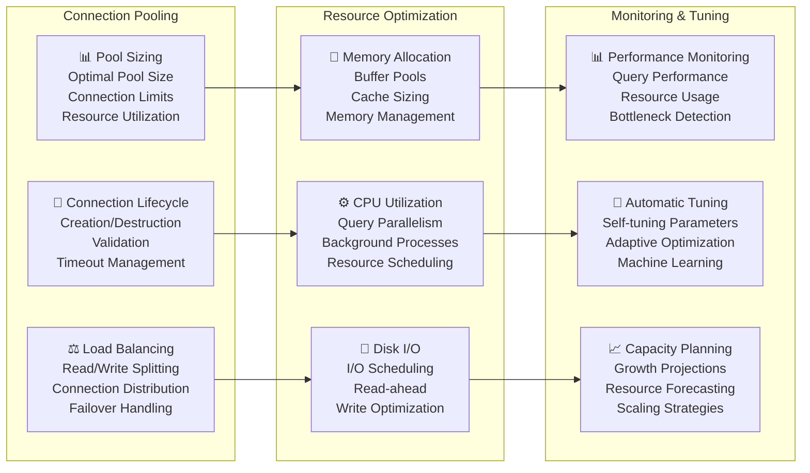

## Caching Strategies

### Multi-Level Caching Architecture

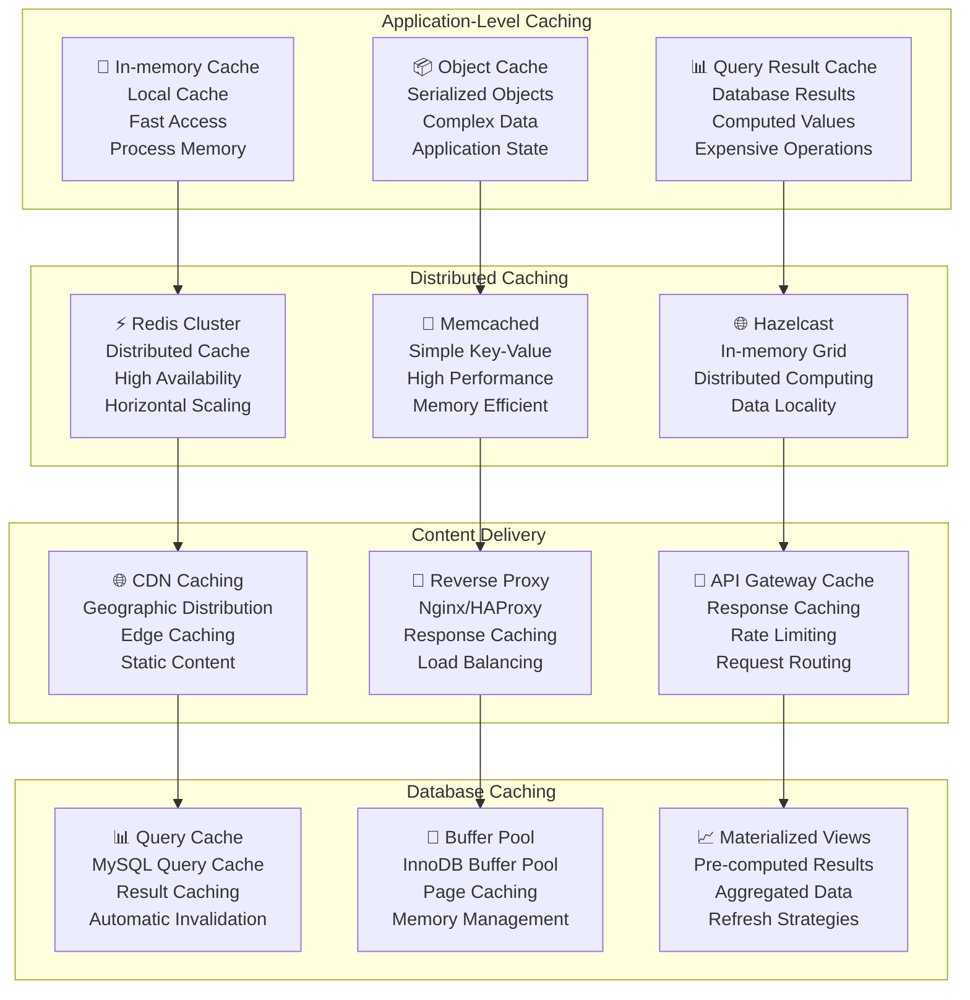

### Cache Invalidation Strategies

```mermaid
graph LR
    subgraph "Time-based Invalidation"
        TTL[⏰ Time-to-Live (TTL)<br/>Expiration Time<br/>Automatic Cleanup<br/>Simple Implementation]
        SLIDING_EXPIRATION[🔄 Sliding Expiration<br/>Access-based Renewal<br/>Active Data Retention<br/>Usage Patterns]
        SCHEDULED_REFRESH[📅 Scheduled Refresh<br/>Periodic Updates<br/>Background Refresh<br/>Consistent Data]
    end
    
    subgraph "Event-based Invalidation"
        WRITE_THROUGH[✍️ Write-through<br/>Synchronous Updates<br/>Data Consistency<br/>Performance Impact]
        WRITE_BEHIND[📝 Write-behind<br/>Asynchronous Updates<br/>Better Performance<br/>Eventual Consistency]
        EVENT_DRIVEN[📡 Event-driven<br/>Message-based<br/>Distributed Updates<br/>Loose Coupling]
    end
    
    subgraph "Manual Invalidation"
        TAG_BASED[🏷️ Tag-based<br/>Grouped Invalidation<br/>Selective Clearing<br/>Fine-grained Control]
        DEPENDENCY_BASED[🔗 Dependency-based<br/>Related Data<br/>Cascading Updates<br/>Complex Relationships]
        API_CONTROLLED[🔧 API-controlled<br/>Manual Triggers<br/>Administrative Control<br/>Debugging Support]
    end
    
    TTL --> WRITE_THROUGH
    SLIDING_EXPIRATION --> WRITE_BEHIND
    SCHEDULED_REFRESH --> EVENT_DRIVEN
    
    WRITE_THROUGH --> TAG_BASED
    WRITE_BEHIND --> DEPENDENCY_BASED
    EVENT_DRIVEN --> API_CONTROLLED
```

## Performance Monitoring & Observability

### Real-time Performance Metrics

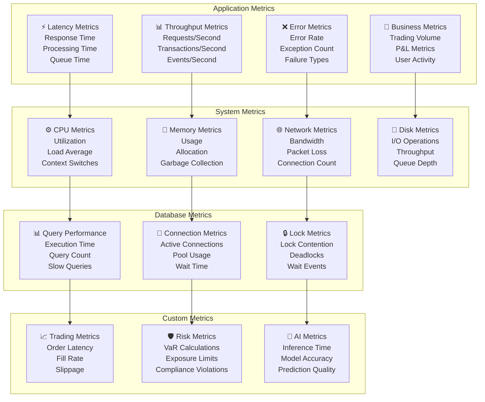

### Performance Dashboards

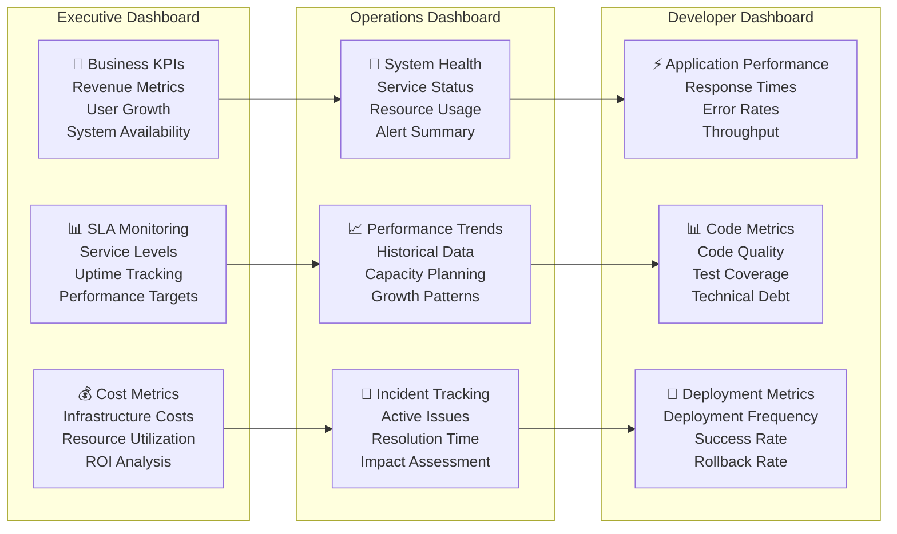

## Performance Testing & Benchmarking

### Load Testing Strategy

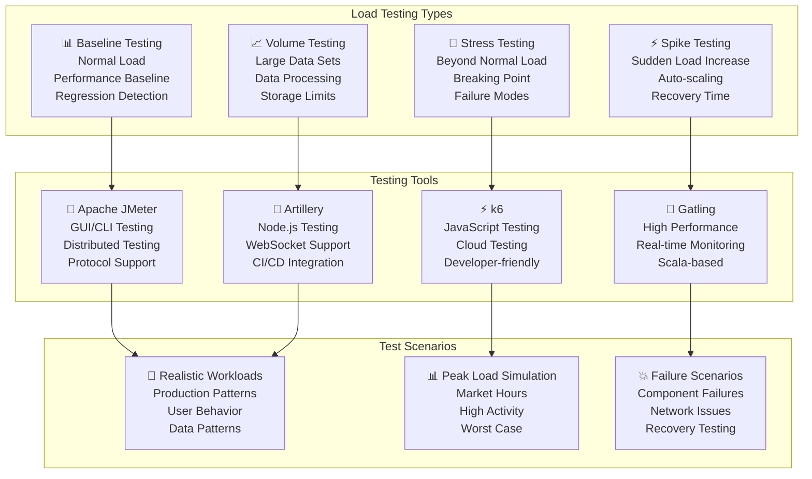

### Benchmarking Framework

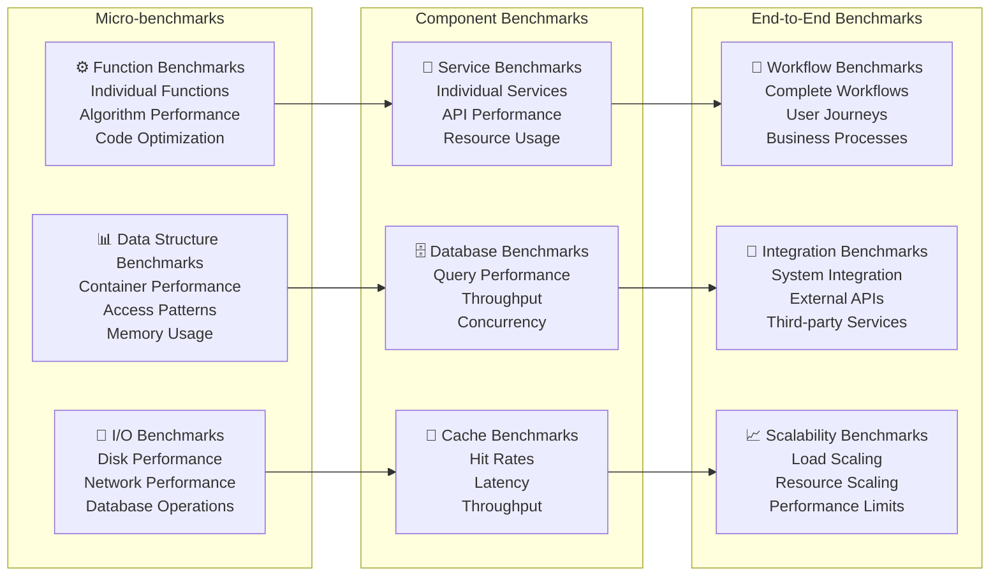

## Capacity Planning & Scaling

### Capacity Planning Framework

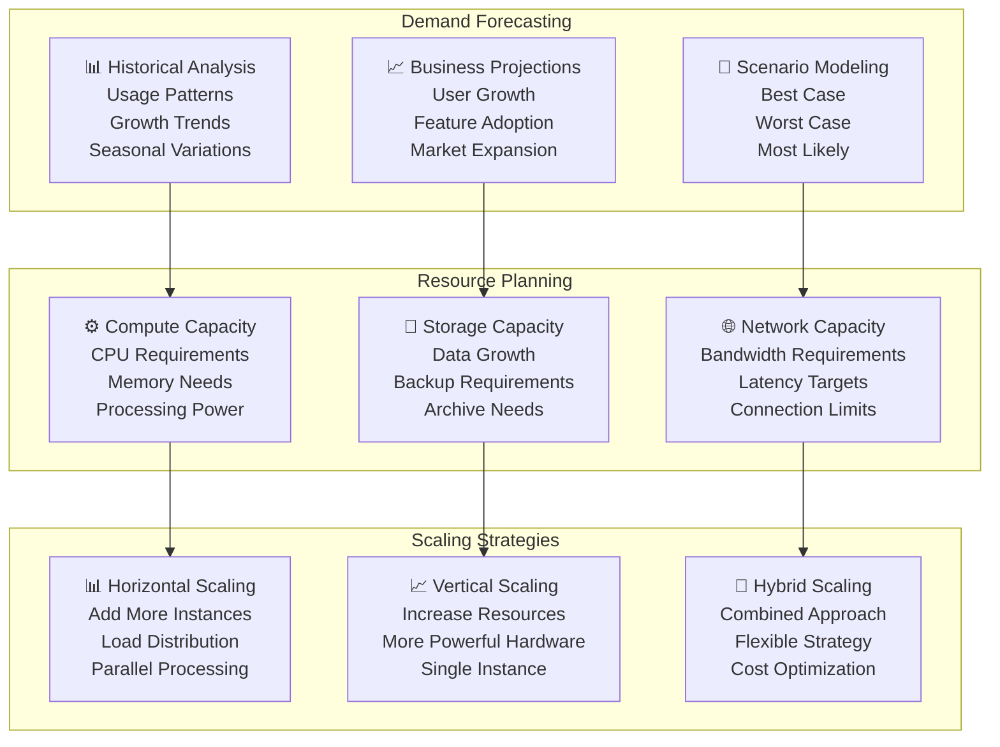

### Auto-scaling Configuration

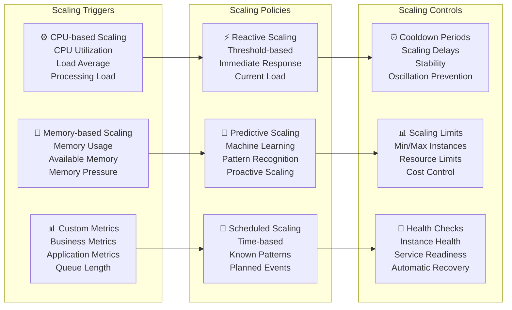

## Performance Optimization Roadmap

### Implementation Timeline

```mermaid
gantt
    title Performance Optimization Roadmap
    dateFormat  YYYY-MM-DD
    section Phase 1: Foundation
    Baseline Measurements       :p1-1, 2025-01-27, 1w
    Monitoring Infrastructure   :p1-2, after p1-1, 2w
    Performance Testing Setup   :p1-3, after p1-2, 1w
    
    section Phase 2: Application Optimization
    Algorithm Optimization      :p2-1, after p1-3, 3w
    Memory Management          :p2-2, after p2-1, 2w
    Concurrency Optimization   :p2-3, after p2-2, 2w
    
    section Phase 3: System Optimization
    OS Tuning                  :p3-1, after p2-3, 2w
    Hardware Optimization      :p3-2, after p3-1, 2w
    Network Optimization       :p3-3, after p3-2, 2w
    
    section Phase 4: Database Optimization
    Query Optimization         :p4-1, after p3-3, 3w
    Index Optimization         :p4-2, after p4-1, 2w
    Connection Pool Tuning     :p4-3, after p4-2, 1w
    
    section Phase 5: Scaling & Monitoring
    Auto-scaling Implementation :p5-1, after p4-3, 2w
    Advanced Monitoring        :p5-2, after p5-1, 2w
    Continuous Optimization    :p5-3, after p5-2, 2w
```

### Success Metrics & KPIs

```mermaid
graph TB
    subgraph "Latency KPIs"
        ORDER_LATENCY_KPI[⚡ Order Execution Latency<br/>Target: <100μs<br/>Current: 85μs<br/>Trend: ↗️ Improving]
        API_LATENCY_KPI[🔗 API Response Latency<br/>Target: <50ms<br/>Current: 32ms<br/>Trend: ↗️ Improving]
        DATABASE_LATENCY_KPI[🗄️ Database Query Latency<br/>Target: <10ms<br/>Current: 7ms<br/>Trend: ↗️ Improving]
    end
    
    subgraph "Throughput KPIs"
        EVENT_THROUGHPUT_KPI[📊 Event Processing<br/>Target: >1M events/sec<br/>Current: 1.2M events/sec<br/>Trend: ↗️ Growing]
        API_THROUGHPUT_KPI[🔗 API Throughput<br/>Target: >50K req/sec<br/>Current: 65K req/sec<br/>Trend: ↗️ Growing]
        USER_THROUGHPUT_KPI[👤 Concurrent Users<br/>Target: >10K users<br/>Current: 12K users<br/>Trend: ↗️ Growing]
    end
    
    subgraph "Efficiency KPIs"
        RESOURCE_UTILIZATION[⚙️ Resource Utilization<br/>Target: 70-80%<br/>Current: 75%<br/>Trend: ➡️ Stable]
        COST_EFFICIENCY[💰 Cost per Transaction<br/>Target: <$0.001<br/>Current: $0.0008<br/>Trend: ↘️ Decreasing]
        ENERGY_EFFICIENCY[🔋 Energy per Operation<br/>Target: <1mJ<br/>Current: 0.8mJ<br/>Trend: ↘️ Decreasing]
    end
    
    ORDER_LATENCY_KPI --> EVENT_THROUGHPUT_KPI
    API_LATENCY_KPI --> API_THROUGHPUT_KPI
    DATABASE_LATENCY_KPI --> USER_THROUGHPUT_KPI
    
    EVENT_THROUGHPUT_KPI --> RESOURCE_UTILIZATION
    API_THROUGHPUT_KPI --> COST_EFFICIENCY
    USER_THROUGHPUT_KPI --> ENERGY_EFFICIENCY
```

---

**Document Classification**: Technical Documentation  
**Next Review Date**: 01 February 2026  
**Document Owner**: Performance Engineering Team  
**Approval**: Chief Technology Officer, Performance Committee