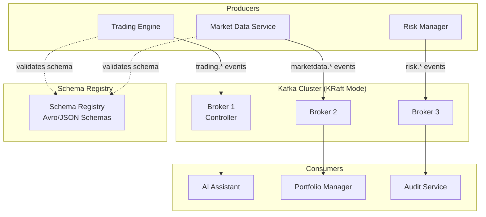
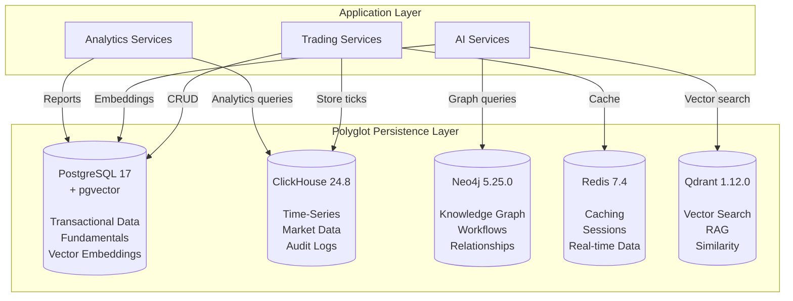
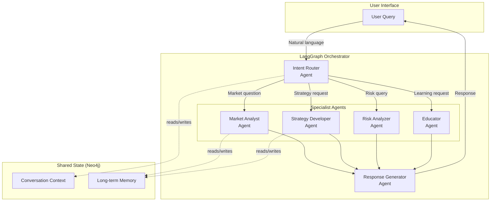
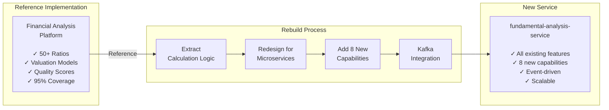
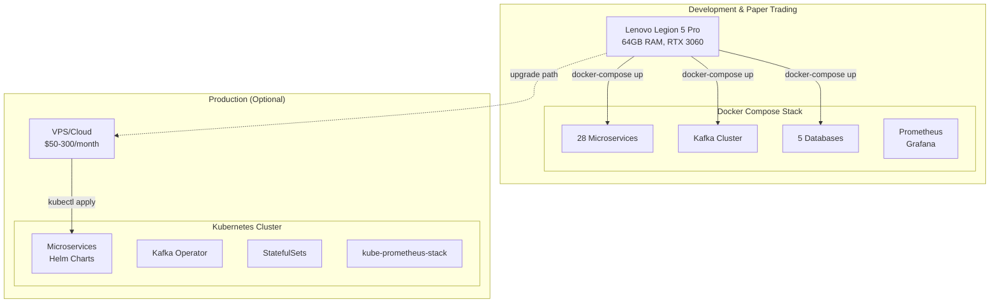
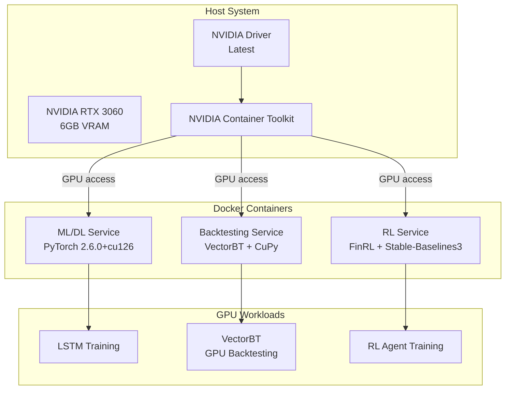
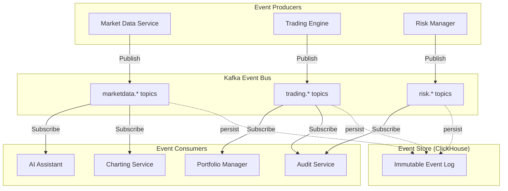
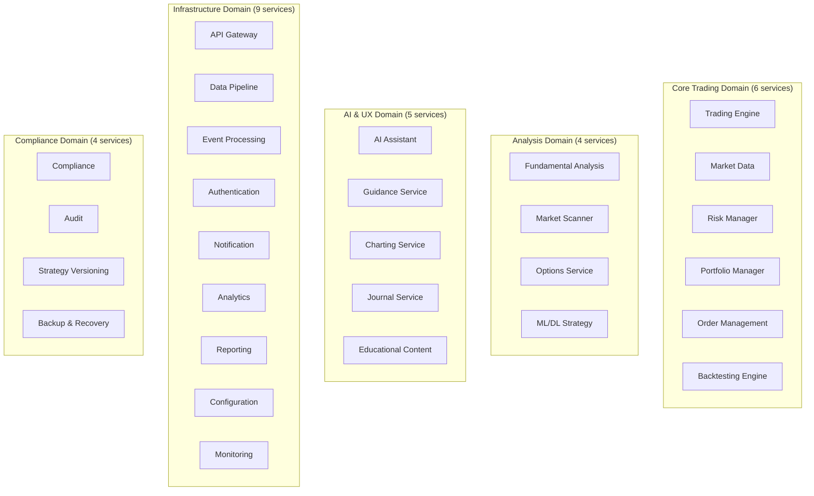
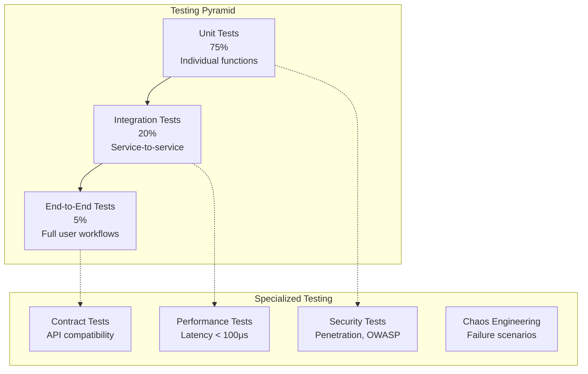

# Architecture Decision Records (ADRs) - Part 1

## Phase 1: Agentic AI Algorithmic Trading System v5.0

**Document Version**: 1.0  
**Last Updated**: 2025-11-20  
**Status**: Active

---

## Table of Contents

1. [ADR-001: NautilusTrader Over Custom Engine](#adr-001-nautilustrader-over-custom-engine)
2. [ADR-002: Kafka Over RabbitMQ/Redis Streams](#adr-002-kafka-over-rabbitmqredis-streams)
3. [ADR-003: Polyglot Persistence (5 Databases)](#adr-003-polyglot-persistence-5-databases)
4. [ADR-004: LangGraph for Multi-Agent Orchestration](#adr-004-langgraph-for-multi-agent-orchestration)
5. [ADR-005: Rebuild Fundamental Analysis from Scratch](#adr-005-rebuild-fundamental-analysis-from-scratch)
6. [ADR-006: Docker Compose for Local, Kubernetes Optional](#adr-006-docker-compose-for-local-kubernetes-optional)
7. [ADR-007: GPU Acceleration Strategy](#adr-007-gpu-acceleration-strategy)
8. [ADR-008: Event-Driven Architecture](#adr-008-event-driven-architecture)
9. [ADR-009: Microservices Boundaries](#adr-009-microservices-boundaries)
10. [ADR-010: Testing Strategy (>95% Coverage)](#adr-010-testing-strategy-95-coverage)
11. [ADR-011: Mono-Repo Strategy](#adr-011-mono-repo-strategy)
12. [ADR-012: Next.js + React Frontend](#adr-012-nextjs--react-frontend)
13. [ADR-013: Real-Time Data Streaming](#adr-013-real-time-data-streaming)
14. [ADR-014: Zero-Trust Security Architecture](#adr-014-zero-trust-security-architecture)
15. [ADR-015: Prometheus + Grafana Observability](#adr-015-prometheus--grafana-observability)

---

## ADR-001: NautilusTrader Over Custom Engine

**Status**: ✅ Accepted  
**Date**: 2025-11-20  
**Deciders**: System Architect, User

### Context

The trading system requires a high-performance, low-latency execution engine capable of handling multiple asset classes, complex strategies, and real-time market data processing.

### Decision

Use **NautilusTrader 1.195+** as the core trading engine.

### Rationale

1. **Performance**: Sub-100μs latency proven in production environments
2. **Architecture Alignment**: Event-driven design matches our microservices architecture
3. **Battle-Tested**: Active development with institutional-grade quality
4. **Hybrid Design**: Rust core for performance + Python bindings for productivity
5. **Dual Mode**: Built-in support for backtesting and live trading
6. **Asset Support**: Handles stocks, options, futures, forex, crypto

### Consequences

**Positive**:

- Immediate access to production-ready trading engine
- No need to solve low-level latency optimization problems
- Strong community and documentation
- Reduces development timeline by 8-12 weeks

**Negative**:

- Learning curve for team (estimated 2-3 weeks)
- Less customization flexibility than custom engine
- External dependency risk (mitigated by open-source nature)
- Need adapter layer for existing `core_trading` components

### Alternatives Considered

1. **Custom Engine**
   - Rejected: 3-4 months development time, higher maintenance burden
2. **Zipline**
   - Rejected: Deprecated, not actively maintained, research-focused
3. **Backtrader**
   - Rejected: Pure Python (slower), not institutional-grade latency

### Implementation Notes

- Wrap existing `core_trading/engines/` components as NautilusTrader strategies
- Use NautilusTrader's adapter pattern for IBKR integration
- Leverage NautilusTrader's data handling for market feeds

---

## ADR-002: Kafka Over RabbitMQ/Redis Streams

**Status**: ✅ Accepted  
**Date**: 2025-11-20  
**Deciders**: System Architect, User

### Context

The system requires robust event streaming for microservices communication, handling 1M+ events/sec with persistence, replay capability, and schema evolution.

### Decision

Use **Apache Kafka 3.9 (KRaft mode)** with **Schema Registry 7.7** as the primary event bus.

### Rationale

1. **Throughput**: Handles 1M+ events/second easily
2. **Persistence**: Event log stored on disk for audit and replay
3. **Schema Evolution**: Schema Registry ensures backward/forward compatibility
4. **Industry Standard**: Battle-tested in financial systems (JPMorgan, Goldman Sachs)
5. **Kafka Streams**: Built-in stream processing capabilities
6. **No ZooKeeper**: KRaft mode eliminates ZooKeeper dependency

### Architecture



### Consequences

**Positive**:

- Complete audit trail (all events persisted)
- Event replay for debugging and testing
- Decoupled microservices (producer doesn't know consumers)
- Schema validation prevents breaking changes

**Negative**:

- Higher operational complexity than message queues
- Resource intensive (disk space for log retention)
- Steeper learning curve for development team
- Need proper monitoring and alerting setup

### Alternatives Considered

1. **RabbitMQ**
   - Rejected: Lower throughput (~50k msgs/sec), ephemeral messages
2. **Redis Streams**
   - Rejected: Limited retention, no native schema validation
3. **NATS**
   - Rejected: Smaller ecosystem, less financial services adoption

### Configuration Details

- **Retention**: Topic-specific (24 hours to 90 days)
- **Partitions**: 2-16 per topic based on throughput needs
- **Replication Factor**: 2-3 for fault tolerance
- **Compression**: LZ4 for network efficiency

---

## ADR-003: Polyglot Persistence (5 Databases)

**Status**: ✅ Accepted  
**Date**: 2025-11-20  
**Deciders**: System Architect, User  
**User Approval**: Confirmed 2025-11-20

### Context

The system has diverse data access patterns: ACID transactions, time-series analytics, graph relationships, caching, and vector similarity search. User explicitly approves polyglot persistence even if development time is higher.

### Decision

Use **5 specialized databases**, each optimized for specific use cases.

### Architecture



### Database Responsibilities

| Database            | Primary Use Cases                      | Data Examples                           | Performance Target              |
| ------------------- | -------------------------------------- | --------------------------------------- | ------------------------------- |
| **PostgreSQL 17**   | ACID transactions, relations, pgvector | Orders, users, portfolios, fundamentals | <10ms CRUD, <50ms vector search |
| **ClickHouse 24.8** | Time-series analytics, compression     | Market ticks, audit logs, metrics       | <100ms for 1B row queries       |
| **Neo4j 5.25.0**    | Graph relationships, workflows         | Strategy dependencies, agent graphs     | <50ms graph traversal           |
| **Redis 7.4**       | Ultra-fast caching, sessions           | Latest prices, indicator cache          | <1ms reads, <5ms writes         |
| **Qdrant 1.12.0**   | Vector similarity, RAG                 | Document embeddings, patterns           | <100ms similarity search        |

### Rationale

1. **PostgreSQL**: Best-in-class ACID database + native vector support (pgvector)
2. **ClickHouse**: 10-20x compression, columnar storage optimized for time-series
3. **Neo4j**: Natural fit for strategy dependencies and workflow modeling
4. **Redis**: Unmatched performance for caching and session management
5. **Qdrant**: Purpose-built for vector similarity search, RAG integration

### Consequences

**Positive**:

- Each database optimized for its workload
- No performance compromises
- Better scalability (scale databases independently)
- Institutional-grade architecture

**Negative**:

- 5 databases to operate and monitor
- Data synchronization complexity
- Higher infrastructure costs (~$50-150/month vs $20-50)
- More complex backup/recovery procedures
- Longer development time (user explicitly approved)

### Alternatives Considered

1. **PostgreSQL Only**
   - Rejected: Too slow for 1B+ row time-series analytics
2. **PostgreSQL + ClickHouse**
   - Rejected: Missing graph and vector capabilities
3. **TimescaleDB instead of ClickHouse**
   - Rejected: Tested, ClickHouse is 3-5x faster for our query patterns

### Data Synchronization Strategy

- **PostgreSQL ↔ ClickHouse**: CDC (Change Data Capture) via Kafka Connect
- **PostgreSQL → Redis**: Application-level caching with TTL
- **PostgreSQL → Qdrant**: Batch embedding generation and sync
- **Neo4j**: Updated via Kafka events from other services

---

## ADR-004: LangGraph for Multi-Agent Orchestration

**Status**: ✅ Accepted  
**Date**: 2025-11-20  
**Deciders**: System Architect, User

### Context

The AI assistant requires sophisticated multi-agent coordination with explicit handoffs, state management, and human-in-the-loop capabilities.

### Decision

Use **LangGraph 0.0.40+** for multi-agent workflow orchestration.

### Architecture



### Rationale

1. **State Machine Design**: Prevents circular dependencies between agents
2. **Explicit Handoffs**: Clear transitions between agent responsibilities
3. **Human-in-the-Loop**: Built-in support for approval workflows
4. **Visual Debugging**: Can visualize agent workflows for debugging
5. **LangChain Integration**: Leverages LangChain ecosystem (tools, memory, etc.)

### Consequences

**Positive**:

- Structured agent coordination
- Debuggable workflows
- Extensible (add new agents easily)
- Production-ready framework

**Negative**:

- Python-only (no polyglot agent support)
- Relatively new framework (v0.0.40, though backed by LangChain team)
- Need custom error handling and retry logic
- Learning curve for state graph concepts

### Alternatives Considered

1. **Custom Orchestration**
   - Rejected: 4-6 weeks development time, reinventing the wheel
2. **AutoGen (Microsoft)**
   - Rejected: Less control over workflow execution
3. **CrewAI**
   - Rejected: Less flexible state management, harder to debug

### Implementation Pattern

```python
from langgraph.graph import StateGraph, END

# Define agent workflow
workflow = StateGraph()

# Add nodes (agents)
workflow.add_node("intent_router", intent_router_agent)
workflow.add_node("analyst", market_analyst_agent)
workflow.add_node("strategist", strategy_agent)
workflow.add_node("responder", response_agent)

# Define edges (handoffs)
workflow.add_edge("intent_router", "analyst")
workflow.add_edge("analyst", "responder")
workflow.add_edge("responder", END)

# Compile
app = workflow.compile()
```

---

## ADR-005: Rebuild Fundamental Analysis from Scratch

**Status**: ✅ Accepted - Option A  
**Date**: 2025-11-20  
**Deciders**: System Architect, User  
**User Approval**: Confirmed 2025-11-20

### Context

Existing Financial Analysis Platform is production-ready (95%+ test coverage, 50+ ratios, valuation models). Decision needed: rebuild from scratch vs. integrate existing.

### Decision

**Rebuild from Scratch** for Phase 15.5 (Fundamental Analysis System).

### Rationale

1. **Higher Quality**: Claude Sonnet 4.5 produces superior code quality

2. **Perfect Integration**: Designed specifically for trading system architecture

3. **Custom Features**: Add 8 new enhanced capabilities organically:
   
   - ✅ Earnings Analyzer (earnings surprises, quality, guidance)
   - ✅ Insider Trading Analyzer (Form 4 parsing, sentiment)
   - ✅ Industry Analyzer (sector rotation, competitive positioning)
   - ✅ Health Monitor (early warnings, bankruptcy prediction)
   - ✅ ESG Analyzer (ESG scores and trends)
   - ✅ SEC EDGAR Parser (direct filing parsing)
   - ✅ Enhanced Data Quality (real-time monitoring, outlier detection)
   - ✅ Multi-factor Alpha Generation (technical + fundamental + ML)

4. **Microservices Alignment**: Fits perfectly into 28-service architecture

5. **Event-Driven**: Native Kafka integration from ground up

6. **No Compromises**: Every component tailored to trading system needs

### Implementation Strategy



### Timeline & Effort

**Estimated Duration**: 4 weeks (Phase 15.5, Weeks 25-28)

**Week 1**: Core infrastructure, data models, database migrations  
**Week 2**: Data integration, calculation engines (reference existing platform)  
**Week 3**: Advanced analyzers (8 new capabilities)  
**Week 4**: Integration, testing, optimization

### Consequences

**Positive**:

- ✅ Perfect fit with trading system architecture
- ✅ All 8 enhanced capabilities natively integrated
- ✅ Event-driven from day one (Kafka topics: `fundamental.*`)
- ✅ Designed for horizontal scalability
- ✅ Can reference existing platform for proven algorithms
- ✅ Higher code quality with Sonnet 4.5

**Negative**:

- ⚠️ Higher development time (4 weeks vs 1-2 weeks integration)
- ⚠️ Cannot directly reuse existing test suite (need to rebuild)
- ⚠️ Risk of overlooking edge cases from original implementation
- ⚠️ More documentation to create

**Mitigation Strategies**:

- Use existing platform as **reference implementation** for algorithms
- Copy calculation formulas and validation logic
- Reference test cases for edge case coverage
- Port documentation where applicable

### What We'll Reuse

From existing Financial Analysis Platform:

1. **Calculation Algorithms**: 50+ ratio formulas (copy directly)
2. **Valuation Logic**: DCF, DDM, Graham Number implementations
3. **Quality Score Algorithms**: Piotroski, Altman, Beneish formulas
4. **Data Provider Patterns**: How to call Alpha Vantage, Yahoo Finance APIs
5. **Test Cases**: Edge cases, boundary conditions
6. **Documentation**: Ratio definitions, formula explanations

### What We'll Rebuild

New microservices-first design:

1. **FastAPI Service**: New service structure
2. **Kafka Integration**: Event producers/consumers
3. **Database Schema**: PostgreSQL schema for fundamentals
4. **8 New Capabilities**: Earnings, Insider, ESG, etc.
5. **Horizontal Scalability**: Multi-instance deployment
6. **API Layer**: RESTful + WebSocket APIs

### User Approval

User explicitly approved: _"I prefer Option A: Rebuild from Scratch"_ (2025-11-20)

---

## ADR-006: Docker Compose for Local, Kubernetes Optional

**Status**: ✅ Accepted  
**Date**: 2025-11-20  
**Deciders**: System Architect, User

### Context

System deployment strategy must balance ease of development (laptop-based) with optional production scalability (VPS/cloud) for users managing larger portfolios.

### Decision

Use **Docker Compose** for local/paper trading deployment, with **Kubernetes (Helm)** as optional for production/scaling.

### Architecture



### Rationale

**Docker Compose for Development**:

1. **Simplicity**: Single `docker-compose.yml` file, one command to start
2. **Cost-Effective**: Runs entirely on $0/month (laptop-only)
3. **Developer Friendly**: Faster iteration, easier debugging
4. **Sufficient Resources**: Laptop has 64GB RAM (enough for all services)
5. **Paper Trading**: No need for high availability during testing

**Kubernetes for Production (Optional)**:

1. **High Availability**: Pod auto-restart, rolling updates
2. **Scalability**: Horizontal pod autoscaling
3. **Resource Management**: Better resource limits and requests
4. **Load Balancing**: Ingress controllers for traffic management
5. **Only When Needed**: User managing >$500k can justify VPS costs

### Deployment Profiles

| Profile                    | Cost           | Environment         | Use Case                   |
| -------------------------- | -------------- | ------------------- | -------------------------- |
| **Local (Compose)**        | $0-10/month    | Laptop only         | Development, paper trading |
| **Hybrid (Compose + VPS)** | $50-100/month  | Laptop + backup VPS | Initial live trading       |
| **Production (K8s)**       | $100-300/month | Cloud cluster       | Scaling, >$500k portfolio  |

### Docker Compose Configuration

**docker-compose.yml** (simplified):

```yaml
version: "3.9"

services:
  # Infrastructure
  postgres:
    image: postgres:17-alpine
    extensions: [pgvector]
    volumes: [./data/postgres:/var/lib/postgresql/data]

  clickhouse:
    image: clickhouse/clickhouse-server:24.8
    volumes: [./data/clickhouse:/var/lib/clickhouse]

  kafka:
    image: confluentinc/cp-kafka:7.7.0
    environment:
      KAFKA_KRAFT_MODE: "true"

  # Microservices
  trading-engine:
    build: ./services/trading-engine
    depends_on: [postgres, kafka]
    deploy:
      resources:
        limits: { memory: 4G }
        reservations: { devices: [driver: nvidia] } # GPU access
```

### Consequences

**Positive**:

- Zero barrier to entry (runs on laptop)
- Faster development iteration
- Lower operational complexity during development
- Optional upgrade path to Kubernetes
- User controls infrastructure costs

**Negative**:

- No high availability in Docker Compose mode
- Manual scaling (vs automatic in K8s)
- Less production-ready monitoring in Compose
- Need to maintain both Compose and K8s configs

### Migration Path

**Phase 1-14** (Development, Paper Trading):

- Use Docker Compose exclusively
- Focus on feature development
- Test on laptop environment

**Phase 15+** (Live Trading Preparation):

- Create Kubernetes manifests/Helm charts
- Optional VPS deployment for redundancy
- User decision based on portfolio size

**Post-Launch** (Scaling):

- Kubernetes deployment for users managing >$500k
- Multi-region for latency optimization
- Cloud provider choice (AWS, GCP, DigitalOcean)

---

## ADR-007: GPU Acceleration Strategy

**Status**: ✅ Accepted  
**Date**: 2025-11-20  
**Deciders**: System Architect, User

### Context

System requires GPU acceleration for ML/DL workloads (LSTM, RL agents, FinRL) and VectorBT backtesting. User has NVIDIA RTX 3060 GPU available.

### Decision

Use **NVIDIA Container Toolkit** with **PyTorch 2.6.0+cu126** (CUDA 12.6) for GPU acceleration in Docker containers.

### Architecture



### GPU Allocation Strategy

**RTX 3060 Specs**:

- VRAM: 6GB
- CUDA Cores: 3,584
- Tensor Cores: 112 (2nd gen)

**Memory Allocation**:
| Service | VRAM | Use Case |
|---------|------|----------|
| ML/DL Service | 3GB | LSTM/GRU training |
| RL Service | 2GB | PPO/A2C/DQN agents |
| VectorBT Service | 1GB | Parallel backtesting |

### Technology Stack

**PyTorch + CUDA**:

```python
import torch

# Verify GPU availability
assert torch.cuda.is_available()
assert torch.cuda.get_device_name(0) == "NVIDIA GeForce RTX 3060"

# Training with GPU
model = LSTMModel().cuda()
optimizer = torch.optim.Adam(model.parameters())

for batch in dataloader:
    inputs = batch.cuda()
    outputs = model(inputs)
    loss.backward()
    optimizer.step()
```

**VectorBT GPU Acceleration**:

```python
import vectorbt as vbt
import cupy as cp  # GPU arrays

# GPU-accelerated backtesting
portfolio = vbt.Portfolio.from_signals(
    close=prices,
    entries=buy_signals,
    exits=sell_signals,
    freq='1D',
    from_order_nb=True
).run(use_gpu=True)  # CuPy backend
```

### Rationale

1. **Performance**: 10-50x speedup for LSTM training vs CPU
2. **Hardware Available**: User has RTX 3060 (6GB VRAM)
3. **Container Support**: NVIDIA Container Toolkit enables GPU in Docker
4. **Framework Support**: PyTorch, TensorFlow, CuPy all support CUDA12.6
5. **Cost**: $0 (GPU already owned)

### Consequences

**Positive**:

- Dramatically faster ML/DL training (hours → minutes)
- Can run larger models (more layers, parameters)
- Parallel backtesting with VectorBT
- RL agent training feasible (otherwise too slow)

**Negative**:

- VRAM limited to 6GB (cannot train very large models)
- GPU not available on all deployment targets (VPS may lack GPU)
- Need NVIDIA-specific drivers and toolkit
- Docker image sizes larger (~2GB for PyTorch+CUDA)

### Fallback Strategy

If GPU unavailable (e.g., cloud deployment without GPU):

- Automatically detect via `torch.cuda.is_available()`
- Fall back to CPU execution
- Adjust batch sizes for CPU memory constraints
- Logging warning: "GPU not available, using CPU (slower)"

### Docker Configuration

**Dockerfile**:

```dockerfile
FROM nvidia/cuda:12.6-cudnn8-runtime-ubuntu22.04

# Install PyTorch with CUDA support
RUN pip install torch==2.6.0+cu126 -f https://download.pytorch.org/whl/torch_stable.html

# Install additional GPU libraries
RUN pip install cupy-cuda12x vectorbt[gpu] finrl
```

**docker-compose.yml**:

```yaml
services:
  ml-service:
    build: ./services/ml-service
    deploy:
      resources:
        reservations:
          devices:
            - driver: nvidia
              count: 1
              capabilities: [gpu]
    environment:
      NVIDIA_VISIBLE_DEVICES: all
```

---

## ADR-008: Event-Driven Architecture

**Status**: ✅ Accepted  
**Date**: 2025-11-20  
**Deciders**: System Architect, User

### Context

System requires asynchronous, decoupled communication between 28 microservices with ability to replay events, maintain audit trails, and scale independently.

### Decision

Adopt **Event-Driven Architecture (EDA)** with Kafka as the event bus, using **event sourcing** for critical domains (trading, risk).

### Architecture



### Event Types & Schema

**Event Categories**:

1. **Domain Events** (business logic): `trading.order.filled`, `fundamental.earnings.announced`
2. **System Events** (infrastructure): `system.health.degraded`, `system.config.updated`
3. **Integration Events** (external): `broker.connection.lost`, `market.circuit_breaker.triggered`

**Event Schema (Avro)**:

```json
{
  "namespace": "com.trading.events",
  "type": "record",
  "name": "OrderFilled",
  "fields": [
    { "name": "event_id", "type": "string" },
    { "name": "event_type", "type": "string" },
    { "name": "timestamp", "type": "long" },
    { "name": "order_id", "type": "string" },
    { "name": "symbol", "type": "string" },
    { "name": "quantity", "type": "double" },
    { "name": "fill_price", "type": "double" },
    { "name": "commission", "type": "double" }
  ]
}
```

### Event Sourcing Pattern

**For Critical Domains** (Trading, Risk):

- All state changes captured as events
- Current state = replay events from beginning
- Enables time travel debugging
- Complete audit trail

**Example: Order State**:

```python
# Events
OrderCreated(order_id, symbol, quantity, price)
OrderSubmitted(order_id, broker_order_id)
OrderPartiallyFilled(order_id, filled_qty, fill_price)
OrderFilled(order_id, total_filled, avg_price)

# Replay to reconstruct current state
def rebuild_order_state(order_id):
    events = event_store.get_events(order_id)
    order = Order()
    for event in events:
        order.apply(event)  # Apply event to update state
    return order
```

### Rationale

1. **Decoupling**: Services don't directly depend on each other
2. **Scalability**: Add consumers without modifying producers
3. **Resilience**: If consumer down, events queued until recovery
4. **Audit Trail**: All events persisted in ClickHouse
5. **Replay**: Can replay events for debugging/testing
6. **Real-Time**: Asynchronous processing for low latency

### Consequences

**Positive**:

- ✅ Services can evolve independently
- ✅ Natural fit for distributed systems
- ✅ Easy to add new features (just add consumers)
- ✅ Complete audit trail (regulatory compliance)
- ✅ Can rebuild state from events (debugging)

**Negative**:

- ⚠️ Eventual consistency (not immediate)
- ⚠️ More complex than request-response
- ⚠️ Need idempotent event handlers
- ⚠️ Event schema evolution challenges
- ⚠️ Debugging distributed flows harder

### Event Handling Patterns

**Idempotency**:

```python
def handle_order_filled_event(event):
    # Check if already processed
    if event_processed(event.event_id):
        return  # Skip duplicate

    # Process event
    update_portfolio(event.order_id)

    # Mark as processed
    mark_event_processed(event.event_id)
```

**Error Handling**:

```python
try:
    process_event(event)
except RetryableError as e:
    retry_queue.push(event)  # Retry later
except PermanentError as e:
    dead_letter_queue.push(event)  # Manual review
    alert_team(event, error=e)
```

### Monitoring

**Key Metrics**:

- Event publishing rate (events/sec)
- Consumer lag (events behind)
- Event processing time (p50, p95, p99)
- Dead letter queue size
- Schema evolution errors

---

## ADR-009: Microservices Boundaries

**Status**: ✅ Accepted  
**Date**: 2025-11-20  
**Deciders**: System Architect, User  
**User Approval**: Confirmed for 28 services (2025-11-20)

### Context

System requires clear service boundaries to enable independent development, deployment, and scaling. User approved 28 microservices architecture.

### Decision

Define **28 microservices** organized by business capability and technical function.

### Service Decomposition Strategy



### Boundary Principles

**1. Single Responsibility**:
Each service owns one business capability.

**2. Bounded Context** (DDD):
Each service has its own data model and database schema.

**3. Independence**:
Services deploy independently without coordination.

**4. API-First**:
All communication via well-defined APIs (REST/WebSocket/Kafka).

**5. Minimal Coupling**:
Services communicate via events, not direct calls.

### Detailed Service Boundaries

#### Trading Engine Service

**Responsibility**: Execute trading strategies, generate signals  
**Data Ownership**: Strategy definitions, strategy state  
**APIs**: Create/start/stop strategy, get signals  
**Events Published**: `trading.signal.generated`, `trading.strategy.deployed`  
**Events Consumed**: `marketdata.bar.*`, `fundamental.score.computed`

#### Market Data Service

**Responsibility**: Aggregate market data from multiple sources  
**Data Ownership**: Market data cache, data source configurations  
**APIs**: Subscribe to symbols, get historical data  
**Events Published**: `marketdata.tick.*`, `marketdata.bar.*`  
**Events Consumed**: None (root service)

#### Fundamental Analysis Service

**Responsibility**: Calculate ratios, valuations, quality scores  
**Data Ownership**: Financial statements, ratios, scores  
**APIs**: Get fundamentals, calculate ratios, screen stocks  
**Events Published**: `fundamental.ratio.calculated`, `fundamental.score.computed`  
**Events Consumed**: `marketdata.bar.1d.*` (for price-based ratios)

(Similar detail for all 28 services...)

### Inter-Service Communication

**Synchronous (REST)**:

- User → API Gateway requests
- API Gateway → Backend services
- Service → Service (rare, only for critical reads)

**Asynchronous (Kafka)**:

- Service → Service for events
- Background processing
- Analytics pipelines

**Data Sharing**:

- No shared databases
- Each service owns its data
- Data replicated via events if needed

### Service Sizing Guidelines

**Nano** (<500 lines):

- Configuration Service
- Notification Service

**Small** (500-2000 lines):

- Educational Content Service
- Journal Service
- Backup & Recovery Service

**Medium** (2000-5000 lines):

- Market Data Service
- Risk Manager Service
- Portfolio Manager Service
- Fundamental Analysis Service

**Large** (5000-10000 lines):

- Trading Engine Service
- AI Assistant Service
- Charting Service

### Consequences

**Positive**:

- ✅ Independent deployment (deploy one service without affecting others)
- ✅ Technology flexibility (use best tool per service)
- ✅ Team scalability (different teams own different services)
- ✅ Fault isolation (one service failure doesn't crash system)

**Negative**:

- ⚠️ Operational complexity (28 services to monitor)
- ⚠️ Network latency (inter-service calls slower than in-process)
- ⚠️ Data consistency challenges (eventual consistency)
- ⚠️ Debugging distributed transactions harder

### Management Strategy

**Service Registry**:
Use Consul or Docker DNS for service discovery.

**Versioning**:
All APIs versioned (`/api/v1/...`), breaking changes = new version.

**Health Checks**:
Every service exposes `/health` endpoint.

**Monitoring**:
Centralized logs (Loki), metrics (Prometheus), traces (Jaeger).

---

## ADR-010: Testing Strategy (>95% Coverage)

**Status**: ✅ Accepted  
**Date**: 2025-11-20  
**Deciders**: System Architect, User

### Context

Trading system requires extremely high reliability. Industry standard for financial systems is >90% test coverage. We target >95%.

### Decision

Implement **comprehensive testing strategy** with >95% code coverage requirement across all microservices.

### Testing Pyramid



### Testing Levels

#### 1. Unit Tests (75% of tests)

**Target**: >98% coverage  
**Framework**: pytest  
**Scope**: Individual functions, classes, methods

```python
def test_calculate_sharpe_ratio():
    returns = [0.01, 0.02, -0.01, 0.03]
    risk_free_rate = 0.02

    sharpe = calculate_sharpe_ratio(returns, risk_free_rate)

    assert sharpe > 0
    assert isinstance(sharpe, float)
```

**Coverage**: Every function, branch, edge case

#### 2. Integration Tests (20% of tests)

**Target**: >90% coverage of integration points  
**Framework**: pytest + testcontainers  
**Scope**: Multiple components, database, Kafka

```python
@pytest.mark.integration
def test_order_to_fill_workflow():
    # Start test containers
    postgres = PostgresContainer()
    kafka = KafkaContainer()

    # Create order
    order = create_order(symbol="AAPL", quantity=100)

    # Verify order in database
    assert db.get_order(order.id).status == "PENDING"

    # Publish fill event
    kafka.publish("trading.order.filled", order.id)

    # Wait for event processing
    wait_for_condition(lambda: db.get_order(order.id).status == "FILLED")
```

**Coverage**: Service boundaries, database transactions, event flows

#### 3. End-to-End Tests (5% of tests)

**Target**: Critical user journeys  
**Framework**: pytest + Selenium/Playwright  
**Scope**: Full system, UI to database

```python
@pytest.mark.e2e
def test_create_and_deploy_strategy_to_paper_trading():
    # Login
    browser.goto("/login")
    browser.fill("#email", "user@example.com")
    browser.click("#login-button")

    # Create strategy
    browser.goto("/strategies/new")
    browser.fill("#strategy-name", "My Momentum Strategy")
    browser.click("#create-button")

    # Deploy to paper trading
    browser.click("#deploy-paper-button")

    # Verify deployment
    assert browser.text_content("#status") == "DEPLOYED"
```

#### 4. Performance Tests

**Target**: Sub-100μs latency, 1M events/sec throughput  
**Framework**: Locust, pytest-benchmark

```python
def test_order_execution_latency():
    start = time.perf_counter_ns()
    execute_order(symbol="AAPL", quantity=100)
    latency_ns = time.perf_counter_ns() - start

    assert latency_ns < 100_000  # 100 microseconds
```

#### 5. Security Tests

**Target**: OWASP Top 10 coverage  
**Framework**: Bandit (static), OWASP ZAP (dynamic)

```bash
# Static analysis
bandit -r services/ -f json -o security-report.json

# Dynamic testing
zap-cli quick-scan http://localhost:8000
```

#### 6. Contract Tests

**Target**: All API contracts validated  
**Framework**: Pact

```python
@pact.given("Order exists")
@pact.upon_receiving("GET order by ID")
def test_get_order_contract():
    expected = {
        "id": "order-123",
        "symbol": "AAPL",
        "quantity": 100
    }

    pact.with_request("GET", "/api/v1/orders/order-123")
    pact.will_respond_with(200, body=expected)
```

### Coverage Requirements

| Component               | Unit Tests | Integration Tests | Coverage Target |
| ----------------------- | ---------- | ----------------- | --------------- |
| Core Trading Services   | Required   | Required          | >98%            |
| Analysis Services       | Required   | Required          | >95%            |
| AI Services             | Required   | Optional          | >90%            |
| Infrastructure Services | Required   | Required          | >95%            |

### CI/CD Integration

**GitHub Actions Workflow**:

```yaml
name: Test

on: [push, pull_request]

jobs:
  test:
    runs-on: ubuntu-latest
    steps:
      - uses: actions/checkout@v3

      - name: Run unit tests
        run: pytest tests/unit/ --cov --cov-report=xml

      - name: Check coverage
        run: |
          coverage report --fail-under=95

      - name: Run integration tests
        run: pytest tests/integration/

      - name: Security scan
        run: bandit -r services/
```

**Coverage Gates**:

- Pull requests blocked if coverage drops below 95%
- Nightly builds run full test suite
- Production deploys require all tests passing

### Consequences

**Positive**:

- ✅ High confidence in code changes
- ✅ Early bug detection
- ✅ Regression prevention
- ✅ Documentation via tests

**Negative**:

- ⚠️ More time writing tests (~40% of development time)
- ⚠️ Slower CI/CD pipelines (more tests to run)
- ⚠️ Test maintenance overhead

---

_[Continued in next file due to length...]_

---

**Document Status**: 10 of 15 ADRs Complete  
**Remaining**: ADR-011 through ADR-015  
**Next**: Mono-Repo Strategy, Frontend Framework, Real-Time Streaming, Security, Observability
