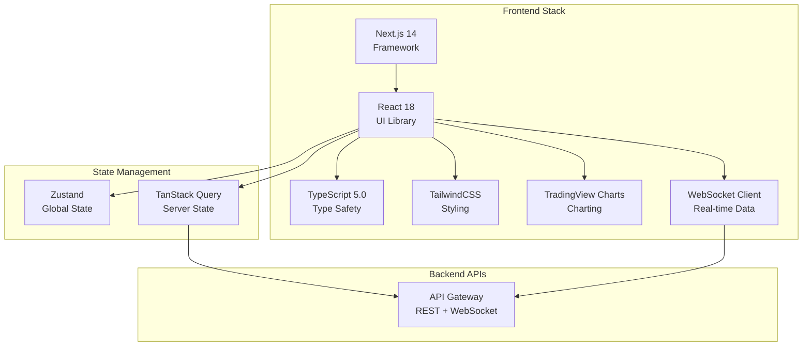
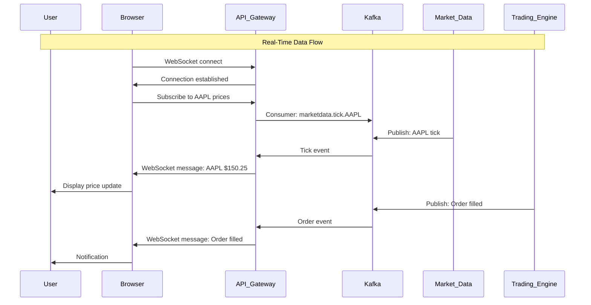
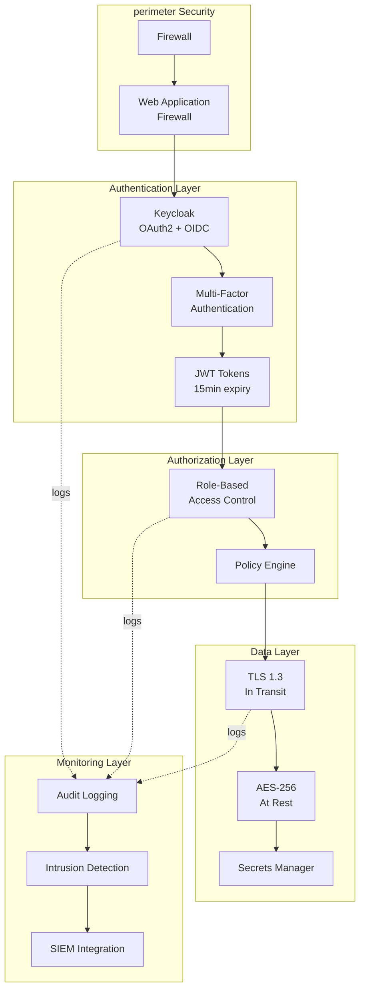
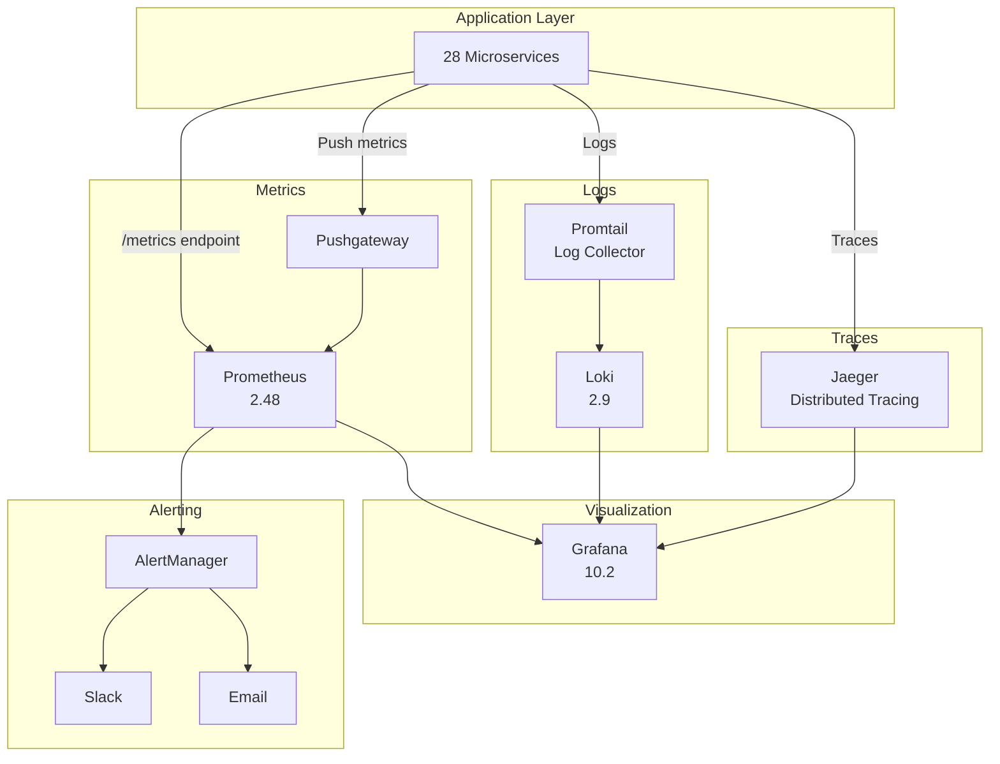

# Architecture Decision Records (ADRs) - Part 2

## ADRs 011-015

**Continued from**: phase01_architecture_decision_records.md  
**Document Version**: 1.0  
**Last Updated**: 2025-11-20

---

## ADR-011: Mono-Repo Strategy

**Status**: ✅ Accepted  
**Date**: 2025-11-20  
**Deciders**: System Architect, User

### Context

With 28 microservices, need to decide: mono-repo (single repository) vs. multi-repo (one repository per service).

### Decision

Use **mono-repo** strategy with all 28 services in single repository.

### Repository Structure

```
IBKR - Algo Trader/
├── services/
│   ├── trading-engine/
│   ├── market-data/
│   ├── risk-manager/
│   ├── fundamental-analysis/  (new in Phase 15.5)
│   └── ... (24 more services)
├── libs/
│   ├── common/  (shared code)
│   ├── core/
│   └── quant/
├── core_trading/  (legacy assets, to be migrated)
├── docs/
├── tests/
├── infrastructure/
│   ├── docker-compose.yml
│   ├── kubernetes/
│   └── terraform/
├── .github/workflows/  (CI/CD)
└── requirements.txt
```

### Rationale

**Mono-Repo Benefits**:

1. **Atomic Commits**: Change multiple services in single commit
2. **Code Sharing**: Easy to share code between services via `libs/`
3. **Refactoring**: Rename functions across services with confidence
4. **Single CI/CD**: One pipeline for all services
5. **Easier Onboarding**: Developers clone one repo, see entire system

**Why Not Multi-Repo**:

1. Cross-service changes require multiple PRs
2. Harder to keep shared libraries in sync
3. 28 repositories to manage (permissions, settings, etc.)
4. Dependency hell (versioning `libs` across repos)

### Mono-Repo Challenges & Solutions

| Challenge        | Solution                                             |
| ---------------- | ---------------------------------------------------- |
| Large repo size  | Git LFS for large files, shallow clones              |
| Long CI/CD times | Changed-files detection, only test affected services |
| Merge conflicts  | Clear service boundaries, PRs target specific areas  |
| Build complexity | Nx, Bazel, or Turborepo for incremental builds       |

### CI/CD Optimization

**Smart Testing** (only test changed services):

```yaml
# .github/workflows/test.yml
jobs:
  changes:
    runs-on: ubuntu-latest
    outputs:
      services: ${{ steps.changes.outputs.services }}
    steps:
      - uses: dorny/paths-filter@v2
        id: changes
        with:
          filters: |
            trading-engine: services/trading-engine/**
            market-data: services/market-data/**

  test:
    needs: changes
    runs-on: ubuntu-latest
    strategy:
      matrix:
        service: ${{ fromJSON(needs.changes.outputs.services) }}
    steps:
      - run: pytest services/${{ matrix.service }}/tests/
```

### Code Organization

**Shared Libraries** (`libs/common/`):

```python
# libs/common/events.py
class BaseEvent:
    event_id: str
    timestamp: datetime

class OrderFilledEvent(BaseEvent):
    order_id: str
    fill_price: Decimal
```

**Service Imports Shared Code**:

```python
# services/trading-engine/strategy.py
from libs.common.events import OrderFilledEvent
from libs.core.indicators import calculate_sma

def on_order_filled(event: OrderFilledEvent):
    signal = calculate_sma(event.symbol, period=20)
```

### Consequences

**Positive**:

- ✅ Single source of truth
- ✅ Easier cross-service refactoring
- ✅ Simplified dependency management
- ✅ Better code reuse

**Negative**:

- ⚠️ Larger initial clone (mitigated: shallow clone)
- ⚠️ Can become messy without discipline
- ⚠️ Build times can increase (mitigated: incremental builds)

### Alternatives Considered

1. **Multi-Repo (one per service)**
   - Rejected: 28 repos too complex, versioning nightmare
2. **Hybrid (mono-repo + separate repos for select services)**
   - Rejected: Inconsistent, confusion about where code lives

### Tools

- **Build Tool**: Python setuptools + pip-tools
- **Task Runner**: Make or Invoke for common tasks
- **CI/CD**: GitHub Actions with path filters
- **Code Search**: ripgrep, GitHub code search

---

## ADR-012: Next.js + React Frontend

**Status**: ✅ Accepted  
**Date**: 2025-11-20  
**Deciders**: System Architect, User

### Context

Need modern, responsive web frontend for trading platform accessible from desktop and mobile browsers.

### Decision

Use **Next.js 14** (React framework) with **TypeScript**, **TailwindCSS**, and **TradingView Lightweight Charts**.

### Technology Stack



### Rationale

**Next.js**:

1. **Server-Side Rendering (SSR)**: Better SEO, faster initial load
2. **API Routes**: Backend API endpoints in same repo
3. **File-based Routing**: Pages auto-generated from file structure
4. **Optimizations**: Image optimization, code splitting built-in
5. **Production-Ready**: Used by Vercel, Hulu, Twitch

**React**:

1. **Component Model**: Reusable UI components
2. **Ecosystem**: Massive library ecosystem
3. **Developer Experience**: Hot reload, DevTools

**TypeScript**:

1. **Type Safety**: Catch errors at compile time
2. **IntelliSense**: Better IDE autocomplete
3. **Refactoring**: Rename with confidence

**TailwindCSS**:

1. **Utility-First**: No context switching (HTML + CSS in same file)
2. **Responsive**: Mobile-first design
3. **Consistent**: Design system built-in

### Component Architecture

```
frontend/
├── src/
│   ├── app/  (Next.js 14 app router)
│   │   ├── (dashboard)/
│   │   │   ├── page.tsx  (Dashboard page)
│   │   │   └── layout.tsx
│   │   ├── strategies/
│   │   │   ├── page.tsx  (Strategy list)
│   │   │   └── [id]/page.tsx  (Strategy detail)
│   │   └── api/  (API routes)
│   ├── components/
│   │   ├── ui/  (Reusable components)
│   │   │   ├── Button.tsx
│   │   │   ├── Card.tsx
│   │   │   └── Chart.tsx
│   │   ├── features/  (Feature-specific)
│   │   │   ├── StrategyBuilder/
│   │   │   ├── TradingChart/
│   │   │   └── PortfolioDashboard/
│   ├── hooks/  (Custom React hooks)
│   │   ├── useWebSocket.ts
│   │   ├── useMarketData.ts
│   │   └── useAuth.ts
│   ├── stores/  (Zustand stores)
│   │   ├── authStore.ts
│   │   ├── marketStore.ts
│   │   └── portfolioStore.ts
│   └── lib/  (Utilities)
│       ├── api.ts
│       └── utils.ts
```

### Real-Time Data Integration

**WebSocket Hook**:

```typescript
// hooks/useMarketData.ts
import { useEffect, useState } from "react";

export function useMarketData(symbol: string) {
  const [price, setPrice] = useState<number | null>(null);

  useEffect(() => {
    const ws = new WebSocket("ws://localhost:8000/ws/market");

    ws.onmessage = (event) => {
      const data = JSON.parse(event.data);
      if (data.symbol === symbol) {
        setPrice(data.price);
      }
    };

    ws.send(JSON.stringify({ subscribe: symbol }));

    return () => ws.close();
  }, [symbol]);

  return price;
}
```

**Usage in Component**:

```typescript
// components/features/PriceDisplay.tsx
export function PriceDisplay({ symbol }: { symbol: string }) {
  const price = useMarketData(symbol);

  return (
    <div className="text-2xl font-bold">
      {price ? `$${price.toFixed(2)}` : "Loading..."}
    </div>
  );
}
```

### Chart Integration

**TradingView Lightweight Charts**:

```typescript
// components/features/TradingChart/index.tsx
import { createChart } from "lightweight-charts";
import { useEffect, useRef } from "react";

export function TradingChart({ data }: { data: OHLCV[] }) {
  const chartRef = useRef<HTMLDivElement>(null);

  useEffect(() => {
    if (!chartRef.current) return;

    const chart = createChart(chartRef.current, {
      width: chartRef.current.clientWidth,
      height: 400,
    });

    const candlestickSeries = chart.addCandlestickSeries();
    candlestickSeries.setData(data);

    return () => chart.remove();
  }, [data]);

  return <div ref={chartRef} />;
}
```

### State Management

**Global State (Zustand)**:

```typescript
// stores/portfolioStore.ts
import { create } from "zustand";

interface PortfolioState {
  positions: Position[];
  totalValue: number;
  addPosition: (position: Position) => void;
}

export const usePortfolioStore = create<PortfolioState>((set) => ({
  positions: [],
  totalValue: 0,
  addPosition: (position) =>
    set((state) => ({
      positions: [...state.positions, position],
    })),
}));
```

**Server State (TanStack Query)**:

```typescript
// hooks/useStrategies.ts
import { useQuery } from "@tanstack/react-query";

export function useStrategies() {
  return useQuery({
    queryKey: ["strategies"],
    queryFn: async () => {
      const res = await fetch("/api/v1/strategies");
      return res.json();
    },
    refetchInterval: 5000, // Refetch every 5 seconds
  });
}
```

### Consequences

**Positive**:

- ✅ Modern developer experience
- ✅ Excellent performance (Next.js optimizations)
- ✅ Type safety (TypeScript)
- ✅ Production-grade charting (TradingView)
- ✅ Mobile responsive (TailwindCSS)

**Negative**:

- ⚠️ Learning curve for Next.js App Router (new in v14)
- ⚠️ TradingView Lightweight Charts has limitations (vs full TradingView)
- ⚠️ Need to manage WebSocket connections carefully

### Alternatives Considered

1. **Vue.js + Nuxt**
   - Rejected: Smaller ecosystem than React
2. **Svelte + SvelteKit**
   - Rejected: Newer, smaller community, less charting libraries
3. **Angular**
   - Rejected: More opinionated, steeper learning curve

### Mobile Support

**React Native** (separate app, Phase 18):

- Share business logic with web (same TypeScript)
- Native mobile performance
- React Native WebView for charts

---

## ADR-013: Real-Time Data Streaming

**Status**: ✅ Accepted  
**Date**: 2025-11-20  
**Deciders**: System Architect, User

### Context

Trading platform requires real-time streaming of market data, order updates, and portfolio changes to users with <1s latency.

### Decision

Use **WebSocket** for user-facing real-time updates, **Kafka** for backend event streaming.

### Architecture



### WebSocket API Design

**Connection Endpoint**:

```
ws://localhost:8000/ws/stream
```

**Subscription Protocol** (JSON):

```json
// Client → Server (Subscribe)
{
  "action": "subscribe",
  "channel": "marketdata",
  "symbols": ["AAPL", "GOOGL", "MSFT"]
}

// Server → Client (Data)
{
  "channel": "marketdata",
  "symbol": "AAPL",
  "price": 150.25,
  "volume": 1000000,
  "timestamp": 1700000000
}

// Client → Server (Unsubscribe)
{
  "action": "unsubscribe",
  "channel": "marketdata",
  "symbols": ["AAPL"]
}
```

### Backend Implementation

**WebSocket Server** (FastAPI):

```python
# services/api-gateway/websocket.py
from fastapi import WebSocket, WebSocketDisconnect
from aiokafka import AIOKafkaConsumer
import asyncio

class WebSocketManager:
    def __init__(self):
        self.active_connections: dict[str, WebSocket] = {}
        self.subscriptions: dict[str, set[str]] = {}

    async def connect(self, websocket: WebSocket, client_id: str):
        await websocket.accept()
        self.active_connections[client_id] = websocket

    async def subscribe(self, client_id: str, symbol: str):
        if client_id not in self.subscriptions:
            self.subscriptions[client_id] = set()
        self.subscriptions[client_id].add(symbol)

    async def broadcast_market_data(self):
        consumer = AIOKafkaConsumer(
            'marketdata.tick.*',
            bootstrap_servers='kafka:9092'
        )
        await consumer.start()

        async for msg in consumer:
            data = json.loads(msg.value)
            symbol = data['symbol']

            # Send to subscribed clients
            for client_id, subscriptions in self.subscriptions.items():
                if symbol in subscriptions:
                    websocket = self.active_connections[client_id]
                    await websocket.send_json(data)

manager = WebSocketManager()

@app.websocket("/ws/stream")
async def websocket_endpoint(websocket: WebSocket):
    client_id = str(uuid.uuid4())
    await manager.connect(websocket, client_id)

    try:
        while True:
            # Receive subscription requests
            data = await websocket.receive_json()

            if data['action'] == 'subscribe':
                for symbol in data['symbols']:
                    await manager.subscribe(client_id, symbol)

    except WebSocketDisconnect:
        manager.active_connections.pop(client_id)
        manager.subscriptions.pop(client_id, None)
```

### Frontend Integration

**WebSocket Hook**:

```typescript
// hooks/useRealtimeData.ts
import { useEffect, useState } from "react";

interface MarketTick {
  symbol: string;
  price: number;
  volume: number;
  timestamp: number;
}

export function useRealtimeMarketData(symbols: string[]) {
  const [ticks, setTicks] = useState<Record<string, MarketTick>>({});
  const [connected, setConnected] = useState(false);

  useEffect(() => {
    const ws = new WebSocket("ws://localhost:8000/ws/stream");

    ws.onopen = () => {
      setConnected(true);
      ws.send(
        JSON.stringify({
          action: "subscribe",
          channel: "marketdata",
          symbols,
        })
      );
    };

    ws.onmessage = (event) => {
      const tick = JSON.parse(event.data);
      setTicks((prev) => ({
        ...prev,
        [tick.symbol]: tick,
      }));
    };

    ws.onclose = () => setConnected(false);

    return () => {
      ws.send(
        JSON.stringify({
          action: "unsubscribe",
          channel: "marketdata",
          symbols,
        })
      );
      ws.close();
    };
  }, [symbols]);

  return { ticks, connected };
}
```

### Data Channels

| Channel      | Purpose           | Update Frequency     | Example Payload                  |
| ------------ | ----------------- | -------------------- | -------------------------------- |
| `marketdata` | Live prices       | Real-time (100ms)    | `{symbol, price, volume}`        |
| `orders`     | Order updates     | On state change      | `{order_id, status, filled_qty}` |
| `portfolio`  | Portfolio changes | On position change   | `{total_value, positions}`       |
| `signals`    | Trading signals   | On signal generation | `{symbol, signal, confidence}`   |
| `alerts`     | System alerts     | On alert trigger     | `{level, message, timestamp}`    |

### Scalability

**Connection Limits**:

- API Gateway: 10,000 concurrent WebSocket connections per instance
- Scale horizontally with load balancer
- Use Redis for shared subscription state across instances

**Message Rate Limiting**:

```python
# Rate limit per client
from aiocache import Cache
cache = Cache(Cache.REDIS)

async def rate_limit(client_id: str) -> bool:
    key = f"rate_limit:{client_id}"
    count = await cache.increment(key)
    if count == 1:
        await cache.expire(key, 1)  # 1 second window
    return count <= 100  # Max 100 messages/sec per client
```

### Consequences

**Positive**:

- ✅ Real-time user experience (<100ms latency)
- ✅ Efficient (duplex connection, no polling)
- ✅ Scalable (horizontal scaling)
- ✅ Standard protocol (WebSocket)

**Negative**:

- ⚠️ Connection management complexity
- ⚠️ Need reconnection logic on client
- ⚠️ Firewall/proxy issues with WebSockets
- ⚠️ State synchronization across instances

### Alternatives Considered

1. **Server-Sent Events (SSE)**
   - Rejected: Unidirectional, can't send commands from client
2. **HTTP Long Polling**
   - Rejected: Higher latency, more overhead
3. **gRPC Streaming**
   - Rejected: Not browser-native, needs proxy

---

## ADR-014: Zero-Trust Security Architecture

**Status**: ✅ Accepted  
**Date**: 2025-11-20  
**Deciders**: System Architect, User

### Context

Trading platform handles sensitive financial data and executes real money trades. Must meet institutional security standards.

### Decision

Implement **Zero-Trust Security Architecture** with defense-in-depth strategy.

### Security Layers



### Authentication

**OAuth2 + OpenID Connect** (via Keycloak):

```python
# services/api-gateway/auth.py
from fastapi import Depends, HTTPException, status from fastapi.security import OAuth2PasswordBearer

oauth2_scheme = OAuth2PasswordBearer(tokenUrl="token")

async def get_current_user(token: str = Depends(oauth2_scheme)):
    try:
        payload = jwt.decode(token, PUBLIC_KEY, algorithms=["RS256"])
        user_id = payload.get("sub")
        if user_id is None:
            raise HTTPException(status_code=401, detail="Invalid token")
        return await get_user(user_id)
    except JWTError:
        raise HTTPException(status_code=401, detail="Invalid token")

@app.get("/api/v1/portfolio")
async def get_portfolio(user: User = Depends(get_current_user)):
    return await fetch_portfolio(user.id)
```

**JWT Structure**:

```json
{
  "sub": "user-123", // User ID  "email": "user@example.com",
  "roles": ["trader", "admin"],
  "exp": 1700000900, // Expires in 15 minutes
  "iat": 1700000000,
  "iss": "https://auth.trading.com"
}
```

### Authorization (RBAC)

**Roles**:

- `viewer`: Read-only access (view portfolio, strategies)
- `trader`: Execute paper trades, create strategies
- `live_trader`: Execute live trades (requires approval)
- `admin`: Full system access

**Permissions Matrix**:
| Resource | Viewer | Trader | Live Trader | Admin |
|-------------------|--------|--------|-------------|-------|
| View Portfolio | ✅ | ✅ | ✅ | ✅ |
| Create Strategy | ❌ | ✅ | ✅ | ✅ |
| Paper Trade | ❌ | ✅ | ✅ | ✅ |
| Live Trade | ❌ | ❌ | ✅ | ✅ |
| Manage Users | ❌ | ❌ | ❌ | ✅ |

**Policy Enforcement**:

```python
# libs/common/auth.py
from functools import wraps

def require_role(role: str):
    def decorator(func):
        @wraps(func)
        async def wrapper(*args, user: User = Depends(get_current_user), **kwargs):
            if role not in user.roles:
                raise HTTPException(status_code=403, detail="Insufficient permissions")
            return await func(*args, user=user, **kwargs)
        return wrapper
    return decorator

@app.post("/api/v1/orders/live")
@require_role("live_trader")
async def create_live_order(order: OrderCreate, user: User):
    return await execute_live_order(order, user)
```

### Encryption

**In Transit** (TLS 1.3):

- All HTTP traffic over HTTPS
- WebSocket over WSS (WebSocket Secure)
- Inter-service communication over mTLS (mutual TLS)

**At Rest** (AES-256):

```python
# libs/common/encryption.py
from cryptography.fernet import Fernet

class DataEncryptor:
    def __init__(self, key: bytes):
        self.cipher = Fernet(key)

    def encrypt(self, data: str) -> str:
        return self.cipher.encrypt(data.encode()).decode()

    def decrypt(self, encrypted: str) -> str:
        return self.cipher.decrypt(encrypted.encode()).decode()

# Encrypt sensitive fields in database
class BrokerCredentials(Base):
    __tablename__ = "broker_credentials"

    user_id = Column(String, primary_key=True)
    api_key_encrypted = Column(String)  # Encrypted with Fernet
    api_secret_encrypted = Column(String)
```

**Secrets Management**:

```yaml
# docker-compose.yml
services:
  vault:
    image: vault:1.15
    environment:
      VAULT_DEV_ROOT_TOKEN_ID: ${VAULT_ROOT_TOKEN}
    volumes:
      - ./secrets:/vault/secrets

  trading-engine:
    environment:
      IBKR_API_KEY: ${VAULT_ADDR}/secret/ibkr/api_key
      DATABASE_PASSWORD: ${VAULT_ADDR}/secret/db/password
```

### Audit Logging

**Immutable Audit Trail** (ClickHouse):

```python
# services/audit/logger.py
async def audit_log(
    user_id: str,
    action: str,
    resource_type: str,
    resource_id: str,
    details: dict
):
    log_entry = {
        "timestamp": datetime.utcnow(),
        "user_id": user_id,
        "action": action,  # CREATE, UPDATE, DELETE, EXECUTE
        "resource_type": resource_type,  # ORDER, STRATEGY, PORTFOLIO
        "resource_id": resource_id,
        "details": json.dumps(details),
        "ip_address": get_client_ip(),
        "user_agent": get_user_agent()
    }

    await clickhouse.insert("audit_log", log_entry)
    await kafka.publish("system.audit.logged", log_entry)
```

**Audit Queries**:

```sql
-- All actions by user
SELECT * FROM audit_log
WHERE user_id = 'user-123'
ORDER BY timestamp DESC
LIMIT 100;

-- All live trades
SELECT * FROM audit_log
WHERE action = 'EXECUTE'
  AND resource_type = 'ORDER'
  AND details LIKE '%live%'
ORDER BY timestamp DESC;

-- Suspicious activity (many failed logins)
SELECT user_id, COUNT(*) as failed_logins
FROM audit_log
WHERE action = 'LOGIN_FAILED'
  AND timestamp > now() - INTERVAL 1 HOUR
GROUP BY user_id
HAVING failed_logins > 5;
```

### Network Security

**Firewall Rules**:

```bash
# Allow only necessary ports
ufw allow 443/tcp  # HTTPS
ufw allow 8000/tcp  # API Gateway (internal)
ufw deny 5432/tcp  # PostgreSQL (block external)
ufw deny 9092/tcp  # Kafka (block external)
```

**API Rate Limiting**:

```python
# middleware/rate_limit.py
from slowapi import Limiter
from slowapi.util import get_remote_address

limiter = Limiter(key_func=get_remote_address)

@app.get("/api/v1/market-data")
@limiter.limit("100/minute")  # Max 100 requests per minute
async def get_market_data(request: Request):
    return await fetch_data()
```

### Compliance

**SOC 2 Compliance**:

- ✅ Access controls (RBAC)
- ✅ Encryption (transit + rest)
- ✅ Audit logging (immutable)
- ✅ Change management (Git versioning)
- ✅ Incident response (monitoring + alerts)

**GDPR Compliance**:

- ✅ Right to access (user can download data)
- ✅ Right to deletion (user can request account deletion)
- ✅ Data minimization (only collect necessary data)
- ✅ Consent management (explicit opt-in)

### Consequences

**Positive**:

- ✅ Institutional-grade security
- ✅ Compliance-ready (SOC 2, GDPR)
- ✅ Complete audit trail
- ✅ Defense-in-depth

**Negative**:

- ⚠️ Higher complexity
- ⚠️ Performance overhead (encryption, auth checks)
- ⚠️ More infrastructure (Keycloak, Vault)

---

## ADR-015: Prometheus + Grafana Observability

**Status**: ✅ Accepted  
**Date**: 2025-11-20  
**Deciders**: System Architect, User

### Context

28 microservices require comprehensive observability: metrics, logs, traces, and dashboards.

### Decision

Use **Prometheus** (metrics) + **Grafana** (dashboards) + **Loki** (logs) + **Jaeger** (traces).

### Observability Stack



### Metrics (Prometheus)

**Service Instrumentation**:

```python
# services/trading-engine/metrics.py
from prometheus_client import Counter, Histogram, Gauge, generate_latest

# Metrics
orders_total = Counter(
    'trading_orders_total',
    'Total number of orders',
    ['status', 'symbol']
)

order_latency = Histogram(
    'trading_order_latency_seconds',
    'Order execution latency',
    buckets=[0.0001, 0.0005, 0.001, 0.005, 0.01, 0.05, 0.1]
)

active_strategies = Gauge(
    'trading_active_strategies',
    'Number of active strategies'
)

# Usage
@app.post("/api/v1/orders")
async def create_order(order: OrderCreate):
    start = time.time()

    result = await execute_order(order)

    orders_total.labels(status=result.status, symbol=order.symbol).inc()
    order_latency.observe(time.time() - start)

    return result

# Expose metrics endpoint
@app.get("/metrics")
async def metrics():
    return Response(generate_latest(), media_type="text/plain")
```

**Key Metrics**:
| Metric | Type | Purpose |
|--------|------|---------|
| `trading_orders_total` | Counter | Total orders by status/symbol |
| `trading_order_latency_seconds` | Histogram | Order execution time |
| `market_data_events_total` | Counter | Market data events processed |
| `risk_limit_breaches_total` | Counter | Risk limit violations |
| `kafka_consumer_lag` | Gauge | Kafka consumer lag |
| `http_requests_total` | Counter | API requests |
| `http_request_duration_seconds` | Histogram | API latency |

### Logs (Loki)

**Structured Logging**:

```python
# libs/common/logging.py
import structlog

logger = structlog.get_logger()

class RequestLogger:
    async def log_request(self, request: Request, response: Response):
        logger.info(
            "http_request",
            method=request.method,
            path=request.url.path,
            status_code=response.status_code,
            duration_ms=(time.time() - request.state.start_time) * 1000,
            user_id=request.state.user_id
        )

# Usage
logger.info("order_executed",
    order_id="order-123",
    symbol="AAPL",
    quantity=100,
    filled_price=150.25,
    user_id="user-456"
)
```

**Log Aggregation** (Promtail):

```yaml
# promtail-config.yml
clients:
  - url: http://loki:3100/loki/api/v1/push

scrape_configs:
  - job_name: docker
    docker_sd_configs:
      - host: unix:///var/run/docker.sock
    relabel_configs:
      - source_labels:
          ["__meta_docker_container_label_com_docker_compose_service"]
        target_label: "service"
```

### Traces (Jaeger)

**Distributed Tracing**:

```python
# libs/common/tracing.py
from opentelemetry import trace
from opentelemetry.exporter.jaeger import JaegerExporter
from opentelemetry.sdk.trace import TracerProvider
from opentelemetry.sdk.trace.export import BatchSpanProcessor

# Setup
jaeger_exporter = JaegerExporter(
    agent_host_name="jaeger",
    agent_port=6831,
)

trace.set_tracer_provider(TracerProvider())
trace.get_tracer_provider().add_span_processor(
    BatchSpanProcessor(jaeger_exporter)
)

tracer = trace.get_tracer(__name__)

# Usage
@tracer.start_as_current_span("execute_order")
async def execute_order(order: OrderCreate):
    # Trace order execution across services
    with tracer.start_as_current_span("submit_to_broker"):
        broker_order_id = await broker.submit_order(order)

    with tracer.start_as_current_span("update_database"):
        await db.update_order(order.id, broker_order_id)

    return order
```

### Dashboards (Grafana)

**Trading Dashboard**:

```json
{
  "dashboard": {
    "title": "Trading System Overview",
    "panels": [
      {
        "title": "Orders Per Minute",
        "targets": [
          {
            "expr": "rate(trading_orders_total[1m])"
          }
        ]
      },
      {
        "title": "Order Latency (p95)",
        "targets": [
          {
            "expr": "histogram_quantile(0.95, trading_order_latency_seconds)"
          }
        ]
      },
      {
        "title": "Active Strategies",
        "targets": [
          {
            "expr": "trading_active_strategies"
          }
        ]
      },
      {
        "title": "Kafka Consumer Lag",
        "targets": [
          {
            "expr": "kafka_consumer_lag"
          }
        ]
      }
    ]
  }
}
```

### Alerting

**Alert Rules** (Prometheus):

```yaml
# alerts.yml
groups:
  - name: trading
    rules:
      - alert: HighOrderLatency
        expr: histogram_quantile(0.95, trading_order_latency_seconds) > 0.001
        for: 5m
        labels:
          severity: warning
        annotations:
          summary: "Order latency above 1ms"

      - alert: RiskLimitBreach
        expr: increase(risk_limit_breaches_total[5m]) > 0
        labels:
          severity: critical
        annotations:
          summary: "Risk limit breached"

      - alert: KafkaConsumerLag
        expr: kafka_consumer_lag > 10000
        for: 10m
        labels:
          severity: warning
        annotations:
          summary: "Kafka consumer lagging behind"
```

**AlertManager Configuration**:

```yaml
# alertmanager.yml
route:
  receiver: "default"
  routes:
    - match:
        severity: critical
      receiver: "slack-critical"
    - match:
        severity: warning
      receiver: "slack-warnings"

receivers:
  - name: "slack-critical"
    slack_configs:
      - api_url: "${SLACK_WEBHOOK_URL}"
        channel: "#trading-alerts-critical"
        title: "Critical Alert: {{ .GroupLabels.alertname }}"

  - name: "default"
    email_configs:
      - to: "ops@trading.com"
```

### Consequences

**Positive**:

- ✅ Complete observability (metrics, logs, traces)
- ✅ Real-time alerting
- ✅ Production-grade monitoring
- ✅ Open-source (no licensing costs)

**Negative**:

- ⚠️ More services to run (Prometheus, Grafana, Loki, Jaeger)
- ⚠️ Storage requirements for metrics/logs
- ⚠️ Learning curve for PromQL

---

**Document Complete**: All 15 ADRs Defined  
**Status**: Ready for Implementation  
**Next**: Create architecture diagrams document
