# Architecture Diagrams

## Phase 1: Agentic AI Algorithmic Trading System v5.0

**Document Version**: 1.0  
**Last Updated**: 2025-11-20  
**Status**: Active

---

## Table of Contents

1. [High-Level System Architecture](#1-high-level-system-architecture)
2. [Microservices Architecture](#2-microservices-architecture)
3. [Data Flow Architecture](#3-data-flow-architecture)
4. [Event-Driven Architecture](#4-event-driven-architecture)
5. [Database Architecture](#5-database-architecture)
6. [Network Topology](#6-network-topology)
7. [Deployment Architecture](#7-deployment-architecture)
8. [Security Architecture](#8-security-architecture)
9. [AI/ML Pipeline Architecture](#9-aiml-pipeline-architecture)
10. [Fundamental Analysis System Architecture](#10-fundamental-analysis-system-architecture)

---

## 1. High-Level System Architecture

### Overview

The system is designed as a cloud-native, microservices-based trading platform with event-driven architecture.

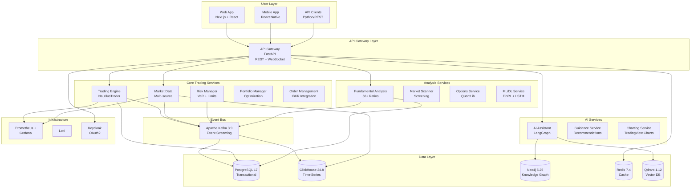

### Technology Summary

| Layer              | Technology                                   | Purpose                    |
| ------------------ | -------------------------------------------- | -------------------------- |
| **Frontend**       | Next.js 14, React 18, TypeScript             | Web UI                     |
| **API Gateway**    | FastAPI, WebSocket API is                    | REST + Real-time API       |
| **Trading Engine** | NautilusTrader 1.195+                        | High-performance execution |
| **Event Bus**      | Apache Kafka 3.9 (KRaft)                     | Event streaming            |
| **Databases**      | PostgreSQL, ClickHouse, Neo4j, Redis, Qdrant | Polyglot persistence       |
| **AI Framework**   | LangGraph, LangChain, PyTorch                | Multi-agent AI             |
| **Monitoring**     | Prometheus, Grafana, Loki                    | Observability              |

---

## 2. Microservices Architecture

### All 28 Microservices

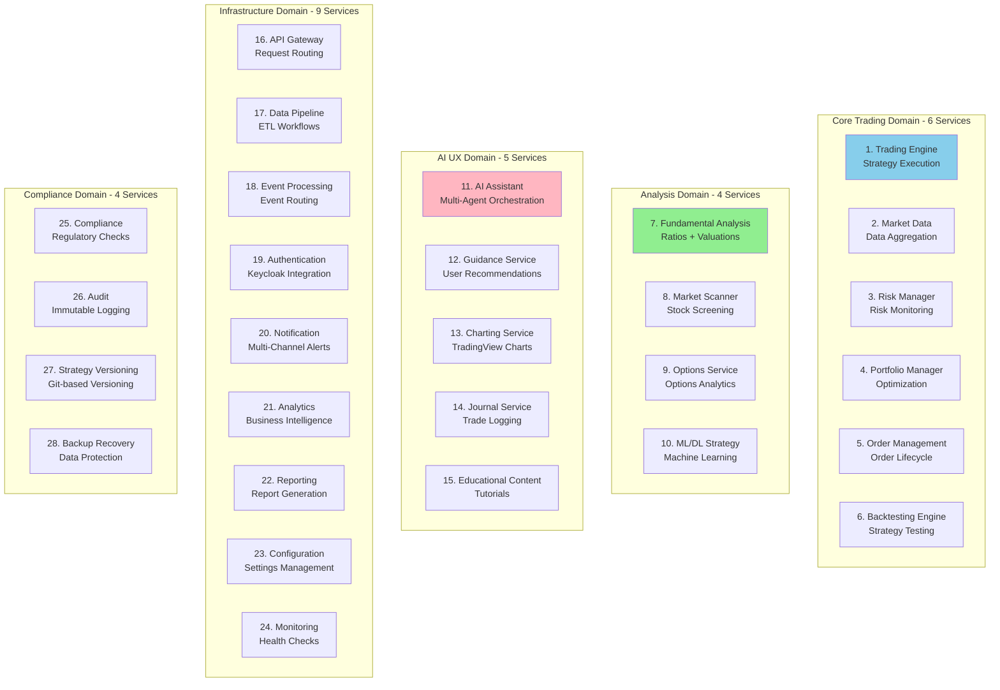

Legend:

- 🟦 Blue: Core Trading Services
- 🟩 Green: Analysis Services (includes Fundamental Analysis - NEW)
- 🟥 Pink: AI & UX Services
- ⬜ Gray: Infrastructure & Compliance

### Service Communication Patterns

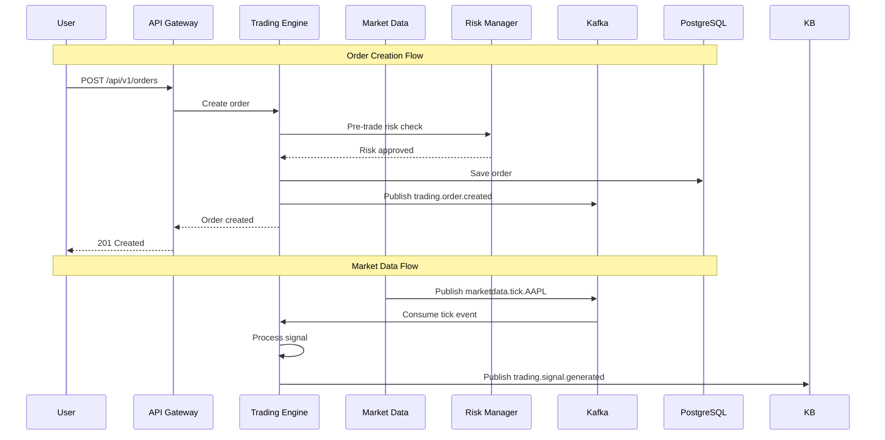

---

## 3. Data Flow Architecture

### Real-Time Market Data Flow

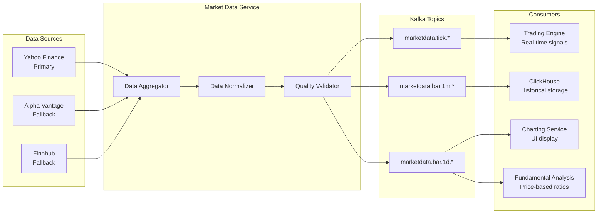

### Order Execution Data Flow

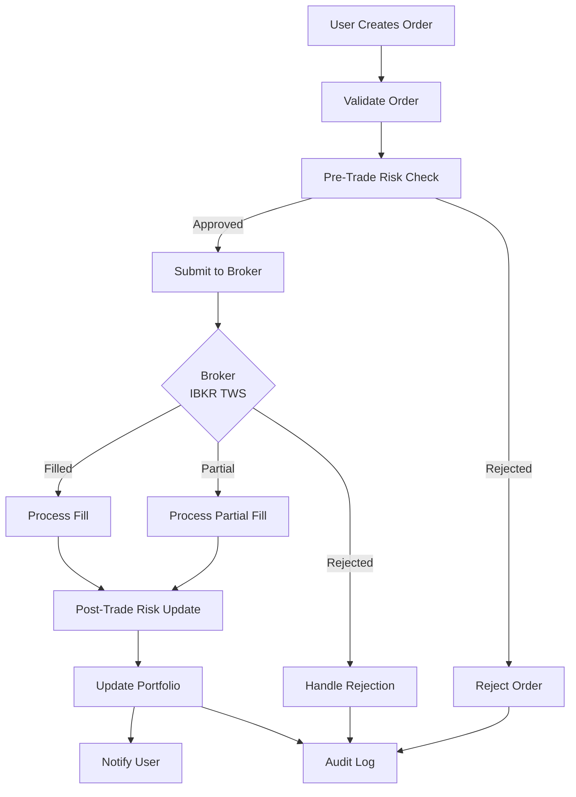

---

## 4. Event-Driven Architecture

### Kafka Topic Hierarchy

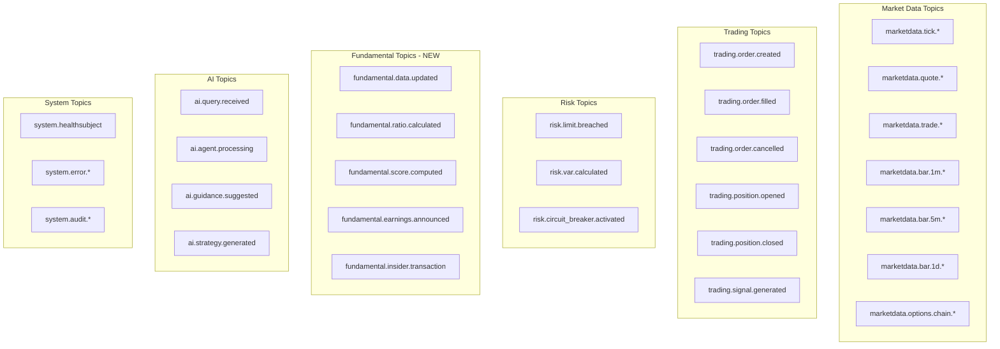

### Event Flow Pattern

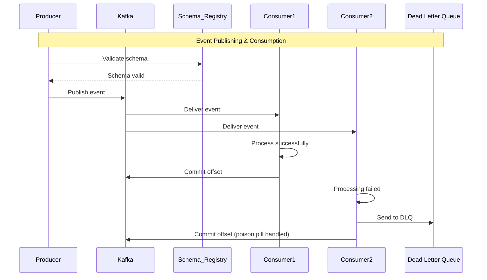

---

## 5. Database Architecture

### Polyglot Persistence Strategy

```mermaid
graph TB
    subgraph "Application Services"
        APP[28 Microservices]
    end

    subgraph "Database 1: PostgreSQL 17 + pgvector"
        PG_TRADING[Trading Schema<br/>orders, trades, positions]
        PG_PORTFOLIO[Portfolio Schema<br/>holdings, performance]
        PG_USER[User Schema<br/>users, roles, sessions]
        PG_FUNDAMENTAL[Fundamental Schema<br/>statements, ratios, scores]
        PG_VECTOR[Vector Embeddings<br/>pgvector extension]
    end

    subgraph "Database 2: ClickHouse 24.8"
        CH_TICK[market_data_tick<br/>90 days retention]
        CH_1MIN[market_data_1min<br/>2 years retention]
        CH_DAILY[market_data_daily<br/>10 years retention]
        CH_AUDIT[audit_log<br/>7 years retention]
    end

    subgraph "Database 3: Neo4j 5.25.0"
        NEO_STRATEGY[Strategy Nodes]
        NEO_AGENT[Agent Nodes]
        NEO_WORKFLOW[Workflow Relationships]
    end

    subgraph "Database 4: Redis 7.4"
        REDIS_MARKET[Real-time Market Cache<br/>5s TTL]
        REDIS_SESSION[User Sessions<br/>24h TTL]
        REDIS_INDICATORS[Indicator Cache<br/>1min-1day TTL]
    end

    subgraph "Database 5: Qdrant 1.12.0"
        QDRANT_STRATEGY[Strategy Embeddings]
        QDRANT_DOCS[Document Embeddings]
        QDRANT_CONVERSATION[Conversation Embeddings]
    end

    APP --> PG_TRADING
    APP --> PG_FUNDAMENTAL
    APP --> CH_TICK
    APP --> NEO_STRATEGY
    APP --> REDIS_MARKET
    APP --> QDRANT_STRATEGY
```

### Data Synchronization

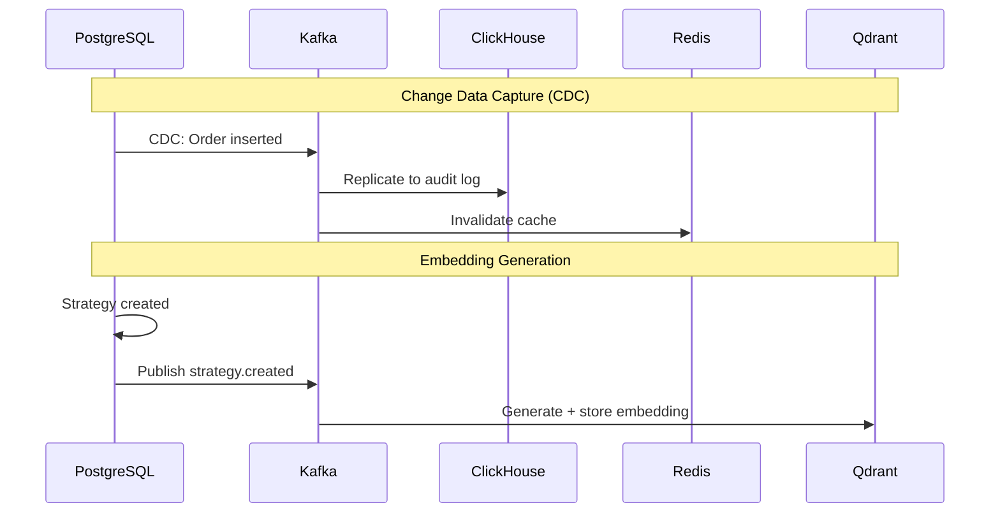

---

## 6. Network Topology

### Docker Compose Network (Development)

```mermaid
graph TB
    subgraph "Host: Lenovo Legion 5 Pro"
        subgraph "Docker Network: trading_network"
            subgraph "Application Tier"
                API[API Gateway<br/>:8000]
                TRADING[Trading Engine<br/>:8001]
                MARKET[Market Data<br/>:8002]
                FA[Fundamental Analysis<br/>:8003]
            end

            subgraph"Data Tier"
                PG[(PostgreSQL<br/>:5432)]
                CH[(ClickHouse<br/>:8123)]
                KAFKA[Kafka<br/>:9092]
                REDIS[(Redis<br/>:6379)]
            end

            subgraph "Monitoring Tier"
                PROM[Prometheus<br/>:9090]
                GRAFANA[Grafana<br/>:3000]
            end
        end

        GPU[NVIDIA RTX 3060<br/>GPU Access]
    end

    EXTERNAL[External APIs<br/>Yahoo, Alpha Vantage, IBKR] -.TLS 1.3.-> API

    API --> TRADING
    API --> MARKET
    API --> FA

    TRADING --> KAFKA
    MARKET --> KAFKA

    KAFKA --> PG
    KAFKA --> CH

    TRADING --> REDIS

    TRADING -.GPU.-> GPU
    FA -.metrics.-> PROM
    PROM --> GRAFANA
```

### Production Network (Kubernetes - Optional)

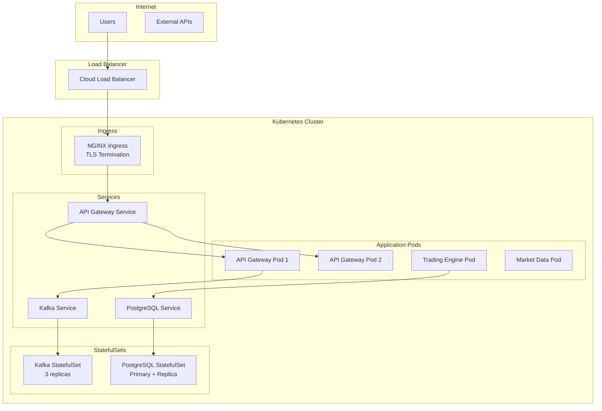

---

## 7. Deployment Architecture

### Deployment Profiles

```mermaid
graph TB
    subgraph "Profile 1: Local Development"
        LAPTOP1[Lenovo Legion 5 Pro<br/>64GB RAM, RTX 3060]
        DOCKER_COMPOSE1[Docker Compose<br/>28 services + 5 databases]
        LAPTOP1 --> DOCKER_COMPOSE1
    end

    subgraph "Profile 2: Paper Trading"
        LAPTOP2[Lenovo Legion 5 Pro]
        DOCKER_COMPOSE2[Docker Compose<br/>Production mode]
        BACKUP_VPS[Optional VPS Backup<br/>$50/month]

        LAPTOP2 --> DOCKER_COMPOSE2
        DOCKER_COMPOSE2 -.optional backup.-> BACKUP_VPS
    end

    subgraph "Profile 3: Live Trading (Small)"
        LAPTOP3[Lenovo Legion 5 Pro<br/>Primary]
        VPS1[VPS Backup<br/>DigitalOcean/Vultr<br/>$50-100/month]

        LAPTOP3 --> VPS1
    end

    subgraph "Profile 4: Production (Scaling)"
        K8S_CLUSTER[Kubernetes Cluster<br/>AWS/GCP/DO<br/>$100-300/month]
        MULTI_REGION[Multi-Region<br/>Low Latency]

        K8S_CLUSTER --> MULTI_REGION
    end

    style LAPTOP1 fill:#90EE90
    style LAPTOP2 fill:#87CEEB
    style LAPTOP3 fill:#FFD700
    style K8S_CLUSTER fill:#FFB6C1
```

**Cost Progression**:

- Development: $0-10/month (laptop-only)
- Paper Trading: $10-40/month (laptop + optional backup)
- Live Trading: $50-100/month (laptop + VPS)
- Production: $100-300/month (Kubernetes cluster)

### CI/CD Pipeline

```mermaid
flowchart LR
    CODE[Code Push<br/>GitHub] --> LINT[Linting<br/>Black, isort]
    LINT --> UNIT[Unit Tests<br/>pytest]
    UNIT --> INTEGRATION[Integration Tests<br/>testcontainers]
    INTEGRATION --> SECURITY[Security Scan<br/>Bandit, Safety]
    SECURITY --> BUILD[Build Docker Images]
    BUILD --> PUSH[Push to Registry]

    PUSH --> DEPLOY_DEV{Deploy to Dev?}
    DEPLOY_DEV -->|Auto| DEV[Dev Environment<br/>Docker Compose]

    DEV --> DEPLOY_STAGING{Deploy to Staging?}
    DEPLOY_STAGING -->|Manual Approval| STAGING[Staging Environment<br/>Kubernetes]

    STAGING --> E2E[E2E Tests]
    E2E --> DEPLOY_PROD{Deploy to Prod?}
    DEPLOY_PROD -->|Manual Approval| PROD[Production<br/>Kubernetes]
```

---

## 8. Security Architecture

### Defense-in-Depth Layers

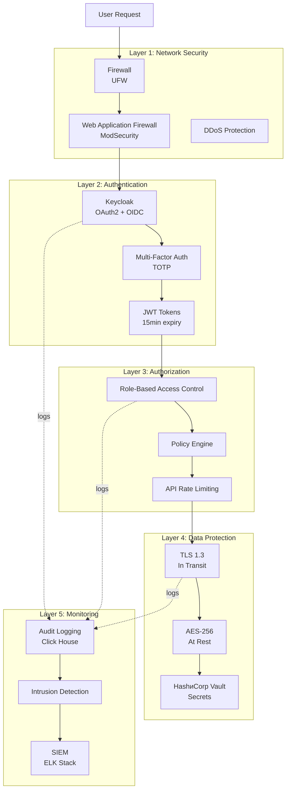

### Authentication Flow

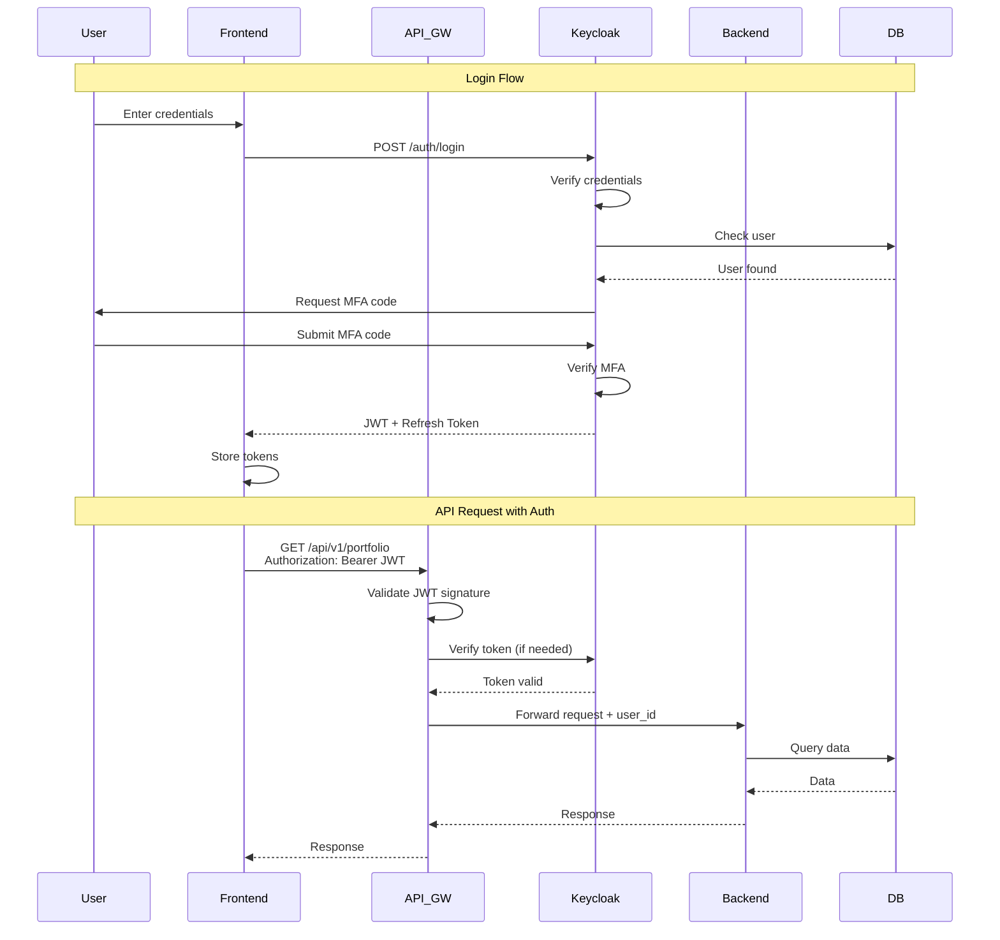

---

## 9. AI/ML Pipeline Architecture

### Multi-Agent AI System

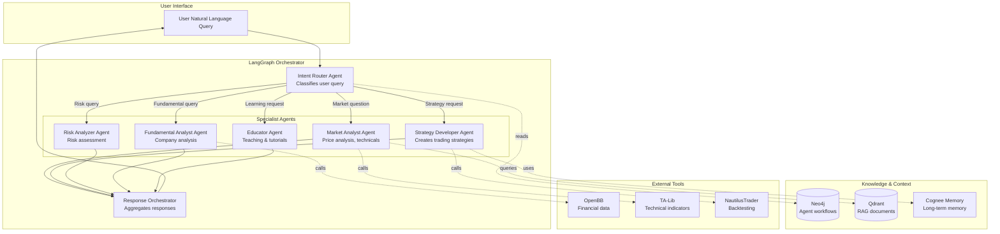

### ML/DL Training Pipeline

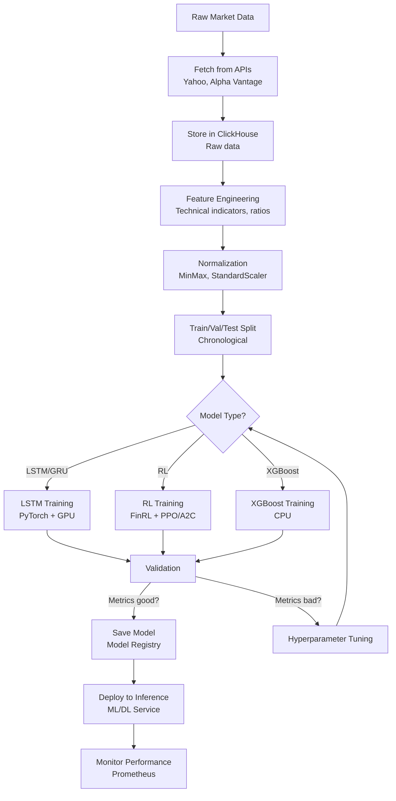

---

## 10. Fundamental Analysis System Architecture

### Phase 15.5 Architecture (NEW)

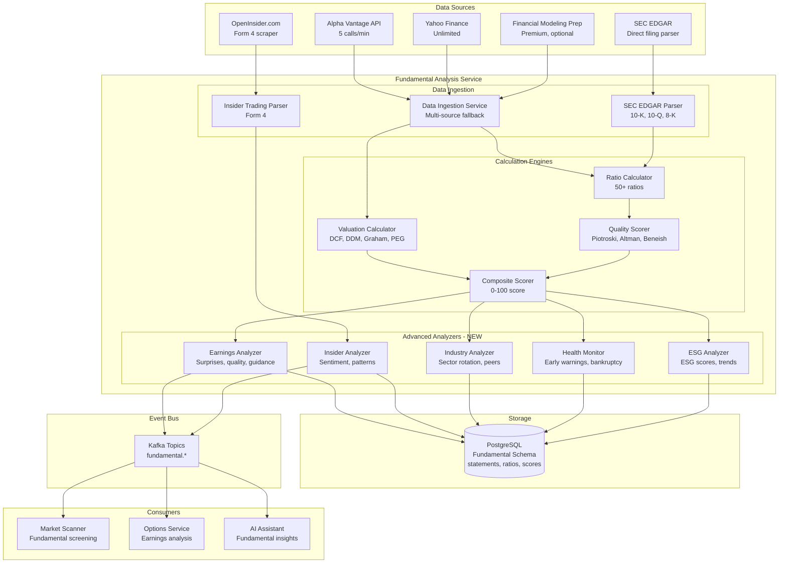

### Fundamental Data Flow

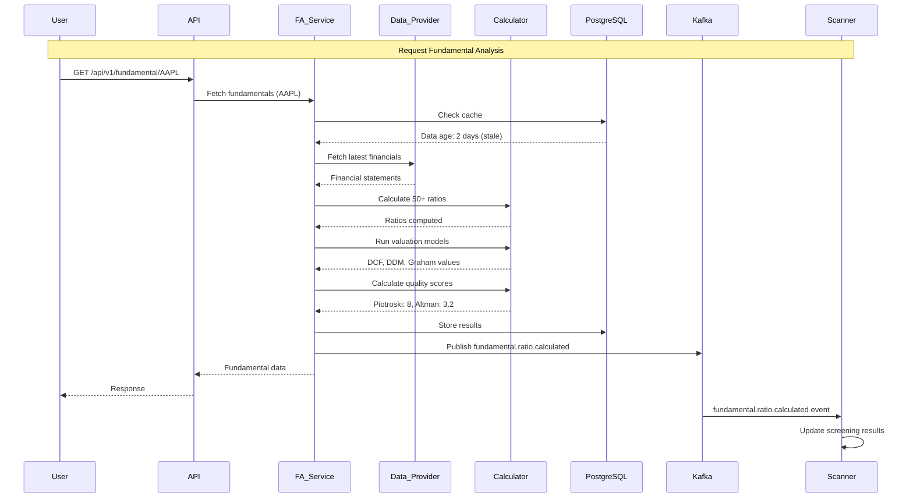

---

## Appendix: Key Performance Targets

| Component                      | Target         | Measurement                      |
| ------------------------------ | -------------- | -------------------------------- |
| **Order Execution Latency**    | <100μs         | p95 latency from signal to order |
| **Market Data Ingestion**      | >1M events/sec | Kafka throughput                 |
| **Real-Time UI Updates**       | <100ms         | WebSocket latency                |
| **Database Query (OLTP)**      | <10ms          | PostgreSQL p95                   |
| **Database Query (Analytics)** | <100ms         | ClickHouse 1B rows               |
| **API Response Time**          | <200ms         | REST API p95                     |
| **Test Coverage**              | >95%           | All microservices                |
| **System Uptime**              | 99.9%          | During market hours              |

---

**Document Status**: All 10 Architecture Diagrams Complete  
**Created**: 2025-11-20  
**Tools**: Mermaid diagrams for all visualizations  
**Next**: Implementation execution
