# Security Architecture & Implementation Guide

**Document Version**: 1.0.0  
**Last Updated**: 27 January 2025  
**Classification**: Internal Use  
**Owner**: Security Architecture Team

## Executive Summary

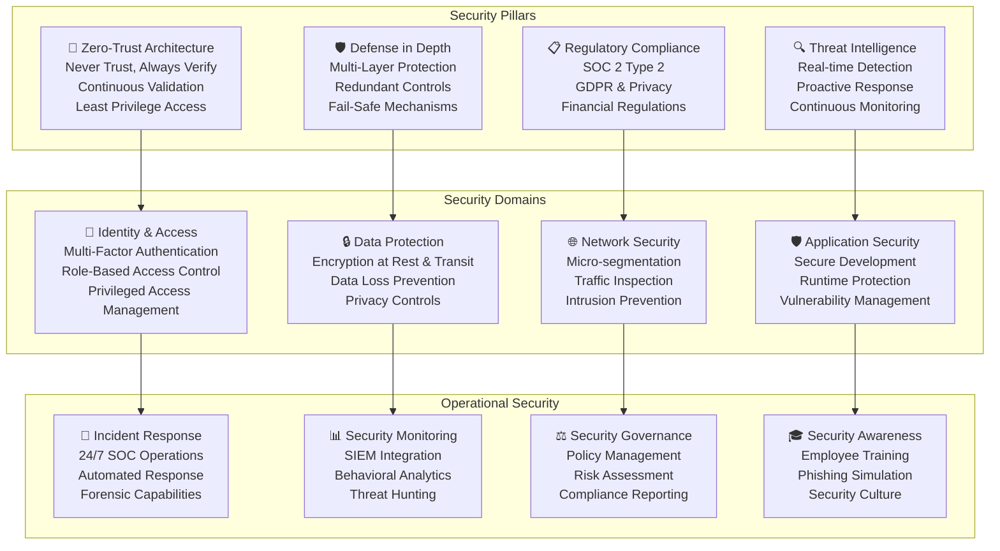
```mermaid
graph TB
    subgraph "Security Pillars"
        ZERO_TRUST[🔐 Zero-Trust Architecture<br/>Never Trust, Always Verify<br/>Continuous Validation<br/>Least Privilege Access]
        DEFENSE_DEPTH[🛡️ Defense in Depth<br/>Multi-Layer Protection<br/>Redundant Controls<br/>Fail-Safe Mechanisms]
        COMPLIANCE[📋 Regulatory Compliance<br/>SOC 2 Type 2<br/>GDPR & Privacy<br/>Financial Regulations]
        THREAT_INTEL[🔍 Threat Intelligence<br/>Real-time Detection<br/>Proactive Response<br/>Continuous Monitoring]
    end
    
    subgraph "Security Domains"
        IDENTITY[👤 Identity & Access<br/>Multi-Factor Authentication<br/>Role-Based Access Control<br/>Privileged Access Management]
        DATA_PROTECTION[🔒 Data Protection<br/>Encryption at Rest & Transit<br/>Data Loss Prevention<br/>Privacy Controls]
        NETWORK_SEC[🌐 Network Security<br/>Micro-segmentation<br/>Traffic Inspection<br/>Intrusion Prevention]
        APP_SEC[🛡️ Application Security<br/>Secure Development<br/>Runtime Protection<br/>Vulnerability Management]
    end
    
    subgraph "Operational Security"
        INCIDENT[🚨 Incident Response<br/>24/7 SOC Operations<br/>Automated Response<br/>Forensic Capabilities]
        MONITORING[📊 Security Monitoring<br/>SIEM Integration<br/>Behavioral Analytics<br/>Threat Hunting]
        GOVERNANCE[⚖️ Security Governance<br/>Policy Management<br/>Risk Assessment<br/>Compliance Reporting]
        TRAINING[🎓 Security Awareness<br/>Employee Training<br/>Phishing Simulation<br/>Security Culture]
    end
    
    ZERO_TRUST --> IDENTITY
    DEFENSE_DEPTH --> DATA_PROTECTION
    COMPLIANCE --> NETWORK_SEC
    THREAT_INTEL --> APP_SEC
    
    IDENTITY --> INCIDENT
    DATA_PROTECTION --> MONITORING
    NETWORK_SEC --> GOVERNANCE
    APP_SEC --> TRAINING
```

This document provides comprehensive security architecture, implementation guidelines, and operational procedures for the Algorithmic Trading System (ATS). The security framework is designed to protect sensitive financial data, ensure regulatory compliance, and maintain system integrity in a high-threat environment.

## Security Architecture Overview

### Multi-Layer Security Model

```mermaid
graph TB
    subgraph "External Perimeter"
        INTERNET[🌐 Internet<br/>External Threats<br/>Malicious Traffic<br/>Attack Vectors]
        CDN[🔄 Content Delivery Network<br/>DDoS Mitigation<br/>Geographic Distribution<br/>Edge Security]
        WAF[🛡️ Web Application Firewall<br/>OWASP Top 10 Protection<br/>Bot Detection<br/>Rate Limiting]
    end
    
    subgraph "Network Security Layer"
        LOAD_BALANCER[⚖️ Load Balancer<br/>SSL/TLS Termination<br/>Health Monitoring<br/>Traffic Distribution]
        FIREWALL[🔥 Next-Gen Firewall<br/>Deep Packet Inspection<br/>Intrusion Prevention<br/>Threat Intelligence]
        VPN_GATEWAY[🔐 VPN Gateway<br/>Site-to-Site VPN<br/>Remote Access VPN<br/>Multi-Factor Auth]
    end
    
    subgraph "Application Security Layer"
        API_GATEWAY[🚪 API Gateway<br/>Authentication<br/>Authorization<br/>Request Validation]
        SERVICE_MESH[🕸️ Service Mesh<br/>mTLS Communication<br/>Traffic Encryption<br/>Policy Enforcement]
        CONTAINER_SEC[📦 Container Security<br/>Image Scanning<br/>Runtime Protection<br/>Compliance Checks]
    end
    
    subgraph "Data Security Layer"
        ENCRYPTION[🔒 Encryption Services<br/>AES-256 Encryption<br/>Key Management<br/>HSM Integration]
        DATABASE_SEC[🗄️ Database Security<br/>Access Controls<br/>Audit Logging<br/>Data Masking]
        BACKUP_SEC[💾 Backup Security<br/>Encrypted Backups<br/>Immutable Storage<br/>Recovery Testing]
    end
    
    subgraph "Identity & Access Layer"
        IAM[👤 Identity Management<br/>Keycloak Integration<br/>LDAP/AD Sync<br/>User Lifecycle]
        PAM[🔑 Privileged Access<br/>Just-in-Time Access<br/>Session Recording<br/>Approval Workflows]
        MFA[📱 Multi-Factor Auth<br/>TOTP/Hardware Tokens<br/>Biometric Auth<br/>Risk-Based Auth]
    end
    
    INTERNET --> CDN
    CDN --> WAF
    WAF --> LOAD_BALANCER
    
    LOAD_BALANCER --> FIREWALL
    FIREWALL --> VPN_GATEWAY
    
    VPN_GATEWAY --> API_GATEWAY
    API_GATEWAY --> SERVICE_MESH
    SERVICE_MESH --> CONTAINER_SEC
    
    CONTAINER_SEC --> ENCRYPTION
    ENCRYPTION --> DATABASE_SEC
    DATABASE_SEC --> BACKUP_SEC
    
    BACKUP_SEC --> IAM
    IAM --> PAM
    PAM --> MFA
```

## Zero-Trust Security Framework

### Core Principles Implementation

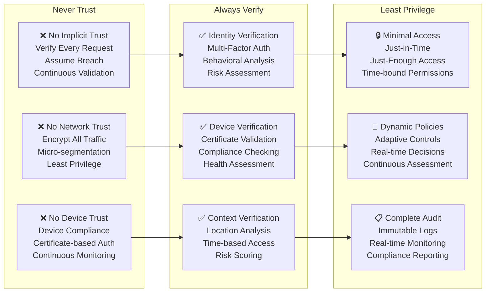
```mermaid
graph LR
    subgraph "Never Trust"
        NO_IMPLICIT[❌ No Implicit Trust<br/>Verify Every Request<br/>Assume Breach<br/>Continuous Validation]
        NO_NETWORK[❌ No Network Trust<br/>Encrypt All Traffic<br/>Micro-segmentation<br/>Least Privilege]
        NO_DEVICE[❌ No Device Trust<br/>Device Compliance<br/>Certificate-based Auth<br/>Continuous Monitoring]
    end
    
    subgraph "Always Verify"
        IDENTITY_VERIFY[✅ Identity Verification<br/>Multi-Factor Auth<br/>Behavioral Analysis<br/>Risk Assessment]
        DEVICE_VERIFY[✅ Device Verification<br/>Certificate Validation<br/>Compliance Checking<br/>Health Assessment]
        CONTEXT_VERIFY[✅ Context Verification<br/>Location Analysis<br/>Time-based Access<br/>Risk Scoring]
    end
    
    subgraph "Least Privilege"
        MINIMAL_ACCESS[🔒 Minimal Access<br/>Just-in-Time<br/>Just-Enough Access<br/>Time-bound Permissions]
        DYNAMIC_POLICY[🔄 Dynamic Policies<br/>Adaptive Controls<br/>Real-time Decisions<br/>Continuous Assessment]
        AUDIT_TRAIL[📋 Complete Audit<br/>Immutable Logs<br/>Real-time Monitoring<br/>Compliance Reporting]
    end
    
    NO_IMPLICIT --> IDENTITY_VERIFY
    NO_NETWORK --> DEVICE_VERIFY
    NO_DEVICE --> CONTEXT_VERIFY
    
    IDENTITY_VERIFY --> MINIMAL_ACCESS
    DEVICE_VERIFY --> DYNAMIC_POLICY
    CONTEXT_VERIFY --> AUDIT_TRAIL
```

### Identity & Access Management (IAM)

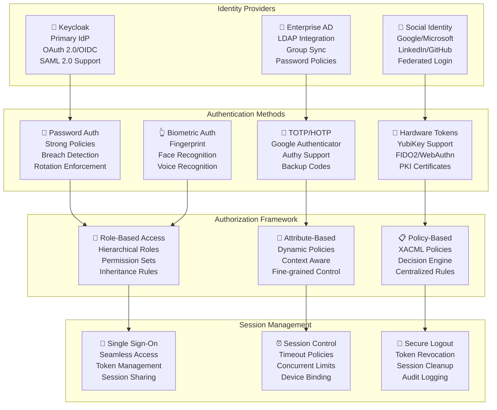
```mermaid
graph TB
    subgraph "Identity Providers"
        KEYCLOAK[🔑 Keycloak<br/>Primary IdP<br/>OAuth 2.0/OIDC<br/>SAML 2.0 Support]
        ENTERPRISE_AD[🏢 Enterprise AD<br/>LDAP Integration<br/>Group Sync<br/>Password Policies]
        SOCIAL_IDP[📱 Social Identity<br/>Google/Microsoft<br/>LinkedIn/GitHub<br/>Federated Login]
    end
    
    subgraph "Authentication Methods"
        PASSWORD[🔐 Password Auth<br/>Strong Policies<br/>Breach Detection<br/>Rotation Enforcement]
        MFA_TOTP[📱 TOTP/HOTP<br/>Google Authenticator<br/>Authy Support<br/>Backup Codes]
        HARDWARE_TOKEN[🔑 Hardware Tokens<br/>YubiKey Support<br/>FIDO2/WebAuthn<br/>PKI Certificates]
        BIOMETRIC[👆 Biometric Auth<br/>Fingerprint<br/>Face Recognition<br/>Voice Recognition]
    end
    
    subgraph "Authorization Framework"
        RBAC[👥 Role-Based Access<br/>Hierarchical Roles<br/>Permission Sets<br/>Inheritance Rules]
        ABAC[🎯 Attribute-Based<br/>Dynamic Policies<br/>Context Aware<br/>Fine-grained Control]
        PBAC[📋 Policy-Based<br/>XACML Policies<br/>Decision Engine<br/>Centralized Rules]
    end
    
    subgraph "Session Management"
        SSO[🔄 Single Sign-On<br/>Seamless Access<br/>Token Management<br/>Session Sharing]
        SESSION_CONTROL[⏰ Session Control<br/>Timeout Policies<br/>Concurrent Limits<br/>Device Binding]
        LOGOUT[🚪 Secure Logout<br/>Token Revocation<br/>Session Cleanup<br/>Audit Logging]
    end
    
    KEYCLOAK --> PASSWORD
    ENTERPRISE_AD --> MFA_TOTP
    SOCIAL_IDP --> HARDWARE_TOKEN
    
    PASSWORD --> RBAC
    MFA_TOTP --> ABAC
    HARDWARE_TOKEN --> PBAC
    BIOMETRIC --> RBAC
    
    RBAC --> SSO
    ABAC --> SESSION_CONTROL
    PBAC --> LOGOUT
```

## Data Protection & Encryption

### Encryption Strategy

```mermaid
graph TB
    subgraph "Data at Rest Encryption"
        DATABASE_ENC[🗄️ Database Encryption<br/>AES-256-GCM<br/>Transparent Data Encryption<br/>Column-level Encryption]
        FILE_ENC[📁 File System Encryption<br/>LUKS/BitLocker<br/>Full Disk Encryption<br/>Key Escrow]
        BACKUP_ENC[💾 Backup Encryption<br/>AES-256 Encryption<br/>Immutable Storage<br/>Air-gapped Copies]
    end
    
    subgraph "Data in Transit Encryption"
        TLS_ENCRYPTION[🔒 TLS 1.3<br/>Perfect Forward Secrecy<br/>Certificate Pinning<br/>HSTS Headers]
        MTLS_SERVICE[🔐 mTLS Service Mesh<br/>Mutual Authentication<br/>Certificate Rotation<br/>Traffic Encryption]
        VPN_ENCRYPTION[🌐 VPN Encryption<br/>IPSec/WireGuard<br/>Site-to-Site<br/>Remote Access]
    end
    
    subgraph "Data in Processing"
        MEMORY_PROTECTION[🧠 Memory Protection<br/>Encrypted RAM<br/>Secure Enclaves<br/>Memory Scrubbing]
        HOMOMORPHIC[🔢 Homomorphic Encryption<br/>Compute on Encrypted Data<br/>Privacy Preserving<br/>Zero-Knowledge Proofs]
        SECURE_MULTIPARTY[🤝 Secure Multi-party<br/>Distributed Computation<br/>Privacy Preservation<br/>Collaborative Analytics]
    end
    
    subgraph "Key Management"
        HSM[🔐 Hardware Security Module<br/>FIPS 140-2 Level 3<br/>Key Generation<br/>Tamper Resistance]
        KMS[🗝️ Key Management Service<br/>AWS KMS/Azure Key Vault<br/>Key Rotation<br/>Access Policies]
        PKI[📜 Public Key Infrastructure<br/>Certificate Authority<br/>Certificate Lifecycle<br/>Revocation Lists]
    end
    
    DATABASE_ENC --> HSM
    FILE_ENC --> KMS
    BACKUP_ENC --> PKI
    
    TLS_ENCRYPTION --> HSM
    MTLS_SERVICE --> KMS
    VPN_ENCRYPTION --> PKI
    
    MEMORY_PROTECTION --> HSM
    HOMOMORPHIC --> KMS
    SECURE_MULTIPARTY --> PKI
```

### Data Classification & Handling

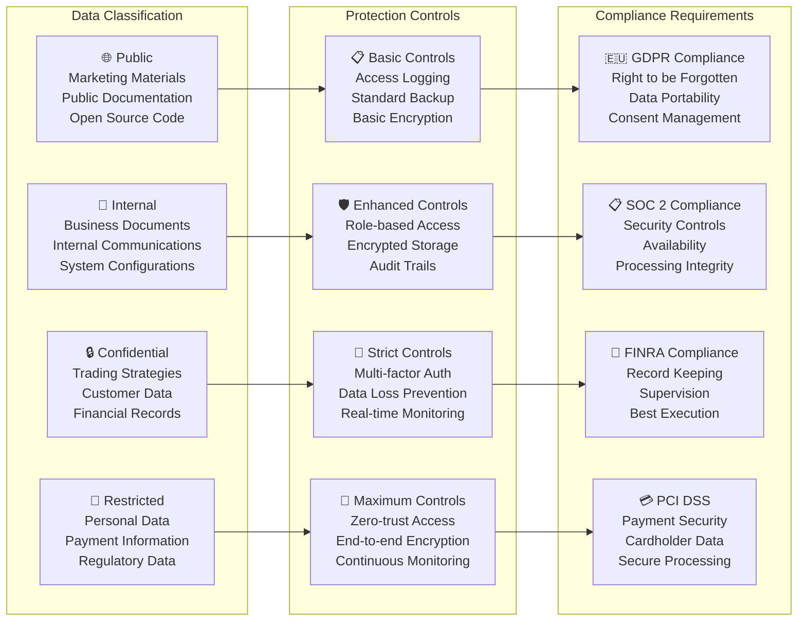
```mermaid
graph LR
    subgraph "Data Classification"
        PUBLIC[🌐 Public<br/>Marketing Materials<br/>Public Documentation<br/>Open Source Code]
        INTERNAL[🏢 Internal<br/>Business Documents<br/>Internal Communications<br/>System Configurations]
        CONFIDENTIAL[🔒 Confidential<br/>Trading Strategies<br/>Customer Data<br/>Financial Records]
        RESTRICTED[🚫 Restricted<br/>Personal Data<br/>Payment Information<br/>Regulatory Data]
    end
    
    subgraph "Protection Controls"
        BASIC_CONTROLS[📋 Basic Controls<br/>Access Logging<br/>Standard Backup<br/>Basic Encryption]
        ENHANCED_CONTROLS[🛡️ Enhanced Controls<br/>Role-based Access<br/>Encrypted Storage<br/>Audit Trails]
        STRICT_CONTROLS[🔐 Strict Controls<br/>Multi-factor Auth<br/>Data Loss Prevention<br/>Real-time Monitoring]
        MAXIMUM_CONTROLS[🚨 Maximum Controls<br/>Zero-trust Access<br/>End-to-end Encryption<br/>Continuous Monitoring]
    end
    
    subgraph "Compliance Requirements"
        GDPR_COMPLIANCE[🇪🇺 GDPR Compliance<br/>Right to be Forgotten<br/>Data Portability<br/>Consent Management]
        SOC2_COMPLIANCE[📋 SOC 2 Compliance<br/>Security Controls<br/>Availability<br/>Processing Integrity]
        FINRA_COMPLIANCE[🏦 FINRA Compliance<br/>Record Keeping<br/>Supervision<br/>Best Execution]
        PCI_COMPLIANCE[💳 PCI DSS<br/>Payment Security<br/>Cardholder Data<br/>Secure Processing]
    end
    
    PUBLIC --> BASIC_CONTROLS
    INTERNAL --> ENHANCED_CONTROLS
    CONFIDENTIAL --> STRICT_CONTROLS
    RESTRICTED --> MAXIMUM_CONTROLS
    
    BASIC_CONTROLS --> GDPR_COMPLIANCE
    ENHANCED_CONTROLS --> SOC2_COMPLIANCE
    STRICT_CONTROLS --> FINRA_COMPLIANCE
    MAXIMUM_CONTROLS --> PCI_COMPLIANCE
```

## Network Security Architecture

### Micro-segmentation Strategy

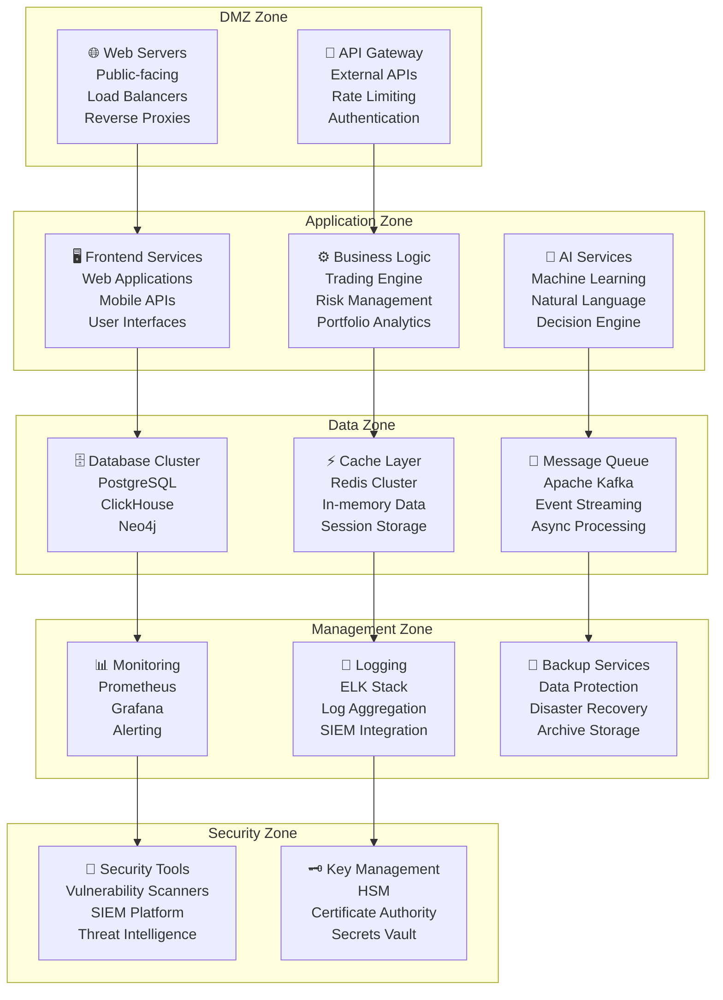
```mermaid
graph TB
    subgraph "DMZ Zone"
        WEB_SERVERS[🌐 Web Servers<br/>Public-facing<br/>Load Balancers<br/>Reverse Proxies]
        API_GATEWAY_DMZ[🚪 API Gateway<br/>External APIs<br/>Rate Limiting<br/>Authentication]
    end
    
    subgraph "Application Zone"
        FRONTEND_SERVICES[🖥️ Frontend Services<br/>Web Applications<br/>Mobile APIs<br/>User Interfaces]
        BUSINESS_LOGIC[⚙️ Business Logic<br/>Trading Engine<br/>Risk Management<br/>Portfolio Analytics]
        AI_SERVICES[🤖 AI Services<br/>Machine Learning<br/>Natural Language<br/>Decision Engine]
    end
    
    subgraph "Data Zone"
        DATABASE_CLUSTER[🗄️ Database Cluster<br/>PostgreSQL<br/>ClickHouse<br/>Neo4j]
        CACHE_LAYER[⚡ Cache Layer<br/>Redis Cluster<br/>In-memory Data<br/>Session Storage]
        MESSAGE_QUEUE[📨 Message Queue<br/>Apache Kafka<br/>Event Streaming<br/>Async Processing]
    end
    
    subgraph "Management Zone"
        MONITORING[📊 Monitoring<br/>Prometheus<br/>Grafana<br/>Alerting]
        LOGGING[📝 Logging<br/>ELK Stack<br/>Log Aggregation<br/>SIEM Integration]
        BACKUP_SERVICES[💾 Backup Services<br/>Data Protection<br/>Disaster Recovery<br/>Archive Storage]
    end
    
    subgraph "Security Zone"
        SECURITY_TOOLS[🔐 Security Tools<br/>Vulnerability Scanners<br/>SIEM Platform<br/>Threat Intelligence]
        KEY_MANAGEMENT[🗝️ Key Management<br/>HSM<br/>Certificate Authority<br/>Secrets Vault]
    end
    
    WEB_SERVERS --> FRONTEND_SERVICES
    API_GATEWAY_DMZ --> BUSINESS_LOGIC
    
    FRONTEND_SERVICES --> DATABASE_CLUSTER
    BUSINESS_LOGIC --> CACHE_LAYER
    AI_SERVICES --> MESSAGE_QUEUE
    
    DATABASE_CLUSTER --> MONITORING
    CACHE_LAYER --> LOGGING
    MESSAGE_QUEUE --> BACKUP_SERVICES
    
    MONITORING --> SECURITY_TOOLS
    LOGGING --> KEY_MANAGEMENT
```

### Network Security Controls

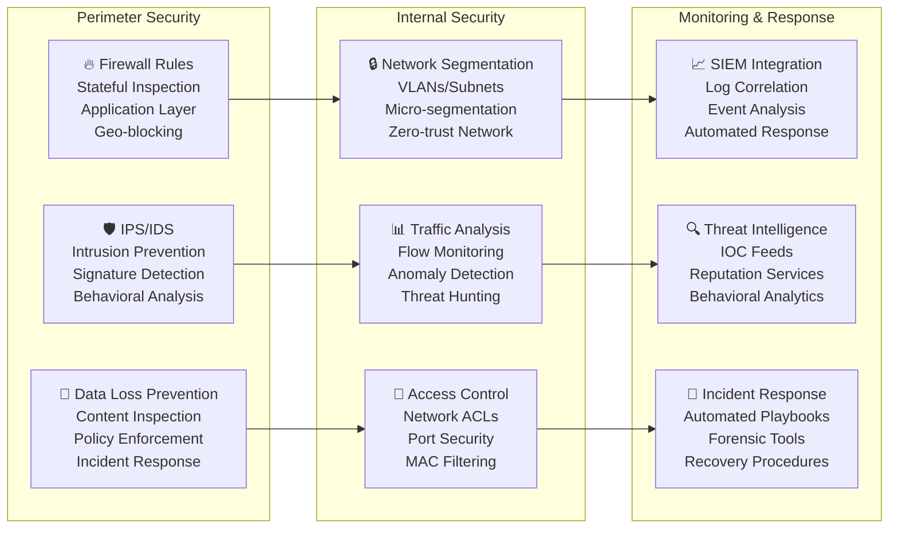
```mermaid
graph LR
    subgraph "Perimeter Security"
        FIREWALL_RULES[🔥 Firewall Rules<br/>Stateful Inspection<br/>Application Layer<br/>Geo-blocking]
        IPS_IDS[🛡️ IPS/IDS<br/>Intrusion Prevention<br/>Signature Detection<br/>Behavioral Analysis]
        DLP[🚫 Data Loss Prevention<br/>Content Inspection<br/>Policy Enforcement<br/>Incident Response]
    end
    
    subgraph "Internal Security"
        NETWORK_SEGMENTATION[🔒 Network Segmentation<br/>VLANs/Subnets<br/>Micro-segmentation<br/>Zero-trust Network]
        TRAFFIC_ANALYSIS[📊 Traffic Analysis<br/>Flow Monitoring<br/>Anomaly Detection<br/>Threat Hunting]
        ACCESS_CONTROL[🎯 Access Control<br/>Network ACLs<br/>Port Security<br/>MAC Filtering]
    end
    
    subgraph "Monitoring & Response"
        SIEM_INTEGRATION[📈 SIEM Integration<br/>Log Correlation<br/>Event Analysis<br/>Automated Response]
        THREAT_INTEL[🔍 Threat Intelligence<br/>IOC Feeds<br/>Reputation Services<br/>Behavioral Analytics]
        INCIDENT_RESPONSE[🚨 Incident Response<br/>Automated Playbooks<br/>Forensic Tools<br/>Recovery Procedures]
    end
    
    FIREWALL_RULES --> NETWORK_SEGMENTATION
    IPS_IDS --> TRAFFIC_ANALYSIS
    DLP --> ACCESS_CONTROL
    
    NETWORK_SEGMENTATION --> SIEM_INTEGRATION
    TRAFFIC_ANALYSIS --> THREAT_INTEL
    ACCESS_CONTROL --> INCIDENT_RESPONSE
```

## Application Security

### Secure Development Lifecycle (SDLC)

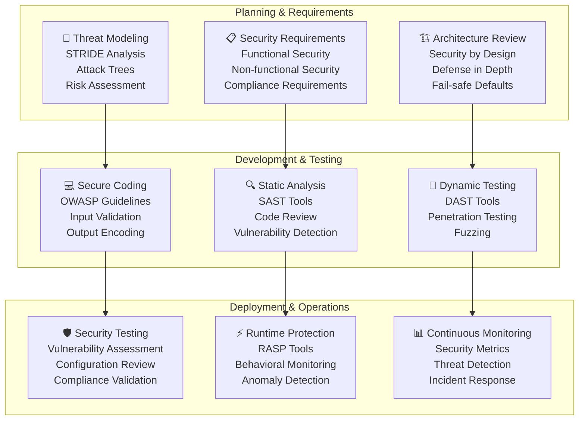
```mermaid
graph TB
    subgraph "Planning & Requirements"
        THREAT_MODELING[🎯 Threat Modeling<br/>STRIDE Analysis<br/>Attack Trees<br/>Risk Assessment]
        SECURITY_REQUIREMENTS[📋 Security Requirements<br/>Functional Security<br/>Non-functional Security<br/>Compliance Requirements]
        ARCHITECTURE_REVIEW[🏗️ Architecture Review<br/>Security by Design<br/>Defense in Depth<br/>Fail-safe Defaults]
    end
    
    subgraph "Development & Testing"
        SECURE_CODING[💻 Secure Coding<br/>OWASP Guidelines<br/>Input Validation<br/>Output Encoding]
        STATIC_ANALYSIS[🔍 Static Analysis<br/>SAST Tools<br/>Code Review<br/>Vulnerability Detection]
        DYNAMIC_TESTING[🧪 Dynamic Testing<br/>DAST Tools<br/>Penetration Testing<br/>Fuzzing]
    end
    
    subgraph "Deployment & Operations"
        SECURITY_TESTING[🛡️ Security Testing<br/>Vulnerability Assessment<br/>Configuration Review<br/>Compliance Validation]
        RUNTIME_PROTECTION[⚡ Runtime Protection<br/>RASP Tools<br/>Behavioral Monitoring<br/>Anomaly Detection]
        CONTINUOUS_MONITORING[📊 Continuous Monitoring<br/>Security Metrics<br/>Threat Detection<br/>Incident Response]
    end
    
    THREAT_MODELING --> SECURE_CODING
    SECURITY_REQUIREMENTS --> STATIC_ANALYSIS
    ARCHITECTURE_REVIEW --> DYNAMIC_TESTING
    
    SECURE_CODING --> SECURITY_TESTING
    STATIC_ANALYSIS --> RUNTIME_PROTECTION
    DYNAMIC_TESTING --> CONTINUOUS_MONITORING
```

### API Security Framework

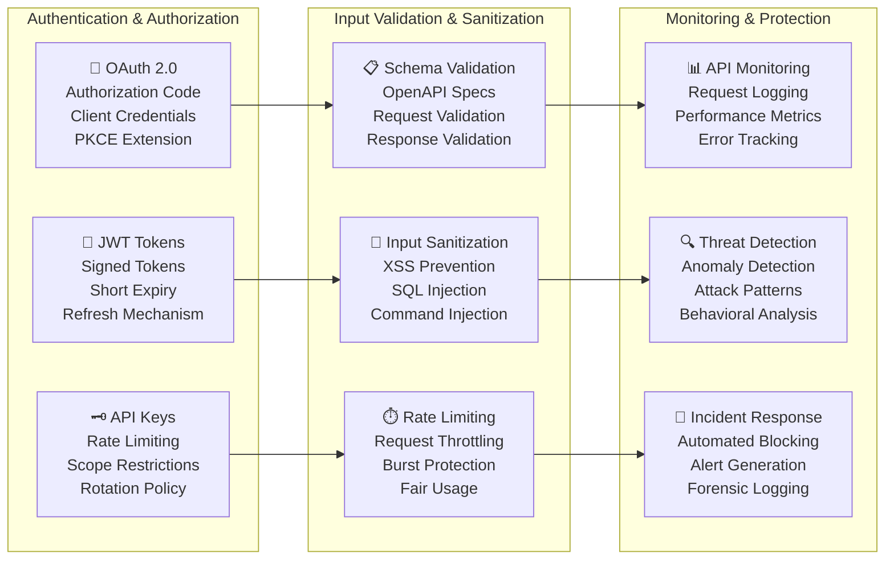
```mermaid
graph LR
    subgraph "Authentication & Authorization"
        OAUTH2[🔐 OAuth 2.0<br/>Authorization Code<br/>Client Credentials<br/>PKCE Extension]
        JWT_TOKENS[🎫 JWT Tokens<br/>Signed Tokens<br/>Short Expiry<br/>Refresh Mechanism]
        API_KEYS[🗝️ API Keys<br/>Rate Limiting<br/>Scope Restrictions<br/>Rotation Policy]
    end
    
    subgraph "Input Validation & Sanitization"
        SCHEMA_VALIDATION[📋 Schema Validation<br/>OpenAPI Specs<br/>Request Validation<br/>Response Validation]
        INPUT_SANITIZATION[🧹 Input Sanitization<br/>XSS Prevention<br/>SQL Injection<br/>Command Injection]
        RATE_LIMITING[⏱️ Rate Limiting<br/>Request Throttling<br/>Burst Protection<br/>Fair Usage]
    end
    
    subgraph "Monitoring & Protection"
        API_MONITORING[📊 API Monitoring<br/>Request Logging<br/>Performance Metrics<br/>Error Tracking]
        THREAT_DETECTION[🔍 Threat Detection<br/>Anomaly Detection<br/>Attack Patterns<br/>Behavioral Analysis]
        INCIDENT_RESPONSE[🚨 Incident Response<br/>Automated Blocking<br/>Alert Generation<br/>Forensic Logging]
    end
    
    OAUTH2 --> SCHEMA_VALIDATION
    JWT_TOKENS --> INPUT_SANITIZATION
    API_KEYS --> RATE_LIMITING
    
    SCHEMA_VALIDATION --> API_MONITORING
    INPUT_SANITIZATION --> THREAT_DETECTION
    RATE_LIMITING --> INCIDENT_RESPONSE
```

## Compliance & Governance

### Regulatory Compliance Framework

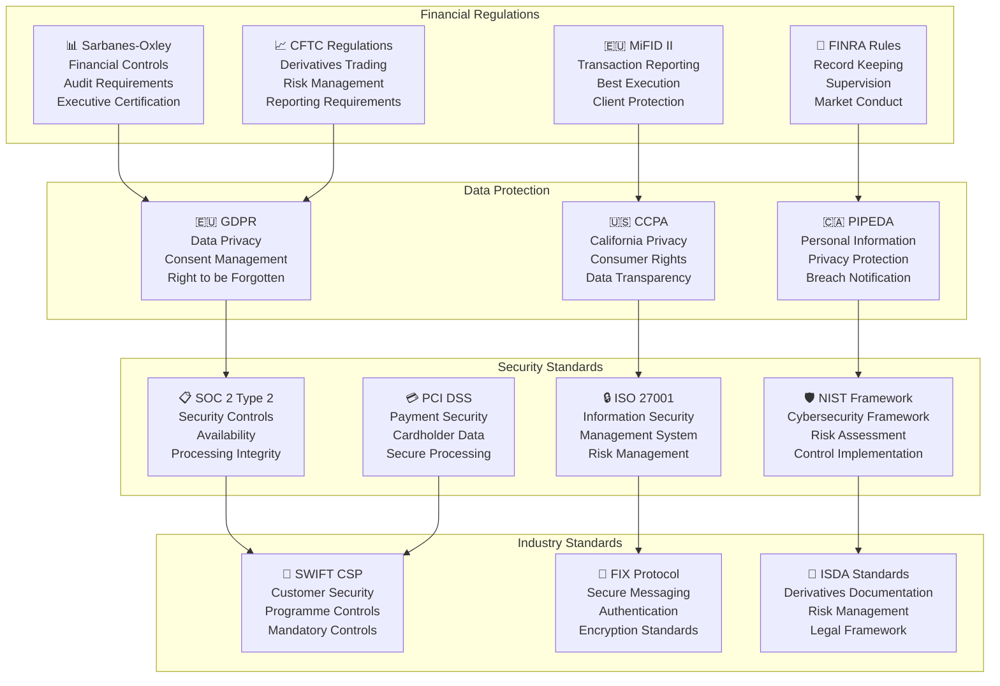
```mermaid
graph TB
    subgraph "Financial Regulations"
        SOX[📊 Sarbanes-Oxley<br/>Financial Controls<br/>Audit Requirements<br/>Executive Certification]
        MIFID2[🇪🇺 MiFID II<br/>Transaction Reporting<br/>Best Execution<br/>Client Protection]
        FINRA[🏦 FINRA Rules<br/>Record Keeping<br/>Supervision<br/>Market Conduct]
        CFTC[📈 CFTC Regulations<br/>Derivatives Trading<br/>Risk Management<br/>Reporting Requirements]
    end
    
    subgraph "Data Protection"
        GDPR[🇪🇺 GDPR<br/>Data Privacy<br/>Consent Management<br/>Right to be Forgotten]
        CCPA[🇺🇸 CCPA<br/>California Privacy<br/>Consumer Rights<br/>Data Transparency]
        PIPEDA[🇨🇦 PIPEDA<br/>Personal Information<br/>Privacy Protection<br/>Breach Notification]
    end
    
    subgraph "Security Standards"
        SOC2[📋 SOC 2 Type 2<br/>Security Controls<br/>Availability<br/>Processing Integrity]
        ISO27001[🔒 ISO 27001<br/>Information Security<br/>Management System<br/>Risk Management]
        NIST[🛡️ NIST Framework<br/>Cybersecurity Framework<br/>Risk Assessment<br/>Control Implementation]
        PCI_DSS[💳 PCI DSS<br/>Payment Security<br/>Cardholder Data<br/>Secure Processing]
    end
    
    subgraph "Industry Standards"
        SWIFT[🏦 SWIFT CSP<br/>Customer Security<br/>Programme Controls<br/>Mandatory Controls]
        FIX[📡 FIX Protocol<br/>Secure Messaging<br/>Authentication<br/>Encryption Standards]
        ISDA[📄 ISDA Standards<br/>Derivatives Documentation<br/>Risk Management<br/>Legal Framework]
    end
    
    SOX --> GDPR
    MIFID2 --> CCPA
    FINRA --> PIPEDA
    CFTC --> GDPR
    
    GDPR --> SOC2
    CCPA --> ISO27001
    PIPEDA --> NIST
    
    SOC2 --> SWIFT
    ISO27001 --> FIX
    NIST --> ISDA
    PCI_DSS --> SWIFT
```

### Governance Structure

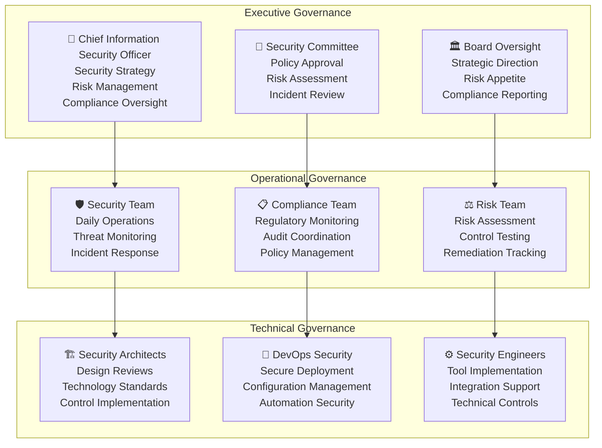
```mermaid
graph TB
    subgraph "Executive Governance"
        CISO[👤 Chief Information Security Officer<br/>Security Strategy<br/>Risk Management<br/>Compliance Oversight]
        SECURITY_COMMITTEE[👥 Security Committee<br/>Policy Approval<br/>Risk Assessment<br/>Incident Review]
        BOARD_OVERSIGHT[🏛️ Board Oversight<br/>Strategic Direction<br/>Risk Appetite<br/>Compliance Reporting]
    end
    
    subgraph "Operational Governance"
        SECURITY_TEAM[🛡️ Security Team<br/>Daily Operations<br/>Threat Monitoring<br/>Incident Response]
        COMPLIANCE_TEAM[📋 Compliance Team<br/>Regulatory Monitoring<br/>Audit Coordination<br/>Policy Management]
        RISK_TEAM[⚖️ Risk Team<br/>Risk Assessment<br/>Control Testing<br/>Remediation Tracking]
    end
    
    subgraph "Technical Governance"
        SECURITY_ARCHITECTS[🏗️ Security Architects<br/>Design Reviews<br/>Technology Standards<br/>Control Implementation]
        DEVOPS_SECURITY[🔧 DevOps Security<br/>Secure Deployment<br/>Configuration Management<br/>Automation Security]
        SECURITY_ENGINEERS[⚙️ Security Engineers<br/>Tool Implementation<br/>Integration Support<br/>Technical Controls]
    end
    
    CISO --> SECURITY_TEAM
    SECURITY_COMMITTEE --> COMPLIANCE_TEAM
    BOARD_OVERSIGHT --> RISK_TEAM
    
    SECURITY_TEAM --> SECURITY_ARCHITECTS
    COMPLIANCE_TEAM --> DEVOPS_SECURITY
    RISK_TEAM --> SECURITY_ENGINEERS
```

## Incident Response & Recovery

### Incident Response Workflow

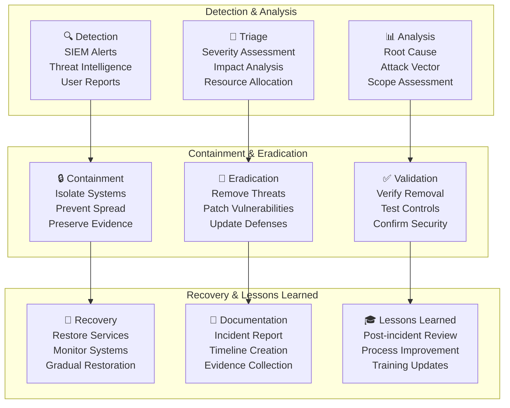
```mermaid
graph TB
    subgraph "Detection & Analysis"
        DETECTION[🔍 Detection<br/>SIEM Alerts<br/>Threat Intelligence<br/>User Reports]
        TRIAGE[🎯 Triage<br/>Severity Assessment<br/>Impact Analysis<br/>Resource Allocation]
        ANALYSIS[📊 Analysis<br/>Root Cause<br/>Attack Vector<br/>Scope Assessment]
    end
    
    subgraph "Containment & Eradication"
        CONTAINMENT[🔒 Containment<br/>Isolate Systems<br/>Prevent Spread<br/>Preserve Evidence]
        ERADICATION[🧹 Eradication<br/>Remove Threats<br/>Patch Vulnerabilities<br/>Update Defenses]
        VALIDATION[✅ Validation<br/>Verify Removal<br/>Test Controls<br/>Confirm Security]
    end
    
    subgraph "Recovery & Lessons Learned"
        RECOVERY[🔄 Recovery<br/>Restore Services<br/>Monitor Systems<br/>Gradual Restoration]
        DOCUMENTATION[📝 Documentation<br/>Incident Report<br/>Timeline Creation<br/>Evidence Collection]
        LESSONS_LEARNED[🎓 Lessons Learned<br/>Post-incident Review<br/>Process Improvement<br/>Training Updates]
    end
    
    DETECTION --> CONTAINMENT
    TRIAGE --> ERADICATION
    ANALYSIS --> VALIDATION
    
    CONTAINMENT --> RECOVERY
    ERADICATION --> DOCUMENTATION
    VALIDATION --> LESSONS_LEARNED
```

### Business Continuity & Disaster Recovery

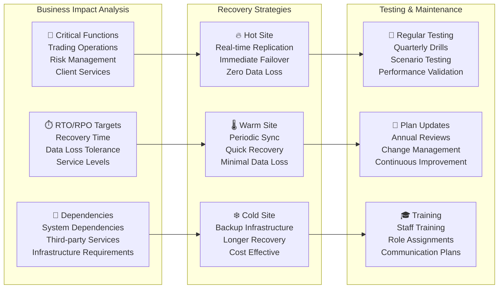
```mermaid
graph LR
    subgraph "Business Impact Analysis"
        CRITICAL_FUNCTIONS[🎯 Critical Functions<br/>Trading Operations<br/>Risk Management<br/>Client Services]
        RTO_RPO[⏱️ RTO/RPO Targets<br/>Recovery Time<br/>Data Loss Tolerance<br/>Service Levels]
        DEPENDENCIES[🔗 Dependencies<br/>System Dependencies<br/>Third-party Services<br/>Infrastructure Requirements]
    end
    
    subgraph "Recovery Strategies"
        HOT_SITE[🔥 Hot Site<br/>Real-time Replication<br/>Immediate Failover<br/>Zero Data Loss]
        WARM_SITE[🌡️ Warm Site<br/>Periodic Sync<br/>Quick Recovery<br/>Minimal Data Loss]
        COLD_SITE[❄️ Cold Site<br/>Backup Infrastructure<br/>Longer Recovery<br/>Cost Effective]
    end
    
    subgraph "Testing & Maintenance"
        REGULAR_TESTING[🧪 Regular Testing<br/>Quarterly Drills<br/>Scenario Testing<br/>Performance Validation]
        PLAN_UPDATES[📝 Plan Updates<br/>Annual Reviews<br/>Change Management<br/>Continuous Improvement]
        TRAINING[🎓 Training<br/>Staff Training<br/>Role Assignments<br/>Communication Plans]
    end
    
    CRITICAL_FUNCTIONS --> HOT_SITE
    RTO_RPO --> WARM_SITE
    DEPENDENCIES --> COLD_SITE
    
    HOT_SITE --> REGULAR_TESTING
    WARM_SITE --> PLAN_UPDATES
    COLD_SITE --> TRAINING
```

## Security Monitoring & Operations

### Security Operations Center (SOC)

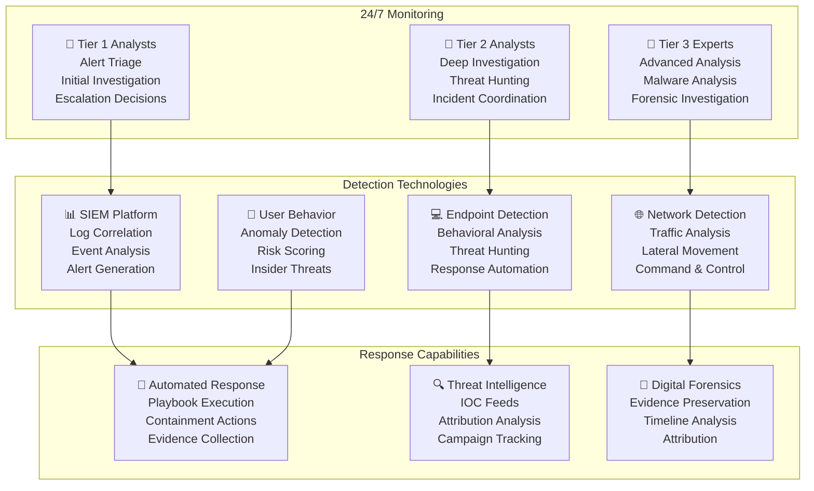
```mermaid
graph TB
    subgraph "24/7 Monitoring"
        TIER1[👤 Tier 1 Analysts<br/>Alert Triage<br/>Initial Investigation<br/>Escalation Decisions]
        TIER2[👥 Tier 2 Analysts<br/>Deep Investigation<br/>Threat Hunting<br/>Incident Coordination]
        TIER3[🎯 Tier 3 Experts<br/>Advanced Analysis<br/>Malware Analysis<br/>Forensic Investigation]
    end
    
    subgraph "Detection Technologies"
        SIEM[📊 SIEM Platform<br/>Log Correlation<br/>Event Analysis<br/>Alert Generation]
        EDR[💻 Endpoint Detection<br/>Behavioral Analysis<br/>Threat Hunting<br/>Response Automation]
        NDR[🌐 Network Detection<br/>Traffic Analysis<br/>Lateral Movement<br/>Command & Control]
        UEBA[👤 User Behavior<br/>Anomaly Detection<br/>Risk Scoring<br/>Insider Threats]
    end
    
    subgraph "Response Capabilities"
        AUTOMATED_RESPONSE[🤖 Automated Response<br/>Playbook Execution<br/>Containment Actions<br/>Evidence Collection]
        THREAT_INTELLIGENCE[🔍 Threat Intelligence<br/>IOC Feeds<br/>Attribution Analysis<br/>Campaign Tracking]
        FORENSICS[🔬 Digital Forensics<br/>Evidence Preservation<br/>Timeline Analysis<br/>Attribution]
    end
    
    TIER1 --> SIEM
    TIER2 --> EDR
    TIER3 --> NDR
    
    SIEM --> AUTOMATED_RESPONSE
    EDR --> THREAT_INTELLIGENCE
    NDR --> FORENSICS
    UEBA --> AUTOMATED_RESPONSE
```

### Threat Intelligence Program

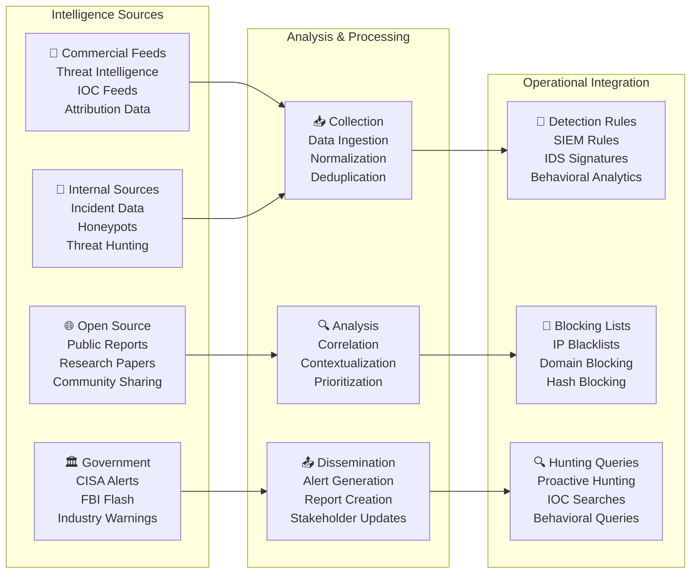
```mermaid
graph LR
    subgraph "Intelligence Sources"
        COMMERCIAL_FEEDS[💼 Commercial Feeds<br/>Threat Intelligence<br/>IOC Feeds<br/>Attribution Data]
        OPEN_SOURCE[🌐 Open Source<br/>Public Reports<br/>Research Papers<br/>Community Sharing]
        GOVERNMENT[🏛️ Government<br/>CISA Alerts<br/>FBI Flash<br/>Industry Warnings]
        INTERNAL[🏢 Internal Sources<br/>Incident Data<br/>Honeypots<br/>Threat Hunting]
    end
    
    subgraph "Analysis & Processing"
        COLLECTION[📥 Collection<br/>Data Ingestion<br/>Normalization<br/>Deduplication]
        ANALYSIS[🔍 Analysis<br/>Correlation<br/>Contextualization<br/>Prioritization]
        DISSEMINATION[📤 Dissemination<br/>Alert Generation<br/>Report Creation<br/>Stakeholder Updates]
    end
    
    subgraph "Operational Integration"
        DETECTION_RULES[🎯 Detection Rules<br/>SIEM Rules<br/>IDS Signatures<br/>Behavioral Analytics]
        BLOCKING_LISTS[🚫 Blocking Lists<br/>IP Blacklists<br/>Domain Blocking<br/>Hash Blocking]
        HUNTING_QUERIES[🔍 Hunting Queries<br/>Proactive Hunting<br/>IOC Searches<br/>Behavioral Queries]
    end
    
    COMMERCIAL_FEEDS --> COLLECTION
    OPEN_SOURCE --> ANALYSIS
    GOVERNMENT --> DISSEMINATION
    INTERNAL --> COLLECTION
    
    COLLECTION --> DETECTION_RULES
    ANALYSIS --> BLOCKING_LISTS
    DISSEMINATION --> HUNTING_QUERIES
```

## Implementation Roadmap

### Security Implementation Phases

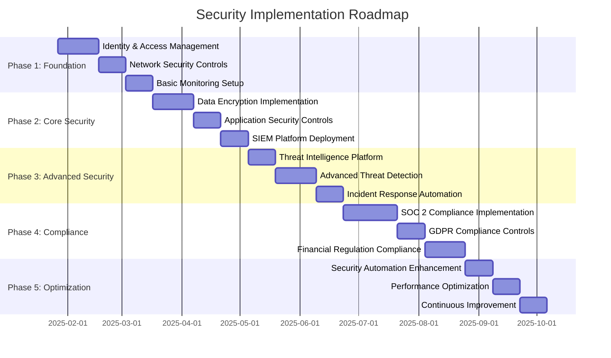
```mermaid
gantt
    title Security Implementation Roadmap
    dateFormat  YYYY-MM-DD
    section Phase 1: Foundation
    Identity & Access Management    :p1-1, 2025-01-27, 3w
    Network Security Controls       :p1-2, after p1-1, 2w
    Basic Monitoring Setup         :p1-3, after p1-2, 2w
    
    section Phase 2: Core Security
    Data Encryption Implementation  :p2-1, after p1-3, 3w
    Application Security Controls   :p2-2, after p2-1, 2w
    SIEM Platform Deployment       :p2-3, after p2-2, 2w
    
    section Phase 3: Advanced Security
    Threat Intelligence Platform    :p3-1, after p2-3, 2w
    Advanced Threat Detection      :p3-2, after p3-1, 3w
    Incident Response Automation   :p3-3, after p3-2, 2w
    
    section Phase 4: Compliance
    SOC 2 Compliance Implementation :p4-1, after p3-3, 4w
    GDPR Compliance Controls       :p4-2, after p4-1, 2w
    Financial Regulation Compliance :p4-3, after p4-2, 3w
    
    section Phase 5: Optimization
    Security Automation Enhancement :p5-1, after p4-3, 2w
    Performance Optimization       :p5-2, after p5-1, 2w
    Continuous Improvement         :p5-3, after p5-2, 2w
```

### Success Metrics & KPIs

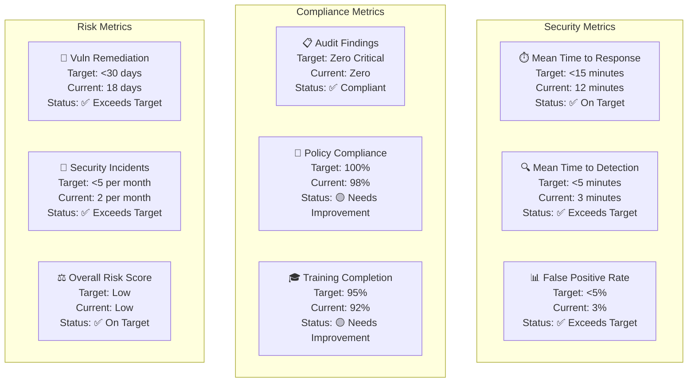
```mermaid
graph TB
    subgraph "Security Metrics"
        MTTR[⏱️ Mean Time to Response<br/>Target: <15 minutes<br/>Current: 12 minutes<br/>Status: ✅ On Target]
        MTTD[🔍 Mean Time to Detection<br/>Target: <5 minutes<br/>Current: 3 minutes<br/>Status: ✅ Exceeds Target]
        FALSE_POSITIVE[📊 False Positive Rate<br/>Target: <5%<br/>Current: 3%<br/>Status: ✅ Exceeds Target]
    end
    
    subgraph "Compliance Metrics"
        AUDIT_FINDINGS[📋 Audit Findings<br/>Target: Zero Critical<br/>Current: Zero<br/>Status: ✅ Compliant]
        POLICY_COMPLIANCE[📜 Policy Compliance<br/>Target: 100%<br/>Current: 98%<br/>Status: 🟡 Needs Improvement]
        TRAINING_COMPLETION[🎓 Training Completion<br/>Target: 95%<br/>Current: 92%<br/>Status: 🟡 Needs Improvement]
    end
    
    subgraph "Risk Metrics"
        VULNERABILITY_REMEDIATION[🔧 Vuln Remediation<br/>Target: <30 days<br/>Current: 18 days<br/>Status: ✅ Exceeds Target]
        SECURITY_INCIDENTS[🚨 Security Incidents<br/>Target: <5 per month<br/>Current: 2 per month<br/>Status: ✅ Exceeds Target]
        RISK_SCORE[⚖️ Overall Risk Score<br/>Target: Low<br/>Current: Low<br/>Status: ✅ On Target]
    end
```

---

**Document Classification**: Internal Use  
**Next Review Date**: 27 April 2025  
**Document Owner**: Security Architecture Team  
**Approval**: CISO, Security Committee