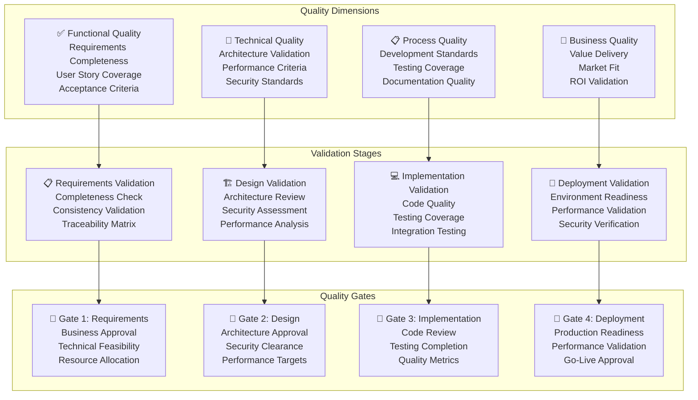
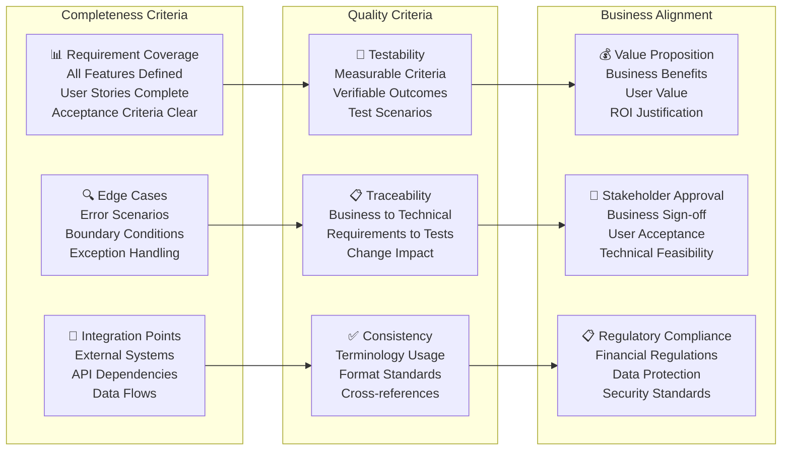
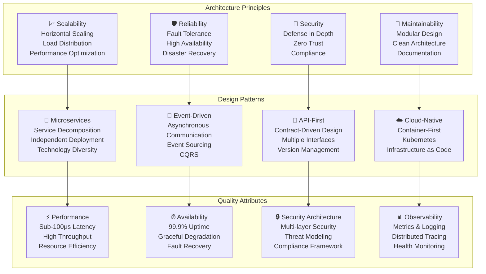
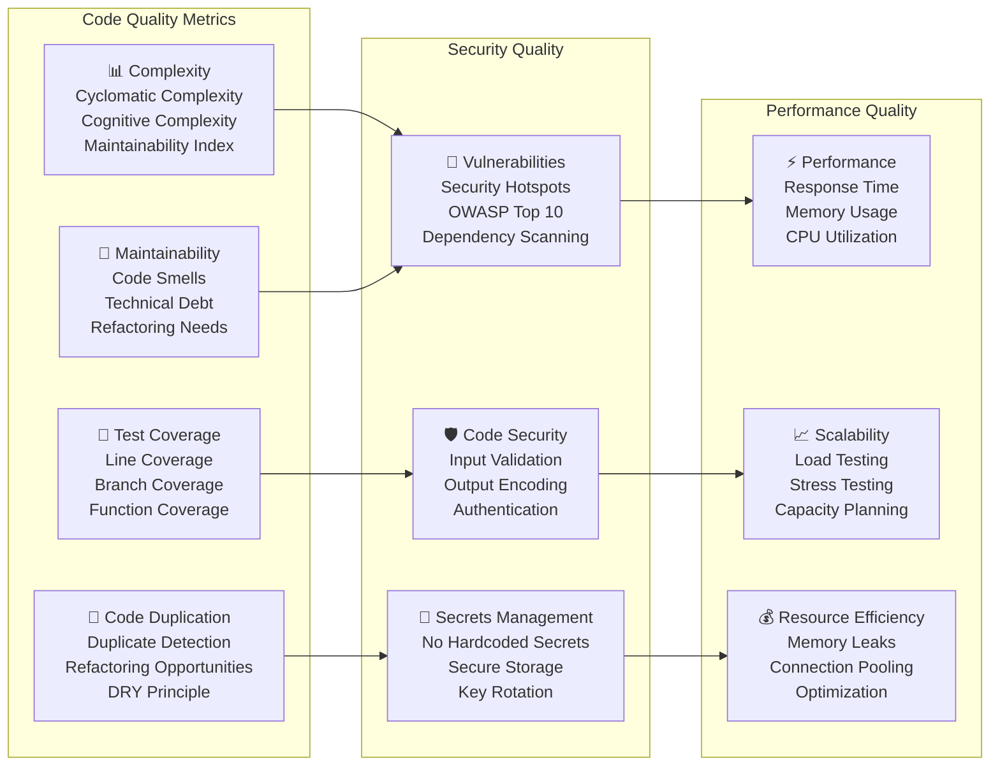
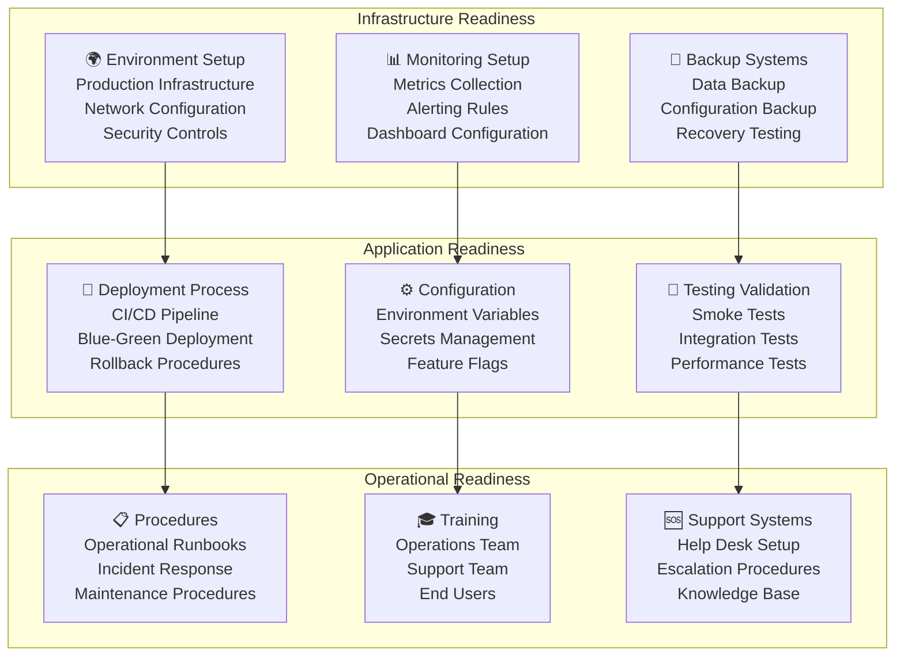
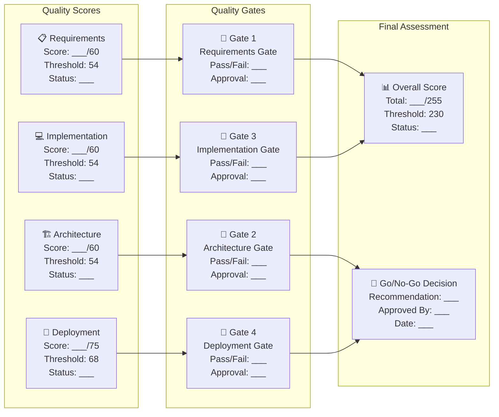

# Comprehensive Quality Checklists

**Document Version**: 1.0.0  
**Last Updated**: 27 January 2025  
**Classification**: Quality Assurance Documentation  
**Owner**: Quality Assurance Team

## Executive Summary

This comprehensive checklist suite provides detailed validation criteria for all aspects of the Algorithmic Trading System development lifecycle, ensuring enterprise-grade quality and compliance.

## Requirements Quality Checklist

### Functional Requirements Validation

#### ✅ **Functional Requirements Checklist**

**Requirement Completeness (Score: ___/25)**
- [ ] All 20+ functional requirements clearly defined with unique identifiers
- [ ] Each requirement has measurable acceptance criteria (minimum 3 per requirement)
- [ ] User stories cover all primary user journeys (6+ complete scenarios)
- [ ] Edge cases and error scenarios documented (15+ scenarios)
- [ ] Integration requirements with external systems specified
- [ ] Data flow requirements clearly documented
- [ ] Performance requirements quantified with specific metrics
- [ ] Security requirements aligned with compliance standards
- [ ] Scalability requirements defined with growth projections
- [ ] Availability requirements specified (99.9% uptime target)
- [ ] Backup and recovery requirements documented
- [ ] Monitoring and alerting requirements specified
- [ ] User interface requirements defined for all user types
- [ ] API requirements documented with specifications
- [ ] Mobile application requirements specified
- [ ] Reporting requirements with export capabilities
- [ ] Audit trail requirements for compliance
- [ ] Multi-language support requirements (if applicable)
- [ ] Accessibility requirements (WCAG 2.1 AA compliance)
- [ ] Browser compatibility requirements specified
- [ ] Third-party integration requirements documented
- [ ] Data migration requirements (if applicable)
- [ ] Training and documentation requirements
- [ ] Support and maintenance requirements
- [ ] Licensing and legal requirements

**Quality Standards (Score: ___/20)**
- [ ] Requirements written in clear, unambiguous language
- [ ] No technical implementation details in business requirements
- [ ] Consistent terminology used throughout documentation
- [ ] Requirements are testable and verifiable
- [ ] Acceptance criteria use measurable terms (numbers, percentages, timeframes)
- [ ] Requirements prioritized using MoSCoW method
- [ ] Dependencies between requirements clearly identified
- [ ] Assumptions documented and validated with stakeholders
- [ ] Constraints clearly specified and justified
- [ ] Requirements traced to business objectives
- [ ] Impact analysis completed for each requirement
- [ ] Risk assessment completed for high-priority requirements
- [ ] Requirements reviewed by all stakeholder groups
- [ ] Technical feasibility validated by architecture team
- [ ] Cost estimates provided for each major requirement
- [ ] Timeline estimates provided for implementation
- [ ] Resource requirements identified
- [ ] Skills gap analysis completed
- [ ] Change management process defined
- [ ] Requirements baseline established and version controlled

**Business Alignment (Score: ___/15)**
- [ ] Requirements aligned with business strategy and goals
- [ ] Value proposition clearly articulated for each major feature
- [ ] ROI calculations provided for investment justification
- [ ] Market research validates user needs and requirements
- [ ] Competitive analysis supports feature prioritization
- [ ] Regulatory requirements fully incorporated
- [ ] Compliance requirements mapped to specific features
- [ ] Risk mitigation strategies defined for high-risk requirements
- [ ] Success metrics defined and measurable
- [ ] User acceptance criteria defined with business stakeholders
- [ ] Go-to-market strategy considerations incorporated
- [ ] Support and training requirements aligned with business needs
- [ ] Maintenance and operational requirements considered
- [ ] Scalability requirements support business growth projections
- [ ] Exit criteria defined for project completion

**Total Score: ___/60** | **Pass Threshold: 54/60 (90%)**

### Non-Functional Requirements Validation

#### ✅ **Performance Requirements Checklist**

**Latency Requirements (Score: ___/15)**
- [ ] Order execution latency target: <100μs (99th percentile)
- [ ] Market data processing latency: <1ms end-to-end
- [ ] API response time: <50ms (95th percentile)
- [ ] Database query response time: <10ms (average)
- [ ] User interface response time: <100ms for interactions
- [ ] WebSocket message delivery: <5ms
- [ ] Strategy execution latency: <75μs
- [ ] Risk validation latency: <25μs
- [ ] Authentication response time: <200ms
- [ ] Report generation time: <30 seconds for standard reports
- [ ] Data synchronization latency: <500ms
- [ ] Mobile app response time: <150ms
- [ ] Search functionality response: <200ms
- [ ] Chart rendering time: <1 second
- [ ] File upload/download speed: >10MB/s

**Throughput Requirements (Score: ___/15)**
- [ ] Event processing capacity: >1M events/second
- [ ] Concurrent user support: >10K simultaneous users
- [ ] API request handling: >50K requests/second
- [ ] Database operations: >100K operations/second
- [ ] WebSocket connections: >100K concurrent connections
- [ ] Order processing rate: >10K orders/second
- [ ] Market data ingestion: >500K ticks/second
- [ ] Batch processing capacity: >1M records/hour
- [ ] Report generation capacity: >1K reports/hour
- [ ] File processing throughput: >100 files/minute
- [ ] Email notification rate: >10K emails/minute
- [ ] SMS notification rate: >5K messages/minute
- [ ] Data backup throughput: >1TB/hour
- [ ] Log processing rate: >1M log entries/second
- [ ] Analytics processing: >10M data points/minute

**Scalability Requirements (Score: ___/10)**
- [ ] Horizontal scaling capability with auto-scaling
- [ ] Load balancing across multiple instances
- [ ] Database sharding and replication support
- [ ] CDN integration for global content delivery
- [ ] Microservices architecture for independent scaling
- [ ] Container orchestration with Kubernetes
- [ ] Cloud-native deployment with multi-region support
- [ ] Elastic resource allocation based on demand
- [ ] Performance degradation <10% under 2x normal load
- [ ] Graceful handling of traffic spikes up to 5x normal load

**Total Performance Score: ___/40** | **Pass Threshold: 36/40 (90%)**

#### ✅ **Security Requirements Checklist**

**Authentication & Authorization (Score: ___/20)**
- [ ] Multi-factor authentication (MFA) mandatory for all users
- [ ] Support for TOTP, SMS, and hardware tokens
- [ ] Biometric authentication support for mobile apps
- [ ] Single Sign-On (SSO) integration with enterprise systems
- [ ] OAuth 2.0 and OpenID Connect implementation
- [ ] Role-based access control (RBAC) with fine-grained permissions
- [ ] Attribute-based access control (ABAC) for complex scenarios
- [ ] Just-in-time (JIT) access for privileged operations
- [ ] Session management with secure timeouts
- [ ] Concurrent session limits per user
- [ ] Password policy enforcement (complexity, rotation)
- [ ] Account lockout policies for failed attempts
- [ ] Privileged access management (PAM) for admin accounts
- [ ] API key management with rotation capabilities
- [ ] Certificate-based authentication for system-to-system
- [ ] Risk-based authentication with behavioral analysis
- [ ] Audit logging for all authentication events
- [ ] Integration with identity governance systems
- [ ] Support for federated identity management
- [ ] Compliance with identity standards (SAML, OIDC)

**Data Protection (Score: ___/20)**
- [ ] Encryption at rest using AES-256 or equivalent
- [ ] Encryption in transit using TLS 1.3 minimum
- [ ] End-to-end encryption for sensitive communications
- [ ] Key management system with HSM integration
- [ ] Automatic key rotation policies
- [ ] Data classification and labeling system
- [ ] Data loss prevention (DLP) controls
- [ ] Database encryption with transparent data encryption
- [ ] File system encryption for all storage
- [ ] Backup encryption with separate key management
- [ ] Data masking and anonymization capabilities
- [ ] Secure data deletion and purging procedures
- [ ] Data residency controls for regulatory compliance
- [ ] Cross-border data transfer protections
- [ ] Personal data protection (GDPR compliance)
- [ ] Right to be forgotten implementation
- [ ] Data breach detection and notification
- [ ] Data integrity validation and checksums
- [ ] Secure data sharing mechanisms
- [ ] Privacy-preserving analytics capabilities

**Network Security (Score: ___/15)**
- [ ] Web Application Firewall (WAF) deployment
- [ ] DDoS protection and mitigation
- [ ] Network segmentation and micro-segmentation
- [ ] Intrusion Detection System (IDS) deployment
- [ ] Intrusion Prevention System (IPS) deployment
- [ ] Network traffic monitoring and analysis
- [ ] VPN access for remote connections
- [ ] Zero-trust network architecture implementation
- [ ] Network access control (NAC) policies
- [ ] Secure network protocols only (no legacy protocols)
- [ ] Network vulnerability scanning and assessment
- [ ] Firewall rules management and review
- [ ] Network performance monitoring
- [ ] Secure DNS configuration and monitoring
- [ ] Network incident response procedures

**Total Security Score: ___/55** | **Pass Threshold: 50/55 (91%)**

## Architecture Quality Checklist

### System Architecture Validation

#### ✅ **Architecture Design Checklist**

**System Architecture (Score: ___/25)**
- [ ] Microservices architecture with clear service boundaries
- [ ] Event-driven architecture with asynchronous communication
- [ ] API-first design with well-defined contracts
- [ ] Cloud-native architecture with container deployment
- [ ] Scalable architecture supporting horizontal scaling
- [ ] High availability design with redundancy
- [ ] Fault-tolerant design with graceful degradation
- [ ] Security-by-design with zero-trust principles
- [ ] Performance-optimized architecture for low latency
- [ ] Data architecture with polyglot persistence
- [ ] Integration architecture with external systems
- [ ] Deployment architecture with CI/CD pipelines
- [ ] Monitoring and observability architecture
- [ ] Disaster recovery and business continuity design
- [ ] Compliance architecture for regulatory requirements
- [ ] Cost-optimized architecture with resource efficiency
- [ ] Technology stack alignment with requirements
- [ ] Architecture documentation with diagrams
- [ ] Architecture decision records (ADRs) maintained
- [ ] Stakeholder review and approval completed
- [ ] Technical debt assessment and mitigation plan
- [ ] Migration strategy for existing systems
- [ ] Capacity planning and resource estimation
- [ ] Performance benchmarking and validation
- [ ] Security architecture review and approval

**Component Design (Score: ___/20)**
- [ ] Clear separation of concerns between components
- [ ] Loose coupling between system components
- [ ] High cohesion within individual components
- [ ] Well-defined interfaces and contracts
- [ ] Dependency injection and inversion of control
- [ ] Error handling and exception management
- [ ] Logging and monitoring integration
- [ ] Configuration management externalized
- [ ] Resource management and cleanup
- [ ] Thread safety and concurrency handling
- [ ] Input validation and sanitization
- [ ] Output encoding and security measures
- [ ] Performance optimization and caching
- [ ] Scalability considerations in design
- [ ] Testability and mock-ability of components
- [ ] Documentation for each major component
- [ ] Code review and quality standards
- [ ] Design pattern usage and consistency
- [ ] Refactoring and technical debt management
- [ ] Version compatibility and migration support

**Data Architecture (Score: ___/15)**
- [ ] Data model design with normalization
- [ ] Database selection and optimization
- [ ] Data partitioning and sharding strategy
- [ ] Data replication and synchronization
- [ ] Data backup and recovery procedures
- [ ] Data retention and archival policies
- [ ] Data security and encryption implementation
- [ ] Data access patterns and optimization
- [ ] Data migration and transformation procedures
- [ ] Data quality and validation rules
- [ ] Master data management strategy
- [ ] Data lineage and governance
- [ ] Performance tuning and indexing
- [ ] Capacity planning for data growth
- [ ] Compliance with data protection regulations

**Total Architecture Score: ___/60** | **Pass Threshold: 54/60 (90%)**

## Implementation Quality Checklist

### Code Quality Standards

#### ✅ **Code Quality Checklist**

**Code Standards (Score: ___/25)**
- [ ] Coding standards documented and enforced
- [ ] Code formatting consistent across codebase
- [ ] Naming conventions followed consistently
- [ ] Code comments and documentation adequate
- [ ] Function and class size within acceptable limits
- [ ] Cyclomatic complexity below threshold (≤10)
- [ ] Code duplication below 3% threshold
- [ ] Dead code identified and removed
- [ ] Code smells identified and addressed
- [ ] Design patterns used appropriately
- [ ] Error handling implemented consistently
- [ ] Logging implemented at appropriate levels
- [ ] Configuration externalized properly
- [ ] Dependencies managed and up-to-date
- [ ] Code review process followed for all changes
- [ ] Automated code quality checks in CI/CD
- [ ] Static code analysis tools integrated
- [ ] Code coverage reports generated
- [ ] Performance profiling completed
- [ ] Memory leak detection performed
- [ ] Security scanning integrated
- [ ] Dependency vulnerability scanning
- [ ] License compliance verified
- [ ] Code metrics tracked and monitored
- [ ] Technical debt tracked and managed

**Testing Quality (Score: ___/20)**
- [ ] Unit test coverage ≥90% for critical components
- [ ] Integration test coverage ≥80% for API endpoints
- [ ] End-to-end test coverage for critical user journeys
- [ ] Performance tests for latency-critical components
- [ ] Load tests for scalability validation
- [ ] Security tests for vulnerability assessment
- [ ] Regression tests for bug prevention
- [ ] Smoke tests for deployment validation
- [ ] Contract tests for API compatibility
- [ ] Mutation testing for test quality validation
- [ ] Test data management and cleanup
- [ ] Test environment consistency
- [ ] Automated test execution in CI/CD
- [ ] Test result reporting and analysis
- [ ] Flaky test identification and resolution
- [ ] Test maintenance and updates
- [ ] Mock and stub usage for isolation
- [ ] Test documentation and guidelines
- [ ] Performance test benchmarks established
- [ ] Security test automation implemented

**Documentation Quality (Score: ___/15)**
- [ ] API documentation complete and up-to-date
- [ ] Code documentation with inline comments
- [ ] Architecture documentation with diagrams
- [ ] Deployment documentation with procedures
- [ ] User documentation with tutorials
- [ ] Developer onboarding documentation
- [ ] Troubleshooting guides and FAQs
- [ ] Configuration documentation
- [ ] Database schema documentation
- [ ] Security procedures documentation
- [ ] Disaster recovery procedures
- [ ] Monitoring and alerting documentation
- [ ] Performance tuning guidelines
- [ ] Change management procedures
- [ ] Documentation review and approval process

**Total Implementation Score: ___/60** | **Pass Threshold: 54/60 (90%)**

## Deployment Readiness Checklist

### Production Deployment Validation

#### ✅ **Production Readiness Checklist**

**Infrastructure Readiness (Score: ___/30)**
- [ ] Production environment provisioned and configured
- [ ] Network security controls implemented and tested
- [ ] Load balancers configured with health checks
- [ ] SSL/TLS certificates installed and validated
- [ ] DNS configuration completed and tested
- [ ] Firewall rules configured and documented
- [ ] VPN access configured for remote management
- [ ] Monitoring infrastructure deployed and configured
- [ ] Log aggregation system setup and tested
- [ ] Backup systems configured and tested
- [ ] Disaster recovery site prepared and validated
- [ ] Database clusters configured with replication
- [ ] Cache systems deployed and configured
- [ ] Message queues setup with clustering
- [ ] Container orchestration platform ready
- [ ] Auto-scaling policies configured and tested
- [ ] Resource quotas and limits configured
- [ ] Security scanning tools deployed
- [ ] Compliance monitoring tools configured
- [ ] Performance monitoring tools setup
- [ ] Capacity planning completed and documented
- [ ] Cost monitoring and alerting configured
- [ ] Change management procedures implemented
- [ ] Configuration management system deployed
- [ ] Infrastructure as code templates validated
- [ ] Environment consistency verified
- [ ] Security hardening completed and verified
- [ ] Patch management procedures implemented
- [ ] Incident response tools configured
- [ ] Communication systems setup and tested

**Application Deployment (Score: ___/25)**
- [ ] CI/CD pipeline configured and tested
- [ ] Deployment automation scripts validated
- [ ] Blue-green deployment process tested
- [ ] Canary deployment capability verified
- [ ] Rollback procedures tested and documented
- [ ] Database migration scripts tested
- [ ] Configuration management automated
- [ ] Secrets management system integrated
- [ ] Feature flags system implemented
- [ ] Health check endpoints implemented
- [ ] Readiness probes configured
- [ ] Liveness probes configured
- [ ] Graceful shutdown procedures implemented
- [ ] Resource limits and requests configured
- [ ] Service discovery configuration validated
- [ ] Load balancing configuration tested
- [ ] Session management configured
- [ ] Cache warming procedures implemented
- [ ] Data migration procedures tested
- [ ] Third-party integrations validated
- [ ] API rate limiting configured
- [ ] Security headers configured
- [ ] CORS policies configured
- [ ] Content security policies implemented
- [ ] Performance optimization applied

**Operational Procedures (Score: ___/20)**
- [ ] Operational runbooks created and reviewed
- [ ] Incident response procedures documented
- [ ] Escalation procedures defined and tested
- [ ] Maintenance procedures documented
- [ ] Backup and recovery procedures tested
- [ ] Performance tuning procedures documented
- [ ] Capacity planning procedures established
- [ ] Change management procedures implemented
- [ ] Release management procedures defined
- [ ] Configuration change procedures documented
- [ ] Security incident response procedures ready
- [ ] Business continuity procedures tested
- [ ] Disaster recovery procedures validated
- [ ] Monitoring and alerting procedures documented
- [ ] Log analysis procedures established
- [ ] Troubleshooting guides created
- [ ] Performance baseline established
- [ ] SLA definitions and monitoring setup
- [ ] Customer communication procedures defined
- [ ] Post-incident review procedures established

**Total Deployment Score: ___/75** | **Pass Threshold: 68/75 (90%)**

## Quality Gate Summary

### Overall Quality Assessment

### Quality Gate Criteria

**Gate 1: Requirements Approval**
- Requirements Quality Score: ≥54/60 (90%)
- Performance Requirements Score: ≥36/40 (90%)
- Security Requirements Score: ≥50/55 (91%)
- Business stakeholder approval obtained
- Technical feasibility confirmed
- Resource allocation approved

**Gate 2: Architecture Approval**
- Architecture Design Score: ≥54/60 (90%)
- Security architecture review passed
- Performance architecture validated
- Technical stakeholder approval obtained
- Architecture decision records completed
- Technology stack approved

**Gate 3: Implementation Approval**
- Code Quality Score: ≥54/60 (90%)
- All critical and high-priority tests passing
- Security scan results acceptable
- Performance benchmarks met
- Code review process completed
- Technical debt within acceptable limits

**Gate 4: Deployment Approval**
- Production Readiness Score: ≥68/75 (90%)
- All deployment procedures tested
- Monitoring and alerting operational
- Incident response procedures ready
- Operations team trained and ready
- Business stakeholder final approval

**Overall Project Approval**
- Total Quality Score: ≥230/255 (90%)
- All individual gates passed
- Risk assessment completed and acceptable
- Go-live plan approved by all stakeholders
- Success criteria and KPIs defined
- Post-launch support plan in place

---

**Document Classification**: Quality Assurance Documentation  
**Next Review Date**: 27 April 2025  
**Document Owner**: Quality Assurance Team  
**Approval**: Chief Quality Officer, Quality Committee