# User Guide & Documentation

**Document Version**: 1.0.0  
**Last Updated**: 01 November 2025  
**Classification**: User Documentation  
**Owner**: Product Team

## Executive Summary

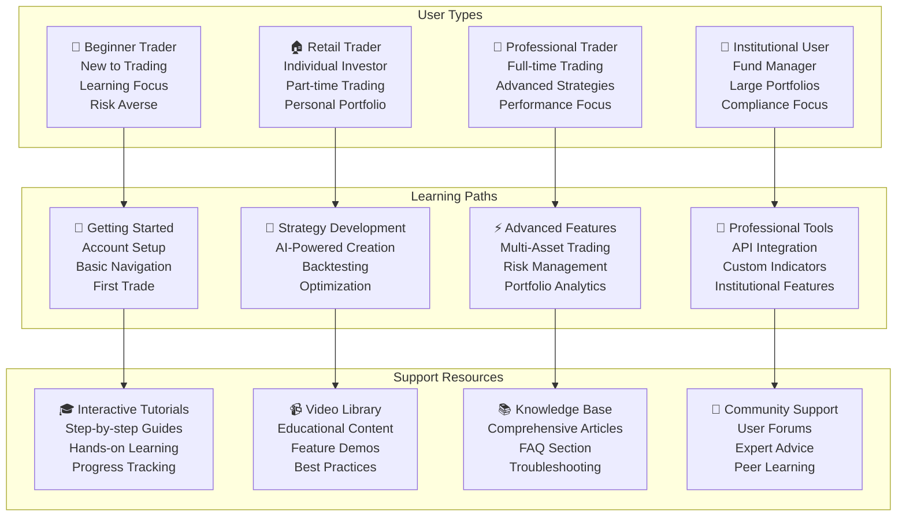
```mermaid
graph TB
    subgraph "User Types"
        BEGINNER_TRADER[🌱 Beginner Trader<br/>New to Trading<br/>Learning Focus<br/>Risk Averse]
        RETAIL_TRADER[🏠 Retail Trader<br/>Individual Investor<br/>Part-time Trading<br/>Personal Portfolio]
        PROFESSIONAL_TRADER[💼 Professional Trader<br/>Full-time Trading<br/>Advanced Strategies<br/>Performance Focus]
        INSTITUTIONAL_USER[🏢 Institutional User<br/>Fund Manager<br/>Large Portfolios<br/>Compliance Focus]
    end
    
    subgraph "Learning Paths"
        GETTING_STARTED[🚀 Getting Started<br/>Account Setup<br/>Basic Navigation<br/>First Trade]
        STRATEGY_DEVELOPMENT[🧠 Strategy Development<br/>AI-Powered Creation<br/>Backtesting<br/>Optimization]
        ADVANCED_FEATURES[⚡ Advanced Features<br/>Multi-Asset Trading<br/>Risk Management<br/>Portfolio Analytics]
        PROFESSIONAL_TOOLS[🔧 Professional Tools<br/>API Integration<br/>Custom Indicators<br/>Institutional Features]
    end
    
    subgraph "Support Resources"
        INTERACTIVE_TUTORIALS[🎓 Interactive Tutorials<br/>Step-by-step Guides<br/>Hands-on Learning<br/>Progress Tracking]
        VIDEO_LIBRARY[📹 Video Library<br/>Educational Content<br/>Feature Demos<br/>Best Practices]
        KNOWLEDGE_BASE[📚 Knowledge Base<br/>Comprehensive Articles<br/>FAQ Section<br/>Troubleshooting]
        COMMUNITY_SUPPORT[👥 Community Support<br/>User Forums<br/>Expert Advice<br/>Peer Learning]
    end
    
    BEGINNER_TRADER --> GETTING_STARTED
    RETAIL_TRADER --> STRATEGY_DEVELOPMENT
    PROFESSIONAL_TRADER --> ADVANCED_FEATURES
    INSTITUTIONAL_USER --> PROFESSIONAL_TOOLS
    
    GETTING_STARTED --> INTERACTIVE_TUTORIALS
    STRATEGY_DEVELOPMENT --> VIDEO_LIBRARY
    ADVANCED_FEATURES --> KNOWLEDGE_BASE
    PROFESSIONAL_TOOLS --> COMMUNITY_SUPPORT
```

This comprehensive user guide provides detailed instructions, tutorials, and best practices for using the Algorithmic Trading System (ATS) effectively across all user skill levels and trading objectives.

## Getting Started Guide

### Account Setup & Onboarding

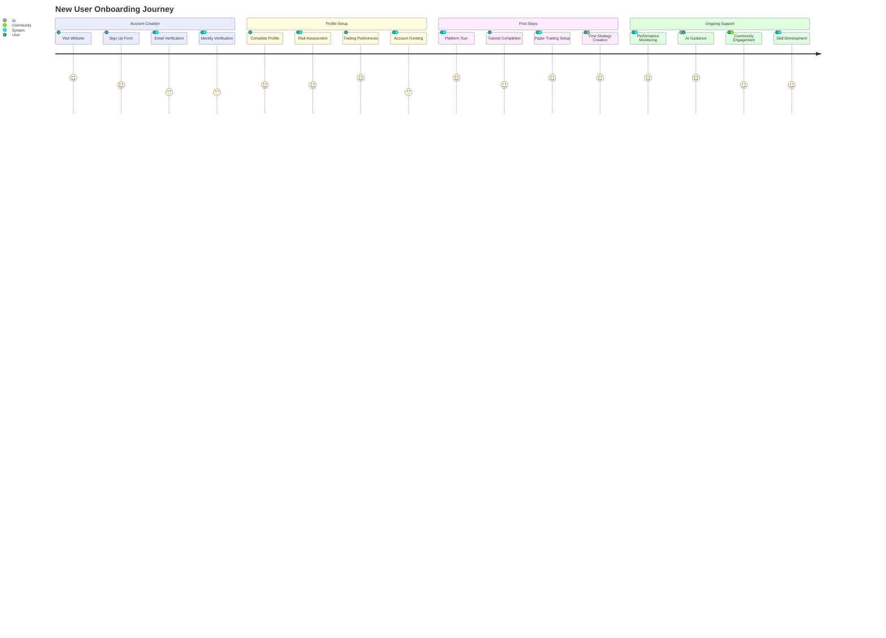
```mermaid
journey
    title New User Onboarding Journey
    section Account Creation
      Visit Website: 5: User
      Sign Up Form: 4: User
      Email Verification: 3: User, System
      Identity Verification: 3: User, System
    section Profile Setup
      Complete Profile: 4: User
      Risk Assessment: 4: User, System
      Trading Preferences: 5: User
      Account Funding: 3: User, System
    section First Steps
      Platform Tour: 5: User, System
      Tutorial Completion: 4: User
      Paper Trading Setup: 5: User, System
      First Strategy Creation: 5: User, AI
    section Ongoing Support
      Performance Monitoring: 5: User, System
      AI Guidance: 5: AI, User
      Community Engagement: 4: User, Community
      Skill Development: 4: User, System
```

### Platform Navigation

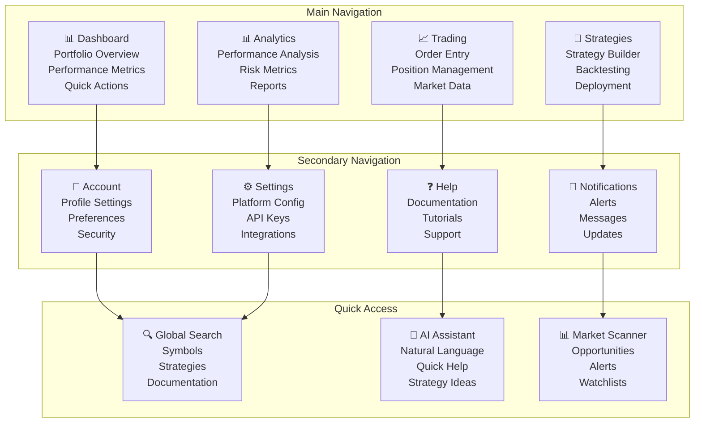
```mermaid
graph TB
    subgraph "Main Navigation"
        DASHBOARD[📊 Dashboard<br/>Portfolio Overview<br/>Performance Metrics<br/>Quick Actions]
        TRADING[📈 Trading<br/>Order Entry<br/>Position Management<br/>Market Data]
        STRATEGIES[🧠 Strategies<br/>Strategy Builder<br/>Backtesting<br/>Deployment]
        ANALYTICS[📊 Analytics<br/>Performance Analysis<br/>Risk Metrics<br/>Reports]
    end
    
    subgraph "Secondary Navigation"
        ACCOUNT[👤 Account<br/>Profile Settings<br/>Preferences<br/>Security]
        HELP[❓ Help<br/>Documentation<br/>Tutorials<br/>Support]
        NOTIFICATIONS[🔔 Notifications<br/>Alerts<br/>Messages<br/>Updates]
        SETTINGS[⚙️ Settings<br/>Platform Config<br/>API Keys<br/>Integrations]
    end
    
    subgraph "Quick Access"
        SEARCH[🔍 Global Search<br/>Symbols<br/>Strategies<br/>Documentation]
        AI_ASSISTANT[🤖 AI Assistant<br/>Natural Language<br/>Quick Help<br/>Strategy Ideas]
        MARKET_SCANNER[📊 Market Scanner<br/>Opportunities<br/>Alerts<br/>Watchlists]
    end
    
    DASHBOARD --> ACCOUNT
    TRADING --> HELP
    STRATEGIES --> NOTIFICATIONS
    ANALYTICS --> SETTINGS
    
    ACCOUNT --> SEARCH
    HELP --> AI_ASSISTANT
    NOTIFICATIONS --> MARKET_SCANNER
    SETTINGS --> SEARCH
```

### First Trade Tutorial

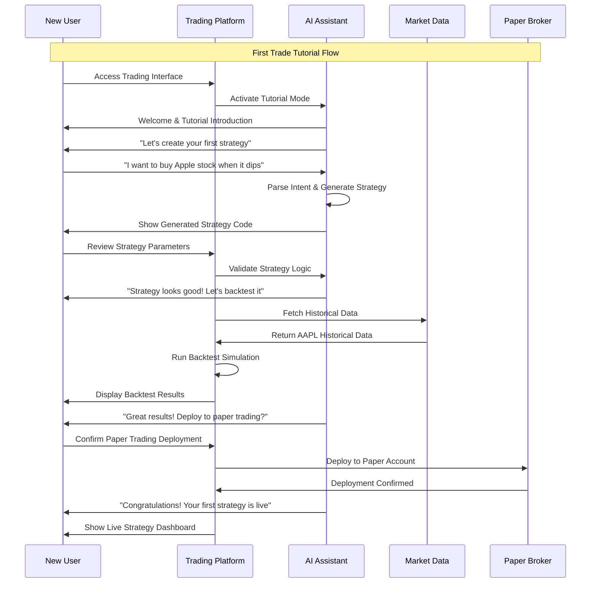
```mermaid
sequenceDiagram
    participant User as New User
    participant Platform as Trading Platform
    participant AI as AI Assistant
    participant Market as Market Data
    participant Broker as Paper Broker
    
    Note over User, Broker: First Trade Tutorial Flow
    
    User->>Platform: Access Trading Interface
    Platform->>AI: Activate Tutorial Mode
    AI->>User: Welcome & Tutorial Introduction
    
    AI->>User: "Let's create your first strategy"
    User->>AI: "I want to buy Apple stock when it dips"
    AI->>AI: Parse Intent & Generate Strategy
    AI->>User: Show Generated Strategy Code
    
    User->>Platform: Review Strategy Parameters
    Platform->>AI: Validate Strategy Logic
    AI->>User: "Strategy looks good! Let's backtest it"
    
    Platform->>Market: Fetch Historical Data
    Market->>Platform: Return AAPL Historical Data
    Platform->>Platform: Run Backtest Simulation
    Platform->>User: Display Backtest Results
    
    AI->>User: "Great results! Deploy to paper trading?"
    User->>Platform: Confirm Paper Trading Deployment
    Platform->>Broker: Deploy to Paper Account
    Broker->>Platform: Deployment Confirmed
    
    AI->>User: "Congratulations! Your first strategy is live"
    Platform->>User: Show Live Strategy Dashboard
```

## Strategy Development Guide

### AI-Powered Strategy Creation

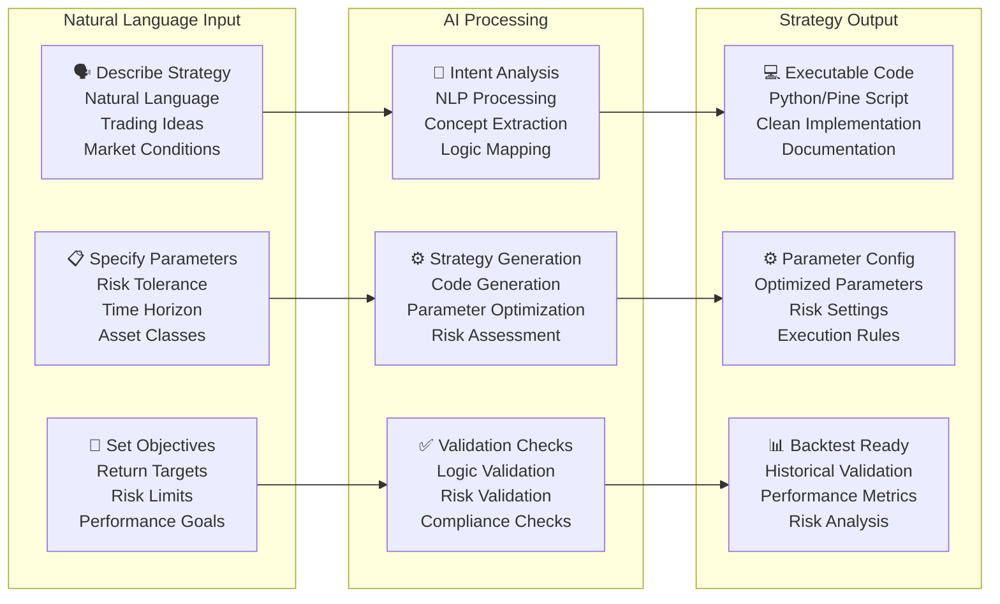
```mermaid
graph LR
    subgraph "Natural Language Input"
        DESCRIBE_STRATEGY[🗣️ Describe Strategy<br/>Natural Language<br/>Trading Ideas<br/>Market Conditions]
        SPECIFY_PARAMETERS[📋 Specify Parameters<br/>Risk Tolerance<br/>Time Horizon<br/>Asset Classes]
        SET_OBJECTIVES[🎯 Set Objectives<br/>Return Targets<br/>Risk Limits<br/>Performance Goals]
    end
    
    subgraph "AI Processing"
        INTENT_ANALYSIS[🧠 Intent Analysis<br/>NLP Processing<br/>Concept Extraction<br/>Logic Mapping]
        STRATEGY_GENERATION[⚙️ Strategy Generation<br/>Code Generation<br/>Parameter Optimization<br/>Risk Assessment]
        VALIDATION_CHECKS[✅ Validation Checks<br/>Logic Validation<br/>Risk Validation<br/>Compliance Checks]
    end
    
    subgraph "Strategy Output"
        EXECUTABLE_CODE[💻 Executable Code<br/>Python/Pine Script<br/>Clean Implementation<br/>Documentation]
        PARAMETER_CONFIG[⚙️ Parameter Config<br/>Optimized Parameters<br/>Risk Settings<br/>Execution Rules]
        BACKTEST_READY[📊 Backtest Ready<br/>Historical Validation<br/>Performance Metrics<br/>Risk Analysis]
    end
    
    DESCRIBE_STRATEGY --> INTENT_ANALYSIS
    SPECIFY_PARAMETERS --> STRATEGY_GENERATION
    SET_OBJECTIVES --> VALIDATION_CHECKS
    
    INTENT_ANALYSIS --> EXECUTABLE_CODE
    STRATEGY_GENERATION --> PARAMETER_CONFIG
    VALIDATION_CHECKS --> BACKTEST_READY
```

### Strategy Templates Library

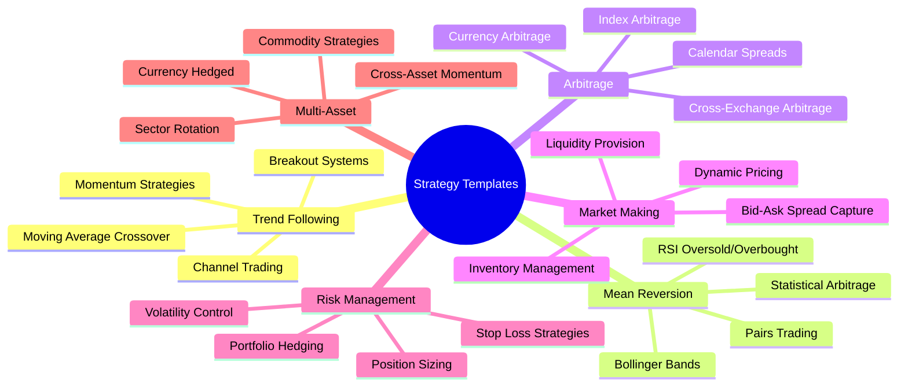
```mermaid
mindmap
  root((Strategy Templates))
    Trend Following
      Moving Average Crossover
      Momentum Strategies
      Breakout Systems
      Channel Trading
    Mean Reversion
      Bollinger Bands
      RSI Oversold/Overbought
      Statistical Arbitrage
      Pairs Trading
    Arbitrage
      Cross-Exchange Arbitrage
      Calendar Spreads
      Index Arbitrage
      Currency Arbitrage
    Market Making
      Bid-Ask Spread Capture
      Inventory Management
      Dynamic Pricing
      Liquidity Provision
    Risk Management
      Stop Loss Strategies
      Position Sizing
      Portfolio Hedging
      Volatility Control
    Multi-Asset
      Cross-Asset Momentum
      Sector Rotation
      Currency Hedged
      Commodity Strategies
```

### Backtesting Framework

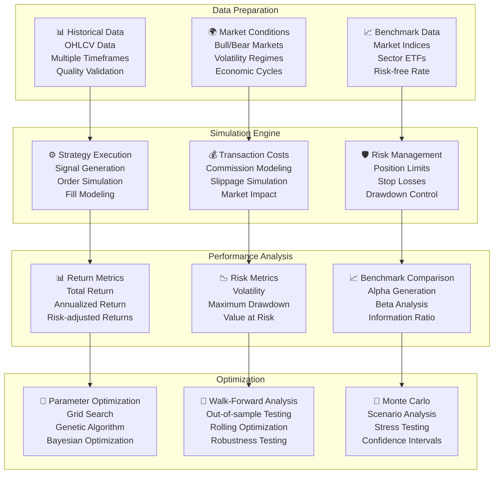
```mermaid
graph TB
    subgraph "Data Preparation"
        HISTORICAL_DATA[📊 Historical Data<br/>OHLCV Data<br/>Multiple Timeframes<br/>Quality Validation]
        MARKET_CONDITIONS[🌍 Market Conditions<br/>Bull/Bear Markets<br/>Volatility Regimes<br/>Economic Cycles]
        BENCHMARK_DATA[📈 Benchmark Data<br/>Market Indices<br/>Sector ETFs<br/>Risk-free Rate]
    end
    
    subgraph "Simulation Engine"
        STRATEGY_EXECUTION[⚙️ Strategy Execution<br/>Signal Generation<br/>Order Simulation<br/>Fill Modeling]
        TRANSACTION_COSTS[💰 Transaction Costs<br/>Commission Modeling<br/>Slippage Simulation<br/>Market Impact]
        RISK_MANAGEMENT[🛡️ Risk Management<br/>Position Limits<br/>Stop Losses<br/>Drawdown Control]
    end
    
    subgraph "Performance Analysis"
        RETURN_METRICS[📊 Return Metrics<br/>Total Return<br/>Annualized Return<br/>Risk-adjusted Returns]
        RISK_METRICS[📉 Risk Metrics<br/>Volatility<br/>Maximum Drawdown<br/>Value at Risk]
        BENCHMARK_COMPARISON[📈 Benchmark Comparison<br/>Alpha Generation<br/>Beta Analysis<br/>Information Ratio]
    end
    
    subgraph "Optimization"
        PARAMETER_OPTIMIZATION[🔧 Parameter Optimization<br/>Grid Search<br/>Genetic Algorithm<br/>Bayesian Optimization]
        WALK_FORWARD_ANALYSIS[🚶 Walk-Forward Analysis<br/>Out-of-sample Testing<br/>Rolling Optimization<br/>Robustness Testing]
        MONTE_CARLO[🎲 Monte Carlo<br/>Scenario Analysis<br/>Stress Testing<br/>Confidence Intervals]
    end
    
    HISTORICAL_DATA --> STRATEGY_EXECUTION
    MARKET_CONDITIONS --> TRANSACTION_COSTS
    BENCHMARK_DATA --> RISK_MANAGEMENT
    
    STRATEGY_EXECUTION --> RETURN_METRICS
    TRANSACTION_COSTS --> RISK_METRICS
    RISK_MANAGEMENT --> BENCHMARK_COMPARISON
    
    RETURN_METRICS --> PARAMETER_OPTIMIZATION
    RISK_METRICS --> WALK_FORWARD_ANALYSIS
    BENCHMARK_COMPARISON --> MONTE_CARLO
```

## Trading Interface Guide

### Order Management System

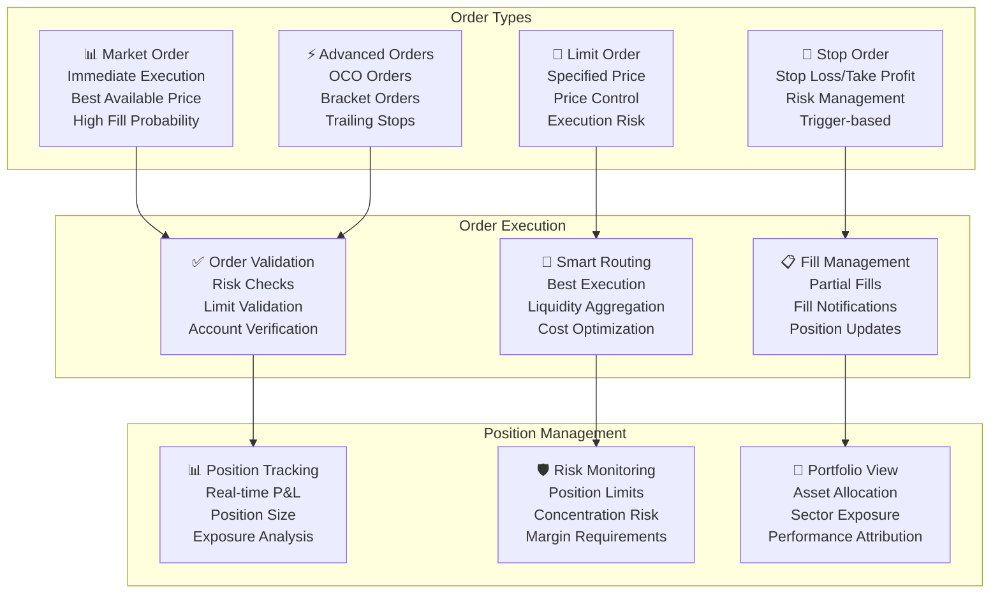
```mermaid
graph TB
    subgraph "Order Types"
        MARKET_ORDER[📊 Market Order<br/>Immediate Execution<br/>Best Available Price<br/>High Fill Probability]
        LIMIT_ORDER[🎯 Limit Order<br/>Specified Price<br/>Price Control<br/>Execution Risk]
        STOP_ORDER[🛑 Stop Order<br/>Stop Loss/Take Profit<br/>Risk Management<br/>Trigger-based]
        ADVANCED_ORDERS[⚡ Advanced Orders<br/>OCO Orders<br/>Bracket Orders<br/>Trailing Stops]
    end
    
    subgraph "Order Execution"
        ORDER_VALIDATION[✅ Order Validation<br/>Risk Checks<br/>Limit Validation<br/>Account Verification]
        SMART_ROUTING[🧠 Smart Routing<br/>Best Execution<br/>Liquidity Aggregation<br/>Cost Optimization]
        FILL_MANAGEMENT[📋 Fill Management<br/>Partial Fills<br/>Fill Notifications<br/>Position Updates]
    end
    
    subgraph "Position Management"
        POSITION_TRACKING[📊 Position Tracking<br/>Real-time P&L<br/>Position Size<br/>Exposure Analysis]
        RISK_MONITORING[🛡️ Risk Monitoring<br/>Position Limits<br/>Concentration Risk<br/>Margin Requirements]
        PORTFOLIO_VIEW[💼 Portfolio View<br/>Asset Allocation<br/>Sector Exposure<br/>Performance Attribution]
    end
    
    MARKET_ORDER --> ORDER_VALIDATION
    LIMIT_ORDER --> SMART_ROUTING
    STOP_ORDER --> FILL_MANAGEMENT
    ADVANCED_ORDERS --> ORDER_VALIDATION
    
    ORDER_VALIDATION --> POSITION_TRACKING
    SMART_ROUTING --> RISK_MONITORING
    FILL_MANAGEMENT --> PORTFOLIO_VIEW
```

### Real-time Market Data

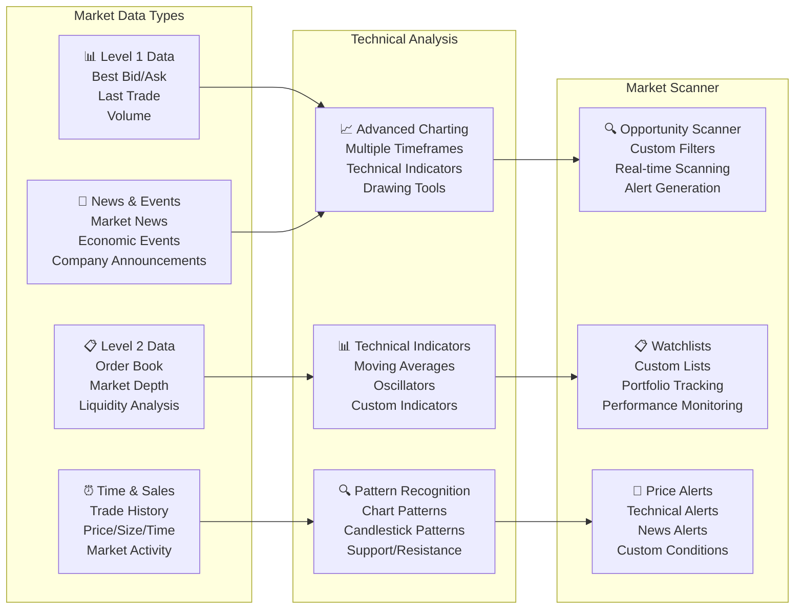
```mermaid
graph LR
    subgraph "Market Data Types"
        LEVEL_1[📊 Level 1 Data<br/>Best Bid/Ask<br/>Last Trade<br/>Volume]
        LEVEL_2[📋 Level 2 Data<br/>Order Book<br/>Market Depth<br/>Liquidity Analysis]
        TIME_SALES[⏰ Time & Sales<br/>Trade History<br/>Price/Size/Time<br/>Market Activity]
        NEWS_EVENTS[📰 News & Events<br/>Market News<br/>Economic Events<br/>Company Announcements]
    end
    
    subgraph "Technical Analysis"
        CHARTING[📈 Advanced Charting<br/>Multiple Timeframes<br/>Technical Indicators<br/>Drawing Tools]
        INDICATORS[📊 Technical Indicators<br/>Moving Averages<br/>Oscillators<br/>Custom Indicators]
        PATTERN_RECOGNITION[🔍 Pattern Recognition<br/>Chart Patterns<br/>Candlestick Patterns<br/>Support/Resistance]
    end
    
    subgraph "Market Scanner"
        OPPORTUNITY_SCANNER[🔍 Opportunity Scanner<br/>Custom Filters<br/>Real-time Scanning<br/>Alert Generation]
        WATCHLISTS[📋 Watchlists<br/>Custom Lists<br/>Portfolio Tracking<br/>Performance Monitoring]
        ALERTS[🚨 Price Alerts<br/>Technical Alerts<br/>News Alerts<br/>Custom Conditions]
    end
    
    LEVEL_1 --> CHARTING
    LEVEL_2 --> INDICATORS
    TIME_SALES --> PATTERN_RECOGNITION
    NEWS_EVENTS --> CHARTING
    
    CHARTING --> OPPORTUNITY_SCANNER
    INDICATORS --> WATCHLISTS
    PATTERN_RECOGNITION --> ALERTS
```

## Risk Management Guide

### Risk Assessment Framework

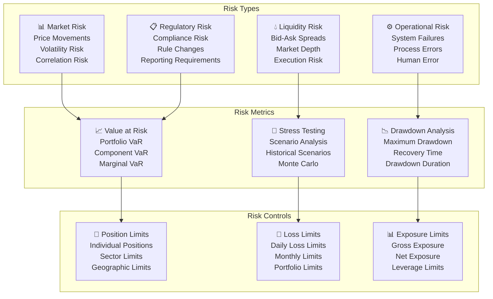
```mermaid
graph TB
    subgraph "Risk Types"
        MARKET_RISK[📊 Market Risk<br/>Price Movements<br/>Volatility Risk<br/>Correlation Risk]
        LIQUIDITY_RISK[💧 Liquidity Risk<br/>Bid-Ask Spreads<br/>Market Depth<br/>Execution Risk]
        OPERATIONAL_RISK[⚙️ Operational Risk<br/>System Failures<br/>Process Errors<br/>Human Error]
        REGULATORY_RISK[📋 Regulatory Risk<br/>Compliance Risk<br/>Rule Changes<br/>Reporting Requirements]
    end
    
    subgraph "Risk Metrics"
        VAR_CALCULATION[📈 Value at Risk<br/>Portfolio VaR<br/>Component VaR<br/>Marginal VaR]
        STRESS_TESTING[💪 Stress Testing<br/>Scenario Analysis<br/>Historical Scenarios<br/>Monte Carlo]
        DRAWDOWN_ANALYSIS[📉 Drawdown Analysis<br/>Maximum Drawdown<br/>Recovery Time<br/>Drawdown Duration]
    end
    
    subgraph "Risk Controls"
        POSITION_LIMITS[🎯 Position Limits<br/>Individual Positions<br/>Sector Limits<br/>Geographic Limits]
        LOSS_LIMITS[🛑 Loss Limits<br/>Daily Loss Limits<br/>Monthly Limits<br/>Portfolio Limits]
        EXPOSURE_LIMITS[📊 Exposure Limits<br/>Gross Exposure<br/>Net Exposure<br/>Leverage Limits]
    end
    
    MARKET_RISK --> VAR_CALCULATION
    LIQUIDITY_RISK --> STRESS_TESTING
    OPERATIONAL_RISK --> DRAWDOWN_ANALYSIS
    REGULATORY_RISK --> VAR_CALCULATION
    
    VAR_CALCULATION --> POSITION_LIMITS
    STRESS_TESTING --> LOSS_LIMITS
    DRAWDOWN_ANALYSIS --> EXPOSURE_LIMITS
```

### Risk Monitoring Dashboard

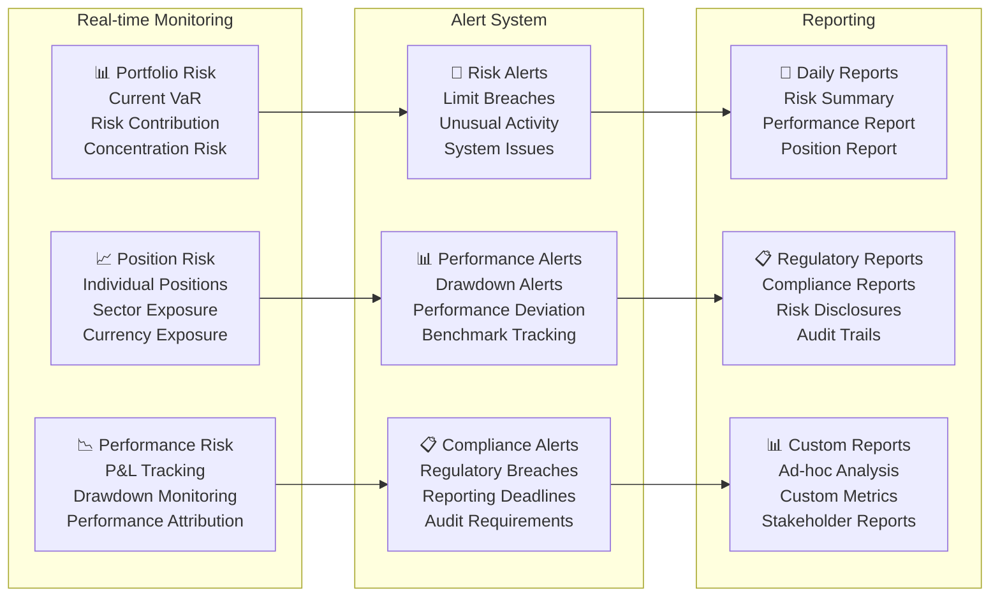
```mermaid
graph LR
    subgraph "Real-time Monitoring"
        PORTFOLIO_RISK[📊 Portfolio Risk<br/>Current VaR<br/>Risk Contribution<br/>Concentration Risk]
        POSITION_RISK[📈 Position Risk<br/>Individual Positions<br/>Sector Exposure<br/>Currency Exposure]
        PERFORMANCE_RISK[📉 Performance Risk<br/>P&L Tracking<br/>Drawdown Monitoring<br/>Performance Attribution]
    end
    
    subgraph "Alert System"
        RISK_ALERTS[🚨 Risk Alerts<br/>Limit Breaches<br/>Unusual Activity<br/>System Issues]
        PERFORMANCE_ALERTS[📊 Performance Alerts<br/>Drawdown Alerts<br/>Performance Deviation<br/>Benchmark Tracking]
        COMPLIANCE_ALERTS[📋 Compliance Alerts<br/>Regulatory Breaches<br/>Reporting Deadlines<br/>Audit Requirements]
    end
    
    subgraph "Reporting"
        DAILY_REPORTS[📅 Daily Reports<br/>Risk Summary<br/>Performance Report<br/>Position Report]
        REGULATORY_REPORTS[📋 Regulatory Reports<br/>Compliance Reports<br/>Risk Disclosures<br/>Audit Trails]
        CUSTOM_REPORTS[📊 Custom Reports<br/>Ad-hoc Analysis<br/>Custom Metrics<br/>Stakeholder Reports]
    end
    
    PORTFOLIO_RISK --> RISK_ALERTS
    POSITION_RISK --> PERFORMANCE_ALERTS
    PERFORMANCE_RISK --> COMPLIANCE_ALERTS
    
    RISK_ALERTS --> DAILY_REPORTS
    PERFORMANCE_ALERTS --> REGULATORY_REPORTS
    COMPLIANCE_ALERTS --> CUSTOM_REPORTS
```

## AI Assistant Guide

### Natural Language Interface

```mermaid
graph TB
    subgraph "Query Types"
        STRATEGY_QUERIES[🧠 Strategy Queries<br/>"Create a momentum strategy"<br/>"Optimize my portfolio"<br/>"Find arbitrage opportunities"]
        MARKET_QUERIES[📊 Market Queries<br/>"What's happening with AAPL?"<br/>"Show me tech sector trends"<br/>"Analyze market volatility"]
        PERFORMANCE_QUERIES[📈 Performance Queries<br/>"How is my portfolio doing?"<br/>"Show risk metrics"<br/>"Compare to benchmark"]
        EDUCATIONAL_QUERIES[🎓 Educational Queries<br/>"Explain options trading"<br/>"What is VaR?"<br/>"How does backtesting work?"]
    end
    
    subgraph "AI Processing"
        INTENT_RECOGNITION[🎯 Intent Recognition<br/>Query Understanding<br/>Context Analysis<br/>Action Mapping]
        KNOWLEDGE_RETRIEVAL[📚 Knowledge Retrieval<br/>Information Lookup<br/>Data Analysis<br/>Pattern Recognition]
        RESPONSE_GENERATION[💬 Response Generation<br/>Natural Language<br/>Actionable Insights<br/>Follow-up Suggestions]
    end
    
    subgraph "Response Types"
        ANALYTICAL_RESPONSES[📊 Analytical Responses<br/>Data Analysis<br/>Charts & Graphs<br/>Statistical Insights]
        ACTIONABLE_RESPONSES[⚡ Actionable Responses<br/>Strategy Suggestions<br/>Trade Ideas<br/>Risk Recommendations]
        EDUCATIONAL_RESPONSES[🎓 Educational Responses<br/>Explanations<br/>Tutorials<br/>Best Practices]
    end
    
    STRATEGY_QUERIES --> INTENT_RECOGNITION
    MARKET_QUERIES --> KNOWLEDGE_RETRIEVAL
    PERFORMANCE_QUERIES --> RESPONSE_GENERATION
    EDUCATIONAL_QUERIES --> INTENT_RECOGNITION
    
    INTENT_RECOGNITION --> ANALYTICAL_RESPONSES
    KNOWLEDGE_RETRIEVAL --> ACTIONABLE_RESPONSES
    RESPONSE_GENERATION --> EDUCATIONAL_RESPONSES
```

### AI Agent Ecosystem

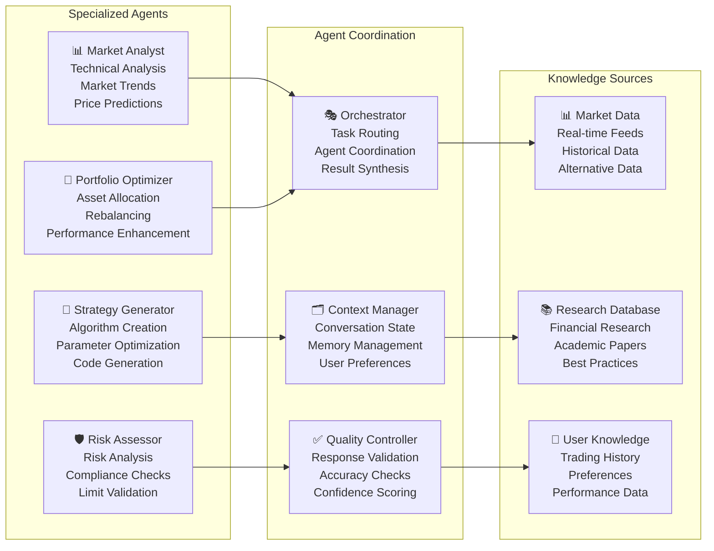
```mermaid
graph LR
    subgraph "Specialized Agents"
        MARKET_ANALYST[📊 Market Analyst<br/>Technical Analysis<br/>Market Trends<br/>Price Predictions]
        STRATEGY_GENERATOR[🧠 Strategy Generator<br/>Algorithm Creation<br/>Parameter Optimization<br/>Code Generation]
        RISK_ASSESSOR[🛡️ Risk Assessor<br/>Risk Analysis<br/>Compliance Checks<br/>Limit Validation]
        PORTFOLIO_OPTIMIZER[💼 Portfolio Optimizer<br/>Asset Allocation<br/>Rebalancing<br/>Performance Enhancement]
    end
    
    subgraph "Agent Coordination"
        ORCHESTRATOR[🎭 Orchestrator<br/>Task Routing<br/>Agent Coordination<br/>Result Synthesis]
        CONTEXT_MANAGER[🗂️ Context Manager<br/>Conversation State<br/>Memory Management<br/>User Preferences]
        QUALITY_CONTROLLER[✅ Quality Controller<br/>Response Validation<br/>Accuracy Checks<br/>Confidence Scoring]
    end
    
    subgraph "Knowledge Sources"
        MARKET_DATA[📊 Market Data<br/>Real-time Feeds<br/>Historical Data<br/>Alternative Data]
        RESEARCH_DATABASE[📚 Research Database<br/>Financial Research<br/>Academic Papers<br/>Best Practices]
        USER_KNOWLEDGE[👤 User Knowledge<br/>Trading History<br/>Preferences<br/>Performance Data]
    end
    
    MARKET_ANALYST --> ORCHESTRATOR
    STRATEGY_GENERATOR --> CONTEXT_MANAGER
    RISK_ASSESSOR --> QUALITY_CONTROLLER
    PORTFOLIO_OPTIMIZER --> ORCHESTRATOR
    
    ORCHESTRATOR --> MARKET_DATA
    CONTEXT_MANAGER --> RESEARCH_DATABASE
    QUALITY_CONTROLLER --> USER_KNOWLEDGE
```

## Advanced Features Guide

### Multi-Asset Trading

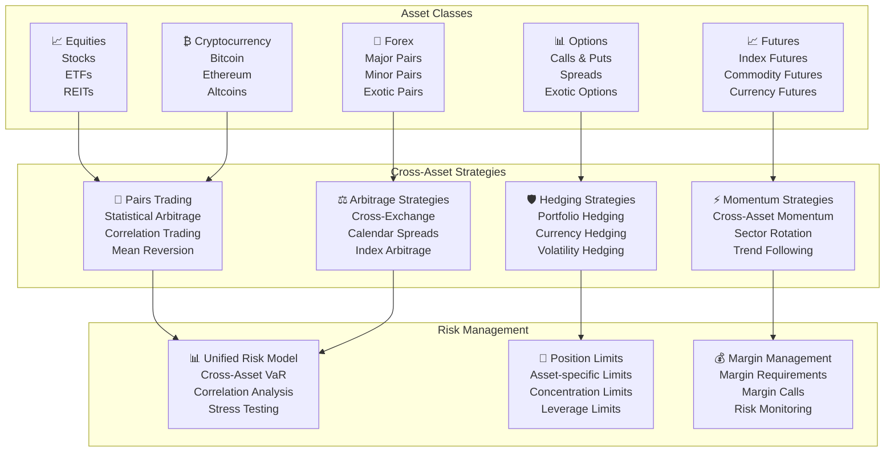
```mermaid
graph TB
    subgraph "Asset Classes"
        EQUITIES[📈 Equities<br/>Stocks<br/>ETFs<br/>REITs]
        OPTIONS[📊 Options<br/>Calls & Puts<br/>Spreads<br/>Exotic Options]
        FUTURES[📈 Futures<br/>Index Futures<br/>Commodity Futures<br/>Currency Futures]
        FOREX[💱 Forex<br/>Major Pairs<br/>Minor Pairs<br/>Exotic Pairs]
        CRYPTO[₿ Cryptocurrency<br/>Bitcoin<br/>Ethereum<br/>Altcoins]
    end
    
    subgraph "Cross-Asset Strategies"
        PAIRS_TRADING[🔄 Pairs Trading<br/>Statistical Arbitrage<br/>Correlation Trading<br/>Mean Reversion]
        HEDGING_STRATEGIES[🛡️ Hedging Strategies<br/>Portfolio Hedging<br/>Currency Hedging<br/>Volatility Hedging]
        MOMENTUM_STRATEGIES[⚡ Momentum Strategies<br/>Cross-Asset Momentum<br/>Sector Rotation<br/>Trend Following]
        ARBITRAGE_STRATEGIES[⚖️ Arbitrage Strategies<br/>Cross-Exchange<br/>Calendar Spreads<br/>Index Arbitrage]
    end
    
    subgraph "Risk Management"
        UNIFIED_RISK[📊 Unified Risk Model<br/>Cross-Asset VaR<br/>Correlation Analysis<br/>Stress Testing]
        POSITION_LIMITS[🎯 Position Limits<br/>Asset-specific Limits<br/>Concentration Limits<br/>Leverage Limits]
        MARGIN_MANAGEMENT[💰 Margin Management<br/>Margin Requirements<br/>Margin Calls<br/>Risk Monitoring]
    end
    
    EQUITIES --> PAIRS_TRADING
    OPTIONS --> HEDGING_STRATEGIES
    FUTURES --> MOMENTUM_STRATEGIES
    FOREX --> ARBITRAGE_STRATEGIES
    CRYPTO --> PAIRS_TRADING
    
    PAIRS_TRADING --> UNIFIED_RISK
    HEDGING_STRATEGIES --> POSITION_LIMITS
    MOMENTUM_STRATEGIES --> MARGIN_MANAGEMENT
    ARBITRAGE_STRATEGIES --> UNIFIED_RISK
```

### Portfolio Analytics

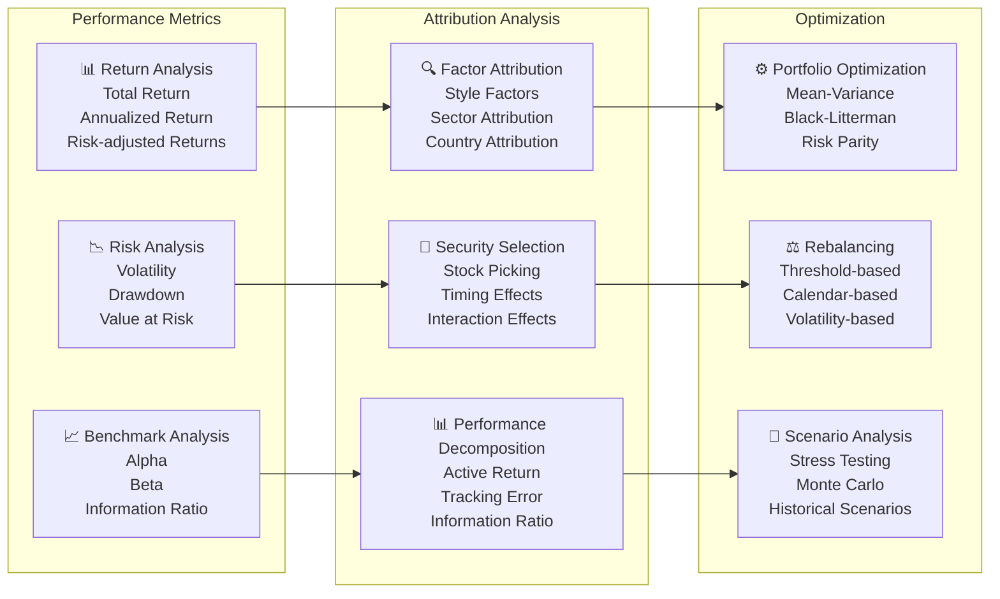
```mermaid
graph LR
    subgraph "Performance Metrics"
        RETURN_ANALYSIS[📊 Return Analysis<br/>Total Return<br/>Annualized Return<br/>Risk-adjusted Returns]
        RISK_ANALYSIS[📉 Risk Analysis<br/>Volatility<br/>Drawdown<br/>Value at Risk]
        BENCHMARK_ANALYSIS[📈 Benchmark Analysis<br/>Alpha<br/>Beta<br/>Information Ratio]
    end
    
    subgraph "Attribution Analysis"
        FACTOR_ATTRIBUTION[🔍 Factor Attribution<br/>Style Factors<br/>Sector Attribution<br/>Country Attribution]
        SECURITY_SELECTION[🎯 Security Selection<br/>Stock Picking<br/>Timing Effects<br/>Interaction Effects]
        PERFORMANCE_DECOMPOSITION[📊 Performance Decomposition<br/>Active Return<br/>Tracking Error<br/>Information Ratio]
    end
    
    subgraph "Optimization"
        PORTFOLIO_OPTIMIZATION[⚙️ Portfolio Optimization<br/>Mean-Variance<br/>Black-Litterman<br/>Risk Parity]
        REBALANCING[⚖️ Rebalancing<br/>Threshold-based<br/>Calendar-based<br/>Volatility-based]
        SCENARIO_ANALYSIS[🎲 Scenario Analysis<br/>Stress Testing<br/>Monte Carlo<br/>Historical Scenarios]
    end
    
    RETURN_ANALYSIS --> FACTOR_ATTRIBUTION
    RISK_ANALYSIS --> SECURITY_SELECTION
    BENCHMARK_ANALYSIS --> PERFORMANCE_DECOMPOSITION
    
    FACTOR_ATTRIBUTION --> PORTFOLIO_OPTIMIZATION
    SECURITY_SELECTION --> REBALANCING
    PERFORMANCE_DECOMPOSITION --> SCENARIO_ANALYSIS
```

## API Integration Guide

### REST API Usage

```python
# Python SDK Example - Complete Trading Workflow
import asyncio
from ats_sdk import ATSClient, Order, Strategy

async def main():
    # Initialize client
    client = ATSClient(
        api_key="your_api_key",
        secret="your_secret",
        environment="production"
    )
    
    # Authenticate
    await client.authenticate()
    
    # Get account information
    accounts = await client.accounts.list()
    account = accounts[0]
    print(f"Account Balance: ${account.balance:,.2f}")
    
    # Create AI-powered strategy
    strategy_prompt = """
    Create a mean reversion strategy for AAPL that:
    - Uses RSI(14) oversold/overbought levels
    - Enters long when RSI < 30
    - Exits when RSI > 70
    - Uses 2% stop loss
    - Position size based on volatility
    """
    
    generated_strategy = await client.ai.generate_strategy(strategy_prompt)
    print(f"Generated Strategy: {generated_strategy.name}")
    
    # Backtest the strategy
    backtest_config = {
        "start_date": "2023-01-01",
        "end_date": "2024-01-01",
        "initial_capital": 100000,
        "benchmark": "SPY"
    }
    
    backtest_result = await client.strategies.backtest(
        strategy_id=generated_strategy.id,
        config=backtest_config
    )
    
    print(f"Backtest Results:")
    print(f"Total Return: {backtest_result.total_return:.2%}")
    print(f"Sharpe Ratio: {backtest_result.sharpe_ratio:.2f}")
    print(f"Max Drawdown: {backtest_result.max_drawdown:.2%}")
    
    # Deploy to paper trading if results are good
    if backtest_result.sharpe_ratio > 1.0:
        deployment = await client.strategies.deploy(
            strategy_id=generated_strategy.id,
            account_id=account.id,
            mode="paper",
            capital_allocation=10000
        )
        print(f"Strategy deployed to paper trading: {deployment.id}")
    
    # Monitor real-time performance
    async def monitor_performance():
        async for update in client.strategies.stream_performance(deployment.id):
            print(f"P&L: ${update.pnl:,.2f}, Return: {update.return_pct:.2%}")
    
    # Start monitoring in background
    asyncio.create_task(monitor_performance())
    
    # Place manual order
    order = Order(
        symbol="AAPL",
        side="buy",
        quantity=10,
        order_type="market",
        account_id=account.id
    )
    
    submitted_order = await client.orders.create(order)
    print(f"Order submitted: {submitted_order.id}")
    
    # Wait for fill
    filled_order = await client.orders.wait_for_fill(submitted_order.id, timeout=30)
    print(f"Order filled at ${filled_order.avg_fill_price:.2f}")

if __name__ == "__main__":
    asyncio.run(main())
```

### WebSocket Integration

```javascript
// JavaScript WebSocket Example
import { ATSWebSocket } from '@ats/sdk';

const ws = new ATSWebSocket({
  apiKey: 'your_api_key',
  secret: 'your_secret',
  environment: 'production'
});

// Connection management
ws.on('connected', () => {
  console.log('WebSocket connected');
  
  // Subscribe to real-time market data
  ws.subscribe('quotes', ['AAPL', 'MSFT', 'GOOGL']);
  
  // Subscribe to portfolio updates
  ws.subscribe('portfolio', { account_id: 'account_123' });
  
  // Subscribe to AI insights
  ws.subscribe('ai_insights', { topics: ['market_analysis', 'strategy_suggestions'] });
});

// Market data handlers
ws.on('quote', (quote) => {
  console.log(`${quote.symbol}: $${quote.last} (${quote.change_pct:+.2%})`);
  
  // Update UI with real-time prices
  updatePriceDisplay(quote.symbol, quote.last, quote.change_pct);
});

ws.on('trade', (trade) => {
  console.log(`Trade: ${trade.symbol} ${trade.size}@${trade.price}`);
  
  // Update volume indicators
  updateVolumeChart(trade.symbol, trade.size, trade.price);
});

// Portfolio update handlers
ws.on('position', (position) => {
  console.log(`Position Update: ${position.symbol} ${position.quantity}@${position.avg_price}`);
  
  // Update portfolio display
  updatePositionDisplay(position);
});

ws.on('pnl', (pnl) => {
  console.log(`P&L Update: ${pnl.realized_pnl:+.2f} realized, ${pnl.unrealized_pnl:+.2f} unrealized`);
  
  // Update P&L dashboard
  updatePnLDisplay(pnl);
});

// AI insights handlers
ws.on('ai_insight', (insight) => {
  console.log(`AI Insight: ${insight.type} - ${insight.message}`);
  
  // Display AI recommendations
  displayAIInsight(insight);
});

ws.on('strategy_suggestion', (suggestion) => {
  console.log(`Strategy Suggestion: ${suggestion.strategy_name}`);
  console.log(`Confidence: ${suggestion.confidence:.1%}`);
  
  // Show strategy suggestion to user
  showStrategySuggestion(suggestion);
});

// Error handling
ws.on('error', (error) => {
  console.error('WebSocket error:', error);
  
  // Implement reconnection logic
  setTimeout(() => ws.reconnect(), 5000);
});

ws.on('disconnected', () => {
  console.log('WebSocket disconnected');
  
  // Show connection status to user
  showConnectionStatus('disconnected');
});

// Connect to WebSocket
ws.connect();
```

## Best Practices & Tips

### Trading Best Practices

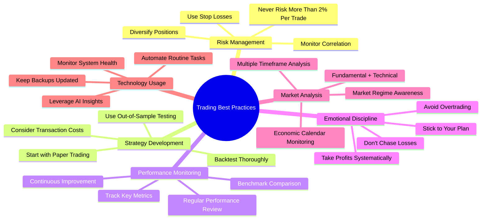
```mermaid
mindmap
  root((Trading Best Practices))
    Risk Management
      Never Risk More Than 2% Per Trade
      Use Stop Losses
      Diversify Positions
      Monitor Correlation
    Strategy Development
      Start with Paper Trading
      Backtest Thoroughly
      Use Out-of-Sample Testing
      Consider Transaction Costs
    Performance Monitoring
      Track Key Metrics
      Regular Performance Review
      Benchmark Comparison
      Continuous Improvement
    Emotional Discipline
      Stick to Your Plan
      Avoid Overtrading
      Don't Chase Losses
      Take Profits Systematically
    Market Analysis
      Multiple Timeframe Analysis
      Fundamental + Technical
      Market Regime Awareness
      Economic Calendar Monitoring
    Technology Usage
      Leverage AI Insights
      Automate Routine Tasks
      Monitor System Health
      Keep Backups Updated
```

### Common Pitfalls to Avoid

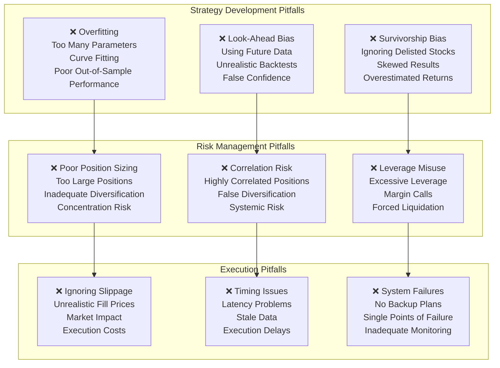
```mermaid
graph TB
    subgraph "Strategy Development Pitfalls"
        OVERFITTING[❌ Overfitting<br/>Too Many Parameters<br/>Curve Fitting<br/>Poor Out-of-Sample Performance]
        LOOK_AHEAD_BIAS[❌ Look-Ahead Bias<br/>Using Future Data<br/>Unrealistic Backtests<br/>False Confidence]
        SURVIVORSHIP_BIAS[❌ Survivorship Bias<br/>Ignoring Delisted Stocks<br/>Skewed Results<br/>Overestimated Returns]
    end
    
    subgraph "Risk Management Pitfalls"
        POSITION_SIZING[❌ Poor Position Sizing<br/>Too Large Positions<br/>Inadequate Diversification<br/>Concentration Risk]
        CORRELATION_RISK[❌ Correlation Risk<br/>Highly Correlated Positions<br/>False Diversification<br/>Systemic Risk]
        LEVERAGE_MISUSE[❌ Leverage Misuse<br/>Excessive Leverage<br/>Margin Calls<br/>Forced Liquidation]
    end
    
    subgraph "Execution Pitfalls"
        SLIPPAGE_IGNORE[❌ Ignoring Slippage<br/>Unrealistic Fill Prices<br/>Market Impact<br/>Execution Costs]
        TIMING_ISSUES[❌ Timing Issues<br/>Latency Problems<br/>Stale Data<br/>Execution Delays]
        SYSTEM_FAILURES[❌ System Failures<br/>No Backup Plans<br/>Single Points of Failure<br/>Inadequate Monitoring]
    end
    
    OVERFITTING --> POSITION_SIZING
    LOOK_AHEAD_BIAS --> CORRELATION_RISK
    SURVIVORSHIP_BIAS --> LEVERAGE_MISUSE
    
    POSITION_SIZING --> SLIPPAGE_IGNORE
    CORRELATION_RISK --> TIMING_ISSUES
    LEVERAGE_MISUSE --> SYSTEM_FAILURES
```

## Troubleshooting & Support

### Common Issues & Solutions

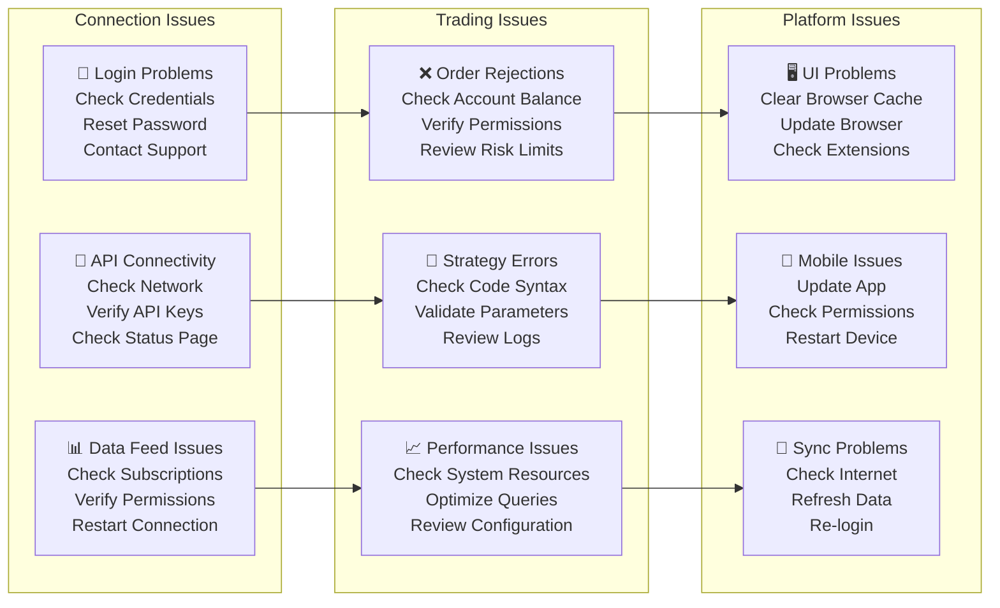
```mermaid
graph LR
    subgraph "Connection Issues"
        LOGIN_PROBLEMS[🔐 Login Problems<br/>Check Credentials<br/>Reset Password<br/>Contact Support]
        API_CONNECTIVITY[🔗 API Connectivity<br/>Check Network<br/>Verify API Keys<br/>Check Status Page]
        DATA_FEED_ISSUES[📊 Data Feed Issues<br/>Check Subscriptions<br/>Verify Permissions<br/>Restart Connection]
    end
    
    subgraph "Trading Issues"
        ORDER_REJECTIONS[❌ Order Rejections<br/>Check Account Balance<br/>Verify Permissions<br/>Review Risk Limits]
        STRATEGY_ERRORS[🧠 Strategy Errors<br/>Check Code Syntax<br/>Validate Parameters<br/>Review Logs]
        PERFORMANCE_ISSUES[📈 Performance Issues<br/>Check System Resources<br/>Optimize Queries<br/>Review Configuration]
    end
    
    subgraph "Platform Issues"
        UI_PROBLEMS[🖥️ UI Problems<br/>Clear Browser Cache<br/>Update Browser<br/>Check Extensions]
        MOBILE_ISSUES[📱 Mobile Issues<br/>Update App<br/>Check Permissions<br/>Restart Device]
        SYNC_PROBLEMS[🔄 Sync Problems<br/>Check Internet<br/>Refresh Data<br/>Re-login]
    end
    
    LOGIN_PROBLEMS --> ORDER_REJECTIONS
    API_CONNECTIVITY --> STRATEGY_ERRORS
    DATA_FEED_ISSUES --> PERFORMANCE_ISSUES
    
    ORDER_REJECTIONS --> UI_PROBLEMS
    STRATEGY_ERRORS --> MOBILE_ISSUES
    PERFORMANCE_ISSUES --> SYNC_PROBLEMS
```

### Support Resources

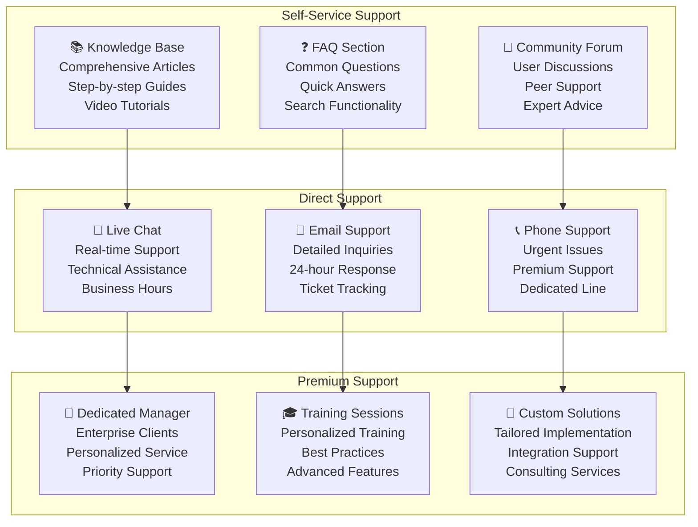
```mermaid
graph TB
    subgraph "Self-Service Support"
        KNOWLEDGE_BASE[📚 Knowledge Base<br/>Comprehensive Articles<br/>Step-by-step Guides<br/>Video Tutorials]
        FAQ_SECTION[❓ FAQ Section<br/>Common Questions<br/>Quick Answers<br/>Search Functionality]
        COMMUNITY_FORUM[👥 Community Forum<br/>User Discussions<br/>Peer Support<br/>Expert Advice]
    end
    
    subgraph "Direct Support"
        LIVE_CHAT[💬 Live Chat<br/>Real-time Support<br/>Technical Assistance<br/>Business Hours]
        EMAIL_SUPPORT[📧 Email Support<br/>Detailed Inquiries<br/>24-hour Response<br/>Ticket Tracking]
        PHONE_SUPPORT[📞 Phone Support<br/>Urgent Issues<br/>Premium Support<br/>Dedicated Line]
    end
    
    subgraph "Premium Support"
        DEDICATED_MANAGER[👤 Dedicated Manager<br/>Enterprise Clients<br/>Personalized Service<br/>Priority Support]
        TRAINING_SESSIONS[🎓 Training Sessions<br/>Personalized Training<br/>Best Practices<br/>Advanced Features]
        CUSTOM_SOLUTIONS[🔧 Custom Solutions<br/>Tailored Implementation<br/>Integration Support<br/>Consulting Services]
    end
    
    KNOWLEDGE_BASE --> LIVE_CHAT
    FAQ_SECTION --> EMAIL_SUPPORT
    COMMUNITY_FORUM --> PHONE_SUPPORT
    
    LIVE_CHAT --> DEDICATED_MANAGER
    EMAIL_SUPPORT --> TRAINING_SESSIONS
    PHONE_SUPPORT --> CUSTOM_SOLUTIONS
```

---

**Document Classification**: User Documentation  
**Next Review Date**: 01 February 2026  
**Document Owner**: Product Team  
**Approval**: Chief Product Officer, User Experience Committee