# System Requirements Specification

**Document Version**: 1.0.0  
**Last Updated**: 27 January 2025  
**Classification**: Requirements Documentation  
**Owner**: Product Management Team

## Executive Summary

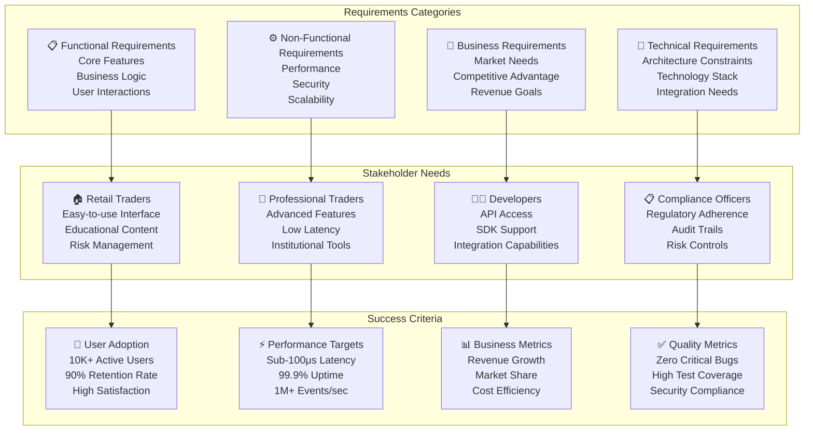
```mermaid
graph TB
    subgraph "Requirements Categories"
        FUNCTIONAL[📋 Functional Requirements<br/>Core Features<br/>Business Logic<br/>User Interactions]
        NON_FUNCTIONAL[⚙️ Non-Functional Requirements<br/>Performance<br/>Security<br/>Scalability]
        BUSINESS[💼 Business Requirements<br/>Market Needs<br/>Competitive Advantage<br/>Revenue Goals]
        TECHNICAL[🔧 Technical Requirements<br/>Architecture Constraints<br/>Technology Stack<br/>Integration Needs]
    end
    
    subgraph "Stakeholder Needs"
        RETAIL_TRADERS[🏠 Retail Traders<br/>Easy-to-use Interface<br/>Educational Content<br/>Risk Management]
        PROFESSIONAL_TRADERS[🏢 Professional Traders<br/>Advanced Features<br/>Low Latency<br/>Institutional Tools]
        DEVELOPERS[👨‍💻 Developers<br/>API Access<br/>SDK Support<br/>Integration Capabilities]
        COMPLIANCE[📋 Compliance Officers<br/>Regulatory Adherence<br/>Audit Trails<br/>Risk Controls]
    end
    
    subgraph "Success Criteria"
        USER_ADOPTION[👥 User Adoption<br/>10K+ Active Users<br/>90% Retention Rate<br/>High Satisfaction]
        PERFORMANCE_TARGETS[⚡ Performance Targets<br/>Sub-100μs Latency<br/>99.9% Uptime<br/>1M+ Events/sec]
        BUSINESS_METRICS[📊 Business Metrics<br/>Revenue Growth<br/>Market Share<br/>Cost Efficiency]
        QUALITY_METRICS[✅ Quality Metrics<br/>Zero Critical Bugs<br/>High Test Coverage<br/>Security Compliance]
    end
    
    FUNCTIONAL --> RETAIL_TRADERS
    NON_FUNCTIONAL --> PROFESSIONAL_TRADERS
    BUSINESS --> DEVELOPERS
    TECHNICAL --> COMPLIANCE
    
    RETAIL_TRADERS --> USER_ADOPTION
    PROFESSIONAL_TRADERS --> PERFORMANCE_TARGETS
    DEVELOPERS --> BUSINESS_METRICS
    COMPLIANCE --> QUALITY_METRICS
```

This document provides comprehensive requirements for the Algorithmic Trading System (ATS), covering functional capabilities, performance targets, security requirements, and business objectives. The requirements are organized to support both retail and professional trading use cases while maintaining enterprise-grade reliability and compliance.

## Functional Requirements

### Core Trading Functionality

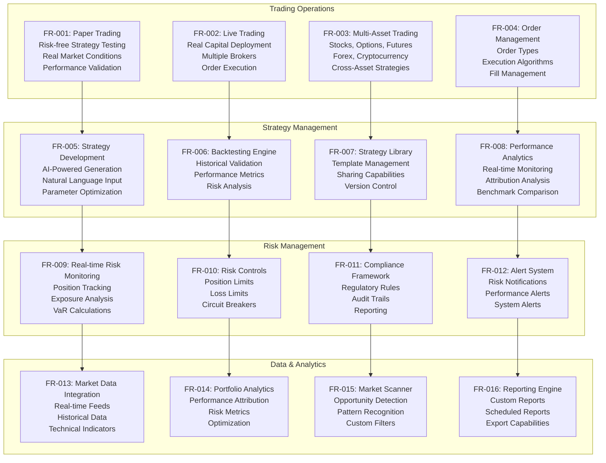
```mermaid
graph TB
    subgraph "Trading Operations"
        FR001[FR-001: Paper Trading<br/>Risk-free Strategy Testing<br/>Real Market Conditions<br/>Performance Validation]
        FR002[FR-002: Live Trading<br/>Real Capital Deployment<br/>Multiple Brokers<br/>Order Execution]
        FR003[FR-003: Multi-Asset Trading<br/>Stocks, Options, Futures<br/>Forex, Cryptocurrency<br/>Cross-Asset Strategies]
        FR004[FR-004: Order Management<br/>Order Types<br/>Execution Algorithms<br/>Fill Management]
    end
    
    subgraph "Strategy Management"
        FR005[FR-005: Strategy Development<br/>AI-Powered Generation<br/>Natural Language Input<br/>Parameter Optimization]
        FR006[FR-006: Backtesting Engine<br/>Historical Validation<br/>Performance Metrics<br/>Risk Analysis]
        FR007[FR-007: Strategy Library<br/>Template Management<br/>Sharing Capabilities<br/>Version Control]
        FR008[FR-008: Performance Analytics<br/>Real-time Monitoring<br/>Attribution Analysis<br/>Benchmark Comparison]
    end
    
    subgraph "Risk Management"
        FR009[FR-009: Real-time Risk Monitoring<br/>Position Tracking<br/>Exposure Analysis<br/>VaR Calculations]
        FR010[FR-010: Risk Controls<br/>Position Limits<br/>Loss Limits<br/>Circuit Breakers]
        FR011[FR-011: Compliance Framework<br/>Regulatory Rules<br/>Audit Trails<br/>Reporting]
        FR012[FR-012: Alert System<br/>Risk Notifications<br/>Performance Alerts<br/>System Alerts]
    end
    
    subgraph "Data & Analytics"
        FR013[FR-013: Market Data Integration<br/>Real-time Feeds<br/>Historical Data<br/>Technical Indicators]
        FR014[FR-014: Portfolio Analytics<br/>Performance Attribution<br/>Risk Metrics<br/>Optimization]
        FR015[FR-015: Market Scanner<br/>Opportunity Detection<br/>Pattern Recognition<br/>Custom Filters]
        FR016[FR-016: Reporting Engine<br/>Custom Reports<br/>Scheduled Reports<br/>Export Capabilities]
    end
    
    FR001 --> FR005
    FR002 --> FR006
    FR003 --> FR007
    FR004 --> FR008
    
    FR005 --> FR009
    FR006 --> FR010
    FR007 --> FR011
    FR008 --> FR012
    
    FR009 --> FR013
    FR010 --> FR014
    FR011 --> FR015
    FR012 --> FR016
```

### AI-Powered Features

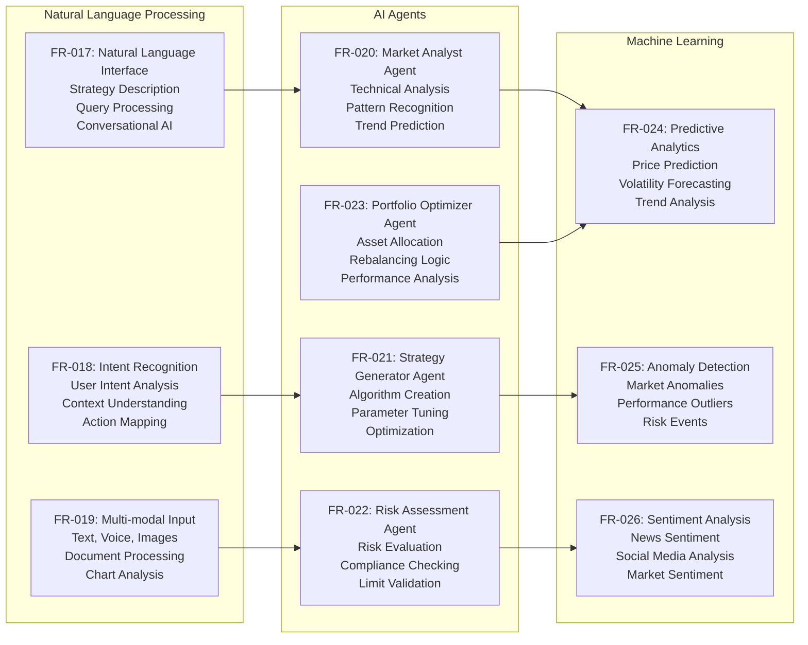
```mermaid
graph LR
    subgraph "Natural Language Processing"
        FR017[FR-017: Natural Language Interface<br/>Strategy Description<br/>Query Processing<br/>Conversational AI]
        FR018[FR-018: Intent Recognition<br/>User Intent Analysis<br/>Context Understanding<br/>Action Mapping]
        FR019[FR-019: Multi-modal Input<br/>Text, Voice, Images<br/>Document Processing<br/>Chart Analysis]
    end
    
    subgraph "AI Agents"
        FR020[FR-020: Market Analyst Agent<br/>Technical Analysis<br/>Pattern Recognition<br/>Trend Prediction]
        FR021[FR-021: Strategy Generator Agent<br/>Algorithm Creation<br/>Parameter Tuning<br/>Optimization]
        FR022[FR-022: Risk Assessment Agent<br/>Risk Evaluation<br/>Compliance Checking<br/>Limit Validation]
        FR023[FR-023: Portfolio Optimizer Agent<br/>Asset Allocation<br/>Rebalancing Logic<br/>Performance Analysis]
    end
    
    subgraph "Machine Learning"
        FR024[FR-024: Predictive Analytics<br/>Price Prediction<br/>Volatility Forecasting<br/>Trend Analysis]
        FR025[FR-025: Anomaly Detection<br/>Market Anomalies<br/>Performance Outliers<br/>Risk Events]
        FR026[FR-026: Sentiment Analysis<br/>News Sentiment<br/>Social Media Analysis<br/>Market Sentiment]
    end
    
    FR017 --> FR020
    FR018 --> FR021
    FR019 --> FR022
    
    FR020 --> FR024
    FR021 --> FR025
    FR022 --> FR026
    FR023 --> FR024
```

### User Interface Requirements

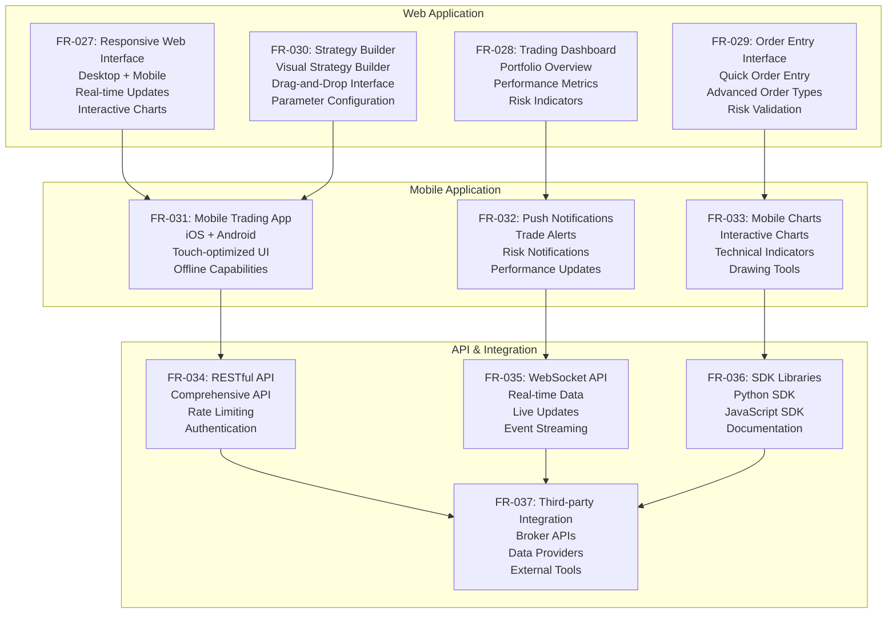
```mermaid
graph TB
    subgraph "Web Application"
        FR027[FR-027: Responsive Web Interface<br/>Desktop + Mobile<br/>Real-time Updates<br/>Interactive Charts]
        FR028[FR-028: Trading Dashboard<br/>Portfolio Overview<br/>Performance Metrics<br/>Risk Indicators]
        FR029[FR-029: Order Entry Interface<br/>Quick Order Entry<br/>Advanced Order Types<br/>Risk Validation]
        FR030[FR-030: Strategy Builder<br/>Visual Strategy Builder<br/>Drag-and-Drop Interface<br/>Parameter Configuration]
    end
    
    subgraph "Mobile Application"
        FR031[FR-031: Mobile Trading App<br/>iOS + Android<br/>Touch-optimized UI<br/>Offline Capabilities]
        FR032[FR-032: Push Notifications<br/>Trade Alerts<br/>Risk Notifications<br/>Performance Updates]
        FR033[FR-033: Mobile Charts<br/>Interactive Charts<br/>Technical Indicators<br/>Drawing Tools]
    end
    
    subgraph "API & Integration"
        FR034[FR-034: RESTful API<br/>Comprehensive API<br/>Rate Limiting<br/>Authentication]
        FR035[FR-035: WebSocket API<br/>Real-time Data<br/>Live Updates<br/>Event Streaming]
        FR036[FR-036: SDK Libraries<br/>Python SDK<br/>JavaScript SDK<br/>Documentation]
        FR037[FR-037: Third-party Integration<br/>Broker APIs<br/>Data Providers<br/>External Tools]
    end
    
    FR027 --> FR031
    FR028 --> FR032
    FR029 --> FR033
    FR030 --> FR031
    
    FR031 --> FR034
    FR032 --> FR035
    FR033 --> FR036
    
    FR034 --> FR037
    FR035 --> FR037
    FR036 --> FR037
```

## Non-Functional Requirements

### Performance Requirements

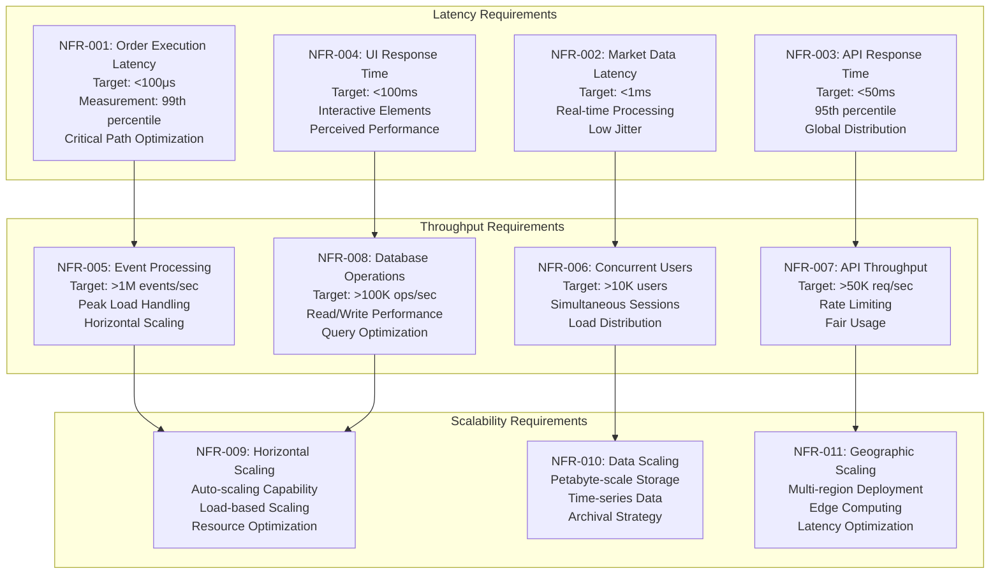
```mermaid
graph TB
    subgraph "Latency Requirements"
        NFR001[NFR-001: Order Execution Latency<br/>Target: <100μs<br/>Measurement: 99th percentile<br/>Critical Path Optimization]
        NFR002[NFR-002: Market Data Latency<br/>Target: <1ms<br/>Real-time Processing<br/>Low Jitter]
        NFR003[NFR-003: API Response Time<br/>Target: <50ms<br/>95th percentile<br/>Global Distribution]
        NFR004[NFR-004: UI Response Time<br/>Target: <100ms<br/>Interactive Elements<br/>Perceived Performance]
    end
    
    subgraph "Throughput Requirements"
        NFR005[NFR-005: Event Processing<br/>Target: >1M events/sec<br/>Peak Load Handling<br/>Horizontal Scaling]
        NFR006[NFR-006: Concurrent Users<br/>Target: >10K users<br/>Simultaneous Sessions<br/>Load Distribution]
        NFR007[NFR-007: API Throughput<br/>Target: >50K req/sec<br/>Rate Limiting<br/>Fair Usage]
        NFR008[NFR-008: Database Operations<br/>Target: >100K ops/sec<br/>Read/Write Performance<br/>Query Optimization]
    end
    
    subgraph "Scalability Requirements"
        NFR009[NFR-009: Horizontal Scaling<br/>Auto-scaling Capability<br/>Load-based Scaling<br/>Resource Optimization]
        NFR010[NFR-010: Data Scaling<br/>Petabyte-scale Storage<br/>Time-series Data<br/>Archival Strategy]
        NFR011[NFR-011: Geographic Scaling<br/>Multi-region Deployment<br/>Edge Computing<br/>Latency Optimization]
    end
    
    NFR001 --> NFR005
    NFR002 --> NFR006
    NFR003 --> NFR007
    NFR004 --> NFR008
    
    NFR005 --> NFR009
    NFR006 --> NFR010
    NFR007 --> NFR011
    NFR008 --> NFR009
```

### Reliability & Availability

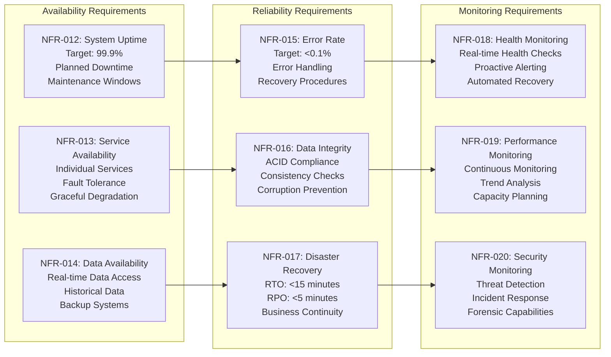
```mermaid
graph LR
    subgraph "Availability Requirements"
        NFR012[NFR-012: System Uptime<br/>Target: 99.9%<br/>Planned Downtime<br/>Maintenance Windows]
        NFR013[NFR-013: Service Availability<br/>Individual Services<br/>Fault Tolerance<br/>Graceful Degradation]
        NFR014[NFR-014: Data Availability<br/>Real-time Data Access<br/>Historical Data<br/>Backup Systems]
    end
    
    subgraph "Reliability Requirements"
        NFR015[NFR-015: Error Rate<br/>Target: <0.1%<br/>Error Handling<br/>Recovery Procedures]
        NFR016[NFR-016: Data Integrity<br/>ACID Compliance<br/>Consistency Checks<br/>Corruption Prevention]
        NFR017[NFR-017: Disaster Recovery<br/>RTO: <15 minutes<br/>RPO: <5 minutes<br/>Business Continuity]
    end
    
    subgraph "Monitoring Requirements"
        NFR018[NFR-018: Health Monitoring<br/>Real-time Health Checks<br/>Proactive Alerting<br/>Automated Recovery]
        NFR019[NFR-019: Performance Monitoring<br/>Continuous Monitoring<br/>Trend Analysis<br/>Capacity Planning]
        NFR020[NFR-020: Security Monitoring<br/>Threat Detection<br/>Incident Response<br/>Forensic Capabilities]
    end
    
    NFR012 --> NFR015
    NFR013 --> NFR016
    NFR014 --> NFR017
    
    NFR015 --> NFR018
    NFR016 --> NFR019
    NFR017 --> NFR020
```

### Security Requirements

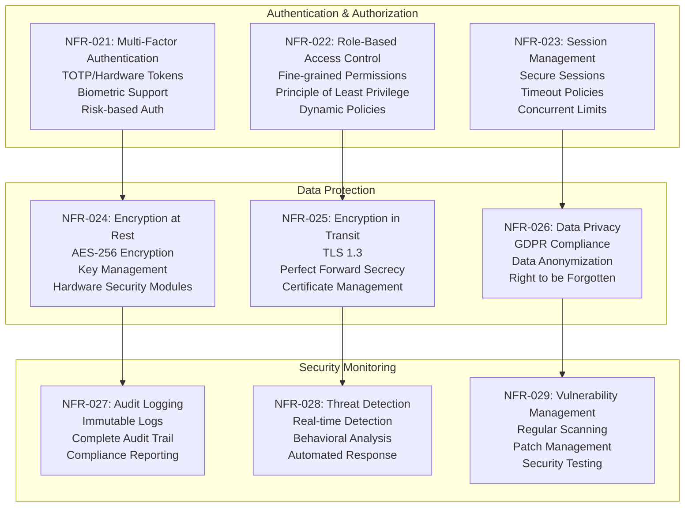
```mermaid
graph TB
    subgraph "Authentication & Authorization"
        NFR021[NFR-021: Multi-Factor Authentication<br/>TOTP/Hardware Tokens<br/>Biometric Support<br/>Risk-based Auth]
        NFR022[NFR-022: Role-Based Access Control<br/>Fine-grained Permissions<br/>Principle of Least Privilege<br/>Dynamic Policies]
        NFR023[NFR-023: Session Management<br/>Secure Sessions<br/>Timeout Policies<br/>Concurrent Limits]
    end
    
    subgraph "Data Protection"
        NFR024[NFR-024: Encryption at Rest<br/>AES-256 Encryption<br/>Key Management<br/>Hardware Security Modules]
        NFR025[NFR-025: Encryption in Transit<br/>TLS 1.3<br/>Perfect Forward Secrecy<br/>Certificate Management]
        NFR026[NFR-026: Data Privacy<br/>GDPR Compliance<br/>Data Anonymization<br/>Right to be Forgotten]
    end
    
    subgraph "Security Monitoring"
        NFR027[NFR-027: Audit Logging<br/>Immutable Logs<br/>Complete Audit Trail<br/>Compliance Reporting]
        NFR028[NFR-028: Threat Detection<br/>Real-time Detection<br/>Behavioral Analysis<br/>Automated Response]
        NFR029[NFR-029: Vulnerability Management<br/>Regular Scanning<br/>Patch Management<br/>Security Testing]
    end
    
    NFR021 --> NFR024
    NFR022 --> NFR025
    NFR023 --> NFR026
    
    NFR024 --> NFR027
    NFR025 --> NFR028
    NFR026 --> NFR029
```

## User Stories & Acceptance Criteria

### Epic 1: Paper Trading Strategy Validation

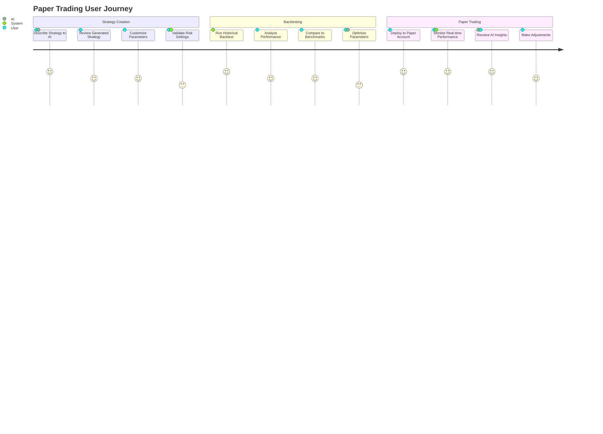
```mermaid
journey
    title Paper Trading User Journey
    section Strategy Creation
      Describe Strategy to AI: 5: User, AI
      Review Generated Strategy: 4: User
      Customize Parameters: 4: User
      Validate Risk Settings: 3: User, System
    section Backtesting
      Run Historical Backtest: 5: System
      Analyze Performance: 4: User
      Compare to Benchmarks: 4: User
      Optimize Parameters: 3: User, AI
    section Paper Trading
      Deploy to Paper Account: 5: User
      Monitor Real-time Performance: 5: User, System
      Receive AI Insights: 5: AI, User
      Make Adjustments: 4: User
```

**User Story US-001**: As a retail trader, I want to test my trading strategies in a risk-free environment so that I can validate their performance before risking real capital.

**Acceptance Criteria**:
- [ ] User can describe trading strategy in natural language
- [ ] AI generates executable strategy code with parameters
- [ ] System runs comprehensive backtest with historical data
- [ ] User receives detailed performance report with metrics
- [ ] Strategy can be deployed to paper trading account
- [ ] Real-time performance monitoring with live market data
- [ ] AI provides insights and optimization suggestions
- [ ] Seamless transition from paper to live trading

### Epic 2: AI-Powered Strategy Development

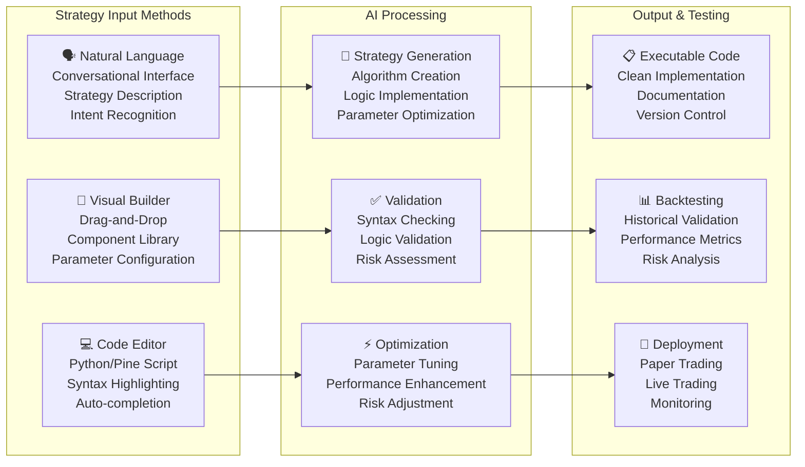
```mermaid
graph LR
    subgraph "Strategy Input Methods"
        NATURAL_LANGUAGE[🗣️ Natural Language<br/>Conversational Interface<br/>Strategy Description<br/>Intent Recognition]
        VISUAL_BUILDER[🎨 Visual Builder<br/>Drag-and-Drop<br/>Component Library<br/>Parameter Configuration]
        CODE_EDITOR[💻 Code Editor<br/>Python/Pine Script<br/>Syntax Highlighting<br/>Auto-completion]
    end
    
    subgraph "AI Processing"
        STRATEGY_GENERATION[🧠 Strategy Generation<br/>Algorithm Creation<br/>Logic Implementation<br/>Parameter Optimization]
        VALIDATION[✅ Validation<br/>Syntax Checking<br/>Logic Validation<br/>Risk Assessment]
        OPTIMIZATION[⚡ Optimization<br/>Parameter Tuning<br/>Performance Enhancement<br/>Risk Adjustment]
    end
    
    subgraph "Output & Testing"
        EXECUTABLE_CODE[📋 Executable Code<br/>Clean Implementation<br/>Documentation<br/>Version Control]
        BACKTESTING[📊 Backtesting<br/>Historical Validation<br/>Performance Metrics<br/>Risk Analysis]
        DEPLOYMENT[🚀 Deployment<br/>Paper Trading<br/>Live Trading<br/>Monitoring]
    end
    
    NATURAL_LANGUAGE --> STRATEGY_GENERATION
    VISUAL_BUILDER --> VALIDATION
    CODE_EDITOR --> OPTIMIZATION
    
    STRATEGY_GENERATION --> EXECUTABLE_CODE
    VALIDATION --> BACKTESTING
    OPTIMIZATION --> DEPLOYMENT
```

**User Story US-002**: As a professional trader, I want AI to help me develop sophisticated trading strategies so that I can leverage advanced algorithms without extensive programming knowledge.

**Acceptance Criteria**:
- [ ] AI understands complex trading concepts and terminology
- [ ] Multiple input methods: natural language, visual builder, code
- [ ] Generated strategies include proper risk management
- [ ] AI explains strategy logic and reasoning
- [ ] Strategies are optimized for performance and risk
- [ ] Integration with existing trading infrastructure
- [ ] Version control and strategy evolution tracking
- [ ] Performance comparison with industry benchmarks

### Epic 3: Multi-Asset Class Trading

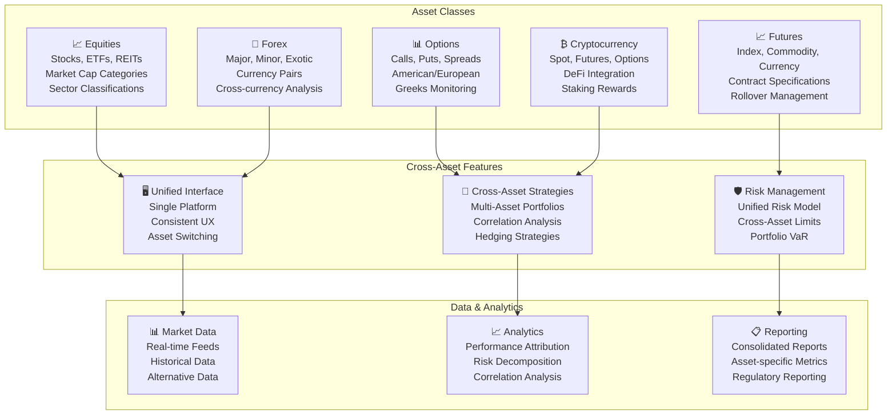
```mermaid
graph TB
    subgraph "Asset Classes"
        EQUITIES[📈 Equities<br/>Stocks, ETFs, REITs<br/>Market Cap Categories<br/>Sector Classifications]
        OPTIONS[📊 Options<br/>Calls, Puts, Spreads<br/>American/European<br/>Greeks Monitoring]
        FUTURES[📈 Futures<br/>Index, Commodity, Currency<br/>Contract Specifications<br/>Rollover Management]
        FOREX[💱 Forex<br/>Major, Minor, Exotic<br/>Currency Pairs<br/>Cross-currency Analysis]
        CRYPTO[₿ Cryptocurrency<br/>Spot, Futures, Options<br/>DeFi Integration<br/>Staking Rewards]
    end
    
    subgraph "Cross-Asset Features"
        UNIFIED_INTERFACE[🖥️ Unified Interface<br/>Single Platform<br/>Consistent UX<br/>Asset Switching]
        CROSS_ASSET_STRATEGIES[🔄 Cross-Asset Strategies<br/>Multi-Asset Portfolios<br/>Correlation Analysis<br/>Hedging Strategies]
        RISK_MANAGEMENT[🛡️ Risk Management<br/>Unified Risk Model<br/>Cross-Asset Limits<br/>Portfolio VaR]
    end
    
    subgraph "Data & Analytics"
        MARKET_DATA[📊 Market Data<br/>Real-time Feeds<br/>Historical Data<br/>Alternative Data]
        ANALYTICS[📈 Analytics<br/>Performance Attribution<br/>Risk Decomposition<br/>Correlation Analysis]
        REPORTING[📋 Reporting<br/>Consolidated Reports<br/>Asset-specific Metrics<br/>Regulatory Reporting]
    end
    
    EQUITIES --> UNIFIED_INTERFACE
    OPTIONS --> CROSS_ASSET_STRATEGIES
    FUTURES --> RISK_MANAGEMENT
    FOREX --> UNIFIED_INTERFACE
    CRYPTO --> CROSS_ASSET_STRATEGIES
    
    UNIFIED_INTERFACE --> MARKET_DATA
    CROSS_ASSET_STRATEGIES --> ANALYTICS
    RISK_MANAGEMENT --> REPORTING
```

**User Story US-003**: As an institutional trader, I want to trade multiple asset classes from a single platform so that I can implement complex cross-asset strategies efficiently.

**Acceptance Criteria**:
- [ ] Support for stocks, options, futures, forex, and crypto
- [ ] Unified trading interface across all asset classes
- [ ] Cross-asset portfolio management and analytics
- [ ] Asset-specific risk management and compliance
- [ ] Real-time data feeds for all supported assets
- [ ] Cross-asset correlation and hedging analysis
- [ ] Consolidated reporting and performance attribution
- [ ] Regulatory compliance for each asset class

### Epic 4: Real-Time Risk Management

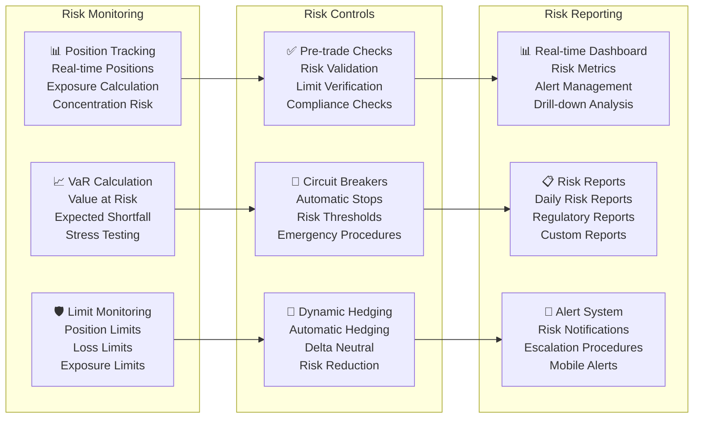
```mermaid
graph LR
    subgraph "Risk Monitoring"
        POSITION_TRACKING[📊 Position Tracking<br/>Real-time Positions<br/>Exposure Calculation<br/>Concentration Risk]
        VAR_CALCULATION[📈 VaR Calculation<br/>Value at Risk<br/>Expected Shortfall<br/>Stress Testing]
        LIMIT_MONITORING[🛡️ Limit Monitoring<br/>Position Limits<br/>Loss Limits<br/>Exposure Limits]
    end
    
    subgraph "Risk Controls"
        PRE_TRADE_CHECKS[✅ Pre-trade Checks<br/>Risk Validation<br/>Limit Verification<br/>Compliance Checks]
        CIRCUIT_BREAKERS[🚨 Circuit Breakers<br/>Automatic Stops<br/>Risk Thresholds<br/>Emergency Procedures]
        DYNAMIC_HEDGING[🔄 Dynamic Hedging<br/>Automatic Hedging<br/>Delta Neutral<br/>Risk Reduction]
    end
    
    subgraph "Risk Reporting"
        REAL_TIME_DASHBOARD[📊 Real-time Dashboard<br/>Risk Metrics<br/>Alert Management<br/>Drill-down Analysis]
        RISK_REPORTS[📋 Risk Reports<br/>Daily Risk Reports<br/>Regulatory Reports<br/>Custom Reports]
        ALERT_SYSTEM[🚨 Alert System<br/>Risk Notifications<br/>Escalation Procedures<br/>Mobile Alerts]
    end
    
    POSITION_TRACKING --> PRE_TRADE_CHECKS
    VAR_CALCULATION --> CIRCUIT_BREAKERS
    LIMIT_MONITORING --> DYNAMIC_HEDGING
    
    PRE_TRADE_CHECKS --> REAL_TIME_DASHBOARD
    CIRCUIT_BREAKERS --> RISK_REPORTS
    DYNAMIC_HEDGING --> ALERT_SYSTEM
```

**User Story US-004**: As a risk manager, I want real-time risk monitoring and automated controls so that I can prevent excessive losses and ensure regulatory compliance.

**Acceptance Criteria**:
- [ ] Real-time position and exposure monitoring
- [ ] Automated pre-trade risk checks and validations
- [ ] Configurable risk limits and circuit breakers
- [ ] VaR calculations and stress testing capabilities
- [ ] Real-time risk dashboard with drill-down analysis
- [ ] Automated alert system with escalation procedures
- [ ] Comprehensive risk reporting for compliance
- [ ] Integration with regulatory reporting systems

### Epic 5: Intelligent User Guidance

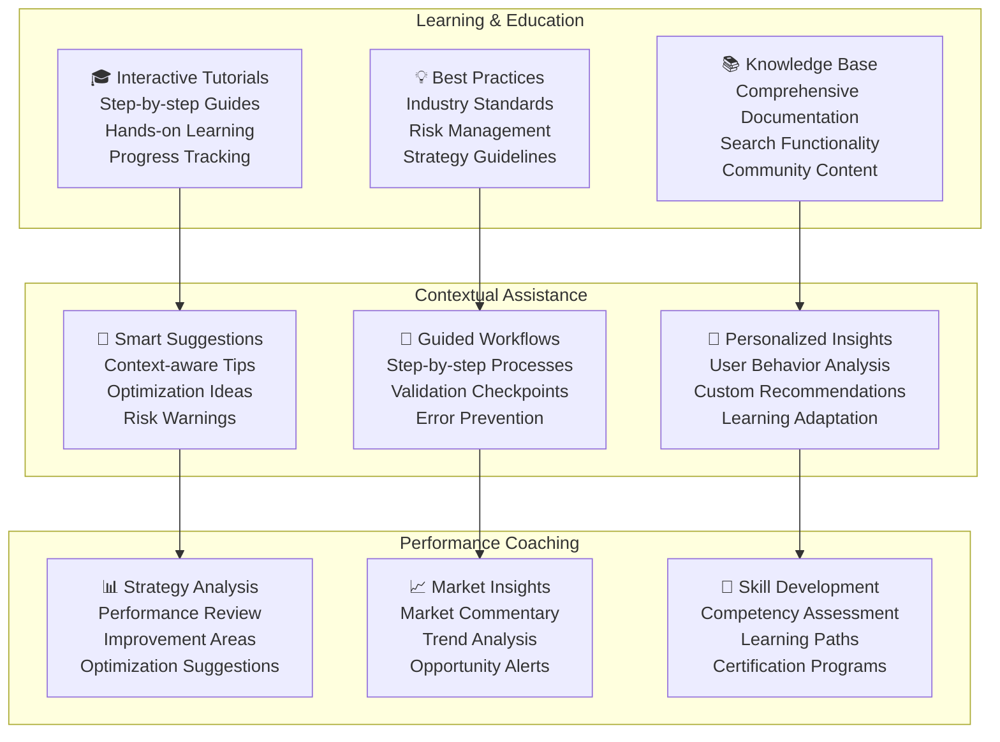
```mermaid
graph TB
    subgraph "Learning & Education"
        INTERACTIVE_TUTORIALS[🎓 Interactive Tutorials<br/>Step-by-step Guides<br/>Hands-on Learning<br/>Progress Tracking]
        BEST_PRACTICES[💡 Best Practices<br/>Industry Standards<br/>Risk Management<br/>Strategy Guidelines]
        KNOWLEDGE_BASE[📚 Knowledge Base<br/>Comprehensive Documentation<br/>Search Functionality<br/>Community Content]
    end
    
    subgraph "Contextual Assistance"
        SMART_SUGGESTIONS[🧠 Smart Suggestions<br/>Context-aware Tips<br/>Optimization Ideas<br/>Risk Warnings]
        GUIDED_WORKFLOWS[🔄 Guided Workflows<br/>Step-by-step Processes<br/>Validation Checkpoints<br/>Error Prevention]
        PERSONALIZED_INSIGHTS[👤 Personalized Insights<br/>User Behavior Analysis<br/>Custom Recommendations<br/>Learning Adaptation]
    end
    
    subgraph "Performance Coaching"
        STRATEGY_ANALYSIS[📊 Strategy Analysis<br/>Performance Review<br/>Improvement Areas<br/>Optimization Suggestions]
        MARKET_INSIGHTS[📈 Market Insights<br/>Market Commentary<br/>Trend Analysis<br/>Opportunity Alerts]
        SKILL_DEVELOPMENT[🎯 Skill Development<br/>Competency Assessment<br/>Learning Paths<br/>Certification Programs]
    end
    
    INTERACTIVE_TUTORIALS --> SMART_SUGGESTIONS
    BEST_PRACTICES --> GUIDED_WORKFLOWS
    KNOWLEDGE_BASE --> PERSONALIZED_INSIGHTS
    
    SMART_SUGGESTIONS --> STRATEGY_ANALYSIS
    GUIDED_WORKFLOWS --> MARKET_INSIGHTS
    PERSONALIZED_INSIGHTS --> SKILL_DEVELOPMENT
```

**User Story US-005**: As a novice trader, I want intelligent guidance and educational content so that I can learn trading concepts and improve my skills progressively.

**Acceptance Criteria**:
- [ ] Interactive tutorials covering trading fundamentals
- [ ] Context-aware suggestions and tips during trading
- [ ] Personalized learning paths based on user progress
- [ ] Best practices and risk management guidance
- [ ] Performance analysis with improvement suggestions
- [ ] Market insights and educational commentary
- [ ] Skill assessment and certification programs
- [ ] Community features for knowledge sharing

### Epic 6: Live Trading Execution

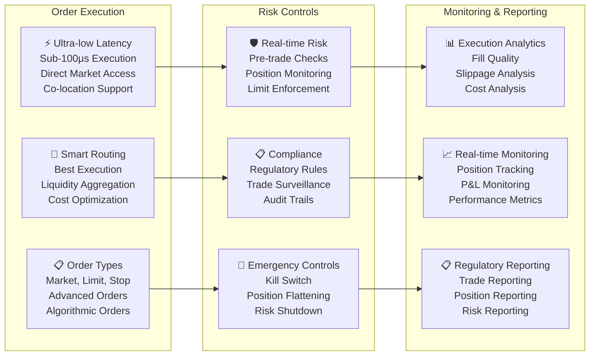
```mermaid
graph LR
    subgraph "Order Execution"
        ULTRA_LOW_LATENCY[⚡ Ultra-low Latency<br/>Sub-100μs Execution<br/>Direct Market Access<br/>Co-location Support]
        SMART_ROUTING[🎯 Smart Routing<br/>Best Execution<br/>Liquidity Aggregation<br/>Cost Optimization]
        ORDER_TYPES[📋 Order Types<br/>Market, Limit, Stop<br/>Advanced Orders<br/>Algorithmic Orders]
    end
    
    subgraph "Risk Controls"
        REAL_TIME_RISK[🛡️ Real-time Risk<br/>Pre-trade Checks<br/>Position Monitoring<br/>Limit Enforcement]
        COMPLIANCE[📋 Compliance<br/>Regulatory Rules<br/>Trade Surveillance<br/>Audit Trails]
        EMERGENCY_CONTROLS[🚨 Emergency Controls<br/>Kill Switch<br/>Position Flattening<br/>Risk Shutdown]
    end
    
    subgraph "Monitoring & Reporting"
        EXECUTION_ANALYTICS[📊 Execution Analytics<br/>Fill Quality<br/>Slippage Analysis<br/>Cost Analysis]
        REAL_TIME_MONITORING[📈 Real-time Monitoring<br/>Position Tracking<br/>P&L Monitoring<br/>Performance Metrics]
        REGULATORY_REPORTING[📋 Regulatory Reporting<br/>Trade Reporting<br/>Position Reporting<br/>Risk Reporting]
    end
    
    ULTRA_LOW_LATENCY --> REAL_TIME_RISK
    SMART_ROUTING --> COMPLIANCE
    ORDER_TYPES --> EMERGENCY_CONTROLS
    
    REAL_TIME_RISK --> EXECUTION_ANALYTICS
    COMPLIANCE --> REAL_TIME_MONITORING
    EMERGENCY_CONTROLS --> REGULATORY_REPORTING
```

**User Story US-006**: As a high-frequency trader, I want ultra-low latency execution with comprehensive risk controls so that I can execute strategies profitably while managing risk effectively.

**Acceptance Criteria**:
- [ ] Sub-100 microsecond order execution latency
- [ ] Direct market access with smart order routing
- [ ] Comprehensive order types and execution algorithms
- [ ] Real-time risk monitoring and pre-trade checks
- [ ] Emergency controls and kill switch functionality
- [ ] Execution quality analytics and cost analysis
- [ ] Regulatory compliance and trade reporting
- [ ] High availability with disaster recovery

## Business Requirements

### Market Positioning

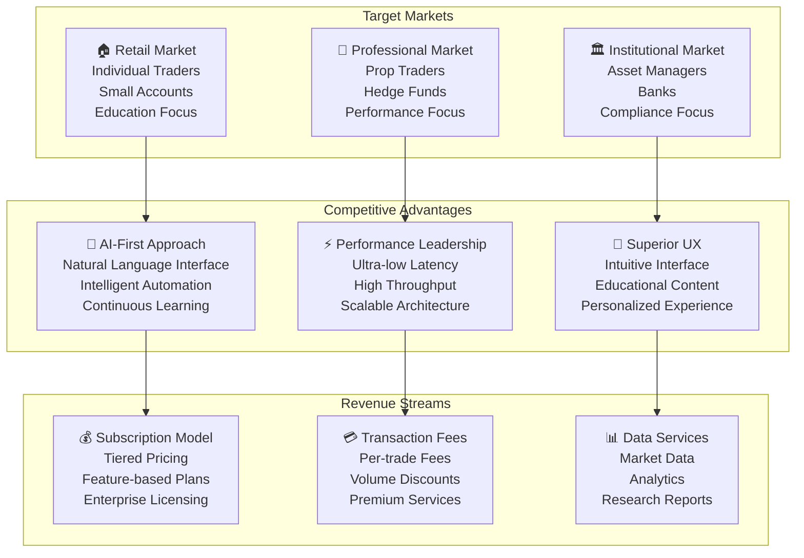
```mermaid
graph TB
    subgraph "Target Markets"
        RETAIL_MARKET[🏠 Retail Market<br/>Individual Traders<br/>Small Accounts<br/>Education Focus]
        PROFESSIONAL_MARKET[🏢 Professional Market<br/>Prop Traders<br/>Hedge Funds<br/>Performance Focus]
        INSTITUTIONAL_MARKET[🏛️ Institutional Market<br/>Asset Managers<br/>Banks<br/>Compliance Focus]
    end
    
    subgraph "Competitive Advantages"
        AI_FIRST[🤖 AI-First Approach<br/>Natural Language Interface<br/>Intelligent Automation<br/>Continuous Learning]
        PERFORMANCE[⚡ Performance Leadership<br/>Ultra-low Latency<br/>High Throughput<br/>Scalable Architecture]
        USER_EXPERIENCE[👤 Superior UX<br/>Intuitive Interface<br/>Educational Content<br/>Personalized Experience]
    end
    
    subgraph "Revenue Streams"
        SUBSCRIPTION[💰 Subscription Model<br/>Tiered Pricing<br/>Feature-based Plans<br/>Enterprise Licensing]
        TRANSACTION_FEES[💳 Transaction Fees<br/>Per-trade Fees<br/>Volume Discounts<br/>Premium Services]
        DATA_SERVICES[📊 Data Services<br/>Market Data<br/>Analytics<br/>Research Reports]
    end
    
    RETAIL_MARKET --> AI_FIRST
    PROFESSIONAL_MARKET --> PERFORMANCE
    INSTITUTIONAL_MARKET --> USER_EXPERIENCE
    
    AI_FIRST --> SUBSCRIPTION
    PERFORMANCE --> TRANSACTION_FEES
    USER_EXPERIENCE --> DATA_SERVICES
```

### Success Metrics

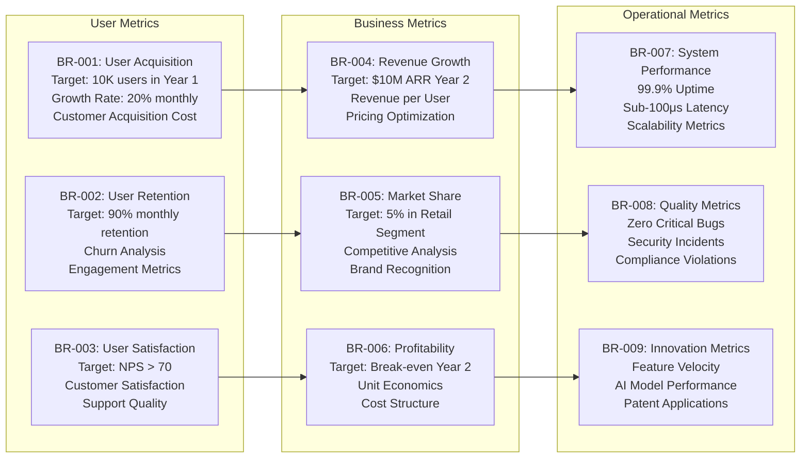
```mermaid
graph LR
    subgraph "User Metrics"
        BR001[BR-001: User Acquisition<br/>Target: 10K users in Year 1<br/>Growth Rate: 20% monthly<br/>Customer Acquisition Cost]
        BR002[BR-002: User Retention<br/>Target: 90% monthly retention<br/>Churn Analysis<br/>Engagement Metrics]
        BR003[BR-003: User Satisfaction<br/>Target: NPS > 70<br/>Customer Satisfaction<br/>Support Quality]
    end
    
    subgraph "Business Metrics"
        BR004[BR-004: Revenue Growth<br/>Target: $10M ARR Year 2<br/>Revenue per User<br/>Pricing Optimization]
        BR005[BR-005: Market Share<br/>Target: 5% in Retail Segment<br/>Competitive Analysis<br/>Brand Recognition]
        BR006[BR-006: Profitability<br/>Target: Break-even Year 2<br/>Unit Economics<br/>Cost Structure]
    end
    
    subgraph "Operational Metrics"
        BR007[BR-007: System Performance<br/>99.9% Uptime<br/>Sub-100μs Latency<br/>Scalability Metrics]
        BR008[BR-008: Quality Metrics<br/>Zero Critical Bugs<br/>Security Incidents<br/>Compliance Violations]
        BR009[BR-009: Innovation Metrics<br/>Feature Velocity<br/>AI Model Performance<br/>Patent Applications]
    end
    
    BR001 --> BR004
    BR002 --> BR005
    BR003 --> BR006
    
    BR004 --> BR007
    BR005 --> BR008
    BR006 --> BR009
```

## Technical Constraints & Assumptions

### Technology Constraints

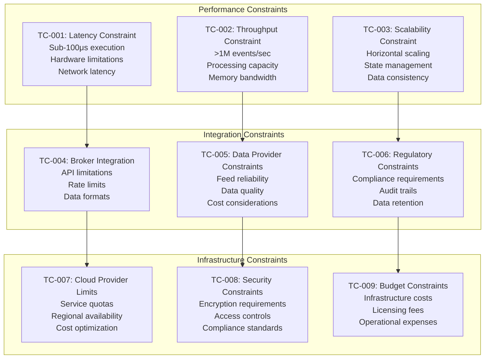
```mermaid
graph TB
    subgraph "Performance Constraints"
        TC001[TC-001: Latency Constraint<br/>Sub-100μs execution<br/>Hardware limitations<br/>Network latency]
        TC002[TC-002: Throughput Constraint<br/>>1M events/sec<br/>Processing capacity<br/>Memory bandwidth]
        TC003[TC-003: Scalability Constraint<br/>Horizontal scaling<br/>State management<br/>Data consistency]
    end
    
    subgraph "Integration Constraints"
        TC004[TC-004: Broker Integration<br/>API limitations<br/>Rate limits<br/>Data formats]
        TC005[TC-005: Data Provider Constraints<br/>Feed reliability<br/>Data quality<br/>Cost considerations]
        TC006[TC-006: Regulatory Constraints<br/>Compliance requirements<br/>Audit trails<br/>Data retention]
    end
    
    subgraph "Infrastructure Constraints"
        TC007[TC-007: Cloud Provider Limits<br/>Service quotas<br/>Regional availability<br/>Cost optimization]
        TC008[TC-008: Security Constraints<br/>Encryption requirements<br/>Access controls<br/>Compliance standards]
        TC009[TC-009: Budget Constraints<br/>Infrastructure costs<br/>Licensing fees<br/>Operational expenses]
    end
    
    TC001 --> TC004
    TC002 --> TC005
    TC003 --> TC006
    
    TC004 --> TC007
    TC005 --> TC008
    TC006 --> TC009
```

### Key Assumptions

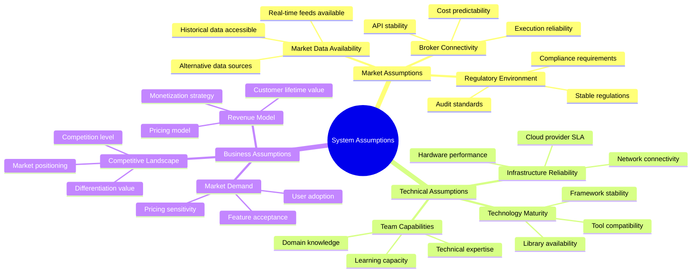
```mermaid
mindmap
  root((System Assumptions))
    Market Assumptions
      Market Data Availability
        Real-time feeds available
        Historical data accessible
        Alternative data sources
      Broker Connectivity
        API stability
        Execution reliability
        Cost predictability
      Regulatory Environment
        Stable regulations
        Compliance requirements
        Audit standards
    Technical Assumptions
      Infrastructure Reliability
        Cloud provider SLA
        Network connectivity
        Hardware performance
      Technology Maturity
        Framework stability
        Library availability
        Tool compatibility
      Team Capabilities
        Technical expertise
        Domain knowledge
        Learning capacity
    Business Assumptions
      Market Demand
        User adoption
        Feature acceptance
        Pricing sensitivity
      Competitive Landscape
        Competition level
        Differentiation value
        Market positioning
      Revenue Model
        Monetization strategy
        Pricing model
        Customer lifetime value
```

## Acceptance Criteria & Testing

### Functional Testing Criteria

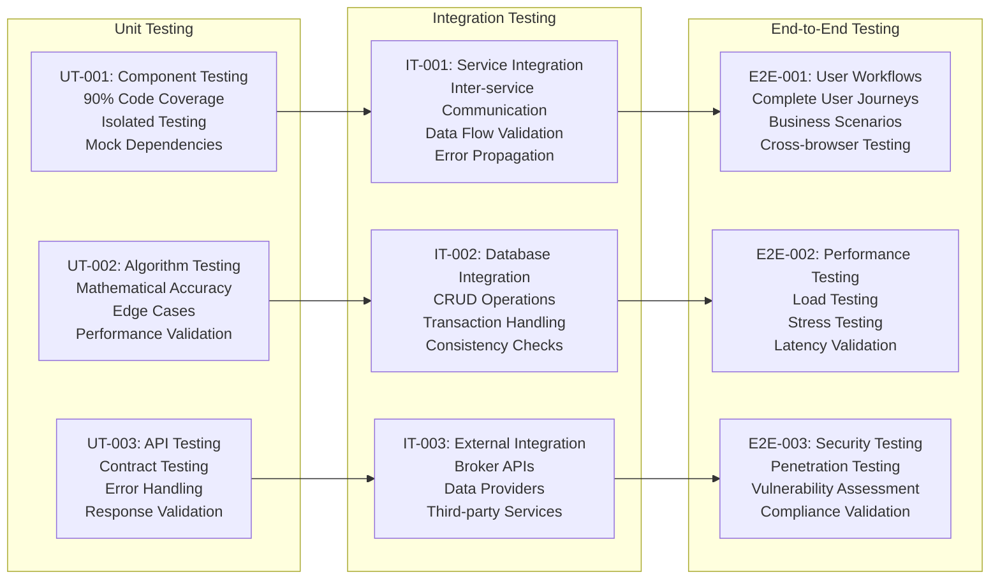
```mermaid
graph LR
    subgraph "Unit Testing"
        UT001[UT-001: Component Testing<br/>90% Code Coverage<br/>Isolated Testing<br/>Mock Dependencies]
        UT002[UT-002: Algorithm Testing<br/>Mathematical Accuracy<br/>Edge Cases<br/>Performance Validation]
        UT003[UT-003: API Testing<br/>Contract Testing<br/>Error Handling<br/>Response Validation]
    end
    
    subgraph "Integration Testing"
        IT001[IT-001: Service Integration<br/>Inter-service Communication<br/>Data Flow Validation<br/>Error Propagation]
        IT002[IT-002: Database Integration<br/>CRUD Operations<br/>Transaction Handling<br/>Consistency Checks]
        IT003[IT-003: External Integration<br/>Broker APIs<br/>Data Providers<br/>Third-party Services]
    end
    
    subgraph "End-to-End Testing"
        E2E001[E2E-001: User Workflows<br/>Complete User Journeys<br/>Business Scenarios<br/>Cross-browser Testing]
        E2E002[E2E-002: Performance Testing<br/>Load Testing<br/>Stress Testing<br/>Latency Validation]
        E2E003[E2E-003: Security Testing<br/>Penetration Testing<br/>Vulnerability Assessment<br/>Compliance Validation]
    end
    
    UT001 --> IT001
    UT002 --> IT002
    UT003 --> IT003
    
    IT001 --> E2E001
    IT002 --> E2E002
    IT003 --> E2E003
```

### Performance Acceptance Criteria

| Metric | Target | Measurement Method | Acceptance Threshold |
|--------|--------|-------------------|---------------------|
| **Order Execution Latency** | <100μs | 99th percentile | Must not exceed 150μs |
| **Market Data Latency** | <1ms | End-to-end measurement | Must not exceed 2ms |
| **API Response Time** | <50ms | 95th percentile | Must not exceed 100ms |
| **System Uptime** | 99.9% | Monthly availability | Must exceed 99.5% |
| **Throughput** | >1M events/sec | Peak load testing | Must exceed 800K events/sec |
| **Concurrent Users** | >10K users | Load testing | Must support 8K+ users |
| **Error Rate** | <0.1% | Error monitoring | Must not exceed 0.5% |

### Security Acceptance Criteria

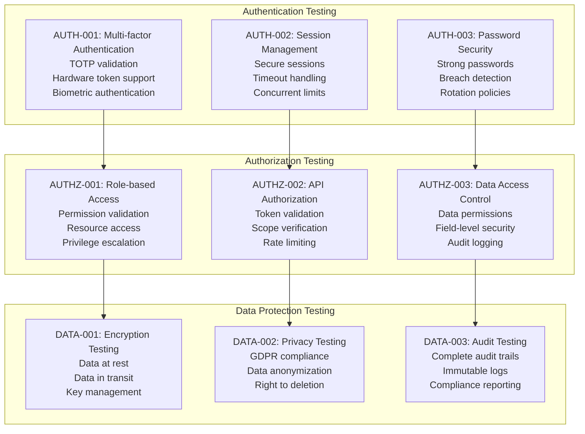
```mermaid
graph TB
    subgraph "Authentication Testing"
        AUTH001[AUTH-001: Multi-factor Authentication<br/>TOTP validation<br/>Hardware token support<br/>Biometric authentication]
        AUTH002[AUTH-002: Session Management<br/>Secure sessions<br/>Timeout handling<br/>Concurrent limits]
        AUTH003[AUTH-003: Password Security<br/>Strong passwords<br/>Breach detection<br/>Rotation policies]
    end
    
    subgraph "Authorization Testing"
        AUTHZ001[AUTHZ-001: Role-based Access<br/>Permission validation<br/>Resource access<br/>Privilege escalation]
        AUTHZ002[AUTHZ-002: API Authorization<br/>Token validation<br/>Scope verification<br/>Rate limiting]
        AUTHZ003[AUTHZ-003: Data Access Control<br/>Data permissions<br/>Field-level security<br/>Audit logging]
    end
    
    subgraph "Data Protection Testing"
        DATA001[DATA-001: Encryption Testing<br/>Data at rest<br/>Data in transit<br/>Key management]
        DATA002[DATA-002: Privacy Testing<br/>GDPR compliance<br/>Data anonymization<br/>Right to deletion]
        DATA003[DATA-003: Audit Testing<br/>Complete audit trails<br/>Immutable logs<br/>Compliance reporting]
    end
    
    AUTH001 --> AUTHZ001
    AUTH002 --> AUTHZ002
    AUTH003 --> AUTHZ003
    
    AUTHZ001 --> DATA001
    AUTHZ002 --> DATA002
    AUTHZ003 --> DATA003
```

## Compliance & Regulatory Requirements

### Financial Regulations

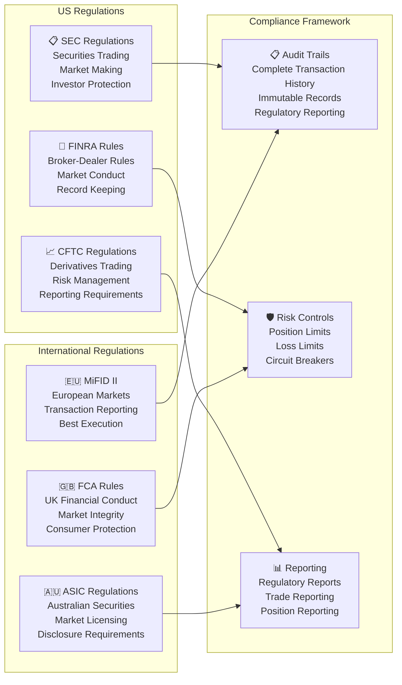
```mermaid
graph LR
    subgraph "US Regulations"
        SEC[📋 SEC Regulations<br/>Securities Trading<br/>Market Making<br/>Investor Protection]
        FINRA[🏦 FINRA Rules<br/>Broker-Dealer Rules<br/>Market Conduct<br/>Record Keeping]
        CFTC[📈 CFTC Regulations<br/>Derivatives Trading<br/>Risk Management<br/>Reporting Requirements]
    end
    
    subgraph "International Regulations"
        MIFID2[🇪🇺 MiFID II<br/>European Markets<br/>Transaction Reporting<br/>Best Execution]
        FCA[🇬🇧 FCA Rules<br/>UK Financial Conduct<br/>Market Integrity<br/>Consumer Protection]
        ASIC[🇦🇺 ASIC Regulations<br/>Australian Securities<br/>Market Licensing<br/>Disclosure Requirements]
    end
    
    subgraph "Compliance Framework"
        AUDIT_TRAILS[📋 Audit Trails<br/>Complete Transaction History<br/>Immutable Records<br/>Regulatory Reporting]
        RISK_CONTROLS[🛡️ Risk Controls<br/>Position Limits<br/>Loss Limits<br/>Circuit Breakers]
        REPORTING[📊 Reporting<br/>Regulatory Reports<br/>Trade Reporting<br/>Position Reporting]
    end
    
    SEC --> AUDIT_TRAILS
    FINRA --> RISK_CONTROLS
    CFTC --> REPORTING
    MIFID2 --> AUDIT_TRAILS
    FCA --> RISK_CONTROLS
    ASIC --> REPORTING
```

### Data Protection Compliance

```mermaid
graph TB
    subgraph "Privacy Regulations"
        GDPR[🇪🇺 GDPR<br/>Data Protection<br/>User Consent<br/>Right to be Forgotten]
        CCPA[🇺🇸 CCPA<br/>California Privacy<br/>Consumer Rights<br/>Data Transparency]
        PIPEDA[🇨🇦 PIPEDA<br/>Personal Information<br/>Privacy Protection<br/>Breach Notification]
    end
    
    subgraph "Implementation Requirements"
        CONSENT_MANAGEMENT[✅ Consent Management<br/>Explicit Consent<br/>Granular Controls<br/>Withdrawal Rights]
        DATA_MINIMIZATION[📊 Data Minimization<br/>Purpose Limitation<br/>Storage Limitation<br/>Data Quality]
        BREACH_RESPONSE[🚨 Breach Response<br/>Detection Procedures<br/>Notification Requirements<br/>Remediation Actions]
    end
    
    subgraph "Technical Controls"
        ENCRYPTION[🔐 Encryption<br/>Data at Rest<br/>Data in Transit<br/>Key Management]
        ACCESS_CONTROLS[🎯 Access Controls<br/>Role-based Access<br/>Audit Logging<br/>Regular Reviews]
        DATA_LIFECYCLE[🔄 Data Lifecycle<br/>Retention Policies<br/>Secure Deletion<br/>Archive Management]
    end
    
    GDPR --> CONSENT_MANAGEMENT
    CCPA --> DATA_MINIMIZATION
    PIPEDA --> BREACH_RESPONSE
    
    CONSENT_MANAGEMENT --> ENCRYPTION
    DATA_MINIMIZATION --> ACCESS_CONTROLS
    BREACH_RESPONSE --> DATA_LIFECYCLE
```

## Requirements Traceability Matrix

```mermaid
graph TB
    subgraph "Business Requirements"
        BR_USER_ADOPTION[BR-001: User Adoption]
        BR_REVENUE_GROWTH[BR-004: Revenue Growth]
        BR_SYSTEM_PERFORMANCE[BR-007: System Performance]
    end
    
    subgraph "Functional Requirements"
        FR_PAPER_TRADING[FR-001: Paper Trading]
        FR_AI_STRATEGY[FR-005: AI Strategy Development]
        FR_RISK_MANAGEMENT[FR-009: Risk Management]
    end
    
    subgraph "Non-Functional Requirements"
        NFR_LATENCY[NFR-001: Order Execution Latency]
        NFR_UPTIME[NFR-012: System Uptime]
        NFR_SECURITY[NFR-021: Multi-Factor Authentication]
    end
    
    subgraph "User Stories"
        US_PAPER_TRADING[US-001: Paper Trading Validation]
        US_AI_DEVELOPMENT[US-002: AI Strategy Development]
        US_LIVE_TRADING[US-006: Live Trading Execution]
    end
    
    subgraph "Test Cases"
        TC_FUNCTIONAL[Functional Test Cases]
        TC_PERFORMANCE[Performance Test Cases]
        TC_SECURITY[Security Test Cases]
    end
    
    BR_USER_ADOPTION --> FR_PAPER_TRADING
    BR_REVENUE_GROWTH --> FR_AI_STRATEGY
    BR_SYSTEM_PERFORMANCE --> FR_RISK_MANAGEMENT
    
    FR_PAPER_TRADING --> NFR_LATENCY
    FR_AI_STRATEGY --> NFR_UPTIME
    FR_RISK_MANAGEMENT --> NFR_SECURITY
    
    NFR_LATENCY --> US_PAPER_TRADING
    NFR_UPTIME --> US_AI_DEVELOPMENT
    NFR_SECURITY --> US_LIVE_TRADING
    
    US_PAPER_TRADING --> TC_FUNCTIONAL
    US_AI_DEVELOPMENT --> TC_PERFORMANCE
    US_LIVE_TRADING --> TC_SECURITY
```

---

**Document Classification**: Requirements Documentation  
**Next Review Date**: 27 April 2025  
**Document Owner**: Product Management Team  
**Approval**: Chief Product Officer, Requirements Committee