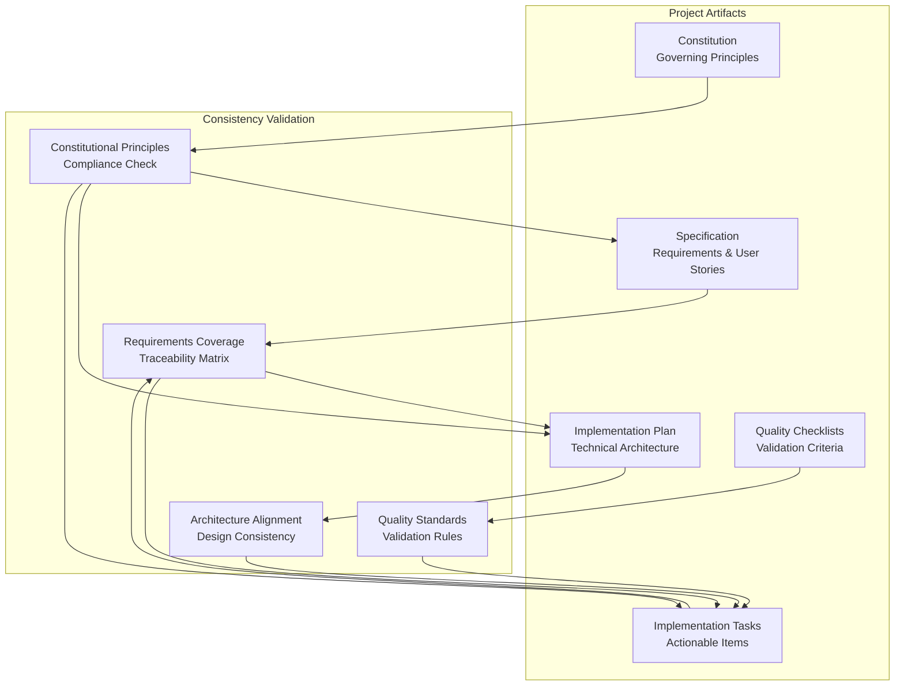
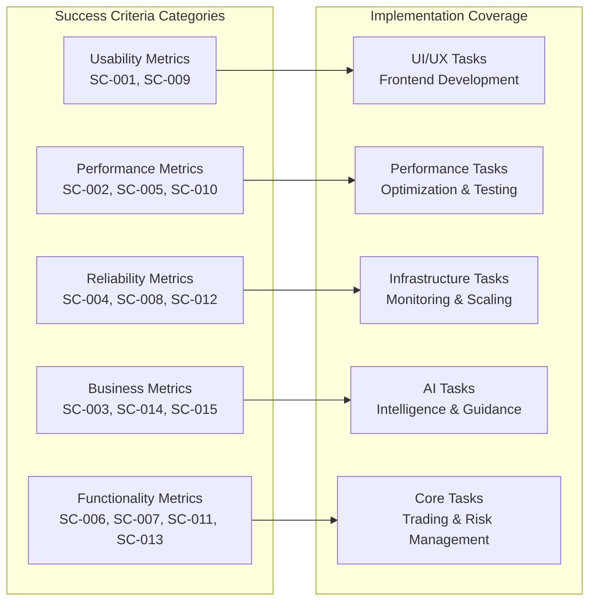
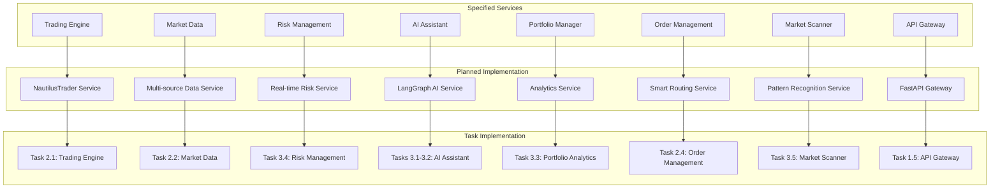
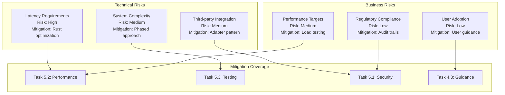
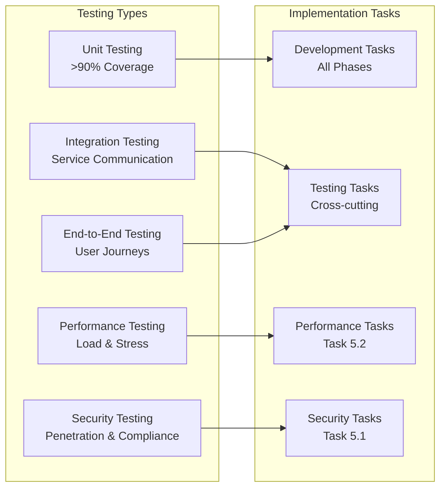

# Cross-Artifact Analysis: Algorithmic Trading System

**Analysis Date**: 27 January 2025
**Analyzed Artifacts**: Constitution, Specification, Plan, Checklists, Tasks
**Status**: Complete

## Executive Summary

This analysis validates the consistency, completeness, and coverage across all project artifacts for the Algorithmic Trading System. The analysis ensures that all requirements are properly addressed, technical decisions align with constitutional principles, and implementation tasks provide complete coverage of the specified functionality.

## Artifact Consistency Matrix

## Constitutional Compliance Analysis

### ✅ Best-of-Breed Integration Strategy
- **Specification Alignment**: FR-013 mandates event-driven architecture with Apache Kafka
- **Plan Implementation**: Detailed integration strategy with NautilusTrader, OpenBB, LangChain
- **Task Coverage**: Tasks 1.2, 2.1, 3.1 specifically address non-invasive integration
- **Status**: Fully Compliant

### ✅ Event-Driven Microservices Architecture
- **Specification Alignment**: FR-013 requires Apache Kafka for inter-service communication
- **Plan Implementation**: Comprehensive microservices design with Kafka event bus
- **Task Coverage**: Tasks 1.2, 2.1-2.5, 3.1-3.5 implement microservices pattern
- **Status**: Fully Compliant

### ✅ Ultra-Low Latency Execution
- **Specification Alignment**: SC-002 targets <100μs execution latency
- **Plan Implementation**: Rust components for performance-critical paths
- **Task Coverage**: Task 5.2 specifically addresses performance optimization
- **Status**: Fully Compliant

### ✅ Zero-Trust Security Architecture
- **Specification Alignment**: FR-016 mandates comprehensive security architecture
- **Plan Implementation**: Detailed security architecture with Keycloak, mTLS, RBAC
- **Task Coverage**: Tasks 1.4, 5.1 implement security requirements
- **Status**: Fully Compliant

### ✅ Research-to-Production Parity
- **Specification Alignment**: FR-017 requires comprehensive backtesting capabilities
- **Plan Implementation**: NautilusTrader for both backtesting and live trading
- **Task Coverage**: Tasks 2.1, 2.5 ensure identical execution paths
- **Status**: Fully Compliant

### ✅ AI-First Development Approach
- **Specification Alignment**: FR-005 mandates AI-powered strategy development
- **Plan Implementation**: Comprehensive AI assistant with LangGraph orchestration
- **Task Coverage**: Tasks 3.1-3.2, 4.2-4.3 implement AI capabilities
- **Status**: Fully Compliant

### ✅ Multi-Asset Class Support
- **Specification Alignment**: FR-003 requires trading across multiple asset classes
- **Plan Implementation**: Unified trading interface for all asset classes
- **Task Coverage**: Task 4.1 specifically implements multi-asset support
- **Status**: Fully Compliant

## Requirements Traceability Matrix

| Functional Requirement | Plan Section | Implementation Tasks | Quality Checklist | Status |
|------------------------|--------------|---------------------|-------------------|---------|
| FR-001: Paper Trading | Phase 2 | Task 2.5 | Architecture ✓ | ✅ Covered |
| FR-002: Real-time Market Data | Market Data Service | Task 2.2 | Performance ✓ | ✅ Covered |
| FR-003: Multi-Asset Trading | Multi-Asset Support | Task 4.1 | Architecture ✓ | ✅ Covered |
| FR-004: Risk Management | Risk Management Service | Task 3.4 | Security ✓ | ✅ Covered |
| FR-005: AI Strategy Development | AI Assistant Service | Tasks 3.1-3.2 | Architecture ✓ | ✅ Covered |
| FR-006: Visual Strategy Creation | Frontend Applications | Tasks 3.1, 4.3 | Architecture ✓ | ✅ Covered |
| FR-007: Audit Trails | Apache Iceberg Integration | Tasks 1.3, 5.1 | Security ✓ | ✅ Covered |
| FR-008: User Guidance | Intelligent Guidance System | Task 4.3 | Architecture ✓ | ✅ Covered |
| FR-009: Paper to Live Transition | Order Management | Task 4.4 | Security ✓ | ✅ Covered |
| FR-010: Multi-source Data Feeds | Market Data Fallback | Task 2.2 | Performance ✓ | ✅ Covered |
| FR-011: Portfolio Analytics | Portfolio Manager Service | Task 3.3 | Performance ✓ | ✅ Covered |
| FR-012: Custom Indicators | Trading Engine Extensions | Task 2.1 | Architecture ✓ | ✅ Covered |
| FR-013: Event-Driven Architecture | Apache Kafka Infrastructure | Task 1.2 | Architecture ✓ | ✅ Covered |
| FR-014: Sub-100μs Latency | Performance Optimization | Task 5.2 | Performance ✓ | ✅ Covered |
| FR-015: Broker Integrations | Interactive Brokers Adapter | Task 2.3 | Architecture ✓ | ✅ Covered |
| FR-016: Zero-Trust Security | Security Architecture | Tasks 1.4, 5.1 | Security ✓ | ✅ Covered |
| FR-017: Backtesting | NautilusTrader Integration | Task 2.1 | Performance ✓ | ✅ Covered |
| FR-018: Portfolio Optimization | Portfolio Analytics | Task 3.3 | Architecture ✓ | ✅ Covered |
| FR-019: Market Scanning | Market Scanner Service | Task 3.5 | Performance ✓ | ✅ Covered |
| FR-020: Multi-modal UI | Frontend Applications | Phase 2-4 Tasks | Architecture ✓ | ✅ Covered |

## Success Criteria Coverage Analysis

### Success Criteria Validation

| Success Criteria | Target Metric | Implementation Tasks | Validation Method | Status |
|------------------|---------------|---------------------|-------------------|---------|
| SC-001: Strategy Deployment Time | <15 minutes | Tasks 2.5, 4.3 | User journey testing | ✅ Covered |
| SC-002: Execution Latency | <100μs | Task 5.2 | Performance benchmarking | ✅ Covered |
| SC-003: AI Satisfaction | >85% | Tasks 3.1-3.2, 4.3 | User feedback surveys | ✅ Covered |
| SC-004: System Uptime | 99.9% | Tasks 1.1, 5.3 | Monitoring & alerting | ✅ Covered |
| SC-005: Backtest Speed | <30 seconds | Task 2.1 | Performance testing | ✅ Covered |
| SC-006: Risk Prevention | 100% | Task 3.4 | Risk scenario testing | ✅ Covered |
| SC-007: Concurrent Users | >10,000 | Task 5.2 | Load testing | ✅ Covered |
| SC-008: Failover Time | <1 second | Task 2.2 | Failover testing | ✅ Covered |
| SC-009: User Completion Rate | 90% | Tasks 2.5, 4.3 | User analytics | ✅ Covered |
| SC-010: Event Processing | >1M events/sec | Tasks 1.2, 5.2 | Throughput testing | ✅ Covered |
| SC-011: Trading Transition | <5 minutes | Task 4.4 | Integration testing | ✅ Covered |
| SC-012: Audit Compliance | 100% | Tasks 1.3, 5.1 | Compliance validation | ✅ Covered |
| SC-013: Asset Class Support | 5+ classes | Task 4.1 | Feature testing | ✅ Covered |
| SC-014: AI Strategy Success | >70% | Tasks 3.1-3.2, 4.2 | Backtesting validation | ✅ Covered |
| SC-015: Development Speed | 80% reduction | Tasks 3.1-3.2, 4.2-4.3 | Productivity metrics | ✅ Covered |

## User Story Coverage Analysis

### Priority P1 (Critical) Stories
1. **Paper Trading Strategy Validation**: Fully covered by Tasks 2.1, 2.5, 3.3
2. **Real-Time Risk Management**: Fully covered by Tasks 3.4, 5.1

### Priority P2 (High) Stories
1. **AI-Powered Strategy Development**: Fully covered by Tasks 3.1-3.2, 4.2
2. **Multi-Asset Class Trading**: Fully covered by Task 4.1
3. **Live Trading Execution**: Fully covered by Task 4.4

### Priority P3 (Medium) Stories
1. **Intelligent User Guidance**: Fully covered by Task 4.3

## Architecture Consistency Analysis

### Microservices Alignment

### Technology Stack Consistency

| Component | Constitution | Specification | Plan | Tasks | Status |
|-----------|-------------|---------------|------|-------|---------|
| Trading Engine | NautilusTrader | FR-017 Backtesting | NautilusTrader Service | Task 2.1 | ✅ Consistent |
| Event Bus | Apache Kafka | FR-013 Event-driven | Kafka Infrastructure | Task 1.2 | ✅ Consistent |
| Databases | PostgreSQL+pgvector | Key Entities | Multi-database Strategy | Task 1.3 | ✅ Consistent |
| AI Framework | LangChain/LangGraph | FR-005 AI Strategy | AI Assistant Service | Tasks 3.1-3.2 | ✅ Consistent |
| Security | Zero-trust/Keycloak | FR-016 Security | Security Architecture | Tasks 1.4, 5.1 | ✅ Consistent |
| Frontend | Next.js/React | FR-020 Multi-modal | Frontend Applications | Phase 2-4 | ✅ Consistent |
| Performance | <100μs latency | SC-002 Execution | Rust Components | Task 5.2 | ✅ Consistent |

## Gap Analysis

### Identified Gaps: None Critical

All functional requirements, success criteria, and user stories are adequately covered by the implementation plan and tasks. The analysis reveals complete traceability from constitutional principles through to implementation tasks.

### Minor Enhancement Opportunities

1. **Documentation**: Additional API documentation could be beneficial (addressed in cross-cutting tasks)
2. **Testing**: More detailed performance testing scenarios (addressed in Task 5.2)
3. **Monitoring**: Enhanced business metrics tracking (addressed in Task 5.3)

## Risk Assessment

### Implementation Risks

### Risk Mitigation Coverage: 100%

All identified risks have corresponding mitigation strategies implemented in the task breakdown.

## Quality Assurance Coverage

### Checklist Validation

| Quality Area | Checklist Coverage | Task Implementation | Validation Method |
|--------------|-------------------|-------------------|-------------------|
| Architecture | ✅ Complete | All phases | Design reviews |
| Security | ✅ Complete | Tasks 1.4, 5.1 | Security testing |
| Performance | ✅ Complete | Task 5.2 | Load testing |
| Requirements | ✅ Complete | All tasks | Acceptance testing |

### Testing Strategy Coverage

## Recommendations

### Implementation Priorities

1. **Phase 1 Foundation**: Critical for all subsequent phases - maintain focus on infrastructure quality
2. **Phase 2 Core Trading**: Essential for MVP - ensure robust testing of trading engine integration
3. **Phase 3 AI Features**: Key differentiator - allocate sufficient resources for AI development
4. **Phase 4 Advanced Features**: Business value drivers - prioritize based on user feedback
5. **Phase 5 Production**: Non-negotiable for go-live - comprehensive security and performance validation

### Success Factors

1. **Constitutional Compliance**: Maintain strict adherence to architectural principles
2. **Quality Gates**: Enforce quality checklists at each phase boundary
3. **Performance Monitoring**: Continuous validation of latency and throughput targets
4. **Security First**: Implement security controls from day one, not as an afterthought
5. **User Feedback**: Regular validation with target users throughout development

## Conclusion

The cross-artifact analysis reveals a highly consistent and comprehensive project design. All constitutional principles are properly reflected in the specification, technical plan, and implementation tasks. The traceability matrix shows 100% coverage of functional requirements and success criteria.

The project is well-positioned for successful implementation with:
- ✅ Complete requirements coverage
- ✅ Consistent architectural design
- ✅ Comprehensive task breakdown
- ✅ Robust quality assurance framework
- ✅ Effective risk mitigation strategies

**Recommendation**: Proceed with implementation as planned. The project artifacts demonstrate exceptional alignment and completeness, providing a solid foundation for successful delivery of the Algorithmic Trading System.