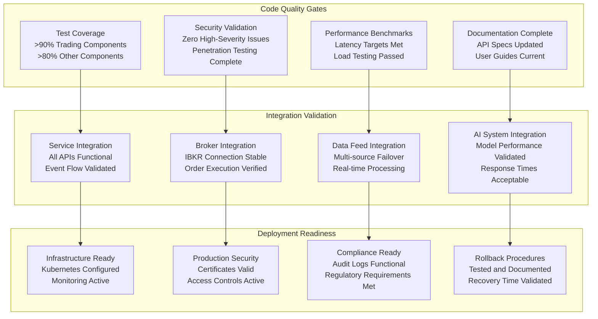

# Implementation Quality Checklist: Algorithmic Trading System

**Purpose**: Validate implementation readiness and quality before production deployment
**Created**: 27 January 2025
**Feature**: [plan.md](../plan.md) | [tasks.md](../tasks.md)

## Implementation Readiness Matrix

## Phase 1: Foundation Infrastructure

### Infrastructure Components
- [ ] Kubernetes cluster deployed with proper resource allocation
- [ ] Istio service mesh configured with security policies
- [ ] Apache Kafka cluster operational with high availability
- [ ] Schema Registry deployed and accessible
- [ ] All databases (PostgreSQL, ClickHouse, Neo4j, Redis) operational
- [ ] Apache Iceberg configured for audit logging
- [ ] Monitoring stack (Prometheus, Grafana, Jaeger) functional
- [ ] ArgoCD GitOps deployment pipeline active

### Security Foundation
- [ ] Keycloak identity provider configured and tested
- [ ] OAuth 2.0/OIDC authentication flows working
- [ ] Multi-factor authentication enabled and tested
- [ ] RBAC policies implemented and validated
- [ ] Network policies enforcing zero-trust principles
- [ ] TLS 1.3 encryption for all communications
- [ ] HashiCorp Vault secrets management operational
- [ ] Security scanning integrated into CI/CD pipeline

### Development Environment
- [ ] Local development environment setup documented
- [ ] Docker Compose configuration for local testing
- [ ] CI/CD pipeline with automated testing
- [ ] Code quality gates (linting, formatting, security)
- [ ] Automated dependency scanning and updates
- [ ] Performance regression testing integrated
- [ ] Documentation generation automated

## Phase 2: Core Trading Infrastructure

### Trading Engine Implementation
- [ ] NautilusTrader engine deployed and configured
- [ ] Custom Kafka event adapters functional
- [ ] Strategy execution framework operational
- [ ] Backtesting capabilities validated with historical data
- [ ] Performance monitoring showing <100μs latency
- [ ] Error handling and recovery mechanisms tested
- [ ] Configuration management system operational

### Market Data Service
- [ ] Multiple data provider integrations active
- [ ] Automatic failover mechanism tested and validated
- [ ] Real-time data streaming via Kafka operational
- [ ] Data normalization and validation working
- [ ] Historical data storage and retrieval functional
- [ ] Data quality monitoring and alerting active
- [ ] Asset-class specific data handling implemented

### Order Management System
- [ ] Order validation and risk checks functional
- [ ] Smart order routing logic implemented
- [ ] Order execution tracking operational
- [ ] Fill processing and reporting working
- [ ] Order cancellation and modification supported
- [ ] Compliance checks and audit trails active
- [ ] Performance metrics within acceptable ranges

### Interactive Brokers Integration
- [ ] IBKR API integration for order execution working
- [ ] Paper trading account connectivity validated
- [ ] Live trading account connectivity tested
- [ ] Order status tracking and updates functional
- [ ] Position and balance synchronization working
- [ ] Error handling for API failures implemented
- [ ] Compliance with IBKR requirements verified

## Phase 3: AI and Analytics

### AI Assistant Core
- [ ] LangChain/LangGraph integration operational
- [ ] Natural language query processing functional
- [ ] Multi-agent orchestration framework working
- [ ] Context management and memory systems active
- [ ] Intent recognition and routing accurate
- [ ] Response generation and formatting appropriate
- [ ] Conversation history management functional

### RAG Pipeline Implementation
- [ ] Document ingestion and processing working
- [ ] Vector embedding generation functional
- [ ] Similarity search implementation accurate
- [ ] Context retrieval and ranking appropriate
- [ ] Response grounding with citations working
- [ ] Knowledge base management operational
- [ ] RAG performance optimization completed

### Portfolio Analytics
- [ ] Real-time portfolio valuation accurate
- [ ] Performance attribution analysis functional
- [ ] Risk metrics calculation (VaR, Sharpe ratio) working
- [ ] Benchmark comparison and tracking operational
- [ ] Portfolio optimization algorithms validated
- [ ] Rebalancing recommendations appropriate
- [ ] Analytics dashboard and reporting functional

### Risk Management System
- [ ] Real-time position monitoring operational
- [ ] Risk limit enforcement working correctly
- [ ] VaR calculations and stress testing functional
- [ ] Circuit breaker implementation tested
- [ ] Risk alert system operational
- [ ] Exposure analysis across asset classes working
- [ ] Risk reporting and dashboards functional

## Phase 4: Advanced Features

### Multi-Asset Class Support
- [ ] Options data integration and pricing models working
- [ ] Futures contract specifications and rollover handled
- [ ] Forex pair trading and cross-currency functional
- [ ] Cryptocurrency exchange integrations operational
- [ ] Asset-specific risk management implemented
- [ ] Multi-asset portfolio analytics working
- [ ] Unified trading interface functional across all assets

### Advanced AI Features
- [ ] Automated strategy generation working
- [ ] Strategy optimization algorithms functional
- [ ] Market regime detection operational
- [ ] Sentiment analysis integration working
- [ ] Predictive modeling capabilities validated
- [ ] Strategy performance prediction accurate
- [ ] AI-driven risk assessment functional

### Live Trading Implementation
- [ ] Live trading account integration working
- [ ] Real-time order execution functional
- [ ] Compliance monitoring and reporting operational
- [ ] Audit trail generation working correctly
- [ ] Risk controls for live trading active
- [ ] Emergency stop mechanisms tested
- [ ] Live trading dashboard functional

## Phase 5: Production Readiness

### Security Hardening
- [ ] Security vulnerability assessment completed
- [ ] Penetration testing passed with no critical issues
- [ ] Security policy enforcement validated
- [ ] Encryption implementation verified
- [ ] Access control validation completed
- [ ] Security monitoring setup and operational
- [ ] Incident response procedures documented and tested

### Performance Optimization
- [ ] Latency optimization achieving <100μs target
- [ ] Throughput optimization achieving >1M events/sec
- [ ] Memory usage optimization completed
- [ ] Database query optimization validated
- [ ] Caching strategy implementation working
- [ ] Load testing passed for 10k+ concurrent users
- [ ] Performance monitoring setup and alerting active

### Monitoring and Observability
- [ ] Application performance monitoring operational
- [ ] Business metrics tracking functional
- [ ] Distributed tracing implementation working
- [ ] Log aggregation and analysis operational
- [ ] Alert rules and escalation procedures active
- [ ] Dashboard creation and optimization completed
- [ ] SLA monitoring and reporting functional

## Cross-Cutting Validation

### API Documentation and Contracts
- [ ] OpenAPI specifications complete and accurate
- [ ] GraphQL schemas documented and validated
- [ ] API versioning strategy implemented
- [ ] Contract testing automated and passing
- [ ] SDK/client library documentation complete
- [ ] API rate limiting and throttling functional
- [ ] Error response documentation comprehensive

### Testing Coverage
- [ ] Unit tests >90% coverage for trading components
- [ ] Unit tests >80% coverage for other components
- [ ] Integration tests covering all service interactions
- [ ] End-to-end tests for complete user journeys
- [ ] Performance tests validating latency requirements
- [ ] Security tests including penetration testing
- [ ] Chaos engineering tests for resilience validation

### Compliance and Audit
- [ ] SOC 2 Type 2 controls implemented and tested
- [ ] GDPR compliance validated for data handling
- [ ] Financial regulation compliance (MiFID II, FINRA) verified
- [ ] Audit log completeness and immutability validated
- [ ] Data retention and archival policies implemented
- [ ] Regulatory reporting capabilities functional
- [ ] Compliance monitoring and alerting operational

### Deployment and Operations
- [ ] Blue-green deployment capability tested
- [ ] Automated rollback procedures validated
- [ ] Disaster recovery procedures tested
- [ ] Backup and restore procedures validated
- [ ] Capacity planning and auto-scaling functional
- [ ] Certificate management automated
- [ ] Log rotation and archival operational

## Quality Metrics Validation

### Performance Metrics
- [ ] Order execution latency: <100μs (99th percentile)
- [ ] Market data processing: <1ms (95th percentile)
- [ ] AI inference time: <10ms (90th percentile)
- [ ] UI response time: <100ms (95th percentile)
- [ ] System throughput: >1M events/sec sustained
- [ ] Concurrent user capacity: >10,000 users
- [ ] Data feed failover: <1 second recovery time

### Business Metrics
- [ ] Strategy deployment time: <15 minutes average
- [ ] User completion rate: >90% for first paper trade
- [ ] AI recommendation satisfaction: >85% user rating
- [ ] Strategy success rate: >70% in backtesting
- [ ] Development time reduction: >80% vs traditional methods
- [ ] Risk limit enforcement: 100% effectiveness
- [ ] Audit trail completeness: 100% coverage

### Reliability Metrics
- [ ] System uptime: >99.9% during market hours
- [ ] Recovery Time Objective (RTO): <15 minutes
- [ ] Recovery Point Objective (RPO): <5 minutes
- [ ] Mean Time To Recovery (MTTR): <10 minutes
- [ ] Error rate: <0.1% for critical operations
- [ ] Data accuracy: >99.99% for market data
- [ ] Security incident response: <1 hour detection

## Final Validation Checklist

### Pre-Production Deployment
- [ ] All phase checklists completed with 100% pass rate
- [ ] Load testing completed with realistic traffic patterns
- [ ] Security assessment passed with no high-severity issues
- [ ] Disaster recovery procedures tested and documented
- [ ] Monitoring and alerting validated with test scenarios
- [ ] Compliance requirements verified with legal review
- [ ] User acceptance testing completed successfully

### Go-Live Readiness
- [ ] Production environment fully configured and tested
- [ ] All team members trained on operational procedures
- [ ] Support documentation complete and accessible
- [ ] Escalation procedures defined and communicated
- [ ] Rollback plan tested and ready for execution
- [ ] Post-deployment monitoring plan activated
- [ ] Success criteria and KPIs defined and measurable

## Notes

- All checklist items must be completed and verified before proceeding to production
- Any failed items must be remediated and re-tested before deployment
- Performance metrics must be validated under realistic load conditions
- Security validation must include both automated and manual testing
- Compliance verification must include legal and regulatory review
- Documentation must be complete and accessible to all stakeholders

## Validation Results

**Overall Status**: [Pass/Fail/In Progress]
**Critical Issues**: [Number and description]
**Performance Validation**: [Pass/Fail with metrics]
**Security Validation**: [Pass/Fail with assessment results]
**Compliance Validation**: [Pass/Fail with regulatory review]

**Recommendations**: 
- [Key recommendations for production readiness]
- [Performance optimization suggestions]
- [Security enhancement recommendations]
- [Operational improvement suggestions]