# Implementation Plan: Algorithmic Trading System

**Branch**: `algorithmic-trading-system` | **Date**: 27 January 2025 | **Spec**: [spec.md](./spec.md)
**Input**: Feature specification from `/specs/algorithmic-trading-system/spec.md`

## Summary

Comprehensive enterprise-grade algorithmic trading system with AI-powered strategy development, multi-asset class support, real-time execution, risk management, and intelligent user guidance. The system follows a microservices architecture with event-driven communication via Apache Kafka, supporting both paper and live trading across multiple asset classes with sub-100 microsecond execution latency.

## Technical Context

**Language/Version**: Python 3.11+ (primary), Rust 1.75+ (performance-critical), TypeScript 5.0+ (frontend), Go 1.21+ (infrastructure)
**Primary Dependencies**: NautilusTrader (trading engine), Apache Kafka (event bus), FastAPI (API layer), Next.js (frontend), PostgreSQL+pgvector (database), ClickHouse (analytics), Redis (caching)
**Storage**: PostgreSQL+pgvector (transactional/vectors), ClickHouse (time-series), Neo4j (knowledge graph), Redis (caching/GenAI), Apache Iceberg (audit logs)
**Testing**: pytest (Python), Jest (TypeScript), cargo test (Rust), Cypress (E2E)
**Target Platform**: Kubernetes (production), Docker (development), Windows laptop (initial development)
**Project Type**: Event-driven microservices architecture with AI-first design
**Performance Goals**: <100μs execution latency, >1M events/sec processing, 10k+ concurrent users, 99.9% uptime
**Constraints**: Zero-trust security, SOC 2 compliance, real-time risk monitoring, immutable audit trails
**Scale/Scope**: Enterprise-grade system supporting multiple asset classes, AI-powered features, professional trading requirements

## Constitution Check

*GATE: Must pass before implementation planning*

✅ **Best-of-Breed Integration Strategy**: All components selected as best-in-class open-source solutions with non-invasive integration
✅ **Event-Driven Microservices Architecture**: Apache Kafka event bus with hierarchical topics, independent microservices, CQRS patterns
✅ **Ultra-Low Latency Execution**: Target <100μs latency with Rust components for performance-critical paths
✅ **Zero-Trust Security Architecture**: OAuth 2.0/OIDC via Keycloak, TLS 1.3, RBAC, comprehensive audit logging
✅ **Research-to-Production Parity**: NautilusTrader engine for both backtesting and live trading, identical execution paths
✅ **AI-First Development Approach**: Agentic AI Assistant as central orchestration layer with natural language interfaces
✅ **Multi-Asset Class Support**: Native support for stocks, options, futures, forex, and crypto with unified risk management

## Project Structure

### Documentation (this feature)

```text
specs/algorithmic-trading-system/
├── spec.md              # Feature specification
├── plan.md              # This implementation plan
├── checklists/          # Quality validation checklists
│   └── requirements.md  # Requirements quality checklist
├── tasks.md             # Implementation tasks (generated later)
└── contracts/           # API contracts and schemas
```

### Source Code (repository root)

```text
# Microservices Architecture
services/
├── trading-engine/          # NautilusTrader integration service
│   ├── src/
│   │   ├── adapters/       # Broker adapters (Interactive Brokers)
│   │   ├── strategies/     # Trading strategy implementations
│   │   ├── indicators/     # Custom volume-weighted indicators
│   │   ├── engine/         # Core trading engine wrapper
│   │   └── config/         # Configuration management
│   ├── tests/
│   ├── Dockerfile
│   └── requirements.txt
├── market-data/            # Multi-source data feed service
│   ├── src/
│   │   ├── providers/      # Data source adapters
│   │   ├── fallback/       # Failover logic
│   │   ├── streaming/      # Real-time data streaming
│   │   └── normalization/  # Data standardization
│   ├── tests/
│   ├── Dockerfile
│   └── requirements.txt
├── risk-management/        # Real-time risk monitoring
│   ├── src/
│   │   ├── monitors/       # Risk calculation engines
│   │   ├── limits/         # Position and exposure limits
│   │   ├── alerts/         # Circuit breakers and notifications
│   │   └── var/            # Value at Risk calculations
│   ├── tests/
│   ├── Dockerfile
│   └── requirements.txt
├── ai-assistant/           # Agentic AI system
│   ├── src/
│   │   ├── agents/         # Specialized AI agents
│   │   ├── rag/           # RAG pipeline integration
│   │   ├── guidance/      # Intelligent user guidance
│   │   ├── orchestration/ # LangGraph workflows
│   │   └── nlp/           # Natural language processing
│   ├── tests/
│   ├── Dockerfile
│   └── requirements.txt
├── portfolio-manager/      # Portfolio optimization and analytics
│   ├── src/
│   │   ├── optimization/   # Modern portfolio theory
│   │   ├── analytics/      # Performance attribution
│   │   ├── rebalancing/    # Automated rebalancing
│   │   └── reporting/      # Portfolio reports
│   ├── tests/
│   ├── Dockerfile
│   └── requirements.txt
├── order-management/       # Order lifecycle management
│   ├── src/
│   │   ├── validation/     # Order validation
│   │   ├── execution/      # Execution management
│   │   ├── compliance/     # Regulatory compliance
│   │   └── routing/        # Smart order routing
│   ├── tests/
│   ├── Dockerfile
│   └── requirements.txt
├── market-scanner/         # Real-time market scanning
│   ├── src/
│   │   ├── filters/        # Technical indicator filters
│   │   ├── streaming/      # Real-time data processing
│   │   ├── alerts/         # Scan result notifications
│   │   └── patterns/       # Pattern recognition
│   ├── tests/
│   ├── Dockerfile
│   └── requirements.txt
└── api-gateway/           # Central API orchestration
    ├── src/
    │   ├── routes/         # API route definitions
    │   ├── middleware/     # Authentication, rate limiting
    │   ├── aggregation/    # Service aggregation
    │   └── websockets/     # Real-time communication
    ├── tests/
    ├── Dockerfile
    └── requirements.txt

# Frontend Applications
frontend/
├── web/                   # Next.js web application
│   ├── src/
│   │   ├── components/    # Reusable UI components
│   │   ├── pages/         # Application pages
│   │   ├── hooks/         # Custom React hooks
│   │   ├── services/      # API integration
│   │   ├── stores/        # State management
│   │   └── utils/         # Utility functions
│   ├── tests/
│   ├── Dockerfile
│   ├── package.json
│   └── next.config.js
├── mobile/                # React Native mobile app
│   ├── src/
│   │   ├── screens/       # Mobile screens
│   │   ├── components/    # Mobile-specific components
│   │   ├── navigation/    # Navigation structure
│   │   └── services/      # API integration
│   ├── tests/
│   ├── package.json
│   └── metro.config.js
└── chat/                  # LobeChat integration
    ├── src/
    │   ├── plugins/       # Custom MCP plugins
    │   ├── agents/        # AI agent integrations
    │   ├── voice/         # Voice interface
    │   └── config/        # Configuration files
    ├── tests/
    ├── Dockerfile
    └── package.json

# Infrastructure
infrastructure/
├── kubernetes/            # K8s deployment manifests
│   ├── services/         # Service deployments
│   ├── ingress/          # Ingress configurations
│   ├── monitoring/       # Observability stack
│   ├── security/         # Security policies
│   └── databases/        # Database configurations
├── docker/               # Docker configurations
│   ├── services/         # Service Dockerfiles
│   ├── compose/          # Docker Compose files
│   └── base/             # Base images
├── terraform/            # Infrastructure as Code
│   ├── aws/              # AWS resources
│   ├── gcp/              # GCP resources
│   ├── azure/            # Azure resources
│   └── modules/          # Reusable modules
└── helm/                 # Helm charts
    ├── trading-system/   # Main application chart
    ├── monitoring/       # Monitoring stack
    └── databases/        # Database charts

# Shared Libraries
libs/
├── common/               # Shared utilities
│   ├── events/          # Kafka event schemas
│   ├── auth/            # Authentication utilities
│   ├── monitoring/      # Observability helpers
│   ├── config/          # Configuration management
│   └── utils/           # Common utilities
├── trading/             # Trading-specific libraries
│   ├── indicators/      # Technical indicators
│   ├── models/          # Data models
│   ├── utils/           # Trading utilities
│   └── risk/            # Risk management utilities
└── ai/                  # AI/ML libraries
    ├── models/          # ML model definitions
    ├── training/        # Training pipelines
    ├── inference/       # Inference engines
    └── rag/             # RAG utilities

# Testing
tests/
├── integration/         # Cross-service integration tests
├── e2e/                # End-to-end user journey tests
├── performance/        # Load and performance tests
├── security/           # Security and penetration tests
└── contracts/          # API contract tests

# Configuration
config/
├── development/        # Development environment configs
├── staging/           # Staging environment configs
├── production/        # Production environment configs
└── local/             # Local development configs

# Documentation
docs/
├── api/               # API documentation
├── architecture/      # System architecture docs
├── deployment/        # Deployment guides
├── user/              # User documentation
└── development/       # Developer guides

# Scripts
scripts/
├── setup/             # Environment setup scripts
├── deployment/        # Deployment automation
├── monitoring/        # Monitoring setup
└── maintenance/       # System maintenance
```

**Structure Decision**: Microservices architecture selected to support independent deployment, scaling, and fault isolation. Each service has clear boundaries and communicates via Kafka events. Frontend applications are separated by platform with shared component libraries. Infrastructure as Code ensures consistent deployments across environments.

## Architecture Overview

### System Components

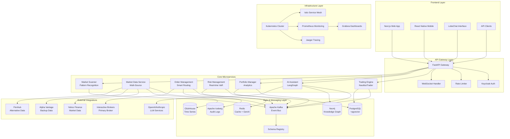

### Detailed Data Flow Architecture

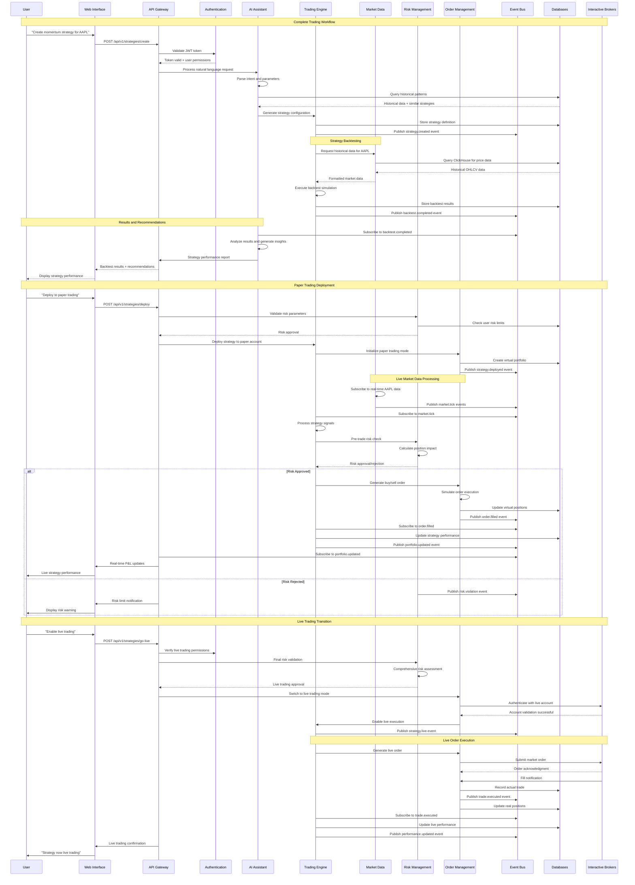

### Event-Driven Architecture Details

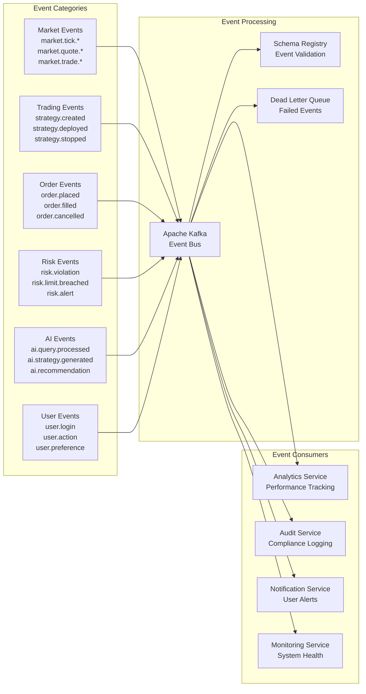

### AI Assistant Architecture

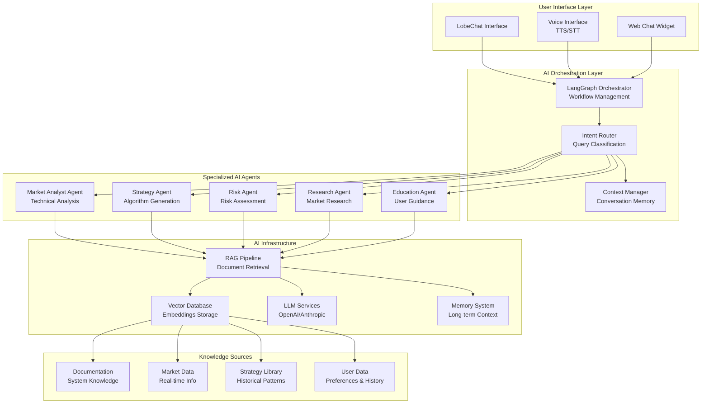

### Security Architecture

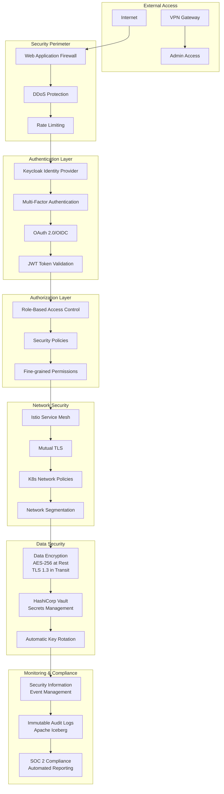

### Performance Optimization Strategy

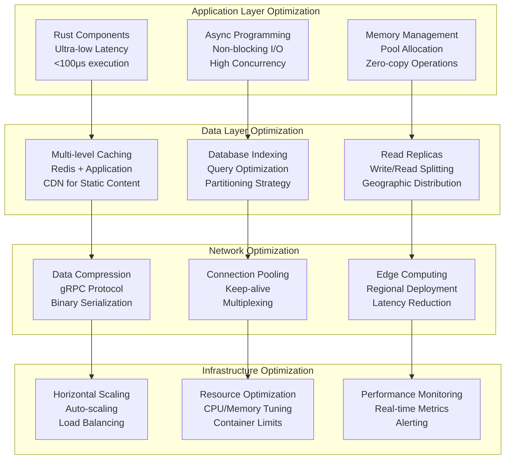

### Data Architecture

1. **Trading Engine Service**: Core NautilusTrader integration with custom adapters
2. **Market Data Service**: Multi-source data aggregation with failover mechanisms
3. **Risk Management Service**: Real-time risk monitoring and circuit breakers
4. **AI Assistant Service**: Agentic AI orchestration with RAG capabilities
5. **Portfolio Manager Service**: Portfolio optimization and performance analytics
6. **Order Management Service**: Order lifecycle and execution management
7. **Market Scanner Service**: Real-time market scanning and pattern recognition
8. **API Gateway**: Central API orchestration and authentication

### Data Flow

1. **Market Data Flow**: External providers → Market Data Service → Kafka → Trading Engine
2. **Order Flow**: User Interface → API Gateway → Order Management → Trading Engine → Broker
3. **Risk Flow**: Trading Engine → Risk Management → Circuit Breakers → Notifications
4. **AI Flow**: User Input → AI Assistant → RAG → Strategy Generation → Trading Engine

### Integration Points

```mermaid
graph TB
    subgraph "External System Integration"
        IBKR_INTEGRATION[Interactive Brokers Integration<br/>Primary Broker Connection]
        DATA_INTEGRATION[Market Data Integration<br/>Multi-source Aggregation]
        AI_INTEGRATION[AI Service Integration<br/>LLM Provider Management]
        CLOUD_INTEGRATION[Cloud Service Integration<br/>Infrastructure Management]
    end
    
    subgraph "IBKR Integration Details"
        IBKR_API[IBKR TWS API<br/>Trading Workstation]
        IBKR_GATEWAY[IBKR Gateway<br/>Headless Connection]
        PAPER_ACCOUNT[Paper Trading<br/>Risk-free Testing]
        LIVE_ACCOUNT[Live Trading<br/>Real Capital]
    end
    
    subgraph "Data Provider Ecosystem"
        PRIMARY[Yahoo Finance<br/>Primary Free Source]
        BACKUP1[Alpha Vantage<br/>API-based Backup]
        BACKUP2[Finnhub<br/>Professional Data]
        BACKUP3[Twelve Data<br/>Alternative Source]
        LIVE_DATA[IBKR Market Data<br/>Live Trading Feed]
    end
    
    subgraph "AI Service Providers"
        OPENAI[OpenAI GPT-4<br/>Strategy Generation]
        ANTHROPIC[Anthropic Claude<br/>Risk Analysis]
        LOCAL_MODELS[Local Models<br/>Offline Processing]
        EMBEDDING[Embedding Services<br/>Vector Generation]
    end
    
    IBKR_INTEGRATION --> IBKR_API
    IBKR_INTEGRATION --> IBKR_GATEWAY
    IBKR_API --> PAPER_ACCOUNT
    IBKR_API --> LIVE_ACCOUNT
    
    DATA_INTEGRATION --> PRIMARY
    DATA_INTEGRATION --> BACKUP1
    DATA_INTEGRATION --> BACKUP2
    DATA_INTEGRATION --> BACKUP3
    DATA_INTEGRATION --> LIVE_DATA
    
    AI_INTEGRATION --> OPENAI
    AI_INTEGRATION --> ANTHROPIC
    AI_INTEGRATION --> LOCAL_MODELS
    AI_INTEGRATION --> EMBEDDING
```

- **Interactive Brokers API**: Primary broker integration for order execution
- **Multiple Data Providers**: Yahoo Finance, Alpha Vantage, Finnhub with fallback chains
- **AI/ML Services**: OpenAI, Anthropic for natural language processing
- **Authentication**: Keycloak for SSO/OIDC integration
- **Monitoring**: Prometheus, Grafana, Jaeger for observability

### Security Architecture

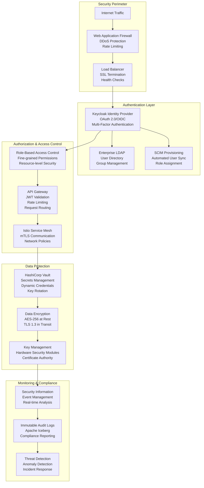

- **Zero-Trust Network**: All communications encrypted with mTLS
- **Authentication**: OAuth 2.0/OIDC via Keycloak with MFA
- **Authorization**: RBAC with fine-grained permissions and resource-level security
- **Data Protection**: AES-256 encryption at rest, TLS 1.3 in transit
- **Secrets Management**: HashiCorp Vault with dynamic credentials and key rotation
- **Monitoring**: SIEM integration with real-time threat detection and incident response

### Deployment Architecture

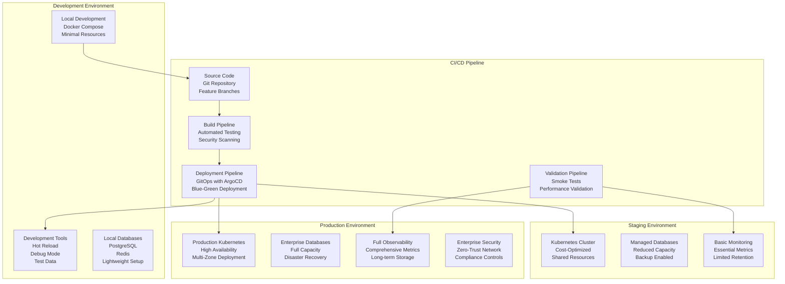

### Microservices Communication Patterns

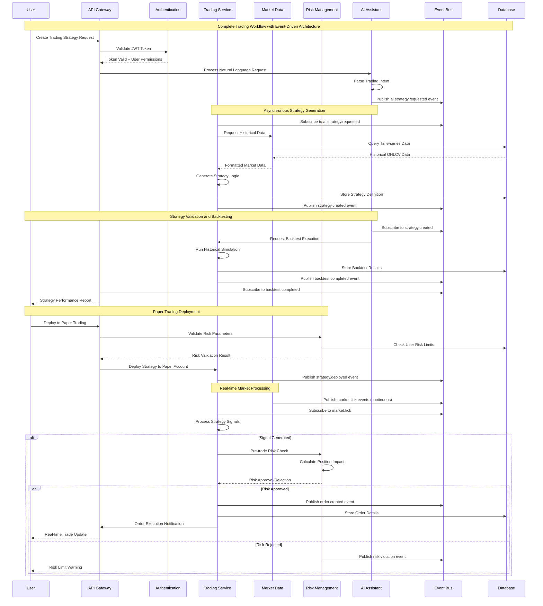

### Data Architecture Deep Dive

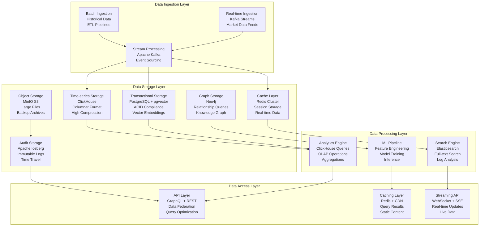

### AI/ML Architecture

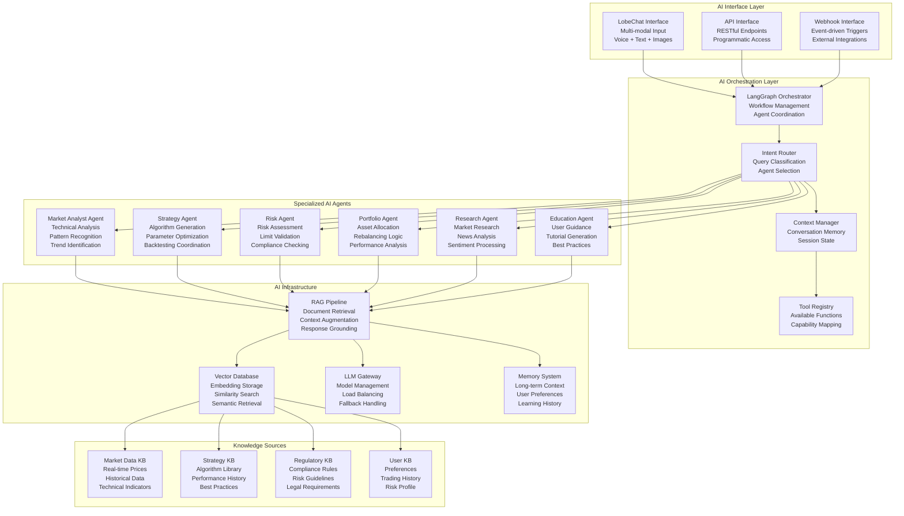

### Performance Optimization Strategy

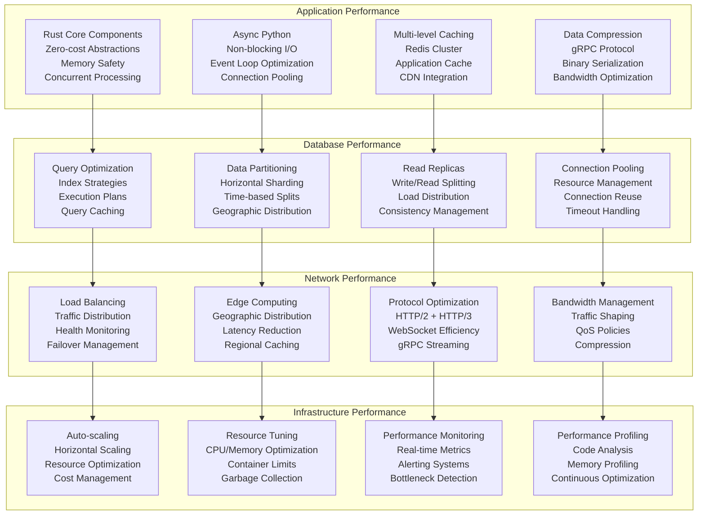

### Disaster Recovery & Business Continuity

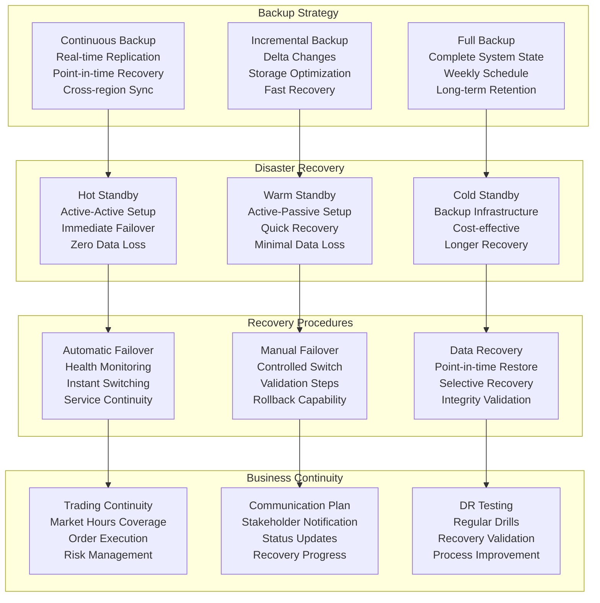

## Technology Stack

### Technology Selection Matrix

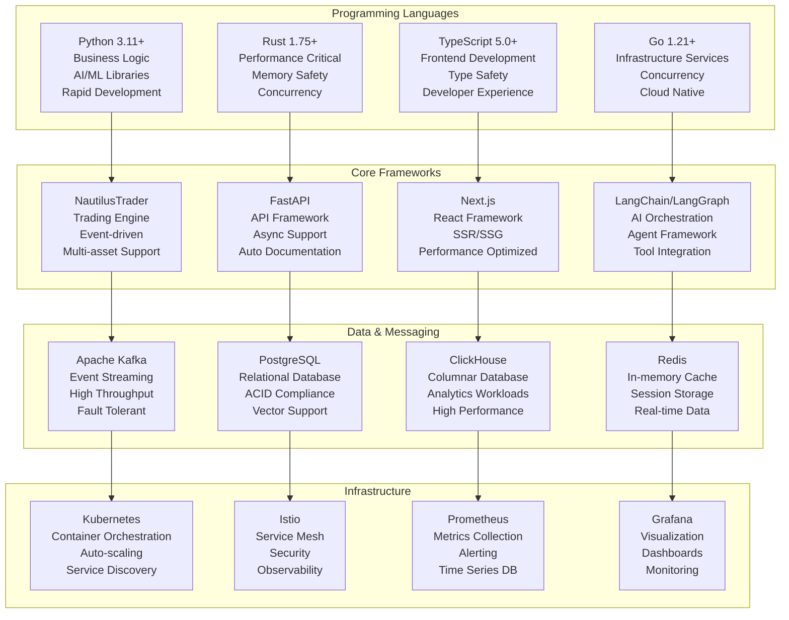

### Core Technologies

- **Trading Engine**: NautilusTrader (Python/Rust)
- **Event Bus**: Apache Kafka with Schema Registry
- **Databases**: PostgreSQL+pgvector, ClickHouse, Neo4j, Redis
- **API Framework**: FastAPI (Python), Express.js (Node.js)
- **Frontend**: Next.js (React), React Native (Mobile)
- **AI/ML**: LangChain, LangGraph, OpenBB, TA-Lib
- **Container Orchestration**: Kubernetes with Istio service mesh

### Supporting Tools

- **Development**: VS Code with Kilo Code extension
- **Testing**: pytest, Jest, Cypress, k6 (performance)
- **CI/CD**: GitHub Actions with automated testing
- **Code Quality**: SonarQube, Bandit, ESLint
- **Documentation**: Markdown with automated generation

### Infrastructure

- **Cloud Providers**: AWS (primary), GCP (secondary), Azure (tertiary)
- **Monitoring**: Prometheus, Grafana, Jaeger, ELK Stack
- **Security**: HashiCorp Vault, Keycloak, Istio
- **Storage**: MinIO (S3-compatible), Apache Iceberg

## Implementation Phases

### Phase 1: Foundation (Weeks 1-4)
- Set up development environment and CI/CD pipelines
- Implement basic Kafka infrastructure and schema registry
- Create core database schemas and migrations
- Develop authentication and authorization framework
- Implement basic API gateway with rate limiting

### Phase 2: Core Trading Infrastructure (Weeks 5-8)
- Integrate NautilusTrader trading engine
- Implement Interactive Brokers adapter
- Develop market data service with primary data sources
- Create basic order management system
- Implement paper trading functionality

### Phase 3: AI and Analytics (Weeks 9-12)
- Develop AI assistant with basic natural language processing
- Implement RAG pipeline for document processing
- Create portfolio analytics and performance attribution
- Develop basic risk management with position limits
- Implement market scanning capabilities

### Phase 4: Advanced Features (Weeks 13-16)
- Add multi-asset class support (options, futures, forex, crypto)
- Implement advanced AI features and strategy generation
- Develop intelligent user guidance system
- Add advanced risk management with VaR calculations
- Implement live trading capabilities

### Phase 5: Production Readiness (Weeks 17-20)
- Comprehensive security hardening and penetration testing
- Performance optimization and load testing
- Implement comprehensive monitoring and alerting
- Complete SOC 2 compliance requirements
- Production deployment and go-live preparation

## Quality Assurance

### Testing Strategy
- **Unit Tests**: >90% coverage for all services using pytest, Jest
- **Integration Tests**: Cross-service communication and data flow validation
- **Contract Tests**: API contract validation using Pact
- **End-to-End Tests**: Complete user journey validation using Cypress
- **Performance Tests**: Load testing with k6, latency validation
- **Security Tests**: Penetration testing, vulnerability scanning

### Performance Validation
- **Latency Testing**: Validate <100μs execution times for trading operations
- **Throughput Testing**: Validate >1M events/sec processing capability
- **Load Testing**: Validate 10k+ concurrent user support
- **Stress Testing**: System behavior under extreme conditions

### Security Testing
- **Static Analysis**: Bandit for Python, ESLint for JavaScript
- **Dynamic Analysis**: OWASP ZAP for web application security
- **Penetration Testing**: Third-party security assessment
- **Compliance Validation**: SOC 2 Type 2 readiness assessment

## Deployment Strategy

### Development Environment
- **Local Setup**: Docker Compose with all services
- **Database**: Local PostgreSQL, Redis, ClickHouse instances
- **Message Bus**: Local Kafka cluster
- **Monitoring**: Local Prometheus and Grafana

### Staging Environment
- **Cloud Setup**: Kubernetes cluster with cost-optimized resources
- **Database**: Managed cloud databases with reduced capacity
- **Load Balancing**: Kubernetes ingress with basic load balancing
- **Monitoring**: Full observability stack with limited retention

### Production Environment
- **High Availability**: Multi-zone Kubernetes deployment
- **Database**: Managed databases with high availability and backup
- **Load Balancing**: Advanced load balancing with health checks
- **Monitoring**: Comprehensive observability with long-term retention
- **Security**: Full zero-trust implementation with network policies

## Risk Assessment

### Technical Risks
- **Latency Requirements**: Mitigation through Rust optimization and caching
- **Data Quality**: Mitigation through multiple data sources and validation
- **System Complexity**: Mitigation through comprehensive testing and monitoring
- **Third-party Dependencies**: Mitigation through wrapper pattern and fallbacks

### Integration Risks
- **Broker API Changes**: Mitigation through adapter pattern and version management
- **Data Provider Outages**: Mitigation through multi-source fallback chains
- **AI Service Availability**: Mitigation through local model fallbacks
- **Cloud Provider Issues**: Mitigation through multi-cloud deployment

### Performance Risks
- **Scaling Bottlenecks**: Mitigation through horizontal scaling and caching
- **Database Performance**: Mitigation through read replicas and partitioning
- **Network Latency**: Mitigation through edge deployment and CDN
- **Memory Usage**: Mitigation through efficient data structures and garbage collection

## Success Metrics

### Technical Metrics
- **Latency**: <100μs for order execution, <1ms for market data processing
- **Throughput**: >1M events/sec, >100k orders/sec
- **Availability**: 99.9% uptime during market hours
- **Performance**: <30s backtest execution for 5+ years of data

### Business Metrics
- **User Adoption**: 90% of users complete first paper trade within 30 minutes
- **Strategy Success**: >70% of AI-generated strategies pass backtesting
- **Time to Market**: 80% reduction in strategy development time
- **User Satisfaction**: >85% satisfaction rating for AI recommendations