# Feature Specification: Algorithmic Trading System

**Feature Branch**: `algorithmic-trading-system`  
**Created**: 01 November 2025  
**Status**: Draft  
**Input**: User description: "Comprehensive enterprise-grade algorithmic trading system with AI-powered strategy development, multi-asset class support, real-time execution, risk management, and intelligent user guidance for both retail and professional traders"

## System Overview

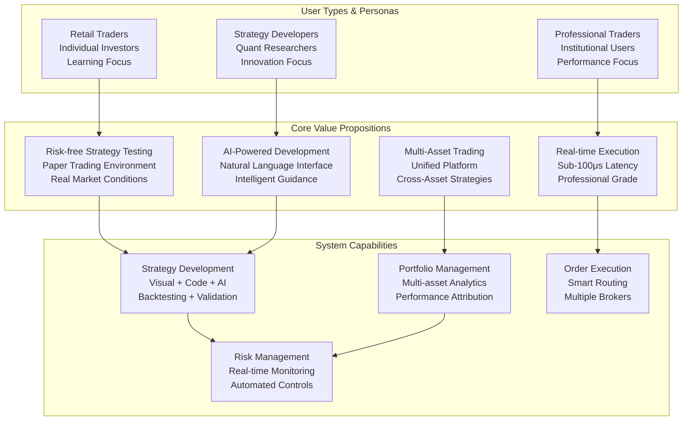
```mermaid
graph TB
    subgraph "User Types & Personas"
        RETAIL[Retail Traders<br/>Individual Investors<br/>Learning Focus]
        PROFESSIONAL[Professional Traders<br/>Institutional Users<br/>Performance Focus]
        DEVELOPERS[Strategy Developers<br/>Quant Researchers<br/>Innovation Focus]
    end
    
    subgraph "Core Value Propositions"
        PAPER_TRADING[Risk-free Strategy Testing<br/>Paper Trading Environment<br/>Real Market Conditions]
        AI_ASSISTANCE[AI-Powered Development<br/>Natural Language Interface<br/>Intelligent Guidance]
        MULTI_ASSET[Multi-Asset Trading<br/>Unified Platform<br/>Cross-Asset Strategies]
        REAL_TIME[Real-time Execution<br/>Sub-100μs Latency<br/>Professional Grade]
    end
    
    subgraph "System Capabilities"
        STRATEGY_DEV[Strategy Development<br/>Visual + Code + AI<br/>Backtesting + Validation]
        RISK_MGMT[Risk Management<br/>Real-time Monitoring<br/>Automated Controls]
        PORTFOLIO[Portfolio Management<br/>Multi-asset Analytics<br/>Performance Attribution]
        EXECUTION[Order Execution<br/>Smart Routing<br/>Multiple Brokers]
    end
    
    RETAIL --> PAPER_TRADING
    PROFESSIONAL --> REAL_TIME
    DEVELOPERS --> AI_ASSISTANCE
    
    PAPER_TRADING --> STRATEGY_DEV
    AI_ASSISTANCE --> STRATEGY_DEV
    MULTI_ASSET --> PORTFOLIO
    REAL_TIME --> EXECUTION
    
    STRATEGY_DEV --> RISK_MGMT
    PORTFOLIO --> RISK_MGMT
```

## User Scenarios & Testing *(mandatory)*

### User Journey Flow

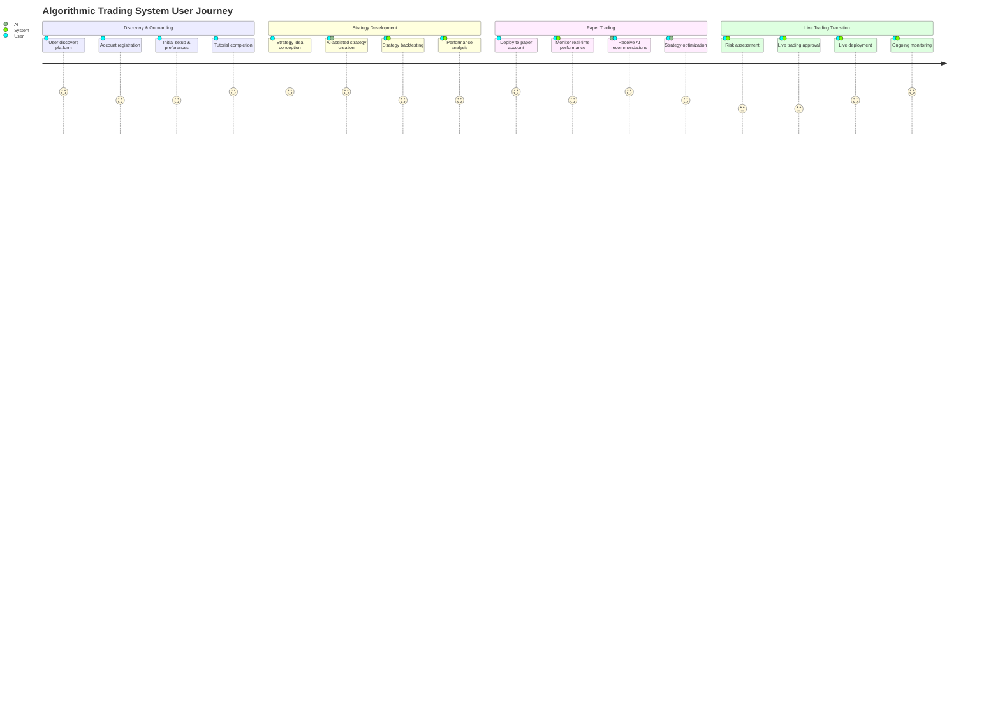
```mermaid
journey
    title Algorithmic Trading System User Journey
    section Discovery & Onboarding
      User discovers platform: 5: User
      Account registration: 4: User
      Initial setup & preferences: 4: User
      Tutorial completion: 5: User
    section Strategy Development
      Strategy idea conception: 5: User
      AI-assisted strategy creation: 5: User, AI
      Strategy backtesting: 4: User, System
      Performance analysis: 4: User, System
    section Paper Trading
      Deploy to paper account: 5: User
      Monitor real-time performance: 4: User, System
      Receive AI recommendations: 5: AI, User
      Strategy optimization: 4: User, AI
    section Live Trading Transition
      Risk assessment: 3: User, System
      Live trading approval: 3: User, System
      Live deployment: 4: User, System
      Ongoing monitoring: 5: User, System
```

### User Story 1 - Paper Trading Strategy Validation (Priority: P1)

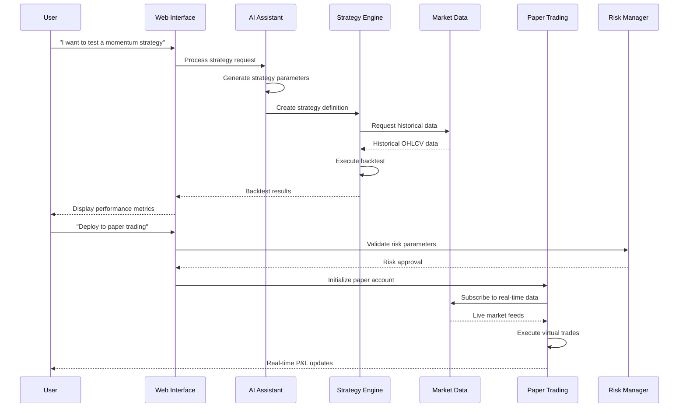
```mermaid
sequenceDiagram
    participant User
    participant UI as Web Interface
    participant AI as AI Assistant
    participant Strategy as Strategy Engine
    participant Market as Market Data
    participant Paper as Paper Trading
    participant Risk as Risk Manager
    
    User->>UI: "I want to test a momentum strategy"
    UI->>AI: Process strategy request
    AI->>AI: Generate strategy parameters
    AI->>Strategy: Create strategy definition
    Strategy->>Market: Request historical data
    Market-->>Strategy: Historical OHLCV data
    Strategy->>Strategy: Execute backtest
    Strategy-->>UI: Backtest results
    UI-->>User: Display performance metrics
    
    User->>UI: "Deploy to paper trading"
    UI->>Risk: Validate risk parameters
    Risk-->>UI: Risk approval
    UI->>Paper: Initialize paper account
    Paper->>Market: Subscribe to real-time data
    Market-->>Paper: Live market feeds
    Paper->>Paper: Execute virtual trades
    Paper-->>User: Real-time P&L updates
```

A retail trader wants to test their trading strategy in a risk-free environment before committing real capital. They can create strategies using visual tools, backtest them with historical data, and deploy them to a paper trading account to validate real-market performance.

**Why this priority**: This is the core value proposition that allows users to validate strategies without financial risk, building confidence before live trading.

**Independent Test**: Can be fully tested by creating a simple moving average strategy, running a backtest, and executing paper trades, delivering immediate value through risk-free strategy validation.

**Acceptance Scenarios**:

1. **Given** a user has market data access, **When** they create a strategy using the visual builder, **Then** they can backtest it with historical data and see performance metrics
2. **Given** a backtested strategy shows positive results, **When** the user deploys it to paper trading, **Then** the system executes trades in real-time without using real money
3. **Given** a paper trading strategy is running, **When** market conditions change, **Then** the user receives real-time notifications and can monitor performance

---

### User Story 2 - AI-Powered Strategy Development (Priority: P2)

```mermaid
graph LR
    subgraph "AI Strategy Development Flow"
        INPUT[Natural Language Input<br/>"Create momentum strategy<br/>for tech stocks"]
        ANALYSIS[Market Analysis<br/>Historical Pattern Recognition<br/>Sector Performance Review]
        GENERATION[Strategy Generation<br/>Algorithm Creation<br/>Parameter Optimization]
        VALIDATION[Strategy Validation<br/>Backtesting<br/>Risk Assessment]
        DEPLOYMENT[Strategy Deployment<br/>Paper Trading<br/>Performance Monitoring]
    end
    
    INPUT --> ANALYSIS
    ANALYSIS --> GENERATION
    GENERATION --> VALIDATION
    VALIDATION --> DEPLOYMENT
```

A professional trader wants to leverage AI assistance to develop sophisticated trading strategies. They can interact with the AI assistant using natural language to generate, optimize, and refine strategies based on market analysis and historical performance.

**Why this priority**: Differentiates the platform by providing intelligent assistance that accelerates strategy development and improves outcomes.

**Independent Test**: Can be tested by asking the AI to "create a momentum strategy for tech stocks" and receiving a complete, executable strategy with explanations.

**Acceptance Scenarios**:

1. **Given** a user describes their trading idea in natural language, **When** they submit it to the AI assistant, **Then** the system generates a complete strategy with code and parameters
2. **Given** an existing strategy with poor performance, **When** the user asks the AI to optimize it, **Then** the system analyzes weaknesses and suggests improvements
3. **Given** market conditions have changed, **When** the AI detects strategy underperformance, **Then** it proactively suggests adaptations

---

### User Story 3 - Multi-Asset Class Trading (Priority: P2)

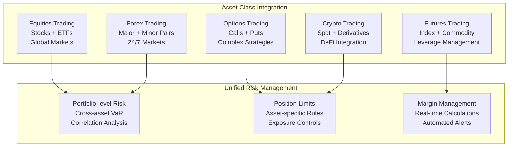
```mermaid
graph TB
    subgraph "Asset Class Integration"
        EQUITIES[Equities Trading<br/>Stocks + ETFs<br/>Global Markets]
        OPTIONS[Options Trading<br/>Calls + Puts<br/>Complex Strategies]
        FUTURES[Futures Trading<br/>Index + Commodity<br/>Leverage Management]
        FOREX[Forex Trading<br/>Major + Minor Pairs<br/>24/7 Markets]
        CRYPTO[Crypto Trading<br/>Spot + Derivatives<br/>DeFi Integration]
    end
    
    subgraph "Unified Risk Management"
        PORTFOLIO_RISK[Portfolio-level Risk<br/>Cross-asset VaR<br/>Correlation Analysis]
        POSITION_LIMITS[Position Limits<br/>Asset-specific Rules<br/>Exposure Controls]
        MARGIN_MGMT[Margin Management<br/>Real-time Calculations<br/>Automated Alerts]
    end
    
    EQUITIES --> PORTFOLIO_RISK
    OPTIONS --> POSITION_LIMITS
    FUTURES --> MARGIN_MGMT
    FOREX --> PORTFOLIO_RISK
    CRYPTO --> POSITION_LIMITS
```

A professional trader manages portfolios across multiple asset classes including stocks, options, futures, forex, and crypto. They need unified access to real-time data, execution capabilities, and risk management across all instruments.

**Why this priority**: Essential for professional users and enables portfolio diversification strategies that are critical for institutional-grade trading.

**Independent Test**: Can be tested by placing simultaneous orders across different asset classes (stock, option, forex pair) and verifying unified execution and risk monitoring.

**Acceptance Scenarios**:

1. **Given** a user has access to multiple asset classes, **When** they create a cross-asset strategy, **Then** the system executes trades across stocks, options, and forex simultaneously
2. **Given** real-time market data from multiple sources, **When** a user monitors their portfolio, **Then** they see unified risk metrics across all positions
3. **Given** different asset classes have different trading hours, **When** markets open/close, **Then** the system automatically adjusts strategy execution accordingly

---

### User Story 4 - Real-Time Risk Management (Priority: P1)

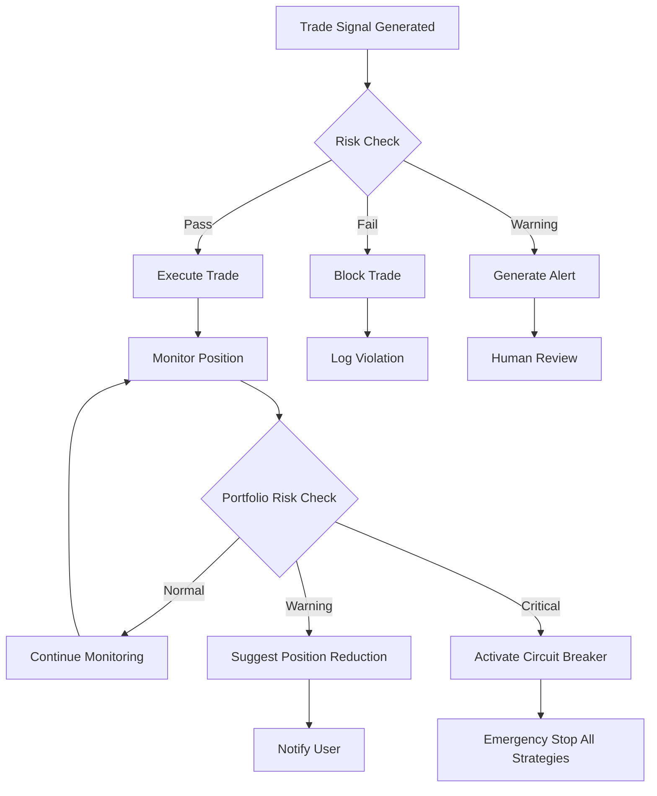
```mermaid
flowchart TD
    START[Trade Signal Generated] --> RISK_CHECK{Risk Check}
    RISK_CHECK -->|Pass| EXECUTE[Execute Trade]
    RISK_CHECK -->|Fail| BLOCK[Block Trade]
    RISK_CHECK -->|Warning| ALERT[Generate Alert]
    
    EXECUTE --> MONITOR[Monitor Position]
    BLOCK --> LOG[Log Violation]
    ALERT --> REVIEW[Human Review]
    
    MONITOR --> PORTFOLIO_RISK{Portfolio Risk Check}
    PORTFOLIO_RISK -->|Normal| CONTINUE[Continue Monitoring]
    PORTFOLIO_RISK -->|Warning| REDUCE[Suggest Position Reduction]
    PORTFOLIO_RISK -->|Critical| CIRCUIT_BREAKER[Activate Circuit Breaker]
    
    CIRCUIT_BREAKER --> EMERGENCY_STOP[Emergency Stop All Strategies]
    REDUCE --> NOTIFICATION[Notify User]
    CONTINUE --> MONITOR
```

A trader needs continuous monitoring of portfolio risk with automatic circuit breakers and alerts. The system must prevent excessive losses through position limits, stop-losses, and real-time risk calculations.

**Why this priority**: Critical for protecting capital and meeting regulatory requirements, especially for live trading.

**Independent Test**: Can be tested by setting position limits, triggering risk thresholds, and verifying automatic protective actions.

**Acceptance Scenarios**:

1. **Given** a user has set risk limits, **When** a position approaches the limit, **Then** the system sends alerts and can automatically reduce exposure
2. **Given** market volatility increases suddenly, **When** portfolio VaR exceeds thresholds, **Then** the system triggers circuit breakers and notifies the user
3. **Given** a strategy is losing money rapidly, **When** drawdown limits are reached, **Then** the system automatically stops the strategy and preserves capital

---

### User Story 5 - Intelligent User Guidance (Priority: P3)

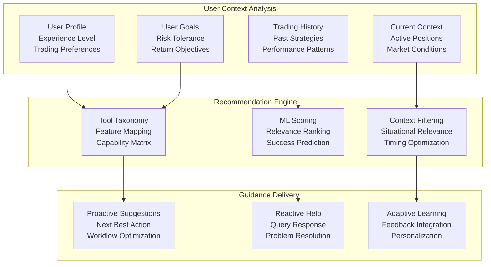
```mermaid
graph TB
    subgraph "User Context Analysis"
        PROFILE[User Profile<br/>Experience Level<br/>Trading Preferences]
        HISTORY[Trading History<br/>Past Strategies<br/>Performance Patterns]
        CURRENT[Current Context<br/>Active Positions<br/>Market Conditions]
        GOALS[User Goals<br/>Risk Tolerance<br/>Return Objectives]
    end
    
    subgraph "Recommendation Engine"
        TOOL_TAXONOMY[Tool Taxonomy<br/>Feature Mapping<br/>Capability Matrix]
        ML_SCORING[ML Scoring<br/>Relevance Ranking<br/>Success Prediction]
        CONTEXT_FILTER[Context Filtering<br/>Situational Relevance<br/>Timing Optimization]
    end
    
    subgraph "Guidance Delivery"
        PROACTIVE[Proactive Suggestions<br/>Next Best Action<br/>Workflow Optimization]
        REACTIVE[Reactive Help<br/>Query Response<br/>Problem Resolution]
        ADAPTIVE[Adaptive Learning<br/>Feedback Integration<br/>Personalization]
    end
    
    PROFILE --> TOOL_TAXONOMY
    HISTORY --> ML_SCORING
    CURRENT --> CONTEXT_FILTER
    GOALS --> TOOL_TAXONOMY
    
    TOOL_TAXONOMY --> PROACTIVE
    ML_SCORING --> REACTIVE
    CONTEXT_FILTER --> ADAPTIVE
```

A novice trader receives proactive recommendations for tools and next steps based on their goals and experience level. The system guides them through the platform's capabilities and suggests optimal workflows.

**Why this priority**: Improves user adoption and success rates, especially important for expanding the user base beyond technical experts.

**Independent Test**: Can be tested by a new user stating "I want to find undervalued stocks" and receiving appropriate tool recommendations with explanations.

**Acceptance Scenarios**:

1. **Given** a user expresses a trading goal, **When** they interact with the guidance system, **Then** they receive 2-3 relevant tool recommendations with explanations
2. **Given** a user completes a task (like running a backtest), **When** the task finishes, **Then** the system suggests logical next steps with rationale
3. **Given** a user's experience level, **When** they access features, **Then** the system adapts complexity and provides appropriate guidance

---

### User Story 6 - Live Trading Execution (Priority: P2)

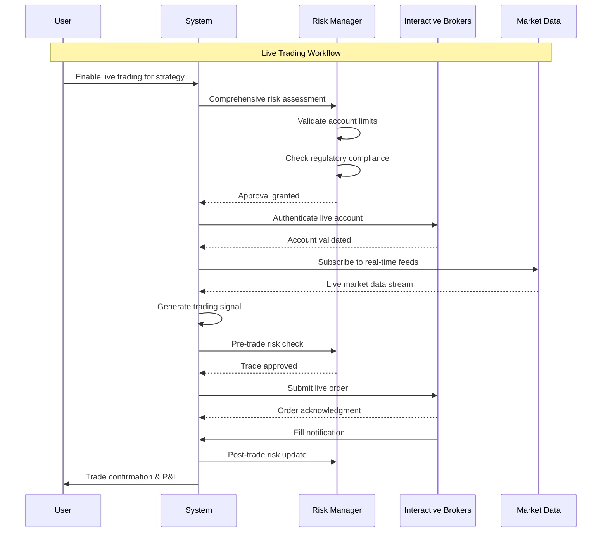
```mermaid
sequenceDiagram
    participant User
    participant System
    participant Risk as Risk Manager
    participant Broker as Interactive Brokers
    participant Market as Market Data
    
    Note over User, Market: Live Trading Workflow
    
    User->>System: Enable live trading for strategy
    System->>Risk: Comprehensive risk assessment
    Risk->>Risk: Validate account limits
    Risk->>Risk: Check regulatory compliance
    Risk-->>System: Approval granted
    
    System->>Broker: Authenticate live account
    Broker-->>System: Account validated
    
    System->>Market: Subscribe to real-time feeds
    Market-->>System: Live market data stream
    
    System->>System: Generate trading signal
    System->>Risk: Pre-trade risk check
    Risk-->>System: Trade approved
    
    System->>Broker: Submit live order
    Broker-->>System: Order acknowledgment
    Broker->>System: Fill notification
    
    System->>Risk: Post-trade risk update
    System->>User: Trade confirmation & P&L
```

An experienced trader wants to deploy validated strategies to live markets with real capital. They need seamless transition from paper trading with full audit trails and compliance features.

**Why this priority**: The ultimate goal for professional traders, but requires robust validation through paper trading first.

**Independent Test**: Can be tested by transitioning a successful paper trading strategy to live execution and verifying real trades are placed correctly.

**Acceptance Scenarios**:

1. **Given** a strategy has proven successful in paper trading, **When** a user enables live trading, **Then** the system executes real trades with the same logic
2. **Given** live trading is active, **When** trades are executed, **Then** all actions are logged immutably for compliance and audit purposes
3. **Given** live trading connectivity issues, **When** the connection fails, **Then** the system safely handles the disconnection and alerts the user

---

### Edge Cases

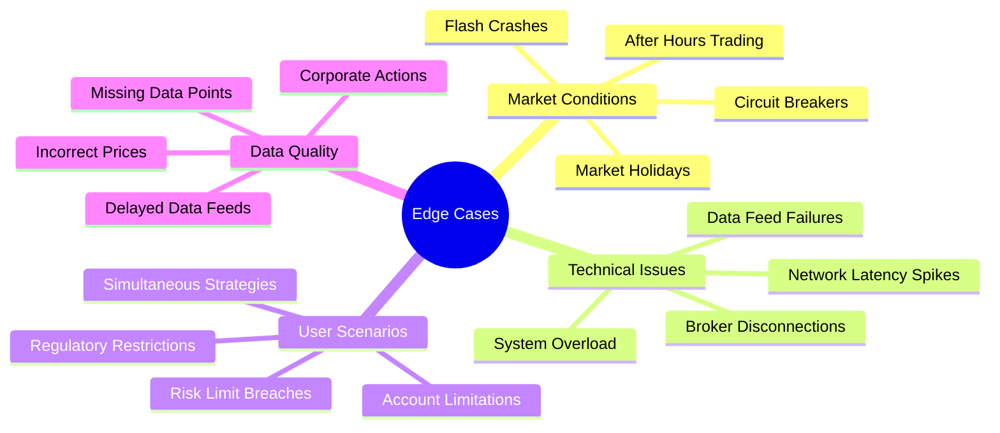
```mermaid
mindmap
  root((Edge Cases))
    Market Conditions
      Flash Crashes
      Circuit Breakers
      Market Holidays
      After Hours Trading
    Technical Issues
      Data Feed Failures
      Broker Disconnections
      System Overload
      Network Latency Spikes
    User Scenarios
      Simultaneous Strategies
      Account Limitations
      Regulatory Restrictions
      Risk Limit Breaches
    Data Quality
      Missing Data Points
      Delayed Data Feeds
      Incorrect Prices
      Corporate Actions
```

- What happens when market data feeds fail during active trading?
- How does the system handle partial fills and order rejections?
- What occurs when AI models become unavailable during strategy generation?
- How does the system manage conflicting signals from multiple strategies?
- What happens when risk limits are breached during high-volatility periods?
- How does the system handle time zone differences for global markets?
- What occurs when broker connectivity is lost during live trading?
- How does the system manage corporate actions (splits, dividends, mergers)?
- What happens when user account limits are exceeded?
- How does the system handle regulatory trading restrictions?

## Requirements *(mandatory)*

### Functional Requirements Architecture

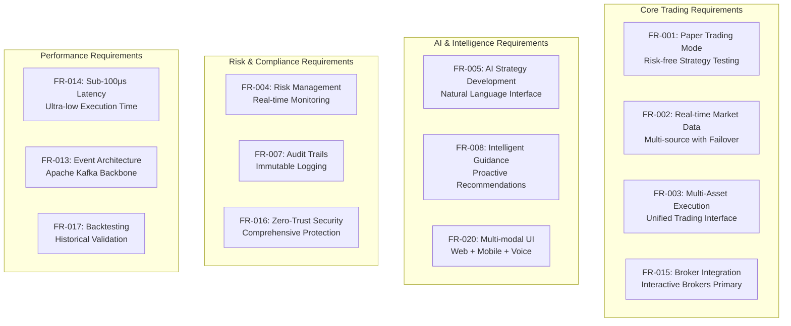
```mermaid
graph TB
    subgraph "Core Trading Requirements"
        FR001[FR-001: Paper Trading Mode<br/>Risk-free Strategy Testing]
        FR002[FR-002: Real-time Market Data<br/>Multi-source with Failover]
        FR003[FR-003: Multi-Asset Execution<br/>Unified Trading Interface]
        FR015[FR-015: Broker Integration<br/>Interactive Brokers Primary]
    end
    
    subgraph "AI & Intelligence Requirements"
        FR005[FR-005: AI Strategy Development<br/>Natural Language Interface]
        FR008[FR-008: Intelligent Guidance<br/>Proactive Recommendations]
        FR020[FR-020: Multi-modal UI<br/>Web + Mobile + Voice]
    end
    
    subgraph "Risk & Compliance Requirements"
        FR004[FR-004: Risk Management<br/>Real-time Monitoring]
        FR007[FR-007: Audit Trails<br/>Immutable Logging]
        FR016[FR-016: Zero-Trust Security<br/>Comprehensive Protection]
    end
    
    subgraph "Performance Requirements"
        FR014[FR-014: Sub-100μs Latency<br/>Ultra-low Execution Time]
        FR013[FR-013: Event Architecture<br/>Apache Kafka Backbone]
        FR017[FR-017: Backtesting<br/>Historical Validation]
    end
```

### Functional Requirements

- **FR-001**: System MUST support paper trading mode for all strategies without using real capital
- **FR-002**: System MUST provide real-time market data with automatic failover between multiple data sources
- **FR-003**: System MUST execute trades across multiple asset classes (stocks, options, futures, forex, crypto)
- **FR-004**: System MUST implement real-time risk monitoring with configurable limits and automatic circuit breakers
- **FR-005**: System MUST provide AI-powered strategy development through natural language interaction
- **FR-006**: System MUST support both visual (no-code) and programmatic strategy creation
- **FR-007**: System MUST maintain complete audit trails for all trading activities in immutable storage
- **FR-008**: System MUST provide intelligent user guidance with proactive tool recommendations
- **FR-009**: System MUST support seamless transition from paper trading to live trading
- **FR-010**: System MUST implement multi-source data feeds with asset-class-specific fallback chains
- **FR-011**: System MUST provide real-time portfolio analytics and performance attribution
- **FR-012**: System MUST support custom volume-weighted technical indicators
- **FR-013**: System MUST implement event-driven architecture with Apache Kafka for all inter-service communication
- **FR-014**: System MUST provide sub-100 microsecond execution latency for high-frequency trading operations
- **FR-015**: System MUST support multiple broker integrations starting with Interactive Brokers
- **FR-016**: System MUST implement zero-trust security architecture with comprehensive authentication and authorization
- **FR-017**: System MUST provide comprehensive backtesting capabilities with historical data
- **FR-018**: System MUST support portfolio optimization using modern portfolio theory
- **FR-019**: System MUST implement market scanning capabilities with real-time filtering
- **FR-020**: System MUST provide multi-modal user interfaces (web, mobile, voice, API)

### Key Entities Data Model

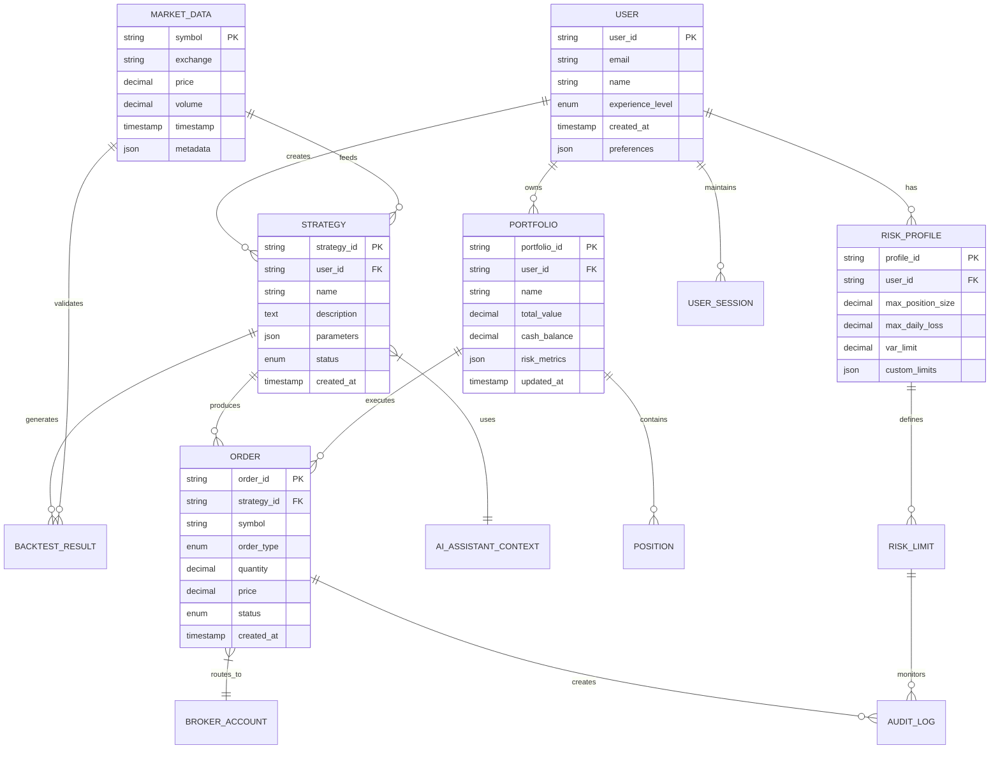
```mermaid
erDiagram
    USER ||--o{ STRATEGY : creates
    USER ||--o{ PORTFOLIO : owns
    USER ||--o{ RISK_PROFILE : has
    USER ||--o{ USER_SESSION : maintains
    
    STRATEGY ||--o{ BACKTEST_RESULT : generates
    STRATEGY ||--o{ ORDER : produces
    STRATEGY }|--|| AI_ASSISTANT_CONTEXT : uses
    
    PORTFOLIO ||--o{ POSITION : contains
    PORTFOLIO ||--o{ ORDER : executes
    
    ORDER }|--|| BROKER_ACCOUNT : routes_to
    ORDER ||--o{ AUDIT_LOG : creates
    
    MARKET_DATA ||--o{ STRATEGY : feeds
    MARKET_DATA ||--o{ BACKTEST_RESULT : validates
    
    RISK_PROFILE ||--o{ RISK_LIMIT : defines
    RISK_LIMIT ||--o{ AUDIT_LOG : monitors
    
    USER {
        string user_id PK
        string email
        string name
        enum experience_level
        timestamp created_at
        json preferences
    }
    
    STRATEGY {
        string strategy_id PK
        string user_id FK
        string name
        text description
        json parameters
        enum status
        timestamp created_at
    }
    
    PORTFOLIO {
        string portfolio_id PK
        string user_id FK
        string name
        decimal total_value
        decimal cash_balance
        json risk_metrics
        timestamp updated_at
    }
    
    ORDER {
        string order_id PK
        string strategy_id FK
        string symbol
        enum order_type
        decimal quantity
        decimal price
        enum status
        timestamp created_at
    }
    
    MARKET_DATA {
        string symbol PK
        string exchange
        decimal price
        decimal volume
        timestamp timestamp
        json metadata
    }
    
    RISK_PROFILE {
        string profile_id PK
        string user_id FK
        decimal max_position_size
        decimal max_daily_loss
        decimal var_limit
        json custom_limits
    }
```

### Key Entities

- **Strategy**: Represents trading algorithms with parameters, rules, and execution logic
- **Portfolio**: Collection of positions across multiple asset classes with risk metrics
- **Order**: Individual trade instructions with execution status and audit trail
- **Market Data**: Real-time and historical price/volume information across all supported assets
- **Risk Profile**: User-defined risk parameters and limits for automated monitoring
- **User Session**: Authenticated user context with permissions and preferences
- **Backtest Result**: Historical performance analysis of strategies with detailed metrics
- **AI Assistant Context**: Conversation history and user preferences for intelligent guidance
- **Broker Account**: External trading account connections with authentication and permissions
- **Audit Log**: Immutable record of all system activities for compliance and debugging

## Clarifications

### Session 27 January 2025

No critical ambiguities detected during clarification review. The specification is comprehensive with:
- Clear functional requirements (20 items)
- Measurable success criteria (15 metrics)
- Well-defined user stories with priorities
- Comprehensive edge case coverage
- Documented assumptions and constraints

All requirements are testable and unambiguous. The specification is ready for technical planning.

## Success Criteria *(mandatory)*

### Success Metrics Dashboard

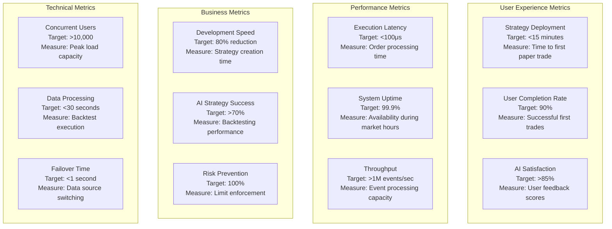
```mermaid
graph TB
    subgraph "User Experience Metrics"
        UX1[Strategy Deployment<br/>Target: <15 minutes<br/>Measure: Time to first paper trade]
        UX2[User Completion Rate<br/>Target: 90%<br/>Measure: Successful first trades]
        UX3[AI Satisfaction<br/>Target: >85%<br/>Measure: User feedback scores]
    end
    
    subgraph "Performance Metrics"
        PERF1[Execution Latency<br/>Target: <100μs<br/>Measure: Order processing time]
        PERF2[System Uptime<br/>Target: 99.9%<br/>Measure: Availability during market hours]
        PERF3[Throughput<br/>Target: >1M events/sec<br/>Measure: Event processing capacity]
    end
    
    subgraph "Business Metrics"
        BIZ1[Development Speed<br/>Target: 80% reduction<br/>Measure: Strategy creation time]
        BIZ2[AI Strategy Success<br/>Target: >70%<br/>Measure: Backtesting performance]
        BIZ3[Risk Prevention<br/>Target: 100%<br/>Measure: Limit enforcement]
    end
    
    subgraph "Technical Metrics"
        TECH1[Concurrent Users<br/>Target: >10,000<br/>Measure: Peak load capacity]
        TECH2[Data Processing<br/>Target: <30 seconds<br/>Measure: Backtest execution]
        TECH3[Failover Time<br/>Target: <1 second<br/>Measure: Data source switching]
    end
```

### Measurable Outcomes

- **SC-001**: Users can create and deploy a basic strategy to paper trading within 15 minutes of first login
- **SC-002**: System executes trades with latency under 100 microseconds for high-frequency operations
- **SC-003**: AI assistant provides relevant tool recommendations with >85% user satisfaction rating
- **SC-004**: System maintains 99.9% uptime during market hours with automatic failover
- **SC-005**: Users can backtest strategies with 5+ years of historical data in under 30 seconds
- **SC-006**: Risk management system prevents losses exceeding user-defined limits in 100% of test scenarios
- **SC-007**: System supports 10,000+ concurrent users during peak trading hours without performance degradation
- **SC-008**: Data feed failover occurs within 1 second with zero trade execution interruption
- **SC-009**: 90% of new users successfully complete their first paper trade within 30 minutes
- **SC-010**: System processes >1 million market data events per second with real-time analytics
- **SC-011**: Strategy transition from paper to live trading completes in under 5 minutes
- **SC-012**: All trading activities are logged with complete audit trail achieving 100% compliance verification
- **SC-013**: Users can access and trade across 5+ asset classes through unified interface
- **SC-014**: AI-generated strategies achieve >70% success rate in backtesting validation
- **SC-015**: System reduces time-to-market for new strategies by 80% compared to traditional development

### Advanced User Stories

### User Story 7 - Advanced Portfolio Analytics (Priority: P2)

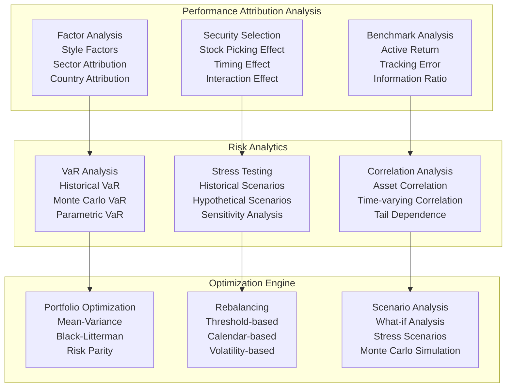
```mermaid
graph TB
    subgraph "Performance Attribution Analysis"
        FACTOR_ANALYSIS[Factor Analysis<br/>Style Factors<br/>Sector Attribution<br/>Country Attribution]
        SECURITY_SELECTION[Security Selection<br/>Stock Picking Effect<br/>Timing Effect<br/>Interaction Effect]
        BENCHMARK_ANALYSIS[Benchmark Analysis<br/>Active Return<br/>Tracking Error<br/>Information Ratio]
    end
    
    subgraph "Risk Analytics"
        VAR_ANALYSIS[VaR Analysis<br/>Historical VaR<br/>Monte Carlo VaR<br/>Parametric VaR]
        STRESS_TESTING[Stress Testing<br/>Historical Scenarios<br/>Hypothetical Scenarios<br/>Sensitivity Analysis]
        CORRELATION_ANALYSIS[Correlation Analysis<br/>Asset Correlation<br/>Time-varying Correlation<br/>Tail Dependence]
    end
    
    subgraph "Optimization Engine"
        PORTFOLIO_OPTIMIZATION[Portfolio Optimization<br/>Mean-Variance<br/>Black-Litterman<br/>Risk Parity]
        REBALANCING[Rebalancing<br/>Threshold-based<br/>Calendar-based<br/>Volatility-based]
        SCENARIO_ANALYSIS[Scenario Analysis<br/>What-if Analysis<br/>Stress Scenarios<br/>Monte Carlo Simulation]
    end
    
    FACTOR_ANALYSIS --> VAR_ANALYSIS
    SECURITY_SELECTION --> STRESS_TESTING
    BENCHMARK_ANALYSIS --> CORRELATION_ANALYSIS
    
    VAR_ANALYSIS --> PORTFOLIO_OPTIMIZATION
    STRESS_TESTING --> REBALANCING
    CORRELATION_ANALYSIS --> SCENARIO_ANALYSIS
```

A portfolio manager needs comprehensive analytics to understand performance drivers, assess risk, and optimize asset allocation. The system provides advanced attribution analysis, risk metrics, and optimization tools for institutional-grade portfolio management.

**Why this priority**: Essential for professional portfolio management and institutional users who need sophisticated analytics beyond basic P&L tracking.

**Independent Test**: Can be tested by creating a multi-asset portfolio, running performance attribution analysis, and generating risk reports with VaR calculations.

**Acceptance Scenarios**:

1. **Given** a portfolio with multiple positions, **When** the user requests performance attribution, **Then** the system breaks down returns by factors, sectors, and security selection
2. **Given** historical portfolio data, **When** the user runs stress testing, **Then** the system shows portfolio performance under various market scenarios
3. **Given** current portfolio weights, **When** the user requests optimization, **Then** the system suggests rebalancing to improve risk-adjusted returns

---

### User Story 8 - Advanced Order Types & Execution (Priority: P2)

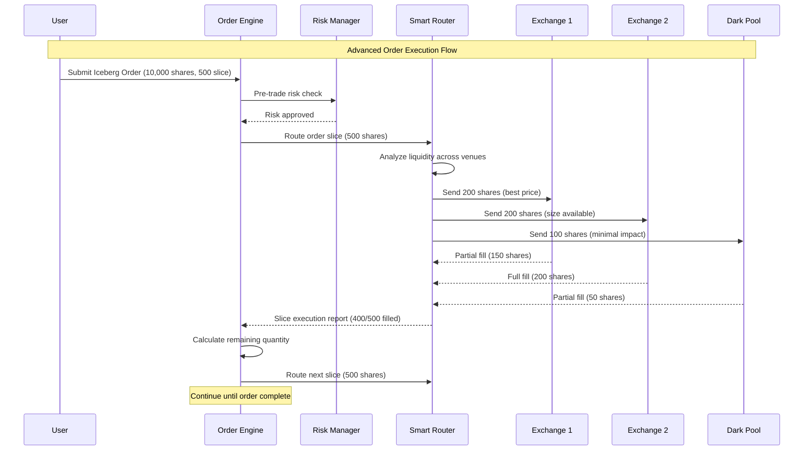
```mermaid
sequenceDiagram
    participant User
    participant OrderEngine as Order Engine
    participant RiskMgr as Risk Manager
    participant SmartRouter as Smart Router
    participant Venue1 as Exchange 1
    participant Venue2 as Exchange 2
    participant Venue3 as Dark Pool
    
    Note over User, Venue3: Advanced Order Execution Flow
    
    User->>OrderEngine: Submit Iceberg Order (10,000 shares, 500 slice)
    OrderEngine->>RiskMgr: Pre-trade risk check
    RiskMgr-->>OrderEngine: Risk approved
    
    OrderEngine->>SmartRouter: Route order slice (500 shares)
    SmartRouter->>SmartRouter: Analyze liquidity across venues
    SmartRouter->>Venue1: Send 200 shares (best price)
    SmartRouter->>Venue2: Send 200 shares (size available)
    SmartRouter->>Venue3: Send 100 shares (minimal impact)
    
    Venue1-->>SmartRouter: Partial fill (150 shares)
    Venue2-->>SmartRouter: Full fill (200 shares)
    Venue3-->>SmartRouter: Partial fill (50 shares)
    
    SmartRouter-->>OrderEngine: Slice execution report (400/500 filled)
    OrderEngine->>OrderEngine: Calculate remaining quantity
    OrderEngine->>SmartRouter: Route next slice (500 shares)
    
    Note over OrderEngine: Continue until order complete
```

A professional trader needs advanced order types including iceberg orders, TWAP/VWAP algorithms, and smart routing across multiple venues to minimize market impact and achieve best execution.

**Why this priority**: Critical for institutional trading and large orders that require sophisticated execution strategies to minimize costs and market impact.

**Independent Test**: Can be tested by placing a large iceberg order and verifying it's executed in small slices with minimal market impact.

**Acceptance Scenarios**:

1. **Given** a large order that could impact the market, **When** the user selects iceberg execution, **Then** the system breaks it into small slices and executes them over time
2. **Given** multiple trading venues with different liquidity, **When** an order is submitted, **Then** the smart router finds the best combination of venues for execution
3. **Given** a TWAP algorithm is selected, **When** the order executes, **Then** the system spreads execution evenly over the specified time period

---

### User Story 9 - Regulatory Compliance & Reporting (Priority: P1)

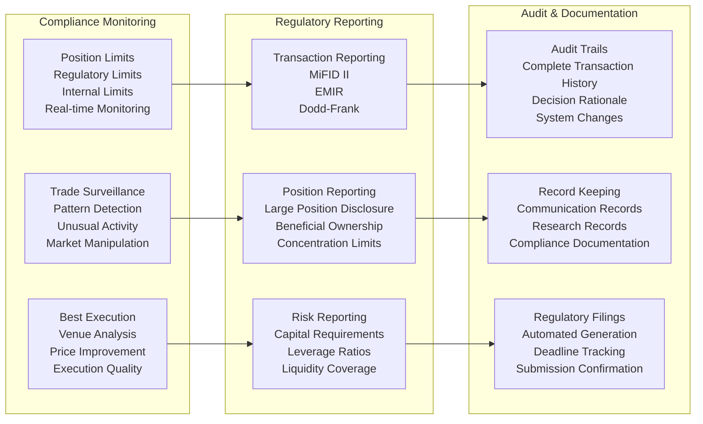
```mermaid
graph LR
    subgraph "Compliance Monitoring"
        POSITION_LIMITS[Position Limits<br/>Regulatory Limits<br/>Internal Limits<br/>Real-time Monitoring]
        TRADE_SURVEILLANCE[Trade Surveillance<br/>Pattern Detection<br/>Unusual Activity<br/>Market Manipulation]
        BEST_EXECUTION[Best Execution<br/>Venue Analysis<br/>Price Improvement<br/>Execution Quality]
    end
    
    subgraph "Regulatory Reporting"
        TRANSACTION_REPORTING[Transaction Reporting<br/>MiFID II<br/>EMIR<br/>Dodd-Frank]
        POSITION_REPORTING[Position Reporting<br/>Large Position Disclosure<br/>Beneficial Ownership<br/>Concentration Limits]
        RISK_REPORTING[Risk Reporting<br/>Capital Requirements<br/>Leverage Ratios<br/>Liquidity Coverage]
    end
    
    subgraph "Audit & Documentation"
        AUDIT_TRAILS[Audit Trails<br/>Complete Transaction History<br/>Decision Rationale<br/>System Changes]
        RECORD_KEEPING[Record Keeping<br/>Communication Records<br/>Research Records<br/>Compliance Documentation]
        REGULATORY_FILINGS[Regulatory Filings<br/>Automated Generation<br/>Deadline Tracking<br/>Submission Confirmation]
    end
    
    POSITION_LIMITS --> TRANSACTION_REPORTING
    TRADE_SURVEILLANCE --> POSITION_REPORTING
    BEST_EXECUTION --> RISK_REPORTING
    
    TRANSACTION_REPORTING --> AUDIT_TRAILS
    POSITION_REPORTING --> RECORD_KEEPING
    RISK_REPORTING --> REGULATORY_FILINGS
```

A compliance officer needs comprehensive monitoring and reporting capabilities to ensure all trading activities comply with regulatory requirements including MiFID II, EMIR, and Dodd-Frank regulations.

**Why this priority**: Mandatory for institutional users and required for regulatory approval to operate in regulated markets.

**Independent Test**: Can be tested by executing trades and verifying all required regulatory reports are generated automatically with complete audit trails.

**Acceptance Scenarios**:

1. **Given** trading activities across multiple jurisdictions, **When** trades are executed, **Then** the system automatically generates required regulatory reports for each jurisdiction
2. **Given** position limits are configured, **When** positions approach limits, **Then** the system prevents violations and generates compliance alerts
3. **Given** audit requirements, **When** regulators request information, **Then** the system provides complete audit trails with immutable records

---

### User Story 10 - Market Making & Liquidity Provision (Priority: P3)

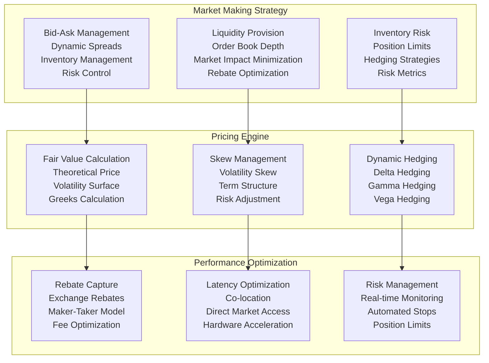
```mermaid
graph TB
    subgraph "Market Making Strategy"
        BID_ASK_MANAGEMENT[Bid-Ask Management<br/>Dynamic Spreads<br/>Inventory Management<br/>Risk Control]
        LIQUIDITY_PROVISION[Liquidity Provision<br/>Order Book Depth<br/>Market Impact Minimization<br/>Rebate Optimization]
        INVENTORY_RISK[Inventory Risk<br/>Position Limits<br/>Hedging Strategies<br/>Risk Metrics]
    end
    
    subgraph "Pricing Engine"
        FAIR_VALUE[Fair Value Calculation<br/>Theoretical Price<br/>Volatility Surface<br/>Greeks Calculation]
        SKEW_MANAGEMENT[Skew Management<br/>Volatility Skew<br/>Term Structure<br/>Risk Adjustment]
        DYNAMIC_HEDGING[Dynamic Hedging<br/>Delta Hedging<br/>Gamma Hedging<br/>Vega Hedging]
    end
    
    subgraph "Performance Optimization"
        REBATE_CAPTURE[Rebate Capture<br/>Exchange Rebates<br/>Maker-Taker Model<br/>Fee Optimization]
        LATENCY_OPTIMIZATION[Latency Optimization<br/>Co-location<br/>Direct Market Access<br/>Hardware Acceleration]
        RISK_MANAGEMENT[Risk Management<br/>Real-time Monitoring<br/>Automated Stops<br/>Position Limits]
    end
    
    BID_ASK_MANAGEMENT --> FAIR_VALUE
    LIQUIDITY_PROVISION --> SKEW_MANAGEMENT
    INVENTORY_RISK --> DYNAMIC_HEDGING
    
    FAIR_VALUE --> REBATE_CAPTURE
    SKEW_MANAGEMENT --> LATENCY_OPTIMIZATION
    DYNAMIC_HEDGING --> RISK_MANAGEMENT
```

A market maker needs sophisticated tools to provide liquidity while managing inventory risk and optimizing spreads. The system supports dynamic pricing, inventory management, and automated hedging for market making strategies.

**Why this priority**: Specialized use case for advanced users, but represents significant revenue opportunity and market differentiation.

**Independent Test**: Can be tested by deploying a market making strategy that maintains bid-ask quotes and manages inventory risk automatically.

**Acceptance Scenarios**:

1. **Given** a market making strategy is active, **When** market conditions change, **Then** the system adjusts bid-ask spreads dynamically to maintain profitability
2. **Given** inventory positions exceed limits, **When** risk thresholds are breached, **Then** the system automatically hedges positions or adjusts quotes
3. **Given** multiple market making opportunities, **When** evaluating venues, **Then** the system optimizes for rebates and minimizes adverse selection

---

### User Story 11 - Cross-Asset Arbitrage (Priority: P3)

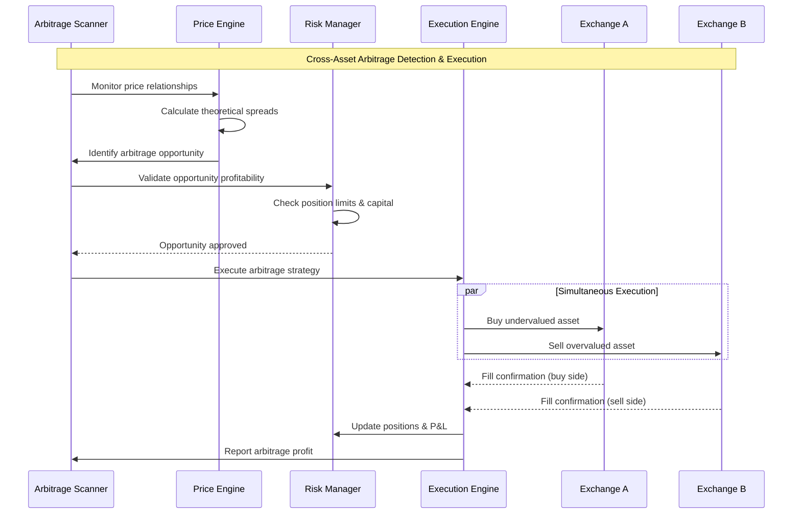
```mermaid
sequenceDiagram
    participant Scanner as Arbitrage Scanner
    participant PriceEngine as Price Engine
    participant RiskMgr as Risk Manager
    participant Execution as Execution Engine
    participant Venue1 as Exchange A
    participant Venue2 as Exchange B
    
    Note over Scanner, Venue2: Cross-Asset Arbitrage Detection & Execution
    
    Scanner->>PriceEngine: Monitor price relationships
    PriceEngine->>PriceEngine: Calculate theoretical spreads
    PriceEngine->>Scanner: Identify arbitrage opportunity
    
    Scanner->>RiskMgr: Validate opportunity profitability
    RiskMgr->>RiskMgr: Check position limits & capital
    RiskMgr-->>Scanner: Opportunity approved
    
    Scanner->>Execution: Execute arbitrage strategy
    
    par Simultaneous Execution
        Execution->>Venue1: Buy undervalued asset
        Execution->>Venue2: Sell overvalued asset
    end
    
    Venue1-->>Execution: Fill confirmation (buy side)
    Venue2-->>Execution: Fill confirmation (sell side)
    
    Execution->>RiskMgr: Update positions & P&L
    Execution->>Scanner: Report arbitrage profit
```

A quantitative trader identifies and exploits price discrepancies across related assets, exchanges, or time periods. The system automatically scans for arbitrage opportunities and executes simultaneous trades to capture risk-free profits.

**Why this priority**: Advanced strategy that requires sophisticated technology but offers attractive risk-adjusted returns for skilled practitioners.

**Independent Test**: Can be tested by identifying price discrepancies between related assets and executing simultaneous trades to capture the spread.

**Acceptance Scenarios**:

1. **Given** price feeds from multiple exchanges, **When** arbitrage opportunities arise, **Then** the system detects them within milliseconds and alerts the user
2. **Given** an arbitrage opportunity is identified, **When** the user approves execution, **Then** the system simultaneously executes both legs of the trade
3. **Given** market conditions change rapidly, **When** arbitrage opportunities disappear, **Then** the system cancels pending orders to prevent losses

---

### Advanced Technical Requirements

### Extended Functional Requirements

- **FR-021**: System MUST support market making strategies with dynamic bid-ask spread management
- **FR-022**: System MUST implement cross-asset arbitrage detection with sub-millisecond opportunity identification
- **FR-023**: System MUST provide advanced order types including iceberg, TWAP, VWAP, and implementation shortfall algorithms
- **FR-024**: System MUST support options trading with real-time Greeks calculation and volatility surface modeling
- **FR-025**: System MUST implement regulatory compliance monitoring for MiFID II, EMIR, and Dodd-Frank requirements
- **FR-026**: System MUST provide performance attribution analysis with factor decomposition and benchmark comparison
- **FR-027**: System MUST support cryptocurrency trading including spot, futures, and DeFi protocol integration
- **FR-028**: System MUST implement smart order routing across multiple venues with latency optimization
- **FR-029**: System MUST provide stress testing capabilities with historical and hypothetical scenario analysis
- **FR-030**: System MUST support portfolio optimization using modern portfolio theory and alternative risk models

### Advanced Data Model

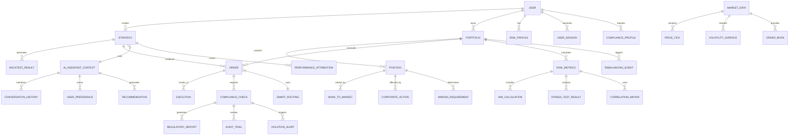
```mermaid
erDiagram
    USER ||--o{ STRATEGY : creates
    USER ||--o{ PORTFOLIO : owns
    USER ||--o{ RISK_PROFILE : has
    USER ||--o{ USER_SESSION : maintains
    USER ||--o{ COMPLIANCE_PROFILE : requires
    
    STRATEGY ||--o{ BACKTEST_RESULT : generates
    STRATEGY ||--o{ ORDER : produces
    STRATEGY }|--|| AI_ASSISTANT_CONTEXT : uses
    STRATEGY ||--o{ PERFORMANCE_ATTRIBUTION : tracks
    
    PORTFOLIO ||--o{ POSITION : contains
    PORTFOLIO ||--o{ ORDER : executes
    PORTFOLIO ||--o{ RISK_METRICS : calculates
    PORTFOLIO ||--o{ REBALANCING_EVENT : triggers
    
    ORDER ||--o{ EXECUTION : results_in
    ORDER ||--o{ COMPLIANCE_CHECK : requires
    ORDER }|--|| SMART_ROUTING : uses
    
    POSITION ||--o{ MARK_TO_MARKET : valued_by
    POSITION ||--o{ CORPORATE_ACTION : affected_by
    POSITION ||--o{ MARGIN_REQUIREMENT : determines
    
    MARKET_DATA ||--o{ PRICE_TICK : contains
    MARKET_DATA ||--o{ VOLATILITY_SURFACE : includes
    MARKET_DATA ||--o{ ORDER_BOOK : provides
    
    RISK_METRICS ||--o{ VAR_CALCULATION : includes
    RISK_METRICS ||--o{ STRESS_TEST_RESULT : contains
    RISK_METRICS ||--o{ CORRELATION_MATRIX : uses
    
    COMPLIANCE_CHECK ||--o{ REGULATORY_REPORT : generates
    COMPLIANCE_CHECK ||--o{ AUDIT_TRAIL : creates
    COMPLIANCE_CHECK ||--o{ VIOLATION_ALERT : triggers
    
    AI_ASSISTANT_CONTEXT ||--o{ CONVERSATION_HISTORY : maintains
    AI_ASSISTANT_CONTEXT ||--o{ USER_PREFERENCE : learns
    AI_ASSISTANT_CONTEXT ||--o{ RECOMMENDATION : generates
```

### Advanced Success Criteria

### Extended Success Metrics Dashboard

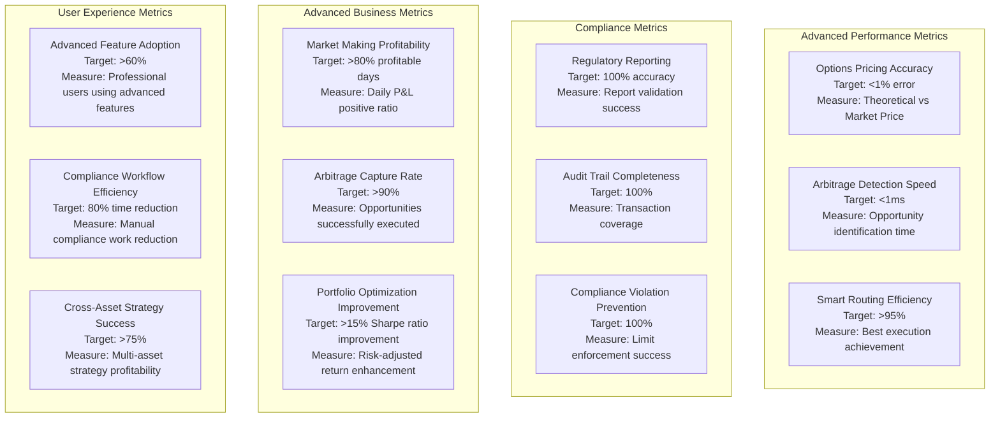
```mermaid
graph TB
    subgraph "Advanced Performance Metrics"
        PERF4[Options Pricing Accuracy<br/>Target: <1% error<br/>Measure: Theoretical vs Market Price]
        PERF5[Arbitrage Detection Speed<br/>Target: <1ms<br/>Measure: Opportunity identification time]
        PERF6[Smart Routing Efficiency<br/>Target: >95%<br/>Measure: Best execution achievement]
    end
    
    subgraph "Compliance Metrics"
        COMP1[Regulatory Reporting<br/>Target: 100% accuracy<br/>Measure: Report validation success]
        COMP2[Audit Trail Completeness<br/>Target: 100%<br/>Measure: Transaction coverage]
        COMP3[Compliance Violation Prevention<br/>Target: 100%<br/>Measure: Limit enforcement success]
    end
    
    subgraph "Advanced Business Metrics"
        BIZ4[Market Making Profitability<br/>Target: >80% profitable days<br/>Measure: Daily P&L positive ratio]
        BIZ5[Arbitrage Capture Rate<br/>Target: >90%<br/>Measure: Opportunities successfully executed]
        BIZ6[Portfolio Optimization Improvement<br/>Target: >15% Sharpe ratio improvement<br/>Measure: Risk-adjusted return enhancement]
    end
    
    subgraph "User Experience Metrics"
        UX4[Advanced Feature Adoption<br/>Target: >60%<br/>Measure: Professional users using advanced features]
        UX5[Compliance Workflow Efficiency<br/>Target: 80% time reduction<br/>Measure: Manual compliance work reduction]
        UX6[Cross-Asset Strategy Success<br/>Target: >75%<br/>Measure: Multi-asset strategy profitability]
    end
```

### Extended Measurable Outcomes

- **SC-016**: Options strategies achieve theoretical pricing accuracy within 1% of market prices
- **SC-017**: Arbitrage opportunities are detected and flagged within 1 millisecond of price discrepancy
- **SC-018**: Smart order routing achieves best execution in >95% of trades across all supported venues
- **SC-019**: Regulatory reports are generated automatically with 100% accuracy and submitted on time
- **SC-020**: Market making strategies achieve profitability on >80% of trading days with controlled risk
- **SC-021**: Portfolio optimization recommendations improve Sharpe ratios by >15% on average
- **SC-022**: Cross-asset arbitrage strategies capture >90% of identified opportunities before they disappear
- **SC-023**: Compliance workflows reduce manual oversight time by 80% while maintaining 100% accuracy
- **SC-024**: Advanced users adopt sophisticated features (options, arbitrage, market making) at >60% rate
- **SC-025**: System supports institutional-grade order sizes (>$10M) without significant market impact

### Assumptions

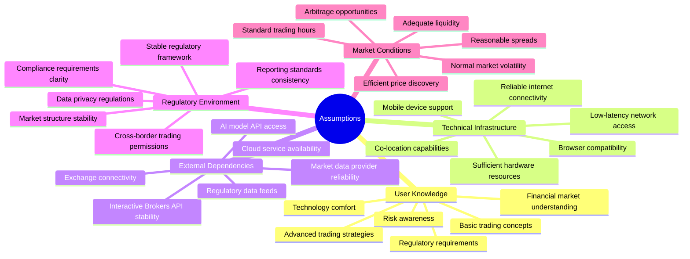
```mermaid
mindmap
  root((Assumptions))
    User Knowledge
      Basic trading concepts
      Financial market understanding
      Risk awareness
      Technology comfort
      Advanced trading strategies
      Regulatory requirements
    Technical Infrastructure
      Reliable internet connectivity
      Sufficient hardware resources
      Browser compatibility
      Mobile device support
      Low-latency network access
      Co-location capabilities
    External Dependencies
      Interactive Brokers API stability
      Market data provider reliability
      Cloud service availability
      AI model API access
      Exchange connectivity
      Regulatory data feeds
    Regulatory Environment
      Stable regulatory framework
      Compliance requirements clarity
      Cross-border trading permissions
      Data privacy regulations
      Market structure stability
      Reporting standards consistency
    Market Conditions
      Normal market volatility
      Adequate liquidity
      Standard trading hours
      Reasonable spreads
      Efficient price discovery
      Arbitrage opportunities
```

- Users have basic understanding of financial markets and trading concepts
- Advanced users understand sophisticated strategies like options, arbitrage, and market making
- Interactive Brokers API will remain stable and accessible for integration
- Market data providers will maintain reliable feeds with acceptable latency
- Users will have sufficient hardware resources for running the platform locally during development
- Regulatory requirements will not significantly change during development period
- Open-source components will maintain backward compatibility through wrapper implementations
- Users will accept paper trading validation before accessing live trading features
- AI model APIs will remain accessible and cost-effective for strategy generation
- Network connectivity will be sufficient for real-time trading operations
- Users will provide necessary authentication credentials for broker account integration
- Exchange connectivity will be available for direct market access and co-location
- Regulatory reporting requirements will remain stable and well-documented
- Market structure will continue to support electronic trading and algorithmic strategies
- Liquidity will be sufficient to support market making and arbitrage strategies