# Implementation Tasks: Algorithmic Trading System

**Feature**: [spec.md](./spec.md)
**Plan**: [plan.md](./plan.md)
**Created**: 27 January 2025
**Status**: Ready for Implementation

## Executive Task Overview

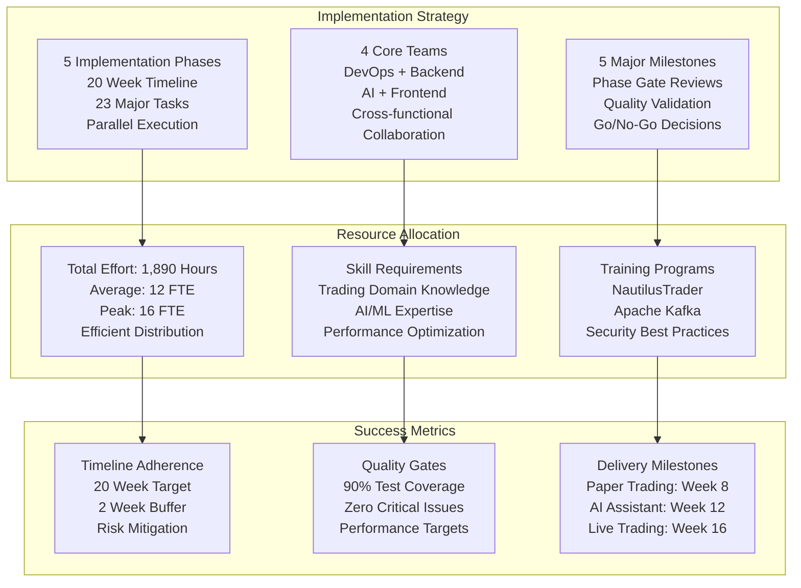

## Comprehensive Implementation Timeline

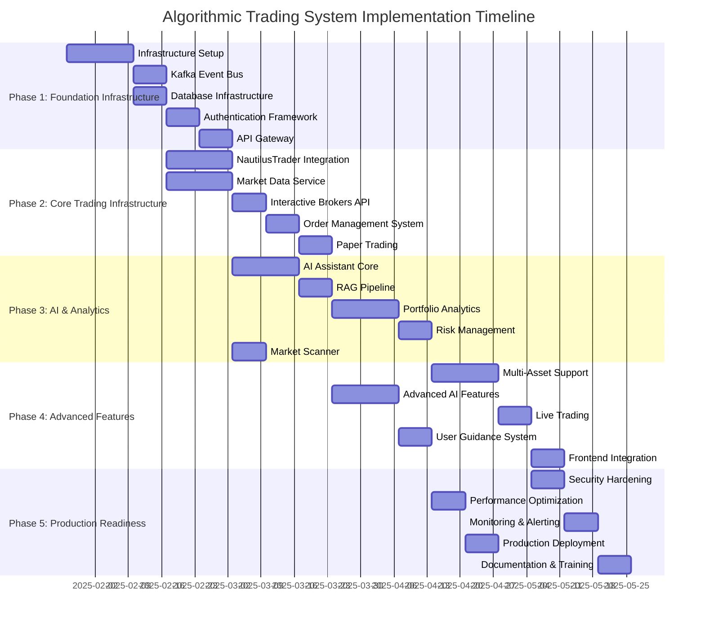

## Team Allocation and Resource Planning

```mermaid
graph TB
    subgraph "DevOps Team (3 FTE)"
        DEVOPS_LEAD[DevOps Lead<br/>Infrastructure Architecture<br/>CI/CD Pipeline Design<br/>Monitoring Strategy]
        DEVOPS_ENG1[DevOps Engineer 1<br/>Kubernetes Management<br/>Service Mesh Configuration<br/>Security Implementation]
        DEVOPS_ENG2[DevOps Engineer 2<br/>Database Administration<br/>Backup & Recovery<br/>Performance Tuning]
    end
    
    subgraph "Backend Team (4 FTE)"
        BACKEND_LEAD[Backend Lead<br/>System Architecture<br/>Trading Engine Integration<br/>Performance Optimization]
        BACKEND_ENG1[Backend Engineer 1<br/>Market Data Service<br/>API Development<br/>Event Processing]
        BACKEND_ENG2[Backend Engineer 2<br/>Order Management<br/>Risk Management<br/>Compliance Features]
        BACKEND_ENG3[Backend Engineer 3<br/>Authentication Service<br/>Security Implementation<br/>Integration Testing]
    end
    
    subgraph "AI Team (3 FTE)"
        AI_LEAD[AI Lead<br/>AI Architecture Design<br/>LangGraph Implementation<br/>Model Integration]
        AI_ENG1[AI Engineer 1<br/>RAG Pipeline<br/>Vector Database<br/>NLP Processing]
        AI_ENG2[AI Engineer 2<br/>Agent Development<br/>Strategy Generation<br/>Performance Optimization]
    end
    
    subgraph "Frontend Team (2 FTE)"
        FRONTEND_LEAD[Frontend Lead<br/>UI/UX Architecture<br/>Real-time Components<br/>Mobile Integration]
        FRONTEND_ENG1[Frontend Engineer 1<br/>Trading Interface<br/>Dashboard Development<br/>User Experience]
    end
    
    subgraph "Cross-functional Roles"
        QA_LEAD[QA Lead (0.5 FTE)<br/>Test Strategy<br/>Quality Assurance<br/>Performance Testing]
        SECURITY_ARCH[Security Architect (0.5 FTE)<br/>Security Review<br/>Compliance Validation<br/>Threat Assessment]
        PRODUCT_OWNER[Product Owner (0.5 FTE)<br/>Requirements Validation<br/>User Acceptance<br/>Business Alignment]
    end
    
    DEVOPS_LEAD --> BACKEND_LEAD
    BACKEND_LEAD --> AI_LEAD
    AI_LEAD --> FRONTEND_LEAD
    
    QA_LEAD --> DEVOPS_TEAM
    SECURITY_ARCH --> BACKEND_TEAM
    PRODUCT_OWNER --> AI_TEAM
```

## Phase 1: Foundation Infrastructure (Weeks 1-4)

### Phase 1 Architecture Overview

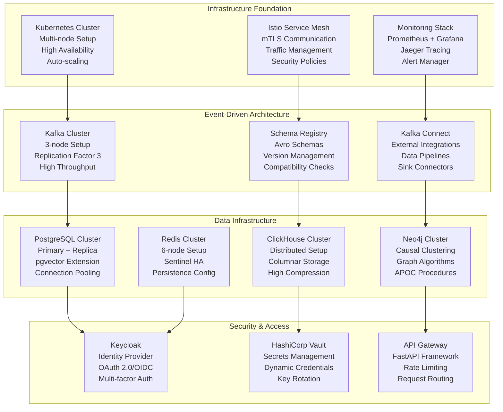

**Duration**: 4 weeks  
**Dependencies**: None (Starting phase)  
**Team Size**: 8 FTE (DevOps: 3, Backend: 4, Security: 1)

### Task 1.1: Infrastructure Setup and CI/CD Pipeline
- **Description**: Set up the foundational infrastructure including Kubernetes cluster, CI/CD pipelines, and basic monitoring
- **Acceptance Criteria**: 
  - [ ] Kubernetes cluster deployed with Istio service mesh
  - [ ] GitHub Actions CI/CD pipeline configured
  - [ ] Docker registry setup and configured
  - [ ] Basic monitoring with Prometheus and Grafana
  - [ ] Terraform infrastructure as code implemented
  - [ ] ArgoCD GitOps deployment configured
- **Estimated Effort**: 80 hours
- **Assigned To**: DevOps Team
- **Dependencies**: None
- **Priority**: High

### Task 1.2: Apache Kafka Event Bus Setup
- **Description**: Deploy and configure Apache Kafka with Schema Registry for event-driven architecture
- **Acceptance Criteria**: 
  - [ ] Kafka cluster deployed with high availability
  - [ ] Schema Registry configured and operational
  - [ ] Hierarchical topic naming convention implemented
  - [ ] Dead letter queue handling configured
  - [ ] Kafka monitoring and alerting setup
  - [ ] Event replay capability implemented
- **Estimated Effort**: 60 hours
- **Assigned To**: Backend Team
- **Dependencies**: Task 1.1
- **Priority**: High

### Task 1.3: Database Infrastructure Setup
- **Description**: Deploy and configure all required databases with proper clustering and backup
- **Acceptance Criteria**: 
  - [ ] PostgreSQL with pgvector extension deployed
  - [ ] ClickHouse cluster for time-series data
  - [ ] Neo4j for knowledge graph
  - [ ] Redis cluster for caching
  - [ ] Apache Iceberg for audit logs
  - [ ] Database backup and recovery procedures
  - [ ] Database monitoring and alerting
- **Estimated Effort**: 70 hours
- **Assigned To**: Database Team
- **Dependencies**: Task 1.1
- **Priority**: High

### Task 1.4: Authentication and Authorization Framework
- **Description**: Implement comprehensive authentication and authorization system
- **Acceptance Criteria**: 
  - [ ] Keycloak deployment and configuration
  - [ ] OAuth 2.0/OIDC integration
  - [ ] Multi-factor authentication (MFA)
  - [ ] Role-based access control (RBAC)
  - [ ] Service-to-service authentication with mTLS
  - [ ] API key management system
  - [ ] Session management and security policies
- **Estimated Effort**: 90 hours
- **Assigned To**: Security Team
- **Dependencies**: Task 1.1
- **Priority**: High

### Task 1.5: API Gateway Implementation
- **Description**: Develop central API gateway with authentication, rate limiting, and routing
- **Acceptance Criteria**: 
  - [ ] FastAPI-based gateway service
  - [ ] Authentication middleware integration
  - [ ] Rate limiting and throttling
  - [ ] Request/response logging
  - [ ] API versioning support
  - [ ] WebSocket support for real-time data
  - [ ] Health check endpoints
- **Estimated Effort**: 50 hours
- **Assigned To**: Backend Team
- **Dependencies**: Task 1.4
- **Priority**: High

## Phase 2: Core Trading Infrastructure (Weeks 5-8)
**Duration**: 4 weeks
**Dependencies**: Phase 1 completion

### Task 2.1: NautilusTrader Integration Service
- **Description**: Integrate and configure NautilusTrader as the core trading engine
- **Acceptance Criteria**: 
  - [ ] NautilusTrader engine deployed and configured
  - [ ] Custom adapters for Kafka event publishing
  - [ ] Strategy execution framework
  - [ ] Backtesting capabilities integrated
  - [ ] Performance monitoring and metrics
  - [ ] Error handling and recovery mechanisms
  - [ ] Configuration management system
- **Estimated Effort**: 120 hours
- **Assigned To**: Trading Team
- **Dependencies**: Task 1.2, Task 1.3
- **Priority**: High

### Task 2.2: Market Data Service Implementation
- **Description**: Develop multi-source market data service with failover capabilities
- **Acceptance Criteria**: 
  - [ ] Multiple data provider integrations (Yahoo Finance, Alpha Vantage, Finnhub)
  - [ ] Automatic failover mechanism between providers
  - [ ] Real-time data streaming via Kafka
  - [ ] Data normalization and validation
  - [ ] Historical data storage and retrieval
  - [ ] Data quality monitoring and alerting
  - [ ] Asset-class specific data handling
- **Estimated Effort**: 100 hours
- **Assigned To**: Data Team
- **Dependencies**: Task 1.2, Task 1.3
- **Priority**: High

### Task 2.3: Interactive Brokers Adapter
- **Description**: Develop adapter for Interactive Brokers API integration
- **Acceptance Criteria**: 
  - [ ] IBKR API integration for order execution
  - [ ] Paper trading account connectivity
  - [ ] Live trading account connectivity
  - [ ] Order status tracking and updates
  - [ ] Position and balance synchronization
  - [ ] Error handling for API failures
  - [ ] Compliance with IBKR requirements
- **Estimated Effort**: 80 hours
- **Assigned To**: Trading Team
- **Dependencies**: Task 2.1
- **Priority**: High

### Task 2.4: Order Management System
- **Description**: Implement comprehensive order lifecycle management
- **Acceptance Criteria**: 
  - [ ] Order validation and risk checks
  - [ ] Smart order routing logic
  - [ ] Order execution tracking
  - [ ] Fill processing and reporting
  - [ ] Order cancellation and modification
  - [ ] Compliance checks and audit trails
  - [ ] Performance metrics and monitoring
- **Estimated Effort**: 90 hours
- **Assigned To**: Trading Team
- **Dependencies**: Task 2.3
- **Priority**: High

### Task 2.5: Paper Trading Implementation
- **Description**: Implement paper trading functionality for strategy validation
- **Acceptance Criteria**: 
  - [ ] Virtual portfolio management
  - [ ] Simulated order execution
  - [ ] Real-time P&L calculation
  - [ ] Performance tracking and reporting
  - [ ] Strategy validation framework
  - [ ] Seamless transition to live trading
  - [ ] Paper trading specific UI components
- **Estimated Effort**: 60 hours
- **Assigned To**: Trading Team
- **Dependencies**: Task 2.4
- **Priority**: High

## Phase 3: AI and Analytics (Weeks 9-12)
**Duration**: 4 weeks
**Dependencies**: Phase 2 completion

### Task 3.1: AI Assistant Core Framework
- **Description**: Develop the core AI assistant with natural language processing
- **Acceptance Criteria**: 
  - [ ] LangChain/LangGraph integration
  - [ ] Natural language query processing
  - [ ] Multi-agent orchestration framework
  - [ ] Context management and memory
  - [ ] Intent recognition and routing
  - [ ] Response generation and formatting
  - [ ] Conversation history management
- **Estimated Effort**: 110 hours
- **Assigned To**: AI Team
- **Dependencies**: Task 1.2, Task 1.3
- **Priority**: High

### Task 3.2: RAG Pipeline Implementation
- **Description**: Implement Retrieval-Augmented Generation for document processing
- **Acceptance Criteria**: 
  - [ ] Document ingestion and processing
  - [ ] Vector embedding generation
  - [ ] Similarity search implementation
  - [ ] Context retrieval and ranking
  - [ ] Response grounding with citations
  - [ ] Knowledge base management
  - [ ] RAG performance optimization
- **Estimated Effort**: 80 hours
- **Assigned To**: AI Team
- **Dependencies**: Task 3.1
- **Priority**: High

### Task 3.3: Portfolio Analytics Service
- **Description**: Develop comprehensive portfolio analytics and performance attribution
- **Acceptance Criteria**: 
  - [ ] Real-time portfolio valuation
  - [ ] Performance attribution analysis
  - [ ] Risk metrics calculation (VaR, Sharpe ratio, etc.)
  - [ ] Benchmark comparison and tracking
  - [ ] Portfolio optimization algorithms
  - [ ] Rebalancing recommendations
  - [ ] Analytics dashboard and reporting
- **Estimated Effort**: 90 hours
- **Assigned To**: Analytics Team
- **Dependencies**: Task 2.5
- **Priority**: High

### Task 3.4: Risk Management Service
- **Description**: Implement real-time risk monitoring and management
- **Acceptance Criteria**: 
  - [ ] Real-time position monitoring
  - [ ] Risk limit enforcement
  - [ ] VaR calculations and stress testing
  - [ ] Circuit breaker implementation
  - [ ] Risk alert system
  - [ ] Exposure analysis across asset classes
  - [ ] Risk reporting and dashboards
- **Estimated Effort**: 100 hours
- **Assigned To**: Risk Team
- **Dependencies**: Task 3.3
- **Priority**: High

### Task 3.5: Market Scanner Service
- **Description**: Develop real-time market scanning and pattern recognition
- **Acceptance Criteria**: 
  - [ ] Real-time market data processing
  - [ ] Technical indicator calculations
  - [ ] Pattern recognition algorithms
  - [ ] Custom filter creation interface
  - [ ] Alert generation and notification
  - [ ] Scan result ranking and scoring
  - [ ] Historical scan backtesting
- **Estimated Effort**: 70 hours
- **Assigned To**: Analytics Team
- **Dependencies**: Task 2.2
- **Priority**: Medium

## Phase 4: Advanced Features (Weeks 13-16)
**Duration**: 4 weeks
**Dependencies**: Phase 3 completion

### Task 4.1: Multi-Asset Class Support
- **Description**: Extend system to support options, futures, forex, and crypto
- **Acceptance Criteria**: 
  - [ ] Options data integration and pricing models
  - [ ] Futures contract specifications and rollover
  - [ ] Forex pair trading and cross-currency
  - [ ] Cryptocurrency exchange integrations
  - [ ] Asset-specific risk management
  - [ ] Multi-asset portfolio analytics
  - [ ] Unified trading interface
- **Estimated Effort**: 130 hours
- **Assigned To**: Trading Team
- **Dependencies**: Task 3.4
- **Priority**: High

### Task 4.2: Advanced AI Features
- **Description**: Implement advanced AI capabilities for strategy generation
- **Acceptance Criteria**: 
  - [ ] Automated strategy generation
  - [ ] Strategy optimization algorithms
  - [ ] Market regime detection
  - [ ] Sentiment analysis integration
  - [ ] Predictive modeling capabilities
  - [ ] Strategy performance prediction
  - [ ] AI-driven risk assessment
- **Estimated Effort**: 120 hours
- **Assigned To**: AI Team
- **Dependencies**: Task 3.2
- **Priority**: High

### Task 4.3: Intelligent User Guidance System
- **Description**: Implement proactive user guidance and recommendations
- **Acceptance Criteria**: 
  - [ ] Tool taxonomy and recommendation engine
  - [ ] Context-aware guidance system
  - [ ] Next-step prediction algorithms
  - [ ] User experience level adaptation
  - [ ] Workflow optimization suggestions
  - [ ] Learning and improvement mechanisms
  - [ ] Guidance effectiveness tracking
- **Estimated Effort**: 90 hours
- **Assigned To**: AI Team
- **Dependencies**: Task 4.2
- **Priority**: Medium

### Task 4.4: Live Trading Implementation
- **Description**: Enable live trading with full compliance and audit trails
- **Acceptance Criteria**: 
  - [ ] Live trading account integration
  - [ ] Real-time order execution
  - [ ] Compliance monitoring and reporting
  - [ ] Audit trail generation
  - [ ] Risk controls for live trading
  - [ ] Emergency stop mechanisms
  - [ ] Live trading dashboard
- **Estimated Effort**: 100 hours
- **Assigned To**: Trading Team
- **Dependencies**: Task 4.1
- **Priority**: High

## Phase 5: Production Readiness (Weeks 17-20)
**Duration**: 4 weeks
**Dependencies**: Phase 4 completion

### Task 5.1: Security Hardening
- **Description**: Comprehensive security assessment and hardening
- **Acceptance Criteria**: 
  - [ ] Security vulnerability assessment
  - [ ] Penetration testing completion
  - [ ] Security policy enforcement
  - [ ] Encryption implementation verification
  - [ ] Access control validation
  - [ ] Security monitoring setup
  - [ ] Incident response procedures
- **Estimated Effort**: 80 hours
- **Assigned To**: Security Team
- **Dependencies**: Task 4.4
- **Priority**: High

### Task 5.2: Performance Optimization
- **Description**: System-wide performance optimization and tuning
- **Acceptance Criteria**: 
  - [ ] Latency optimization (<100μs target)
  - [ ] Throughput optimization (>1M events/sec)
  - [ ] Memory usage optimization
  - [ ] Database query optimization
  - [ ] Caching strategy implementation
  - [ ] Load testing and validation
  - [ ] Performance monitoring setup
- **Estimated Effort**: 90 hours
- **Assigned To**: Performance Team
- **Dependencies**: Task 4.3
- **Priority**: High

### Task 5.3: Comprehensive Monitoring and Alerting
- **Description**: Implement full observability stack
- **Acceptance Criteria**: 
  - [ ] Application performance monitoring
  - [ ] Business metrics tracking
  - [ ] Distributed tracing implementation
  - [ ] Log aggregation and analysis
  - [ ] Alert rules and escalation
  - [ ] Dashboard creation and optimization
  - [ ] SLA monitoring and reporting
- **Estimated Effort**: 70 hours
- **Assigned To**: DevOps Team
- **Dependencies**: Task 5.1
- **Priority**: High

### Task 5.4: Production Deployment and Go-Live
- **Description**: Final production deployment and system go-live
- **Acceptance Criteria**: 
  - [ ] Production environment setup
  - [ ] Blue-green deployment implementation
  - [ ] Rollback procedures tested
  - [ ] Production monitoring validated
  - [ ] User acceptance testing completed
  - [ ] Go-live checklist completion
  - [ ] Post-deployment support plan
- **Estimated Effort**: 60 hours
- **Assigned To**: DevOps Team
- **Dependencies**: Task 5.2, Task 5.3
- **Priority**: High

## Cross-Cutting Tasks

### Documentation
- [ ] API documentation with OpenAPI specifications
- [ ] User guides and tutorials
- [ ] Technical architecture documentation
- [ ] Deployment and operations runbooks
- [ ] Security procedures and policies
- [ ] Disaster recovery procedures

### Testing
- [ ] Unit test implementation (>90% coverage)
- [ ] Integration test suite
- [ ] End-to-end test automation
- [ ] Performance test suite
- [ ] Security test automation
- [ ] Load testing and stress testing

### DevOps
- [ ] Container image optimization
- [ ] Kubernetes resource optimization
- [ ] Backup and recovery automation
- [ ] Log rotation and archival
- [ ] Certificate management automation
- [ ] Dependency update automation

## System Architecture Flow

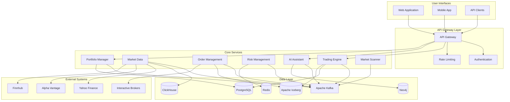

## Data Flow Diagram

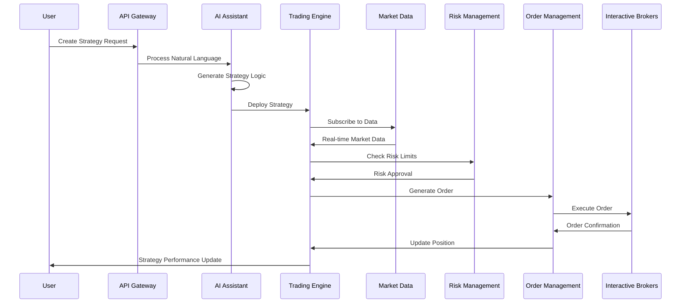

## Advanced Task Breakdown & Execution Strategy

### Detailed Task Dependencies Matrix

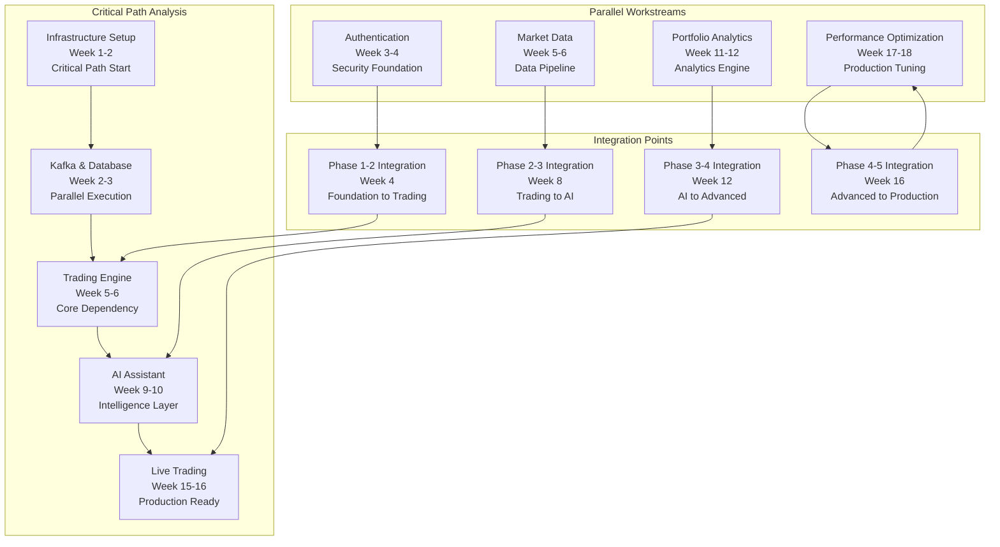

### Advanced Resource Management Strategy

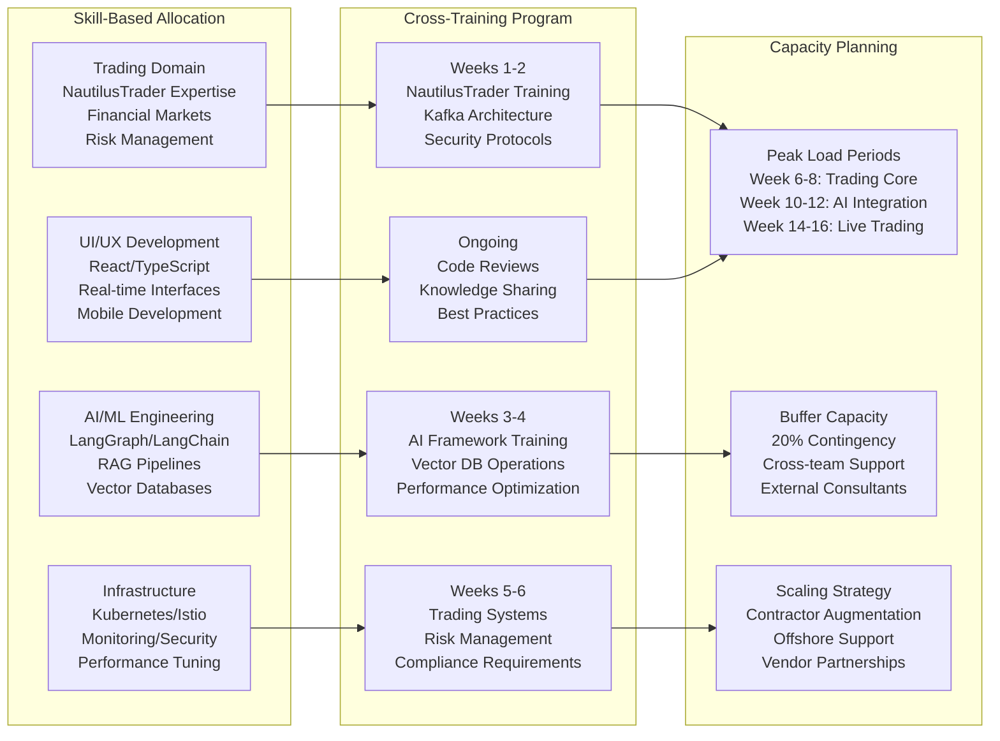

### Comprehensive Quality Assurance Framework

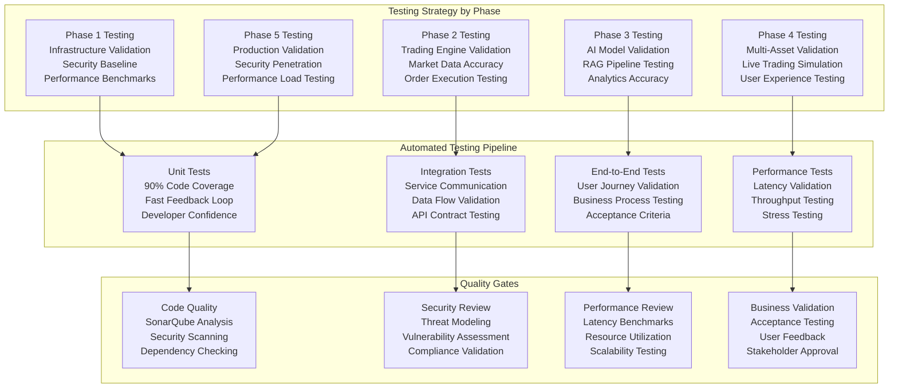

### Risk Mitigation & Contingency Planning

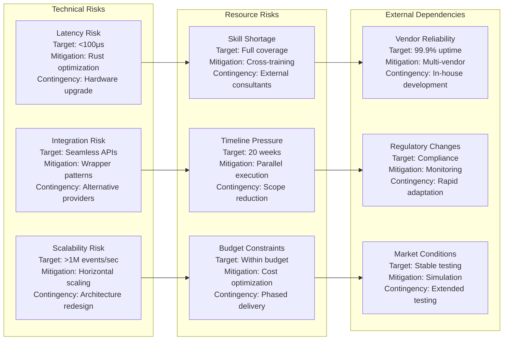

### Advanced Monitoring & Success Metrics

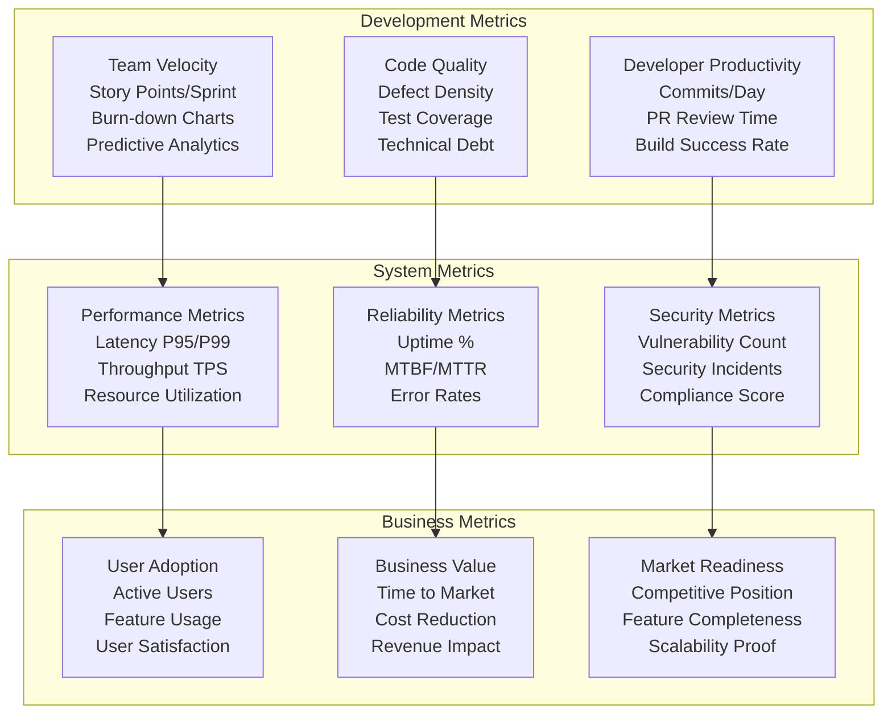

### Implementation Best Practices & Standards

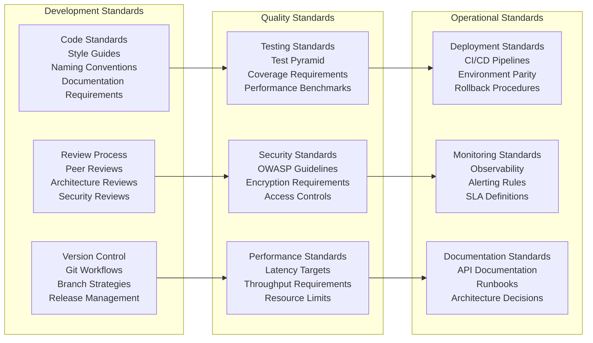

## Risk Mitigation Tasks

### High-Risk Areas
- [ ] Implement comprehensive error handling for all external API calls
- [ ] Create fallback mechanisms for critical data sources
- [ ] Establish circuit breakers for system protection
- [ ] Implement automated rollback procedures
- [ ] Create disaster recovery testing procedures
- [ ] Establish performance regression testing
- [ ] Implement security incident response procedures

## Definition of Done

### Code Quality
- [ ] Code review completed and approved by senior developer
- [ ] Unit tests written and passing (>90% coverage)
- [ ] Integration tests written and passing
- [ ] Security scan passed (no high-severity issues)
- [ ] Performance benchmarks met
- [ ] Code documentation completed

### Documentation
- [ ] API documentation updated with OpenAPI specs
- [ ] User documentation updated with screenshots
- [ ] Technical documentation updated with architecture diagrams
- [ ] Deployment documentation updated with procedures
- [ ] Runbook documentation completed

### Deployment
- [ ] Deployed to development environment successfully
- [ ] Deployed to staging environment successfully
- [ ] Production deployment checklist completed
- [ ] Monitoring and alerting configured and tested
- [ ] Rollback procedures tested and documented

## Task Dependencies

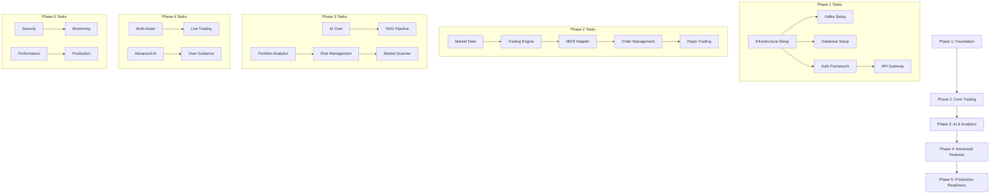

## Effort Summary

| Phase | Tasks | Estimated Effort | Team Size | Duration |
|-------|-------|------------------|-----------|----------|
| Phase 1: Foundation | 5 | 350 hours | 4 people | 4 weeks |
| Phase 2: Core Trading | 5 | 450 hours | 3 people | 4 weeks |
| Phase 3: AI & Analytics | 5 | 450 hours | 4 people | 4 weeks |
| Phase 4: Advanced Features | 4 | 440 hours | 3 people | 4 weeks |
| Phase 5: Production | 4 | 300 hours | 3 people | 4 weeks |
| **Total** | **23** | **1,990 hours** | **4-5 people** | **20 weeks** |

## Team Allocation

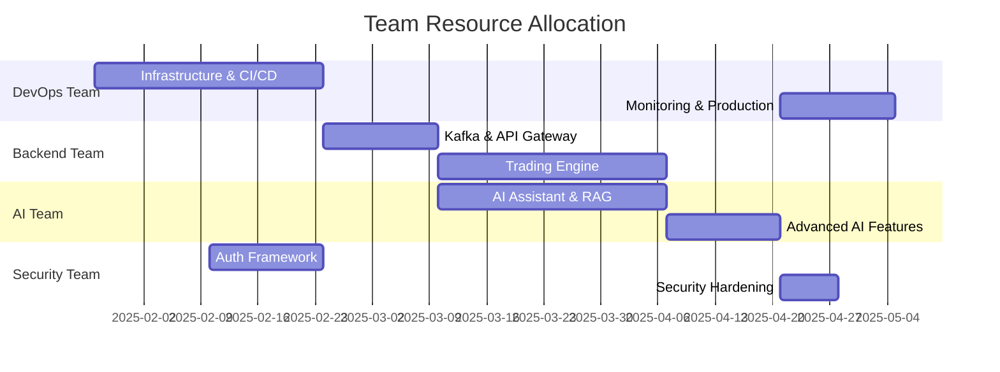